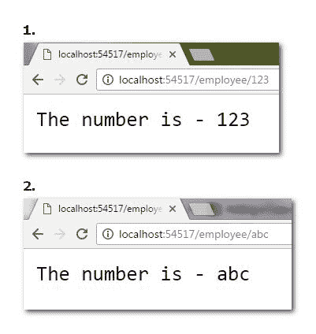
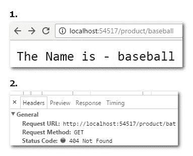
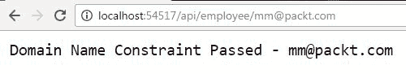
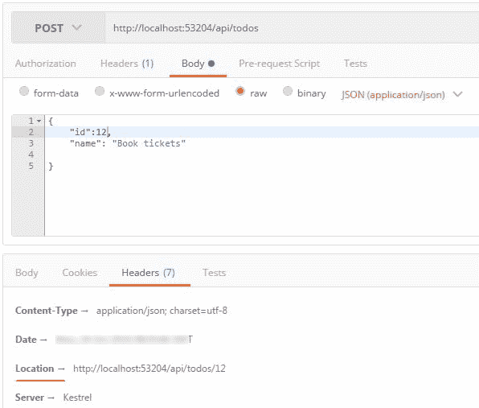

# 实现路由

我们使用**URL**（**统一资源定位器**）访问 web 上的代码资源。例如，当您看到对`www.dummysite.com/pages/profile.aspx`的请求时，很容易推断`profile.aspx`实际存在于网站 dummysite.com 上的 pages 文件夹中。

请注意，在我们的示例中，URL 和物理文件有直接的关系——当 web 服务器接收到此文件的请求时，执行代码，并返回响应以在浏览器上显示。

当使用基于 MVC 的框架（如 ASP.NETCore）时，URL 会使用一种称为路由的方法映射到控制器类及其操作方法。

在本章中，我们将研究以下主题：

*   引入路由
*   路由中间件
*   路线生成器
*   基于约定和基于模板的路由
*   基于属性的路由
*   路线约束
*   链接生成
*   路由的最佳实践

# 引入路由

在第四章*控制器、动作和模型中*我们学习了很多关于控制器和动作的知识。任何 ASP.NET Web API 项目都将有一个或多个控制器，这些控制器具有许多基于 HTTP 谓词（如 GET、POST、PUT 和 DELETE）的操作方法。

当我们在[第 3 章](03.html#20R681-b5b28eac0b2e417189a3e09b61402d4f)*ASP.NET Core Web API 剖析*中创建一个基本的 ASP.NET Core Web API 并运行该应用时，我们在浏览器中看到 URL 为`http://localhost:5000/api/values`——它显示了来自值控制器的 JSON 响应。

这里出现了如下几个问题：

*   项目如何知道应该加载特定的控制器和操作方法？
*   如果我在真实场景中有许多控制器和动作方法会怎么样？我们如何指向特定的控制器？
*   正确服务 HTTP 请求的机制是什么？

将传入 HTTP 请求映射到其相应控制器的操作方法的机制称为路由。它是 ASP.NET Core MVC/Web API 的关键组件之一。如果没有路由机制，ASP.NET（MVC/Web API）将无法运行应用和服务请求。路由解决了上述所有问题。

# 路由中间件

在 ASP.NET Core世界中，每个 HTTP 请求和响应都必须通过各种中间件。`Startup`类的`Configure`方法配置处理请求的管道，并对请求采取适当的操作。

ASP.NET Core 提供路由中间件来执行将请求映射到相应控制器和操作方法的任务。让我们了解一下这个中间件。

创建一个空的 ASP.NET Core项目，通过手动编辑`*.csproj`或 NuGet 将`Microsoft.AspNetCore.All`添加到其中。在依赖项中添加以下包详细信息，以便恢复并准备使用：

```cs
    > " Microsoft.AspNetCore.All ": "2.0.0-preview2-final" 

```

打开`Startup`类添加以下代码，查看路由器中间件的运行情况：

```cs
    using Microsoft.AspNetCore.Builder; 
    using Microsoft.AspNetCore.Hosting; 
    using Microsoft.AspNetCore.Http; 
    using Microsoft.Extensions.DependencyInjection; 
    using Microsoft.AspNetCore.Routing; 

    namespace BasicRoutes  
    { 
      public class Startup 
      {         
        public void ConfigureServices(IServiceCollection services) 
        { 
           // Adding Router Middleware 
           services.AddRouting(); 
        }  

        public void Configure(IApplicationBuilder app, 
          IHostingEnvironment env, ILoggerFactory loggerFactory) 
        { 
          //HTTP pipeline now handles routing 
          app.UseRouter(new RouteHandler( 
            context => context.Response.WriteAsync("Mastering Web API!!") 
          )); 
        } 
      } 
    } 

```

您可以按如下方式分解前面的代码：

*   `Services.AddRouting()`增加要使用的路由中间件。
*   `app.UseRouter`处理 HTTP 请求的路由。需要`RouteHandler`来处理请求。这里我们只是用一个字符串来写响应。

对于传入的任何请求，管道都需要有人来处理。这是由`RouteHandler`完成的；每个路由都应该有一个处理程序。

运行应用时（按*F5*，浏览器显示字符串 Mastering Web API，如本屏幕截图所示：


Basic example of routing middleware

这是 ASP.NET Core中最基本的路由示例。由于管道仅对其进行路由，因此使用任何 URL 访问应用都将给出相同的响应。

# RouteBuilder 类

`RouteBuilder`类帮助我们构建定制路线，并在请求到达时处理它们。MVC 还使用这个类来构建控制器的默认路由机制 actions。

在上一个示例中，我们创建了一个服务于任何路由的基本路由。现在，我们将使用不同的 HTTP 谓词（如 GET 和 POST）创建自定义路由。

在`Startup.cs`的`Configure`方法中为自定义路由生成器复制以下代码：

```cs
    public void Configure(IApplicationBuilder app, IHostingEnvironment env,
    ILoggerFactory loggerFactory) 
    { 
      var routes = new RouteBuilder(app) 
      .MapGet("greeting", context => context.Response.WriteAsync("Good morning!!
        Packt readers.")) 
      .MapGet("review/{msg}", context => context.Response.WriteAsync(
        $"This book is , {context.GetRouteValue("msg")}")) 
      .MapPost("packtpost", context => context.Response.WriteAsync(
        "Glad you did Post !")) 
      .Build(); 
      app.UseRouter(routes); 
    } 

```

您可以按如下方式分解前面的代码：

*   实例化一个新的`RouteBuilder`类。
*   我们使用`MapGet`设置问候路径，以使用 HTTP 动词 GET 处理客户端请求。
*   我们使用`MapGet`设置审核路径，用`RouteData`或`RouteValue`处理客户请求。请求处理程序委托读取消息。
*   使用`MapPost`，我们得到处理客户端 POST 请求的`packtpost`路径。


Route Builder using MapGet

# 地图路线

`MapRoute`是一种扩展方法，使用指定的名称和模板向`IRouteBuilder`添加路由。需要增加一个`DefaultHandler`进行进路办理。

下面的代码显示了如何定义要与`MapRoute`一起使用的`defaultHandler`：

```cs
    var routeHandler = new RouteHandler(context =>  
    { 
      var data = context.GetRouteData().Values; 
      return context.Response.WriteAsync("Controller Name is " +
        data["controller"].ToString()); 
    }); 

    var routes = new RouteBuilder(app, routeHandler) 
    .MapRoute("packt", "{controller}/{action}") 
    .Build(); 
    app.UseRouter(routes); 

```

# ASP.NET Core Web API 和路由

到目前为止，我们还看到了路由的基础知识，没有 MVC 或 web API，而是以中间件路由器、RouteBuilder 和 MapRoute 的形式出现。必须理解这些概念是如何协同工作的。

当我们创建一个 ASP.NET Core应用作为 web API 时，需要了解一些与路由相关的功能。

在[第 3 章](03.html#20R681-b5b28eac0b2e417189a3e09b61402d4f)*ASP.NET Core Web API 剖析*中，我们创建了一个简单的 Web API 项目；查看`Startup`类的`Configure`和`ConfigureServices`方法，只添加了 MVC 中间件和服务。没有提到路由中间件。

现在出现的问题是 WebAPI 项目如何完成所有需要的路由。答案在于在`Configure`方法中添加的 MVC 中间件`app.UseMvc()`。

`UseMvc()`是微软 ASP.NET Core团队编写的 MVC 和 web API 项目的中间件。该中间件通过相同的代码库确认 MVC 和 WebAPI 的工作。

以下代码是 GitHub 上的 ASP.NET MVC 开源项目（[的一部分 https://github.com/aspnet/Mvc](https://github.com/aspnet/Mvc) ：

```cs
    public static IApplicationBuilder UseMvc( 
      this IApplicationBuilder app, 
      Action<IRouteBuilder> configureRoutes) 
      { 
        if (app == null) 
        { 
          throw new ArgumentNullException(nameof(app)); 
        } 
        if (configureRoutes == null) 
        { 
          throw new ArgumentNullException(nameof(configureRoutes)); 
        } 
        if (app.ApplicationServices.GetService(typeof(MvcMarkerService))
          == null) 
        { 
          throw new InvalidOperationException(
            Resources.FormatUnableToFindServices( 
              nameof(IServiceCollection), 
            "AddMvc", 
            "ConfigureServices(...)")); 
        } 
        var middlewarePipelineBuilder =
          app.ApplicationServices.GetRequiredService
          <MiddlewareFilterBuilder>(); 
        middlewarePipelineBuilder.ApplicationBuilder = app.New(); 
        var routes = new RouteBuilder(app) 
        { 
          DefaultHandler =
            app.ApplicationServices.GetRequiredService<MvcRouteHandler>(), 
        }; 
        configureRoutes(routes); 
        routes.Routes.Insert(0,
          AttributeRouting.CreateAttributeMegaRoute(
            app.ApplicationServices)); 
        return app.UseRouter(routes.Build());} 

```

您可以按如下方式分解前面的代码：

*   `UseMvc`方法创建 RouteBuilder 的一个实例。
*   `RouteBuilder`需要`DefaultHandler`处理路由；这是由`MvcRouteHandler`类提供的。
*   类`MvcRouteHandler`实现`IRouter`，完成 URL 模式匹配和生成 URL 的工作。
*   `configureRoutes`是配置路由的动作方式。在前面的示例中，我们完成了相同的任务。
*   `AttributeRouting`作为`IRouter`集合的第一个条目添加。
*   `CreateAttributeMegaRoute`方法扫描所有控制器动作并自动建立路由。这是`UseMvc`的重要行之一。
*   最后，使用`UseRouter`构建路由并添加到路由器中间件。这与本章开头执行的任务类似。

`UseMvc`中的`AttributeRouting.CreateAttributeMegaRoute`在 ASP.NET Core MVC 和 web API 应用中默认提供属性路由。

# 基于约定的路由

在 ASP.NET Web API 的第一个版本中，路由机制是基于约定的。这种类型的路由具有一个或多个路由模板的参数化字符串定义。

ASP.NET Core仍然支持这种类型的路由；下面的代码片段显示了如何实现这一点：

```cs
    public void Configure(IApplicationBuilder app) 
    { 
      //Rest of code removed for brevity 
      app.UseMvc(routes => 
      { 
        // route1 
        routes.MapRoute( 
          name: "packtroute1", 
          template: "api/{controller}/{id}" 
        ); 
        // route2 
        routes.MapRoute( 
          name: "packtroute1", 
          template: "testpackt", 
          defaults: new { controller = "Books", action = "Index" } 
        ); 
      }); 
    } 

```

基于约定的路由方式不受欢迎，原因如下：

*   它不支持 web API 世界中常见的某些类型的 URL 模式
*   具有子资源的资源很难创建。例如，`/products/1/orders/2/reviews`
*   当 web API 有许多控制器和操作时，它是不可伸缩的

# 基于模板的路由

在使用 web API 时，您可能会遇到多种 URI，如`/product/12`、`/product/12/orders`、`/departments/`、`/books`等等。

在 WebAPI 世界中，它们被称为路由——一个描述 URI 模板的字符串。例如，可以在此 URI 模式上形成一个示例路由：`/products/{id}/orders`。

这里有几点需要注意：

*   URI 模板由文本和参数组成
*   在前面的示例中，产品和订单是文本
*   大括号{}中的任何内容都称为参数--`{id}`就是这样一个例子
*   路径分隔符（`/`必须是路由模板的一部分——URI 将`/`理解为路径分隔符
*   文本、路径分隔符和参数的组合应与 URI 模式匹配

使用 web API 时，文本将是控制器或方法。路由参数在使路由模板具有多用途方面起着重要作用。大括号中的参数可以发挥多用途作用，如下所示：

*   即使管线模板具有参数，也可以通过在模板中放置“？”使其成为可选参数。例如，`/books/chapters/{numb?}`——这里，如果我们不提供`numb`，那么它将加载所有章节，如果我们提供 numb，那么将加载相关章节。
*   一个管线模板可以有多个管线参数。
*   路由参数可以使用`*`作为前缀，以便绑定到 URI 的其余部分。这种参数称为`catch-all`参数。
*   可以为管线参数提供默认值。此默认值将在未为其提供 route 参数时生效。例如，`"{controller=Home}/{action=Index}"`将在`Home`控制器中加载`Index`动作方法。
*   管线参数可以具有约束，以确保以正确的方式生成管线。例如，`/customers/{id:int}/services/`。`{id:int}`参数表示`id`必须是整数，否则 web API 响应 404 响应类型。

以下是在`Startup class`的`Configure`方法中定义的几个示例路由模板：

```cs
    public void Configure(IApplicationBuilder app) 
    { 
      app.UseMvc(routes => 
      { 
        // Route Template with default values and optional parameter 
        routes.MapRoute( 
          name: "default", 
          template: "{controller=Home}/{action=Index}/{id?}"); 

        //Route Template with default value, parameter constrainst 
        routes.MapRoute( 
          name: "alternate_route", 
          template: "{controller}/{action}/{id:int}/{guid:string}", 
          defaults: new { controller = "Dashboard" }); 

        // Route Template with no default values or parameters 
        routes.MapRoute( 
          name: "simple_route", 
          template: "{controller}/{action}");                     
      }); 
    } 

```

# 基于属性的路由

在.NET 编程世界中，将各种元素（如类、方法和枚举）的声明信息添加到程序中的标记称为属性。

ASP.NET Web API 2 引入了基于属性的路由的概念，为 Web API 中的 URI 提供了更多控制。这有助于我们轻松构建具有资源层次结构的 URI。

在 ASP.NET Core应用中，默认情况下提供基于属性的路由。在`Startup`类的`Configure`方法中，`app.UseMvc()`行表示在请求处理管道中包含 MVC 中间件。

在*ASP.NET Core Web API 和路由*一节中，我们解释了默认情况下如何实现基于属性的路由，这与 ASP.NET Web API 2 不同，后者必须在配置中显式启用。

`AttributeRouting.CreateAttributeMegaRoute`重复执行所有 MVC 控制器操作并自动构建路由的繁重工作。

当我们在[第 3 章](03.html#20R681-b5b28eac0b2e417189a3e09b61402d4f)*ASP.NET Core Web API 剖析*中创建演示项目时，它是使用 ASP.NET Core工具附带的 Web API 模板创建的。

让我们了解演示项目中`ValuesController.cs`的属性路由：

```cs
    using System.Collections.Generic; 
    using Microsoft.AspNetCore.Mvc; 

    namespace MyFirstCoreAPI.Controllers 
    { 
      [Route("api/[controller]")] 
      public class ValuesController : Controller 
      {   
        // GET api/values 
        [HttpGet] 
        public IEnumerable<string> Get() 
        { 
          return new string[] { "value1", "value2" }; 
        } 

        // GET api/values/5 
        [HttpGet("{id}")] 
        public string Get(int id) 
        { 
          return "value is " + id; 
        } 

        // POST api/values 
        [HttpPost] 
        public void Post([FromBody]string value) 
        { 
        } 

        // PUT api/values/5 
        [HttpPut("{id}")] 
        public void Put(int id, [FromBody]string value) 
        { 
        } 

        // DELETE api/values/5 
        [HttpDelete("{id}")] 
        public void Delete(int id) 
        { 
        } 
      }  
    } 

```

`ValuesController`类用`Route`属性修饰为`[Route("api/[controller]")]`。

在运行应用时，当我们导航到`http://localhost:5000/api/values/`时，您可以看到结果，如以下屏幕截图所示：


Attribute Route in action

在控制器上定义属性路由；我们需要访问 URL，如前面的屏幕截图所示。`/values`为控制器名称，测试时根据`HttpGet`动词执行动作`Get`和`Get(int id)`。

# RESTful 应用的属性路由

在语法上，属性路由定义如下：

`[HttpMethod("Template URI", Name?, Order?)]`

*   基于 HttpVerbs，ASP.NET Core 提供了这些用于属性路由的 HttpMethods--`HttpDeleteAttribute`、`HttpGetAttribute`、`HttpHeadAttribute`、`HttpOptionsAttribute`、`HttpPatchAttribute`、`HttpPostAttribute`和`HttpPutAttribute`。
*   `Template URI`是描述路由的字符串。
*   `Name`——属性路由的可选名称。它通常在操作似乎是重载方法时使用。
*   命令有助于在控制器中执行重载 HTTP 方法时优先。顺序取决于文字、参数、约束以及顺序。这是一个可选参数。

考虑到这些语法，让我们创建一个新的 web API 控制器`PacktController`，添加操作方法，并为其添加属性路由：

```cs
    using Microsoft.AspNetCore.Mvc;  
    using System.Collections.Generic; 

    namespace MyFirstCoreAPI.Controllers 
    { 
      [Route("api/[controller]")] 
      public class PacktController : Controller 
      { 
        // Get: api/packt/show 
        [HttpGet("Show")] 
        public string Show() 
        { 
          return "I am Packt Show !!"; 
        } 

        // GET api/packt 
        [HttpGet] 
        public IEnumerable<string> Get() 
        { 
          return new string[] { "Packt 1", "Packt 2" }; 
        } 

        // GET: /api/packt/13 
        [HttpGet("{id:int}", Name = "GetPacktById", Order = 0)] 
        public string Get(int id) 
        { 
          return "Response from GetPacktById" + id; 
        }         

        // POST: /api/packt 
        [HttpPost] 
        public IActionResult Post() 
        { 
          return Content("Created Post !!"); 
        } 

        // POST: /api/packt/packtpost 
        [HttpPost("packtpost")] 
        public IActionResult Post([FromBody]string chapterName) 
        { 
          return Content("You invoked packt post"); 
        } 

        // PUT api/packt/5 
        [HttpPut("{id}")] 
        public void Put(int id, [FromBody]string value) 
        { 
        } 

        // DELETE api/packt/15 
        [HttpDelete("{id}")] 
        public void Delete(int id) 
        { 
        } 
      } 
    }  

```

您可以按如下方式分解前面的代码：

`PacktController`类有以下七种动作方法：

*   `Show()`：使用路由`/api/packt/show`上的`HttpGet`请求调用。
*   `Get()`：使用路由`/api/packt`上的`HttpGet`请求调用。
*   `Get(int id)`：使用路由`/api/packt/13`上的`HttpGet`请求调用。此处提供了路由名称。
*   `Post()`：使用路由`/api/packt/`上的`HttpPost`请求调用。
*   `Post([FromBody]string chapterName)`：使用路由`/api/packt/packtpost`上的`HttpPost`请求调用。
*   `Put()`：使用路由`api/packt/12`上的`HttpPut`请求调用。提供路由参数 ID，因为`PUT`对应更新功能，对现有记录进行更新。
*   `Delete()`：使用路由`api/packt/12`上的`HttpDelete`请求调用。要删除任何记录，我们需要传递其唯一标识；因此，需要传递 ID route 参数。

# 多路线

有时，我们可能会得到路由需求，例如应用于同一控制器或操作方法的不同路由。起初，这似乎非常令人惊讶，但在大型项目中，我们可能需要这种路由。

通过在控制器上放置多个路由属性，可以实现多个路由，如以下代码段所示：

```cs
    [Route("Stocks")] 
    [Route("[controller]")] 
    public class PacktsController : Controller 
    { 
      [HttpGet("Check")]      
      [HttpGet("Available")] 
      public string GetStock() 
      { 
         return "Its multiple route"; 
      } 
    } 

```

运行应用以查看正在运行的多个路由。您可以通过访问浏览器上的端点`/api/stocks/check or /api/packts/available`来验证多条路由是否正常工作。

# 路由约束

ASP.NET Core作为 MVC 或 web API 应用，支持属性和集中式路由机制。可以使用 Route 属性直接在控制器和操作上设置路由，也可以通过在一个位置创建和映射所有路由来设置路由。

我们已经看到，可以使用或不使用管线参数创建不同的管线模板。当路由模板中包含参数时，有助于构建优秀的路由模式。但是路线参数的存在也会引起问题；我们来看一个例子：

```cs
    public void Configure(IApplicationBuilder app, IHostingEnvironment env,
      ILoggerFactory loggerFactory) 
    { 
      var routeBuilder = new RouteBuilder(app); 
      routeBuilder.MapGet("employee/{id}", context => 
      { 
        var idValue = context.GetRouteValue("id");                 
        return context.Response.WriteAsync($"The number is - {idValue}"); 
      }); 

      var routes = routeBuilder.Build(); 
      app.UseRouter(routes); 
    } 

```

您可以按如下方式分解前面的代码：

*   提供模板为`employee/{id}`的基本路由，其中`{id}`为路由参数
*   routes 模板用于通过传递 ID 来获取员工列表
*   `GetRouteValue`读取`{id}`参数，并返回响应



Route Parameters without constraints

运行应用以查看提供路由参数的不同方式。看起来一切都在运转——事实上，它运转得很好，但问题仍然存在。

这里，我们假设员工将其 ID 存储为整数，因为大多数组织使用整数作为员工 ID，例如 John 的员工 ID 为 23，Sarah 的员工 ID 为 45。当路由参数 ID 作为整数传递时，一切正常，但是如果`{id}`作为字符串传递，会怎么样，如上图所示？

应用确实接受参数，并且响应良好。但是，在处理数据库源的实际项目时，作为字符串提供的 ID 将破坏应用，并导致异常或错误。

一个明显的问题是，如果在路由参数中传递了错误的数据，我们如何限制对此类路由参数的请求处理。答案是路线限制。

如果参数未能满足应用于它们的约束条件，路由约束可以帮助我们限制请求处理。

可通过在参数上使用`:`添加参数约束。例如，`"employee/{id:int}"`

当带有路由参数约束的请求发送无效类型时，返回的 HTTP 响应为 404（未找到）。是的，由于路由限制，ASP.NET Core 将失败的 HTTP 请求响应为 404（未找到）。请求处理不会影响处理请求的控制器。

让我们对前面代码中的`{id}`参数应用整数约束，并运行应用，如下所示：

```cs
    public void Configure(IApplicationBuilder app, IHostingEnvironment env,
      ILoggerFactory loggerFactory) 
    { 
      var routeBuilder = new RouteBuilder(app); 

      // Id parameter should be Integer now 
      routeBuilder.MapGet("employee/{id:int}", context => 
      { 
        var idValue = context.GetRouteValue("id");                 
        return context.Response.WriteAsync($"The number is - {idValue}"); 
      }); 

      // Name parameter should be length 8 
      routeBuilder.MapGet("product/{name:length(8)}", context => 
      { 
        var nameValue = context.GetRouteValue("id"); 
        return context.Response.WriteAsync($"The Name is - {nameValue}"); 
      }); 

      var routes = routeBuilder.Build(); 
      app.UseRouter(routes); 
    } 

```

您可以按如下方式分解前面的代码：

*   路由模板`employee/{id:int}`只取参数 ID 为整数
*   路由模板`product/{name:length(8)}`参数仅取长度 8

运行应用以查看路由现在在请求处理中是否得到了规范。路线限制是第一道防线。

下图显示，当路由参数名称的长度为 8 时，它正确地返回了响应。但当名称长度不是 8 时，它返回 404 错误：



Route Constraints in action

管线约束也可以应用于属性管线。下面是一个例子：

```cs
    using Microsoft.AspNetCore.Mvc; 
    namespace MyFirstCoreAPI.Controllers 
    { 
      [Route("api/[controller]")] 
      public class PacktController : Controller 
      { 
        // GET: /api/packt/13 
        [HttpGet("{id:int}")] 
        public string Get(int id) 
        { 
          return "Response from " + id; 
        } 
      } 
    }  

```

# 路线限制的类型

ASP.NET Core团队基于不同的数据类型创建了一系列广泛使用的路由约束场景。下表列出了不同的管线约束：

| **约束名称** | **用法** | **备注** |
| Int | `{id:int}` | 参数应为整数 |
| 布尔 | `{isExists:bool}` | 参数应为 TRUE 或 FALSE |
| 日期时间 | `{eventdate:datetime}` | 仅接受日期时间作为参数 |
| 十进制的 | `{amount:decimal}` | 仅接受十进制作为参数 |
| 双重的 | `{weight:double}` | 仅接受 double 作为参数 |
| 浮动 | `{distance:float}` | 仅将 float 作为参数匹配 |
| 指南 | `{id:guid}` | 仅接受 GUID 作为参数 |
| 长的 | `{ticks:long}` | 参数应为长类型 |
| 最小长度 | `{username:minlength(8)}` | 参数的最小长度应为 8 |
| 最大长度 | `{filename:maxlength(5)}` | 参数的最大长度应为 5 |
| 长度（最小值、最大值） | `{name:length(4,16)}` | 参数的最小长度可以是 4，最大长度可以是 16 |
| 最小值（值） | `{age:min(18)}` | 参数年龄的最小值应为 18 |
| 最大值 | `{weight:max(90)}` | 参数权重的最大值应为 90 |
| 范围（最小值、最大值） | `{age:range(18,100)}` | 年龄参数应介于 18 到 100 之间 |
| 阿尔法 | `{name:alpha}` | 仅允许字母作为参数 |
| 正则表达式（表达式） | `{email:regex(/\S+@\S+\.\S+/}` | 使用正则表达式匹配参数；电子邮件就是这样一个例子 |
| 要求的 | `{productId:required}` | 必须提供参数 |

我们可以根据需求将不同的路由约束组合到参数中。例如，如果`tableno`是一个整数，并且在 18 到 30 之间可用，那么我们可以定义如下路由：

```cs
    [Route("api/[controller]")] 
      public class HotelController : Controller 
    { 
      [HttpGet("{tableno:int}/{tableno:range(18, 30)}")] 
      public string Get() 
      { 
        return "Table Range is 18 - 30"; 
      } 
    } 

```

# 编写自定义路由约束

到目前为止，我们使用了内置的路由约束；它们服务于大量用例，但是不同的业务需求可能导致编写定制约束的需要。使用`Microsoft.AspNetCore.Routing`命名空间中的`IRouteConstraint`接口编写自定义路由约束。

接口有`Match`方式，采用`HttpContext`、`IRoute`、`routeKey`、`values`、`RouteDirection`。当`Match`方法实现时，如果约束条件与参数值匹配，则返回`TRUE`，否则返回`FALSE`。

例如，让我们使用自定义路由约束的业务用例，该参数指定该参数应该包含域名为 OutT0}，否则它应该以 404 的错误响应。

1.  通过复制以下代码创建一个 C#类`DomainConstraint`。在此代码中我们实现了`IRouteConstraint`接口和`Match`方法：

```cs
        public class DomainConstraint : IRouteConstraint 
        { 
          public bool Match(HttpContext httpContext, IRouter route,
          string routeKey, RouteValueDictionary values,
            RouteDirection routeDirection) 
          {  
            var isMatch = false; 
            if (values["domName"].ToString().Contains("@packt.com")) 
            { 
              isMatch = true; 
            } 
            return isMatch; 
          } 
        } 

```

2.  打开`Startup.cs`，在`ConfigureServices`方法中将该约束添加为`RouteOption`。
3.  在`Startup.cs`中，使用`Configure`方法中路由模板中的 DomainConstraint 域，如下所示：

```cs
        using Microsoft.AspNetCore.Builder; 
        using Microsoft.AspNetCore.Hosting; 
        using Microsoft.AspNetCore.Http; 
        using Microsoft.Extensions.DependencyInjection; 
        using Microsoft.Extensions.Logging; 
        using Microsoft.AspNetCore.Routing; 

        namespace BasicRoutes  
        { 
          public class Startup 
          {         
            public void ConfigureServices(IServiceCollection services) 
            { 
              // Adding Router Middleware 
              services.AddRouting(); 

              services.Configure<RouteOptions>(options => 
              options.ConstraintMap.Add("domain",
                typeof(DomainConstraint))); 
            } 

            public void Configure(IApplicationBuilder app,
              IHostingEnvironment env, ILoggerFactory loggerFactory) 
            { 
              var routeBuilder = new RouteBuilder(app);             

              // domName parameter should have @packt.com 
              routeBuilder.MapGet("api/employee/{domName:domain}",
                context => 
              { 
                var domName = context.GetRouteValue("domName"); 
                return context.Response.WriteAsync(
                  $"Domain Name Constraint Passed - {domName}"); 
              }); 

              var routes = routeBuilder.Build(); 
              app.UseRouter(routes); 
            } 
          } 
        } 

```

运行前面的应用将显示如下响应。

由于 route 参数包含`@packt.com`域，根据自定义约束，这可以很好地工作，如此屏幕截图所示：



Domain Constraint returns response

现在让我们在不使用`@packt.com`的情况下传递参数；这将抛出如下的`404 Not Found`错误：


Domain Constraint returns 404 error

# 链接生成

路由机制提供了足够的链接到应用中的路由，但是，有时，生成指向特定路由的链接变得至关重要。我们可以使用链接生成概念实现自定义链接。

ASP.NET Core提供了`UrlHelper`类，这是`IUrlHelper`接口的一个实现，用于为 ASP.NET Core应用（MVC 或 web API）构建 URL。方法`CreatedAtRoute`和`CreatedAtAction`是链接生成的两种内置方法。让我们在一个例子中使用它们：

```cs
    using Microsoft.AspNetCore.Mvc; 
    using System.Collections.Generic; 
    using System.Linq; 

    namespace BasicRoute.Controllers 
    { 
      public class TodoController : Controller 
      { 
        // List containing Todo Items 
        List<TodoTasks> TodoList = new List<TodoTasks>(); 

        // Gets Todo item details based on Id 
        [Route("api/todos/{id}", Name = "GetTodoById")] 
        public IActionResult GetTodo(int id) 
        { 
          var taskitem = TodoList.FirstOrDefault(x => x.Id == id); 
          if (taskitem == null) 
          { 
             return NotFound(); 
          } 
          return Ok(taskitem); 
        } 

        // Adds or POST a todo item to list 
        [Route("api/todos")] 
        public IActionResult PostTodo([FromBody]TodoTasks todoItems) 
        { 
          TodoList.Add(todoItems); 
          // CreatedAtRoute generators link 
          return CreatedAtRoute("GetTodoById", new { 
            Controller = "Todo", id = todoItems.Id }, todoItems); 
        } 
      } 

      public class TodoTasks 
      { 
        public int Id { get; set; } 
        public string Name { get; set; } 
      } 
    } 

```

您可以按如下方式分解前面的代码：

*   `TodoTasks`类是基本的 C#类，具有用于 Todo 任务的`id`和`Name`
*   `TodoController`定义了`GetTodo`和`PostTodo`两种动作方式，具有适当的属性路由。
*   `CreatedAtRoute`方法生成一个链接，并将其添加到生成链接的响应头中，以便客户端可以访问该链接。

可以编写一个类似的`CreatedAtRoute`，以生成更集中的链接。当我们使用 Postman 客户端运行应用时，位置头被显式添加，URL 指向带有`id`的`GetTodo`方法，如下面的屏幕截图所示：



Link generation using CreatedAtRoute method

# 路由最佳实践

NET Core以中间件、基于约定的路由、直接或属性路由、约束等形式提供了一种轻量级、完全可配置的路由机制。正确使用这些路由功能对于应用的最佳性能是必要的。

下面总结一些需要考虑的最佳实践；随着使用各种用例构建更多的应用，这些实践将不断发展。根据您的应用的需要，这些列表可能适用于您的应用，也可能不适用于您的应用：

*   使用位于路由中间件之上的内置`UseMvc`中间件实现路由策略。
*   传统的路由已经足够了，CRUD 风格的 web API 正在开发中。它减少了为各种控制器中的所有操作编写直接路由的开销。
*   尽量避免使用 catch-all 路由参数，即`{*empId}`。在传统（集中式）路由中使用时，不需要的路由可能会与此“一网打尽”匹配，从而导致意外行为。
*   在使用 ASP.NET Core Web API 时，最好使用基于 HTTP 谓词的路由，即使用 HTTP 谓词（如 GET、POST、PUT 和 DELETE）的属性路由。客户端可以轻松地使用这些 web API。
*   应该避免在属性路由上排序，而是为不同的 API 方法使用路由名称。
*   多个路由可以指向相同的控制器/操作，但大规模使用此路由可能会导致将操作的实现与许多条件情况相结合。
*   管线参数约束是一项功能强大的功能，但不应将其用于模型验证。
*   应尽量减少使用传统路由和属性路由设计 web API。

# 总结

ASP.NET Core路由功能强大且高度可配置。在本章中，您了解了路由中间件如何与 HTTP 管道一起工作。我们使用 RouteBuilder 创建路由表并在它们之间导航。您还了解了在内部实现路由中间件的`UseMvc`中间件。

路由可以是传统的，也可以是基于属性的，我们使用自定义约束讨论并实现了路由参数。链接生成功能可用于生成到特定路由的链接。您还学习了一些 web API 路由的最佳实践。

下一章将重点介绍 ASP.NET Core的中间件概念——您将学习中间件的基础知识、编写一些自定义中间件以及 ASP.NET Core应用中的过滤器。