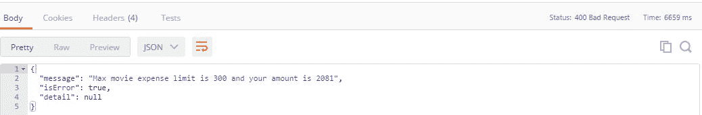

# 错误处理、跟踪和日志记录

任何软件应用中都必然会出现错误或异常，即使在各种环境中进行了大量测试之后也是如此。一旦应用投入生产，软件将面临更高的负载、正确或错误的用户输入、系统或网络崩溃，以及如果处理不当将导致应用崩溃的其他事件。

异常管理的概念是，系统应在发生灾难性故障时继续工作，并应以错误或未处理异常的形式记录故障的详细信息，以供进一步调查。

在本书中，我们正在构建一个 ASP.NET 核心 Web API 应用，该应用将主要由 Web 或移动客户端使用，任何异常都应该由 Web API 优雅地处理，以便客户端能够继续工作。

在本章中，我们将学习在 ASP.NET Core 中登录、向各种日志提供程序写入错误或异常以及构建异常处理程序以优雅地向客户端返回适当响应的基础知识。

在本章中，我们将研究以下主题：

*   ASP.NET Core 中日志记录的基础知识
*   MyWallet--演示 ASP.NET 核心项目
*   使用 NLog 将错误记录到文件
*   使用 Serilog 将错误记录到数据库
*   MyWallet 项目中的异常管理

# ASP.NET Core 中日志记录的基础知识

ASP.NET 核心的一个功能是使用`ILoggerFactory`**内置日志记录。**当您立即创建 ASP.NET 核心应用（基于空、MVC 或 web API）时，您将看到 program 类的`IWebHost's CreateDefaultBuilder`方法对日志功能进行底层工作，以使其读取`appsettings.json`日志部分的文件，以提供将信息记录到调试或控制台窗口所需的所有基础结构。

`ILoggerFactory`分为`AddProvider`和`CreateLogger`两部分，大大简化了测井的使用。

`AddProvider`方法采用`ILoggerProvider`写入/存储应用生成的日志信息。提供程序可以是控制台、调试窗口、文件、数据库、基于云的存储，也可以是第三方日志分析服务（Splunk、Raygun、Loggly 等）。

`CreateLogger`方法采用将通过上述可能的提供程序写入日志信息的类或方法的名称。

简而言之，要将所有日志信息记录到一个文件中，我们需要使用文件提供程序（NLog、Serilog 或任何其他提供程序）并创建一个`CreateLogger`实例来发送要存储在文件中的日志信息。

# 日志记录级别

根据所写入信息的严重性，所写入的日志信息将具有不同的级别。下表按升序描述了 ASP.NET Core 中的日志级别：

| **日志级别** | **写为** | **备注** |
| 跟踪=0 | `_logger.LogTrace (...)` | 开发人员调试的一部分。可能包括敏感信息。 |
| 调试=1 | `_logger.LogDebug (...)` | 开发人员调试的一部分。大部分时间都在使用。 |
| 信息=2 | `_logger.LogInformation(...)` | 可以在此处记录应用流。不用于调试。 |
| 警告=3 | `_logger.LogWarning (...)` | 对于意外事件。例如，数据与业务规则不匹配。 |
| 误差=4 | `_logger.LogError (...)` | 未处理的申请事件；可能是错误。 |
| 临界值=5 | `_logger.LogCritical (...)` | 需要立即采取行动解决的事件。 |

# 登录操作

在这里，我们将了解如何使用 web API 模板创建 ASP.NET 核心应用。已经添加了`Microsoft.Extensions.Logging`扩展以及`Debug`和`Console`扩展。

打开`Startup`类并进行以下更改以查看内置操作：

```cs
    public void Configure(IApplicationBuilder app, IHostingEnvironment env,
      ILoggerFactory loggerFactory) 
    {             
      var strtpLogger = loggerFactory.CreateLogger<Startup>(); 
      strtpLogger.LogTrace("Looking at Trace level "); 
      strtpLogger.LogDebug("This is Debug level"); 
      strtpLogger.LogInformation("You are Startup class - FY Information"); 
      strtpLogger.LogWarning("Warning - Entered Startup so soon"); 
      strtpLogger.LogError("This result in Null reference exception"); 
      strtpLogger.LogCritical("Critical - No Disk space"); 
      app.UseMvc();             
    } 

```

您可以按如下方式分解前面的代码：

*   日志级别和类别从`appsettings.json`文件的日志部分读取
*   记录器工厂同时添加控制台和调试窗口提供程序
*   我们将`Startup`类记录器的一个实例创建为`strtpLogger`
*   此记录器工厂实例根据日志级别记录到控制台和调试窗口

将应用作为控制台应用运行（使用 Kestrel 并显示控制台窗口）。console 窗口显示如下日志（这是 console 窗口的一部分）：


Logs displayed according to level

查看上图，我们可以看到它提供了日志来源的信息，即`Startup`类，以及不同的日志级别。

尽管我们在`Startup`类中编写了`Trace`日志级别，但它并没有在控制台窗口中编写。这是因为`appsettings.json`中存在日志类别。

# 日志类别

在`Startup`类代码片段中，您可以看到`AddConsole`日志提供程序正在读取`appsettings.json`的日志部分。本节包含日志类别详细信息，如默认、系统和 Microsoft。

日志类别有助于编写特定于应用、框架或整个系统的日志。理想情况下，在开发或生产期间，特定于应用级别的日志记录就足够了。

让我们添加特定于应用级别的日志记录，而不是当前存在的默认设置。打开`appsettings.json`，删除已有的`LogLevel`细节，进行如下更改：

```cs
    { 
      "Logging": { 
        "IncludeScopes": false, 
        "LogLevel": { 
          "basic_logging_demo": "Warning" 
        }     
      } 
    }

```

`basic_logging_demo`是项目名称（可以是任何字符串），我们将日志级别设置为`Warning`。任何低于警告级别的日志（请参阅日志级别表）都不会显示在控制台上。再次运行应用以仅查看控制台窗口上显示的`Warning`、`Error`和`Critical`日志。

# 依赖注入中的 iLogger 工厂

默认情况下，依赖注入被烘焙到 ASP.NET 核心中，我们可以通过将`ILogger`注入控制器、中间件、过滤器或任何其他类来利用这一点。

打开`ValuesController`web API 类（默认使用 web API 模板创建），如下编辑代码，运行应用在控制台窗口查看日志：

```cs
    namespace basic_logging_demo.Controllers 
    { 
      [Route("api/[controller]")] 
      public class ValuesController : Controller 
      {   
        private ILogger<ValuesController> _logger; 

        public ValuesController(ILogger<ValuesController> logger) 
        { 
          _logger = logger; 
        } 
        // GET api/values 
        [HttpGet] 
        public IEnumerable<string> Get() 
        { 
          _logger.LogWarning("Warning from Values Controller ");             
          return new string[] { "value1", "value2" }; 
        }         

        // POST api/values 
        [HttpPost] 
        public void Post([FromBody]string value) 
        { 
          try 
          { 
            if(value.Length > 0) 
            { 
               _logger.LogInformation($"String length is {value.Length}"); 
            } 
          } 
          catch (Exception ex) 
          { 
            _logger.LogError("Error Occurred while POST ", ex.Message); 
            throw; 
          } 
        }  //Removed code for brevity 
      } 
    } 

```

您可以按如下方式分解前面的代码：

*   与我们在上一个示例中使用`CreateLogger`的方式相同，我们有另一种方法来创建`ILogger`并注入它。这里我们正在创建一个`ValuesController`的`ILogger`实例，并使用构造函数将其注入。
*   当我们点击这些 API 端点时，`GET`方法记录警告，`POST`方法将信息和错误记录到控制台。

Inject the `ILogger<T>` instance in the same way for middleware, filter, or any other classes to log information.

# MyWallet-演示 ASP.NET 核心项目

要了解有关使用不同提供商进行日志记录的更多信息，我们将创建一个演示 ASP.NET 核心应用 MyWallet，该应用具有以下功能：

*   它应该能够列出所有的日常开支。
*   它应该能够通过传递 ID 获得特定的费用。
*   它应该能够在列表中添加/发布单个费用。如果电影费用超过 300 美元，则该请求数据无效。
*   它应该能够编辑和删除特定的费用。

在这个演示应用中，我们将使用 EF Core InMemory 提供程序。这个 EF 核心包在内存中运行应用，而不是持久化到数据库中。它非常适合于对数据访问层进行单元测试，但这里使用它可以使示例更简单。

You can use any database provider (Sql Server, MySQL, SQLite) by reading [Chapter 09](09.html#5J99O1-b5b28eac0b2e417189a3e09b61402d4f), *Integration with Databases*.

使用 NuGet 软件包管理器，将`Microsoft.EntityFrameworkCore.InMemory`添加到最新的软件包中。将 web API 控制器创建为`WalletController, DailyExpense`作为模型类，`ExpenseContext`作为数据上下文。

不要忘记在`Startup`类和`ConfigureServices`方法中注入`ExpenseContext`数据上下文。

根据所选场景，`WalletController`web API 控制器代码如下所示：

```cs
    [Route("api/[controller]")] 
    public class WalletController : Controller 
    { 
       private readonly ExpenseContext _context;         
       private readonly ILogger<WalletController> _logger; 

       public WalletController(ExpenseContext context,
         ILogger<WalletController>
         logger) 
       { 
          _context = context;             
          _logger = logger; 
       } 

       // GET api/values/5 
       [HttpGet("{id}")] 
       public IActionResult Get(int id) 
       {             
          var spentItem = _context.DailyExpenses.Find(id); 
          if (spentItem == null) 
          { 
             _logger.LogInformation($"Daily Expense for {id} does
                not exists!!"); 
             return NotFound();                 
          } 
          return Ok(spentItem); 
       } 

       // POST api/values 
       [HttpPost] 
       public IActionResult Post([FromBody]DailyExpense value) 
       { 
         if (value == null) 
         { 
            _logger.LogError("Request Object was NULL"); 
            return BadRequest(); 
         } 
         CheckMovieBudget(value); 

         if (!ModelState.IsValid) 
         {                 
            return BadRequest(ModelState); 
         } 
         var newSpentItem = _context.DailyExpenses.Add(value); 
         Save(); 
         return Ok(newSpentItem.Entity.Id); 
       } 
    } 

```

您可以按如下方式分解前面的代码：

*   使用 DI 注入`ILogger<WalletController>`和`ExpenseContext`（EF Core 需要）。
*   `Get(int id)`通过搜索并返回`DailyExpense`项来查找该项。如果没有找到，我们会记录信息，说明没有找到。
*   `Post()`检查请求是否为空。如果是，则返回`BadRequest`并记录错误。`CheckMovieBudget`方法检查电影费用是否不超过 300 美元，并返回一个`Model Validation`错误。如果一切顺利，就可以节省日常开支。
*   `Put()`和`Delete()`方法检查费用项目。如果找不到，他们会记录信息。如果找到，则根据找到的内容更新或删除它。

将应用作为控制台应用运行，通过使用 Postman 或 Fiddler 点击控制台窗口来查看控制台窗口上的各种日志信息。

到目前为止，我们一直使用 console 窗口查看代码中的日志信息，因为 ASP.NET Core 提供了 console 或 Debug 窗口作为默认日志提供程序。在现实世界的应用中，我们需要将信息记录到文件、数据库或云中，为此我们需要使用第三方日志提供商。

# 使用 NLog 将错误记录到文件

**NLog**是我们可以用于在 ASP.NET Core 中记录信息的第三方提供商之一。在这种情况下，我们将登录到一个文件。但是，我们也可以使用 NLog 登录到数据库或云。

欲了解更多关于 NLog 的信息，请参考[https://github.com/NLog/NLog.Extensions.Logging](https://github.com/NLog/NLog.Extensions.Logging) 。

使用 NuGet 软件包管理器，添加与 NLog 相关的软件包：

```cs
"NLog.Extensions.Logging": "1.0.0-rtm-beta5" 
"NLog.Web.AspNetCore": "4.4.1"  

```

At the time of writing this book, NLog is still in beta. Refer to the preceding link for updates.

在`Startup`类的`Configure`方法中，修改该方法，将记录信息的 NLog 包含到文件中：

```cs
    public void Configure(IApplicationBuilder app, IHostingEnvironment env,
      ILoggerFactory loggerFactory) 
    { 
       loggerFactory.AddNLog(); 
       app.AddNLogWeb(); 
       // Rest of code removed for brevity  
       app.UseMvc(); 
    } 

```

对于 NLog，有一个配置文件可用于不同的配置设置，如日志级别、文件名、日志文件位置等。在根目录中创建`nlog.config`文件，并复制以下最基本配置代码：

```cs
    <?xml version="1.0" encoding="utf-8" ?> 
    <nlog  
      xmlns:xsi="http://www.w3.org/2001/XMLSchema-instance"> 

      <extensions> 
        <add assembly="NLog.Web.AspNetCore"/> 
      </extensions> 

      <!-- define various log targets --> 
      <targets> 
        <target xsi:type="File" name="ownFile-web" fileName="D:\PacktLogs\
          nlog-own-${shortdate}.log" layout="${longdate}|${
          event-properties:item=EventId.Id}|${logger}|${uppercase:${level}}|
          ${message} ${exception}|url: ${aspnet-request-url}|action: $
          {aspnet-mvc-action}" /> 

        <target xsi:type="Null" name="blackhole" /> 
      </targets> 
      <rules> 
        <!--Skip Microsoft logs and so log only own logs--> 
        <logger name="Microsoft.*" minlevel="Trace" writeTo="blackhole"
          final="true" /> 
        <logger name="*" minlevel="Trace" writeTo="ownFile-web" /> 
      </rules> 
    </nlog> 

```

一旦一切都启动并运行，访问`WalletController`（通过邮递员或 Fiddler）将导致在配置文件中提供的位置创建一个带有`nlog-own-(date).log`的日志文件。

# 使用 Serilog 将错误记录到数据库

**Serilog**是针对.NET 应用的第三方日志记录包。它关注于完全结构化的事件。它以简单的 API、简单的设置和许多可以登录到各种源（如文件、数据库、ElasticSearch、Raygun 等）的包而闻名。

我们将使用`Serilog.Sinks.MSSqlServer`将日志信息写入数据库（即 MS SQL Server 数据库）。我们将使用 NuGet 软件包管理器添加以下软件包：

```cs
Serilog: 2.5.1-dev-00873
Serilog.Sinks.MSSqlServerCore: 1.1.0 

```

对于数据库日志记录，我们需要数据库服务器位置、名称和表。打开`appsettings.json`添加这些配置设置：

```cs
    "Serilog": { 
      "ConnectionString":"Server=.\\sqlexpress;
      Database=MyWalletLogDB;trusted_connection=true",
      "TableName": "Logs" 
    } 

```

在`MyWalletLogDB`上运行在此 URL 处找到的 SQL 脚本以创建日志表。参见[https://github.com/serilog/serilog-sinks-mssqlserver](https://github.com/serilog/serilog-sinks-mssqlserver) 了解更多信息。

在`Startup`类的`ConfigureServices`方法中，将 Serilog 添加到要在整个应用中使用的 DI 中：

```cs
    services.AddSingleton<Serilog.ILogger>(x => 
    { 
      return new   LoggerConfiguration().WriteTo.MSSqlServer(Configuration[
      "Serilog:ConnectionString"],
      Configuration["Serilog:TableName"]).CreateLogger(); 
    }); 

```

打开`WalletController`web API，将`Serilog.ILogger`包含到 DI 并写入日志：

```cs
    public WalletController(ExpenseContext context, Serilog.ILogger logger) 
    { 
       _context = context; 
       _logger = logger; 
    } 

```

附加的源代码包含整个控制器类。现在运行应用并使用邮递员或小提琴手点击`WalletController`。打开 SQL Server 以查看表中的日志。结果与此类似：


MyWallet logs in the SQL Server database

# MyWallet 项目中的异常管理

任何 web API 项目本身都不是应用。它的构建使得流行的前端，无论是 web 还是桌面，都可以使用它。web API 必须优雅地处理任何意外事件（未处理的异常）或任何业务异常。

如果发生意外事件（未经处理或与业务相关），则应记录这些事件，并将相应的响应发送回客户，以便客户能够知道。

为此，我们需要以下课程：

*   `WebAPIError`：作为响应对象，供客户端使用。
*   `WebAPIException`：业务异常或未处理异常的自定义异常类。它包含异常详细信息以及状态代码。
*   `WebAPIExceptionFilter`：包含一个异常属性，用作控制器或动作的属性。

创建一个`ErrorHandlers`文件夹，并使用前面的名称创建类文件。为每个类复制以下内容：

*   `WebAPIError`：作为响应对象：

```cs
        namespace MyWallet.ErrorHandlers   
        { 
          public class WebAPIError 
          { 
             public string message { get; set; } 
             public bool isError { get; set; } 
             public string detail { get; set; }         

             public WebAPIError(string message) 
             { 
                this.message = message; 
                isError = true; 
             }         
          } 
        } 

```

*   `WebAPIException`：自定义异常类，携带异常详细信息和状态码：

```cs
        using System; 
        using System.Net; 

        namespace MyWallet.ErrorHandlers 
        { 
          public class WebApiException : Exception 
          { 
             public HttpStatusCode StatusCode { get; set; }         

             public WebApiException(string message, 
               HttpStatusCode statusCode = 
                 HttpStatusCode.InternalServerError) :
               base(message) 
             { 
               StatusCode = statusCode; 
             } 
             public WebApiException(Exception ex, HttpStatusCode statusCode
               =  HttpStatusCode.InternalServerError) : base(ex.Message) 
             { 
                StatusCode = statusCode; 
             } 
          } 
        } 

```

*   `WebAPIExceptionFilter`：作为过滤器处理异常：

```cs
        namespace MyWallet.ErrorHandlers 
        { 
           public class WebApiExceptionFilter : ExceptionFilterAttribute 
           { 
              private ILogger<WebApiExceptionFilter> _Logger; 

              public WebApiExceptionFilter(ILogger<WebApiExceptionFilter>
                logger) 
              { 
                  _Logger = logger; 
              } 

              public override void OnException(ExceptionContext context) 
              { 
                 WebAPIError apiError = null; 
                 if (context.Exception is WebApiException) 
                 { 
                   // Here we handle known MyWallet API errors 
                   var ex = context.Exception as WebApiException; 
                   context.Exception = null; 
                   apiError = new WebAPIError(ex.Message);                 

                  context.HttpContext.Response.StatusCode =
                     (int)ex.StatusCode;   
                  _Logger.LogWarning($"MyWallet API thrown error:
                     {ex.Message}", ex); 
                } 
                else if (context.Exception is UnauthorizedAccessException) 
                { 
                  apiError = new WebAPIError("Unauthorized Access"); 
                  context.HttpContext.Response.StatusCode = 401;                 
                } 
                else 
                { 
                  // Unhandled errors 
                  #if !DEBUG 
                    var msg = "An unhandled error occurred."; 
                    string stack = null; 
                  #else 
                    var msg = context.Exception.GetBaseException().Message; 
                    string stack = context.Exception.StackTrace; 
                  #endif 
                    apiError = new WebAPIError(msg); 
                    apiError.detail = stack; 

                  context.HttpContext.Response.StatusCode =
                   (int)HttpStatusCode.InternalServerError; 

                  // handle logging here 
                  _Logger.LogError(new EventId(0), context.Exception, msg); 
                } 

                // always return a JSON result 
                context.Result = new JsonResult(apiError); 
                base.OnException(context); 
              }          
           } 
        } 

```

您可以按如下方式分解前面的代码：

*   采用`ILogger`写入日志。
*   `OnException`方法检查这是否是自定义`WebApiException`类型。如果是，它将准备一个带有状态代码的`WebApiError`响应。如果是未经授权的访问，它会做出适当的响应。
*   对于未处理的异常，它获取堆栈跟踪详细信息，并以`WebApiError`响应，其中包含释放模式的完整详细信息。
*   `ILogger`实例在需要的地方写入日志。

我们的异常处理已经在`MyWallet`web API 项目中准备就绪。让我们将过滤器合并到控制器中。您可以使用现有控制器或创建新控制器。

首先，用我们创建的`WebApiExceptionFilter`装饰控制器：

```cs
    [ServiceFilter(typeof(WebApiExceptionFilter))] 
    [Route("api/[controller]")] 
    public class NewWalletController : Controller 
    { 
       private readonly ExpenseContext _context; 
       private readonly ILogger<WalletController> _logger; 

       public NewWalletController(ExpenseContext context,
         ILogger<WalletController> logger) 
       { 
          _context = context; 
          _logger = logger; 
       } 
       //Code removed for brevity 
    }  

```

我们使用`ServiceFilter`来使用过滤器，因为我们使用依赖注入将`ILogger`包含在过滤器中，以便它写入日志。

`Get()`方法可以编写如下来处理业务逻辑故障，例如，如果请求的记录不存在：

```cs
    // GET api/values/5 
    [HttpGet("{id}")] 
    public IActionResult Get(int id) 
    { 
      var spentItem = _context.DailyExpenses.Find(id); 
      if (spentItem == null) 
      {                 
        throw new WebApiException($"Daily Expense for {id} 
          does not exists!!", HttpStatusCode.NotFound); 
      } 
      return Ok(spentItem); 
    } 

```

下面是另一个示例，说明了当发生未处理的异常时，过滤器将优雅地处理它们，并记录错误：

```cs
    [Route("ThrowExceptionMethod")] 
    public IActionResult ThrowExceptionMethod() 
    { 
      try 
      { 
        string emailId = null; 
        if (emailId.Length > 0) 
        { 
           return Ok(); 
        } 
        throw new WebApiException("Email is empty",
          HttpStatusCode.BadRequest); 
      } 
      catch (Exception ex) 
      { 
        throw ex; 
      } 
    } 

```

您可以将信息记录到文件或数据库中。配置完成后，运行应用并使用 Postman 或 Fiddler 发送请求并接收响应。

以下是使用 NLog 写入文件的示例日志，然后是邮递员回复的屏幕截图：

```cs
2017-02-13 17:13:59.9597|0|MyWallet.ErrorHandlers.WebApiExceptionFilter|WARN| MyWallet API thrown error: Max movie expense limit is 300 and your amount is 2081 |url: http://localhost/api/newwallet|action: Post

```



Web API graceful exception Custom middleware can be written for gracefully handling the web API errors or exception.

# 日志管理服务的链接

我们甚至可以将这些日志移动到第三方日志管理服务（存在试用版和付费版），以收集有关 web API 异常的指标：

*   **Seq**：针对.NET 应用的结构化日志记录。它是结构化日志和日志管理服务的优秀工具。参见[http://docs.getseq.net/docs/using-aspnet-core](http://docs.getseq.net/docs/using-aspnet-core) 将其与 ASP.NET 核心应用集成。
*   **Raygun**：用于监控、报告和日志分析的.NET 应用的最佳工具之一。参见[https://raygun.com/docs/languages/net/netcore](https://raygun.com/docs/languages/net/netcore) 用于集成。
*   **Elmah**：用于将日志写入他们的网站，并在以后进行分析。如需集成，请参考[https://docs.elmah.io/logging-to-elmah-io-from-aspnet-core/](https://docs.elmah.io/logging-to-elmah-io-from-aspnet-core/) 。

# 总结

ASP.NET Core 大大改进了对任何持久性源的日志记录功能。使用第三方工具编写日志变得简单。NLog 或 Serilog 是管理写入日志最广泛使用的工具。

我们还学习了如何优雅地处理 web API 错误，以及如何将它们记录到日志存储中以进行分析。

在下一章中，我们将学习如何使用缓存、异步编程和其他方法优化和改进 ASP.NET 核心性能。