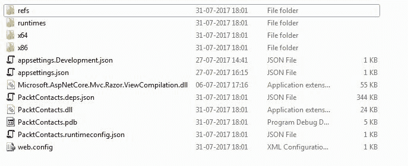
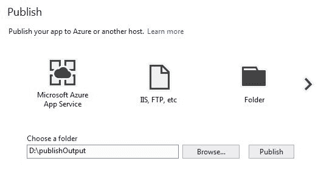
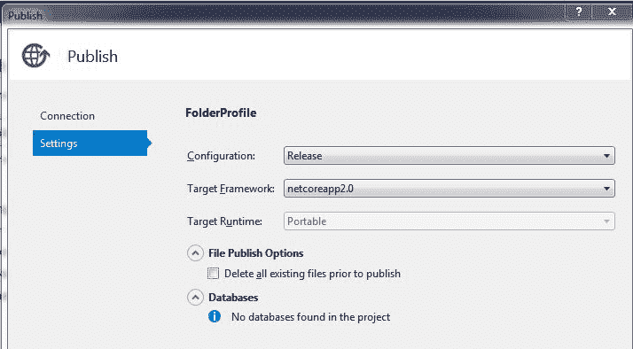
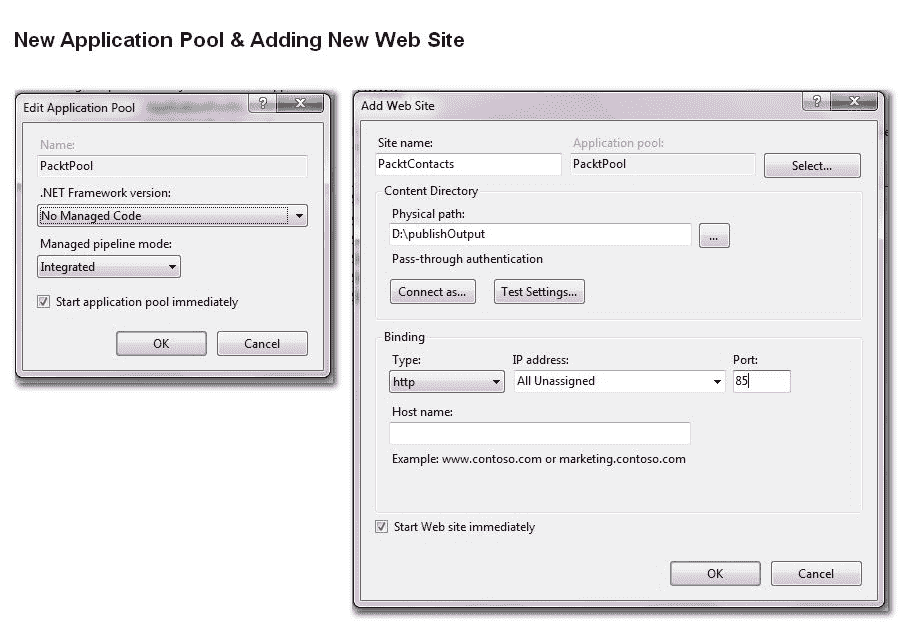
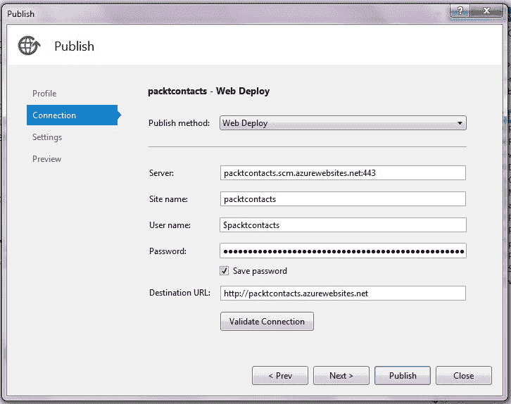
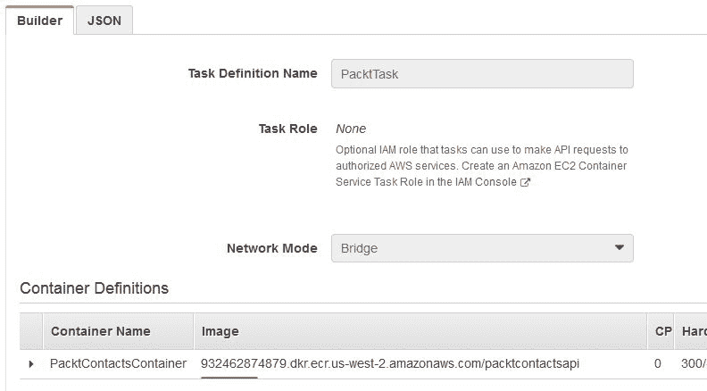
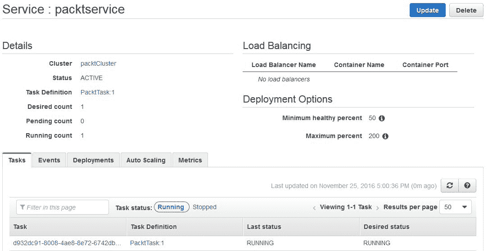
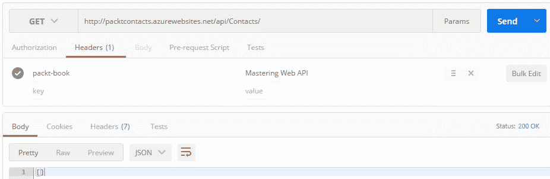
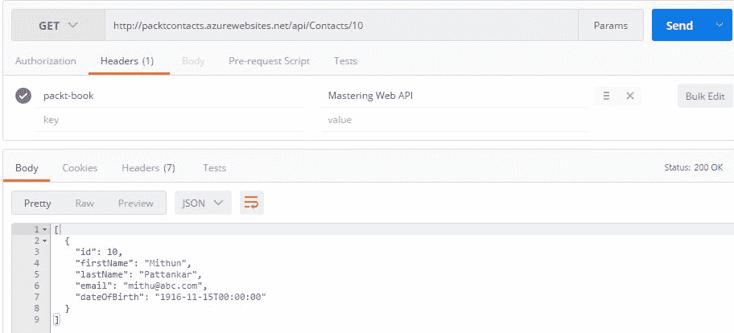
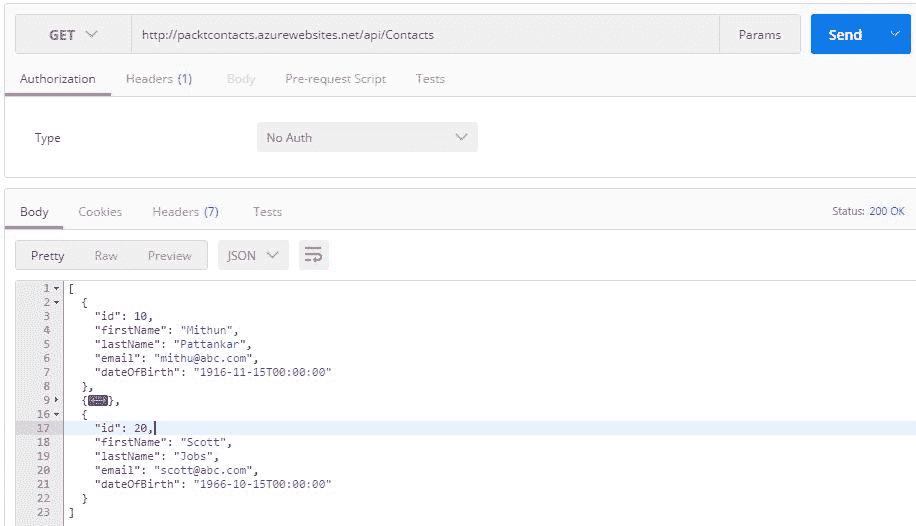

# 十二、托管和部署

这本书快结束了。在本书的学习过程中，我们通过创建 ASP.NET Core web API 项目、编写控制器和操作、添加路由、编写自定义中间件、单元测试代码、处理异常以及执行一些优化，了解了许多有关 web API 的概念。现在是托管和部署 WebAPI 应用的时候了。

由于 ASP.NET Core是跨平台的，托管和部署不局限于 Windows 环境（IIS 和 Azure）本身；AWS、Docker、Linux 等环境都是不错的选择。

在本章中，我们将重点介绍以真正跨平台的方式托管和部署一个示例 ASP.NET Core Web API 项目。

在本章中，我们将研究以下主题：

*   创建演示 ASP.NET Core Web API 项目
*   发布 web API 项目
*   独立 web API
*   部署策略
*   将 web API 部署到 IIS
*   将 web API 部署到 Azure 应用服务
*   将 web API 发布到 Azure 上的 Windows 虚拟机
*   向 Docker 发布 web API
*   在 AWS 上将 web API 发布到 EC2
*   将 web API 发布到 Linux

# 创建演示 ASP.NET Core Web API 项目

`PacktContacts`将是在我们的各种环境中托管和部署的演示项目。该项目是使用本书中学习的一些功能构建的，例如属性路由、自定义中间件、链接生成和路由约束。

创建一个名为`PacktContacts`的 ASP.NET Core Web API 项目，在 controller 文件夹中创建一个 Web API 控制器类`ContactsController`，并复制以下代码：

```cs
    namespace PacktContacts.Controllers 
    { 
      [Route("api/[controller]")] 
      public class ContactsController : Controller 
      {         
        static List<Contact> ContactList = new List<Contact>(); 

        // GET: api/Contacts 
        [HttpGet] 
        public IActionResult Get() 
        { 
          return Ok(ContactList); 
        } 

        // GET api/Contacts/5 
        [HttpGet("{id:int}", Name = "GetContacts")] 
        public IActionResult Get(int id) 
        { 
          var findContact = ContactList.Where(e => e.Id == id); 
          if(findContact != null) 
          { 
             return Ok(findContact); 
          } 
          else 
          { 
            return NotFound(); 
          }             
        } 

        // POST api/Contacts 
        [HttpPost] 
        public IActionResult Post([FromBody]Contact contactsInfo) 
        { 
          if (contactsInfo == null) 
          { 
            return BadRequest(); 
          } 
          ContactList.Add(contactsInfo); 
          return CreatedAtRoute("GetContacts", 
            new { Controller = "Contacts",
            id = contactsInfo.Id }, contactsInfo); 
        } 

        // Complete code part of source code bundle         
      } 
    }  

```

The complete source code is available in the code bundle.

在`Model`文件夹中创建`Contact`类文件并复制以下代码。它用作复杂对象，但用作模型：

```cs
    public class Contact 
    { 
      public int Id { get; set; } 
      public string FirstName { get; set; } 
      public string LastName { get; set; } 
      public string Email { get; set; }         
    } 

```

您可以按如下方式分解前面的代码：

*   `ContactsController`是对`Contact`类执行 CRUD 操作的 web API 控制器。
*   静态列表属性保存`Contact`的记录。在本例中，它的作用类似于数据库。
*   `Get`、`Post`和`Put`HTTP 方法使用`IActionResult`返回响应。我们可以使用 HTTP 代码获得各种结果。
*   `Post`方法响应为`CreatedAtRoute`。这将在响应头中生成一个链接。
*   `Put`和`Delete`方法仅在存在接触时有效；否则，他们会做出适当的回应。
*   `Contact`是一个包含基本细节的 POCO 类。

`PacktHeaderValidator`--a custom middleware, mentioned in [Chapter 6](06.html#3UQQQ1-b5b28eac0b2e417189a3e09b61402d4f), *Middleware and Filters*, can be used to check whether the request contains a custom header entry for the web API to respond to.

# 发布 ASP.NET Core Web API 项目

我们创建了一个演示 web API 项目`PacktContacts`，对其进行了测试，然后在本地开发环境中运行。对于生产，应发布应用。

.NET Core或 ASP.NET Core项目（MVC 或 Web API）可以使用 CLI 或 Visual Studio 工具发布。我们将学习出版它的两种方法。

# 通过 CLI 发布

在[第 3 章](03.html#20R681-b5b28eac0b2e417189a3e09b61402d4f)*对 ASP.NET Core Web API*的剖析中，我们学习了各种.NET Core命令。要发布应用，.NET Core CLI 为我们提供了`dotnet publish`命令。它生成运行应用所需的工件。

从项目文件夹中打开命令提示符，然后运行以下命令进行发布：

```cs
dotnet publish --output "<output-path>" --configuration release  

```

分解发布命令：

*   `dotnet publish`命令通过引用`*.csproj`编译应用。它收集所有依赖项并将它们发布到一个目录中。
*   `-output`选项指定发布项目的目录路径。
*   `-configuration`选项指定以`RELEASE`模式发布哪个应用。默认情况下，它始终处于`DEBUG`模式。

导航到文件资源管理器中的输出文件夹，以查看包含已编译 DLL、`appsettings.json`、`web.config`和运行应用所需的其他库的已发布应用。文件夹屏幕截图显示了其中一些文件。

此`dotnet publish`命令在大多数情况下都已足够，但.NET CLI 提供了更多用于发布命令的选项。

Read through this excellent documentation on `dotnet publish`: [https://docs.microsoft.com/en-us/dotnet/articles/core/tools/dotnet-publish](https://docs.microsoft.com/en-us/dotnet/articles/core/tools/dotnet-publish).



dotnet-publish output folder The output folder containing the portable `PacktContacts` application can run on any OS with the .NET Core runtime already installed.

要运行已发布的应用，请从命令行导航到输出文件夹并运行以下命令，如以下屏幕截图所示：

```cs
dotnet PacktContacts.dll

```


Running the published application

`PacktsContacts`应用运行`http://localhost:5000`。这可以配置到任何端口。使用 Fiddler 或 Postman 工具测试 API。

# 通过 VisualStudio 工具发布

VisualStudioIDE 为发布应用提供了出色的工具支持。正如旧版本的 ASP.NET 在 Visual Studio 中执行发布步骤一样，在 ASP.NET Core中也没有什么不同。

在 Visual Studio 2017 中打开`PacktContacts`应用，右键单击项目名称，然后单击发布，打开发布项目的对话框窗口。

它为我们提供了三个选择发布目标的选项：

*   Microsoft Azure 应用服务：在 Azure 上发布
*   导入：导入现有配置文件以进行发布
*   自定义：使用 web 部署、包、FTP 或文件系统发布

在本节中，我们将使用自定义选项将项目发布到文件系统，类似于 CLI 方法。单击 Custom 并为其提供配置文件名称`PacktPublish`。

在连接下，选择发布方法作为文件系统，并选择目标位置作为文件系统，如下所示：



Select the Publish method and target location

在“设置”下，将配置选项选择为“发布”，将目标框架选项选择为.NETCoreApp。如果安装了不同版本的.NET Core，则 Target Framework 字段可能会显示更多选项。

我们这里没有针对任何特定的运行时。在下一节中，我们将探讨构建独立应用时的运行时。



Setting the configuration and target framework

单击“发布”按钮开始发布过程。完成后，提供的目标位置将具有运行应用所需的所有文件。将在解决方案结构中创建配置文件文件夹，其中包含使用发布向导时提供的所有设置。

要运行应用，只需按照 CLI 部分中所示的命令进行操作。

# 独立 web API

在上一节中，我们将 ASP.NET Core应用发布为可移植的.NET Core应用。在任何操作系统（Windows、macOS 或 Linux）上，如果安装了.NET Core运行时，前面的可移植应用都将运行。

可移植的.NET Core应用本机运行，即使它们发布在任何操作系统上。它是通过本机运行**libuv**（ASP.NET Core应用的 web 服务器）实现的。

ASP.NET Core 可以构建为独立（自托管）应用，即包含运行时（.NET Core 运行时）的已发布应用。由于.NET Core（ASP.NET Core）应用本质上是控制台应用，当它们作为独立应用发布时，将生成一个可执行文件，运行此文件将启动应用。

我们将`PacktContacts`作为一个独立的应用发布，编辑`*.csproj`文件，在`PropertyGroup`部分添加`RuntimeIdentifiers`，如下图：

```cs
    <PropertyGroup> 
      <TargetFramework>netcoreapp2.0</TargetFramework> 
      <RuntimeIdentifiers>win7-x64</RuntimeIdentifiers> 
    </PropertyGroup>  

```

运行时也称为**RID，**即**.NET Core运行时标识符**（**RID**）。我们需要提到.NET Core应用将作为独立应用构建的目标操作系统。

我使用 Windows 7 x64 计算机作为独立应用构建 ASP.NET Core Web API。可以同时针对多个 RID。应该运行`dotnet restore`命令来恢复所有包（如果在编辑器中编辑`*.csproj`文件，则应该显式调用它）。

For a different OS runtime identifier, read through the documentation of the .NET Core runtime identifier at [https://docs.microsoft.com/en-us/dotnet/articles/core/rid-catalog](https://docs.microsoft.com/en-us/dotnet/articles/core/rid-catalog).

从`PacktContacts`文件夹运行以下命令以创建独立应用：

```cs
dotnet publish --output "<output-path>" --configuration release  

```

提供适当的输出路径以保存已发布的应用。成功完成后，您将注意到许多文件被复制，并且还创建了一个`PacktContacts.exe`文件。

它包含已发布的 web API 以及运行应用的.NET Core运行时。

现在`PacktContacts ASP.NET Core Web API`应用可以作为 EXE 运行，如下所示：


Running as a standalone application It's recommended that you use the appropriate runtime identifier. As it's built for Windows 7 x64, it might work on a higher version of the Windows OS, but it won't work on Linux or macOS.

# 部署策略

ASP.NET Core运行在基于 libuv 的全新 web 服务器上，该服务器名为**Kestrel**。

Microsoft recommends that Kestrel should be treated as an internal web server-excellent for development, it but shouldn't be exposed to the internet.

那么，一个显而易见的问题就是如何托管 ASP.NET Core应用以将其暴露于互联网。下图简要说明了部署策略：


ASP.NET Core apps deployment strategy

该图描述了以 IIS、Nginx 等形式提供代理（也称为反向代理）的部署策略。

这些反向代理允许我们通过从 HTTP 服务器提供静态内容、缓存请求、压缩请求和 SSL 终止服务来减轻工作负担。

来自 internet 的任何请求都将通过反向代理（IIS 或 Nginx）进行处理。请求被传递，然后 ASP.NET Core应用调用 Kestrel 服务器对此采取操作。

在接下来的部分中，我们将使用此策略部署`PacktContacts`web API。

# 将 web API 部署到 IIS

在不同的 Windows 操作系统（计算机或服务器）上托管时，将 ASP.NET Core应用部署到 IIS 是首选。

了解 IIS 如何与 ASP.NET Core应用配合使用非常重要。在上一节中，我们将应用发布到输出文件夹，其中包含运行它的所有人工制品。

著名的 web.config 也存在于发布的文件夹中。检查内容以了解 IIS 和 ASP.NET Core 如何协同工作：

```cs
    <?xml version="1.0" encoding="utf-8"?> 
    <configuration> 
      <!-- Configure your application settings in appsettings.json. 
       Learn more at http://go.microsoft.com/fwlink/?LinkId=786380 --> 
      <system.webServer> 
        <handlers> 
          <add name="aspNetCore" path="*" verb="*"
           modules="AspNetCoreModule" resourceType="Unspecified" /> 
        </handlers> 
        <aspNetCore processPath="dotnet" arguments=".\PacktContacts.dll" 
          stdoutLogEnabled="false" 
          stdoutLogFile=".\logs\stdout" forwardWindowsAuthToken="false" /> 
      </system.webServer> 
    </configuration> 
    <!--ProjectGuid: d8d6c16d-f42a-4d87-a244-6484d6bffb5e--> 

```

分解`web.config`文件：

*   需要安装`AspNetCoreModule`才能将请求传输到 Kestrel。
*   `aspNetCore`告知`processPath`为`dotnet`，`argument`为`PacktContacts.dll`。日志记录现在已禁用。这与`dotnet packtcontacts.dll`CLI 命令相同，但通过`web.config`执行。

`web.config`文件包含在 ASP.NET Core中，以便 IIS 可以调用应用并让 Kestrel 处理请求。请注意，IIS 充当反向代理。

To know more about ASP.NET Core module configuration, read [https://docs.microsoft.com/en-us/aspnet/core/hosting/aspnet-core-module](https://docs.microsoft.com/en-us/aspnet/core/hosting/aspnet-core-module).

# 在 IIS 上配置网站

假设您的计算机上已启用 IIS，请打开 IIS 管理器并执行以下步骤：

1.  在“应用池”下，添加专门用于 ASP.NET Core应用的新应用池。我们正在将.NET Framework 版本设置为无托管代码。
2.  在“站点”下，右键单击“添加网站”，提供适当的站点名称，分配先前创建的应用池，并分配已发布文件夹的物理路径（执行`dotnet publish`步骤时参考输出路径）

在本章末尾，我们将了解如何测试`PacktContacts`应用：



Creating a new application pool and adding a website

在本章的最后，我们将了解如何测试`PacktContacts`web API。

# 将 web API 部署到 Azure 应用服务

在本节中，我们将使用 Azure 应用服务部署应用。此示例使用免费试用帐户。如果您有权访问任何其他订阅，可以在此处使用。

按照以下步骤进行部署：

1.  在解决方案资源管理器中右键单击该项目，然后选择“发布”
2.  在发布对话框中，单击 Microsoft Azure 应用服务。

3.  单击“新建”从 Visual Studio 创建新的资源组。您也可以使用现有的。在本例中，使用了资源组下已经存在的 Azure 应用。
4.  单击“确定”将应用 web 部署到 Azure 应用。
5.  Web Deploy 将执行安装 dotnet 运行时、还原包以及将已发布的 Web API 应用复制到 Azure 应用的操作。
6.  完成后，浏览器会自动打开链接。您现在可以测试它了：



Web deploy to Azure App Service

# 将 web API 发布到 Azure 上的 Windows 虚拟机

在本节中，我们将把发布的`PacktContacts`web API 部署到在 Windows Azure 上创建的虚拟机上。我们将创建一个 Windows Server 2012 R2 数据中心作为虚拟机。

Azure 免费试用帐户就足够了。通过以下步骤部署`PacktContacts`web API：

1.  要创建 Azure 虚拟机，请按照[中提到的步骤操作 https://docs.microsoft.com/en-us/azure/virtual-machines/virtual-machines-windows-hero-tutorial](https://docs.microsoft.com/en-us/azure/virtual-machines/virtual-machines-windows-hero-tutorial) 创建 Windows Server 2012 R2 数据中心。
2.  创建 VM 后，建立远程桌面连接以部署应用。
3.  由于它是 Windows 服务器，我们将在此 VM 上的 IIS 上部署`PacktContacts`web API。因为它是新创建的机器，所以不会配置 IIS；要配置它，请阅读[https://docs.microsoft.com/en-us/azure/virtual-machines/virtual-machines-windows-hero-role?toc=%2fazure%2fvirtual-计算机%2fwindows%2ftoc.json](https://docs.microsoft.com/en-us/azure/virtual-machines/virtual-machines-windows-hero-role?toc=%2fazure%2fvirtual-machines%2fwindows%2ftoc.json)。
4.  配置 IIS 后，安装`.NET Core Windows Server Hosting`（[https://aka.ms/dotnetcore_windowshosting_1_1_0 服务器上的](https://aka.ms/dotnetcore_windowshosting_1_1_0)包。这将安装.NET Core运行时、.NET Core库和 ASP.NET Core模块。
5.  手动或通过 FTP 将已发布的 web API 项目复制到 Windows VM，并按照*节中描述的步骤在 IIS*上配置网站。

Ensure that the deployed application on the VM is configured for access using a public IP address.

# 向 Docker 发布 web API

Docker 是一种通过使用容器来创建、部署和运行应用的工具。它们的工作方式与虚拟机类似，但更轻量级，并使用主机提供更好的性能。

To understand more about Docker, read the article What is Docker? found at [https://www.docker.com/what-docker](https://www.docker.com/what-docker). Docker can be installed on your machine by following the appropriate steps for your machine, found at [https://www.docker.com/products/docker](https://www.docker.com/products/docker).
To use Docker, your machine should support hardware virtualization.

在机器上安装 Docker 后，通过以下步骤构建`PacktContactsAPI`Docker 映像并在 Docker 容器上运行：

1.  右键单击项目名称并转到添加| Docker 支持以创建 Docker 文件。
2.  在`PacktContacts`项目中，创建`Dockerfile`并复制以下代码：

```cs
        FROM microsoft/aspnetcore: 2.0 
        ENTRYPOINT ["dotnet", "PacktContacts.dll"] 
        ARG source=.
        WORKDIR /app 
        EXPOSE 80 
        COPY $source . 

```

它从 ASP.NET Core 2 运行，其`ENTRYPOINT`为`PacktContacts.dll`（与在 CLI 下运行时相同），没有参数。将当前目录内容复制到映像。

3.  再次运行`dotnet publish`命令；这将发布包含我们创建的 Docker 文件的文件夹。
4.  现在，通过从 Docker 终端运行以下命令来构建 Docker 映像：

```cs
 docker build D:\publishOutput -t packtcontantsAPI 

```

5.  运行以下命令在 Docker 容器上运行映像：

```cs
 docker run -it -d -p 85:80 packtcontantsAPI 

```

一切正常运行后，使用 Docker 机器默认 IP 访问`PacktContacts`web API。

# 在 AWS 上将 web API 发布到 EC2

在上一节中，我们为我们的 ASP.NET Core Web API 项目构建 Docker 映像`packtcontactsapi`。在本节中，我们将在 AWS EC2 容器服务上运行此 Docker 映像。

Docker 映像是使用所有必需的运行时预构建的，这减少了已发布应用设置环境的工作量。

创建 AWS 帐户并转到 EC2 容器服务部分。按照这些步骤操作（非常简单），您将看到将 Docker 映像推送到 AWS EC2 的命令。命令显示在以下屏幕截图中：


AWS push commands to Docker images For more in-depth explanation of the steps involved in running Docker images on AWS EC2, refer to [https://aws.amazon.com/getting-started/tutorials/deploy-docker-containers/](https://aws.amazon.com/getting-started/tutorials/deploy-docker-containers/).

创建任务定义。在这里，您将指定要使用的 Docker 映像。以下屏幕截图中带下划线的文本表示所使用的推送图像：



Creating the task definition in AWS

配置服务以启动和维护先前创建的任务定义：



Configure the service to run the task

配置 AWS EC2 群集，以便在其上运行服务和任务。点击图中突出显示的行将显示访问`PacktContacts`web API 所需的公共 DNS 名称：


Configure and run the cluster on EC2

# 将 web API 发布到 Linux

ASP.NET Core可以托管在 Linux 操作系统上。有许多使用 Linux 操作系统的低成本主机提供商。在本节中，我们将在作为虚拟机运行的 Linux 机器上部署`PacktContacts`web API。

我们将使用 Ubuntu 服务器 14.04 LTS Linux。有很多关于如何在虚拟机上运行 Ubuntu 的文章。

要安装.NET Core for Linux，请转至[https://www.microsoft.com/net/core#linuxubuntu](https://www.microsoft.com/net/core#linuxubuntu) 。如果需要，安装 VisualStudio 代码将帮助您编写代码。

有两种方法可以在此 Linux 机器上部署演示 web API 项目：传输已发布的文件或从源代码运行 publish 命令。

我发现从源代码运行 publish 要容易得多。有了源代码，您也可以在 Linux 机器上工作。将源代码推送到 Git 存储库并克隆 Linux（需要安装 Git）。

克隆源代码后，运行`dotnet publish`命令，如本章开头所示。运行应用；它将在端口 5000 上开始侦听。

# 测试 packtwebapi

ASP.NET Core应用可以通过多种方式托管和部署，包括本地 IIS、Windows Azure、Docker、独立、廉价的 Linux 托管提供商、虚拟机、AWS 等选项。

到目前为止，我们只看到 web API 应用的托管和部署，但从未测试过。在本节中，我们将测试所有 CRUD 场景和自定义中间件功能。我们将使用邮递员工具，不过，也可以使用 Fiddler。

下表显示了访问应用所需的部署位置和 URL：

| **部署位置** | **访问 URL** |
| 本地 IIS | [http://localhost:85](http://localhost:85) |
| 独立的 | [http://localhost:5000](http://localhost:5000) |
| Azure 应用服务 | [http://packtcontacts.azurewebsites.net](http://packtcontacts.azurewebsites.net) |
| 码头工人 | [http://192.168.99.100:85/](http://192.168.99.100:85/) |
| AWS 上的 EC2 | [http://ec2-35-164-207-251.us-west-2.compute.amazonaws.com](http://ec2-35-164-207-251.us-west-2.compute.amazonaws.com) |
| Linux 主机 | [http://localhost:5000](http://localhost:5000) |

These URLs will vary according to your setup.

# 测试用例-不使用标头访问 web API

来自[第 6 章](06.html#3UQQQ1-b5b28eac0b2e417189a3e09b61402d4f)、*中间件和过滤器*的定制中间件示例希望每个请求都有一个名为`packt-book`的定制头，其值为`Mastering Web API`。

如果没有报头，或者报头无效，web API 响应错误请求；否则，它将相应地作出响应：


Test web API without header

# 测试用例-使用标头访问 web API

在这种情况下，我们将传递值为`Mastering Web API`的`packt-book`。web API 以 OK 响应：



Web API responds with OK

# 测试用例-向 web API 添加联系人

在本例中，我们将 JSON 请求主体传递给`ContactsController`的`POST`方法。如前一屏幕截图所示，它“必须通过自定义标题`packt-book`，以确保`POST`请求得到处理。这个例子说明了中间件的概念。

以下是 JSON 请求：

```cs
    { 
      "id": 20, 
      "firstName": "Mithun", 
      "lastName": "Pattankar", 
      "email": "mithu@abc.com", 
      "dateOfBirth": "1916-11-15" 
    } 

```

一旦请求得到处理，web API 将在响应正文中以`201 Created`状态进行响应。在观察响应头时，我们可以看到位置头以及访问所创建资源的 URL（在本例中为 contact）。

位置报头是[第 5 章](05.html#3EK181-b5b28eac0b2e417189a3e09b61402d4f)、*实现路由*中学习的链路生成概念的一个示例。


Post in action

# 测试用例-从 web API 获取联系人

我们将使用生成的链接获取联系人详细信息：



Get the contact details by passing the ID

# 测试用例-从 web API 获取所有联系人

这将获得联系人列表中的所有联系人，再加上一个联系人。web API 将返回两个联系人详细信息：



Get all contacts

# 测试用例-编辑 web API 的联系人

在本例中，我们使用`ContactsController`的`PUT`方法传递 JSON 请求主体。

以下是 JSON 请求：

```cs
    { 
      "id": 30, 
      "firstName": "Steve", 
      "lastName": "Jobs", 
      "email": "steve@abc.com", 
      "dateOfBirth": "1966-10-15" 
    } 

```

# 测试用例-从 web API 中删除联系人

在这种情况下，我们将通过使用`DELETE`方法传递 ID 来删除联系人。然后我们可以打电话`Get all Contacts`检查它是否被移除。如果 ID 不存在，则返回`Not Found`响应：


Delete a contact

# 总结

在本章中，我们学习了 ASP.NET Core 的各种托管和部署选项，从在 IIS 上部署已发布应用的传统方法，到将其作为独立应用托管。这一转变确实令人鼓舞。

我们了解到，通过使用 Azure 应用服务发布，ASP.NET Core和 Azure 可以无缝集成。有很多低成本的 Linux 托管选项，我们也探讨了这些选项。诚然，ASP.NET Core自始至终都是一种跨平台技术。

在下一章中，我们将在现代前端使用这些 web API，如 JavaScript、JQuery、Angular、React 和混合移动应用。