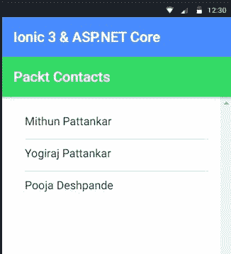
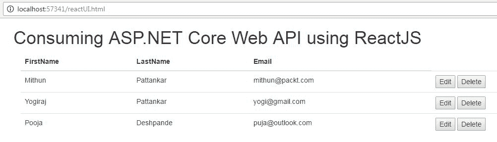
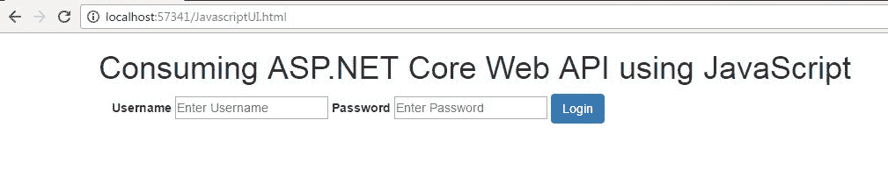
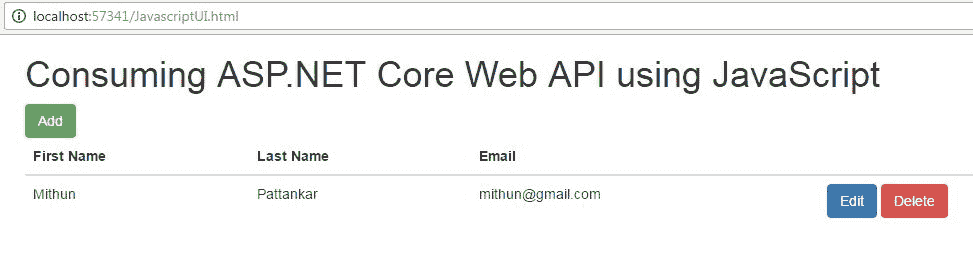
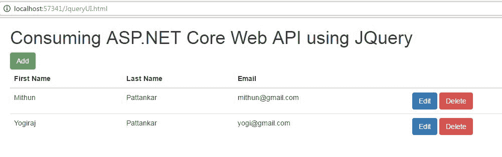

# 现代网络前端

我们在这本书的最后一章。在前面的章节中，我们学习了很多概念，例如如何创建 ASP.NET Core Web API、编写控制器和操作、添加路由、中间件、单元测试和处理优化错误，以及在各种环境中部署和托管。

托管的 web API 使用 Postman 或 Fiddler 工具进行了测试，效果良好。但 ASP.NET Core Web API（以及通常使用任何框架构建的 Web API）的真正用途在于它能够被前端应用（如 Web、移动或桌面应用）使用。

正如 ASP.NET Core是跨平台的一样，我们有各种各样的 web 前端，可以使用开源技术跨平台开发。

在本章中，我们将重点介绍如何使用现代 web 框架构建 web 应用，如 Angular 4（也称 Angular）、ReactJS、TypeScript（JavaScript 的超集）、JQuery 和 JavaScript、Bootstrap 以及 Ionic 3 framework（混合移动应用框架）。我们还将了解他们如何使用我们在前几章中开发的 web API。

在本章中，我们将研究以下主题：

*   `PacktContacts`-概述演示 ASP.NET Core Web API
*   web 框架的软件先决条件
*   使用 Angular 4 使用 web API
*   使用 Ionic 3 使用 web API
*   使用 ReactJS 使用 web API
*   使用 JavaScript 使用 web API
*   使用 JQuery 使用 web API

# PacktContacts-演示 web API 项目概述

在[第 12 章](12.html#6U6J21-b5b28eac0b2e417189a3e09b61402d4f)*托管和部署*中，我们了解了名为`PacktContacts`的演示 ASP.NET Core Web API 项目，并将其托管和部署到各种环境中。

web API 在`Contact`模型上执行基本的 CRUD 操作。我们将使用这个托管在 IIS 上的 web API 作为访问它的终点。

模型文件夹中的`Contact`类文件充当复杂对象，用作网络数据传输的模型：

```cs
    namespace PacktContacts.Model 
    { 
      public class Contact 
      { 
        public int Id { get; set; } 
        public string FirstName { get; set; } 
        public string LastName { get; set; } 
        public string Email { get; set; }                 
      }   
    } 

```

# 处理跨来源问题

当我们使用 Postman 或 Fiddler 测试`PacktContacts`web API 时，他们通过调用适当的响应进行响应。当他们托管在现代 web 框架中使用的 web API 的端点 URL 时，它无法工作，导致了跨源问题。

任何使用 AJAX 请求调用 web API 的 web 框架都会因浏览器的安全性而无法调用另一个域。在 web 应用世界中，它通常被称为同源策略。

更简单地说，web API 应用托管在 web 服务器上，访问 URL 为[http://www.abcd.com/api/packtcontacts](http://www.abcd.com/api/packtcontacts) 和 web 应用托管在单独的域上（[http://www.xyz.com](http://www.xyz.com) ）。例如，WeatherAPI 公开 URL，我们在应用中使用这些 URL，但很明显它们托管在不同的域上。

当我们尝试访问 web API URL 时，会发生跨源错误。为了避免这种情况，我们需要在`PacktContacts`项目中启用 CORS 特性。

CORS 中间件在这里开始运行。应将其添加到`Startup`类的`Configure`和`ConfigureServices`方法中：

```cs
    public void ConfigureServices(IServiceCollection services) 
    { 
       // Add framework services. 
       services.AddMvc(); 

       // Add service and create Policy with options 
       services.AddCors(options => 
       { 
          options.AddPolicy("CorsPolicy", 
          builder => builder.AllowAnyOrigin() 
          .AllowAnyMethod() 
          .AllowAnyHeader() 
          .AllowCredentials()); 
       }); 
    } 
    public void Configure(IApplicationBuilder app, IHostingEnvironment env,
       ILoggerFactory loggerFactory) 
    {             
        app.UseCors("CorsPolicy");             
        app.UseMvc();             
    } 

```

现在让我们浏览一下代码，以便更好地理解它：

*   在`ConfigureServices`方法中，我们使用`AddCors`将 CORS 添加到 web API 中。
*   我们正在创建`CorsPolicy`，它允许任何源调用、任何方法和任何头访问 web API。
*   前面的策略对于这个演示项目来说是非常自由的，但是在一个真实的例子中，我们可以有一个更严格的策略。它在全球一级发挥作用。
*   在`Configure`方法中，我们使用 CORS 中间件并传入我们创建的`CorsPolicy`。

其余代码与前一章（[第 12 章](12.html#6U6J21-b5b28eac0b2e417189a3e09b61402d4f)、*托管和部署*中的代码相同，测试 web API 的步骤也相同。

`PacktHeaderValidator` - a custom middleware, mentioned in [Chapter 6](06.html#3UQQQ1-b5b28eac0b2e417189a3e09b61402d4f), *Middleware and Filters*, can be used to check that the request contains the custom header entry for the web API to respond to.

# web 框架的软件先决条件

我们从一开始就致力于开源技术，因此我们将以使用开源技术构建现代 web 前端作为结束。

需要根据所使用的操作系统安装以下软件-即，根据 Windows、Linux 或 macOS：

*   **Visual Studio 代码**：这是一个轻量级的跨平台代码编辑器。如果您正在非 Windows 计算机上构建 ASP.NET Core Web API，则可能已经安装了它。如果尚未安装，则可以从[安装 https://code.visualstudio.com/](https://code.visualstudio.com/) 。
*   **NodeJS**：这是一个使用开源库的包生态系统。我们正在使用它来安装软件包。从[开始安装 https://nodejs.org/en/](https://nodejs.org/en/) 。

您可以自由使用自己选择的代码编辑器，例如 Sublime、Atom，甚至 VisualStudioIDE。我们将使用**Visual Studio 代码**（**VS 代码**作为本章的代码编辑器。

# 使用 Angular 4 使用 web API

Angular（又名 Angular 4）是谷歌为开发高性能单页应用（SPA）而构建的开源 web 框架。2016 年，谷歌正式发布了 Angular 的最新版本，即 Angular 4。它被完全重写了，和以前的版本不一样。

Angular 4 文档内容广泛且深入；您可以在[处阅读 https://angular.io/docs/ts/latest/](https://angular.io/docs/ts/latest/) 。

Angular 4 框架是用 TypeScript 编写的，TypeScript 是为 Angular 编写 web 组件的推荐语言。那么什么是打字脚本呢？

TypeScript 是生成 JavaScript 的强类型、面向对象的脚本。TypeScript 设计用于编写使用 JavaScript 的企业级 web 应用。它就像其他编程语言一样，比如 C#或 Java。

TypeScript 语言的一些好处是：

*   编译为 JavaScript
*   强类型或静态类型如果是松散类型的代码，您将在代码编辑器中看到红色下划线
*   流行的 JavaScript 库是提供代码完成的类型定义的一部分
*   封装

TypeScript 可以单独用于开发 web 应用，因为在 JavaScript 的情况下，它可以使用 npm（节点包管理器）或 MSI 安装程序安装。它可以与任何代码编辑器或 IDE 一起使用，如 VS 代码、Sublime、Atom 或 Visual Studio IDE。有关该语言的更多信息，请参阅[www.typescriptlang.org](http://www.typescriptlang.org)。

It's recommended that you learn the basics of Angular 4 and TypeScript before moving ahead in this chapter.

# 角型 CLI

Angular CLI 是一个**命令行界面**（**CLI**）工具，用于创建 Angular 4 应用，从创建应用到创建服务、组件、路由、目标构建和运行单元测试。

创建 Angular 4 应用有两种不同的方法：通过 GitHub 上的启动包或从 CDN 运行应用。坦率地说，Angular CLI 是创建 Angular 4 应用的最佳工具，我建议您在本章中使用它。

安装最新的 NodeJ 和 npm 以与 Angular CLI 配合使用。从 NPM 安装 CLI 工具，并打开命令提示符以运行以下命令：

```cs
npm install -g angular-cli 

```

安装后，运行以下命令创建一个名为`ngPacktContacts`的 Angular 应用，用于为我们的`PacktContacts`API 创建 web 前端：

```cs
ng new ngPacktContacts 

```

此命令创建端到端的 Angular 4 应用。构建不同的应用组件有许多选项。使用在[中找到的信息 https://github.com/angular/angular-cli](https://github.com/angular/angular-cli) 适当生成这些选项。

在构建 Angular 4 应用时，我们需要以下元素来使用`PacktContacts`web API：

*   用于使用 HTTP 谓词调用 web API 的服务提供程序
*   用于调用前面的服务提供者并与 HTML 交互的角度组件
*   用于显示 UI 的角度组件模板，如 HTML

我们正在 ASP.NET Core项目中处理一个`Contacts`数据模型。在我们的 Angular 4 应用中有一个类似的数据模型将是非常棒的。因为我们使用的是 TypeScript，所以我们可以使用 CLI 脚手架选项创建一个名为`contacts.class.ts`的类，并复制以下代码：

```cs
    export class Contacts { 
      id:number; 
      firstName:string; 
      lastName:string; 
      email:string; 
    } 

```

Note that TypeScript allows you to define the class and types to its properties, just like an object-oriented language.

# PacktServices-角度服务提供商

让我们通过从 CLI 工具构建服务并从项目文件夹运行以下命令来创建 Angular service provider：

```cs
ng generate service packt 

```

这将在`app`文件夹中创建一个名为`PacktServices`的服务类。复制以下代码以使用不同的 HTTP 谓词调用 web API：

```cs
    import { Contacts } from './contacts.class'; 
    import { Http, Response, Headers, HttpModule } from '@angular/http'; 
    import 'rxjs/add/operator/map' 
    import { Observable } from 'rxjs/Observable'; 
    import { Injectable } from '@angular/core'; 

    @Injectable() 
    export class PacktServices { 
      private actionUrl: string; 
      constructor(private _http:Http) {  
        this.actionUrl = 'http://domain-name/api/contacts/'; 
      } 

      public GetAll = (): Observable<any> => { 
        let headers = new Headers({'Content-Type': 'application/json',
          'packt-book' : 'Mastering Web API', 
          'Authorization': 'Bearer ' + this.token}); 
        let options = new RequestOptions({ headers: headers }); 
        return this._http.get(this.actionUrl, options) 
        .map((response: Response) => <any>response.json()); 
      }  

      public addContacts(ContactsObj: Contacts){ 
        let headers = new Headers({'Content-Type': 'application/json',
          'packt-book' : 'Mastering Web API', 
          'Authorization': 'Bearer ' + this.token}); 

        let options = new RequestOptions({ headers: headers }); 
        return this._http.post(this.actionUrl, JSON.stringify(ContactsObj),
          options).map((response: Response) => <any>response.json()); 
      }  
      //Complete code part of source code bundle 
    } 

```

现在让我们了解一下我们刚刚开发的代码：

*   导入我们创建的`Contacts`类模型和 Angular HTTP 模块以调用基于 REST 的 API（在我们的场景中是 web API）。
*   `actionUrl`参数指向 ASP.NET Core Web API 端点。这将是来自 IIS、Azure 应用服务、AWS 或 Docker 的托管 URL，甚至是运行在 localhost 上的应用。
*   创建`headers`对象以将内容设置为 JSON，创建自定义头`packt-book`以与创建的自定义中间件协同工作。还添加了授权头以传递 JWT 令牌。
*   `GetAll`方法使用 HTTP GET 动词调用 web API 来获取所有记录。我们传递`headers`对象，否则我们会得到错误的请求作为响应。
*   `addContacts`方法从 UI 接收`Contacts`对象，并使用 HTTP`POST`方法传递给 web API。
*   `updateContacts`方法从 UI 接收`Contacts`对象和`ContactsId`并使用 HTTP`PUT`方法传递给 web API。
*   `deleteContacts`方法从 UI 接收`ContactsId`对象，并使用 HTTP`DELETE`方法传递给 web API。

# AppComponent-角度分量

组件是在页面上构建和指定元素和逻辑的主要方式。它们创建要在 HTML 页面中使用的自定义 HTML 元素（标记），并开始使用其中的角度特性。

从 Angular CLI 生成的应用中，打开 index.html 页面以查看`<app-root>Loading...</app-root>`html 元素。这不是一个常规的 HTML 元素，它是一个角度组件，选择器名称为`app-root`。

在检查`app.component.ts`文件时，我们会看到组件声明中也提到了选择器名称、模板文件（HTML 文件）和样式表文件路径：

```cs
    @Component({ 
      selector: 'app-root', 
      templateUrl: './app.component.html', 
      styleUrls: ['./app.component.css'] 
    }) 

```

角度文档将深入解释`Components`概念；在[阅读这些内容以了解更多内容 https://angular.io/docs/ts/latest/api/core/index/Component-decorator.html](https://angular.io/docs/ts/latest/api/core/index/Component-decorator.html) 。

我们将使用这个文件，而不是创建新的组件，以保持简单。在`app.component.ts`中复制以下代码：

```cs
    import { Contacts } from './contacts.class'; 
    import { PacktServices} from './packt-services.service'; 
    import { Component, OnInit } from '@angular/core'; 
    import {  FormGroup,  FormBuilder,  Validators} from '@angular/forms'; 

    @Component({ 
      selector: 'app-root', 
      templateUrl: './app.component.html', 
      styleUrls: ['./app.component.css'] 
    })   
    export class AppComponent implements OnInit { 
      title = 'Angular 2 with ASP.NET Core Web API'; 
      recordsExists: boolean = false; 
      formAddEdit:boolean = false; 
      contactModel:Contacts; 
      contactForm: FormGroup; 

      public values: any[]; 
      constructor(private _dataService: PacktServices, 
        private fb: FormBuilder) {} 
      ngOnInit() { 
        this.LoadAllContacts(); 
      } 

      LoadAllContacts(){ 
        this._dataService 
        .GetAll() 
        .subscribe(data => { 
          if (data.length > 0) { 
            this.values = data; 
            this.recordsExists = true; 
            //console.log(data); 
          } 
        }, 
        error => { 
          console.log(error.status); 
        }, 
        () => console.log('complete')); 
      } 

      onSubmit({ value, valid }: { value: any, valid: boolean }) { 
        console.log(value, valid); 
        let values = value as Contacts; 

        if(this.contactModel.id === 0){ 
        //Insert 
        values.id =  Math.floor((Math.random() * 100) + 1); 
        this.AddContacts(values); 
      } 
      else{ 
        values.id = this.contactModel.id; 
        this.UpdateContacts(values); 
      } 
      //Complete code part of source code bundle 
    } 

```

您可以按如下方式分解前面的代码：

*   `Contacts`类和`PacktServices`是导入的。
*   `AppComponent`为`selector`、`templateUrl`和`styleUrls`声明。还有很多其他的选择。
*   定义了`AppComponent`类，该类继承自`OnInit`页面循环事件。还声明了其他新属性。
*   `AppComponent`构造函数通过依赖注入接收`PacktServices`和`FormBuilder`。

*   组件初始化时调用`ngOnInit`方法并调用`LoadAllContacts`方法。
*   `LoadAllContacts`方法调用`PacktServices`，后者依次调用 web API 并加载 UI 上的所有联系人。仅当记录存在时，才会显示联系人列表。
*   `createContact`方法使用 Angular 2 中的反应式表单技术在 UI 上设置联系人表单。
*   `OnSubmit`方法通过为`POST`（添加）和`PUT`（更新）调用`PacktServices`来保存在 UI 上输入的联系人详细信息。

# AppComponent 模板-角度组件的 HTML

每个角度组件都伴随着 UI 模板及其选择器。在我们的示例中，`aap.component.html`文件是显示 UI 的模板。

要打开`app.component.html`文件，请复制以下代码：

```cs
    <nav class="navbar navbar-default"> 
      <div class="container-fluid"> 
        <div class="navbar-header"> 
          <a class="navbar-brand" href="#">ngPacktContacts - {{title}}</a> 
        </div> 
      </div> 
    </nav>  
    <div class="container"> 
      <div> 
        <button type="button" class="btn btn-primary" 
          (click)="createContact()">Create Contact</button> 
      </div> 
      <br> 
      <div id="contactlist" *ngIf="recordsExists"> 
      <br> 
      <table class="table table-hover"> 
        <thead> 
          <tr> 
            <th>First Name</th> 
            <th>Last Name</th> 
            <th>Actions</th> 
          </tr> 
        </thead> 
        <tbody> 
          <tr *ngFor="let item of values"> 
            <td>{{item.firstName}}</td> 
            <td>{{item.lastName}}</td> 
            <td><button type="button" (click)="editContact(item)" 
               class="btn btn-primary btn-sm">Edit</button> 
              <button type="button" (click)="deleteContact(item)"
                class="btn btn-danger btn-sm">Delete</button> 
             </td> 
           </tr> 
         </tbody> 
       </table> 
     </div> 
     <div id="contactlistform" *ngIf="formAddEdit"> 
       <form novalidate (ngSubmit)="onSubmit(contactForm)"
         [formGroup]="contactForm">       
         <div class="form-group"> 
            <label>First Name</label> 
            <input type="text" class="form-control" 
              formControlName="firstname"> 
         </div> 
         <div class="form-group"> 
            <label>Last Name</label> 
            <input type="text" class="form-control"
              formControlName="lastname"> 
         </div> 
         <div class="form-group"> 
           <label>Email Address</label> 
           <input type="email" class="form-control"
             formControlName="email"> 
         </div> 
         <div class="form-group"> 
           <label>Date Of Birth</label> 
           <ng2-datepicker formControlName="date"></ng2-datepicker> 
         </div> 
         <button class="btn btn-success" type="submit"
           [disabled]="contactForm.invalid">Save</button> 
         <button class="btn btn-danger" type="button" 
           (click)="cancelForm()">Cancel</button> 
       </form> 
     </div> 
    </div> 

```

让我们深入了解我们的代码，以便更好地理解：

*   `Create`按钮显示输入`Packt`触点的表格。
*   显示联系人列表的表格与 Angular For 语句（`*ngFor`一起保存。
*   每个记录都有一个`Edit`和`Delete`按钮用于各自的操作。
*   有一个表格可以输入/更新`Packt`联系人的记录。这种形式属于**角反应形式的范畴。**

现在使用命令行`ng serve`运行应用，并打开浏览器查看正在运行的应用。

该演示项目实现了基于 JWT 的身份验证，这使我们能够包括登录屏幕来执行身份验证。成功验证登录凭据后，将生成 JSON web 令牌。此令牌保存在本地存储器中，与后续 HTTP 调用一起作为`Authorization`头传递：


Login form in Angular 4 Note that Angular CLI runs the application on `localhost:4200` port. This can also be changed.

`Contact`表单帮助输入联系人详细信息并保存，如下所示：


Contact form in Angular 4

在表单上填写所有有效条目时，“保存”按钮将启用，从而使您能够将有效数据保存到 web API。

添加联系人后，我们可以看到 UI 上的列表，以及每行的编辑和删除按钮的操作。

# 使用 Ionic 3 构建混合移动应用

Ionic 3 是一个开源框架，用于构建混合移动应用，可以内置到 Android、iOS 和 Windows 手机的移动应用中。

爱奥尼亚 3 是建立在 Angular 和 ApacheCordova 之上的，带有 HTML5、CSS 和 SASS。在本节中，我们将构建一个使用`PacktContacts`web API 的混合本机应用。

按照[中的步骤进行操作 https://ionicframework.com/docs/v2/setup/installation/](https://ionicframework.com/docs/v2/setup/installation/) 安装离子 3。确保已安装最新版本的 NodeJS 和 NPM。

通过运行以下命令，使用 TypeScript 为 Ionic 3 创建一个空白应用：

```cs
ionic start packtcontactapp blank 

```

这将创建一个构建在 Angular 框架之上的 Ionic 3 项目，因此我们可以利用上一节中编写的代码。

`PacktService`是使用 HTTP 与 web API 对话的服务提供商，可通过运行此处显示的 IONAL CLI 命令创建：

```cs
ionic g provider PacktService 

```

Ionic CLI 命令可在[中找到 https://ionicframework.com/docs/v2/cli/](https://ionicframework.com/docs/v2/cli/) 。

由于提供程序与 Angular 4 服务提供程序相同，因此我们可以重用在上一节中创建的相同的`PacktService`web API。

# 主页-爱奥尼亚 3 页

Ionic 3 通过创建类似于 Angular 组件和模板 URL 概念的页面来工作，但在本例中，它们是通过**推送和弹出**概念来导航的。

我们可以重用上一节中的大部分`app.component.ts`代码；在`home.ts`中复制以下代码：

```cs
    import { PacktService } from './../../providers/packt-service'; 
    import { Contacts } from './../../providers/contacts.class'; 
    import { Component } from '@angular/core'; 
    import {  FormGroup,  FormBuilder,  Validators} from '@angular/forms'; 
    import { NavController } from 'ionic-angular'; 

    @Component({ 
      selector: 'page-home', 
      templateUrl: 'home.html' 
    }) 
    export class HomePage { 
      title = 'Ionic 2 with ASP.NET Core Web API'; 
      recordsExists: boolean = false; 
      formAddEdit:boolean = false; 
      contactModel:Contacts; 
      contactForm: FormGroup; 
      public values: any[]; 

      constructor(public navCtrl: NavController, 
        private _dataService: PacktService,
        private fb: FormBuilder) { 
      } 
      ionViewDidLoad() { 
        this.LoadAllContacts(); 
      } 

      LoadAllContacts(){ 
        this._dataService 
        .GetAll() 
        .subscribe(data => { 
          if (data.length > 0) { 
            this.values = data; 
            this.recordsExists = true; 
            console.log(data); 
          } 
        }, 
        error => { 
          console.log(error.status); 
        }, 
        () => console.log('complete')); 
      } 

      // Code removed for brevity 
      // Similar to App.component.ts 
    } 

```

这就是我们的代码将如何工作：

*   它将导入`PacktService`提供程序和 Contacts 类
*   `ionViewDidLoad`与`ngOnInit`类似，我们称之为`LoadAllContacts`方法
*   代码的其余部分类似于`app.component.ts`

# 主页-爱奥尼亚 3 HTML 页面

Ionic 3 页面有一个组件和 HTML 来完成页面。我们为主页创建了组件；现在让我们对`home.html`文件进行更改。

打开`home.html`并从中复制以下代码：

```cs
    <ion-content padding> 
      <div *ngIf="formAddEdit"> 
        <form novalidate (ngSubmit)="onSubmit(contactForm)"
          [formGroup]="contactForm"> 
          <ion-list noline> 
            <ion-item> 
              <ion-label floating danger>First Name</ion-label> 
              <ion-input formControlName="firstname" type="text"></ion-input> 
            </ion-item> 
            <ion-item> 
              <ion-label floating danger>Last Name</ion-label> 
              <ion-input formControlName="lastname" type="text"></ion-input> 
            </ion-item> 
            <ion-item> 
              <ion-label floating danger>Email</ion-label> 
              <ion-input formControlName="email" type="text"></ion-input> 
            </ion-item>         
          </ion-list> 
          <button ion-button color="secondary" type="submit"
             [disabled]="contactForm.invalid">Save</button> 
          <button ion-button color="danger" type="button"
            (click)="cancelForm()">Cancel</button> 
        </form> 
      </div> 
      <ion-list *ngIf="recordsExists"> 
        <ion-item-sliding *ngFor="let item of values"> 
          <button ion-item (click)="editContact(item)">         
            <h2>{{item.firstName}} {{item.lastName}}</h2> 
          </button> 
          <ion-item-options> 
            <button ion-button color="danger" 
              (click)="deleteContact(item)">Delete</button> 
          </ion-item-options> 
        </ion-item-sliding> 
      </ion-list> 
      <ion-fab right bottom> 
        <button ion-fab color="secondary" (click)="createContact()">
          <ion-icon name="add"></ion-icon> 
        </button> 
      </ion-fab> 
    </ion-content> 

```

The complete source code is available in the code bundle.

现在，让我们了解一下该代码的具体工作原理：

*   `ion-header`标记将标题信息显示为静态或动态
*   只有在使用`*ngIf`进行添加或编辑时，才会显示“联系人表单”部分
*   `ion-list`标记显示从 web API 获取的已保存联系人
*   `ion-list`标签可以执行编辑和删除联系人任务
*   底部显示`Create`按钮，用于创建新联系人

在命令行中，运行`ionic serve`命令以查看正在运行的应用。通过遵循[中的步骤，还可以进一步构建 Android 或 iOS 原生应用 https://ionicframework.com/docs/cli/](https://ionicframework.com/docs/cli/) 。

Just as with Angular apps, don't forget to include `PacktServices` as Providers in the `app.module.ts` file of the Ionic app.



Ionic 3 app shows Packt contacts

# 使用 ReactJS 构建 web 应用

ReactJs 或 React 是一个 JavaScript 库，用于构建**用户界面**（**用户界面**。它由 Facebook 构建，后来作为开源库发布。

它的重点更多地是一种声明性的、基于组件的 UI 开发方式。它与构建现代 web 前端的角度框架一样流行。

学习 React 的一个很好的起点是浏览[上的文档、教程和博客 https://facebook.github.io/react/](https://facebook.github.io/react/) 。

# ASP.NET web 应用中的 ReactJS

您可以找到许多方法来开始或创建在 internet 上使用 React 的基本应用流，而选择一种方法是相当困难的。在前面的部分中，我们使用非 ASP.NET 技术创建了 web 应用；但是，在本节中，我们将使用带有 React 的 ASP.NET web 应用来构建现代 web 前端。

使用 Visual Studio IDE 创建 ASP.NET 空网站或 MVC 5 web 应用，并在其中安装 ReactJS NuGet 包。它在`Scripts`文件夹部分创建一个`React`文件夹。

在`Scripts`文件夹中，转到添加`JSX file`新文件。

打开`PacktContacts.jsx`并复制以下代码：

```cs
    var ContactsRow = React.createClass({ 
      render: function () { 
        return ( 
          <tr>                 
             <td>{this.props.item.firstName}</td> 
             <td>{this.props.item.lastName}</td> 
             <td>{this.props.item.email}</td> 
             <td><button class='btn btn-primary'>Edit</button>&nbsp;
               <button class='btn btn-danger'>Delete</button></td> 
          </tr> 
        ); 
      } 
    }); 

    var ContactsTable = React.createClass({ 
      getInitialState: function () { 
        return { 
          result: [] 
        } 
      }, 
      componentWillMount: function () { 
        var xhr = new XMLHttpRequest(); 
        xhr.open('get', this.props.url, true); 
        xhr.onload = function () { 
          var response = JSON.parse(xhr.responseText); 
          this.setState({ result: response }); 
        }.bind(this); 
        xhr.send(); 
      }, 
      render: function () { 
        var rows = []; 
        this.state.result.forEach(function (item) { 
          rows.push(<ContactsRow key={item.Id} item={item} />); 
        }); 
        return (<table className="table table-hover"> 
          <thead> 
            <tr>                     
              <th>FirstName</th> 
              <th>LastName</th> 
              <th>Email</th> 
              <td></td> 
            </tr> 
          </thead> 

          <tbody> 
            {rows} 
          </tbody> 
        </table>); 
      } 
    }); 

    ReactDOM.render(<ContactsTable
      url="http://localhost:50461/api/contacts" />, 
      document.getElementById('grid'))} 

```

创建要与 ReactJS 一起使用的 HTML 文件，以呈现`Contacts`网格，名称`yReactUI.html`：

```cs
    <!DOCTYPE html>
     <html>
       <head>
         <meta charset="utf-8" />
           <title>Consuming Web API using ReactJS</title> 
             <!--CSS--> 
             <link href="Content/bootstrap.min.css" rel="stylesheet" />
             <!-- JS --> 
             <script src="Scripts/jquery-3.1.1.min.js"></script>
             <script src="Scripts/bootstrap.min.js"></script>
             <script src="Scripts/react/react.js"></script>
             <script src="Scripts/react/react-dom.js"></script>
       </head>
       <body class="container">
         <div>
           <h1>Consuming ASP.NET Core Web API using ReactJS</h1>
         </div>
         <div id="grid" class="container">
         </div> 
       </body>
    </html>
    <script src="Scripts/PacktContacts.jsx"></script>

```

现在，让我们深入了解前面代码的功能：

*   React 的`CreateClass`呈现一个动态表
*   `componentWillMount`使用`XMLHttpRequest`调用 web API
*   通过传递返回正确响应所需的自定义头，使用 fetch 调用`PacktContacts`web API
*   联系人列表呈现在网格`div`标记上的 UI 上

按*F5*启动应用；您将看到`Contacts`列表：



ReactJs fetching the PacktContact web API

# 使用 JavaScript 使用 web API

JavaScript 是 HTML 和 web 的编程语言。每个 UI 框架都使用 JavaScript。我们不会把重点放在学习 JavaScript 上，但如果您是新手，那么我建议您从 W3Schools 网站[学习它 https://www.w3schools.com/js/](https://www.w3schools.com/js/) 。

在本节中，我们将使用 JavaScript 使用（调用）`PacktContacts`（ASP.NET Core Web API），并执行身份验证和 CRUD 操作。

创建任何 web 应用（ASP.NET、MVC5 或任何非.NET web 应用）；代码包将使用 ASP.NET 空应用。

创建 HTML 文件以复制以下代码以显示联系人列表，并添加联系人：

```cs
    <body class="container"> 
      <div > 
        <h1>Consuming ASP.NET Core Web API using JavaScript</h1>        
      </div> 
      <div class="container" id="divlogin" style="display:block;"> 
        <label><b>Username</b></label> 
        <input type="text" placeholder="Enter Username"
          id="uname" required> 
        <label><b>Password</b></label> 
        <input type="password" placeholder="Enter Password"
          id="psw" required> 
        <button onclick="doLogin()" class="btn btn-primary">Login</button>         
      </div>     
      <div id="contactsgrid" style="display:none;"> 
        <button onclick="AddContacts()"
          class="btn btn-success">Add</button> 
        <div id="gridContent">             
        </div> 
      </div> 
      <div id="contactform" style="display:none;"> 
        <div> 
          <div class="form-group"> 
            <label for="usr">First Name:</label> 
            <input type="text" class="form-control" id="firstName"> 
          </div> 
          <div class="form-group"> 
            <label for="usr">Last Name:</label> 
            <input type="text" class="form-control" id="lastName"> 
          </div> 
          <div class="form-group"> 
            <label for="usr">Email:</label> 
            <input type="email" class="form-control" id="emailid"> 
          </div> 
          <button onclick="saveContact()" 
            class="btn btn-primary">Save</button>         
          <button onclick="doCancel()"
            class="btn btn-primary">Cancel</button>         
        </div> 
      </div> 
    </body> 
    </html> 

```

在运行应用时，我们将看到带有登录页面的 UI，如下所示：



Login UI using JavaScript

根据代码包输入您的凭证（用户名，`mithunvp`和密码，`abcd123`；您也可以更改它们）。

使用`XMLHttpRequest`，我们将调用 web API 方法对`Contact`模型执行登录和 CRUD 操作。JavaScript 代码如下所示：

```cs
    function doLogin() {     
      var contactform = document.getElementById('contactform'); 
      var divlogin = document.getElementById('divlogin'); 
      var contactsgrid = document.getElementById('contactsgrid'); 

      var loginUrl = endpoint + "/api/auth/token"; 
      var xhr = new XMLHttpRequest(); 
      var userElement = document.getElementById('uname'); 
      var passwordElement = document.getElementById('psw');     
      var username = userElement.value; 
      var password = passwordElement.value; 

      xhr.open('POST', loginUrl, true); 
      xhr.setRequestHeader('Content-Type',
         'application/json; charset=UTF-8'); 
      xhr.addEventListener('load', function () { 
        if (this.status == 200) { 
          var responseObject = JSON.parse(this.response); 
          if (responseObject.token) { 
            //console.log(responseObject.token); 
            localStorage.setItem("AuthToken", responseObject.token); 
            getContacts();                 
            divlogin.style.display = 'none'; 
          } 
        } 
        else { 
          bootbox.alert("Authentication Failed", function () {                 
          }); 
        } 
      }); 

      var sendObject = JSON.stringify({ username: username,
        password: password }); 
      xhr.send(sendObject); 
    } 

    function getContacts() { 
      var contactform = document.getElementById('contactform'); 
      var divlogin = document.getElementById('divlogin'); 
      var contactsgrid = document.getElementById('contactsgrid'); 
      var Url = endpoint + "/api/contacts"; 
      var xhr = new XMLHttpRequest();     
      var authtoken = localStorage.getItem("AuthToken"); 
      xhr.open('GET', Url, true); 
      xhr.setRequestHeader("Authorization", "Bearer " + authtoken); 
      xhr.addEventListener('load', function () { 
        var responseObject = JSON.parse(this.response);         
        if (this.status == 200) { 
          var responseObject = JSON.parse(this.response); 
          console.log(responseObject + ' ' + responseObject.length);  
          if (responseObject.length > 0) {                 
             contactsgrid.style.display = 'block'; 
             DisplayContactsGrid(responseObject); 
          } else { 
             bootbox.confirm("No Contacts exists, Click OK to create",
               function (result) {                     
               if (result) { 
                 contactform.style.display = 'block'; 
                 contactsgrid.style.display = 'none'; 
                 clearFormValues(); 
               } 
               else { 
                 contactform.style.display = 'none'; 
                 contactsgrid.style.display = 'block';                         
               } 
             });                 
           }             
         } 
         else { 
           bootbox.alert("Operation Failed", function () { 
           }); 
         } 
      }); 
      xhr.send(null); 
    } 

```

您可以按如下方式分解前面的代码：

*   `doLogin`函数使用`XMLHttpRequest`使用`loginUrl`调用 web API。认证成功后，我们将`auth`令牌保存在本地存储器中，以便与授权头一起使用。
*   `XMLHttpRequest POST`方法采用用户名和密码。然后将其传递给 web API。
*   `getContacts()`函数从 web API 获取所有联系人，并使用`auth`令牌传递，以便 web API 将其验证为正确的请求。

运行应用、登录并添加联系人以查看列表：



Contacts list using JavaScript

# 使用 JQuery 使用 web API

JQuery 是一个 JavaScript 库，它极大地简化了 JavaScript 编程。

要学习 JQuery，请阅读[上的文档 https://www.w3schools.com/jquery/](https://www.w3schools.com/jquery/) 。

我们将使用与上一节中工作的项目相同的项目。向其中添加 HTML 和 JavaScript 文件。

JQuery 用于使用 web API 的 JavaScript 文件如下所示：

```cs
    function doLogin() { 
      var loginUrl = endpoint + "/api/auth/token"; 
      var sendObject = JSON.stringify({ username: $("#uname").val(),
        password: $("#psw").val() }); 

      $.ajax({ 
        url: loginUrl, 
        contentType: 'application/json; charset=UTF-8', 
        data: sendObject, 
        method: "POST" 
      }).done(function (data, status) { 
        if (status == "success") { 
          if (data.token) { 
            localStorage.setItem("AuthToken", data.token); 
            getContacts(); 
            $('#divlogin').hide(); 
          } 
        } 
        else { 
          bootbox.alert("Authentication Failed", function () { 
          }); 
        } 
      }).fail(function () { 
         bootbox.alert("Authentication Error", function () { 
         }); 
      });  
    } 

    function getContacts() { 
      var getUrl = endpoint + "/api/contacts"; 
      var authtoken = localStorage.getItem("AuthToken"); 
      $.ajax({ 
        url: getUrl, 
        contentType: 'application/json; charset=UTF-8',         
        beforeSend: function (xhr) { 
          xhr.setRequestHeader('Authorization', 'BEARER ' + authtoken); 
        }, 
        method: "GET" 
      }).done(function (data, status) { 
        if (status == "success") {             
          if (data.length > 0) { 
            $("#contactsgrid").show(); 
             DisplayContactsGrid(data); 
          } 
          else { 
            bootbox.confirm("No Contacts exists, Click OK to create",
              function (result) { 
              if (result) { 
                $("#contactsgrid").hide(); 
                $("#contactform").show(); 
                clearFormValues(); 
              } 
              else { 
                $("#contactsgrid").show(); 
                $("#gridContent").html(""); 
                $("#contactform").hide(); 
              } 
            }) 
          }} 
        }).fail(function () { 
          bootbox.alert("Authentication Error", function () { 
          }); 
      });    
    } 

```

您可以按如下方式分解前面的代码：

*   `doLogin()`函数使用 JQuery`Ajax GET`方法通过传递用户名和密码调用 web API，并将 JWT 令牌保存在本地存储器中
*   `getLogin()`函数使用相同的 JQuery`Ajax POST`方法获取联系人列表

运行应用并添加联系人后，我们将看到一个类似的 UI，但使用 JQuery 构建：



Contacts list consumed with JQuery

# 总结

在本章中，我们着重于以 Angular 4、Ionic 3、ReactJS、JavaScript 和 Jquery 的形式构建现代 web 前端，使用在前几章中构建的 web API。对每个 web 前端框架的深入解释是一本书本身。我们更加关注 web API 的使用；但是，源代码将帮助您更好地理解所有概念。

从理解 HTTP 和 REST 的概念，到开始使用 ASP.NET Core Web API 及其剖析，以及详细了解控制器和操作、单元测试 Web API 应用、构建路由和中间件，这是一段美妙的旅程。

我们学习了 ASP.NET Core如何使用 ORM 和各种数据库集成，然后我们对 web API 进行了优化。我们还研究了异常处理。我们以 JWT、身份和 cookie 身份验证的形式为 web API 应用应用了各种安全措施。

借助 ASP.NET Core跨平台概念，我们研究了在各种异构环境（如 IIS、Azure App Service、NGINX、Linux 甚至独立应用）上部署 web API。

最后，在本章中，我们在流行的 web 前端（UI 框架）中使用了这些 web API。写这本书是一段令人惊叹的旅程，我希望每个人都能从中受益。