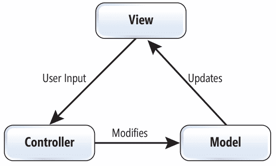
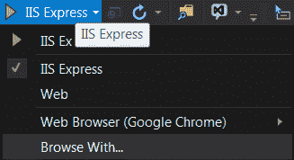
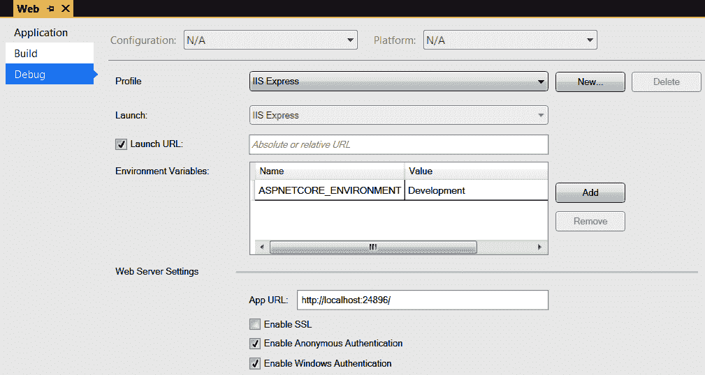

# 一、ASP.NET Core 起步

欢迎阅读我关于 ASP.NET Core 3 的新书！

.NET 和 ASP.NET Core 在技术领域相对较新，因为它们仅在 2017 年 8 月正式发布。考虑到.NET 的名称，您可能会认为这些可能只是非常流行的.NET 框架的新版本，但事实并非如此：我们谈论的是一些真正新的东西！

这不仅仅是多平台支持（howdy，Linux！），而且还有更多。这是所有内容中的新模块化：我们现在可以通过透明的方式改变事情——我们眼前的源代码戏弄我们为之做出贡献，使之变得更好——这与以前版本的.NET Core 确实有很大不同！

在第一章中，我们将讨论 ASP.NET 和.NET 在核心版本中的变化，以及新的底层概念，如 OWIN、运行时环境和**依赖注入**（**DI**）。

在本章中，我们将介绍以下主题：

*   ASP.NET Core 的历史
*   NET Core 简介
*   控制反转与 DI
*   奥温
*   MVC 模式
*   群众或部队的集合
*   环境
*   ASP.NET Core 应用的引导过程如何工作
*   通用主机

*   自 ASP.NET Core 2 以来的新功能
*   NuGet 和`dotnet`工具

# 技术要求

本章不需要任何特定的软件组件，因为它更多地涉及概念。

您可以在[找到 GitHub 链接 https://github.com/PacktPublishing/Modern-Web-Development-with-ASP.NET-Core-3-Second-Edition](https://github.com/PacktPublishing/Modern-Web-Development-with-ASP.NET-Core-3-Second-Edition) 。

# 开始

Microsoft ASP.NET 是 15 年前，即 2002 年发布的，是当时崭新的.NET 框架的一部分。它继承了其前身的名称**ASP**（简称**Active Server Pages**），除了作为一种为互联网开发动态服务器端内容的技术（仅在 Windows 平台上运行）之外，它几乎没有与之共享任何其他内容。

可以说，ASP.NET 获得了巨大的普及，并与其他流行的 web 框架展开了激烈的竞争，如**Java 企业版**（**JEE**）和 PHP。事实上，它仍然如此，像**BuiltWith**这样的网站让它的份额达到了 21%（ASP.NET 和 ASP.NET MVC 加起来），远远领先于 Java（[https://trends.builtwith.com/framework](https://trends.builtwith.com/framework) 。ASP.NET 不仅仅用于编写动态网页。它还可以用于 XML（SOAP）web 服务，在 2000 年初非常流行。它得益于.NET Framework 及其大型类库和可重用组件，这使企业开发看起来几乎很容易！

它的第一个版本 ASP.NET 1 引入了 web 表单，试图将桌面风格应用的事件和组件模型引入 web，从而使用户免受 HTML、HTTP 和状态维护等不太友好的方面的影响。在某种程度上，它是非常成功的；使用 VisualStudio，您可以在几分钟内轻松创建数据驱动的动态站点！很多东西仅仅通过标记就可以完成，不需要修改代码（读取或编译）。

几年后，版本 2 出现了，在所有其他好东西中，它以提供者模型的形式带来了可扩展性。它的许多功能都可以通过自定义提供者进行调整。后来，它又增加了 AJAX 扩展，这使得 AJAX 风格的效果非常简单。它为未来几年制定了标准，只为更多组件留下了空间。

老实说，以下版本 3.5、4 和 4.5 只提供了更多相同的功能，包括用于显示数据的新专用控件和用于检索和操作数据的图表，以及一些安全改进。一个巨大的变化是，一些框架库作为开源发布。

在 3.5 版和 4 版之间，微软发布了一个全新的框架，基于**模型视图控制器**（**MVC**模式），大部分是开源的。尽管它位于 ASP.NET 构建的基础设施之上，但它提供了一种全新的开发模式，这次完全采用了 HTTP 和 HTML。这似乎是当前跨技术 web 开发的趋势，PHP、Ruby 和 Java 等开发人员以及.NET 开发人员普遍对此感到满意。ASP.NET 开发人员现在有两种选择 Web 窗体和 MVC，它们都共享 ASP.NET 管道和.NET 库，但提供两种截然不同的方法将内容传送到浏览器。

与此同时，如今备受推崇的.NET 框架在一个不断变化的世界中成长起来。在现代企业中，需求已经发生了变化，像*这样的句子只在 Windows 上运行*或*我们需要等待 XX 年才能获得下一个版本*几乎无法接受。认识到这一点，微软开始着手开发一些新的、与众不同的东西，为未来几年制定日程。进入.NET Core！

2014 年末，微软发布了.NET Core。它是一个独立于平台、语言不可知、免费、开源的.NET 框架的完全重写。其主要特点如下：

*   NET 的基类库将从零开始重写，同时保留相同的（简化的）公共 API，这意味着并非所有库最初都可用。
*   它还能够在非 Windows 操作系统上运行，特别是在几种 Linux 和 macOS 版本上，并在移动设备上运行，因此所有 Windows 特定的代码（和 API）都将被丢弃。
*   它的所有组件都将作为 NuGet 软件包交付，这意味着主机中只需要安装一个小的引导二进制文件。
*   与 IIS 之间不再存在依赖关系（或者说，关系非常密切），因此它可以自动托管或在托管进程内运行，就像 IIS 一样。
*   它将是开源的，开发者可以通过创建问题或提交请求来影响它。

这最终发生在 2016 年 7 月，.NET Core 的 1.0 版发布时。NET 开发人员现在可以编写一次并（几乎）部署到任何地方，他们最终对框架的发展方向有了发言权！

从头开始重写整个.NET 框架是一项艰巨的任务，因此微软必须做出决定并确定优先次序。其中之一就是抛弃 ASP.NETWeb 表单，只包括 MVC。ASP.NET 和 Web 表单是同义词的日子一去不复返了，ASP.NET Core 和 MVC 也是如此：它现在只是 ASP.NET Core！不仅是 ASP.NETWebAPI，它曾经是一种不同的项目类型，现在也与 ASP.NETCore 合并了（微软的明智决定，因为基本上 MVC 和 WebAPI 这两种技术有很多重叠，甚至出于几乎相同的目的有相同名称的类）。

那么，这对开发人员意味着什么呢？以下是我个人对科技发展的看法：

*   C#、Visual Basic 和 F#；F#在开发人员社区中获得了很多动力，他们为 VisualStudio 构建了模板以及许多有用的库。
*   开源是伟大的！如果您想更改任何内容，只需从 GitHub 获取代码并自己进行更改即可！如果它们足够好，那么其他人也可能对它们感兴趣，那么为什么不提交一个 pull 请求来集成它们呢？
*   我们不需要预先决定是否要使用 MVC 或 WebAPI。只需随时添加一两个 NuGet 包，并在`Startup.cs`文件中添加几行即可；同一控制器可以无缝地为 API 和 web 请求提供服务。
*   属性路由是内置的，因此不需要任何显式配置。
*   ASP.NET Core 现在为基于.NET（**OWIN**）的中间件和配置使用**开放式 Web 界面，因此您需要（显著地）更改您的模块和处理程序，使其适合此模型；MVC/WebAPI 过滤器基本相同。**
*   它不依赖于 IIS 或 Windows，这意味着我们可以轻松地在旧的 Windows/Visual Studio 中编写应用，然后将它们部署到 Azure/AWS/Docker/Linux/macOS。从 VisualStudio 在 Docker/Linux 中调试我们的应用真的很酷！它也可以在控制台应用中自托管运行。
*   后者的结果是不再有**IIS 管理器**或`web.config`/`machine.config`文件。

*   并非所有的库都可用于.NET Core，这意味着您需要找到替换库或自己实现这些功能。网站[https://icanhasdot.net/Stats](https://icanhasdot.net/Stats) 有一个关于.NET Core 可用/不可用的列表，在[的项目路线图中也有一个列表 https://github.com/dotnet/core/blob/master/roadmap.md](https://github.com/dotnet/core/blob/master/roadmap.md) 。
*   即使是核心类（双关语）。NET Core 类仍然缺少一些以前存在的方法；以`System.Environment`类中的一些方法为例。
*   您需要为想要使用的库手工挑选 NuGet 包，包括您在过去认为理所当然的类。对于.NET；这包括，例如，`System.Collections`（[https://www.nuget.org/packages/System.Collections](https://www.nuget.org/packages/System.Collections) ），因为它们不是自动引用的。有时很难找到哪个 NuGet 包包含您想要的类；当这种情况发生时，[http://packagesearch.azurewebsites.net](http://packagesearch.azurewebsites.net) 可能会派上用场。
*   不再有 Web 表单（以及 VisualStudio 中的 visual designer）；现在是 MVC，也就是 Blazor，它提供了一些类似于 Web 表单的功能，并且也有一些优势！耶！

让我们先看看.NETCore 到底是关于什么的。

# 从.NETCore 开始

谈论 ASP.NET Core 而不解释.NET Core 有点麻烦。netcore 是每个人都在谈论的框架，这是有充分理由的。ASP.NETCore 可能是目前最有趣的 API，因为似乎一切都在向 web 转移。

为什么会这样？所有这些 API 都严重依赖 Windows 本机功能；事实上，Windows 窗体只是 Win32 API 的包装器，自 Windows 诞生之初就一直伴随着它。由于.NETCore 是多平台的，因此为所有受支持的平台提供这些 API 的版本将是一项巨大的努力。但当然，这绝不意味着它不会发生；只是它还没有发生。

对于.NETCore，主机运行应用只需要相对较小的引导代码；应用本身需要包含所有需要操作的参考库。有趣的是，可以将.NET Core 应用编译为本机格式，从而生成包含所有依赖项的特定于机器的可执行文件，甚至可以在没有.NET Core 引导程序的机器上运行。

正如我前面所说，.NETCore 是从头开始编写的，不幸的是，这意味着我们以前使用的所有 API 都没有被移植。具体而言，从版本 3 开始，以下功能仍然缺失：

*   ASP.NET Web 表单（`System.Web.UI`
*   XML Web 服务（`System.Web.Services`
*   LINQ 到 SQL（`System.Data.Linq`）
*   Windows 通信基础服务器端类（AutoT0）
*   Windows 工作流基础（AutoT0 和 T1）
*   .NET 远程处理（`System.Runtime.Remoting`
*   Active Directory/LDAP（`System.DirectoryServices`）
*   企业服务（`System.EnterpriseServices`
*   电子邮件（`System.Net.Mail`
*   XML 和 XSD（`System.Xml.Xsl`和`System.Xml.Schema`）
*   输入/输出端口（`System.IO.Ports`）
*   托管加载项框架（`System.Addin`
*   演辞（`System.Speech`
*   配置（`System.Configuration`；这一个被一个新的配置 API（`Microsoft.Extensions.Configuration`替代）
*   Windows 管理工具（`System.Management`）
*   Windows 以外的操作系统中的 Windows 注册表（【T0）】

这并不是一份详尽的清单。正如您所看到的，缺少了很多功能。尽管如此，只要我们以不同的方式做事并处理额外的负担，我们还是有可能实现我们所需要的一切！请注意，所有平台上都支持 Windows 窗体和 WPF。

以下 API 是新的或仍然存在，可以安全使用：

*   MVC 和 Web API（`Microsoft.AspNetCore.Mvc`）
*   实体框架核心（`Microsoft.EntityFrameworkCore`
*   Roslyn 用于代码生成和分析（`Microsoft.CodeAnalysis`
*   所有 Azure API
*   托管可扩展性框架（`System.Composition`）
*   文本编码/解码和正则表达式处理（`System.Text`

*   JSON 序列化（`System.Runtime.Serialization.Json`）
*   低层代码生成（`System.Reflection.Emit`）
*   大部分 ADO.NET（`System.Data`、`System.Data.Common`、`System.Data.SqlClient`、`System.Data.SqlTypes`）
*   LINQ 和并行 LINQ（`System.Linq`
*   集合，包括并发（`System.Collections`、`System.Collections.Generic`、`System.Collections.ObjectModel`、`System.Collections.Specialized`、`System.Collections.Concurrent`）
*   线程、进程间通信和任务原语（`System.Threading`
*   输入/输出、压缩、隔离存储、内存映射文件、管道（`System.IO`
*   XML（`System.Xml`
*   Windows 通信基础客户端类（AutoT0.）
*   密码学（`System.Security.Cryptography`
*   平台调用和 COM 互操作（`System.Runtime.InteropServices`
*   通用 Windows 平台（`Windows`
*   Windows 事件跟踪（`System.Diagnostics.Tracing`
*   数据注释（`System.ComponentModel.DataAnnotations`）
*   网络，包括 HTTP（`System.Net`）
*   反射（`System.Reflection`）
*   数学与数字（`System.Numerics`
*   无功扩展（`System.Reactive`）
*   全球化与本土化（`System.Globalization`、`System.Resources`）
*   缓存（包括内存和 Redis）（`Microsoft.Extensions.Caching`
*   日志记录（`Microsoft.Extensions.Logging`
*   配置（`Microsoft.Extensions.Configuration`）

同样，这不是完整的列表，但您可以了解情况。这些只是为.NETCore 提供的 Microsoft API；显然还有成千上万的其他供应商。

And why are these APIs supported? Well, because they are specified in **.NET Standard**, and .NET Core implements this standard! More on this in a moment.

在.NET Core 中，不再有**全局程序集缓存**（**GAC**），而是有一个集中的位置（每个用户）来存储 NuGet 包，称为`%HOMEPATH%.nugetpackages`，它防止您在本地为所有项目复制包。NETCore2.0 引入了**运行时存储**，与 GAC 有些相似。本质上，它是本地机器上的一个文件夹，其中一些包可用并根据机器的体系结构进行编译。存储在那里的包永远不会从 NuGet 下载；它们被本地引用，不需要包含在应用中。我不得不说，这是一个值得欢迎的补充！您可以在[上阅读有关元包和运行时存储的更多信息 https://docs.microsoft.com/en-us/aspnet/core/fundamentals/metapackage](https://docs.microsoft.com/en-us/aspnet/core/fundamentals/metapackage) 。

从 ASP.NET Core 2.1 开始，对以前的版本进行了更改：以前依赖于`Microsoft.AspNetCore.All`元包，现在依赖于`Microsoft.AspNetCore.App`。长话短说，这个版本的依赖性要小得多。具体而言，已删除以下依赖项：

*   `Microsoft.Data.Sqlite`
*   `Microsoft.Data.Sqlite.Core`
*   `Microsoft.EntityFrameworkCore.Sqlite`
*   `Microsoft.EntityFrameworkCore.Sqlite.Core`
*   `Microsoft.Extensions.Caching.Redis`
*   `Microsoft.AspNetCore.DataProtection.AzureStorage`
*   `Microsoft.Extensions.Configuration.AzureKeyVault`
*   `Microsoft.AspNetCore.DataProtection.AzureKeyVault`
*   `Microsoft.AspNetCore.Identity.Service.AzureKeyVault`
*   `Microsoft.AspNetCore.AzureKeyVault.HostingStartup`
*   `Microsoft.AspNetCore.ApplicationInsights.HostingStartup`

从 3.0 版开始，Visual Studio 模板就已经引用了这个新的元包，一般来说，一切都应该正常工作；如果使用其中一个缺少的包，您可能需要添加显式引用。

有趣的是，从版本 3 开始，您不再需要在`.csproj`文件中引用此元包；当您引用.NET Core 3 framework 时，默认情况下会引用它。以下是最低限度的.NET Core 3`.csproj`文件：

```cs
<Project Sdk="Microsoft.NET.Sdk.Web">
  <PropertyGroup>
    <TargetFramework>netcoreapp3.1</TargetFramework>
  </PropertyGroup>
</Project>
```

对于.NET Core 3.1，您应该将`netcoreapp3.0`替换为`netcoreapp3.1`。稍后，我们将进一步了解这一点。

NuGet 软件包是.NETCore 的核心，大部分内容都需要从 NuGet 获得。甚至同一 VisualStudio 解决方案中的项目也作为 NuGet 包相互引用。使用.NET Core 时，需要显式添加包含您希望使用的功能的 NuGet 包。在您的一些项目中，您可能会遇到以下一些包：

| **包装** | **目的** |
| `Microsoft.AspNetCore.Authentication.JwtBearer` | JWT 认证 |
| `Microsoft.AspNetCore.Mvc.TagHelpers` | 标记助手 |
| `Microsoft.EntityFrameworkCore` | 实体框架核心 |
| `Microsoft.Extensions.Caching.Memory` | 内存缓存 |
| `Microsoft.Extensions.Caching.Redis` | Redis 缓存 |
| `Microsoft.Extensions.Configuration` | 一般配置类 |
| `Microsoft.Extensions.Configuration.EnvironmentVariables` | 从环境变量进行配置 |
| `Microsoft.Extensions.Configuration.Json` | 从 JSON 文件进行配置 |
| `Microsoft.Extensions.Configuration.UserSecrets` | 来自用户机密的配置（[https://docs.microsoft.com/en-us/aspnet/core/security/app-secrets](https://docs.microsoft.com/en-us/aspnet/core/security/app-secrets) ） |
| `Microsoft.Extensions.Configuration.Xml` | XML 中的配置 |
| `Microsoft.Extensions.DependencyInjection` | 内置 DI 框架 |
| `Microsoft.Extensions.Logging` | 日志基类 |
| `Microsoft.Extensions.Logging.Console` | 登录到控制台 |
| `Microsoft.Extensions.Logging.Debug` | 记录到调试 |
| `System.Collections` | 收藏 |
| `System.ComponentModel` | 组件和数据源定义中使用的类和接口 |
| `System.ComponentModel.Annotations` | 用于验证和元数据的数据注释 |
| `System.Data.Common` | ADO.NET |
| `System.Globalization` | 全球化和本地化 API |
| `System.IO` | 输入/输出 API |
| `System.Linq.Parallel` | 并行 LINQ |
| `System.Net` | 网络 API |
| `System.Reflection` | 反射 |
| `System.Security.Claims` | 基于债权的担保 |
| `System.Threading.Tasks` | 任务执行 |
| `System.Xml.XDocument` | XML API |
| `System.Transactions` | 环境事务 |

同样，这不是一个详尽的列表，但你可以了解情况。您可能看不到对所有这些包的引用，因为添加一个具有依赖项的包将带来所有这些依赖项，而大型包有很多依赖项。

没有更多的`.exe`文件；现在，所有程序集都是`.dll`，这意味着它们需要使用`dotnet`命令行实用程序运行。与.NET Framework 控制台和 Windows 窗体一样，所有.NET Core 应用都以静态的`Main`方法开始，但现在我们需要`dotnet`实用程序来运行它们。`dotnet`工具是一个非常通用的工具，可用于构建、运行、部署和恢复 NuGet 软件包，执行单元测试，以及从项目中创建 NuGet 软件包。正如我所说的，也可以将程序集编译为本机格式，但我们在这里不讨论这一点。

.NETCore 附带了内置的 DI、日志记录和灵活的配置框架，允许您插入自己的提供者（如果您愿意）。所有新 API（如 Entity Framework Core 和 ASP.NET Core）都统一使用这些服务。这是我们第一次看到 API 之间的一致行为。

此外，大多数生产 API（如 ASP.NET 和 Entity Framework）允许您用自定义版本替换它们构建的服务，允许您使它们完全按照您希望它们提供的方式工作，当然，您知道自己在做什么，并且这些服务通常基于接口。一切都更加模块化和透明。

单元测试在.NETCore 中获得了一流的公民资格。大多数新 API 的设计都考虑了可测试性（例如，考虑实体框架核心的新内存提供程序），并且工具（`dotnet`具有执行单元测试的显式选项，可以在任何框架中编写（当前，**xUnit**、**NUnit**、**MbUnit**和**MSTest**等发布了与.NET Core 兼容的单元测试框架）。我们将在[第 13 章](13.html)中介绍单元测试，*了解测试的工作原理*。

接下来，让我们看看支持.NETCore 的平台。

## 支撑平台

.NET Core 在以下平台上工作：

*   Windows 7 SP1 或更高版本
*   Windows Server 2008 R2 SP1 或更高版本
*   Red Hat Enterprise Linux 7.2 或更高版本
*   软呢帽 23 或更高
*   Debian 8.2 或更高版本
*   Ubuntu 14.04 LTS/16.04 LTS 或更高版本
*   Linux Mint 17 或更高版本
*   openSUSE 13.2 或更高版本
*   CentOS 7.1 或更高版本
*   Oracle Linux 7.1 或更高版本
*   macOS X 10.11 或更高版本

这涵盖了所有现代 Windows、Linux 和 macOS 发行版（Windows7SP1 于 2010 年发布）。它可能在其他发行版中也能正常工作，但这些发行版已经过微软的全面测试。

那么，这是如何工作的呢？事实证明，每当您请求需要操作系统中未包含的本机库的 NuGet 包时，这些库也会包含在`.nupkg`存档中。NET Core 使用**平台调用**（**P/Invoke**调用操作系统特定的库。这意味着您不必担心添加 NuGet 包和发布项目的过程是相同的，无论目标操作系统是什么。

请记住，平台独立性对您（开发人员）是透明的，当然，除非您碰巧也是库作者，在这种情况下，您可能需要关心它。

现在让我们看看过去组成.NET 的不同框架现在是如何得到支持的。

# 依赖关系和框架

在.NET Core 项目中，您可以指定希望针对的框架。这些框架是什么？是的，.NET Core 本身，但经典的.NET 框架也是如此，Xamarin、**通用 Windows 平台**（**UWP**）、**便携类库**（**PCL**）、Mono、Windows Phone 等等。

在.NETCore 的早期，您要么以.NETCore 本身为目标，要么/以及这些其他框架之一。现在，建议以标准为目标。现在我们有了.NET 标准，两者的区别如下：

*   .NET 标准是一个规范（合同），涵盖了.NET 平台必须实现的 API。
*   .NET Core 是一个具体的.NET 平台，实现了.NET 标准。
*   最新的.NET 标准将始终涵盖发布的最高.NET 完整框架。

大卫·福勒（[https://twitter.com/davidfowl 微软的](https://twitter.com/davidfowl)做出了如下类比：

```cs
interface INetStandard10
{
    void Primitives();
    void Reflection();
    void Tasks();
    void Collections();
    void Linq();
}

interface INetStandard11 : INetStandard10
{
    void ConcurrentCollections();
    void InteropServices();
}

interface INetFramework45 : INetStandard11
{
    // Platform specific APIs 
    void AppDomain(); 
    void Xml(); 
    void Drawing(); 
    void SystemWeb(); 
    void WPF(); 
    void WindowsForms(); 
    void WCF(); 
}
```

这应该很容易理解。如您所见，所有需要 Windows（WPF、Windows 窗体、绘图）的.NET API 仅在特定平台（.NET 4.5）中可用，而不是在标准中。标准是针对跨平台功能的。

For more information, please refer to [https://docs.microsoft.com/en-us/dotnet/articles/standard/library](https://docs.microsoft.com/en-us/dotnet/articles/standard/library).

因此，与其针对特定版本，如.NET 4.5.1、.NET Core 1.0、Mono、Universal Windows Platform 10，不如针对.NET 标准。您的项目保证在支持该标准（或更高标准）的所有平台上工作，无论是现有的还是等待创建的平台。如果这对你很重要的话，你应该尽量将你的依赖性保持在尽可能低的标准，以增加你的应用将使用的平台的数量。

在本书撰写时，不同的.NET 框架和它们实现的.NET 标准之间的当前映射在[中始终可用 https://github.com/dotnet/standard/blob/master/docs/versions.md](https://github.com/dotnet/standard/blob/master/docs/versions.md) 。
.NET Core 2.0 和.NET Standard 2.0 于 2017 年 8 月推出，现在有四个框架针对.NET Standard 2.0：

*   .NET Framework 完整版
*   .NETCore2.x
*   沙马林
*   单声道

.NET Core 3.0 于 2019 年 9 月面世，并随.NET Standard 2.1 面世。

可以为每个目标或所有目标指定依赖项。在前一种情况下，所有依赖项都需要支持所有目标，而在后一种情况下，我们可以对每个目标具有不同的依赖项。您可能希望混合使用这两种方法，将公共库作为全局依赖项，并仅在可用的情况下指定更专业的库。如果您针对的是多个标准（或框架），那么请注意，因为您可能必须求助于条件定义（`#if`）来针对仅存在于其中一个标准（或框架）中的功能。让我们看看如何。

The .NET Standard FAQ is available in GitHub at [https://github.com/dotnet/standard/blob/master/docs/faq.md](https://github.com/dotnet/standard/blob/master/docs/faq.md).

## 以.NET Core 或完整的.NET 框架为目标

您必须知道，您可以在 ASP.NET Core 应用中针对完整的.NET framework！但是，如果您这样做，您将失去平台独立性，也就是说，您将只能在 Windows 上运行它。

默认情况下，ASP.NET Core 项目的目标是`netcoreapp1.x`、`netcoreapp2.x`或`netcoreapp3.x`，具体取决于您是针对 ASP.NET Core 1.x、2.x 还是 3.x，但您可以在`.csproj`文件中对其进行更改。如果只想针对一个框架，那么修改`TargetFramework`元素如下：

```cs
<TargetFramework>net461</TargetFramework>
```

或者，如果您想针对多个目标，请将`TargetFramework`替换为`TargetFrameworks`：

```cs
<TargetFrameworks>netcoreapp3.0;net461</TargetFrameworks>
```

有关更多信息，请参阅位于[的 Microsoft 文档 https://docs.microsoft.com/en-us/dotnet/core/tools/csproj](https://docs.microsoft.com/en-us/dotnet/core/tools/csproj) 。

对于.NET Core 和.NET 标准，您应该在`TargetFramework`或`TargetFrameworks`中使用以下名称：

| **.NET Core/标准版** | **绰号** |
| .NET Core 1 | `netcoreapp1.0` |
| .NET Core 1.1 | `netcoreapp1.1` |
| .NET Core 2 | `netcoreapp2.0` |
| .NET Core 2.1 | `netcoreapp2.1` |
| .NET Core 2.2 | `netcoreapp2.2` |
| .NET Core 3.0 | `netcoreapp3.0` |
| .NET Core 3.1 | `netcoreapp3.1` |
| .NET 标准 1.0 | `netstandard1.0` |
| .NET 标准 1.1 | `netstandard1.1` |
| .NET 标准 1.2 | `netstandard1.2` |
| .NET 标准 1.3 | `netstandard1.3` |
| .NET 标准 1.4 | `netstandard1.4` |
| .NET 标准 1.5 | `netstandard1.5` |
| .NET 标准 1.6 | `netstandard1.6` |
| .NET 标准 2.0 | `netstandard2.0` |
| .NET 标准 2.1 | `netstandard2.1` |

请参见[https://docs.microsoft.com/en-us/dotnet/standard/frameworks](https://docs.microsoft.com/en-us/dotnet/standard/frameworks) 获取最新列表。接下来，让我们看看通用托管是如何工作的。

# 了解通用主机

从 3.0 版开始，ASP.NET Core 现在使用通用主机进行引导。这意味着它没有专门绑定到 HTTP 或任何其他 web 协议，但它可能支持任何类型的协议，包括低级 TCP。模板已更改，现在引导看起来如下所示：

```cs
Host
 .CreateDefaultBuilder(args)
 .ConfigureWebHostDefaults(webBuilder =>
 {
     webBuilder.UseStartup<Startup>();
 });
```

我们现在使用`Host`类来创建实现`IHostBuilder`而不是`IWebHostBuilder`的类的实例，尽管结果是相同的。

我们可以通过扩展方法干预引导过程。具体而言，我们可以配置以下各项：

*   服务注册
*   登录中
*   配置
*   Web 主机默认设置（主机、启动类）

以下是更改配置的完整示例：

```cs
Host
    .CreateDefaultBuilder(args)
    .ConfigureHostConfiguration(builder =>
    {
        //host configuration (Kestrel or HTTP.sys)
        builder.Properties["key"] = "value";
    })
    .ConfigureAppConfiguration(builder =>
    {
        //app configuration
        builder.Add(new JsonConfigurationSource { Path = 
        "./configuration.json", Optional = true });
        builder.Properties["key"] = "value";
    })
    .ConfigureLogging(builder =>
    {
        //add logging providers
        builder.AddConsole();
    })
    .ConfigureServices(services =>
    {
        //register services
        services.AddSingleton<IMyService, MyService>();
    })
    .ConfigureWebHostDefaults(webBuilder =>
    {
        builder.ConfigureKestrel(options =>
        {
            //set Kestrel options
        });

        //set the startup class
        webBuilder.UseStartup<Startup>();
    })
```

更改应用的`IHostLifetime`通常没有意义，因为这与我们正在构建的应用的类型有关。我们的选择如下：

*   `ConsoleLifetime`：默认跨平台主机；收听`CTRL-C`和`SIGINT`、`SIGTERM`停止信号
*   `SystemdLifetime`：适用于使用`systemd`的操作系统，如 MacOS、Linux 等；收听`SIGTERM`信号
*   `WindowsServiceLifetime`：仅适用于窗户；侦听 Windows 服务事件

当应用完成加载、即将停止或已停止时，主机负责调用`IHostApplicationLifetime`事件。您可以在[第 18 章](18.html)、*gRPC 和其他主题*中阅读。

在`ConfigureServices`中注册的服务将可被注入`Startup`类的构造函数中，并且也将出现在传递给其`ConfigureServices`方法的`services`参数中。日志提供商和应用配置也是如此。接下来，让我们转到 MVC 模式。

# 理解 MVC 模式

现在让我们回到 ASP.NET。对于那些仍在使用 Web 表单的人来说，MVC 到底是什么，它从何而来？

让我们面对现实吧：在 Web 表单中很容易做一些糟糕的事情，比如在页面中添加大量敏感代码（在浏览器访问页面之前，这些代码不会被编译）、向页面类添加复杂的业务逻辑、在每次请求时都有几兆字节处于视图状态的代码来回移动等等。除了开发人员的自由裁量权之外，根本没有任何机制来以正确的方式做事。另外，对它进行单元测试是很糟糕的，因为它依赖浏览器提交（`POST`和 JavaScript 使事情正常工作，例如将动作绑定到事件处理程序，并将值提交到控件。必须有一个不同的解决方案，事实上，确实有。

**模型-视图-控制器**（**MVC**）设计模式是在上个世纪 70 年代末和 80 年代初定义的（很可怕，不是吗？）。它被认为是一种适当分离概念上不应该在一起的事物的方法，例如呈现**用户界面**（**UI**的代码）和包含业务逻辑和数据访问的代码，这些代码将提供和控制该 UI。在 MVC 范式（及其后代）中，我们有公开公共行为的控制器。在每个操作中，控制器应用它需要的任何业务逻辑，然后决定应该呈现哪个视图，并向它传递足够的信息（模型），以便它能够完成它的工作。控制器对 UI 元素一无所知，它只获取在操作内部操作所需的数据和执行上下文，然后从那里开始。同样，视图对数据库、web 服务、连接字符串、SQL 等也一无所知，它只是呈现数据，可能只是简单地决定执行方式。至于模型，它基本上是包含视图所需信息的任何内容，包括记录列表、静态用户信息等等。这种严格的分离使事情更易于管理、测试和实现。当然，MVC 模式并不特定于 web，只要这种关注点分离是有用的，比如当我们有一个 UI 和一些代码来控制它时，就可以使用 MVC 模式。

下图显示了视图、控制器和模型之间的关系：



Image taken from https://docs.microsoft.com/en-us/archive/msdn-magazine/2013/november/asp-net-single-page-applications-build-modern-responsive-web-apps-with-asp-net

MVC 通常与**面向对象编程**（**OOP**）相关联，但也有多种语言的实现，包括 JavaScript 和 PHP。.NET MVC 实现具有以下基本特征：

*   **控制器**类可以是**普通的旧 CLR 对象**（**POCOs**）或继承自基类`Controller`。继承`Controller`不是必需的（与以前的版本不同），但它确实使事情稍微容易一些。控制器类由 ASP.NET Core DI 框架实例化，这意味着它们可以将所依赖的服务传递给它们。
*   **动作**是控制器中的公共方法；它们可以接受参数，包括简单类型和复杂类型（POCO）。MVC 使用所谓的模型绑定将从浏览器发送的信息（查询字符串、标题、cookie、表单、DI 和其他位置）转换为方法参数。从请求 URL 和提交的参数中选择从哪个控制器调用哪个方法是通过路由表、约定和助手属性的混合实现的。
*   **模型**在动作方法的返回中从控制器发送到视图，基本上可以是任何东西（或什么都没有）。当然，API 调用的操作方法不返回视图，但可以返回带有 HTTP 状态代码的模型。还有其他向视图传递数据的方法，例如视图包，它本质上是一个非类型化的数据字典（一个大包）；两者的区别在于模型通常是类型化的。模型将自动验证并绑定到动作方法参数。

*   **视图**由**领域特定语言**（**DSL**文件）组成，这些文件由视图引擎解释，并转化为浏览器可以解释的内容，如 HTML。ASP.NET Core 具有一个可扩展的视图引擎框架，但包含一个实现，**Razor**。Razor 提供了一种简单的语法，允许开发人员混合使用 HTML 和 C，以掌握传入的模型并决定如何使用它。视图可以受到布局的约束（Web 表单开发人员可以将布局视为母版页），并且可以包含其他局部视图（类似于 Web 表单中的 Web 用户控件）。Razor 视图引擎的视图具有`.cshtml`扩展名，并且不能仅作为操作调用的结果直接访问。可以预编译视图，以便更快地检测到语法错误。
*   **过滤器**用于拦截、修改或完全替换请求；例如，内置筛选器使您能够在发生异常时阻止对未经身份验证的用户的访问或重定向到错误页面。

现在，还有其他类似于 MVC 的模式，如**模型视图演示器**（**MVP**）或**模型视图视图模型**（**MVVM**）。我们将只关注微软的 MVC 实现及其细节。特别是，ASP.NET Core 附带的 MVC 版本是版本 6，因为它构建在版本 5 上，该版本以前可用于.NET 完整框架，但添加和删除了两个功能。由于它现在位于新的.NET Core 框架上，它完全基于 OWIN，因此不再有`Global.asax.cs`文件。稍后将对此进行详细介绍。

在 ASP.NET 中实现 MVC 的方式主要包括以下几点：

*   **URL**：它们现在更有意义，而且**搜索引擎优化**（**SEO**友好。
*   **HTTP 谓词**：谓词现在准确地说明了操作应该做什么，例如，`GET`用于幂等运算，`POST`用于新内容，`PUT`用于完整内容更新，`PATCH`用于部分内容更新，`DELETE`用于删除，等等。
*   **HTTP 状态码**：用于返回操作结果码，在 Web API 的情况下更为重要。

例如，向`http://somehost/Product/120`发出`GET`请求可能会返回 ID 为`120`的产品视图，而向相同 URL 发出`DELETE`请求可能会删除该产品并返回 HTTP 状态码或尼斯视图，告知我们事实。

URL 及其与控制器和操作的绑定可通过路由进行配置，并且此 URL 可能由名为`ProductController`的控制器和配置为处理`GET`或`DELETE`请求的操作方法处理。无法从 URL 提取视图，因为它们是在 action 方法中确定的。

我们将在以下章节中深入介绍微软的 MVC 实现。当然，作为.NET 的核心功能，它的所有组件都可以作为 NuGet 包提供。您可能会发现以下几点：

| **包装** | **目的** |
| `Microsoft.AspNetCore.Antiforgery` | 防伪原料药 |
| `Microsoft.AspNetCore.Authentication` | 身份验证基类 |
| `Microsoft.AspNetCore.Authentication.Cookies` | 通过 cookie 进行身份验证 |
| `Microsoft.AspNetCore.Authentication.JwtBearer` | JWT 认证 |
| `Microsoft.AspNetCore.Authorization` | 授权 API |
| `Microsoft.AspNetCore.Diagnostics` | 诊断 API |
| `Microsoft.AspNetCore.Hosting` | 托管基类 |
| `Microsoft.AspNetCore.Identity` | 身份验证 |
| `Microsoft.AspNetCore.Identity.EntityFrameworkCore` | 以实体框架核心作为存储的标识 |
| `Microsoft.AspNetCore.Localization.Routing` | 路由本地化 |
| `Microsoft.AspNetCore.Mvc` | MVC 的核心特性 |
| `Microsoft.AspNetCore.Mvc.Cors` | 支持**跨源请求脚本编制**（**CORS**） |
| `Microsoft.AspNetCore.Mvc.DataAnnotations` | 通过数据注释进行验证 |
| `Microsoft.AspNetCore.Mvc.Localization` | 基于本地化的 API |
| `Microsoft.AspNetCore.Mvc.TagHelpers` | 标记助手功能 |
| `Microsoft.AspNetCore.Mvc.Versioning` | Web API 版本控制 |
| `Microsoft.AspNetCore.ResponseCaching` | 响应缓存 |
| `Microsoft.AspNetCore.Routing` | 路由 |
| `Microsoft.AspNetCore.Server.IISIntegration` | IIS 集成 |
| `Microsoft.AspNetCore.Server.Kestrel` | 红隼服务器 |
| `Microsoft.AspNetCore.Server.WebListener`（`Microsoft.AspNetCore.Server.HttpSys`在 ASP.NET Core 2 中） | WebListener 服务器（现在称为`HTTP.sys`。参见[https://docs.microsoft.com/en-us/aspnet/core/fundamentals/servers/httpsys](https://docs.microsoft.com/en-us/aspnet/core/fundamentals/servers/httpsys) 。 |
| `Microsoft.AspNetCore.Session` | 会话功能 |
| `Microsoft.AspNetCore.StaticFiles` | 能够为静态文件提供服务 |

您可能需要也可能不需要所有这些软件包，但您应该熟悉它们。

In ASP.NET Core 2.0, there was the `Microsoft.AspNetCore.All` NuGet metapackage, and since 2.1 there is `Microsoft.AspNetCore.App`. The former included lots of packages, so a decision was made to have another metapackage with far fewer dependencies. Since version 2.1, all projects will include `Microsoft.AspNetCore.App`, and you may need to add other dependencies, such as SQLite, Redis, Azure Storage, and ApplicationInsights. You can read a discussion about it at [https://github.com/aspnet/Announcements/issues/287](https://github.com/aspnet/Announcements/issues/287).

接下来，让我们看看上下文执行是如何工作的。

# 了解你的背景

您可能还记得 ASP.NET 中的`HttpContext`类。此类的当前实例将表示当前执行上下文，其中包括请求信息和响应通道。它无处不在，尽管在 Web 表单中它有时是隐藏的，但它是 Web 应用与客户端通信的方式。

当然，ASP.NET Core 也有一个`HttpContext`类，但有一个很大的区别：不再有`Current`静态属性让我们掌握当前上下文，相反，这个过程有点复杂。无论如何，所有的**基础设施**类中间件、控制器、视图、Razor 页面、视图组件、标记帮助程序和过滤器都允许轻松访问当前上下文。不使用的用户可以通过 DI 利用`IHttpContextAccessor`接口，并获得指向当前上下文的指针：

```cs
//this is required to register the IHttpContextAccessor
//services.AddHttpContextAccessor();

...

public MyType(IHttpContextAccessor httpContextAccessor)
{
    var httpContext = httpContextAccessor.HttpContext;
}
```

因此，除了`User`、`Request`和`Response`属性，这些属性大多与堆芯前的对应属性相似外，我们还有以下几点：

*   一个`Features`集合，公开当前托管服务器（Kestrel、WebListener/`HTTP.sys`等）实现的所有功能。
*   一个`RequestServices`属性，它使我们能够访问内置的 DI 框架（在下面的章节中有更多关于这方面的内容）。
*   `TraceIdentifier`属性，唯一标识 ASP.NET Core 2.x 中的请求；在早期版本中，我们必须通过一个特性来访问它。
*   一个`Connection`对象，可以从中获取客户端连接的相关信息，如客户端证书，例如：
    *   `Authentication`对象，可轻松访问安全原语，如登录、注销、拒绝等。
    *   `Session`对象，由`ISessionFeature`特性实现，由`HttpContext`直接公开。
    *   `ClientCertificate`属性包含客户端作为握手协议的一部分发送的任何 SSL 证书。

我们将看到，上下文是 ASP.NET Core 应用的重要组成部分。

## 与环境合作

我们可能在上下文中执行的主要操作如下：

*   从请求中读取值
*   给答复写信
*   读写 cookies
*   获取当前用户
*   正在获取远程用户的地址
*   访问会话
*   从 DI 框架访问服务

以下是一些例子：

```cs
//writing to the response
HttpContext.Response.StatusCode = 200;
HttpContext.Response.ContentType = "text/plain";
HttpContext.Response.WriteAsync("Hello, World!");

//getting values from the request
var id = HttpContext.Request.Query["id"].Single();
var host = HttpContext.Request.Host;
var payload = HttpContext.Request.Form["payload"].SingleOrDefault();

//reading and writing cookies
var isAuthenticated = HttpContext.Request.Cookies["id"].Any();
HttpContext.Response.Cookies.Append("id", email);

//getting the current user
var user = HttpContext.User;

//getting the address of the remote user
var ip = HttpContext.Connection.RemoteIpAddress;

//accessing the session
HttpContext.Session.SetString("id", email);
var id = HttpContext.Session.GetString("id");

//getting services from DI
var myService = HttpContext.RequestServices.Get<IMyService>();
```

本质上，我们将通过构造（比如 MVC 的控制器和动作）所做的一切都是围绕这些和其他简单的`HttpContext`操作构建的。我们将研究的下一个主题是 OWIN 管道。

# 了解 OWIN 管道

ASP.NET 的早期版本与微软的旗舰 web 服务器**互联网信息服务**（**IIS**）有着非常密切的关系。事实上，IIS 是承载 ASP.NET 的唯一受支持的方式。

为了改变这一点，微软为.NET（**OWIN**规范）定义了**开放式 Web 界面，您可以在[上阅读 http://owin.org](http://owin.org) 。简而言之，它是解耦服务器和应用代码以及 web 请求执行管道的标准。因为它只是一个标准，对 web 服务器（如果有的话）一无所知，所以可以使用它来提取其功能。**

.NET Core 大量借用了 OWIN 规范。没有更多的`Global.asax`、`web.config`或`machine.config`配置文件、模块或处理程序。我们所拥有的是：

*   `Program.Main`中的引导代码声明了一个包含约定定义方法的类（如果没有声明类，则使用`Startup`。
*   这种传统的方法，应该称为`Configure`，接收对`IApplicationBuilder`实例的引用（它可以从服务提供商处获取其他要注入的服务）。
*   然后开始向`IApplicationBuilder`添加中间件；这个中间件将处理您的 web 请求。

下面是一个简单的例子。首先是引导类，默认名称为`Program`：

```cs
public class Program
{
    public static void Main(string [] args) =>
        CreateWebHostBuilder(args).Build().Run();

    public static IHostBuilder CreateHostBuilder(string [] args) =>
        Host
            .CreateDefaultBuilder(args)
            .ConfigureWebHostDefaults(builder =>
                {
                    builder.UseStartup<Startup>();
                });
}
```

事情可能会变得更复杂，但现在不要太担心。稍后，我将解释这一切意味着什么。目前，我们已经知道我们正在利用一个`Host`来托管 Kestrel（默认主机），并传递一个名为`Startup`的常规类。这个`Startup`类看起来像这样（以简化的方式）：

```cs
public class Startup
{
    public IConfiguration Configuration { get; }

        {
        this.Configuration = configuration;
    }

    public void Configure(IApplicationBuilder app)
    {
        app.Run(async (context) => {
            await context.Response.WriteAsync("Hello, OWIN World!");
        }
    }
}
```

这里有几件事值得解释一下。首先，您会注意到，`Startup`类没有实现任何接口或从显式基类继承。这是因为`Configure`方法没有预定义的签名，除了它的名称之外，它的第一个参数是`IApplicationBuilder`。例如，还允许以下情况：

```cs
public void Configure(IApplicationBuilder app, IWebHostEnvironment env) { ... }
```

这个版本甚至比你要求的还多。但我离题了。

`IApplicationBuilder`接口定义了一个`Run`方法。此方法接受一个`RequestDelegate`参数，它是一个委托定义，接受一个`HttpContext`（记住？）作为其唯一参数，并返回一个`Task`。在我的示例中，我们通过向其添加`async`和`await`关键字使其异步，但不必如此。你所要做的就是确保你从`HttpContext`中提取你想要的东西，然后写你想要的东西。这是你的网络管道。它包装了 HTTP 请求和响应对象，我们称之为`middleware`。

`Run`方法本身就是一个成熟的管道，但我们可以使用（pun-designed）`Use`方法将其他步骤（中间件）插入管道：

```cs
app.Use(async (context, next) =>
{
    await context.Response.WriteAsync("Hello from a middleware!");
    await next();
});       
```

这样，我们可以添加多个步骤，它们都将按照定义的顺序执行：

```cs
app.Use(async (context, next) =>
{
    await context.Response.WriteAsync("step 1!");
    await next();
});

app.Use(async (context, next) =>
{
    await context.Response.WriteAsync("step 2!");
});       
```

请记住，这里的顺序很重要；下一个示例显示了这一点：

```cs
app.Use(async (context, next) =>
{
    try
    {
        //step 1
        await next();
    }
    catch (Exception ex)
    {
        await context.Response.WriteAsync($"Exception {ex.Message} was 
        caught!");
    }
});

app.Use(async (context, next) =>
{
    //step 2
    throw new Exception();
});     
```

因为第一个步骤是在第二个步骤之前添加的，所以它会对它进行包装，所以第二步抛出的任何异常都会被第一步捕获；如果按不同的顺序添加，则不会发生这种情况。

`Use`方法以`HttpContext`实例为参数，返回`Func<Task>`，通常是对下一个处理程序的调用，因此管道继续进行。

我们可以将 lambda 提取到它自己的方法中，如下所示：

```cs
async Task Process(HttpContext context, Func<Task> next)
{
    await context.Response.WriteAsync("Step 1");
    await next();
}

app.Use(Process);
```

甚至可以将中间件提取到自己的类中，并使用通用的`UseMiddleware`方法应用它：

```cs
public class Middleware
{
    private readonly RequestDelegate _next;

    public Middleware(RequestDelegate next)
    {
        this._next = next;
    }

    public async Task InvokeAsync(HttpContext context)
    {
        await context.Response.WriteAsync("This is a middleware class!");
    }
}

//in Startup.Configure
app.UseMiddleWare<Middleware>();
```

在这种情况下，构造函数需要将指向管道中下一个中间件的指针作为其第一个参数，作为`RequestDelegate`实例。

我想现在你已经明白了：OWIN 定义了一个管道，你可以向其中添加处理程序，然后依次调用这些处理程序。`Run`和`Use`之间的区别在于前者结束了管道，也就是说，它不会在自身之后调用任何东西。

下图（来自 Microsoft）清楚地显示了这一点：


Image taken from https://docs.microsoft.com/en-us/dotnet/architecture/blazor-for-web-forms-developers/middleware

在某种程度上，第一个中间件封装了所有下一个中间件。例如，假设您希望将异常处理添加到管道中的所有步骤中。你可以这样做：

```cs
app.Use(async (context, next) =>
{
    try
    {
        //log call
        await next(context);
    }
    catch (Exception ex)
    {
        //do something with the exception
    }
    await context.Response.WriteAsync("outside an exception handler");
});   
```

对`next()`的调用被包装在`try...catch`块中，因此管道中的另一个中间件可能引发的任何异常都将被捕获，只要该异常是在该异常之后添加的。

You can set the status code of a response, but be aware that, if an exception is thrown, it will be reset to **500** **Server Error**!

您可以在[上阅读更多关于微软实施 OWIN 的信息 https://docs.microsoft.com/en-us/aspnet/core/fundamentals/owin](https://docs.microsoft.com/en-us/aspnet/core/fundamentals/owin) 。

为什么 OWIN 很重要？因为 ASP.NET Core（及其 MVC 实现）是建立在它之上的。稍后我们将看到，为了拥有一个 MVC 应用，我们需要在`Startup`类的`Configure`方法中将 MVC 中间件添加到 OWIN 管道中，通常如以下代码所示，使用新的端点路由和默认路由：

```cs
    {
    endpoints.MapDefaultControllerRoute();
});
```

正如你所知，这本书本质上讲的是 MVC 模式，但是我们可以同样使用这种中间件，而不需要任何 MVC 的东西；只是解决复杂性会困难得多，MVC 在这方面做得很好。

OWIN 本质上是 ASP.NET Core 中间件。我们在`UseXXX`扩展中添加的所有内容都是中间件。接下来，让我们看看如何主持 ASP.NET Core 项目。

# 托管 ASP.NET Core

当我们谈到 OWIN 时，您可能注意到，我提到示例应用是由 Kestrel 托管的。Kestrel 是完全用.NETCore 编写的独立于平台的 web 服务器的名称（当然，使用操作系统的本机库）。您需要在某个地方托管 web 应用，.NET Core 提供以下选项：

*   **红隼**：独立于平台，如果您想让代码在任何平台上运行，您可以选择主机。
*   **WebListener**：只使用 Windows 的主机，与 Kestrel 相比具有显著的性能优势，但也存在需要 Windows 的缺点；从 ASP.NET Core 2 开始，它现在被称为`HTTP.sys`。
*   **IIS**：与过去一样，您可以继续在 Windows 上的 IIS 中托管您的 web 应用，受益于*旧的*管道和配置工具。

在此上下文中，服务器只是`IServer`的一个实现，它是`Microsoft.AspNetCore.Hosting`NuGet 包中定义的一个接口。这定义了服务器提供的基本契约，可以描述如下：

*   一种`Start`方法，所有的乐趣都从这里开始。负责创建`HttpContext`，设置`Request`和`Response`属性，调用常规`Configure`方法。
*   实现支持的`Features`集合。有几十种功能，但至少服务器需要支持`IHttpRequestFeature`和`IHttpResponseFeature`。

这些服务器实现中的每一个都在 NuGet 软件包中提供：

| **服务器** | **包装** |
| 红隼 | `Microsoft.AspNetCore.Server.Kestrel` |
| WebListener/`HTTP.sys` | `Microsoft.AspNetCore.Server.WebListener`（`Microsoft.AspNetCore.Server.HttpSys`来自 ASP.NET Core 2） |
| 非法移民 | `Microsoft.AspNetCore.Server.IISIntegration` |

IIS 不能单独使用。当然，IIS 是 Windows 本机应用，因此无法通过 NuGet 获得，但`Microsoft.AspNetCore.Server.IISIntegration`软件包包含 IIS**ASP.NET Core 模块**，需要在 IIS 中安装该模块，以便它可以使用 Kestrel 运行 ASP.NET Core 应用（WebListener 与 IIS 不兼容）。当然，还有其他由第三方提供商实现的服务器（例如，**Nowin**，可在[上获得）https://github.com/Bobris/Nowin](https://github.com/Bobris/Nowin) ）。ASP.NET Core 模块充当反向代理，通过 IIS 接收请求，然后在同一进程空间中调用 ASP.NET Core。其他反向代理是**Apache**和**NGINX**。反向代理非常有用，因为它们提供了 ASP.NET Core 以外的其他功能；他们接受请求，发挥他们的魔力，并将请求转发给 ASP.NET Core，以便它也能发挥其魔力。

那么，关于这些有什么需要了解的呢？我们如何选择其中一个托管服务器呢？

## 红隼

Kestrel 是*默认*多平台 web 服务器。它提供了可接受的性能，但缺少现实生活中所期望的许多功能：

*   不支持 Windows 身份验证（随着时间的推移，问题会越来越少）
*   无直接文件传输
*   没有强大的安全保护（大请求等）

由此可以清楚地看出，Kestrel 并不打算用于生产，除非它位于反向代理（如 NGINX、Apache 或 IIS）后面。它在引导时通过`UseKestrel`扩展方法进行配置，如果您需要配置它的选项，则需要提供额外的 lambda：

```cs
Host.CreateDefaultBuilder(args)
    .ConfigureWebHostDefaults(webBuilder =>
    {                    
        webBuilder
            .UseStartup<Startup>()
            .UseKestrel(opt => { opt.Limits.MaxConcurrentConnections = 
            10; })
    });
```

您可以在[上了解更多信息 https://docs.microsoft.com/en-us/aspnet/core/fundamentals/servers/kestrel](https://docs.microsoft.com/en-us/aspnet/core/fundamentals/servers/kestrel) 。

## WebListener/HTTP.sys

这只适用于 Windows，因为它是处理 web 请求的 Windows 子系统的包装器。它提供了迄今为止最好的性能，支持 HTTP/2、WebSockets、Windows 身份验证、直接文件传输、端口共享、响应缓存，以及您能想到的任何东西。当然，缺点是它需要 Windows 7 或 Windows Server 2008 R2 及更高版本。在引导时，使用`UseWebListener`扩展方法将其添加到主机生成器中，可能带有一个配置参数：

```cs
.UseWebListener(opt =>
{
    opt.ListenerSettings.Authentication.AllowAnonymous = false;
})
```

Since ASP.NET Core 2.0, `WebListener` is called `HTTP.sys`.

## 非法移民

我们已经知道 IIS 了。IIS 可用作 Kestrel 的反向代理，或添加主机不支持的功能，如 Windows 身份验证。为此，我们应该通过调用`UseIISIntegration`来包括对 IIS 的支持。在这里，应该通过`Web.config`文件进行配置，在本例中，这是一个要求（VisualStudio 模板将此文件添加到项目的根目录中）。

## NGINX

NGINX（发音为*EngineX*）是一种 UNIX 和 Linux 反向代理，可与 ASP.NET Core 一起使用。我们将在[第 19 章](19.html)*应用部署*中详细介绍 NGINX。

## 阿帕奇

流行的 UNIX 和 Linux 服务器 Apache（实际上也在 Windows 中运行）也可以充当反向代理。更多信息请参见[第 17 章](19.html)、*部署*。

## 配置

正如我们所看到的，通常使用`Host`实例选择服务器。至少，您需要告诉 it 使用哪台服务器以及根目录是什么：

```cs
Host.CreateDefaultBuilder(args)
    .ConfigureWebHostDefaults(webBuilder =>
    {                    
        webBuilder
            .UseStartup<Startup>()
            .UseKestrel()
            .UseContentRoot(Directory.GetCurrentDirectory());
    });
```

实际上，对`UseKestrel`和`UseContentRoot(Directory.GetCurrentDirectory())`的调用已经由`ConfigureWebHostDefaults`完成，所以您可以跳过它们。

## 特征

不同的服务器将提供不同的功能。本质上，此上下文中的功能只是一个配置，每个请求都可以使用该配置，并提供可以检查和更改的属性。以下是开箱即用的一些功能：

| **接口** | **特征** |
| `IExceptionHandlerPathFeature` | 如果使用集中式异常处理，请访问上次发生的错误和请求路径。 |
| `IEndpointFeature` | 访问端点路由。 |
| `IHttpRequestFeature` | 访问请求对象和集合（表单、标题、cookie、查询字符串等）。 |
| `IHttpResponseFeature` | 访问响应对象和集合（标题、cookie、内容等）。 |
| `IHttpAuthenticationFeature` | 基于声明和主体的身份验证。 |
| `IHttpUpgradeFeature` | 支持 HTTP 升级（参见[https://tools.ietf.org/html/rfc2616.html#section-14.42](https://tools.ietf.org/html/rfc2616.html#section-14.42)。 |
| `IHttpBufferingFeature` | 响应缓冲。 |
| `IHttpConnectionFeature` | 本地主机调用的属性。 |
| `IHttpRequestLifetimeFeature` | 检测客户端是否已断开连接，以及实际断开连接的能力。 |
| `IHttpResetFeature` | 用于向支持重置消息的协议（HTTP/2）发送重置消息。 |
| `IHttpSendFileFeature` | 将文件作为响应直接发送的能力。 |
| `IHttpWebSocketFeature` | 网袋。 |
| `IHttpRequestIdentifierFeature` | 唯一标识请求。 |
| `IHttpsCompressionFeature` | 访问请求和响应压缩。 |
| `IFormFeature` | 访问请求表单数据。 |
| `ISessionFeature` | 提供会话功能。需要由会话中间件添加；否则不可用。 |
| `IQueryFeature` | 访问查询字符串。 |
| `ITlsConnectionFeature` | 正在检索客户端证书。 |
| `ITlsTokenBindingFeature` | 使用 TLS 令牌。 |
| `IStatusCodePagesFeature` | 根据 HTTP 状态代码重定向到错误。 |

这绝不是完整的列表，因为它可能会根据您的具体配置（您选择的主机等）发生变化。功能没有基本接口。所有这些特征都可以通过`Server`的`Features`属性获得，也可以通过请求`HttpContext`接口获得：

```cs
var con = HttpContext.Features.Get<IHttpConnectionFeature>();
```

这是访问该功能提供的功能的一种方法，但对于某些功能，存在变通方法。例如，ASP.NET`Session`对象可以直接从`HttpContext`获取。特性本质上是`HttpContext`类如何获得其公开的行为；例如，请求和响应对象、会话等。中间件类可以提供自己的功能，以便通过将它们直接添加到`Features`集合中，在下游可用：

```cs
HttpContext.Features.Set(new MyFeature());
```

每种类型只能有一个功能，例如，每`IMyFeature1`一个，每`IMyFeature2`一个，等等。

## 启动配置

Visual Studio 可以为每个项目提供多个配置，这意味着它可以通过多种方式启动项目，并且有一个工具栏按钮显示以下事实：



特别是，我们可以选择是使用 IIS（或 IIS Express）作为主机启动 web 应用，还是使用代码中指定的任何内容（Kestrel 或`HTTP.sys`）。启动设置存储在 Visual Studio 默认创建的`PropertieslaunchSettings.json`文件中。此文件包含以下（或类似）内容：

```cs
{
  "iisSettings": {
    "windowsAuthentication": true,
    "anonymousAuthentication": true,
    "iisExpress": {
      "applicationUrl": "http://localhost:24896/",
       "sslPort": 0
    }
  },
  "profiles": {
    "IIS Express": {
      "commandName": "IISExpress",
       "launchBrowser": true,
       "environmentVariables": {
         "ASPNETCORE_ENVIRONMENT": "Development"
       }
    },
    "Web": {
      "commandName": "Project",
       "launchBrowser": true,
       "launchUrl": "http://localhost:5000",
       "environmentVariables": {
         "ASPNETCORE_ENVIRONMENT": "Development"
       }
    }
  }
}
```

Where I have `"Web"`, you should have the name of your application.

在这里，我们可以看到默认端口和要使用的环境名称（稍后讨论）。此文件不需要手动更改（尽管可以更改）；您可以使用项目属性以可视形式查看它：



现在让我们看一个需要动态设置端口的特殊情况。

## 设置侦听端口和地址

可能需要设置侦听端口。例如，您已经有一台或多台服务器在同一台计算机上运行。发生这种情况时，您可以选择一个确定未使用的端口，也可以让 ASP.NET Core 为您选择一个。如果要限制从何处接收请求，设置侦听地址也很重要。实现这一目标的方法有很多；让我们一个接一个地看一遍。

默认情况下，ASP.NET Core 在以下位置接受请求：

*   `http://localhost:5000`
*   `https://localhost:5001`（使用本地证书时）

### 使用命令行

当您使用`dotnet`启动应用时，您可以传递`--urls`参数以指定应用应侦听的 URL：

```cs
dotnet run --urls "http://localhost:5000;https://localhost:5001"
```

当然，这是静态的。在这里，您指定仅在端口`5000`上将 HTTP 绑定到`localhost`，在端口`5001`上也将`HTTPS`绑定到`localhost`。如果要绑定到任何主机，应该使用`0.0.0.0`而不是`localhost`。

这种方法对于 Docker 部署是一种很好的方法。现在让我们看看如何使用环境变量来实现这一点。

### 使用环境变量

另一种选择是使用`ASPNETCORE_URLS`环境变量。这与前面的方法基本相同：

```cs
//Linux, MacOS
export ASPNETCORE_URLS="http://localhost:5000;https://localhost:5001"

//Windows
set ASPNETCORE_URLS="http://localhost:5000;https://localhost:5001"
```

这对 Docker 来说也是可以的。

接下来，让我们看看如何使用 VisualStudio 的配置文件。

### 使用 launchSettings.json

`launchSettings.json`是 VisualStudio 保存运行 web 解决方案的配置详细信息的地方。其结构如下所示：

```cs
{
  "iisSettings": {
    "windowsAuthentication": false,
    "anonymousAuthentication": true,
    "iisExpress": {
      "applicationUrl": "http://localhost:7788",
      "sslPort": 44399
    }
  },
  "profiles": {
    "IIS Express": {
      "commandName": "IISExpress",
      "launchBrowser": true,
      "environmentVariables": {
        "ASPNETCORE_ENVIRONMENT": "Development"
      }
    },
    "Web": {
      "commandName": "Project",
      "launchBrowser": true,
      "environmentVariables": {
        "ASPNETCORE_ENVIRONMENT": "Development"
      },
      "applicationUrl": "https://localhost:5001;http://localhost:5000"
    }
  }
}
```

您可以看到在哪里用粗体指定 URL、地址和端口，以及在哪里可以更改它们。对于 IIS Express，您需要编辑位于根解决方案文件夹内的`.vs\config\applicationhost.config`。

当然，这种方法只适用于地方发展。

### 使用代码

我们还可以在代码中指定侦听地址，这对于动态情况更有用，因为我们希望动态构建地址：

```cs
public static IHostBuilder CreateHostBuilder(string[] args) =>
    Host
        .CreateDefaultBuilder(args)
        .ConfigureWebHostDefaults(webBuilder =>
        {
            webBuilder
                .UseStartup<Startup>()
                .UseUrls("http://localhost:5000", 
                "https://localhost.5001");
        });
```

### 动态设置端口

如果我们需要使用动态分配的端口怎么办？当我们要使用的端口已被占用时，可能会发生这种情况。ASP.NET Core 通过将端口设置为`0`完全支持这一点，但这需要在实际主机级别完成。这只适用于红隼；`HTTP.sys`不支持这一点。让我们看看如何做到这一点：

```cs
public static IHostBuilder CreateHostBuilder(string[] args) =>
    Host
        .CreateDefaultBuilder(args)
        .ConfigureWebHostDefaults(webBuilder =>
        {
            webBuilder
                .UseStartup<Startup>()
                .UseKestrel(options =>
                {
                    options.ListenAnyIP(0);
                });
        });
```

如果您想知道我们使用的地址，您必须使用名为`IServerAddressesFeature`的功能。一种方法是在`Configure`方法中查看，但仅在应用启动后：

```cs
public void Configure(IApplicationBuilder app, IWebHostEnvironment env, IHostApplicationLifetime events)
{
    events.ApplicationStarted.Register(() =>
    {
        var feature = app.ServerFeatures.Get<IServerAddressesFeature>();
        var addresses = feature.Addresses;
    });

    //rest goes here
}
```

此示例演示了两个概念：服务器功能和主机应用事件。我向`ApplicationStarted`事件注册了一个处理程序，当它被触发时，我请求一个服务器功能`IServerAddressesFeature`，它包含我的应用当前绑定到的所有地址，包括端口。从这里，我可以看到选择的端口。

We read about server features in this chapter. Application events are discussed in [Chapter 18](18.html), *gRPC and Other Topics*.

既然我们已经学习了托管的基础知识，现在让我们关注 ASP.NET Core 的另一个关键方面：控制反转和 DI 框架模式。

# 控制反转与依赖注入

**控制反转****IoC**和**依赖注入****DI**是两种相关但不同的模式。第一个告诉我们，我们不应该依赖于实际的、具体的类，而是依赖于指定我们感兴趣的功能的抽象基类或接口。

根据注册情况，IoC 框架将返回一个与我们所需的接口或抽象基类匹配的具体类。另一方面，DI 是一个过程，当构建一个具体的类时，它所需要的依赖项通过该过程传递给它的构造函数（构造函数注入，尽管还有其他选项）。这两种模式很好地结合在一起，在本书中，我将使用术语 IoC 或 DI 容器/框架来表示相同的含义。

NET 一直支持有限形式的国际奥委会；Windows 窗体设计器在设计时使用它来访问当前设计器的服务，例如，Windows 工作流基础还使用它在运行时获取注册扩展名。但在.NETCore 中，微软将其集中化，使其成为生态系统中的一流公民。现在，几乎所有事情都依赖于 IoC 和 DI 框架。它在`Microsoft.Extensions.DependencyInjection`NuGet 软件包中提供。

IoC 和 DI 容器允许服务（类）通过其抽象基类或其实现的接口进行注册和访问。应用代码不需要关心实现契约的实际类，这使得在配置或运行时切换实际依赖项非常容易。除此之外，它还将依赖项注入到它正在构建的实际类中。例如，假设您有以下场景：

```cs
public interface IMyService
{
    void MyOperation();
}

public interface IMyOtherService
{
    void MyOtherOperation();
}

public class MyService : IMyService
{
    private readonly IMyOtherService _other;

    public MyService(IMyOtherService other)
    {
        this._other = other;
    }

    public void Operation()
    {
        //do something
    }
}
```

如果您向 DI 容器注册一个`MyService`类，那么当它构建一个实际实例时，它将知道它还需要构建一个`IMyOtherService`实例来传递给`MyService`构造函数，这将针对实际`IMyOtherService`实现中的每个依赖项进行级联。

`Host`在构建主机时，初始化一个`IServiceCollection`实例，然后将其传递给`Startup`类的`ConfigureServices`方法。这是一种传统的方法，应该用于我们自己的注册。

现在，服务注册有三个组成部分：

*   将在其下注册的类型（注册的唯一密钥）
*   它的寿命
*   实例工厂

生命周期可以是以下情况之一：

*   `Scoped`：将为每个 web 请求（或作用域）创建一个新的服务实例，并且无论何时我们向 DI 框架请求，都会为相同的请求（作用域）返回相同的实例。
*   `Singleton`：将要创建的实例保存在内存中，并始终返回。
*   `Transient`：无论何时请求，都会创建一个新实例。

实例工厂可以是以下之一：

*   一个实际的实例，通常被视为一个`Singleton`；当然，这不能用于`Transient`或`Scoped`寿命
*   具体的`Type`，然后根据需要实例化
*   一个`Func<IServiceProvider, object>`委托，知道如何在收到对 DI 容器的引用后创建具体类型的实例

您通过`ConfigureServices`方法的`services`参数注册服务及其实现，该参数为`IServiceCollection`实现：

```cs
//for a scoped registration
services.Add(new ServiceDescriptor(typeof(IMyService), typeof(MyService), ServiceLifetime.Scoped);

//for singleton, both work
services.Add(new ServiceDescriptor(typeof(IMyService), typeof(MyService),
    ServiceLifetime.Singleton);
services.Add(new ServiceDescriptor(typeof(IMyService), newMyService());

//with a factory that provides the service provider as a parameter, from //which you can retrieve //other services
services.Add(new ServiceDescriptor(typeof(IMyService), (serviceProvider) =>
    new MyService(), ServiceLifetime.Transient);
```

有几种扩展方法允许我们进行注册；以下各项完全相同：

```cs
services.AddScoped<IMyService, MyService>();
services.AddScoped<IMyService>(sp => 
    new MyService((IMyOtherService) sp.GetService
    (typeof(IMyOtherService))));
services.AddScoped(typeof(IMyService), typeof(MyService));
services.Add(new ServiceDescriptor(typeof(IMyService), typeof(MyService), ServiceLifetime.Scoped));
```

所有其他生命都是如此。

DI 容器还支持泛型类型，例如，如果您注册一个开放的泛型类型，例如`MyGenericService<T>`，您可以请求一个特定的实例，例如`MyGenericService<ServiceProviderOptions>`：

```cs
//register an open generic type
services.AddScoped(typeof(MyGenericService<>));

//build the service provider
var serviceProvider = services.BuildServiceProvider();

//retrieve a constructed generic type
var myGenericService = serviceProvider.GetService
<MyGenericService<string>>();
```

可以遍历`IServiceCollection`对象以查看已注册的内容。它只是`ServiceDescriptor`实例的集合。如果我们愿意，我们可以访问个人注册，甚至可以替换一个。

还可以删除特定基本类型或接口的所有注册：

```cs
services.RemoveAll<IMyService>();
```

`RemoveAll`扩展方法在`Microsoft.Extensions.DependencyInjection.Extensions`命名空间上可用。

One very important thing to bear in mind is that any services that implement `IDisposable` and are registered for either the `Scoped` or the `Transient` lifetimes will be disposed of at the end of the request.

DI 框架有作用域的概念，作用域注册与之绑定。我们可以创建新的作用域并将我们的服务与之关联。我们可以使用`IServiceScopeFactory`接口，该接口是自动注册的，它允许我们执行以下操作：

```cs
var serviceProvider = services.BuildServiceProvider();
var factory = serviceProvider.GetService<IServiceScopeFactory>();

using (var scope = factory.CreateScope())
{
    var svc = scope.ServiceProvider.GetService<IMyService>();
}
```

从`CreateScope`内部范围内的服务提供者返回的任何范围绑定服务都将随范围一起销毁。有趣的是，如果任何作用域注册服务实现了`IDisposable`，那么它的`Dispose`方法将在作用域的末尾被调用。

你需要记住几件事：

*   同一个`Type`可以多次注册，但只能在同一生命周期内注册。
*   您可以为同一个`Type`注册多个实现，它们将在对`GetServices`的调用中返回。
*   `GetService`只返回给定`Type`的上一次注册的实现。
*   您不能注册一个依赖关系为`Scoped`的`Singleton`服务，因为它没有意义；根据定义，`Scoped`每次都会变化。
*   您不能将具体实例传递给`Scoped`或`Transient`注册。
*   您只能从 factory 委托解析自身已注册的服务；但是，factory 委托仅在注册了所有服务之后才会被调用，因此您无需担心注册顺序。
*   如果给定的`Type`没有注册服务，则决议返回`null`；不会引发任何异常。
*   如果注册的类型在其构造函数上具有不可解析的类型，即未在 DI 提供程序上注册的类型，则会引发异常。

一些.NET Core API 提供了执行注册的扩展方法，例如，`AddMvc`、`AddDbContext`或`AddSession`。默认情况下，ASP.NET Core 的引导自动注册以下服务：

| **服务类型** |
| `Microsoft.AspNetCore.Hosting.Builder.IApplicationBuilderFactory` |
| `Microsoft.AspNetCore.Hosting.IWebHostEnvironment` |
| `Microsoft.AspNetCore.Hosting.IStartup` |
| `Microsoft.AspNetCore.Hosting.IStartupFilter` |
| `Microsoft.AspNetCore.Hosting.Server.IServer` |
| `Microsoft.AspNetCore.Http.IHttpContextFactory` |
| `Microsoft.Extensions.Configuration.IConfiguration` |
| `Microsoft.Extensions.Hosting.IHostApplicationLifetime` |
| `Microsoft.Extensions.Logging.ILogger<T>` |
| `Microsoft.Extensions.Logging.ILoggerFactory` |
| `Microsoft.Extensions.Logging.ILoggerFactory` |
| `Microsoft.Extensions.ObjectPool.ObjectPoolProvider` |
| `Microsoft.Extensions.Options.IConfigureOptions<T>` |
| `Microsoft.Extensions.Options.IOptions<T>` |
| `Microsoft.Extensions.Options.IConfigureOptions<T>` |
| `Microsoft.Extensions.Options.IOptionsSnapshot<T>` |
| `Microsoft.Extensions.Options.IOptionsMonitor<T>` |
| `Microsoft.Extensions.Options.IOptionsChangeTokenSource<T>` |
| `Microsoft.Extensions.Options.IOptionsFactory<T>` |
| `System.Diagnostics.DiagnosticListener` |
| `System.Diagnostics.DiagnosticListener` |
| `System.Diagnostics.DiagnosticSource` |

所有注册完成后，最终将从`IServiceCollection`实例构建实际的依赖关系框架。它的公共界面正是自.NET1.0 以来一直存在的*古老的*`IServiceProvider`。它公开了一个方法`GetService`，该方法将`Type`作为其单个参数进行解析。

但是，`Microsoft.Extensions.DependencyInjection`包和命名空间中有一些有用的通用扩展方法：

*   `GetService<T>()`：如果已注册，则返回已正确转换的服务类型实例，否则返回`null`
*   `GetRequiredService<T>()`：尝试检索给定服务类型的注册，如果未找到，则引发异常
*   `GetServices<T>()`：返回注册密钥与给定服务密钥匹配（相同、实现或是子类）的所有服务

您可以为同一`Type`注册多个服务，但只有最后注册的服务才能使用`GetService()`检索。有趣的是，所有这些都将使用`GetServices()`返回！

Keep in mind that the latest registration for a `Type` overrides any previous one, meaning that you will get the latest item when you use a `GetService`, but all of the registrations are returnable by `GetServices`.

尽管最常见的用法可能是构造函数注入，其中 DI 框架创建了一个具体类型，并在构造函数中传递其所有依赖项，但也可以在任何给定时间请求我们想要的服务实例，方法是使用对`IServiceProvider`的引用，如以下上下文中可用的引用：

```cs
var urlFactory = this.HttpContext.RequestServices.
GetService<IUrlHelperFactory>();
```

这被称为服务定位器模式，有些人认为它是反模式。我不想在这里讨论，因为我认为这次讨论毫无意义。

`IServiceProvider`实例本身已在 DI 提供程序上注册，这使其成为可能的注入候选对象！

如果您想构建一个类型的实例，该类型的构造函数服务应该来自 DI 提供者，那么您可以使用`ActivatorUtilities.CreateInstance`方法：

```cs
var instance = ActivatorUtilities.CreateInstance<MyType>(serviceProvider);
```

或者，如果我们引用了`Type`，您可以使用以下内容：

```cs
MyType instance = (MyType) ActivatorUtilities.CreateInstance(serviceProvider, typeof(MyType));
```

最后，我需要谈谈别的事情。多年来，人们一直在使用第三方 DI 和 IoC 框架。netcore 虽然灵活，但肯定允许我们使用自己的，这可能会提供内置内核所提供的附加功能。我们所需要的只是让我们选择的 DI 提供者也公开一个`IServiceProvider`实现；如果有，我们只需要从`ConfigureServices`方法返回：

```cs
public IServiceProvider ConfigureServices(IServiceCollection services)
{
    //AutoFac
    var builder = new ContainerBuilder();
    //add registrations from services
    builder.Populate(services);
    return new AutofacServiceProvider(builder.Build());
}
```

`AutofacServiceProvider`还实现了`IServiceProvider`，因此我们可以将其从`ConfigureServices`退回，作为开箱即用 DI 容器的替代品。

总之，很高兴看到国际奥委会和国际奥委会。这只是基础；我们将在本书余下的大部分内容中讨论 DI。

## 验证依赖项

通常，通过控制器（和其他组件）的构造函数将依赖项注入控制器（和其他组件）。问题是，我们可能不知道我们所依赖的服务丢失了注册，直到我们尝试访问依赖它的控制器时为时已晚，它才会崩溃。

当在`Development`环境中运行时，我们会对此进行检查。我们将所有控制器注册为服务：

```cs
services
    .AddControllers()
    .AddControllersAsServices();
```

然后，当访问控制器时，web 应用（任何 web 应用，而不是具有特定依赖项的 web 应用）将尝试验证其已注册的所有依赖项，并且，如果找到未找到依赖项的依赖项，将引发异常。此异常将确切地告诉您缺少什么服务。ASP.NET Core 还检查作用域服务的有效性，例如，不能从作用域之外检索注册为`Scoped`的服务（通常是 web 请求）。

通过在`Program`中的引导代码中添加以下内容，您实际上可以控制`Development`以外环境的此行为：

```cs
public static IHostBuilder CreateHostBuilder(string[] args) =>
    Host
        .CreateDefaultBuilder(args)
        .ConfigureWebHostDefaults(builder =>
        {
            builder.UseStartup<Startup>();
            builder.UseDefaultServiceProvider(options =>
            {
                options.ValidateOnBuild = true;
                options.ValidateScopes = true;
            });
        });
```

注意`ValidateOnBuild`和`ValidateScopes`属性。`ValidateOnBuild`用于测试依赖关系图是否有效，`ValidateScopes`用于测试需要范围的服务是否从范围内检索。默认情况下，两者都是`false`，但`Development`环境中除外。

接下来，让我们继续了解我们工作的环境。

# 了解环境

.NET Core 具有环境的概念。环境基本上是一个运行时设置，其形式为一个名为`ASPNETCORE_ENVIRONMENT`的环境变量。此变量可以采用以下值之一（请注意，这些值区分大小写）：

*   `Development`：一个开发环境，可能不需要太多解释
*   `Staging`：用于测试的试生产环境
*   `Production`：应用发布后将在其中生存的环境（或尽可能类似的环境）

具体来说，您可以传递任何值，但这些值对.NETCore 具有特殊意义。您可以通过多种方式访问当前环境，但您最有可能使用以下方法之一、`IWebHostEnvironment`接口的扩展方法和属性（向`Microsoft.Extensions.Hosting`名称空间添加`using`引用）：

*   `IsDevelopment()`
*   `IsProduction()`
*   `IsStaging()`
*   `IsEnvironment("SomeEnvironment")`
*   `EnvironmentName`

`IsDevelopment`、`IsProduction`和`IsStaging`扩展方法只是使用`IsEnvironment`方法的方便方法。根据实际环境，您可以决定代码，例如选择不同的连接字符串、web 服务 URL 等等。需要指出的是，这与**调试**或**版本**编译器配置无关。

通常从`Startup`类的`Configure`方法的参数中得到`IWebHostEnvironment`的实例：

```cs
public void Configure(IApplicationBuilder app, IWebHostEnvironment env) { ... }
```

但是您也可以从 DI 容器中获得它，它可以从`HttpContext`类中获得，以及其他地方，作为`RequestServices`属性：

```cs
var env = HttpContext.RequestServices.GetService<IWebHostEnvironment>();
```

或者您也可以将`IWebHostEnvironment`注入控制器，如下所示：

```cs
public IActionResult Index([FromServices] IWebHostEnvironment env) { ... }
```

这允许您随时检查当前环境，以便具有条件逻辑。

The `IWebHostEnvironment` replaces the old `IHostingEnvironment` interface available in pre-3 .NET Core, now deprecated.

最后一点注意：服务配置可以很好地适应环境。我们可以有多个方法，而不是单一的`ConfigureServices`方法，分别命名为`ConfigureDevelopmentServices`、`ConfigureStagingServices`和`ConfigureProductionServices`。为了清楚起见，可以在`Configure`前缀之后和`Services`之前添加任何环境名称。将调用特定于环境的方法（例如，`ConfigureDevelopmentServices`），而不是通用方法（`ConfigureServices`）：

```cs
public void ConfigureDevelopmentServices(IServiceCollection services)
{
    //WILL be called for environment Development
}

public void ConfigureServices(IServiceCollection services)
{
    //will NOT be called for environment Development
}
```

而且，如果我们想更进一步，我们甚至可以对`Startup`类执行相同的操作：我们可以为每个环境创建一个类，并将其作为后缀：

```cs
public class StartupDevelopment
{
    public StartupDevelopment(IConfiguration configuration) { ... }

    public void ConfigureServices(IServiceCollection services) { ... }

    public void Configure(IApplicationBuilder app, IWebHostEnvironment env) { ... }
}
```

或者，如果我们想动态指定驻留在不同程序集中的类，我们必须稍微更改`Program`类中的代码，以便从程序集中引导：

```cs
public static IHostBuilder CreateHostBuilder(string[] args) =>
    Host
        .CreateDefaultBuilder(args)
        .ConfigureWebHostDefaults(builder =>
        {
            builder.UseStartup(typeof(Startup).Assembly.FullName);
        });
```

我们可以从程序集而不是从特定类执行此操作：

```cs
public static IHostBuilder CreateHostBuilder(string[] args) =>
    Host
        .CreateDefaultBuilder(args)
        .ConfigureWebHostDefaults(builder =>
        {
            builder.UseStartup<Startup>();
        });
```

这是一个很好的特性，可以帮助我们更好地组织代码！现在让我们看一看可以用来开始创建项目的标准项目模板。

# 了解项目模板

从 3.x 版开始，用于创建 ASP.NET Core 项目的 Visual Studio 模板向`Program`类添加了以下内容（或非常类似的内容）：

```cs
public static void Main(string[] args)
{
    CreateHostBuilder(args).Build().Run();
}

public static IHostBuilder CreateHostBuilder(string[] args) =>
    Host
        .CreateDefaultBuilder(args)
        .ConfigureWebHostDefaults(builder =>
        {
            builder.UseStartup<Startup>();
        });
```

这与以前的版本相比有了一些变化，现在更加固执己见；在本章前面讨论 OWIN 时，我已经展示了这一点。

`Host`类公开静态`CreateDefaultBuilder`，返回一个完整构建的`IHostBuilder`实例。`CreateDefaultBuilder`方法实际上是在我们背后做很多事情：

*   创建一个`ConfigurationBuilder`并向其添加环境变量提供程序（有关更多详细信息，请参见[第 2 章](02.html)配置）
*   将`appsettings.json`（必需）和`appsettings.<environment>.json`（可选）JSON 文件和提供程序添加到配置生成器中
*   配置用户机密配置（如果在开发模式下运行）
*   如果传递了命令行参数，则配置命令行配置
*   将 Kestrel 设置为主机以使用和加载与 Kestrel 相关的配置

*   将内容根目录设置为当前目录
*   设置主机以使用作为`ASPNETCORE_SERVER.URLS`环境变量传递的 URL（如果存在）
*   配置控制台、调试、事件源和事件日志的日志记录（如果在 Windows 中）
*   添加 IIS 集成
*   将默认主机生存期设置为`ConsoleHostLifetime`
*   配置服务提供程序参数，以验证在`Development`环境中运行的已注册服务的范围和生存期
*   注册一些服务，如`IConfiguration`

这些是您获得的默认值，但是您可以通过在`IHostBuilder`接口上使用一些扩展方法来覆盖其中任何一个：

```cs
Host
    .CreateDefaultBuilder(args)
    .ConfigureAppConfiguration((context, builder) =>
    {
        //add or remove from the configuration builder
    })
    .ConfigureContainer<MyContainer>((context, container) =>
    {
        //configure container
    })
    .ConfigureLogging((context, builder) =>
    {
        //add or remove from the logging builder
    });
    .ConfigureServices(services =>
    {
        //register services
    })
    .ConfigureWebHostDefaults(builder =>
    {
        builder.UseStartup<Startup>();
    });
```

在实例化默认构建器之后，我们要求它使用`Startup`类，在这里我们可以配置我们想要的东西，比如注册服务、中间件组件等等

`IHostBuilder`然后构建一个`IHost`，然后我们要求它运行。这就是让我们的应用真正工作的原因。

我们以前谈过`Startup`课。基本上，它公开了两种方法，按惯例命名为`ConfigureServices`和`Configure`；第一个用于向默认 DI 提供程序注册服务及其实现（可能使用另一个），第二个用于向 ASP.NET Core 管道添加中间件组件。

您需要记住的主要事项如下：

*   Kestrel 是默认的主机服务器。
*   自动添加 JSON 和环境的配置提供程序；如果在`Development`环境中运行，则添加用户机密。应该有一个`appsettings.json`文件，可能还有一个`appsettings.<environment>.json`文件，每个环境都有覆盖。
*   已为 Visual Studio 的控制台和调试窗格启用日志记录。

现在我们已经了解了这些模板，让我们看看自 2.0 版以来发生了什么变化，以及不同的工具、模板、功能等是如何受其影响的。

# 2.0 版之后有什么新功能？

让我们看一下 2.0 版中的新功能，具体内容如下。

## ASP.NET Core 2.1

ASP.NET Core 2.1 于 2018 年 5 月 30 日在网上发布。它没有包含大量的突破性的变化或奇妙的新特性，但我要强调以下几点。

### 信号员

ASP.NET Core 的实时通信库 SignalR 最终脱离了预发布版。它有很多在前核心版本中不存在的优点，我们将在它自己的章节中介绍。

### Razor 类库

现在可以将 Razor UI 文件（`.cshtml`）打包为 NuGet 包。这为许多有趣的可能性打开了大门。在关于组件重用的一章中将有更多关于这方面的内容。

### 剃须刀页面的改进

ASP.NET Core 2.0 中引入的 Razor 页面现在也支持一些领域，并具有一些附加功能。我们将在“观点”一章中讨论这些问题。

### 新的部分标记辅助程序

有一个新的`<partial>`标记帮助器，它提供了一个比`RenderPartial`更干净的替代方案。同样，它将在关于组件重用的章节中讨论。

### 顶级参数验证

在以前版本的 ASP.NET Core 中，您必须明确检查模型的验证状态，通常是通过调用`ModelState.IsValid`。现在，情况不再如此，使用任何验证器配置的参数验证都是自动完成的。我们将在专门讨论表单和模型的章节中对此进行更多讨论。

### 标识 UI 库和脚手架

与新的 RazorUI 类库一起，VisualStudio 现在支持脚手架，ASP.NET Core 标识是一个很好的候选。这意味着，如果我们选择 ASP.NET Core Identity 作为身份验证提供程序，我们可以选择感兴趣的 UI 组件（登录页面、登录状态等），并提供其余的组件。这将在专门讨论安全性的章节中介绍。

### 虚拟认证方案

有一种新的机制，通过它我们可以抽象（并可能组合）不同的身份验证提供者：它被称为虚拟身份验证方案，我们将在关于安全性的一章中讨论它。

### 默认情况下为 HTTPS

我还能说什么？HTTPS 现在是默认的，但是可以通过 VisualStudio 向导进行配置。希望它既能使您的应用更加安全，又能防止一些只有在部署到生产环境时才会出现的微妙问题。这将在关于安全的一章中介绍。

### 与 GDPR 相关的模板更改

**全球数据保护条例**（**GDPR**在跟踪用户和存储其数据方面施加了许多限制。新的 Visual Studio 模板和 ASP.NET Core 2.1 API 引入了一些与 cookie 跟踪和明确用户同意相关的更改。我们将在安全章节中讨论所有这些。

If you want to know more about GDPR, please visit [https://eugdpr.org](https://eugdpr.org).

### MVC 功能测试改进

功能（或集成）测试现在更容易设置，因为.NETCore2.1 做出了一些通常可以接受的假设。在测试一章中将有更多关于这方面的内容。

### API 约定和支持类型

在为 API 端点提供元数据和可发现性方面有了一些改进，所有这些都将在关于 API 控制器和操作的新章节中介绍。

### 通用主机生成器

这对于 ASP.NET Core 开发人员可能不太重要，但有一个新的主机生成器可用于构建非 HTTP 端点。因为这太具体了，我们不会在本书中讨论它。

### 更新 SPA 模板

对于一些最流行的 JavaScript 框架，**单页应用**（**SPA**）提供了新的模板：Angular、React 和 React with Redux。我将（简要地）在关于客户端开发的一章中介绍这些内容。

## ASP.NET Core 2.2

ASP.NET Core 2.2 于 2018 年 12 月发布。以下各节概述了一些更改。

### API 代码分析器

VisualStudio 现在可以根据约定自动添加描述 API 操作的返回类型和代码的属性。

### 健康检查 API

健康检查 API 以前是作为预发布代码提供的，但现在可以作为稳定且完全支持的多条件检查提供。

### 端点路由

现在有了一种更快的路由机制，它还允许在管道中更早地推断当前路由。它还包括参数变压器。

### 问题详细信息（RFC 7807）支持

RFC 7807 问题细节的实现提供了新的支持，用于表示 API 错误。

## ASP.NET Core 3.0

ASP.NET Core 3.0 于 2019 年 9 月发布。以下是它的一些最大变化。

### C#8.0

Visual Studio 2019 与.NET Core 3.0 一起进行了更新，以支持 C#8.0 的新语言功能。

### .NET 标准 2.1

新的.NET 标准也发布了，具有更大的 API 界面。

### 布拉佐

Blazor（服务器托管模型）现在包含在.NETCore3 中。

### 内置 JSON 支持

.NET 现在拥有自己的 JSON 库`System.Text.Json`。

### HTTP/2 支持

`HttpClient`现在支持 HTTP/2，默认在 Kestrel 中启用。

### gRPC

用于.NET 的 gRPC 已发布。Visual Studio 和`dotnet`现在有了 gRPC 的模板。

### IdentityServer 集成

身份验证现在能够与`IdentityServer`集成。

### 端点路由

端点路由现在是默认的。

## 迁移到 ASP.NET Core 3.x

将项目更新到版本 3 应该非常简单，只需将`.csproj`文件的`TargetFramework`属性更新为包含`netcoreapp3.0`（或`netcoreapp3.1`（对于.NET Core 3.1），而不是`netcoreapp2.0`，并删除对`Microsoft.AspNetCore.App`的任何引用。删除`DotNetCliToolReference`也是强制性的，因为它已被弃用，其用途已被全局工具取代。当然，当 VisualStudio 要求您更新解决方案的 NuGet 软件包时，您应该使用最新的功能。

For a detailed, step-by-step tutorial, please go to [https://docs.microsoft.com/en-us/aspnet/core/migration/20_21](https://docs.microsoft.com/en-us/aspnet/core/migration/20_21).

### 版本集

ASP.NET Core 的某些功能只有在您明确要求时才可用。这是通过调用`SetCompatibilityVersion`扩展方法完成的：

```cs
services  .AddMvc() .SetCompatibilityVersion
(CompatibilityVersion.Version_3_0);
```

您可以传递给`SetCompatibilityVersion`方法的值如下：

*   `Latest`：使用最新功能（撰写本书时，版本**3**）
*   `Version_2_0`：仅使用 ASP.NET Core**2.0**支持的子集
*   `Version_2_1`：使用版本**2.1**中引入的功能
*   `Version_3_0`：使用**3**版本的特性

因为我们想探索 ASP.NET Core 可用的所有功能，所以我们可以用`Latest`或`Version_3_0`来称呼它。如果不指定值，则默认为最新主版本：**3**。

There is no flag for version **3.1** because this release does not contain breaking changes from version **3**.

现在让我们继续看一些工具，它们将在本书末尾的两个附录中进行更深入的介绍。

# NuGet 和 dotnet 工具

有两种工具与.NET Core SDK 密切相关：

*   `dotnet`
*   `nuget`

这些工具是.NET 开发的必备工具：第一个，`dotnet`是什么，NuGet 库生态系统，安装、发布和管理 NuGet 包集。这个是

`dotnet`始终使用系统上可用的最新.NET Core 版本执行。在*附录 1*中，您将看到该工具及其用法的详细说明。

您可以从[获取`nuget`工具 https://www.nuget.org/packages/NuGet.CommandLine](https://www.nuget.org/packages/NuGet.CommandLine) 。

# 总结

在第一章中，我们介绍了 ASP.NET Core 和.NET Core 中一些最大的变化。我们将向您介绍.NET Core 中的一些关键概念：NuGet 分发模式、OWIN 管道、托管模型、环境、改进的上下文和内置的依赖关系框架，这些都是 ASP.NET Core 3 中新增的。我们还了解了`nuget`和`dotnet`工具，这是命令行.NET 开发的瑞士军刀，将在*附录**x1*中详细介绍。

在下一章中，我们将通过探索应用的配置开始.NET Core 之旅。

# 问题

现在，您应该能够回答以下问题：

1.  DI 的好处是什么？
2.  什么是环境？
3.  MVC 是什么意思？
4.  内置 DI 容器中支持的生存期是多少？
5.  NET Core 和.NET 标准之间有什么区别？
6.  什么是元包？
7.  奥文是什么？