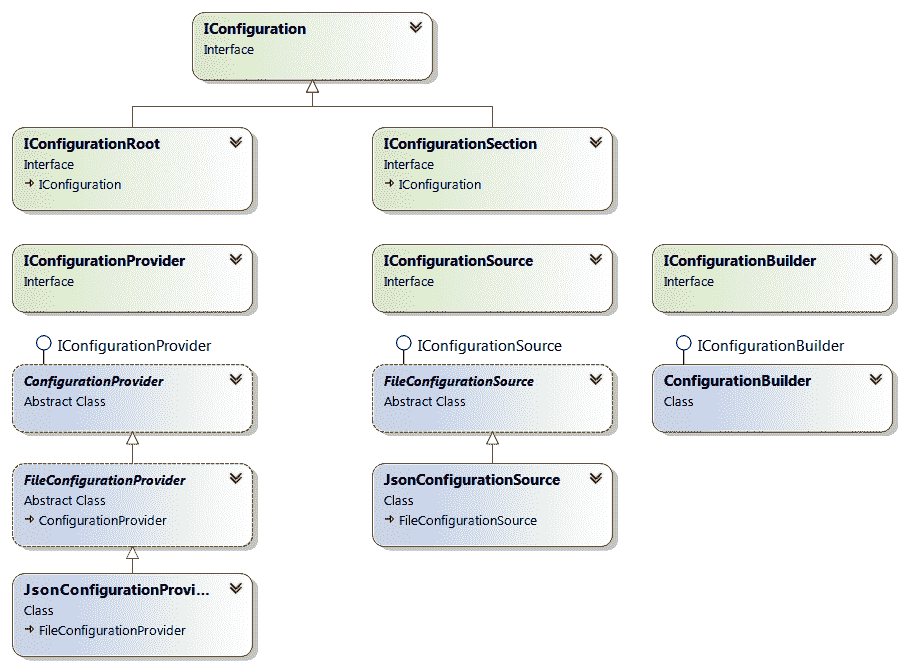

# 二、配置

本章介绍 ASP.NET Core应用的配置。每个应用都需要以一种或另一种形式进行配置，因为如果发生任何情况，都可以更轻松地更改底层行为—考虑连接字符串、凭据、**互联网协议**（**IP**地址、，或任何其他类型的数据，这些数据可能会随时间变化，因此不适合硬编码。

配置可以通过多种方式完成，其中一些甚至不需要重新部署应用，这是一个巨大的好处。幸运的是，.NETCore 的构思考虑到了这一点，并且具有很强的可扩展性，因此它可以覆盖大多数场景，包括基本场景和高级场景。它还可以很好地处理其他方面，比如安全性和依赖注入。

另外，一个非常典型的配置只是以切换或切换为特征：某些东西要么启用，要么不启用。NETCore3 引入了一个新的特性切换库，该库位于主配置框架之外，但这里将介绍它。

阅读本章后，您应该能够理解以下内容：

*   配置在.NET Core框架上的工作方式
*   我们有哪些可用的配置源
*   如何扩展它，使它更有用，更符合您的需要
*   运行时主机配置
*   .NETCore3 中引入的新功能切换机制

# 技术要求

为了实现本章介绍的示例，您需要.NET Core 3**软件开发工具包**（**SDK**和某种文本编辑器。当然，VisualStudio2019（任何版本）满足所有要求，但您也可以使用 VisualStudio 代码。

源代码可以在这里从 GitHub 检索：[https://github.com/PacktPublishing/Modern-Web-Development-with-ASP.NET-Core-3-Second-Edition](https://github.com/PacktPublishing/Modern-Web-Development-with-ASP.NET-Core-3-Second-Edition) 。

# 开始

以前版本的.NET 有一个相对简单的配置系统，所有设置都进入扩展名为`.config`的**可扩展标记语言**（**XML**文件）。有一个基本的模式可以处理系统设置和非类型化的键值对，但它们都是字符串。还有某种程度的继承，因为有些设置可以在机器范围内定义，然后在每个应用中覆盖，甚至在**互联网信息服务**（**IIS**应用）下的虚拟应用中也可以覆盖。通过编写和注册.NET 类，可以使用类型化设置和复杂结构定义自定义节。

然而，尽管这看起来很方便，但它也有其局限性，即：

*   仅支持 XML 文件；不可能有其他现成的配置源。
*   很难在每个环境（分段、**质量保证**（**质量保证**）、生产等）中有不同的配置文件/配置部分。
*   配置更改时无法接收通知。
*   保存更改很棘手。

此外，由于依赖注入不是核心.NET 基础设施的一部分，因此无法将配置值自动注入到其服务中。让我们看看.NETCore3 如何帮助我们克服这些限制。

# .NETCore 中的配置

认识到这一点，微软将配置作为.NET Core的首要概念，并以一种非常灵活、可扩展的方式实现了这一点。这一切都从一个生成器实例开始；我们向它添加提供者，完成后，我们只要求它构建一个配置对象，该对象将在内存中保存从每个提供者加载的所有值。

此配置对象将能够透明地从任何添加的提供程序返回配置设置，这意味着无论源如何，我们都使用相同的语法查询配置选项。它将保存从所有注册提供程序加载的所有值的内存表示，并允许您更改这些值或添加新条目。

.NET Core中配置**应用编程接口**（**API**的基类模型如下：



因此，提供程序机制分为两个基本接口及其实现，如下所示：

*   `IConfigurationSource`负责创建`IConfigurationProvider`的具体实例；每个可用的提供者（下一个）都实现这个接口。
*   `IConfigurationProvider`指定实际检索值、重新加载等的合同；实现这一点的根类是`ConfigurationProvider`，还有一个特定的实现，作为所有基于文件的提供程序的根，`FileConfigurationProvider`。

`ConfigurationBuilder`本身只是`IConfigurationBuilder`接口的具体实现，没有其他实现。其合同规定了我们如何添加提供程序并从中构建配置，如以下代码块所示：

```cs
var builder = new ConfigurationBuilder()     .Add(source1)
    .Add(source2);

var cfg = builder.Build();
```

至于配置本身，有三个基本接口，如下所示：

*   `IConfiguration`：指定检索和设置配置节和值、监视更改等的方法。
*   `IConfigurationRoot`：这增加了一种将配置重新加载到`IConfiguration`的方法，以及用于构建配置的提供者列表。
*   `IConfigurationSection`：这是一个配置节，意味着它可以位于配置根目录下的某个位置，该位置由路径（所有父节的键，直到并包括其自己的键）和唯一标识父节中该节的键标识。

我们将很快看到使用配置值的方法，但现在值得一提的是，我们可以通过`IConfiguration`中的重载`[]`操作符检索和设置单个设置，如下所示：

```cs
cfg["key"] = "value";
string value = cfg["key"];
```

它将一个字符串作为`key`并返回一个字符串作为`value`，在接下来的部分中，我们将看到如何绕过这个限制。如果给定密钥不存在条目，则返回`null`。

All keys are case-insensitive. A path is composed of a colon (`:`)-combined set of keys and subkeys that can be used to get to a specific value.

NET Core配置具有节的概念。通过运行以下代码，我们可以获得特定节，甚至可以检查它是否完全存在：

```cs
var section = cfg.GetSection("ConnectionStrings");
var exists = section.Exists();
```

按照惯例，各节之间用`:`分隔。使用特定于节的键从节中获取值与使用完全限定键从配置根中检索值相同。例如，如果您有一个`A:B:C`键，这与在`A`部分的`B`中有一个`C`键相同，如下面的屏幕截图所示：

```cs
var valueFromRoot = cfg["A:B:C"];
var aSection = cfg.GetSection("A");
var bSection = aSection.GetSection("B");
var valueFromSection = bSection["C"];
```

为便于记录，核心配置 API 在`Microsoft.Extensions.Configuration`和`Microsoft.Extensions.Configuration.Binder`NuGet 包中实现，这些包自动包含在其他包中，例如特定提供商的包中。现在让我们看看可用的提供者。

ASP.NET Core 2 and later automatically registers the `IConfiguration` instance in the dependency injection framework; for previous versions, you need to do this manually.

# 提供者

可用的 Microsoft 配置提供程序（及其 NuGet 软件包）如下所示：

*   **JavaScript 对象表示法**（**JSON**文件：`Microsoft.Extensions.Configuration.Json`
*   XML 文件：`Microsoft.Extensions.Configuration.Xml`
*   **初始化**（**INI**文件：`Microsoft.Extensions.Configuration.Ini`
*   用户机密：`Microsoft.Extensions.Configuration.UserSecrets`
*   Azure 密钥库：`Microsoft.Extensions.Configuration.AzureKeyVault`

*   环境变量：`Microsoft.Extensions.Configuration.EnvironmentVariables`
*   命令行：`Microsoft.Extensions.Configuration.CommandLine`
*   内存：`Microsoft.Extensions.Configuration`
*   码头工人秘密：`Microsoft.Extensions.Configuration.DockerSecrets`

Some of these are based upon the `FileConfigurationProvider` class: JSON, XML, and INI.

引用这些包时，会自动使其扩展可用。因此，例如，如果您想添加 JSON 提供程序，您有两个选项，下面详细介绍。

您可以直接添加一个`JsonConfigurationSource`，如下：

```cs
var jsonSource = new JsonConfigurationSource { 
 Path = "appsettings.json" };
builder.Add(jsonSource);
```

或者，您可以使用`AddJsonFile`扩展方法，如下所示：

```cs
builder.AddJsonFile("appsettings.json");
```

很可能，扩展方法就是您所需要的。正如我所说，您可以同时拥有任意数量的提供者，如以下代码片段所示：

```cs
builder
    .AddJsonFile("appsettings.json")
    .AddEnvironmentVariables()
    .AddXmlFile("web.config");
```

您只需要记住，如果两个提供程序返回相同的配置设置，那么添加它们的顺序很重要；您得到的结果将来自最后添加的提供程序，因为它将覆盖以前的提供程序。例如，假设您正在添加两个 JSON 配置文件，一个在所有环境（开发、登台和生产）中通用，另一个用于特定环境；在这种情况下，您可能会遇到以下问题：

```cs
builder
    .AddJsonFile("appsettings.json")
    .AddJsonFile($"appsettings.{env.EnvironmentName}.json");
```

This is so the environment-specific configuration file takes precedence.

当然，每一个提供者都会设置不同的属性；例如，所有基于文件的提供者都需要一个文件路径，但当我们讨论环境变量时，这是没有意义的。

## 基于文件的提供者

JSON、XML 和 INI 配置源都基于文件。因此，它们的类继承自`FileConfigurationSource`抽象基类。此类提供以下配置属性：

*   `Path`：查找文件的实际、完全合格的物理路径；这是必需的设置。
*   `Optional`：一个布尔标志，用于指定缺少文件是否会导致运行时错误（`false`）或不（`true`）；默认为`false`。
*   `ReloadOnChange`：这里，您决定是否自动检测源文件（`true`）的更改（`false`）；默认为`false`。
*   `ReloadDelay`：检测到更改时重新加载文件之前的延迟，以毫秒为单位（`ReloadOnChange`设置为`true`；默认值为 250 毫秒。
*   `OnLoadException`：解析源文件出错时调用的委托；默认情况下，这是空的。
*   `FileProvider`：实际检索文件的文件提供者；默认为`PhysicalFileProvider`实例，设置为`Path`属性的文件夹。

所有扩展方法都允许您为每个属性提供值，除了`OnLoadException`。您还可以自由指定自己的`IFileProvider`具体实现，如果您有特定需求，例如从 ZIP 文件中获取文件，您应该这样做。`ConfigurationBuilder`有一个扩展方法`SetBasePath`，它设置一个指向文件系统上文件夹的默认`PhysicalFileProvider`，以便您可以将相对文件路径传递给配置源的`Path`属性。

如果您将`ReloadOnChange`设置为`true`，.NET Core 将启动一个操作系统特定的文件，用于监视源文件上的手表；因为这些东西是有成本的，所以尽量不要买太多手表。

一个典型的例子如下：

```cs
builder
    .SetBasePath(@"C:\Configuration")
    .AddJsonFile(path: "appsettings.json", optional: false, 
      reloadOnChange: true)
    .AddJsonFile(path: $"appsettings.{env.EnvironmentName}.json", 
      optional: true, reloadOnChange: true);
```

这将导致从`C:\Configuration`文件夹加载`appsettings.json`文件（如果不存在，则引发异常），然后加载`appsettings.Development.json`（这次，如果文件不存在，则忽略它）。只要其中一个文件发生更改，就会重新加载它们并更新配置。

Very important: in operating systems or filesystems where the case matters, such as Linux, make sure that the name of the file that takes the environment name (for example, `appsettings.Development.json`) is in the right case—otherwise, it won't be found!

但是，如果要添加错误处理程序，则需要手动添加配置源，如下所示：

```cs
var jsonSource = new JsonConfigurationSource { Path = "filename.json" };
jsonSource.OnLoadException = (x) =>
{
    if (x.Exception is FileNotFoundException ex)
    {
        Console.Out.WriteLine($"File {ex.FileName} not found");
        x.Ignore = true;
    }
};
builder.Add(jsonSource);
```

这样，我们就可以防止某些错误导致应用崩溃。

所有基于文件的提供者都是通过名为`AddxxxFile`的扩展方法添加的，其中`xxx`是实际类型—`Json`、`Xml`或`Ini`——并且始终采用相同的参数（`path`、`optional`、`reloadOnChange`）。

### JSON 提供程序

我们通常使用`AddJsonFile`扩展名方法添加 JSON 配置文件。JSON 提供程序将加载一个包含 JSON 内容的文件，并使用点符号使其结构可用于配置。以下代码段中显示了一个典型示例：

```cs
{
  "ConnectionStrings": {
      "DefaultConnection": "Server=(localdb)mssqllocaldb; 
        Database=aspnetcore"
  }
}
```

任何有效的 JSON 内容都可以使用。到目前为止，无法指定模式。节只是 JSON 内容的子元素。

用于加载配置值的代码示例如下：

```cs
var defaultConnection = cfg["ConnectionStrings:DefaultConnection"];
```

### XML 提供者

XML 越来越不常见，而 JSON 则越来越流行；然而，仍然有充分的理由使用 XML。因此，我们使用`AddXmlFile`扩展方法添加了一个 XML 文件，就配置而言，我们需要将 XML 内容包装在`settings`节点中；XML 声明是可选的。请参阅以下示例：

```cs
<settings Flag="2">
    <MySettings>
        <Option>10</Option>
    </MySettings>
</settings>
```

同样，到目前为止，无法指定验证模式。使用此提供程序，节将作为子元素实现。

这方面的两个例子如下：

```cs
var flag = cfg["Flag"];
var option = cfg["MySettings:Option"];
```

### INI 提供程序

INI 文件已经成为过去，但由于历史原因，Microsoft 仍然支持它们（实际上，Linux 也使用 INI 文件）。如果您不熟悉它的语法，它看起来是这样的：

```cs
[SectionA]
Option1=Value1
Option2=Value2

[SectionB]
Option1=Value3
```

您可以通过`AddIniFile`扩展方法将 INI 文件添加到配置中。

One word of advice: both XML and JSON file formats support anything that INI files do, so unless you have a very specific requirement, you're better off with either JSON or XML.

INI 文件中的节只映射到 INI 文件规范提供的内部节。

一个例子如下：

```cs
var optionB2 = cfg["SectionB:Option1"];
```

## 其他提供者

除了基于文件的提供程序外，还有其他存储和检索配置信息的方法。在这里，我们列出了.NETCore 中当前可用的选项。

### 用户机密

.NET Core 引入了**用户机密**作为每个用户存储敏感信息的手段。这样做的好处是，它以安全的方式保存在配置文件之外，并且其他用户看不到它。用户机密存储由`userSecretsId`标识（针对给定用户），VisualStudio 模板将其初始化为字符串和**全局唯一标识符**（**GUID**）的组合，例如`aspnet-Web-f22b64ea-be5e-432d-abc6-0275a9c00377`。

存储中的秘密可以通过`dotnet`可执行文件列出、添加或删除，如以下代码段所示：

```cs
dotnet user-secrets list                 --lists all the values in the 
                                                       store
dotnet user-secrets set "key" "value"    --set "key" to be "value"
dotnet user-secrets remove "key"         --remove entry for "key"
dotnet user-secrets clear                --remove all entries
```

你需要`Microsoft.Extensions.SecretManager.Tools`包。`dotnet user-secrets`命令仅在存在指定`userSecretsId`存储 ID 的项目文件时才起作用。`AddUserSecrets`扩展方法是我们用于向配置添加用户机密的方法，它将自动拾取此`userSecretsId`设置，或者您可以在运行时提供自己的设置，如下所示：

```cs
builder.AddUserSecrets(userSecretdId: "[User Secrets Id]");
```

另一个选项是从程序集获取用户机密 ID，在这种情况下，需要使用`UserSecretsIdAttribute`属性进行修饰，如下所示：

```cs
[assembly: UserSecretsId("aspnet-Web-f22b64ea-be5e-432d-abc6-0275a9c00377")
```

在这种情况下，加载它的方法在以下代码段中演示：

```cs
builder.AddUserSecrets<Startup>();
```

Be warned: if you have more than one assembly with the same user secret ID (by mistake), the application will throw an exception when loading them.

另一种指定用户机密的方法（在 ASP.NET Core 2.x 中）是通过`.csproj`文件，使用`UserSecretsId`元素，如以下代码片段所示：

```cs
<PropertyGroup>
    <TargetFramework>netcoreapp2.1</TargetFramework>
    <UserSecretsId>9094c8e7-0000-0000-0000-c26798dc18d2</UserSecretsId>
</PropertyGroup>
```

无论您如何指定用户机密 ID，与所有其他提供程序一样，加载值的方式如下：

```cs
var value = cfg["key"];
```

如果您感兴趣，可以在此处阅读更多有关.NET Core用户机密的信息：[https://docs.microsoft.com/en-us/aspnet/core/security/app-secrets](https://docs.microsoft.com/en-us/aspnet/core/security/app-secrets)

### Azure 密钥保险库

**Azure Key Vault**是一项 Azure 服务，您可以利用它进行企业级安全密钥值存储。完整的描述超出了本书的范围，但您可以在此处阅读：[https://azure.microsoft.com/en-us/services/key-vault](https://azure.microsoft.com/en-us/services/key-vault) 。只需说明，您通过`AddAzureKeyVault`扩展方法添加 Azure 密钥保险库提供程序，如以下代码行所示：

```cs
builder.AddAzureKeyVault(vault: "https://[Vault].vault.azure.net/",
    clientId: "[Client ID]", clientSecret: "[Client Secret]");
```

在这之后，所有的数据都被添加到配置对象中，您可以用通常的方式检索它们。

### 命令行

获取配置设置的另一种非常流行的方法是命令行。可执行文件通常期望在命令行中传递信息，以便指示应该做什么或控制应该如何做。

要使用的扩展方法是`AddCommandLine`，它需要一个必需的和可选的参数，如下所示：

```cs
builder.AddCommandLine(args: Environment.GetCommandLineArgs().Skip(1).ToArray());
```

`args`参数通常来自`Environment.GetCommandLineArgs()`，我们去掉第一个参数，因为这是条目程序集的名称。如果我们在`Program.Main`中构建配置对象，我们也可以使用它的`args`参数。

现在，有几种方法可以指定参数。下面的代码段说明了一种方法：

```cs
    Key1=Value1
    --Key2=Value2
    /Key3=Value3
    --Key4 Value4
    /Key5 Value5
```

下面是另一个例子：

```cs
dotnet run MyProject Key1=Value1 --Key2=Value2 /Key3=Value3 --Key4 Value4 /Key5 Value5
```

如果该值中有空格，则需要将其括在引号中（`"`。您不能使用`-`（单破折号），因为这将被解释为`dotnet`的参数。

`AddCommandLine`的可选参数`switchMappings`是一个字典，可用于创建与命令行中的键重复的新键，如下所示：

```cs
var switchMappings = new Dictionary<string, string>(StringComparer.OrdinalIgnoreCase)
     { { "--Key1", "AnotherKey" } };

builder.AddCommandLine(
    args: Environment.GetCommandLineArgs().Skip(1).ToArray(),
    switchMappings: switchMappings);
```

这些密钥甚至可以包含特殊字符，例如，`--a:key`和`/some.key`是有效密钥。

同样，使用相同的语法检索它们的值。

### 环境变量

环境变量存在于所有操作系统中，也可以被视为配置的来源。很多工具，比如 Docker，都依赖于环境变量来获取它们的操作上下文。

将环境变量添加到.NET Core配置非常简单；你只需要打电话`AddEnvironmentVariables`。默认情况下，这会将所有现有环境变量带入配置中，但我们也可以指定前缀，并过滤掉所有不以前缀开头的变量，如下所示：

```cs
builder.AddEnvironmentVariables(prefix: "ASPNET_");
```

因此，这将同时添加`ASPNET_TargetHost`和`ASPNET_TargetPort`，但不添加`PATH`或`COMPUTERNAME`。

如果使用双下划线分隔名称（例如，`__`），则支持节。例如，假设您有以下环境变量：

```cs
ASPNETCORE__ADMINGROUP__USERS=rjperes,pm
```

您可以这样访问`ADMINGROUP`部分：

```cs
var group = cfg
    .GetSection("ASPNETCORE")
    .GetSection("ADMINGROUP");
var users = group["USERS"];
```

### 记忆力

内存提供程序是在运行时动态指定值和使用字典对象的方便方法。我们使用`AddInMemoryCollection`扩展方法添加提供者，如下所示：

```cs
var properties = new Dictionary<string, string> { { "key", "value" } };
builder.AddInMemoryCollection(properties);
```

这种方法的优点是很容易用我们想要的任何值填充字典，特别是在单元测试中。

### 码头工人

从 Docker 存储的文件中获取机密的功能在.NETCore 中相对较新。基本上，它将尝试加载 Docker 实例中特定目录中的文本文件作为值，其中键是文件名本身。这是 Docker 的一个实际功能，您可以在这里阅读更多内容：[https://docs.docker.com/engine/swarm/secrets](https://docs.docker.com/engine/swarm/secrets)

`AddDockerSecrets`扩展方法采用两个可选参数：用户机密目录和该目录本身是否可选；换句话说，如果它不存在，就忽略它。以下代码段对此进行了说明：

```cs
builder.AddDockerSecrets(secretsPath: "/var/lib/secrets", optional: true); 
```

如果我们使用获取配置对象的重载，则可以指定这两个参数加上一个`ignore`前缀和一个委托，用于按文件名筛选出文件，如以下代码块所示：

```cs
builder.AddDockerSecrets(opt =>
{
    opt.SecretsDirectory = "/var/lib/secrets";
    opt.Optional = true;
    opt.IgnorePrefix = "ignore.";
    opt.IgnoreCondition = (filename) => !filename.Contains($".{env.EnvironmentName}.");
}); 
```

在这里，我们将过滤掉以`ignore.`开头的两个文件，以及不包含当前环境名称的文件（例如`.Development.`。很酷！

### 默认提供者

默认应用模板（`WebHostBuilder.CreateDefaultBuilder`中包含的 ASP.NET Core代码注册了以下提供程序：

*   JSON
*   环境
*   命令行
*   用户机密

当然，您可以向 configuration builder 添加新的提供程序以满足您的需要。接下来，我们将了解如何为特定的配置需求创建自定义提供程序。

## 创建自定义提供程序

虽然我们有几种存储配置值的选项，但您可能有自己的特定需求。例如，如果您使用的是 Windows，则可能希望将配置设置存储在注册表中。为此，您需要一个自定义提供程序。让我们来看看如何构建一个。

首先，您需要将`Microsoft.Win32.Registry`NuGet 包添加到您的项目中。然后，我们从实现`IConfigurationSource`开始，如下所示：

```cs
public sealed class RegistryConfigurationSource : IConfigurationSource
{
    public RegistryHive Hive { get; set; } = RegistryHive.CurrentUser;

    public IConfigurationProvider Build(IConfigurationBuilder builder)
    {
        return new RegistryConfigurationProvider(this);
    }
}
```

从前面的代码块中可以看到，唯一可配置的属性是`Hive`，通过它可以指定特定的注册表配置单元，其中`CurrentUser (HKEY_CURRENT_USER)`是默认值。

接下来，我们需要一个`IConfigurationProvider`实现。让我们从`ConfigurationProvider`类继承，因为它负责一些基本的实现，比如重新加载（当我们直接转到源代码时，我们不支持重新加载）。代码可以在这里看到：

```cs
public sealed class RegistryConfigurationProvider : ConfigurationProvider
{
    private readonly RegistryConfigurationSource _configurationSource;

    public RegistryConfigurationProvider(
     RegistryConfigurationSource configurationSource)
    {
        _configurationSource = configurationSource;
    }

    private RegistryKey GetRegistryKey(string key)
    {
        RegistryKey regKey;
        switch (_configurationSource.Hive)
        {
            case RegistryHive.ClassesRoot:
                regKey = Registry.ClassesRoot;
                break;

            case RegistryHive.CurrentConfig:
                regKey = Registry.CurrentConfig;
                break;

            case RegistryHive.CurrentUser:
                regKey = Registry.CurrentUser;
                break;

            case RegistryHive.LocalMachine:
                regKey = Registry.LocalMachine;
                break;

            case RegistryHive.PerformanceData:
                regKey = Registry.PerformanceData;
                break;

            case RegistryHive.Users:
                regKey = Registry.Users;
                break;

            default:
              throw new InvalidOperationException($"Supplied hive
                 {_configurationSource.Hive} is invalid.");
         }

         var parts = key.Split('\\');
         var subKey = string.Join("", parts.Where(
          (x, i) => i < parts.Length - 1));

         return regKey.OpenSubKey(subKey);
    }

    public override bool TryGet(string key, out string value)
    {
        var regKey = this.GetRegistryKey(key);
        var parts = key.Split('\\');
        var name = parts.Last();
        var regValue = regKey.GetValue(name);

        value = regValue?.ToString();

        return regValue != null;
    }

    public override void Set(string key, string value)
    {
        var regKey = this.GetRegistryKey(key);
        var parts = key.Split('');
        var name = parts.Last();

        regKey.SetValue(name, value);     
    }
}
```

此提供程序类利用`Registry`API 从 Windows 注册表中检索值，当然，这在非 Windows 计算机上不起作用。`ConfigurationProvider`类中定义的`TryGet`和`Set`方法都委托给私有`GetRegistryKey`方法，该方法从注册表中检索键值对。

最后，让我们添加一个友好的扩展方法以简化注册，如下所示：

```cs
public static class RegistryConfigurationExtensions
{
    public static IConfigurationBuilder AddRegistry(
        this IConfigurationBuilder builder, 
        RegistryHive hive = RegistryHive.CurrentUser)
    {
        return builder.Add(new RegistryConfigurationSource { Hive = hive });
    }
}
```

现在，您可以使用此提供程序，如下所示：

```cs
builder
    .AddJsonFile("appsettings.json")
    .AddRegistry(RegistryHive.LocalMachine);
```

又好又简单，你不觉得吗？现在，让我们看看如何使用我们注册的提供者的配置文件。

# 使用配置值

现在，我们已经了解了如何设置配置提供程序，但是我们如何准确地使用这些配置值呢？让我们看看下面几节。

## 显式获取和设置值

请记住，.NET 配置允许您使用`[]`符号设置读取和写入，如以下代码段所示：

```cs
var value = cfg["key"];
cfg["another.key"] = "another value";
```

当然，在配置对象中设置值并不意味着它将被持久化到任何提供者中；配置仅保存在内存中。

也可以尝试将值转换为特定类型，如下所示：

```cs
cfg["count"] = "0";
var count = cfg.GetValue<int>("count");
```

Don't forget that the value that you want to convert needs to be convertible from a string; in particular, it needs to have `TypeConverter` defined for that purpose, which all .NET Core primitive types do. The conversion will take place using the current culture.

## 配置部分

也可以使用**配置部分**。配置节通过冒号（`:`指定，如`section:subsection`中所示。可以指定节的无限嵌套。但是，我听到你问什么是配置部分，我们如何定义配置部分？这取决于您使用的配置源。

对于 JSON，配置部分基本上映射到一个复杂的属性。请查看以下代码段以查看此示例：

```cs
{
    "section-1": {
        "section-2": {
            "section-3": {
              "a-key": "value"
            }
        }
    }
}
```

Not all providers are capable of handling configuration sections or handle them in the same way. In XML, each section corresponds to a node; for INI files, there is a direct mapping; and for the Azure Key Vault, user secrets, memory (dictionaries), and providers, sections are specified as keys separated by colons (for example, `ASPNET:Variable`, `MyApp:Variable`, `Data:Blog:ConnectionString`, and more). For environment variables, they are separated by double underscores (`__`). The example Registry provider I showed earlier does not, however, support them.

我们这里有几个部分，如下所示：

*   根部
*   `section-1`
*   `section-2`
*   `section-3`

因此，如果我们想要访问`a-key`键的值，我们将使用以下语法：

```cs
var aKey = cfg["section-1:section-2:section-3:a-key"];
```

或者，我们可以请求`section-3`部分并直接从中获取`a-key`值，如以下代码片段所示：

```cs
var section3 = cfg.GetSection("section-1:section-2:section-3");
var aKey = section3["a-key"];
var key = section3.Key;    //section-3
var path = section3.Path;  //section-1:section-2:section-3
```

节将包含从中获取它的路径。这是在继承自`IConfiguration`的`IConfigurationSection`接口中定义的，因此它的所有扩展方法也都可用。

顺便说一下，您可以请求任何配置部分，并且始终会返回一个值，但这并不意味着它存在。您可以使用`Exists`扩展方法检查这种可能性，如下所示：

```cs
var fairyLandSection = cfg.GetSection("fairy:land");
var exists = fairyLandSection.Exists();  //false
```

配置部分可能有子项，我们可以使用`GetChildren`列出它们，如下所示：

```cs
var section1 = cfg.GetSection("section-1");
var subSections = section1.GetChildren();  //section-2
```

.NET Core 包含典型配置部分和连接字符串的简写。这是`GetConnectionString`扩展方法，它基本上查找名为`ConnectionStrings`的连接字符串并从中返回命名值。您可以使用我们讨论 JSON 提供程序时引入的 JSON 模式作为参考，如下所示：

```cs
var blogConnectionString = cfg.GetConnectionString("DefaultConnection");
```

## 获取所有值

它可能没有那么有用，但可以获得配置对象中存在的所有配置值（及其键）的列表。我们使用`AsEnumerable`扩展方法来实现这一点，如以下代码片段所示：

```cs
var keysAndValues = cfg.AsEnumerable().ToDictionary(kv => kv.Key, kv => kv.Value);
```

还有一个`makePathsRelative`参数，默认情况下是`false`，可以在配置节中使用，将节的键从返回条目的键中去掉。例如，假设您正在`section-3`部分工作。如果您在`makePathsRelative`设置为`true`的情况下呼叫`AsEnumerable`，则`a-key`的条目将显示为`a-key`而不是`section-1:section-2:section-3:a-key`。

## 绑定到类

另一个有趣的选项是将当前配置绑定到类。绑定过程将获取配置中存在的任何节及其属性，并尝试将它们映射到.NET 类。假设我们有以下 JSON 配置：

```cs
{
    "Logging": {
        "IncludeScopes": false,
        "LogLevel": {
          "Default": "Debug",
          "System": "Information",
          "Microsoft": "Information"
        }
    }
}
```

我们还有一些课程，比如：

```cs
public class LoggingSettings
{
    public bool IncludeScopes { get; set; }
    public LogLevelSettings LogLevel { get; set; }
}

public class LogLevelSettings
{
    public LogLevel Default { get; set; }
    public LogLevel System { get; set; }
    public LogLevel Microsoft { get; set; }
}
```

`LogLevel` comes from the `Microsoft.Extensions.Logging` namespace.

您可以将两者绑定在一起，如下所示：

```cs
var settings = new LoggingSettings { LogLevel = new LogLevelSettings() };
cfg.GetSection("Logging").Bind(settings);
```

`LoggingSettings`的值将从当前配置中自动填充，使目标实例的任何属性在配置中没有值时保持不变。当然，对于任何配置部分都可以这样做，因此如果您的设置没有存储在根级别，它仍然可以工作。

请注意，当底层数据发生更改时，这些数据不会自动刷新。我们将在稍后看到如何做到这一点。

另一个选项是进行配置生成并返回自实例化实例，如下所示：

```cs
var settings = cfg.GetSection("Logging").Get<LoggingSettings>();
```

要使其工作，模板类不能是抽象的，需要定义一个公共的无参数构造函数。

Don't forget that an error will occur if—and only if—a configuration value cannot be bound, either directly as a string or through `TypeConverter` to the target property in the **Plain Old CLR Object** (**POCO**) class. If no such property exists, it will be silently ignored. The `TypeConverter` class comes from the `System.ComponentModel` NuGet package and namespace.

由于在使用基于文件的配置时，所有属性都存储为字符串，因此提供程序需要知道如何将这些属性转换为目标类型。幸运的是，包含的提供程序知道如何对大多数类型执行此操作，例如：

*   串
*   整数
*   浮点（前提是十进制字符与当前区域性相同）
*   布尔型（`true`或`false`在任何外壳中）
*   日期（格式必须符合当前文化或符合**征求意见**（**RFC**）3339/**国际标准化组织**（**ISO**）8601）
*   时间（*hh:mm:ss*或 RFC 3339/ISO 8601）
*   伪装
*   枚举

## 注入值

好了，我们现在知道了如何从多个源加载配置值，我们还知道了明确请求配置值的几种方法。然而，.NETCore 严重依赖依赖于依赖项注入，因此我们可能也希望将其用于配置设置。

首先，很明显，我们可以在依赖项注入框架中注册配置对象本身，如下所示：

```cs
var cfg = builder.Build();
services.AddSingleton(cfg);
```

无论我们在哪里要求一个`IConfigurationRoot`对象，我们都会得到这个。我们还可以将其注册为 base`IConfiguration`，这也是安全的，尽管我们无法重新加载配置（稍后我们将更详细地介绍这一点）。这一点如下所示：

```cs
services.AddSingleton<IConfiguration>(cfg);
```

Since version 2.0, ASP.NET Core automatically registers the configuration object (`IConfiguration`) with the dependency injection framework.

我们可能还对向 POCO 类注入配置设置感兴趣。在这种情况下，我们使用`Configure`，如下所示：

```cs
services.Configure<LoggingSettings>(settings =>
{
    settings.IncludeScopes = true;
    settings.Default = LogLevel.Debug;
});
```

这里，我们使用的是`Configure`扩展方法，它允许我们为一个 POCO 类指定值，该类在运行时被请求时创建。我们可以要求配置对象执行此操作，而不是手动执行此操作，如下所示：

```cs
services.Configure<LoggingSettings>(settings =>
{
    cfg.GetSection("Logging").Bind(settings);
});
```

更好的是，我们可以传递命名配置选项，如下所示：

```cs
services.Configure<LoggingSettings>("Elasticsearch", settings =>
{
    this.Configuration.GetSection("Logging:Elasticsearch").Bind(settings);
});

services.Configure<LoggingSettings>("Console", settings =>
{
    this.Configuration.GetSection("Logging:Console").Bind(settings);
});
```

稍后，我们将看到如何使用这些命名的配置选项。

我们甚至可以传入配置根本身，或配置根的一个子部分，这更简单，如以下代码段所示：

```cs
services.Configure<LoggingSettings>(cfg.GetSection("Logging"));
```

当然，我们也可以使用依赖注入框架注册我们的 POCO 类，如下所示：

```cs
var cfg = builder.Build();
var settings = builder.GetSection("Logging").Get<LoggingSettings>();
services.AddSingleton(settings);
```

如果我们使用`Configure`方法，那么依赖项注入框架中的配置实例将作为`IOptions<T>`的实例提供，其中`T`是传递给`Configure`类型的模板参数——根据本例，`IOptions<LoggingSettings>`。

`IOptions<T>`接口指定一个`Value`属性，通过该属性我们可以访问`Configure`中传递或设置的底层实例。好的方面是，只有在实际请求时，才会在运行时动态执行，这意味着除非我们明确需要，否则不会发生从配置到 POCO 类的绑定。

最后一点注意：在使用`Configure`之前，我们需要在`services`集合中添加对它的支持，如下所示：

```cs
services.AddOptions();
```

为此，首先需要添加`Microsoft.Extensions.Options`NuGet 包，这将确保正确注册所有必需的服务。

## 检索命名配置选项

当我们通过`Configure`方法家族注册 POCO 配置时，本质上我们是将其注册到依赖注入容器`IOption<T>`。这意味着无论何时我们想要注射它，我们都可以声明`IOption<T>`，比如`IOption<LoggingSettings>`。但是如果我们想使用命名的配置值，我们需要使用`IOptionsSnapshot<T>`。此接口公开了一个 nice`Get`方法，该方法将命名的配置设置作为其唯一参数，如下所示：

```cs
public HomeController(IOptionsSnapshot<LoggingSettings> settings)
{
    var elasticsearchSettings = settings.Get("Elasticsearch");
    var consoleSettings = settings.Get("Console");
}
```

您必须记住，我们通过调用`Configure`方法注册了`LoggingSettings`类，该方法使用 name 参数。

## 重新加载和处理更改通知

您可能还记得，当我们谈到基于文件的提供者时，我们提到了`reloadOnChange`参数。这将设置一个文件监视操作，当文件内容发生更改时，操作系统通过该操作通知.NET。即使我们不启用该功能，也可以要求提供商重新加载其配置。`IConfigurationRoot`接口为此目的公开了一个`Reload`方法，如以下代码片段所示：

```cs
var cfg = builder.Build();
cfg.Reload();
```

因此，如果我们显式地重新加载配置，我们很有信心，当我们请求配置密钥时，我们将得到更新的值，以防同时更改配置。但是，如果我们不这样做，我们已经看到的 API 就不能确保我们每次都得到更新版本。为此，我们可以执行以下任一操作：

*   注册更改通知回调，以便在基础文件内容更改时得到通知
*   注入数据的实时快照，其值在源更改时也会更改

对于第一个选项，我们需要获取重载令牌的句柄，然后在其中注册回调操作，如下所示：

```cs
var token = cfg.GetReloadToken();
token.RegisterChangeCallback(callback: (state) =>
{
    //state will be someData
    //push the changes to whoever needs it
}, state: "SomeData");
```

对于后一个选项，我们需要使用`IOptionsSnapshot<T>`，而不是注入`IOptions<T>`。只需更改这一点，我们就可以确保注入的值将来自当前最新的配置源，而不是创建配置对象时的配置源。请查看以下代码段以获取此示例：

```cs
public class HomeController : Controller
{
    private readonly LoggingSettings _settings;

    public HomeController(IOptionsSnapshot<LoggingSettings> settings)
    {
        _settings = settings.Value;
    }
}
```

始终使用`IOptionsSnapshot<T>`而不是`IOptions<T>`是安全的，因为开销最小。

## 运行配置前和配置后操作

自 ASP.NET Core 2.0 以来，有一个新功能：为已配置的类型运行配置前和配置后操作。这意味着，在完成所有配置之后，在从依赖项注入中检索配置的类型之前，注册类的所有实例都有机会执行并修改配置。对于未命名配置选项和命名配置选项都是如此。

对于未命名的配置选项（`Configure`没有名称参数），有一个名为`IConfigureOptions<T>`的接口，如下面的代码片段所示：

```cs
public class PreConfigureLoggingSettings : IConfigureOptions<LoggingSettings>
{
    public void Configure(LoggingSettings options)
    {
        //act upon the configured instance
    }
}
```

对于命名的配置选项（`Configure`带 name 参数），我们有`IConfigureNamedOptions<T>`，如下面的代码片段所示：

```cs
public class PreConfigureNamedLoggingSettings : IConfigureNamedOptions<LoggingSettings>
{
    public void Configure(string name, LoggingSettings options)
    {
        //act upon the configured instance
    }

    public void Configure(LoggingSettings options)
    {
    }
}
```

注册时，这些类将在委托传递给`Configure`方法之前激发。配置很简单，如以下代码段所示：

```cs
services.ConfigureOptions<PreConfigureLoggingSettings>();
services.ConfigureOptions<PreConfigureNamedLoggingSettings>();
```

但是还有更多：除了在配置委托之前运行操作之外，我们还可以在配置委托之后运行。输入`IPostConfigureOptions<T>`-这一次，命名和未命名配置选项的注册没有不同的接口，如以下代码段所示：

```cs
public class PostConfigureLoggingSettings : IPostConfigureOptions<LoggingSettings>
{
    public void PostConfigure(string name, LoggingSettings options) { ... }
}
```

最后，这些类中的每一个都由依赖项注入容器实例化，这意味着我们可以使用构造函数注入！这就像一个符咒，可以在以下代码段中看到：

```cs
public PreConfigureLoggingSettings(IConfiguration configuration) { ... }
```

对于`IConfigureOptions<T>`、`IConfigureNamedOptions<T>`和`IPostConfigureOptions<T>`也是如此。

现在，让我们看看以前版本的一些更改。

# 对 2.x 版的更改

版本 2.0 的最大变化是，从 2.1 开始，配置是按照约定完成的，即添加`appsettings.json`JSON 文件的过程（每个环境的通用和可选）以及对用户隐藏的所有内容。

这在`WebHost.CreateDefaultBuilder`方法中定义。但是，您仍然可以构建自己的`ConfigurationBuilder`并添加任何您喜欢的内容。为此，您可以调用`ConfigureAppConfiguration`方法，如[第 1 章](01.html)、*ASP.NET Core入门*所述，如下代码块所示：

```cs
Host
    .CreateDefaultBuilder(args)
    .ConfigureAppConfiguration(builder =>
    {
        var jsonSource = new JsonConfigurationSource { Path = 
            "appsettings.json" };
        builder.Add(jsonSource);
    })
    .ConfigureWebHostDefaults(builder =>
    {
        builder.UseStartup<Startup>();
    });
```

或者，如果您只想向默认构建的配置（或正在修改的配置）添加一个条目，则调用`UseSettings`扩展方法，如下所示：

```cs
Host
    .CreateDefaultBuilder(args)
    .ConfigureWebHostDefaults(builder =>
    {
        builder.UseSetting("key", "value");
        builder.UseStartup<Startup>();
    });
```

因此，当`Startup`类被实例化时，它将被传递一个`IConfiguration`对象，该对象是根据您在这里输入的代码构建的。

Warning: when using `UseSetting`, the value will be written to all registered configuration providers.

在了解了应用配置是如何完成的之后，让我们看看如何对主机执行同样的操作。

# 配置运行时主机

.NETCore3 引入了一种不太为人所知的配置机制，它仍然有一些用途：运行时主机配置。这里的想法是在`.csproj`文件中提供配置设置，作为键值对。您可以通过编程方式从`AppContext`类中检索它们。以下是一个示例项目文件：

```cs
<Project Sdk="Microsoft.NET.Sdk.Web">
    <PropertyGroup>
        <TargetFramework>netcoreapp3.0</TargetFramework>
    </PropertyGroup>
    <ItemGroup>
        <RuntimeHostConfigurationOption Include="Foo" Value="Bar" />
    </ItemGroup>
</Project>

```

可以通过调用`AppContext`类的`GetData`方法来检索`"Foo"`设置，如下代码片段所示：

```cs
var bar = AppContext.GetData("Foo");
```

如果指定的条目不存在，`GetData`只返回`null`。请注意，`GetData`的原型是返回一个`object`，但在本例中，它将返回一个`string`。

通常情况下，您不希望这样做，但如果您希望创建或修改运行时主机配置设置的一个条目，您可以通过应用域执行此操作，如下所示：

```cs
AppDomain.CurrentDomain.SetData("Foo", "ReBar");
```

请注意，这并不能取代结构良好、定义正确的配置。NETCore 所做的是，在运行和部署时，它将`RuntimeHostConfigurationOption`部分（以及更多部分）的内容复制到生成的`${project}.runtimeconfig.json`文件中，该文件与生成的二进制文件放在一起。

我们现在将看到 ASP.NET Core的一个新功能：功能切换。

# 理解特征切换

.NETCore3 引入了`Microsoft.FeatureManagement.AspNetCore`库，它非常方便进行功能切换。简而言之，功能要么启用，要么不启用，这是通过布尔开关通过配置（任何源）配置的。

对于更复杂的场景，您可以为特定功能定义一个可用的配置；在确定是否启用时，可以考虑这一点。

特征切换可通过应用具有任意数量特征名称的`[FeatureGate]`属性应用于动作方法，如下所示：

```cs
[FeatureGate("MyFeature1", "MyFeature2")]
public IActionResult FeactureEnabledAction() { ... }
```

当`[FeatureGate]`属性应用于某个操作方法且该功能被禁用时，任何试图访问它的尝试都将导致 HTTP 404 Not Found 结果。它可以采用任意数量的功能名称和可选需求类型，可以是`All`或`Any`，这意味着需要启用所有功能或至少启用一个功能。以下代码段对此进行了说明：

```cs
[FeatureGate(RequirementType.All, "MyFeature1", "MyFeature2")]
public IActionResult FeactureEnabledAction() { ... }
```

或者，可以通过注入的`IFeatureManager`实例明确地请求，如下所示：

```cs
public HomeController(IFeatureManager featureManager)
{
    _featureManager = featureManager;
}                    

public async Task<IActionResult> Index()
{
    var isEnabled = await _featureManager.IsEnabledAsync("MyFeature");
}
```

当然，你可以在任何地方注射`IFeatureManager`。以下代码段中可以看到这方面的示例：

```cs
@inject IFeatureManager FeatureManager

@if (await FeatureManager.IsEnabledAsync("MyFeature")) {
    <p>MyFeature is enabled!</p>
}
```

但在视图上，另一个选项是使用`<feature>`标记辅助对象，如下所示：

```cs
<feature name="MyFeature">
    <p>MyFeature is enabled!</p>
</feature>
```

与`[FeatureGate]`属性类似，您可以在`name`属性中指定多个特征名称，也可以在`requirement`中指定`Any`或`All`中的一个。您也可以`negate`该值，如下所示：

```cs
<feature name="MyFeature">
    <p>MyFeature is enabled!</p>
</feature>
<feature name="MyFeature" negate="true">
    <p>MyFeature is disabled!</p>
</feature>
```

正如您所看到的，这非常有用，因为您可以在功能启用和未启用时提供内容。

标签助手需要注册这通常发生在`_ViewImports.cshtml`文件上，如下所示：

```cs
@addTagHelper *, Microsoft.AspNetCore.Mvc.TagHelpers
```

至少，对于名为`MyFeature`的功能，我们需要在`appsettings.json`文件上进行以下配置：

```cs
{
    "FeatureManagement": {
        "MyFeature": true
    }
}
```

默认值始终为`false`，表示该功能已禁用。运行时对配置文件所做的任何更改都会被功能管理库检测到。

`ConfigureServices`方法中的设置非常简单，只需调用`AddFeatureManagement`扩展方法即可。这是注册`IFeatureManager`接口的内容（加上我们稍后将看到的其他几个），如下所示：

```cs
services
    .AddFeatureManagement()
    .AddFeatureFilter<MyFeatureFilter>();
```

还有另一个重载`AddFeatureManagement`将`IConfiguration`对象作为参数，如果您希望构建自己的对象。接下来，您需要注册您想要使用的尽可能多的功能过滤器，并连续调用`AddFeatureFilter`。

## 包含的功能过滤器

功能过滤器包包括以下过滤器：

*   `PercentageFilter`：允许一定百分比的项目通过。
*   `TimeWindowFilter`：功能仅在定义的日期和时间窗口内启用。

这些过滤器中的每一个都有自己的配置模式，让我们看看每一个。

### 百分比过滤器

百分比过滤器将我们感兴趣的百分比作为其唯一参数。每次调用它时，它将返回大约该百分比的启用次数。`appsettings.json`文件中的配置如下：

```cs
"FeatureManagement": {
  "HalfTime": {
    "EnabledFor": [
      {
        "Name": "Microsoft.Percentage",
        "Parameters": {
          "Value": 50
        }
      }
    ]
  }
}
```

您可以看到，在本例中，您声明了特征门的名称`"HalfTime"`和百分比参数—`50`。

您还可以声明该属性，如下所示：

```cs
[FeatureGate("HalfTime")]
public IActionResult Action() { ... }
```

### 时间窗滤波器

这一功能允许在特定日期和时间到来时自动提供功能。圣诞节的配置如下所示：

```cs
"FeatureManagement": {
  "Christmas": {
    "EnabledFor": [
      {
        "Name": "Microsoft.TimeWindow",
        "Parameters": {
          "Start": "25 Dec 2019 00:00:00 +00:00",
          "End": "26 Dec 2019 00:00:00 +00:00"
        }
      }
    ]
  }
}
```

请注意，日期和时间的格式与文化无关。您需要声明开始和结束时间，以及特征门的名称：`"Christmas"`。

功能门声明如以下代码段所示：

```cs
[FeatureGate("Christmas")]
public IActionResult Action() { ... }
```

## 自定义功能过滤器

构建一个简单的特征过滤器很简单，只需实现`IFeatureFilter`，它只有一个方法，如下所示：

```cs
[FilterAlias("MyFeature")]
public class MyFeatureFilter : IFeatureFilter
{
    public bool Evaluate(FeatureFilterEvaluationContext context)
    {
        //return true or false
    }
}
```

然后在`ConfigureServices`上注册，如下：

```cs
services
    .AddFeatureManagement()
    .AddFeatureFilter<MyFeatureFilter>();
```

`FeatureFilterEvaluationContext`类只提供两个属性，如下所示：

*   `FeatureName`（`string`：当前特征的名称
*   `Parameters`（`IConfiguration`：用于向功能过滤器提供信息的配置对象

但是，我们可以利用.NET Core 的内置依赖注入机制，将其注入到我们的功能过滤器中，例如`IHttpContextAccessor`，从中我们可以访问当前 HTTP 上下文，并从它访问您需要的几乎任何内容。这可以通过以下方式实现：

```cs
private readonly HttpContext _httpContext;

public MyFeatureFilter(IHttpContextAccessor httpContextAccessor)
{
    this._httpContext = httpContextAccessor.HttpContext;
}
```

您也不限于配置中的“是/否”值，您可以拥有丰富的配置设置。例如，让我们看看如何在配置文件中拥有我们自己的模型——尽管为了简单起见，我们将使其成为一个简单的模型。想象一下下面的简单类：

```cs
public class MySettings
{
    public string A { get; set; }
    public int B { get; set; }
}
```

我们希望将此类保存在配置文件中，如下所示：

```cs
{
  "FeatureManagement": {
    "MyFeature": {
      "EnabledFor": [
        {
          "Name": "MyFeature",
          "Parameters": {
             "A": "AAAAA",
             "B": 10
          }
        }
      ]
    }
}
```

此配置可以从`Evaluate`方法内的自定义功能读取，如下所示：

```cs
var settings = context.Parameters.Get<MySettings>();
```

`MySettings`类将从配置设置中自动反序列化，并可供.NET 类使用。

## 检查之间的一致性

您可能会注意到，对于某些功能（如百分比功能），如果在同一请求期间调用它两次，可能会得到不同的值，如以下代码段所示：

```cs
var isEnabled1 = await _featureManager.IsEnabledAsync("HalfTime");
var isEnabled2 = await _featureManager.IsEnabledAsync("Halftime");
```

通常，当您的功能执行复杂的计算或一些随机操作，并且希望在请求期间获得一致的结果时，您希望避免这种情况。在这种情况下，您希望使用`IFeatureManagerSnapshot`而不是`IFeatureManager`。`IFeatureManagerSnapshot`继承自`IFeatureManager`，但其实现将结果缓存在请求中，这意味着您总是得到相同的结果。而且`IFeatureManagerSnapshot`也注册在依赖注入框架上，所以您可以在任何时候使用`IFeatureManager`来使用它。

## 禁用的功能处理程序

当您尝试访问一个动作方法时，该动作方法被修饰为一个功能门，该功能门的目标是一个（或多个）被禁用的功能，那么该动作方法是不可访问的，默认情况下，我们将得到一个 HTTP 403 禁止错误。但是，这可以通过应用自定义禁用的功能处理程序来更改。

禁用的功能处理程序是实现`IDisabledFeaturesHandler`的具体类，例如：

```cs
public sealed class RedirectDisabledFeatureHandler : IDisabledFeaturesHandler
{
    public RedirectDisabledFeatureHandler(string url)
    {
       this.Url = url;
    }

    public string Url { get; }

    public Task HandleDisabledFeatures(IEnumerable<string> features, 
    ActionExecutingContext context)
    {
        context.Result = new RedirectResult(this.Url);
        return Task.CompletedTask;
    }
}
```

此类重定向到作为参数传递的**统一资源定位器**（**URL**）。您通过呼叫`UseDisabledFeaturesHandler`进行注册，如下所示：

```cs
services
    .AddFeatureManagement()
    .AddFeatureFilter<MyFeatureFilter>()
    .UseDisabledFeaturesHandler(new 
    RedirectDisabledFeatureHandler("/Home/FeatureDisabled"));
```

您只能注册一个处理程序，仅此而已。每当我们试图访问一个动作方法，其中定义了一个计算结果为`false`的特征门时，就会调用它，最明显的响应是重定向到某个页面，正如我给出的示例中所示。

在本节中，我们了解了 ASP.NET Core的一个新特性：特性切换。这是一个简化版本的配置，更适合于开/关开关，并具有一些相关的良好功能。愿你觉得它有用！

# 总结

因为 JSON 是当今的标准，所以我们应该坚持使用 JSON 提供程序，并支持在发生更改时重新加载配置。我们应该首先添加公共文件，然后为每个不同的环境添加可选覆盖（注意添加每个源的顺序）。我们了解了 ASP.NET Core的默认配置如何加载 JSON 文件，包括不同环境下的不同文件。

然后，我们了解了如何使用配置部分来更好地组织设置，并且还了解了如何为它们使用 POCO 包装器。

因此，这让我们思考是应该使用`IOptions<T>`还是我们自己的 POCO 类来注入配置值。嗯，如果您不想引用.NET Core配置包污染您的类或程序集，那么您应该坚持使用 POCO 类。我们对此不太担心，因此建议保留接口包装器。

我们将使用`IOptionsSnapshot<T>`而不是`IOptions<T>`，以便始终获得最新版本的配置设置。

在此之后，我们研究了功能切换，以快速启用或禁用刚刚打开或关闭的功能。

在本章中，我们了解了为 ASP.NET Core应用提供配置的多种方法。我们学习了如何构建从 Windows 注册表获取配置的简单提供程序。然后，我们讨论了使用内置依赖项注入框架注入配置设置的多种方法，以及如何在配置源中收到更改通知。

# 问题

阅读本章后，您现在应该能够回答以下问题：

1.  用于检索配置值的根接口是什么？
2.  .NET Core 中的内置基于文件的配置提供程序是什么？
3.  是否可以直接将配置绑定到 POCO 类？
4.  `IOptions<T>`和`IOptionsSnapshot<T>`接口之间有什么区别？
5.  我们是否需要在依赖项注入容器中显式注册配置对象？
6.  我们如何拥有可选的配置文件？
7.  是否可以在配置更改时获取通知？