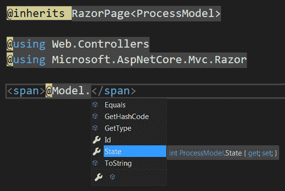

Views

在我们从服务器端讨论了应用程序是如何工作的之后，是时候来看看客户端了。在本章中，我们将介绍**模型视图控制器**（**MVC**）应用程序的视觉方面：视图。

此上下文中的视图是**超文本标记语言**（**HTML**和在服务器端执行的代码的组合，其输出在请求结束时被组合并发送给客户端。

为了帮助实现一致性和可重用性，ASP.NET Core 提供了一些非常方便的机制、页面布局和局部视图。此外，由于我们可能希望支持不同的语言和文化，我们有内置的本地化支持，这有助于提供更好的用户体验。

在本章中，我们将学习以下内容：

*   什么是剃须刀视图
*   什么是局部视图
*   什么是视图布局
*   什么是基本的 Razor 视图类
*   Razor 如何查找视图文件
*   如何将服务注入到视图中
*   什么是位置扩展器
*   如何执行视图本地化
*   如何在视图上混合使用代码和标记
*   如何在发布时启用视图编译

# 技术要求

为了实现本章介绍的示例，您需要.NET Core 3**软件开发工具包**（**SDK**和某种形式的文本编辑器。当然，VisualStudio2019（任何版本）满足所有要求，但您也可以使用 VisualStudio 代码，例如，或 VisualStudioforMac。

源代码可在[从 GitHub 检索 https://github.com/PacktPublishing/Modern-Web-Development-with-ASP.NET-Core-3-Second-Edition](https://github.com/PacktPublishing/Modern-Web-Development-with-ASP.NET-Core-3-Second-Edition) [。](https://github.com/PacktPublishing/Modern-Web-Development-with-ASP.NET-Core-3-Second-Edition)

# 开始

视图为**MVC**中的**V**。它们是应用程序的可视部分。通常，web 应用程序呈现 HTML 页面，即 HTML 视图。视图是一个模板，由 HTML 和一些可能的服务器端内容组成。

ASP.NET 核心使用视图引擎实际呈现视图，这是一种可扩展的机制。在 Core 时代之前，有几个视图引擎可用；尽管它们的目的总是生成 HTML，但它们在语法和支持的功能方面存在细微的差异。目前，ASP.NET 核心仅包含一个名为**Razor**的视图引擎，因为以前可用的另一个视图引擎 Web 表单已被删除。Razor 已经存在了相当长的一段时间，并且在将其添加到 ASP.NET 核心的过程中得到了改进。

Razor 文件具有`cshtml`扩展名（用于 C#HTML），按照惯例，它们保存在应用程序下方名为`Views`的文件夹中，以及应用它们的控制器名称的文件夹中，例如`Home`。可能会有全球和本地的观点，我们马上就会了解它们的区别。

让控制器操作返回视图的典型方法是返回执行`Controller`类的`View`方法的结果。这就创建了`ViewResult`，它可以有很多选项，如下所示：

*   `ContentType`（`string`：返回给客户端的可选内容类型；`text/html`是默认值
*   `Model`（`object`）：就是我们想让视图使用的任何对象
*   `StatusCode`（`int`：可选返回状态码；如果没有提供，则为`200`
*   **`TempData`**`ITempDataDictionary`：强类型临时数据，在下一次请求前可用

*   `ViewData`（`ViewDataDictionary`：传递给视图的任意数据的键值集合
*   `ViewName`（`string`：要渲染的视图的名称

唯一需要的参数是`ViewName`，如果不提供，则使用当前动作名称；也就是说，如果我们在名为`Index`的操作方法中执行，并且我们想要返回一个视图，但不提供其名称，那么将使用`Index`，如下面的代码片段所示：

```cs
public IActionResult Index()
{
    return this.View();  //ViewName = Index
}
```

`View`方法有一些重载，基本上采用`viewName`或模型，或两者兼有，如以下代码段所示：

```cs
return this.View(
    viewName: "SomeView",
    model: new Model()
);
```

Beware—if your model is of the `string` type, .NET may mistakenly choose the `View` overload that takes a view name!

现在，假设您想要返回一个具有特定内容类型或状态代码的视图。您可以从`View`方法调用中获取`ViewResult`对象，然后对其进行更改，如下所示：

```cs
var view = this.View(new Model());
view.ContentType = "text/plain";
view.StatusCode = StatusCodes.Status201Created;
return view;
```

或者，如果要设置一些视图数据，可以运行以下代码：

```cs
view.ViewData["result"] = "success";
```

有一件事你不能忘记，如果你没有在`AddMvc`注册你的 MVC 服务，你需要在`AddControllersWithViews`注册，如下所示：

```cs
services.AddControllersWithViews();
```

这将导致比`AddMvc`稍小的内存压力，因为它不会注册 Razor 页面所需的服务（不要将它们与 Razor 视图混淆，本章的范围！）。

Razor Pages and Razor views are not the same thing: Razor Pages are callable on their own, whereas Razor views are returned by controller action methods. Razor Pages will be discussed in their own chapter.

让我们继续探索 view 类。

# 理解观点

Razor 视图实际上是一个模板，它被转换为从`RazorPage<T>`继承的类。泛型参数实际上是模型的类型，稍后我们将看到。此类继承自`RazorPage`，它公开了一些有用的属性，如下所示：

*   `IsLayoutBeingRendered`（`bool`：当前是否呈现布局页面
*   `BodyContent`（`IHtmlContent`：生成页面的正文内容；将仅在稍后时间可用
*   `TempData`（`ITempDataDictionary`：临时数据字典
*   `ViewBag`（`dynamic`）：访问视图包，该视图包包含任意数据原型`dynamic`
*   `User`（`ClaimsPrincipal`：当前用户，如`HttpContext.User`所示
*   `Output`（`TextWriter`）：输出写入器，一旦页面被处理，HTML 结果将发送到该输出写入器
*   `DiagnosticSource`（`DiagnosticSource`）：允许记录诊断消息，此处介绍
*   `HtmlEncoder`（`HtmlEncoder`：用于在响应中发送结果时对结果进行编码的 HTML 编码器
*   `Layout`（`string`：当前布局文件
*   `ViewContext`（`ViewContext`：视图上下文
*   `Path`（`string`：当前查看文件路径
*   `Context`（`HttpContext`：HTTP 上下文

所有这些属性都可以在视图中使用。

当然，我们可以定义我们自己的类，它派生自`RazorPage<T>`，并让我们的视图使用它，通过使用`@inherits`，如下所示：

```cs
public class MyPage : RazorPage<dynamic>
{
    public override Task ExecuteAsync()
    {
        return Task.CompletedTask;
    }
}
```

唯一需要的方法是`ExecuteAsync`，但你不必担心。如果现在从该类继承，我们将看到以下内容：

```cs
@inherits MyPage
```

或者，如果我们希望生成的类实现一些接口，我们可以使用`@implements`关键字，例如`IDisposable`，如下面的代码片段所示：

```cs
@implements IDisposable

@public void Dispose()
{
    //do something
}
```

在这种情况下，我们当然必须自己实现所有接口成员。

# 理解视图生命周期

当动作发出应渲染视图的信号时，会发生以下情况（以简化的方式）：

*   操作返回一个`ViewResult`对象，因为`ViewResult`实现了`IActionResult`，其`ExecuteResultAsync`方法被异步调用。
*   默认实现尝试从**依赖项注入**（**DI**框架）中查找`ViewResultExecutor`。
*   在`ViewResultExecutor`上调用`FindView`方法，该方法使用注入的`ICompositeViewEngine`，也从 DI 框架中获取，从注册视图引擎列表中获取`IView`。

*   选择的视图引擎将是`IRazorViewEngine`的一个实现（反过来，它扩展了`IViewEngine`。
*   `IView`实现使用注册的`IFileProviders`加载视图文件。
*   然后要求`ViewResultExecutor`通过其`ExecuteAsync`方法调用视图，最终调用基础`ViewExecutor`的`ExecuteAsync`方法。
*   `ViewExecutor`构建并初始化一些基础设施对象，如`ViewContext`并最终调用`IView RenderAsync`方法。
*   另一个服务（`ICompilationService`用于编译 C#代码。
*   注册的`IRazorPageFactoryProvider`创建一个工厂方法，用于创建从`IRazorPage`继承的.NET 类。
*   `IRazorPageActivator`传递了新`IRazorPage`的实例。
*   调用`IRazorPage`的`ExecuteAsync`方法。

在这里，我没有提到过滤器，但正如我所说，它们也在这里，除了动作过滤器。

为什么这很重要？您可能需要实现自己版本的 say-`IRazorPageActivator`，以便在 Razor 视图中执行一些自定义初始化或 DI，如以下代码块所示：

```cs
public class CustomRazorPageActivator : IRazorPageActivator
{
    private readonly IRazorPageActivator _activator;

    public CustomRazorPageActivator(
        IModelMetadataProvider metadataProvider, 
        IUrlHelperFactory urlHelperFactory, 
        IJsonHelper jsonHelper, 
        DiagnosticSource diagnosticSource, 
        HtmlEncoder htmlEncoder, 
        IModelExpressionProvider modelExpressionProvider)
    {
        this._activator = new RazorPageActivator(
            metadataProvider, 
            urlHelperFactory,
            jsonHelper,
            diagnosticSource, htmlEncoder, 
            modelExpressionProvider);
    }

    public void Activate(IRazorPage page, ViewContext context)
    {
        if (page is ICustomInitializable)
        {
            (page as ICustomInitializable).Init(context);
        }

        this._activator.Activate(page, context);
    }
}
```

您只需在`ConfigureServices`中为`IRazorPageActivator`服务注册此实现，如下所示：

```cs
services.AddSingleton<IRazorPageActivator, CustomRazorPageActivator>();
```

现在，视图是如何定位的？

# 定位视图

当要求返回视图（`ViewResult`时，框架需要首先定位视图文件（`.cshtml`。

查找视图文件的内置约定如下：

*   视图文件以`cshtml`扩展名结尾。
*   视图文件名应与视图名相同，减去扩展名（例如，`Index`视图将存储在名为`Index.cshtml`的文件中）。
*   视图文件存储在`Views`文件夹中，并存储在以控制器命名的文件夹中，这些文件从控制器返回，例如`Views\Home`。
*   全局视图或共享视图直接存储在`Views`文件夹中，或存储在`Shared`文件夹中，例如`Views\Shared`。

实际上，这是由`RazorViewEngineOptions`类的`ViewLocationFormats`集合控制的（Razor 是唯一包含的视图引擎）。默认情况下，它具有以下条目：

*   `/Views/{1}/{0}.cshtml`
*   `/Views/Shared/{0}.cshtml`

The `{1}` token is replaced by the current controller name and `{0}` is replaced by the view name. The `/` location is relative to the ASP.NET Core application folder, not `wwwroot`.

如果你想让剃须刀引擎看不同的地方，你所需要做的就是告诉它；所以，通过`AddRazorOptions`方法，也就是通常依次调用`AddMvc`，在`ConfigureServices`方法中，如下所示：

```cs
services
    .AddMvc()
    .AddRazorOptions(options =>
    {
        options.ViewLocationFormats.Add("/AdditionalViews/{0}.cshtml");
    });
```

在`ViewLocationFormats`集合中按顺序搜索视图位置，直到找到一个文件。

实际查看文件内容通过`IFileProviders`加载。默认情况下，只注册了一个文件提供程序（`PhysicalFileProvider`，但可以通过配置添加更多文件提供程序。代码可以在以下代码段中看到：

```cs
services
    .AddMvc()
    .AddRazorOptions(options =>
    {
        options.FileProviders.Add(new CustomFileProvider());
    });
```

添加自定义文件提供程序可能很有用，例如，如果您希望从非传统位置加载内容，例如数据库、ZIP 文件、程序集资源等。有多种方法可以做到这一点。让我们在下面的小节中尝试它们。

## 使用视图位置扩展器

有一个高级功能，我们可以根据请求控制搜索视图文件的位置：称为**视图位置扩展器**。视图位置扩展器是一个剃须刀，因此也可以通过`AddRazorOptions`进行配置，如下代码段所示：

```cs
services
    .AddMvc()
    .AddRazorOptions(options =>
 {
   options.ViewLocationExpanders.Add(new ThemesViewLocationExpander
   ("Mastering"));
 });
```

视图位置扩展器只是实现`IViewExpander`约定的某个类。例如，假设您想要一个主题框架，该框架将向`views`搜索路径添加几个文件夹。你可以这样写：

```cs
public class ThemesViewLocationExpander : IViewLocationExpander
{
    public ThemesViewLocationExpander(string theme)
    {
        this.Theme = theme;
    }

    public string Theme { get; }

    public IEnumerable<string> ExpandViewLocations(
        ViewLocationExpanderContext context,
        IEnumerable<string> viewLocations)
    {
        var theme = context.Values["theme"];

        return viewLocations
            .Select(x => x.Replace("/Views/", "/Views/" + theme + "/"))
            .Concat(viewLocations);
    }

    public void PopulateValues(ViewLocationExpanderContext context)
    {
        context.Values["theme"] = this.Theme;
    }
}
```

如我们所见，默认搜索位置如下：

*   `/Views/{1}/{0}.cshtml`
*   `/Views/Shared/{0}.cshtml`

通过添加此视图位置扩展器，对于名为`Mastering`的主题，这些内容将变为以下内容：

*   `/Views/{1}/{0}.cshtml`
*   `/Views/Mastering/{1}/{0}.cshtml`
*   `/Views/Shared/Mastering/{0}.cshtml`
*   `/Views/Shared/{0}.cshtml`

`IViewLocationExpander`接口只定义了两种方法，如下：

*   `PopulateValues`：用于初始化视图位置扩展器；在本例中，我使用它在上下文中传递一些值。
*   `ExpandViewLocations`：将调用它来检索所需的视图位置。

视图位置扩展器已排队，因此将按照注册顺序依次调用它们；每个`ExpandViewLocations`方法都将被调用，其中包含前一个方法返回的所有位置。

这两种方法都可以通过`context`参数访问所有请求参数（`HttpContext`、`RouteData`等），因此您可以随心所欲地发挥创意，并根据您能想到的任何理由定义视图的搜索位置。

# 使用视图引擎

在本章的开头提到 ASP.NET 核心只包括一个视图引擎 Razor，但没有任何东西阻止我们添加更多。这可以通过`MvcViewOptions`的`ViewEngines`集合来实现，如下面的代码片段所示：

```cs
services
    .AddMvc()
    .AddViewOptions(options =>
    {
        options.ViewEngines.Add(new CustomViewEngine());
    });
```

视图引擎是`IViewEngine`的一个实现，唯一包含的实现是`RazorViewEngine`。

同样，当 ASP.NET Core 被要求呈现视图时，视图引擎会按顺序搜索，第一个返回视图的引擎就是所使用的引擎。`IViewEngine`定义的两种方法如下：

*   `FindView`（`ViewEngineResult`：尝试从`ActionContext`中查找视图
*   `GetView`（`ViewEngineResult`）：尝试从路径中查找视图

如果找不到视图，两种方法都返回`null`。

视图是`IView`的一个实现，`RazorViewEngine`返回的都是`RazorView`。`IView`合同中唯一值得注意的方法是`RenderAsync`，该方法负责实际呈现`ViewContext`的视图。

A view engine is not an easy task. You can find a sample implementation written by Dave Paquette in a blog post at: [http://www.davepaquette.com/archive/2016/11/22/creating-a-new-view-engine-in-asp-net-core.aspx](http://www.davepaquette.com/archive/2016/11/22/creating-a-new-view-engine-in-asp-net-core.aspx).

Razor 视图是一个基本上由 HTML 组成的模板，但它也接受相当大的片段，实际上是服务器端 C#代码。考虑它的要求，如下：

*   首先，您可能需要定义视图从控制器接收的模型类型。默认情况下，它是动态的，但您可以使用`@model`指令对其进行更改，如下所示：

```cs
@model MyNamespace.MyCustomModel
```

*   这样做与指定视图的基类完全相同。这是通过使用`@inherits`实现的，如下所示：

```cs
@inherits RazorPage<MyNamespace.MyCustomModel>
```

Remember: the default is `RazorPage<dynamic>`. Don't forget: you cannot have `@inherits` and `@model` at the same time with different types!

*   如果您不想编写完整的类型名，可以添加任意数量的`@using`声明，如以下代码段所示：

```cs
@using My.Namespace
@using My.Other.Namespace
```

*   您可以将 HTML 与 Razor 表达式混合，这些表达式在服务器端处理。剃刀表情总是以`@`字符开头。例如，如果要输出当前登录的用户，可以编写以下命令：

```cs
User: @User.Identity.Name
```

*   您可以直接输出任何返回`string`或`IHtmlContent`的方法，如下所示：

```cs
@Html.Raw(ViewBag.Message)
```

*   如果需要计算一些简单代码，则需要将其包含在括号内，如下所示：

```cs
Last week: @(DateTime.Today - TimeSpan.FromDays(7))
```

请记住，如果表达式有空格，则需要将其包含在括号内，唯一的例外是`await`关键字，如以下代码段所示：

```cs
@await Component.InvokeAsync("Process");
```

*   您可以对 HTML 进行编码（隐式使用`HtmlEncoder`属性中提供的`HtmlEncoder`实例），如下所示：

```cs
@("<span>Hello, World</span>")
```

这将输出一个 HTML 编码的字符串，如以下代码段所示：

```cs
&lt;span&gt;Hello, World&lt;/span&gt;
```

更复杂的表达式，例如变量的定义、属性的设置值或不返回**严格的**结果（`string`、`IHtmlContent`）的方法的调用需要放在一个特殊的块中，在这个块中，您可以在.NET 方法中放入几乎任何您想要的内容，如以下代码段所示：

```cs
@{
     var user = @User.Identity.Name;
     OutputUser(user);
     Layout = "Master";
 }
```

Sentences inside `@{}` blocks need to be separated by semicolons.

当然，以这种方式定义的变量可以在声明之后的视图中的任何其他位置使用。

现在让我们来看条件句（`if`、`else if`、`else`和`switch`，它们没有什么特别之处。请查看以下代码段：

```cs
//check if the user issuing the current request is authenticated somehow
@if (this.User.Identity.IsAuthenticated)
{
    <p>Logged in</p>
}
else
{
    <p>Not logged in</p>
}

//check the authentication type for the current user
@switch (this.User.Identity.AuthenticationType)
{
    case "Claims":
        <p>Logged in</p>
        break;

    case null:
        <p>Not logged in</p>
        break;
}
```

第一个条件检查当前用户是否经过身份验证，并相应地显示 HTML 块。第二个是`switch`指令，可以指定多个可能的值；在本例中，我们只看两个，**`"Claims"`**和`null`，这两个条件产生的结果基本上与第一个条件相同。

循环使用一种特殊的语法，您可以将 HTML（任何有效的**可扩展标记语言**（**XML**）元素）和代码混合在一起，如以下代码片段所示：

```cs
@for (var i = 0; i < 10; i++)
{
    <p>Number: @i</p>
}
```

请注意，这将不起作用，因为`Number`未包含在 XML 元素中，如以下代码段所示：

```cs
@for (var i = 0; i < 10; i++)
{
    Number: @i
}
```

但以下语法（`@:`可以使用：

```cs
@:Number: @i
```

这使得该行的其余部分被视为 HTML 块。

在`foreach`和`while`中可以使用相同的语法。

现在，让我们看一看`try`/`catch`块，如下面的代码片段所示：

```cs
@try
{
    SomeMethodCall();
}
catch (Exception ex)
{
    <p class="error">An error occurred: @ex.Message</p>
    Log(ex);
}
```

考虑下面代码片段中所示的 Tyr0T0 和 AuthT1-A.块：

```cs
@using (Html.BeginForm())
{
    //the result is disposed at the end of the block
}

@lock (SyncRoot)
{
    //synchronized block
}
```

现在，如果要输出`@`字符，该怎么办？你需要用另一个`@`来逃避它，就像这样：

```cs
<p>Please enter your username @@domain.com</p>
```

但是 Razor 视图可以识别电子邮件，并且不会强制对其进行编码，如以下代码片段所示：

```cs
<input type="email" name="email" value="nobody@domain.com"/>
```

最后，还支持单行或多行注释，如以下代码段所示：

```cs
@*this is a single-line Razor comment*@
@*
  this
  is a multi-line
  Razor comment
*@
```

在`@{}`块中，您也可以添加 C#注释，如以下代码片段所示：

```cs
@{
   //this is a single-line C# comment
   /*
   this
   is a multi-line
   C# comment
   */
 }
```

当然，由于视图本质上是 HTML，因此也可以使用 HTML 注释，如以下代码段所示：

```cs
<!-- this is an HTML comment -->
```

The difference between C#, Razor, and HTML comments is that only HTML comments are left by the Razor compilation process; the others are discarded.

我们可以将函数（用面向对象的术语来说，实际上是方法）添加到 Razor 视图中；这些只是.NET 方法，仅在视图范围内可见。要创建它们，我们需要将它们分组到`@functions`指令中，如下所示：

```cs
@functions
{
    int Count(int a, int b) { return a + b; }

    public T GetValueOrDefault<T>(T item) where T : class, new()
    {
        return item ?? new T();
    }
}
```

可以指定可见性。默认情况下，这发生在一个称为私有类的类中。指定可见性可能毫无意义，因为生成的类只有在运行时才知道，并且没有简单的方法访问它。

`@functions`名称实际上有点误导，因为您可以在其中声明字段和属性，如以下代码块所示：

```cs
@functions
{
    int? _state;
    int State
    {
        get
        {
            if (_state == null)
            {
                _state = 10;
            }
            return _state;
        }
    }
}
```

这个例子展示了一个简单的私有字段，它封装在一个属性后面，该属性后面有一些逻辑：第一次访问它时，它将字段设置为默认值；否则，它只返回当前值。

# 记录和诊断

通常，您可以从 DI 框架获得对`ILogger<T>`的引用，并在视图中使用它，如下所示：

```cs
@inject ILogger<MyView> Logger
```

但是还有另一个内置机制，`DiagnosticSource`类和属性，它们在`RazorPage`基类中声明。通过调用其`Write`方法，您可以将自定义消息写入诊断框架。这些消息可以是任何.NET 对象，甚至是匿名对象，无需担心其序列化。请查看以下代码段：

```cs
@{
    DiagnosticSource.Write("MyDiagnostic", new { data = "A diagnostic" });
}
```

此诊断消息所发生的情况实际上是可配置的。首先，让我们添加`Microsoft.Extensions.DiagnosticAdapter`NuGet 包，然后为该诊断源生成的事件创建一个自定义侦听器，如下所示：

```cs
public class DiagnosticListener
{
    [DiagnosticName("MyDiagnostic")]
    public virtual void OnDiagnostic(string data)
    {
        //do something with data
    }
}
```

我们可以针对不同的事件名称添加任意多的侦听器。实际的方法名并不重要，只要它应用了一个与事件名匹配的`[DiagnosticName]`属性。我们需要通过`Configure`方法注册并将其挂接到.NET 核心框架，方法是向`DiagnosticListener`服务添加一个引用，以便我们可以与之交互，如下所示：

```cs
public void Configure(IApplicationBuilder app, DiagnosticListener diagnosticListener)
{
    var listener = new DiagnosticListener();
    diagnosticListener.SubscribeWithAdapter(listener);

    //rest goes here
}
```

请注意，`[DiagnosticName]`属性中的名称与`DiagnosticSource.Write`调用匹配，`Write`调用中匿名类型的名称`data`与`OnDiagnostic`方法的参数名称（和类型）匹配。

内置.NET 核心类为以下各项生成诊断：

*   `Microsoft.AspNetCore.Diagnostics.HandledException`
*   `Microsoft.AspNetCore.Diagnostics.UnhandledException`
*   `Microsoft.AspNetCore.Hosting.BeginRequest`
*   `Microsoft.AspNetCore.Hosting.EndRequest`
*   `Microsoft.AspNetCore.Hosting.UnhandledException`
*   `Microsoft.AspNetCore.Mvc.AfterAction`
*   `Microsoft.AspNetCore.Mvc.AfterActionMethod`
*   `Microsoft.AspNetCore.Mvc.AfterActionResult`
*   `Microsoft.AspNetCore.Mvc.AfterView`

*   `Microsoft.AspNetCore.Mvc.AfterViewComponent`
*   `Microsoft.AspNetCore.Mvc.BeforeAction`
*   `Microsoft.AspNetCore.Mvc.BeforeActionMethod`
*   `Microsoft.AspNetCore.Mvc.BeforeActionResult`
*   `Microsoft.AspNetCore.Mvc.BeforeView`
*   `Microsoft.AspNetCore.Mvc.BeforeViewComponent`
*   `Microsoft.AspNetCore.Mvc.Razor.AfterViewPage`
*   `Microsoft.AspNetCore.Mvc.Razor.BeforeViewPage`
*   `Microsoft.AspNetCore.Mvc.Razor.BeginInstrumentationContext`
*   `Microsoft.AspNetCore.Mvc.Razor.EndInstrumentationContext`
*   `Microsoft.AspNetCore.Mvc.ViewComponentAfterViewExecute`
*   `Microsoft.AspNetCore.Mvc.ViewComponentBeforeViewExecute`
*   `Microsoft.AspNetCore.Mvc.ViewFound`
*   `Microsoft.AspNetCore.Mvc.ViewNotFound`

希望这些名字能不言自明。你为什么要在基于`ILogger`的机制上使用这种机制？这使得使用强类型方法将侦听器添加到诊断源非常容易。我将在[第 12 章](12.html)、*记录、跟踪和诊断*中详细介绍两者之间的区别。

# 视图编译

通常，视图只有在首次使用时才被编译，即控制器操作返回`ViewResult`。这意味着，只有在框架呈现页面时，才会在运行时捕获任何最终的语法错误；另外，即使没有错误，ASP.NET 核心也需要一些时间（请注意，以毫秒为单位）来编译视图。然而，情况并非如此。

与以前的版本不同，默认情况下，当 Razor 文件更改时，ASP.NET Core 3 不会重新编译视图。为此，您必须重新启动服务器。如果要恢复此行为，需要添加对`Microsoft.AspNetCore.Mvc.Razor.RuntimeCompilation`NuGet 包的引用，并将以下行添加到`services`配置中：

```cs
services
    .AddMvc()
    .AddRazorRuntimeCompilation();
```

或者，您可能更愿意只为应用程序的调试版本启用此功能，这会将其从生产版本中排除。在这种情况下，您可以这样做：

```cs
var mvc = services.AddMvc();

#if DEBUG
mvc.AddRazorRuntimeCompilation();
#endif
```

或者，对于特定的环境，您可以将`IWebHostEnvironment`注入您的`Startup`类中，存储它，并在调用`AddRazorRuntimeCompilation`之前检查当前环境，如下所示：

```cs
public IConfiguration Configuration { get; }
public IWebHostEnvironment Environment { get; }

public Startup(IConfiguration configuration, IWebHostEnvironment environment)
{
    this.Configuration = configuration;
    this.Environment = environment;
}

var mvc = services.AddMvc();

if (this.Environment.IsDevelopment())
{
    mvc.AddRazorRuntimeCompilation();
}
```

Microsoft 提供了一个 NuGet 软件包，即`Microsoft.AspNetCore.Mvc.Razor.ViewCompilation`，您可以将其添加为项目的参考。之后，您可以在发布时启用视图编译，目前唯一的方法是手动编辑`**.**csproj`文件。查找其中声明的第一个`<PropertyGroup>`实例，即包含`<TargetFramework>`元素的实例，并添加一个`<MvcRazorCompileOnPublish>`和一个`<PreserveCompilationContext>`元素。结果应该如下所示：

```cs
<PropertyGroup>
  <TargetFramework>netcoreapp3</TargetFramework>
  <MvcRazorCompileOnPublish>true</MvcRazorCompileOnPublish>
  <PreserveCompilationContext>true</PreserveCompilationContext>
</PropertyGroup>
```

现在，无论何时使用 Visual Studio 或`dotnet publish`命令发布项目，都会出现错误。

Do not forget that the precompilation only occurs at **publish**, not **build**, time!

为每个视图生成的类公开了一个名为`Html`的属性，该属性的类型为`IHtmlHelper<T>`，`T`是模型的类型。此属性有一些有趣的方法可用于呈现 HTML，如下所示：

*   正在生成链接（`ActionLink`、`RouteLink`）
*   给定模型或模型属性的生成表单（`BeginForm`、`BeginRouteForm`、`CheckBox`、`CheckBoxFor`、`Display`、`DisplayFor`、`DisplayForModel`、`DisplayName`、`DisplayNameFor`、`DisplayNameForInnerType`、`DisplayNameForModel`、**`DisplayText`**、`DisplayTextFor`、`DropDownList`、`DropDownListFor`、`Editor`、`EditorFor`、`EditorForModel`、`EndForm`、`Hidden`、`Id`、`DisplayNameForModel`、`Id`，`IdFor`、`IdForModel`、`Label`、`LabelFor`、`LabelForModel`、`ListBox`、`ListBoxFor`、`Name`、`NameFor`、`NameForModel`、`Password`、`PasswordFor`、`RadioButton`、`RadioButtonFor`、`TextArea`、`TextAreaFor`、`TextBox`、`TextBoxFor`、`Value`、`ValueFor`、`ValueForModel`）
*   显示验证消息（`ValidationMessage`、`ValidationMessageFor`、`ValidationSummary`）
*   提供防伪代币（`AntiForgeryToken`
*   输出原始 HTML（`Raw`）
*   包括局部视图（`Partial`、`PartialAsync`、`RenderPartial`、`RenderPartialAsync`）
*   访问上下文属性（`ViewContext`、`ViewBag`、`ViewData`、`TempData`以及基类的属性（`RazorPage`、`RazorPage<T>`）和属性（`UrlEncoder`**、**`MetadataProvider`）
*   一对配置属性（`Html5DateRenderingMode`、`IdAttributeDotReplacement`）

我们将在[第 13 章](13.html)中更详细地研究这些方法，*了解测试如何工作*。现在，让我们看看如何添加我们自己的扩展（helper）方法。最简单的方法是在`IHtmlHelper<T>`上添加一个扩展方法，如下面的代码片段所示：

```cs
public static HtmlString CurrentUser(this IHtmlHelper<T> html)
{
    return new HtmlString(html.ViewContext.HttpContext.
    User.Identity.Name);
}
```

现在，您可以在每个视图中使用它，如下所示：

```cs
@Html.CurrentUser()
```

确保您从它返回`string`或`IHtmlContent`；否则，您将无法使用此语法。

我们已经看到，`ViewResult`类提供了以下三个属性，可用于将数据从操作传递到视图：

*   **模型**（`Model`）：在 ASP.NET MVC 的早期，这是唯一可以使用的机制；我们需要定义一个可能相当复杂的类，其中包含我们希望提供的所有数据。
*   **视图数据**（`ViewData`）：现在我们有了一个强类型的随机值集合，这在模型中得到了普及。
*   **临时数据**（`TempData`）：只有在下一次请求之前才可用的数据。

这些属性最终会传递给`RazorPage<T>`类中同名的属性。

甚至可以通过设置`ViewEngine`属性的值来指定视图渲染过程应该使用的视图引擎（一个`IViewEngine`实例），但这并不常见。通常，这是自动处理的。

# 向视图传递数据

接下来我们将讨论将数据传递给视图的不同方式。

## 使用模型

默认情况下，Razor 视图继承自`RazorPage<dynamic>`，这意味着模型原型为`dynamic`。

这将是`Model`属性的类型。这是一个灵活的解决方案，因为您可以在模型中传递您想要的任何内容，但您无法获得 IntelliSense Visual Studio 对它的完整支持。

但是，您可以通过`inherits`指定强类型模型，如下所示：

```cs
@inherits RazorPage<ProcessModel>
```

这也可以通过使用`model`指令来实现，如下所示：

```cs
@model ProcessModel
```

这些基本上是相同的。Visual Studio 可帮助您找到其属性和方法，如以下屏幕截图所示：



One thing to keep in mind is that you cannot pass an anonymous type on your controller, as the view won't be able to access its properties. See the next chapter for a solution to this.

## 使用 ViewBag 属性

视图包（`ViewBag`属性）是对模型的补充，但在我看来，它早已占据了主导地位。为什么呢？好吧，我想问题在于，每当需要更多属性时，都需要更改模型类，而且在视图包中粘贴新项要容易得多。

使用查看包有两个选项，如下所示：

*   通过运行时不安全的`ViewBag`动态属性，如下所示：

```cs
<script>alert('@ViewBag.Message');</script>
```

*   通过`ViewData`强类型字典，如下所示：

```cs
<script>alert('@ViewData["Message"]');</script>
```

`ViewBag`只是`ViewData`的一个包装器——添加到其中一个的任何内容都可以从另一个中检索，反之亦然。选择`ViewData`的一个很好的理由是，如果存储数据的名称包含空格或其他特殊字符，如`-`、`/`、`@`等。

## 使用临时数据

在[第 4 章](04.html)、*控制器和动作*中解释的临时数据，如果我们需要，可以按照与`ViewData`类似的方式检索，如下所示：

```cs
<script>alert('@TempData["Message"]');</script>
```

记住，临时数据只存在于`next`请求的范围内，顾名思义。

接下来，我们将探讨为视图定义公共结构的机制。

# 了解视图布局

视图布局类似于旧 ASP.NET Web 表单中的母版页。它们定义了一个基本布局，可能还有几个视图可以使用的默认内容，以便最大化、重用并提供一致的结构。在以下屏幕截图中可以看到示例视图布局：


Image taken from https://docs.microsoft.com/en-us/aspnet/core/mvc/views/layout

视图布局本身也是 Razor 视图，可以通过在视图中设置`Layout`属性来控制它们，该属性在`RazorPage`基类中定义，如下所示：

```cs
@{ Layout = "_Layout"; }
```

`Layout`属性只是一个视图的名称，可以用通常的方式发现它。

布局视图中唯一需要的是调用`RenderBody`方法；这将导致渲染使用它的实际视图。还可以定义节占位符，实际视图可以使用这些占位符来提供内容。一个节由一个`RenderSection`调用定义，如下面的代码块所示：

```cs
<!DOCTYPE html>
<html>
  <head><title></title>
    @RenderSection("Head", required: false)
  </head>
  <body>
    @RenderSection("Header", required: false)
    <div style="float:left">
        @RenderSection("LeftNavigation", required: false)
    </div>
    @RenderBody
    <div style="float:right">
        @RenderSection("Content", required: true)
    </div>
    @RenderSection("Footer", required: false)
  </body>
</html>
```

如您所见，`RenderSection`采用以下两个参数：

*   名称，在布局中必须是唯一的
*   根据区段是否需要，需要参数（默认为`true`）

还有异步版本的`RenderSection`，恰当地命名为`RenderSectionAsync`。

Unlike ASP.NET Web Forms content placeholders, it is not possible to supply default content on a view layout.

如果某个节是按要求定义的，则使用布局视图的视图页面必须为其声明一个`section`，如下所示：

```cs
@section Content
{
    <h1>Hello, World!</h1>
}
```

如果没有定义节，Razor 编译系统只接受已编译视图并将其内容插入调用`RenderBody`的位置。

通过执行以下代码，可以检查是否定义了节：

```cs
@if (IsSectionDefined("Content")) { ... }
```

`IsLayoutBeingRendered`属性告诉我们是否定义、找到布局视图，以及当前是否正在渲染布局视图。

如果您知道某个剖面在视图布局中已按要求定义，但仍不希望渲染该剖面，则可以调用`IgnoreSection`，如下所示：

```cs
@IgnoreSection(sectionName: "Content")
```

如果出于任何原因，您决定不在视图布局中包含实际视图的任何内容，您可以调用`IgnoreBody`。

Layouts can be nested—that is, a top-level view can define one layout that also has its own layout, and so on.

接下来，让我们探讨视图类型及其使用方式。

# 理解局部视图

部分视图类似于常规视图，但其目的是包含在一个中间视图中。语法和功能集完全相同。这个概念类似于 ASP.NET Web 表单中的用户控件，基本上是**干式**（简称**不要重复自己**）。通过在局部视图中包装公共内容，我们可以在不同的位置引用它。

有三种方法，可以以同步和异步的方式将部分视图包含在视图的中间。第一种方法涉及到`Partial`和`PartialAsync`方法，如下面的代码片段所示：

```cs
@Html.Partial("LoginStatus")
@await Html.PartialAsync("LoginStatus")
```

如果视图中有任何需要异步运行的代码，则可以使用异步版本。

另一种包含部分内容的方式是通过`RenderPartial`和`RenderPartialAsync`，如下面的代码片段所示：

```cs
@{ Html.RenderPartial("LoginStatus"); }
@{ await Html.RenderPartialAsync("LoginStatus"); }
```

*两者有什么区别？*我听到你问。那么，`Partial`/`PartialAsync`返回`IHtmlContent`，这本质上是一个编码字符串，`RenderPartial`/`RenderPartialAsync`直接写入底层输出写入程序，可能会导致（稍微）更好的性能。

第三个是使用 ASP.NET Core 2.1 中出现的`<partial>`标记帮助程序，如以下代码片段所示：

```cs
<partial name="Shared/_ProductPartial.cshtml" />
```

Partial views and view layouts are two different, complementary, mechanisms to allow reuse. They should be used together, not one instead of the other.

让我们看看局部视图是如何工作的。

## 向局部视图传递数据

`Partial`和`RenderPartial`都提供了允许我们传递模型对象的重载，如以下代码片段所示：

```cs
@Html.Partial("OrderStatus", new { Id = 100 })
@{ Html.RenderPartial("OrderStatus", new { Id = 100 }); }
```

当然，`OrderStatus`视图中声明的模型必须与传递的模型兼容，如果声明为动态（默认），则总是会发生这种情况；如果不是，那么它将抛出异常，所以要小心！

对于`Partial`/`PartialAsync`，我们也可以传递其`ViewBag`的值，如下所示：

```cs
@Html.Partial("OrderStatus", new { Id = 100 }, ViewData)
@await Html.PartialAsync("OrderStatus", new { Id = 100 }, ViewData)
```

这里，我们只是传递当前视图包，但不一定是这样。

Partial views can be nested, meaning that a partial view can include other partial views.

## 寻找局部视图

局部视图的发现略有不同，原因如下：

*   如果只提供了一个名称（例如，`LoginStatus`），则使用与全局视图相同的规则查找视图文件。
*   如果视图名称以`.cshtml`（例如，`LoginStatus.cshtml`）结尾，则仅在与包含视图相同的文件夹中查找视图文件。
*   如果视图名称以`~/`或`/`开头（例如，`~/Views/Status/LoginStatus.cshtml`），则视图文件将在相对于 web 应用程序根目录的文件夹中查找（请注意，不是`wwwroot`文件夹）。
*   如果视图名称以`../`开头（例如，`../Status/LoginStatus.cshtml`），则视图引擎将尝试在相对于调用视图之一的文件夹中查找它。

如果位于不同的文件夹中，则可以存在多个具有相同名称的局部视图。

# 理解特殊视图文件

ASP.NET Core 可识别两个特殊的视图文件，如果存在，将按如下方式进行特殊处理：

*   `_ViewImports.cshtml`：用于指定应用于所有视图的 Razor 指令（`@addTagHelper`、`@removeTagHelper`、`@tagHelperPrefix`、`@using`、`@model`、`@inherits`、`@inject`，如以下代码片段所示：

```cs
@using Microsoft.AspNetCore.Mvc.Razor
@using My.Custom.Namespace
@inject IMyService Service
```

*   `_ViewStart.cshtml`：此处放置的任何代码都将对所有视图执行；因此，它是设置全局通用布局（当然，每个视图都可以覆盖该布局）、通用模型或基本视图页面的好地方，如下所示：

```cs
@{ Layout = "_Layout"; }
```

但也有其他用途，例如：

*   添加`@using`指令，以便所有视图都可以访问相同的名称空间
*   添加`@inject`指令
*   通过`@addTagHelper`注册标签助手
*   定义静态方法（对于 Razor 页面最有用）

VisualStudio 模板将这些文件添加到应用程序的`Views`文件夹中。这意味着它们不能正常引用，因为此文件夹位于视图的默认搜索位置之外。

Special files are aware of areas, meaning that if you are using areas and you add one of these files to an area, it will be executed after the global one.

让我们看看可以为视图配置的一些选项。

# 了解视图选项

作为开发人员，我们会影响视图的某些工作方式，尤其是 Razor 视图。通常，这是通过配置完成的，通过`ConfigureServices`方法中通常依次调用`AddViewOptions`和`AddRazorOptions`扩展方法来完成的，如下面的代码片段所示：

```cs
services
    .AddMvc()
    .AddViewOptions(options =>
    {
        //global view options
    })
    .AddRazorOptions(options =>
    {
        //razor-specific options
    });
```

通过`AddViewOptions`可以配置`MvcViewOptions`类的以下属性：

*   `ClientModelValidatorProviders`（`IList<IClientModelValidatorProvider>`：客户端模型验证程序提供者的集合，在客户端验证模型时使用；这将在[第 11 章](11.html)、*安全*中讨论，但默认情况下，它包括`DefaultClientModelValidatorProvider`、`DataAnnotationsClientModelValidatorProvider`和`NumericClientModelValidatorProvider`。
*   `HtmlHelperOptions`（`HtmlHelperOptions`：几个与 HTML 生成相关的选项；下面将讨论这一点。
*   `ViewEngines`（`IList<IViewEngine>`：注册的视图引擎；默认情况下，它只包含一个`RazorViewEngine`实例。

`HtmlHelperOptions`具有以下特性：

*   `ClientValidationEnabled`（`bool`：是否启用客户端验证；默认值为`true`。
*   `Html5DateRenderingMode`（`Html5DateRenderingMode`：在 HTML5 表单字段中将`DateTime`值呈现为字符串的格式；默认值为`Rfc3339`，表示`DateTime`为`2017-08-19T12:00:00-01:00`。
*   `IdAttributeDotReplacement`（`string`）：当 MVC 呈现模型的输入字段时，要使用的字符串代替点（`.`）；默认为`_`。

*   `ValidationMessageElement`（`string`：将用于呈现其特定验证消息的 HTML 元素；默认值为`span`。
*   `ValidationSummaryMessageElement`（`string`：用于呈现全局验证摘要的 HTML 元素；默认值为`span`。

`AddRazorOptions`方法提供了更特定于 Razor 视图的功能，如下所示：

*   `AdditionalCompilationReferences`（`IList<MetadataReference>`：可以从中加载 ASP.NET 核心元素（控制器、视图组件、标记帮助程序等）的程序集引用集合；默认为空
*   `AreaViewLocationFormats`（`IList<string>`：区域文件夹内要搜索的文件夹列表，用于查看；与`ViewLocationFormats`类似，但适用于区域
*   `CompilationCallback`（`Action<RoslynCompilationContext>`：编译每个元素后调用的回调方法；可以安全地忽略，因为它只能由高级开发人员使用
*   `CompilationOptions`（`CSharpCompilationOptions`：一组 C#编译选项
*   `FileProviders`（`IList<IFileProvider>`：文件提供者的集合；默认情况下，只包含一个`PhysicalFileProvider`实例
*   `ParseOptions`（`CSharpParseOptions`：一组 C#解析选项
*   `ViewLocationExpanders`（`IList<IViewLocationExpander>`：视图位置扩展器集合
*   `ViewLocationFormats`（`IList<string>`：要搜索视图文件的位置，前面讨论过

通常，`MetadataReference`是使用`MetadataReference`类的一种静态方法获得的，如下所示：

```cs
var asm = MetadataReference.CreateFromFile("\Some\Folder\MyAssembly.dll");
```

`CSharpCompilationOptions`和`CSharpParseOptions`类非常广泛，主要包括编译器支持的所有设置，甚至包括一些在 Visual Studio 中不容易找到的设置。解释所有这些都会很枯燥，而且非常离题，但我这里只举两个例子：

```cs
services
    .AddMvc()
    .AddRazorOptions(options =>
    {
        //enable C# 7 syntax
        options.ParseOptions.WithLanguageVersion(LanguageVersion.CSharp7);

        //add a using declaration for the System.Linq namespace
        options.CompilationOptions.Usings.Add("System.Linq");
    });
```

这段代码作为引导过程的一部分运行，它为 Razor 页面设置了一个使用 C#Version7 的选项。它还为`System.Linq`名称空间添加了一个隐式`using`语句。

现在，我们将了解如何逻辑（和物理）组织我们的站点功能：区域。

## 引用应用程序的基本路径

在[第 2 章](02.html)、*配置*中描述了基本路径，作为在`/`以外的路径中托管我们的应用程序的一种方式。如果需要在视图中获取应用程序的基本路径，可以使用以下方法：

```cs
<script>
var basePath = '@Url.Content("~/")';
</script>
```

在本例中，我们将配置的基本路径（映射到特殊的`~`文件夹）存储到 JavaScript 变量。

现在我们了解了布局的工作原理，让我们看看如何使用网站上的区域。

# 使用区域

区域是您在网站内隔离功能的一种方式。例如，与**管理**区域相关的任何内容都放在一个地方，例如，一个物理文件夹，包括它自己的控制器、视图等。就视图而言，唯一值得一提的是如何配置可以找到视图文件的路径。这是通过`RazorViewEngineOptions`类的`AreaViewLocationFormats`集合控制的，如下面的代码片段所示：

```cs
services
    .AddMvc()
    .AddRazorOptions(options =>
    {
        options.AreaViewLocationFormats.Add("/SharedGlobal
        /Areas/{2}.cshtml");
    });
```

包含的值如下所示：

*   `/Areas/{2}/Views/{1}/{0}.cshtml`
*   `/Areas/{2}/Views/Shared/{0}.cshtml`
*   `/Views/Shared/{0}.cshtml`

这里，`{2}`标记代表区域名称，`{0}`代表视图名称，`{1}`代表控制器名称，如前所述。基本上，您的结构与非区域视图类似，但现在您有了全局共享或按区域共享的视图。

如前所述，您可以向区域添加特殊文件。现在，让我们看看 DI 在视图中是如何工作的。

# 依赖注入

视图类（`RazorPage<T>`）支持在其构造函数中注入服务，如以下代码片段所示：

```cs
public class MyPage : RazorPage<dynamic>
{
    public MyPage(IMyService svc)
    {
        //constructor injection
    }
}
```

视图还支持将服务注入其中。只需在`.cshtml`文件中声明一个`@inject`元素，其中包含要检索的服务类型和保存它的局部变量，可能在视图的开头，如下所示：

```cs
@inject IHelloService Service
```

在此之后，您可以使用注入的`Service`变量，如下所示：

```cs
@Service.SayHello()
```

There may be the need to either fully qualify the type name or add a `@using` declaration for its namespace.

现在让我们看看如何让我们的应用程序以不同的语言响应。

# 使用翻译

我们在上一章中已经看到，ASP.NET 核心包括用不同语言显示资源的内置机制；这当然包括观点。实际上，有两种方式显示翻译文本，如下所示：

*   资源
*   翻译观点

让我们从资源开始。

## 利用资源

那么，假设我们有两个资源文件（`.resx`），用于语言**PT**和**EN**。让我们将它们存储在`Resources`文件夹下（这可以配置，稍后我们将看到），一个名为`Views`的文件夹下，以及一个以控制器命名的文件夹内，视图将从该文件夹提供服务（例如，`Home`）。文件名本身必须与操作名匹配，因此，例如，我们可能有以下内容：

*   `Resources\Views\Home\Index.en.resx`
*   `Resources\Views\Home\Index.pt.resx`

在使用之前，我们需要在`ConfigureServices`中配置本地化服务，如下所示：

```cs
services
    .AddMvc()
    .AddMvcLocalization(
        format: LanguageViewLocationExpanderFormat.Suffix,
        localizationOptionsSetupAction: options =>
        {
            options.ResourcesPath = "Resources";
        });
```

`AddMvcLocalization` 的两个参数表示如下：

*   `format`（`LanguageViewLocalizationExpanderFormat`：用于说明资源文件的区域性的格式
*   `localizationOptionsSetupAction`（`Action<LocalizationOptions>`：配置定位机制需要采取的动作，比如指定资源的路径（目前只有`ResourcesPath`属性）

`LanguageViewLocalizationExpanderFormat`的两个可能值如下：

*   `SubFolder`：这意味着每个资源文件都应该存储在以区域性命名的文件夹下（例如，`Resources\Views\Home\en`、`Resources\Views\Home\en-gb`、`Resources\Views\Home\pt`、`Resources\Views\Home\pt-pt`等等）。
*   `Suffix`：区域性是文件名的一部分（例如，`Index.en.resx`、`Index.pt.resx`等等）。

对于`LocalizationOptions`结构，其`ResourcePath`属性已经默认为`Resources`。

注册后，我们需要实际添加负责设置区域性和 UI 区域性的中间件：

```cs
var supportedCultures = new[] { "en", "pt" };

var localizationOptions = new RequestLocalizationOptions()
    .SetDefaultCulture(supportedCultures[0])
    .AddSupportedCultures(supportedCultures)
    .AddSupportedUICultures(supportedCultures);

app.UseRequestLocalization(localizationOptions);
```

这应该采用`Configure`方法。以下是对此的一点解释：

1.  我们必须确定可供选择的文化；这些应该映射到我们拥有的资源文件。
2.  如果浏览器未设置特定区域性，则其中一个区域性将是默认的（**回退**）区域性。
3.  这里我们既要设置当前区域性（`CultureInfo.CurrentCulture`），也要设置当前 UI 区域性（`CultureInfo.CurrentUICulture`）；它们很有用，因为我们可能希望在将字符串值发送到视图之前在服务器上格式化字符串值，在这种情况下，我们希望服务器代码使用适当的区域性。

对于资源提供者，ASP.NET Core 包含三个，默认情况下都包含在`RequestLocalizationOptions`类中，顺序如下：

*   `QueryStringRequestCultureProvider`：查找`culture`查询字符串键
*   `CookieRequestCultureProvider`：从`.AspNetCore.Culture`cookie 获取要使用的培养基
*   `AcceptLanguageHeaderRequestCultureProvider`：查找`Accept-Language`HTTP 头

提供者列表（实现`IRequestCultureProvider`的类）存储在`RequestLocalizationOptions.`中

`RequestCultureProviders`这个列表被交叉，直到它找到一个返回值的提供者。

当涉及到实际使用资源文件中的值时，我们需要向视图中注入一个`IViewLocalizer`实例并从中检索值，如下所示：

```cs
@inject IViewLocalizer Localizer
<h1>@Localizer["Hello"]</h1>
```

`IViewLocalizer`接口扩展了`IHtmlLocalizer`，因此继承了它的所有属性和方法。

您也可以使用**共享资源**。共享资源是一组`.resx`文件，加上一个空类，它们与特定的操作或控制器无关。这些应存储在`Resources`文件夹中，但此类的命名空间应设置为程序集默认命名空间，如以下代码段所示：

```cs
namespace chapter05
{
    public class SharedResources { }
}
```

对于本例，资源文件应称为`SharedResources.en.resx`，或任何其他区域性的名称。

然后，在您看来，插入对`IHtmlLocalizer<SharedResources>`的引用，如下所示：

```cs
@inject IHtmlLocalizer<SharedResources> SharedLocalizer
<h1>@SharedLocalizer["Hello"]</h1>
```

接下来，我们将翻译视图。

## 使用翻译视图

另一种选择是转换整个视图；通过翻译，我的意思是 ASP.NET Core 将在返回到通用视图之前寻找与当前语言匹配的视图。

要激活此功能，您需要调用`AddViewLocalization`，如下所示：

```cs
services
    .AddMvc()
    .AddViewLocalization();
```

这样做的目的是添加一个名为`LanguageViewLocationExpander`的**视图位置扩展器**（还记得吗？）。这将复制已注册的视图位置，以便包括以当前语言作为文件后缀的位置。例如，我们可能有以下初始视图位置格式：

*   `/Views/{1}/{0}.cshtml`
*   `/Views/Shared/{0}.cshtml`

对于`pt`语言，这些将成为以下内容：

*   `/Views/{1}/{0}.pt.cshtml`
*   `/Views/{1}/{0}.cshtml`
*   `/Views/Shared/{0}.pt.cshtml`
*   `/Views/Shared/{0}.cshtml`

因为顺序很重要，这实际上意味着 ASP.NET Core 将首先尝试查找以`.pt`结尾的视图（例如`Index.pt.cshtml`），然后，如果找不到，它将求助于查找通用视图（例如`Index.cshtml`。很酷，你不觉得吗？当然，翻译后的视图可能与一般视图完全不同，尽管这主要是为了翻译而设计的。

# 总结

视图布局是必不可少的；尽量避免嵌套（或太嵌套）视图布局，因为可能很难理解最终结果。局部视图也非常方便，但请确保使用它们以避免重复代码。

我们还应该避免在视图中使用代码，例如，通过指定自定义视图类；为此目的使用过滤器。我们认为我们应该考虑你的应用程序的本地化需求；重构不使用本地化引入的现有应用程序非常困难且容易出错。

然后，接下来，我们看到，为了安全，可以使用代码或标记帮助程序来保护视图的敏感部分。

坚持文件夹名称等方面的约定。这将使团队中的每个人，无论是现在还是将来，都能更轻松地完成任务。

我们了解到，`_ViewImports.cshtml`和`_ViewStart.cshtml`是您的朋友，它们用于您希望应用于所有页面的通用代码。

考虑视图编译它确实有助于发现一些问题之前，他们咬你。

在本章中，我们使用内置的 Razor 引擎介绍了 ASP.NET 核心的视图功能。我们了解了如何使用视图布局来引入一致的布局和部分视图，以便进行封装和重用。我们学习了将数据从控制器传递到视图的方法。

在下一章中，我们将继续使用视图，特别是 HTML 表单。我们将深入讨论这里介绍的一些主题。

# 问题

您现在应该能够回答以下问题：

1.  视图的基类是什么？
2.  如何将服务注入到视图中？
3.  什么是视图位置扩展器？
4.  什么是视图布局？
5.  什么是局部视图？
6.  哪些功能可以替换局部视图？
7.  `_ViewStart.cshtml`特殊文件的作用是什么？