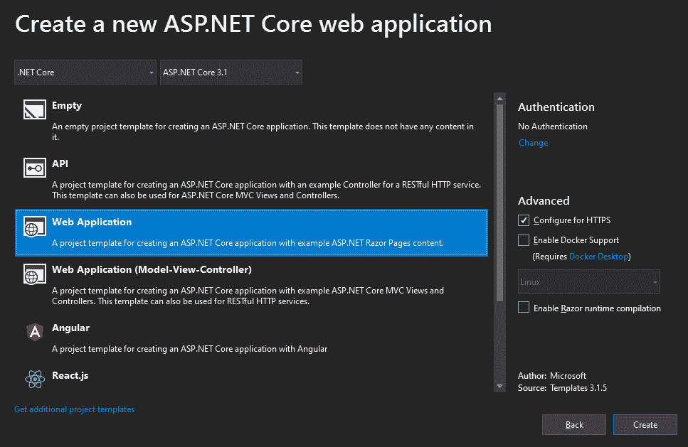
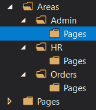

# 七、实现 Razor 页面

本章介绍 Razor Pages，这是 ASP.NET Core 2.0 中引入的一项功能，它提供了一个不使用控制器的简化开发模型。

通过学习本章，我们将能够开发由数据驱动的动态网站。

我们将讨论以下内容：

*   资产搜查令
*   使用页面模型
*   剃刀观点的共性
*   强制执行安全

# 技术要求

要实现本章中介绍的示例，您需要.NET Core 3 SDK 和文本编辑器。当然，VisualStudio2019（任何版本）满足所有要求，但您也可以使用 VisualStudio 代码。

源代码可以在这里从 GitHub 检索：[https://github.com/PacktPublishing/Modern-Web-Development-with-ASP.NET-Core-3-Second-Edition](https://github.com/PacktPublishing/Modern-Web-Development-with-ASP.NET-Core-3-Second-Edition)

# 开始

**剃须刀页面**是在 ASP.NET Core 2.0 中引入的，它们采用了与 ASP.NET Core其他部分完全不同的方法。Razor 页面不是 MVC 模式，而是自包含的文件，类似于 XAML 控件或 ASP.NET Web 表单，因为它们也可以有代码隐藏文件。不再存在控制器/视图分离，因为 Razor 页面在一个文件中拥有它们所需的所有内容，尽管我们也可以为它们指定一个类。

要使用 Razor 页面，您需要一个兼容的 Visual Studio 版本，从 2017 Update 3 开始，另外还需要安装 ASP.NET Core 2.0 或更高版本：



Razor 页面物理上存储在文件系统中，位于`Pages`文件夹下（这是惯例），页面应具有与常规 Razor 视图相同的`.cshtml`扩展名。与之不同的是新的`@page`指令。显示的代码如下所示：

```cs
@page
@model HelloWorldModel
<!DOCTYPE html>
<html>
  <head><title>Hello World</title></head>
  <body>
    <h1>@Html.Raw("Hello, World!")</h1>
  </body>
</html>
```

添加一个`@page`指令（最好作为第一行）会自动将`.cshtml`文件变成一个页面。不需要引用任何特定的 NuGet 包或执行任何配置，因为它在默认情况下处于启用状态。

访问 Razor 页面非常简单；由于不涉及路由，可以直接调用，不需要`.cshtml`分机：

*   `/HelloWorld`
*   `/Admin/Settings`

唯一的要求是页面位于`Pages`根文件夹中的某个位置。`Index.cshtml`文件默认为送达，即如果其中一个文件位于`Pages\Admin`文件夹内，则无需明确请求即可送达；`/Admin`将提供`\Pages\Admin\Index.cshtml`文件。

要路由到 Razor 页面，需要使用新的端点路由机制显式启用它：

```cs
app.UseEndpoints(endpoints =>
{
    endpoints.MapRazorPages();
});
```

您甚至可以使用新的`RequireHost`扩展方法来确保只有在使用某些主机头或端口时才能访问 Razor 页面。不要忘记注册 it 所需的服务：

```cs
services.AddRazorPages();
```

Leave the `Pages` prefix and the `.cshtml` extension out; they cannot be used in the request. Also, Razor pages cannot start with an underscore (`_`).

让我们从资产搜索顺序开始，了解 Razor 页面的位置。

# 资产搜查令

Razor Pages 资产（`.cshtml`文件）将按以下文件夹和顺序进行搜索：

*   `Pages`中的当前文件夹
*   `/Pages/Shared/`
*   `/Views/Shared/`

这意味着用户请求的视图名称或布局将首先在当前文件夹（根据请求的路径）中查找，然后在`/Pages/Shared`文件夹中查找，最后在`/Views/Shared`中查找—所有这些都与应用的根文件夹相关。

因此，在学习了基础知识之后，让我们跳转到页面模型，这是一个非常重要的概念。

# 使用页面模型

您可以使用与 Razor 视图完全相同的语法，但还有更多的东西；Razor 页面本身就有一个与之关联的`PageModel`类，请注意指向`HelloWorldModel`的`@model`指令。该类必须继承自`PageModel`，在该类中可以定义处理 HTTP 方法的方法，如`GET`或`POST`。包含页面模型类定义的文件必须与具有`.cs`扩展名的 Razor 页面具有相同的物理名称，位于同一文件夹中，并从`PageModel`继承。因此，例如，如果前一个文件名为`HelloWorld.cshtml`，则其页面模型将放在`HelloWorld.cshtml.cs`文件中：

```cs
public class HelloWorldModel : PageModel
{
}
```

如果您不希望指定自定义页面模型类，系统会自动为您提供一个，您仍然可以在`.cshtml`文件中直接指定处理程序方法：

```cs
@functions
{
    public async Task<IActionResult> OnGetAsync()
    {
        if (!this.User.Identity.IsAuthenticated)
        {
            return this.RedirectToAction(actionName: "Login", 
            controllerName: "Account");
        }

        return this.Page();
    }
}
```

考虑下面的属性，例如，您可以在 AutoT0-派生类中声明：

```cs
public string Message { get; set; }

public void OnGet()
{
    this.Message = "Hello, World!";
}
```

然后可以在`.cshtml`文件中使用这些选项：

```cs
<p>Message: @Model.Message</p>
```

您甚至可以在此处声明该类：

```cs
@page
@model IndexModel
@functions
{
    public class IndexModel : PageModel
    {
        public async Task<IActionResult> OnGetAsync()
        {
            //whatever
        }
    }
}
```

`PageModel`类提供以下属性：

*   `HttpContext`（`HttpContext`：通常的上下文
*   `ModelState`（`ModelStateDictionary`：模型状态，由所有值提供者填写
*   `PageContext`（`PageContext`）：提供对当前处理程序方法（如果有）的访问，以及值提供程序和查看开始工厂集合
*   `Request`（`HttpRequest`）：与请求对象`HttpContext.Request`相同的值
*   `Response`（`HttpContext.Response`中的`HttpResponse`：响应对象
*   `RouteData`（`RouteData`：路由数据，一般不需要
*   `TempData``ITempDataDictionary`：临时数据

*   `Url`（`IUrlHelper`）：用于生成指向路由动作的 URL，例如`User`（`ClaimsPrincipal`来自`HttpContext.User`：当前用户，由使用中的认证机制确定
*   `ViewData`（`ViewDataDictionary`）：视图包，如[第 4 章](04.html)、*控制器和动作*中介绍的

这是关于页面模型的一般信息，现在让我们详细了解这些特性；首先，让我们看看如何实现页面处理程序。

## 了解页面处理程序

HTTP 方法处理程序可以有多个签名：

*   名称必须以`On`开头，后跟 HTTP 方法名称（`Get`、`Post`、`Put`、`Delete`等）。
*   返回类型必须为`void`或`IActionResult`。
*   如果我们要使用异步版本，则该方法必须返回`Task`或`Task<IActionResult>`，并可选地应用`async`关键字，并且应该以`Async`后缀结尾。
*   它们可以采用参数（具有默认值的基本类型或复杂类型），完全不采用参数，也可以采用`IFormCollection`参数。

现在，您可以添加处理请求的方法，可以是同步的，如下所示：

```cs
public IActionResult OnGet()
{
    if (this.HttpContext.Request.Headers["HTTP-
    Referer"].SingleOrDefault().Contains("google.com") == true)
    {
        //hey, someone found us through Google!
    }

    return this.Page();
}
```

或者，它们可以异步处理请求：

```cs
public async Task<IActionResult> OnGetAsync()
{
    //...
    return this.Page();
}
```

You cannot have both a synchronous and an asynchronous handler method or multiple overloads for the same HTTP verb, as it will result in a runtime error.

您甚至可以拥有不遵循这些模式的自定义处理程序。实现这一目标的几种方法如下：

*   在查询字符串中传递一个`handler`参数，例如`?handler=MyHandler`。
*   改为传递路由中的`handler`参数，例如`@page "{handler?}"`。
*   在`<form>`、`<input>`或`<button>`标记中，设置`asp-page-handler`属性，例如`asp-page-handler="MyHandler"`（这使用标记处理程序功能）。

通过这种方式，您可以使用以下方法：

```cs
public async Task<IActionResult> OnPostMyHandlerAsync() { ... }
```

不管您给它起什么名字，如果它是一个异步处理程序，您总是会有`On`前缀和`Async`后缀。

如果希望将页面发布到多个处理程序，根据单击的内容，很容易：

```cs
<form method="post">
    <input type="submit" value="One Handler" asp-page-handler="One" />
    <input type="submit" value="Another Handler" asp-page-handler="Two" />
</form>
```

要使其工作，两个按钮必须位于具有`POST`方法的表单中，并且默认标记帮助程序必须在`_ViewImports.cshtml`中注册：

```cs
@addTagHelper *, Microsoft.AspNetCore.Mvc.TagHelpers
```

处理程序的名称必须遵循约定。对于本例，您可以按如下方式使用它们：

```cs
public void OnPostOne() { ... }

public async Task<IActionResult> OnPostTwoAsync() { ... }
```

这只是一个示例，它们可以是异步的，也可以不是异步的，还可以返回值。在内部，他们可以通过返回`IActionResult`执行重定向等任务：

```cs
public async Task<IActionResult> OnPostTwoAsync()
{
    return this.RedirectToPage("/Pages/Success");
}
```

但并非所有的行动结果都有意义；例如，返回`ViewResult`没有意义，因为 Razor 页面不会在控制器的上下文中执行。如果不需要，您甚至不需要返回`IActionResult`：

```cs
public void OnGet()
{
    //initialize everything
}
```

这些可以作为返回`IActionResults`的助手，其方式与`ControllerBase`和`Controller`类基本相同：

*   `Challenge`（`ChallengeResult`）
*   `Content`（`ContentResult`）
*   `File`（`FileContentResult`、`FileStreamResult`、`VirtualFileResult`）
*   `Forbid`（`ForbidResult`）
*   `LocalRedirect`（`LocalRedirectResult`）
*   `LocalRedirectPermanent`（`LocalRedirectResult`）
*   `LocalRedirectPermanentPreserveMethod`（`LocalRedirectResult`）
*   `LocalRedirectPreserveMethod`（`LocalRedirectResult`）
*   `NotFound`（`NotFoundResult`、`NotFoundObjectResult`）
*   `Page`（`PageResult`）
*   `PhysicalFile`（`PhysicalFileResult`）
*   `Redirect`（`RedirectResult`）
*   `RedirectPermanent`（`RedirectResult`）
*   `RedirectPermanentPreserveMethod`（`RedirectResult`）
*   `RedirectPreserveMethod`（`RedirectResult`）
*   `RedirectToAction`（`RedirectToActionResult`）
*   `RedirectToActionPermanent`（`RedirectToActionResult`）
*   `RedirectToActionPermanentPreserveMethod`（`RedirectToActionResult`）
*   `RedirectToActionPreserveMethod`（`RedirectToActionResult`）

*   `RedirectToPage`（`RedirectToPageResult`）
*   `RedirectToPagePermanent`（`RedirectToPageResult`）
*   `RedirectToPagePermanentPreserveMethod`（`RedirectToPageResult`）
*   `RedirectToPagePreserveMethod`（`RedirectToPageResult`）
*   `RedirectToRoute`（`RedirectToRouteResult`）
*   `RedirectToRoutePermanent`（`RedirectToRouteResult`）
*   `RedirectToRoutePermanentPreserveMethod`（`RedirectToRouteResult`）
*   `RedirectToRoutePreserveMethod`（`RedirectToRouteResult`）
*   `SignIn`（`SignInResult`）
*   `SignOut`（`SignOutResult`）
*   `StatusCode`（`StatusCodeResult`、`ObjectResult`）
*   `Unauthorized`（`UnauthorizedResult`）

其中一些方法提供重载，每个方法都可以返回不同的结果类型。

最后，如果需要，可以将参数传递给处理程序：

```cs
<input type="submit" value="Third Handler" asp-page-handler="Three" asp-route-foo="bar" />
```

只需在处理程序上声明一个参数：

```cs
public void OnPostThree(string foo)
{
    //do something with the value of foo
}
```

在了解了如何实现页面处理程序之后，现在让我们看看如何将请求绑定到类模型。

## 做模型绑定

如果您在页面模型类（或`@functions`块中声明一个属性，并使用`[BindProperty]`属性对其进行修饰，它将自动绑定，使用与前一章中所述相同的规则（绑定源提供程序和绑定属性）：

```cs
[BindProperty]
public Order Order { get; set; }
```

然后，您将能够访问和更改它的任何属性，可能是在 HTTP 处理程序方法中。您也可以通过`BinderType`属性提供自己的活页夹。如果`BindProperty`的`SupportsGet`属性设置为`true`，则`BindProperty`也可以绑定`GET`调用。

如果愿意，还可以将`[BindProperties]`属性应用于整个类，其所有属性将自动绑定：

```cs
[BindProperties]
public class Model
{
    public int OneProperty { get; set; }
    public string AnotherProperty { get; set; }
}
```

Do notice that properties bound this way will only be so for non-`GET` calls (typically `POST`) unless you set its `SupportsGet` property (both `[BindProperty]` and `[BindProperties]` have `SupportsGet`). It works pretty much the same as `[ModelBinder]`, but the latter never binds on `GET` requests.

此外，与控制器操作类似，HTTP 处理程序方法中的参数也会自动绑定：

```cs
public void OnGet(int? id = null)
{
    //?id=1212
}
```

您可以选择不将模型声明为处理程序方法签名的一部分，而是动态更新它：

```cs
public void OnPost()
{
    var model = new OrderModel();
    this.TryUpdateModel(model);
}
```

这样做的一个可能原因是，同一个页面处理不同的请求，从而处理不同的模型。

现在我们已经了解了如何将请求转换为类，现在是学习如何验证它的时候了！

## 进行模型验证

模型验证的工作方式与控制器中的工作方式基本相同：

```cs
public IActionResult OnPost()
{    
    var model = new OrderModel();

    this.TryUpdateModel(model);

    if (this.TryValidateModel(model))
    {
        return this.RedirectToPage("/Pages/Error");
    }

    return this.Page();
}
```

与控制器类似，`ModelState`属性还跟踪所有注入值及其验证状态。

## 维持状态

所有常用的数据持久化方法也适用于 Razor 页面，因此这里没有什么特别值得一提的。

## 使用视图布局

Razor 页面可以使用与视图相同的布局功能，但建议您将布局页面保留在`Views\Shared`文件夹之外，因为这是为视图保留的。

## 使用局部视图

与视图布局一样，也以完全相同的方式支持局部视图。

现在让我们看看如何支持这些区域。

## 使用区域

从 ASP.NET Core 2.1 开始，Razor 页面还支持以下区域。区域是一种在应用内部、文件夹中物理分离模块的方法。这仅仅意味着 Razor 页面可以在这些文件夹中寻址，如以下示例所示：

请注意，必须在项目根目录上的`Areas`文件夹下创建这些文件夹，如下所示：



在每个命名区域内，我们必须创建一个`Pages`文件夹。在它里面，你可以放任何你喜欢的东西，比如`.cshtml`文件、`_ViewStart.cshml`和许多其他文件。默认情况下，区域处于启用状态。

是时候提一下 Razor 视图和 Razor 页面中存在的特殊文件了。

## 特殊文件

Razor 页面尊重`_ViewStart.cshtml`和`_ViewImports.cshtml`文件，并以与常规 Razor 视图相同的方式处理它们，即在实际页面之前调用它们。它们也适用于不同的区域，这意味着您可以拥有不同的文件，每个区域一个。

接下来，让我们讨论过滤器。

## 使用过滤器

Razor 页面可以使用除操作过滤器之外的任何过滤器。这些过滤器不会被触发，因为您没有操作。还有一个新的过滤器`IPageFilter`，还有一个异步版本`IAsyncPageFilter`。我已经在“使用过滤器”一节中谈到了它们，所以我在这里不再重复。

我们将在下面看到，依赖注入也受到支持。

## 使用依赖注入

您可以按照通常的方式将依赖项注入页面模型类的构造函数中：

```cs
public class HelloWorldModel : PageModel
{
    public HelloWorldModel(IMyService svc)
    {
        //yes, dependency injection in the constructor also works!
    }
}
```

如果您在自定义页面模型中用`[FromServices]`修饰一个属性，它将被接受，并且该属性的值将从依赖项注入框架及其声明的类型中设置。

您也可以使用`@inject`指令，就像在 Razor 视图中一样。

现在，我们将了解如何配置特定于 Razor 页面的选项。

## 配置选项

`AddRazorPagesOptions`扩展方法可以在`AddMvc`之后调用，这样我们可以配置 Razor 页面的一些选项：

```cs
services
    .AddMvc()
    .AddRazorPagesOptions(options =>
    {
        options.RootDirectory = "/Pages";
    });
```

`RazorPagesOptions`类提供以下属性：

*   `AllowAreas`（`bool`：是否允许区域默认为`false`
*   `AllowMappingHeadRequestsToGetHandler`（`bool`）：如果剃须刀页面（或其型号）没有为`HEAD`提供处理程序，`HEAD`请求是否会变成`GET`请求-默认为`false`
*   `Conventions`（`IList<IApplicationModelConvention>`）：将在未来的一章中讨论使用此选项的约定
*   `RootDirectory`（`string`：相对于应用根目录的根目录，通常设置为`/Pages`

此外，还有一些扩展方法是通过`RazorPagesOptions`配置的，基本上增加了一个或多个约定：

*   `AllowAnonymousToFolder`：允许匿名请求特定文件夹下的所有页面
*   `AllowAnonymousToPage`：允许对给定页面进行匿名请求
*   `AuthorizeFolder`：为特定文件夹下的所有页面定义授权策略（这将在[第 11 章](11.html)、*安全*中进行更深入的讨论）
*   `AuthorizePage`：定义特定页面的授权策略
*   `ConfigureFilter`：允许全局过滤器的配置（添加和删除）

请查看以下示例：

```cs
services
    .AddMvc()
    .AddRazorPagesOptions(options =>
    {
        options.Conventions.AllowAnonymousToPage("/Pages/HelloWorld");
    });
```

页面路由是一种特殊的配置，我们将在下面看到。

## 了解页面路由

除了直接调用 Razor 页面外，您还可以让它们应答路由。`RazorPagesOptions`有一种新的`AddPageRoute`扩展方法，您可以利用它向页面添加友好路由：

```cs
services
    .AddMvc()
    .AddRazorPagesOptions(options =>
    {
        options.Conventions.AddPageRoute("/Order", "My/Order/{id:int}");
    });
```

有趣的是，我们可以看到 Razor 页面在某种程度上依赖于 MVC 框架。

`AddPageRoute`的参数如下：

*   `pageName`（`string`）：指向的页面名称，以`/`开头，不带`.cshtml`后缀
*   `route`（`string`：常规路由，可能有一些路由或查询字符串参数

在视图中，您可以使用`HttpContext.RouteData`或`HttpContext.Request.Query`访问任何路由或查询字符串参数。

有趣的是，下面是如何将页面（`/HelloWorld`设置为默认页面的：

```cs
.AddRazorPagesOptions(options =>
{
    options.Conventions.AddPageRoute("/HelloWorld", "");
});
```

此外，通过向`page`指令添加路由模板参数，您可以让 Razor 页面监听特定路由：

```cs
@page "{id:int}"
```

在这种情况下，如果调用 Razor 页面时没有使用`id`参数，该参数也必须是`int`类型，则不会找到该页面，而是返回 HTTP**404**错误。

接下来，如何在 Razor 页面中强制执行安全规则。

## 强制执行安全

我们可以通过两种方式在 Razor 页面上强制执行安全规则：

*   通过将`[Authorize]`属性应用于页面模型或页面处理程序
*   通过定义约定

让我们从属性方法开始。

### 使用[Authorize]属性

整个页面都很简单：

```cs
[Authorize]
public class AdminIndexModel: PageModel
{
}
```

也可以将其用于单个处理程序：

```cs
public class AdminIndexModel: PageModel
{
    [Authorize]
    public void OnGet() { ... }
}
```

现在，让我们继续讨论公约。

### 习俗

使用`AddRazorPagesOptions`扩展方法，我们可以控制如何将安全性应用于一个或多个页面或文件夹。可用的方法如下：

*   `AllowAnonymousToPage`：授予对单个页面的匿名访问权限
*   `AllowAnonymousToFolder`：授予对给定文件夹下所有页面的匿名访问权限
*   `AuthorizePage`：定义页面的授权策略
*   `AuthorizeFolder`：为文件夹下的所有页面定义授权策略

下面是一个例子：

```cs
services
    .AddMvc()
    .AddRazorPagesOptions(options =>
    {
        //adds an AuthorizeAttribute with a named Policy property
        options.Conventions.AuthorizePage("/ShoppingBag", 
        "Authenticated");
        //adds an AuthorizeAttribute
        options.Conventions.AuthorizeFolder("/Products");
        //adds an AllowAnonymousAttribute
        options.Conventions.AllowAnonymousToPage("/Login"); 
        options.Conventions.AllowAnonymousToFolder("/Images");           
    });
```

在这里，我们确保**`"/ShoppingBag"`**端点仅适用于**`"Authenticated"`**策略，并确保尝试访问**`"/Products"`**的任何人都需要授权。最后，任何人都可以使用**`"/Login"`**和**`"/Images"`**URL，包括匿名用户。

现在，我们可以从 XSS 攻击中学到什么？

## 跨站点请求脚本

服务器上的 Razor 页面默认情况下会检查**跨站点请求脚本**（**XSS**攻击。如果您想在 Razor 页面中使用 AJAX，请确保在页面中包含防伪令牌，并在每个 AJAX 请求中发送标题，如[第 11 章](11.html)、**安全*中的*防伪保护*部分所述。*

 *# 总结

首先，在常规视图和 Razor 页面之间进行选择是一个需要提前做出的决定，因为它们太不一样了。拥有控制器和视图对以前使用过 MVC 的人来说可能更具吸引力，我想说这可以带来更好的耦合和组织，但是 Razor 页面非常容易使用，不需要服务器端代码，也不需要重新编译（如果不使用页面模型的话）。

继续使用局部视图和视图布局，因为它们是提高重用性的良好机制。

与控制器操作一样，Razor 页面也存在同样的安全问题。最好选择约定而不是属性，因为我们有一个存储安全信息的中心位置。

在本章中，我们介绍了 ASP.NET Core 2 的新 Razor Pages 功能，该功能虽然与普通视图不同，但共享相当多的功能。它可以用于更简单的解决方案，而不需要控制器和操作的所有麻烦。

在下一章中，我们将了解如何提取有关 ASP.NET Core中发生的事情的信息。

# 问题

您现在应该能够回答以下问题：

1.  Razor 页面是否使用代码隐藏？
2.  页面模型的用途是什么？
3.  什么是页面处理程序？
4.  如何限制匿名用户调用 Razor 页面？
5.  我们可以通过哪两种方式将服务注入 Razor 页面？
6.  剃须刀页面是否使用页面布局？
7.  默认情况下，Razor 页面在哪里提供服务？*