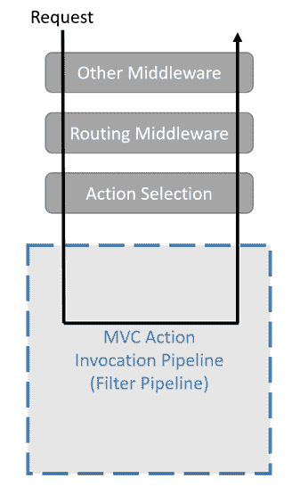

Understanding Filters

过滤器是 ASP.NET Core 提供的一种机制，用于应用横切关注点，如日志记录、异常处理、强制授权和身份验证等。从 ASP.NETMVC 的早期开始，它们就已经存在，但在核心部分得到了扩展。

ASP.NET Core中的过滤器是一种拦截机制，通过它我们可以在处理请求之前而不是之后执行代码。可以将它们视为一种向管道中添加自定义步骤的方法，而不必实际这样做；它保持不变，但我们对截取的内容有更细粒度的控制。它们对于实现横切操作非常有用，例如访问控制、缓存或日志记录。在这里，我们将讨论以下内容：

*   了解不同的过滤器类型
*   了解授权过滤器
*   了解资源过滤器
*   了解动作过滤器
*   了解结果过滤器
*   了解异常过滤器
*   了解页面过滤器
*   了解始终运行结果过滤器

# 技术要求

为了实现本章中介绍的示例，您需要.NET Core 3 SDK 和文本编辑器。当然，VisualStudio2019（任何版本）满足所有要求，但您也可以使用 VisualStudio 代码。

源代码可以在[从 GitHub 检索 https://github.com/PacktPublishing/Modern-Web-Development-with-ASP.NET-Core-3-Second-Edition](https://github.com/PacktPublishing/Modern-Web-Development-with-ASP.NET-Core-3-Second-Edition) 。

# 管道中的过滤器

过滤器是管道的一部分。它们在 ASP.NET Core选择要运行的控制器（或 Razor 页面）后执行。下图对此进行了说明：



Image obtained from https://docs.microsoft.com/en-us/aspnet/core/mvc/controllers/filters

过滤器是一种拦截机制。过滤器在控制器（或页面）操作之前、之后或代替控制器（或页面）操作执行某些操作。下一节将解释不同的过滤器类型。

# 了解过滤器类型

在 ASP.NET Core 3（以及版本 2）中，我们有以下过滤器：

*   **授权**`IAuthorizationFilter`和`IAsyncAuthorizationFilter`：控制执行当前请求的用户是否具有访问指定资源的权限；如果没有，则管道的其余部分短路，并返回错误消息。
*   **资源**（`IResourceFilter`和`IAsyncResourceFilter`：在请求被授权后但在动作选择和模型绑定之前执行。这些是 ASP.NET Core的新特性。
*   **动作**（`IActionFilter`和`IAsyncActionFilter`：在调用动作方法前后执行。
*   **结果**（`IResultFilter`和`IAsyncResultFilter`：这些发生在实际执行动作结果之前和之后（即`IActionResult.ExecuteResultAsync`方法）。
*   **异常**（`IExceptionFilter`和`IAsyncExceptionFilter`：在处理动作的过程中抛出异常时调用。
*   **页面**（`IPageFilter`和`IAsyncPageFilter`：这些发生在调用 Razor 页面处理程序方法之前和之后，对于 ASP.NET Core 2 来说是新的。
*   **始终运行结果**（`IAlwaysRunResultFilter`和`IAsyncAlwaysRunResultFilter`）：这是 ASP.NET Core 2.1 的新功能，类似于**动作**过滤器，但与此不同的是，始终运行结果始终运行，即使出现异常：


Image obtained from https://docs.microsoft.com/en-us/aspnet/core/mvc/controllers/filters

这类筛选器具有在目标事件之前和之后调用的 pre 方法和 post 方法，分别是授权、资源、操作、结果和页面。前方法版本始终以执行结束，后方法版本以执行结束。例如，对于动作过滤器，这些方法被称为`OnActionExecuting`和&`OnActionExecuted`。当然，授权和异常过滤器只提供一个方法-`OnAuthorization`和`OnException`，但您可以将它们视为事件后方法。

所有过滤器的唯一基类是`IFilterMetadata`，它不提供方法或属性，只是作为一个标记接口。因此，ASP.NET Core框架必须检查过滤器的具体类型，以尝试识别其实现的已知接口。

让我们从两种横切类型的过滤器开始，它们有两种类型。

## 同步与异步

每种过滤器类型都提供同步和异步版本，后者有一个`Async`前缀。两者的区别在于，在异步版本中，只定义 pre 方法，并异步调用它；对于动作过滤器，同步版本提供`OnActionExecuting`/`OnActionExecuted`，异步版本提供单一`OnActionExecutionAsync`方法。只有异常筛选器不提供异步版本。

选择异步或同步筛选器，但不能同时选择两者！现在，让我们看看过滤器的适用范围。

## 过滤范围

过滤器可应用于不同级别：

*   **全局**：全局筛选器适用于所有控制器和操作，因此它们还捕获抛出的任何异常。全局过滤器通过`AddMvc`方法添加到`MvcOptions`类的`Filters`集合中：

```cs
services.AddMvc(options =>
{
    options.Filters.Add(new AuthorizeAttribute());
});
```

*   **控制器**：控制器级过滤器通常通过应用于控制器类的资源添加，并应用于对其调用的任何操作：

```cs
[Authorize]
public class HomeController : Controller { ... }
```

*   **动作**：这些过滤器仅适用于声明它们的动作方法：

```cs
public class HomeController
{
    [Authorize]
    public IActionResult Index() { ... }
}
```

`MvcOptions`的`Filters`集合可以采用过滤器类型或过滤器实例。如果希望使用 DI 框架构建过滤器，请使用过滤器类型。

现在让我们看看过滤器的执行顺序。

## 执行令

过滤器按以下顺序调用：

*   批准
*   资源
*   行动
*   页面（仅适用于剃须刀页面）
*   后果
*   始终运行结果

当然，异常和页面过滤器是特殊的，因此它们仅在发生异常时或分别在调用 Razor 页面时被调用。

因为大多数过滤器都有 pre 方法和 post 方法，所以实际顺序如下所示：

*   `IAuthorizationFilter.OnAuthorization`
*   `IResourceFilter.OnResourceExecuting`
*   `IActionFilter.OnActionExecuting`
*   `<controller action>`
*   `IActionFilter.OnActionExecuted`
*   `IResultFilter.OnResultExecuting`
*   `IAlwaysRunResultFilter.OnResultExecuting`
*   `IAlwaysRunResultFilter.OnResultExecuted`
*   `IResultFilter.OnResultExecuted`
*   `IResourceFilter.OnResourceExecuted`

`<Controller action>`当然是控制器上的动作方式，如果我们使用 MVC（剃须刀页面请参见[第 7 章](07.html)、*实现剃须刀页面*）。

有可能使某些滤波器短路；例如，如果在资源或授权筛选器上，我们通过将值设置为上下文的`Result`属性来返回结果，则不会调用操作筛选器或设置为在其之后执行的任何其他筛选器。但是，任何已注册的始终运行结果筛选器都将始终运行。

根据滤波器的应用方式，我们可以影响该顺序；例如，对于全局过滤器，根据`MvcOptions.Filters`集合中的索引对相同类型的过滤器进行排序，如下所示：

```cs
options.Filters.Insert(0, new AuthorizeAttribute());  //first one
```

对于属性过滤器，`IOrderedFilter`接口提供一个`Order`属性，该属性可用于排序相同范围（全局、控制器或操作）的属性：

```cs
[Cache(Order = 1)]
[Authorize(Order = 0)]
[Log(Order = 2)]
public IActionResult Index() { ... }
```

现在让我们看看如何通过属性应用和排序过滤器。

## 通过属性应用过滤器

过滤器接口可以通过一个常规属性（即`Attribute`类）实现，然后它将充当过滤器；有一些抽象的基本属性类`ActionFilterAttribute`（操作和结果过滤器）、`ResultFilterAttribute`（结果过滤器）和`ExceptionFilterAttribute`（异常过滤器）可以子类化以实现此行为。这些类实现了同步和异步版本，还支持通过实现`IOrderedFilter`对调用它们的顺序进行排序。因此，如果您想拥有一个处理操作和结果的过滤器属性，您可以从`ActionFilterAttribute`继承并实现其一个或多个虚拟方法：

*   `OnActionExecuting`
*   `OnActionExecuted`
*   `OnActionExecutionAsync`

*   `OnResultExecuting`
*   `OnResultExecuted`
*   `OnResultExecutionAsync`

例如，如果您希望在调用某个操作之前覆盖 abstract`ActionFilterAttribute`filter 属性上的某些行为以执行某些操作，则可以尝试以下操作：

```cs
public class LogActionAttribute : ActionFilterAttribute
{
    public override void OnActionExecuting(ActionExecutingContext 
    context)
    {
        var loggerFactory = context.HttpContext.RequestServices.
        GetRequiredService<ILoggerFactory>();
        var logger = _loggerFactory.CreateLogger
        (context.Controller.GetType());
        logger.LogTrace($"Before {context.ActionDescriptor.
        DisplayName}");
    }
}
```

在这里，我们通过属性的构造函数注入记录器工厂，该构造函数继承自`ActionFilterAttribute`，并从中获取记录器。

## 过滤器排序

应根据以下任一要求订购相同类型的过滤器：

*   插入到`MvcOptions.Filters`集合中的顺序
*   如果过滤器实现了`IOrderedFilter`，则其`Order`属性

例如，授权类型的所有全局筛选器将根据这些规则进行排序，然后所有控制器级筛选器将应用于控制器，然后所有操作级筛选器。

所有的`ActionFilterAttribute`、`MiddlewareFilterAttribute`、`ServiceFilterAttribute`和`TypeFilterAttribute`类都实现了`IOrderedFilter`；这些是将过滤器注入控制器和操作的最常用方法。

现在让我们看看如何创建过滤器。

## 工厂和供应商

过滤器工厂只是创建过滤器的类的实例；唯一需要的是它实现了`IFilterFactory`，因为它继承了`IFilterMetadata`，所以也可以用作全局过滤器或自定义属性。你为什么要那样做？好吧，因为当过滤器工厂运行时，您可能会从当前的执行上下文中学到更多东西。让我们看一个例子：

```cs
public class CustomFilterFactory : IFilterFactory
{
    public bool IsReusable => true;

    public IFilterMetadata CreateInstance(IServiceProvider 
    serviceProvider)
    {
        //get some service from the DI framework
        var svc = serviceProvider.GetRequiredService<IMyService>();
        //create our filter passing it the service
        return new CustomFilter(svc);
    }
}
```

该过滤器工厂依赖于需要注册的特定服务。为了全局注册此自定义筛选器工厂，我们使用以下方法：

```cs
services.AddMvc(options =>
{
    options.Filters.Insert(0, new CustomFilterFactory());
});
```

在一个属性中实现`IFilterFactory`同样简单，所以我不在这里展示。

过滤器工厂的合同很简单：

*   `IsReusable`（`bool`）：告诉框架跨请求重用过滤器工厂是否安全。
*   `CreateInstance`：此方法返回一个过滤器。

`CreateInstance`方法将`IServiceProvider`实例作为其唯一参数，并返回`IFilterMetadata`对象，这意味着您可以返回您想要的任何类型的过滤器（甚至其他过滤器工厂）。

过滤器提供程序（`IFilterProvider`是作为 MVC 配置的一部分在 DI 框架中注册的实际实现，它触发所有不同的过滤器行为。默认实现为`DefaultFilterProvider`。`IFilterProvider`接口只有一个属性：

*   `Order`（`int`：执行提供者的顺序。这提供了以下两种方法：

DI 呢？有没有办法将其与过滤器一起使用？哦，是的，有，我们看看刚才是怎么回事！

## DI

迄今为止，我们通过`Filters`集合或通过属性在全球范围内看到的添加过滤器的方法不是 DI 友好的；在第一种情况下，添加一个已经实例化的对象，对于属性，它们是 DI 框架未实例化的静态数据。但是，我们有`[ServiceFilter]`属性，它接受过滤器类（任何类型）的类型作为其唯一必需的参数，并使用 DI 框架对其进行实例化；更重要的是，它甚至允许订购：

```cs
[ServiceFilter(typeof(CacheFilter), Order = 2)]
[ServiceFilter(typeof(LogFilter), Order = 1)]
public class HomeController : Controller { ... }
```

例如，`LogFilter`类可能如下所示：

```cs
public class LogFilter : IAsyncActionFilter
{
    private readonly ILoggerFactory _loggerFactory;

    public LogFilter(ILoggerFactory loggerFactory)
    {
        this._loggerFactory = loggerFactory;
    }

    public Task OnActionExecutionAsync(ActionExecutingContext
    context, ActionExecutionDelegate next)
    {
        var logger = this._loggerFactory.CreateLogger
        (context.Controller.GetType());
        logger.LogTrace($"{context.ActionDescriptor.DisplayName}
        action called");
        return next();
    }
}
```

与往常一样，`ILoggerFactory`由 DI 框架传入控制器，`LogFilter`类本身必须注册：

```cs
services.AddSingleton<LogFilter>();
```

还有另一个特殊属性`[TypeFilter]`，它在给定某个类型和一些可选参数的情况下，尝试实例化它：

```cs
[TypeFilter(typeof(CacheFilter), Arguments = new object[] { 60 * 1000 * 60 })]
```

这些参数作为参数传递给筛选器类型的构造函数。这一次，没有使用 DI；在尝试构建具体类型时，它将只传递它接收到的任何值，方式与`Activator.CreateInstance`相同。

如果需要，您可以通过为`IFilterProvider`服务提供自己的实现来更改默认过滤器提供程序：

```cs
services.AddSingleton<IFilterProvider, CustomFilterProvider>();
```

这个过程很复杂，因为您需要返回来自全局存储库（`MvcOptions`）的过滤器、应用于类的属性、方法等等，所以您最好知道自己在做什么。如果有疑问，请保留现有的实现。

另一种方式是使用`RequestServices`服务定位器：

```cs
var svc = context.HttpContext.RequestServices.GetService<IMyService>();
```

这在每个公开`HttpContext`对象的过滤器中都可用。

## 访问上下文

您可以使用`HttpContext.Items`集合将上下文从一个筛选器传递到另一个筛选器，如下所示：

```cs
public class FirstFilter : IActionFilter
{
    public void OnActionExecuting(ActionExecutingContext context) { }

    public void OnActionExecuted(ActionExecutedContext context)
    {
        context.HttpContext.Items["WasFirstFilterExecuted"] = true;
    }
}

public class SecondFilter : IActionFilter
{
    public void OnActionExecuted(ActionExecutedContext context) { }

    public void OnActionExecuting(ActionExecutingContext context)
    {
        if (context.HttpContext.Items["WasFirstFilterExecuted"]
        is bool parameter && parameter)
        {
           //proceed accordingly
        }
    }
}
```

被调用的第一个过滤器在当前请求项中设置一个标志，第二个过滤器检查其存在并相应地执行一个操作。我们只需要确定应用过滤器的顺序，这可以通过`ActionFilterAttribute`、`ServiceFilterAttribute`和`TypeFilterAttribute`公开的`IOrderedFilter.Order`属性实现。

现在，让我们看看过滤器是如何工作的。

# 应用授权筛选器

这种过滤器用于授权当前用户。最臭名昭著的授权属性是`[Authorize]`，它可以用于常见检查，例如被验证、属于给定角色或实现给定策略。

此属性既不实现`IAuthorizationFilter`也不实现`IAsyncAuthorizationFilter`，而是实现`IAuthorizeData`，它允许我们指定角色名称（`Roles`属性）、自定义策略名称（`Policy`或身份验证方案（`AuthenticationSchemes`）。该属性由名为`AuthorizeFilter`的内置过滤器处理，在添加授权中间件（`AddAuthorization`时默认添加该过滤器。

可以在授权属性中签入的其他内容包括，例如：

*   正在验证客户端的源 IP 或域
*   验证给定 cookie 是否存在
*   正在验证客户端证书

所以，对于定制授权，我们要么需要实现`IAuthorizationFilter`要么需要实现`IAsyncAuthorizationFilter`；第一个公开了一个方法，`OnAuthorization`。传递给`OnAuthorization`方法的上下文对象为当前请求和 MVC 动作公开`HttpContext`、`ModelState`、`RouteData`和`ActionDescriptor`；您可以使用其中任何一个来执行自己的自定义授权。如果您不希望授权访问，可以在上下文的`Result`属性中返回`UnauthorizedResult`，如下所示：

```cs
public void OnAuthorization(AuthorizationFilterContext context)
{
    var entry = Dns.GetHostEntryAsync(context.HttpContext.
    Connection.RemoteIpAddress)
        .GetAwaiter()
        .GetResult();

    if (!entry.HostName.EndsWith(".MyDomain", 
    StringComparison.OrdinalIgnoreCase))
    {
        context.Result = new UnauthorizedResult();
    }
}
```

在这种情况下，如果请求不是来自已知域，则拒绝访问。

`AuthorizationFilterContext`类具有以下属性：

*   `ActionDescriptor`（`ActionDescriptor`：要调用的操作的描述符
*   `Filters`（`IList<IFilterMetadata>`：绑定到此请求的筛选器
*   `HttpContext`（`HttpContext`：HTTP 上下文
*   `ModelState`（`ModelStateDictionary`：模型状态（不用于授权过滤器）
*   `Result`（`IActionResult`：绕过请求管道返回客户端的可选结果
*   `RouteData`（`RouteData`：请求的路由数据

您可能想添加一个全局过滤器，要求用户在任何地方都经过身份验证；在这种情况下，请记住，至少条目页面和获取凭据的操作需要允许匿名访问。

至于`IAsyncAuthorizationFilter`，它的`OnAuthorizationAsync`方法也需要一个`AuthorizationFilterContext`参数，唯一的区别是它是异步调用的。

现在，让我们来看一些需要遵循的授权策略。

## 授权策略

在[第 9 章](09.html)*可重用组件*中，我们讨论了授权处理程序。它们也可以通过`AuthorizeFilter`类作为全局过滤器添加，该类是一个过滤器工厂。这里有一个例子：

```cs
services.AddMvc(options =>
{
    var policy = new AuthorizationPolicyBuilder()
        .RequireAssertion(ctx => true) //let everything pass
        .Build();

    options.Filters.Add(new AuthorizeFilter(policy));
});
```

在这里，我们正在用一个特定的断言构建一个策略（在本例中，我们允许所有内容都是`true`，并且我们正在添加一个从该策略构建的全局`AuthorizeFilter`参数。这将适用于所有请求。

好了，我们已经完成了授权过滤器，现在让我们看看资源过滤器。

# 资源过滤器

在资源过滤器中，您可以应用与授权过滤器类似的逻辑，但它会在授权过滤器之后稍微执行，您可以获得更多信息。例如，当执行资源筛选器时，用户已登录（如果使用身份验证）。资源筛选器的一些常见用途如下：

*   登录中
*   缓存
*   节流
*   修改模型绑定

`IResourceFilter`接口定义了两种方式：

*   `OnResourceExecuting`：在请求到达操作之前调用
*   `OnResourceExecuted`：动作执行后调用

这些方法中的每一种都分别为事件前和事件后使用一个`ResourceExecutingContext`和`ResourceExecutedContext`类型的参数。`ResourceExecutingContext`提供以下属性，反映处理资源之前的上下文：

*   `Result`（`IActionResult`）：如果您希望短接请求管道，您可以在这里设置一个值，所有其他过滤器和中间件将被绕过（除了`OnResourceExecuted`方法），返回此结果；如果要返回 POCO 值，请将其包装在`ObjectResult`中。
*   `ValueProviderFactories`（`IList<IValueProviderFactory>`：在这里，您可以检查、添加或修改向目标操作的参数提供值时要使用的值提供程序工厂集合。

关于`ResourceExecutedContext`，我们有以下内容：

*   `Canceled`（`bool`）：是否在`OnResourceExecuting`中设置了结果。
*   `Exception`（`Exception`：资源处理过程中抛出的任何异常。
*   `ExceptionDispatchInfo`（`ExceptionDispatchInfo`）：异常调度对象，用于捕获异常的堆栈跟踪，并在保留此上下文的同时，可以选择重新抛出异常。

*   `ExceptionHandled`（`bool`：是否处理异常（如果有），默认为`false`；如果没有处理，那么框架将重新抛出它。
*   `Result`（`IActionResult`）：通过`OnExecuting`方法设置的动作，也可以在这里设置。

如果在处理资源的过程中（在 action 方法或另一个筛选器中）引发异常，并且该异常没有被资源筛选器显式标记为已处理（`ExceptionHandled`），则框架将引发该异常，从而导致错误。如果您想了解更多信息，请参阅`ExceptionDispatchInfo`的文档，网址为[https://msdn.microsoft.com/en-us/library/system.runtime.exceptionservices.exceptiondispatchinfo.aspx](https://msdn.microsoft.com/en-us/library/system.runtime.exceptionservices.exceptiondispatchinfo(v=vs.110).aspx) 。

异步备选方案`IAsyncResourceFilter`只声明了一个方法`OnResourceExecutionAsync`，采用两个参数`ResourceExecutingContext`（与`OnResourceExecuting`方法相同）和`ResourceExecutionDelegate`；这一个很有趣，因为您可以使用它在运行时将其他中间件注入管道。

以下是缓存筛选器的示例：

```cs
[AttributeUsage(AttributeTargets.Method, Inherited = true, AllowMultiple = false)]
public sealed class CacheResourceFilter : Attribute, IResourceFilter
{
    public TimeSpan Duration { get; }

    public CacheResourceFilter(TimeSpan duration)
    {
        this.Duration = duration;
    }

    public void OnResourceExecuted(ResourceExecutedContext context)
    {
        var cacheKey = context.HttpContext.Request.Path.ToString()
        .ToLowerInvariant();
        var memoryCache = context.HttpContext.RequestServices.
        GetRequiredService<IMemoryCache>();

        var result = context.Result as ContentResult;

        if (result != null)
        {
            memoryCache.Set(cacheKey, result.Content, this.Duration);
        }
    }

    public void OnResourceExecuting(ResourceExecutingContext context)
    {
        var cacheKey = context.HttpContext.Request.Path.ToString()
        .ToLowerInvariant();
        var memoryCache = context.HttpContext.RequestServices.
        GetRequiredService<IMemoryCache>();

        if (memoryCache.TryGetValue(cacheKey, out var cachedValue))
        {
            if (cachedValue != null && cachedValue
            is string cachedValueString)
            {
                context.Result = new ContentResult() {
                Content = cachedValueString };
            }
        }
    }
}
```

此筛选器获取请求路径并检查它从当前上下文检索的`IMemoryCache`服务是否具有该路径的值，如果有，则从该路径设置内容。这是在执行请求之前（`OnResourceExecuting`）。执行资源后，过滤器只将内容存储在内存缓存中。为了实现这一点，我们需要注册`IMemoryCache`服务。

同样，不要同时实现同步和异步接口，因为只会使用异步接口。

这就是资源过滤器；让我们转到动作过滤器。

# 了解动作过滤器

在调用操作方法之前和之后都会调用操作筛选器，因此可以使用它们执行以下操作（例如）：

*   缓存结果
*   修改参数
*   修改结果

现在，我们已经有了 action 方法的参数，这些参数来自于值提供者。这里，过滤器接口为`IActionFilter`和`IAsyncActionFilter`。同步方式提供两种方式，`OnActionExecuting`和`OnActionExecuted`。它们用于事件前和事件后通知。`OnActionExecuting`采用`ActionExecutingContext`类型的单个参数，提供以下属性：

*   `Result`（`IActionResult`）：在此处设置一个值，以使请求处理管道短路并向客户端返回一个值，而不实际执行操作。
*   `ActionArguments`（`IDictionary<string, object>`：动作方式的参数。
*   `Controller`（`object`：目标控制器实例。

您可能想知道为什么`Controller`属性不是原型为`ControllerBase`或`Controller`：别忘了我们可以有 POCO 控制器！

`ActionArguments`参数为目标操作方法的每个参数都有条目，其值由注册值提供程序提供。

事件后方法`OnActionExecuted`采用`ActionExecutedContext`类型的参数，该参数公开了以下属性：

*   `Canceled`（`bool`）：是否在`OnActionExecuting`中设置了结果。
*   `Controller`（`object`：控制器实例。
*   `Exception`（`Exception`：资源处理过程中抛出的任何异常。
*   `ExceptionDispatchInfo`（`ExceptionDispatchInfo`）：异常调度对象，用于捕获异常的堆栈跟踪，并在保留此上下文的同时，可以选择重新抛出异常。
*   `ExceptionHandled`（`bool`：是否处理异常（如果有），默认为`false`；如果没有处理，那么框架将重新抛出它。
*   `Result`（`IActionResult`）：通过`OnExecuting`方法设置的动作，也可以在这里设置。

对于`IAsyncActionFilter`，它提供了一个单一的方法，即`OnActionExecutionAsync`。它以与`OnResourceExecutionAsync`相同的方式接受两个参数：`ActionExecutingContext`和`ActionExecutionDelegate`。`ActionExecutionDelegate`实例指向管道中的下一个动作过滤器方法。

现在，我们将继续了解结果过滤器以及它们如何在代码中使用。

# 结果过滤器

如果操作执行成功，则结果筛选器允许您在处理结果之前和之后执行自定义操作。动作结果由`IActionResult`表示，我们可以在调用`ExecuteResultAsync`之前和之后运行代码。结果过滤器的一些常见用途包括：

*   缓存（与以前一样）
*   拦截（修改响应）
*   添加响应头
*   结果格式

`IResultFilter`接口定义了`OnResultExecuting`和`OnResultExecuted`方法。第一个参数以`ResultExecutingContext`的一个实例作为其唯一参数，该参数提供以下属性：

*   `Cancel`（`bool`：是否取消对结果的处理
*   `Result`（`IActionResult`：当我们想要绕过返回结果的执行时，要处理的结果
*   `Controller`（`object`：控制器实例

对于事件后方法`OnResultExecuted`，我们在`ResultExecutedContext`中有以下属性：

*   `Canceled`（`bool`）：是否在`OnResultExecuting`中设置了结果。
*   `Controller`（`object`：控制器实例。
*   `Exception`（`Exception`：资源处理过程中抛出的任何异常。
*   `ExceptionDispatchInfo`（`ExceptionDispatchInfo`）：异常调度对象，用于捕获异常的堆栈跟踪，并在保留此上下文的同时，可以选择重新抛出异常。
*   `ExceptionHandled`（`bool`：是否处理异常（如果有），默认为`false`；如果没有处理，那么框架将重新抛出它。
*   `Result`（`IActionResult`）：通过`OnResultExecuting`方法设置的动作，也可以在这里设置。

这些与`ResourceExecutedContext`完全相同。与往常一样，我们还有一个异步版本的结果过滤器`IAsyncResultFilter`，它遵循相同的模式，提供了一个名为`OnResultExecutionAsync`的方法，该方法有两个参数`ResultExecutingContext`类型，具有以下属性：

*   `Cancel`（`bool`：是否取消对结果的处理
*   `Result`（`IActionResult`：当我们想要绕过返回结果的执行时，要处理的结果
*   `Controller`（`object`：控制器实例

另一个参数是`ResultExecutionDelegate`，它将指向管道中`IAsyncResultFilter`类型的下一个委托。下面是一个简单的结果过滤器示例：

```cs
public class CacheFilter : IResultFilter
{
    private readonly IMemoryCache _cache;

    public CacheFilter(IMemoryCache cache)
    {
        this._cache = cache;
    }

    private object GetKey(ActionDescriptor action)
    {
        //generate a key and return it, for now, just return the id
        return action.Id;
    }

    public void OnResultExecuted(ResultExecutedContext context)
    {
    }

    public void OnResultExecuting(ResultExecutingContext context)
    {
        var key = this.GetKey(context.ActionDescriptor);
        string html;

        if (this._cache.TryGetValue<string>(key, out html))
        {
            context.Result = new ContentResult { Content = html, 
            ContentType = "text/html" };
        }
        else
        {
            if (context.Result is ViewResult)
            {
                //get the rendered view, maybe using a TextWriter, and 
                //store it in the cache 
            }
        }
    }
}
```

当这个过滤器运行时，它会检查缓存中是否有当前操作和参数的条目，如果有，它会将其作为结果返回。

现在让我们看看处理异常的过滤器。

# 异常过滤器

这些是最容易理解的；每当异常过滤器（操作、控制器或全局）的作用域下出现异常时，就会调用其`OnException`方法。可以想象，这对于记录错误非常有用。

`OnException`方法采用`ExceptionContext`类型的参数：

*   `Exception`（`Exception`：资源处理过程中抛出的任何异常。
*   `ExceptionDispatchInfo`（`ExceptionDispatchInfo`）：异常调度对象，用于捕获异常的堆栈跟踪，并在保留此上下文的同时，可以选择重新抛出异常。
*   `ExceptionHandled`（`bool`：是否处理异常（如果有），默认为`false`；如果没有处理，那么框架将重新抛出它。
*   `Result`（`IActionResult`）：可能是一个动作结果（如果设置了），也可以在这里设置。

没有`Controller`属性，因为异常可能已在控制器外部引发。

异步接口`IAsyncExceptionFilter`声明了一个方法`OnExceptionAsync`，它还接收一个`ExceptionContext`类型的参数。该行为与其同步对应的行为完全相同，但它是在另一个线程中调用的。

捕获的异常会传播，除非`ExceptionHandled`属性设置为`true`。如果您确实处理了异常，则您有责任返回一个结果（`Result`属性）或向输出中写入一些内容，如本例所示：

```cs
public sealed class ErrorFilter : IAsyncExceptionFilter
{
    public async Task OnExceptionAsync(ExceptionContext context)
    {
        context.ExceptionHandled = true;
        await context.HttpContext.Response.WriteAsync($"An
        error occurred: {context.Exception.Message}");
    }
}
```

此筛选器应注册为全局筛选器：

```cs
services.AddMvc(options =>
{
    options.Filters.Insert(0, new ErrorFilter());
});
```

关于异常过滤器的部分到此结束。现在让我们看看 Razor 页面的特定过滤器。

# 剃须刀页面过滤器

这是一个新的剃须刀页面过滤器。基本上，我们可以在 Razor Pages 模型方法之前或之后启动自定义操作。至于其他过滤器，该过滤器有同步（`IPageFilter`和异步（`IAsyncPageFilter`两种版本）。

从同步版本开始，它声明了以下三种方法：

*   `OnPageHandlerSelected`：在框架选择处理请求的目标处理程序方法后调用，让开发人员有机会更改此方法
*   `OnPageHandlerExecuting`：在调用处理程序之前调用
*   `OnPageHandlerExecuted`：调用处理程序后调用

`OnPageHandlerSelected`接受`PageHandlerSelectedContext`类型的参数，此类提供以下属性：

*   `ActionDescriptor`（`CompiledPageActionDescriptor`：描述处理程序和模型类
*   `HandlerMethod`（`HandlerMethodDescriptor`：将被调用的方法，可以更改
*   `HandlerInstance`（`object`：处理请求的实例

前置事件处理程序`OnPageHandlerExecuting`接受一个`PageHandlerExecutingContext`类型的参数，该参数具有以下属性：

*   `ActionDescriptor`（`CompiledPageActionDescriptor`：处理程序和模型类
*   `Result`（`IActionResult`：如果要覆盖页面的默认处理，则返回的结果
*   `HandlerArguments`（`IDictionary<string, object>`：传递给 handler 方法的参数
*   `HandlerMethod`（`HandlerMethodDescriptor`：将在处理程序实例上调用的方法
*   `HandlerInstance`（`object`：处理请求的实例

对于 post 事件`OnPageHandlerExecuted`，我们有一个`PageHandlerExecutedContext`类型的参数，它的属性与`PageHandlerExecutingContext`类似：

*   `ActionDescriptor`（`CompiledPageActionDescriptor`：处理程序和模型类。
*   `Canceled`（`bool`：通过在 pre 事件中设置结果，当前处理是否被取消。
*   `HandlerMethod`（`HandlerMethodDescriptor`：将在处理程序实例上调用的方法。
*   `HandlerInstance`（`object`：处理请求的实例。
*   `Exception`（`Exception`：资源处理过程中抛出的任何异常。
*   `ExceptionDispatchInfo`（`ExceptionDispatchInfo`）：异常分派对象，用于捕获异常的堆栈跟踪，并可以选择重新抛出异常。
*   `ExceptionHandled`（`bool`：是否处理异常；默认值为 false，这意味着框架将重新抛出它。
*   `Result`（`IActionResult`：如果要覆盖页面的默认处理，则返回的结果。

最后，异步接口提供了两种异步方法，分别对应于`OnPageHandlerSelected`（现称`OnPageHandlerSelectionAsync`）和`OnPageHandlerExecuted`（现称`OnPageHandlerExecutionAsync`）`OnPageHandlerSelectionAsync`的单参数为`PageHandlerSelectedContext`实例，`OnPageHandlerExecutionAsync`取`PageHandlerExecutingContext`和`PageHandlerExecutionDelegate`两个参数。`PageHandlerExecutionDelegate`也是一个委托，它指向管道中相同类型的下一个方法（如果存在的话）。

这就是 Razor Pages 过滤器的全部功能，现在让我们看看另一种特殊的过滤器。

# 始终运行结果过滤器

总是运行的结果过滤器（`IAlwaysRunResultFilter`和`IAsyncAlwaysRunResultFilter`是最近才引入的有趣过滤器（ASP.NET Core 2.1）。它的目的是始终让某些内容运行，即使某个操作没有运行，例如出现异常或授权或资源筛选器使管道短路并直接返回某些内容时。它提供两种方法，一种在处理结果之前调用，另一种在处理结果之后调用（或者在请求结束时短路之后）。这些方法分别采用一个`ResultExecutingContext`或`ResultExecutedContext`参数，这是我们在处理结果过滤器时讨论的。

例如，始终运行结果过滤器的一个可能用途是检查控制器是否返回了一个`null`值，如果是，则将其替换为`NotFoundResult`。我们可以通过以下代码实现这一点：

```cs
[AttributeUsage(AttributeTargets.Class, Inherited = true, AllowMultiple = false)]
public sealed class NotFoundAttribute : Attribute, IAlwaysRunResultFilter
{
    public void OnResultExecuted(ResultExecutedContext context)
    {
        if (context.Result is ObjectResult objectResult && 
        objectResult.Value == null)
        {
            objectResult.Value = new {}; //anonymous method,
            //add whatever properties you like
        }
    }

    public void OnResultExecuting(ResultExecutingContext context)
    {
    }
}
```

此属性应用于类（仅在控制器中有意义）时，检查结果是否为`null`，在这种情况下，它将其设置为`NotFoundResult`。

# 总结

在本章中，我们看到，通常情况下，每个筛选器方法的异步版本都是首选的，因为它们本质上更具可伸缩性—在调用筛选器时线程不会阻塞，而且在同一个类上，线程不会混合筛选器接口的同步版本和异步版本，因为只调用异步版本。最好不要混合使用同步和异步过滤器！在本节中，我们还了解了过滤器类型的基础。

一个重要的观察结果是，如果需要将依赖项注入到过滤器中，我们可以通过`[ServiceFilter]`属性使用 DI。对于全局筛选器，将筛选器类型添加到`AddMvc`中的`MvcOptions.Filters`集合，而不是筛选器实例。

然后，我们发现我们需要了解每个过滤器的预期用途，而不是使用资源过滤器进行授权。如果需要截取操作参数或执行缓存，请使用操作筛选器，并使用结果筛选器修改输出或结果格式。然后，我们看到异常过滤器对于记录失败至关重要；在全球范围内，这些都是安全的。我们还了解到，我们需要应用授权过滤器来保护任何敏感资源，并选择可能的最佳授权（角色、策略或仅进行身份验证）。

接下来，我们了解到关注过滤器的范围是至关重要的，仔细选择全局、控制器或操作，无论什么最适合您的需要。

总的来说，在本章中，我们研究了 ASP.NET Core的拦截机制，在下一章中，我们将讨论如何保护访问以及如何使用视图和表单。

# 问题

您现在应该能够回答以下问题：

1.  用于控制资源授权的两个接口是什么？
2.  为什么每种过滤器都有两种版本？
3.  如何通过在操作方法上指定其类型来应用筛选器？
4.  我们如何将排序应用于过滤器的应用？
5.  我们可以应用过滤器的不同级别是什么？
6.  我们如何将上下文从一个过滤器传递到另一个过滤器？
7.  过滤器如何使用 DI？