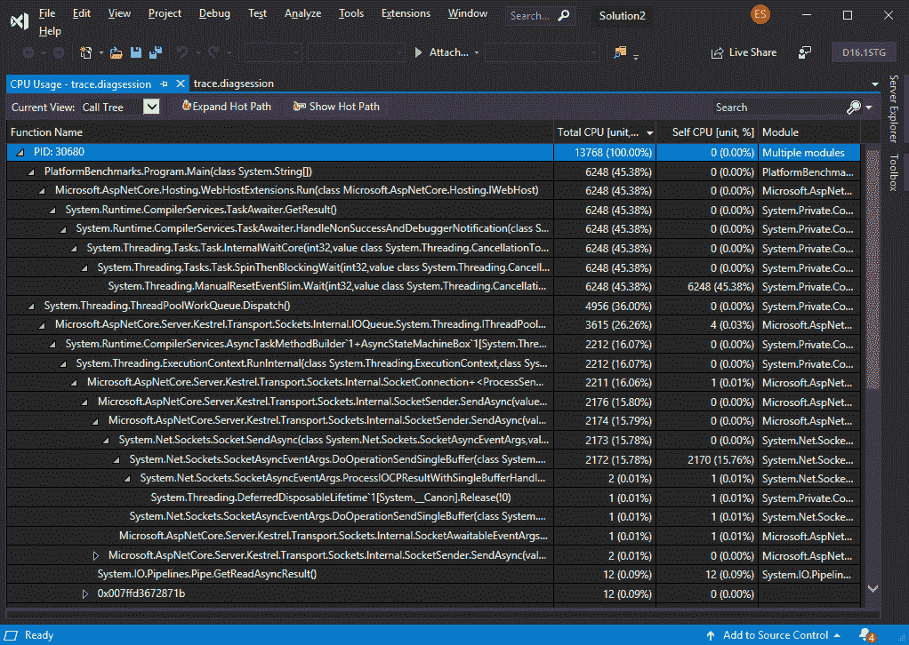
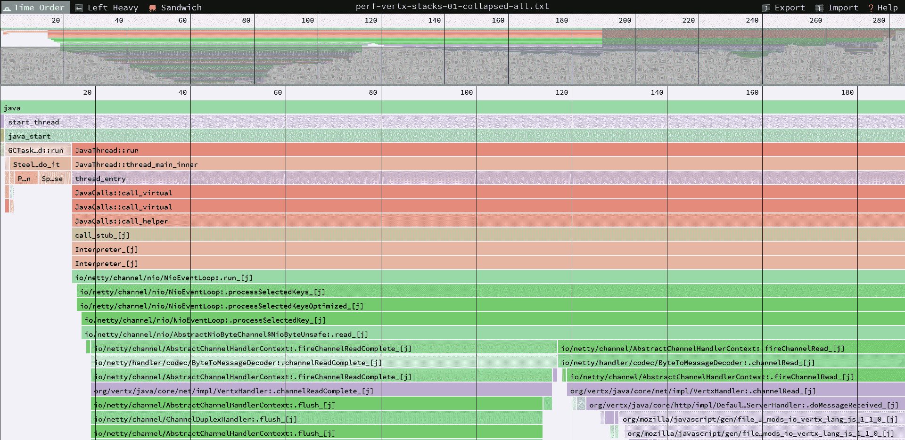
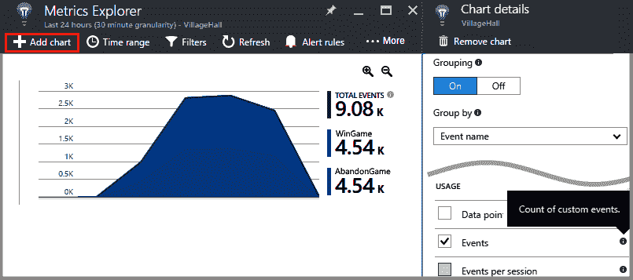
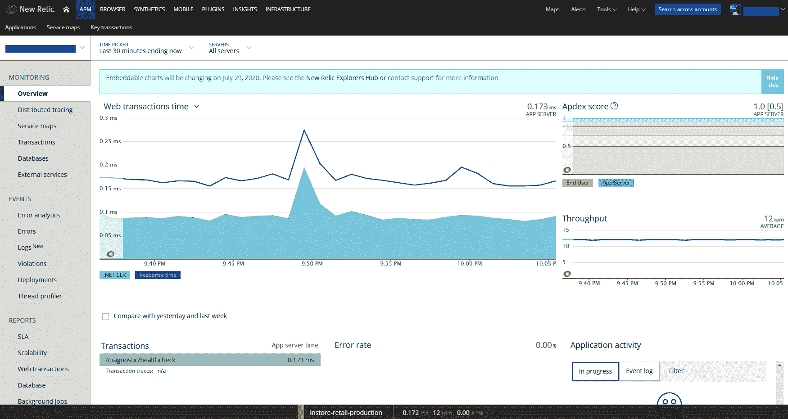

Logging, Tracing, and Diagnostics

日志记录、跟踪和度量是任何非平凡应用的基本功能，原因如下：

*   **日志记录**告诉我们系统正在做什么，它将要做什么，它遇到的错误，等等。
*   **跟踪**是关于收集关于旅程的事务信息，以及它们在分布式系统中的流动方式。
*   **指标**包括实时获取有关正在发生的事情的信息，并可能从中生成警报。

在本章中，我们将了解我们手头上的一些选项，从最简单到最复杂。

本章将介绍以下主题：

*   介绍.NET 核心通用日志框架
*   编写自定义日志中间件
*   使用跟踪和诊断
*   使用性能（事件）计数器获取指标
*   通过 Microsoft Azure AppInsights、**亚马逊网络服务**（**AWS**）CloudWatch 和 New Relic 使用遥测技术
*   执行 ASP.NET 核心运行状况检查

# 技术要求

为了实现本章介绍的示例，您需要.NET Core 3**软件开发工具包**（**SDK**和某种形式的文本编辑器。当然，VisualStudio2019（任何版本）满足所有要求，但您也可以使用 VisualStudio 代码。

要使用 Azure、AWS 或 New Relic，您需要这些提供商的工作帐户。

源代码可以在这里从 GitHub 检索：[https://github.com/PacktPublishing/Modern-Web-Development-with-ASP.NET-Core-3-Second-Edition](https://github.com/PacktPublishing/Modern-Web-Development-with-ASP.NET-Core-3-Second-Edition) 。

# 介绍.NET 核心通用日志框架

日志记录是.NETCore 的一个组成部分，它提供了几个抽象来支持它；不用说，它是完全可插拔和可扩展的。基础结构类、接口、抽象基类、枚举等包含在`Microsoft.Extensions.Logging.Abstractions`NuGet 包中，内置实现包含在`Microsoft.Extensions.Logging`包中。记录消息时，它将路由到所有已注册的日志提供程序。

在这里，我们将看到以下内容：

*   使用日志服务
*   定义日志级别
*   使用日志提供程序
*   过滤日志
*   编写自定义日志提供程序
*   使用**依赖注入****DI**与日志提供者
*   使用日志属性

我们将在接下来的章节中研究每一个问题。

## 使用日志服务

我们通过在`ConfigureServices`方法中调用`AddLogging`来注册日志服务。这实际上是通过其他方法完成的，例如`AddMvc`，因此通常不需要手动调用它，当然，如果我们不使用**模型视图控制器**（**MVC**）。不过，这样做没有害处。手动操作，可按如下方式进行：

```cs
services.AddLogging();
```

为了登录到.NET Core，您需要一个`ILogger`（或`ILogger<T>`接口的实例。您通常使用完全支持它的 DI 框架将其注入类控制器、视图组件、标记帮助器和中间件中。以下代码段对此进行了说明：

```cs
public class HomeController : Controller
{
    private readonly ILogger<HomeController> _logger;

    public HomeController(ILogger<HomeController> logger)
    {
        this._logger = logger;
    }
}
```

但您也可以通过`ILoggerFactory`方法请求接口实例，如下所示：

```cs
var logger1 = loggerFactory.CreateLogger<MyClass>();
//or
var logger2 = loggerFactory.CreateLogger("MyClass");
```

类别名称取自泛型类参数的完整类型名称。

`ILogger`接口只提供三种方法，加上一些扩展方法。以下列出了核心方法：

*   `BeginScope`：启动一个与它内部的所有日志相关的块
*   `IsEnabled`：检查是否允许记录给定的日志级别
*   `Log`：将日志消息写入特定的日志级别，带有事件 ID 和可选的格式化程序

## 定义日志级别

日志级别在`LogLevel`枚举中定义如下：

| **级别** | **数值** | **目的** |
| `Trace` | 0 | 包含最详细消息的日志。这些消息可能包含敏感的应用数据。 |
| `Debug` | 1. | 在开发过程中用于交互调查的日志。这些日志应该主要包含对调试有用的信息，并且没有长期价值。 |
| `Information` | 2. | 跟踪应用一般流程的日志。这些日志应该具有长期价值。 |
| `Warning` | 3. | 突出显示应用流中异常或意外事件，但不会导致应用执行停止的日志。 |
| `Error` | 4. | 当当前执行流由于故障而停止时突出显示的日志。这些应该指示当前活动中的故障，而不是应用范围的故障。 |
| `Critical` | 5. | 描述无法恢复的应用或系统崩溃或需要立即注意的灾难性故障的日志。 |
| `None` | 6. | 指定日志记录类别不应写入任何消息。 |

如您所见，这些日志级别具有升序数值，从最冗长且可能无趣的（调试目的除外）开始，到最严重的结束。日志框架的设计使我们能够过滤掉低于给定级别的级别，从而避免日志中不必要的混乱。为了检查给定级别是否启用，我们使用`IsEnabled`。

`Log`通用方法通常是最有趣的方法，它采用以下参数：

*   `logLevel`（`LogLevel`：所需的日志级别
*   `eventId`（`EventId`：事件 ID
*   `state`（`TState`：要记录的状态
*   `exception`（`Exception`：日志异常
*   `formatter`（`Func<TState, Exception, string>`：基于状态和可能的异常的格式化函数

每个日志条目都有以下信息：

*   日志级别
*   时间戳

*   类别
*   例外状态
*   事件 ID
*   作用域名称（如果从作用域内部调用）

当我们从`ILoggerFactory`请求 logger 实例时，`T`参数是类别名称，这通常是通过在类的构造函数中声明`ILogger<T>`实例自动完成的；它与完全限定类型名相同。

到目前为止，我们想要记录的最常见的消息类型是字符串（或异常），因此有一些扩展方法可以做到这一点，如下所示：

*   `LogTrace`
*   `LogDebug`
*   `LogInformation`
*   `LogWarning`
*   `LogError`
*   `LogCritical`

如您所见，所有这些方法都绑定到特定的日志级别，并且每个方法都有三个重载，用于获取这些参数的组合，如下所示：

*   `message`（`string`：要记录的消息，带有可选的参数占位符（例如，`{0}`、`{1}`等）
*   `parameters`（`params object []`：要记录的消息的可选参数
*   `eventId`（`EventId`：一个相关 ID
*   `exception`（`Exception`：如果存在异常，则为日志异常

三个重载中的每一个取`message`加其可选的`parameters`，另一个取`eventId`，另一个取`exception`。

*事件 ID 的用途是什么？*我听到你问。它是一个相关 ID，一个在请求中可能是唯一的标识符，它将多个日志消息关联在一起，以便分析它们的人能够发现它们是否相关。事件 ID 本质上是一个数字加上一个可选名称。如果未提供，则不使用。

作用域仅在所有日志消息中包含给定的作用域名称，直到作用域结束。由于`BeginScope`返回`IDisposable`实例，调用其`Dispose`方法结束作用域。

## 使用日志提供程序

日志提供程序是实现`ILoggerProvider`接口的类。日志提供程序需要在日志框架中注册，以便使用。通常，这可以通过`ILoggerFactory.AddProvider`方法或提供者提供的扩展方法来完成。

Microsoft 随以下提供商提供.NET Core：

| **供应商** | **NuGet 套餐** | **目的** |
| Azure 应用服务 | `Microsoft.Extensions.Logging.AzureAppServices` | 将日志记录到 Azure Blob 存储或文件系统 |
| 安慰 | `Microsoft.Extensions.Logging.Console` | 登录到控制台 |
| 调试 | `Microsoft.Extensions.Logging.Debug` | 使用`Debug.WriteLine`的日志 |
| 事件日志 | `Microsoft.Extensions.Logging.EventLog` | 记录到 Windows 事件日志 |
| 事件源 | `Microsoft.Extensions.Logging.EventSource` | Windows（**ETW**的**事件跟踪日志** |
| 痕迹资源 | `Microsoft.Extensions.Logging.TraceSource` | 使用`TraceSource`的日志 |

通常，我们在 ASP.NET Core 的`Startup`类的引导过程中注册这些提供程序，但我们也可以在`Program`类中更早注册这些提供程序；这样做的好处是可以捕捉到在`Startup`出现之前可能出现的一些早期事件。为此，我们需要在`IHostBuilder`调用中添加一个额外步骤，如以下代码片段所示：

```cs
Host
    .CreateDefaultBuilder(args)
    .ConfigureLogging(builder =>
    {
        builder
           .AddConsole()
           .AddDebug();
    })
    //rest goes here
```

从 ASP.NET Core 2 开始，在`ConfigureServices`方法中，当我们向 DI 框架注册日志提供程序时，日志机制的配置在前面完成，如以下代码片段所示：

```cs
services
    .AddLogging(options =>
    {
        options
            .AddConsole()
            .AddDebug();
    });
```

Azure App Service logging has, of course, much more to it than the other built-in providers. For a good introduction to it, outside the scope of this book, please have a look at [https://blogs.msdn.microsoft.com/webdev/2017/04/26/asp-net-core-logging](https://blogs.msdn.microsoft.com/webdev/2017/04/26/asp-net-core-logging).

还有其他几个.NET Core 提供商，包括：

| **供应商** | **NuGet 套餐** | **来源** |
| 自动气象站 | `AWS.Logger.AspNetCore` | [https://github.com/aws/aws-logging-dotnet](https://github.com/aws/aws-logging-dotnet) |
| 埃尔玛·伊奥 | `Elmah.Io.Extensions.Logging` | [https://github.com/elmahio/Elmah.Io.Extensions.Logging](https://github.com/elmahio/Elmah.Io.Extensions.Logging) |
| `Log4Net` | `log4net` | [https://github.com/apache/logging-log4net](https://github.com/apache/logging-log4net) |
| `Loggr` | `Loggr.Extensions.Logging` | [https://github.com/imobile3/Loggr.Extensions.Logging](https://github.com/imobile3/Loggr.Extensions.Logging) |
| `NLog` | `NLog` | [https://github.com/NLog](https://github.com/NLog) |
| `Serilog` | `Serilog` | [https://github.com/serilog/serilog](https://github.com/serilog/serilog) |

在这些包中，`Serilog`可以进行结构化日志记录，除了字符串之外还有其他功能。

## 过滤日志

我们可以根据以下标准限制（过滤）日志记录：

*   日志级别
*   类别名称

这意味着，对于特定的提供者，我们可以为以特定名称开头的类别记录高于或等于给定级别的所有级别的事件。

由于 ASP.NET Core 2，我们可以根据类别和日志级别配置默认全局筛选器；lambda 表达式允许我们返回一个布尔值，以指示是否应处理日志，如以下代码段所示：

```cs
services
    .AddLogging(options =>
    {
        options.AddFilter((category, logLevel) => logLevel >= 
        LogLevel.Warning);
    });
```

或者，只需按类别过滤，如本例所示，其中 lambda 仅采用类别名称：

```cs
services
    .AddLogging(options =>
    {
        options.AddFilter("Microsoft", LogLevel.Warning);
    });
```

如果我们想过滤特定提供者的日志输出，我们将其作为通用模板方法添加到`AddFilter`，如下所示：

```cs
services
    .AddLogging(options =>
    {
        options.AddFilter<ConsoleLoggerProvider>("Microsoft", 
        LogLevel.Warning);
        //or, with a lambda
        options.AddFilter<ConsoleLoggerProvider>((categoryName,
         logLevel) => true);
    });
```

也可以按提供程序、类别和日志级别执行此操作，如下所示：

```cs
services
    .AddLogging(options =>
    {
        options.AddFilter<ConsoleLoggerProvider>("System", logLevel => 
        logLevel >= LogLevel.Warning);
        //same as this
        options.AddFilter((provider, category, logLevel) =>
        {
            //you get the picture
        });
    });
```

此外，作为主机构建过程的一部分，可以在`Program`类中配置提供程序，如以下代码片段所示：

```cs
Host
    .CreateDefaultBuilder(args)
    .ConfigureLogging((hostingContext, builder) =>
    {      
        builder.AddConfiguration(hostingContext.Configuration.
        GetSection("Logging"));             
        builder.AddConsole(LogLevel.Warning);
        builder.AddDebug();
    })
    //rest goes here
```

## 编写自定义日志提供程序

ASP.NET 核心中不包含的非现成的提供程序是一个写入文件的提供程序。（有些简单）文件日志记录提供程序可能如下所示：

```cs
public sealed class FileLoggerProvider : ILoggerProvider
{
    private readonly Func<string, LogLevel, bool> _func;

    public FileLoggerProvider(Func<string, LogLevel, bool> func)
    {
        this._func = func;
    }

    public FileLoggerProvider(LogLevel minimumLogLevel) : 
        this((category, logLevel) => logLevel >= minimumLogLevel)
    {
    }

    public ILogger CreateLogger(string categoryName)
    {
        return new FileLogger(categoryName, this._func);
    }

    public void Dispose()
    {
    }
}

public sealed class FileLogger : ILogger
{
    private readonly string _categoryName;
    private readonly Func<string, LogLevel, bool> _func;

    public FileLogger(string categoryName, Func<string, LogLevel,
     bool> func)
    {
        this._categoryName = categoryName;
        this._func = func;
    }

    public IDisposable BeginScope<TState>(TState state)
    {
        return new EmptyDisposable();
    }

    public bool IsEnabled(LogLevel logLevel)
    {
        return this._func(this._categoryName, logLevel);
    }

    public void Log<TState>(
        LogLevel logLevel, 
        EventId eventId, 
        TState state, 
        Exception exception, 
        Func<TState, Exception, string> formatter)
        {
            if (this.IsEnabled(logLevel))
            {
                var now = DateTime.UtcNow;
                var today = now.ToString("yyyy-MM-dd");
                var fileName = $"{this._categoryName}_{today}.log";
                var message = formatter(state, exception);

                File.AppendAllText(fileName, $"{message}\n");
            }
    }
}

internal sealed class EmptyDisposable : IDisposable
{
    public void Dispose() { }
}

public static class LoggerFactoryExtensions
{
    public static ILoggerFactory AddFile(this ILoggerFactory 
    loggerFactory,
        Func<string, LogLevel, bool> func)
    {
        loggerFactory.AddProvider(new FileLoggerProvider(func));
        return loggerFactory;
    }

    public static ILoggerFactory AddFile(this ILoggerFactory 
    loggerFactory, LogLevel minimumLogLevel)
    {
        return AddFile(loggerFactory, (category, logLevel) => logLevel >= 
        minimumLogLevel);
    }

    public static ILoggingBuilder AddFile(this ILoggingBuilder 
    loggingBuilder, 
        Func<string, LogLevel, bool> func)
    {
        return loggingBuilder.AddProvider(new FileLoggerProvider(func));
    }

    public static ILoggingBuilder AddFile(this ILoggingBuilder 
    loggingBuilder, LogLevel minimumLogLevel)
    {
        return AddFile(loggingBuilder, (category, logLevel) =>
         logLevel >= minimumLogLevel);
    }
}
```

此示例由以下内容组成：

*   记录器工厂类`FileLoggerFactory`，负责创建实际记录器
*   `FileLogger`类，它记录到一个文件
*   用于模拟作用域的帮助器类`EmptyDisposable`
*   `LoggerFactoryExtensions`类中的一些扩展方法，可以通过`ILoggerFactory`实例或`ILoggingBuilder`实例更轻松地注册文件提供程序。

`FileLoggerFactory`类需要接受一个参数，该参数是要接受的最低日志级别，然后传递给任何创建的记录器。要创建的文件的名称格式为`{categoryName}-{yyyy-MM-dd}.log`，其中`categoryName`是传递给`CreateLogger`方法的值，`yyyy-MM-dd`是当前日期。很简单，你不觉得吗？

## 在日志提供程序中使用 DI

正如我们所看到的，我们可以将记录器或记录器工厂本身注入到我们的类中。传递记录器是目前最常见的场景，但是如果我们想要进行一些额外的配置，例如注册一个新的日志提供程序，我们也可以传递记录器工厂。

Be warned: you cannot inject an `ILogger` instance, only an `ILogger<T>` instance, where `T` is an actual type—class or struct, abstract or concrete; it doesn't matter. Since ASP.NET Core 2, you do not need to call `AddLogging` explicitly in your `ConfigureServices` method, as the logging services are automatically registered.

## 使用日志属性

在[第 7 章](07.html)*实现剃须刀页面*中解释的过滤器机制的一个有趣用途是通过过滤器属性添加日志记录。根据我们想要添加日志的位置，我们可以使用资源、结果或操作过滤器，但我将给出一个涉及操作过滤器的示例，因为这些过滤器能够检查将要传递给操作方法的模型及其调用的结果。

以下代码块显示了一个属性，当该属性应用于类或方法时，将导致发出日志消息：

```cs
[AttributeUsage(AttributeTargets.Method | AttributeTargets.Class, AllowMultiple = true, 
    Inherited = true)]
public sealed class LoggerAttribute : ActionFilterAttribute
{
    public LoggerAttribute(string logMessage)
    {
        this.LogMessage = logMessage;
    }

    public string LogMessage { get; }
    public LogLevel LogLevel { get; set; } = LogLevel.Information;

    private EventId _eventId;

    private string GetLogMessage(ModelStateDictionary modelState)
    {
        var logMessage = this.LogMessage;

        foreach (var key in modelState.Keys)
        {
            logMessage = logMessage.Replace("{" + key + "}", 
            modelState[key].RawValue?.ToString());
        }

        return logMessage;
    }

    private ILogger GetLogger(HttpContext context, 
    ControllerActionDescriptor action)
    {
        var logger = context
            .RequestServices
            .GetService(typeof(ILogger<>)
            .MakeGenericType(action.ControllerTypeInfo.
            UnderlyingSystemType)) as ILogger;
            return logger;
    }

    public override void OnActionExecuted(ActionExecutedContext context)
    {
        var cad = context.ActionDescriptor as ControllerActionDescriptor;
        var logMessage = this.GetLogMessage(context.ModelState);
        var logger = this.GetLogger(context.HttpContext, cad);
        var duration = TimeSpan.FromMilliseconds(Environment.
        TickCount - this._eventId.Id);

        logger.Log(this.LogLevel, this._eventId, 
        $"After {cad.ControllerName}.{cad.ActionName} with
        {logMessage} and result {context.HttpContext.Response.StatusCode}
        in {duration}", null, (state, ex) => state.ToString());

        base.OnActionExecuted(context);
    }

    public override void OnActionExecuting(ActionExecutingContext context)
    {
        var cad = context.ActionDescriptor as ControllerActionDescriptor;
        var logMessage = this.GetLogMessage(context.ModelState);
        var logger = this.GetLogger(context.HttpContext, cad);

        this._eventId = new EventId(Environment.TickCount, $"{cad.
        ControllerName}.{cad.ActionName}");

        logger.Log(this.LogLevel, this._eventId, $"Before {cad.
        ControllerName}.{cad.ActionName} with {logMessage}", null,
        (state, ex) => state.ToString());

        base.OnActionExecuting(context);
    }
}
```

此示例描述了可应用于方法或类的属性。它继承自`ActionFilterAttribute`，这意味着它是一个过滤器（请参见[第 10 章](10.html)、*理解过滤器*，了解过滤器的更新）。这意味着在动作执行之前（`OnActionExecuting`）和之后（`OnActionExecuted`），该属性执行一些动作。在本例中，它从 DI 检索当前控制器的记录器（如果您不使用 MVC，请对此进行调整），并向其记录一条消息。此属性需要从其构造函数中获取一个`logMessage`参数。此参数可以采用括号中的型号名称（例如，`{email}`），该名称将在日志消息中替换。它使用自系统重新启动以来经过的毫秒数（`Environment.TickCount`作为事件 ID，并使用控制器和操作名称的组合作为事件名称；此事件 ID 在事件前和事件后重复使用。在调用每个操作方法之前和之后，将使用提供的日志级别记录一条消息。下面是一个示例声明：

```cs
[Logger("Method called with {email}", LogLevel = LogLevel.Information)]
public IActionResult AddToMailingList(string email) { ... }
```

如果我们希望将自定义日志透明地添加到某些操作方法以注销模型值，这可能很方便。

现在，我们将看到另一种更高级的方法来记录所有请求。

# 编写自定义日志中间件

在上一节中，我们已经了解了如何编写自定义属性以在控制器操作之前和之后执行操作，以及在[第 1 章](01.html)中，*开始使用 ASP.NET Core，*中，我们如何编写中间件。现在，可以编写一个简单的中间件类来记录所有请求，如下所示：

```cs
public class LoggingMiddleware
{
    private readonly RequestDelegate _next;
    private readonly ILoggerFactory _loggerFactory;

    public LoggingMiddleware(RequestDelegate next, ILoggerFactory 
    loggerFactory)
    {
        this._next = next;
        this._loggerFactory = loggerFactory;
    }

    public async Task InvokeAsync(HttpContext context)
    {
        var logger = this._loggerFactory.CreateLogger<LoggingMiddleware>
        ();
        using (logger.BeginScope<LoggingMiddleware>(this))
        {
            logger.LogInformation("Before request");
            await this._next.Invoke(context);
            logger.LogInformation("After request");
        }
    }
}
```

请注意，记录器的类别设置为`LoggingMiddleware`类型的全名，我们为每个调用启动一个作用域，这里只是一个示例。注册此中间件的方法是在`Configure`中调用`UseMiddleware`，如下所示：

```cs
app.UseMiddleware<LoggingMiddleware>();
```

这会将我们的中间件添加到管道中，但我们必须确保在我们希望监视的任何其他内容之前添加它，否则我们将无法捕获它。

这就完成了关于编写日志中间件的简短部分。现在，让我们看看一些工具。

# 使用跟踪和诊断

我们在[第 5 章](05.html)、*视图*中提到了 ASP.NET Core的诊断功能。诊断与日志记录相当，但它有许多优点，如下所示：

*   追踪在更高的层次上运行，捕捉整个旅程，而不仅仅是瞬间。
*   它可以进行结构化日志记录，也就是说，它可以调用跟踪记录器中的方法，这些方法接受参数，而不仅仅是字符串。
*   插入新适配器很容易，只需向类添加一个属性；甚至可以使用引用程序集中的类。

请参考[第 5 章](05.html)、*视图*，了解更深入的解释。在这里，我们将介绍一个微软软件包`Microsoft.AspNetCore.MiddlewareAnalysis`。当使用它时，它通过诊断功能跟踪在管道上执行的所有中间件组件。通过简单调用`AddMiddlewareAnalysis`进行配置，如下所示：

```cs
services.AddMiddlewareAnalysis();
```

然后，我们注册一些新事件的侦听器，如下所示：

*   `Microsoft.AspNetCore.MiddlewareAnalysis.MiddlewareStarting`：中间件启动时调用
*   `Microsoft.AspNetCore.MiddlewareAnalysis.MiddlewareFinished`：中间件完成后调用
*   `Microsoft.AspNetCore.MiddlewareAnalysis.MiddlewareException`：执行中间件时发生异常时调用

以下是如何注册诊断源侦听器：

```cs
public void Configure(
    IApplicationBuilder app,
    IWebHostEnvironment env,
    DiagnosticListener diagnosticListener)
{
    var listener = new TraceDiagnosticListener();
    diagnosticListener.SubscribeWithAdapter(listener);

    //rest goes here
}
```

`TraceDiagnosticListener`类具有将自动连接到这些事件的方法，如以下代码块所示：

```cs
public class TraceDiagnosticListener
{
    [DiagnosticName("Microsoft.AspNetCore.MiddlewareAnalysis.
    MiddlewareStarting")]
    public virtual void OnMiddlewareStarting(HttpContext
    httpContext, string name)
    {
        //called when the middleware is starting
    }

    [DiagnosticName("Microsoft.AspNetCore.MiddlewareAnalysis.
    MiddlewareException")]
    public virtual void OnMiddlewareException(Exception exception,
     string name)
    {
        //called when there is an exception while processing
        //a middleware component
    }

    [DiagnosticName("Microsoft.AspNetCore.MiddlewareAnalysis.
    MiddlewareFinished")]
    public virtual void OnMiddlewareFinished(HttpContext
     httpContext, string name)
    {
        //called when the middleware execution finishes
    }
}
```

请注意，这两个中间件类（请参阅[第 1 章](01.html)、*ASP.NET 核心入门*）或作为自定义委托添加到管道中的中间件都会调用。代码显示在以下代码段中：

```cs
app.Properties["analysis.NextMiddlewareName"] = "MyCustomMiddleware";
app.Use(async (context, next) =>
{
    //do something
    await next();
});
```

注意我们设置`analysis.NextMiddlewareName`属性的那一行，因为这个中间件没有名称，它是一个匿名委托；该属性用于`TraceDiagnosticListener`类的每个方法的`name`参数。

如果您想直观地分析所有这些活动，可以添加另一个 Microsoft 软件包`Microsoft.AspNetCore.Diagnostics.Elm`。**ELM**代表**错误记录中间件**，通常先通过注册服务（`ConfigureServices`方法）添加，如下图：

```cs
services.AddElm();
```

然后，将中间件添加到管道中（`Configure`，如下所示：

```cs
app.UseElmPage();
app.UseElmCapture();
```

通过检查当前环境并有条件地添加此中间件，您可能希望添加这些只是为了开发。完成后，当您访问`/elm`时，您将得到一个很好的跟踪，如以下屏幕截图所示：


您可以看到处理请求时发生的所有事件。所有这些都来自诊断功能。

还有最后一步：您必须启用同步**输入/输出**（**I/O**），因为 ELM 使用它。在`Program`类中，将以下内容添加到`ConfigureWebHostDefaults`方法中：

```cs
.ConfigureWebHostDefaults(builder =>
{
 builder.UseKestrel(options =>
    {
        options.AllowSynchronousIO = true;
    });
    builder.UseStartup<Startup>();
});
```

如果您想设置 ELM 使用的**统一资源定位器**（**URL**），或者过滤结果，您当然可以这样做，如下所示：

```cs
services.Configure<ElmOptions>(options =>
{
    options.Path = "/_Elm";
    options.Filter = (name, logLevel) =>
    {
        return logLevel > LogLevel.Information;
    };
});
```

此小代码片段设置 ELM 的配置，如下所示：

*   请求路径设置为`/_Elm`（必须以`/`开头）。
*   仅显示日志级别高于`Information`的事件。

现在，我们将了解一个非常重要的功能，该功能自 Windows 诞生之初就存在，现在可供.NET Core 使用：事件计数器。

# 使用性能（事件）计数器获取指标

性能（事件）计数器自 Windows 诞生以来就存在，但它们没有以相同的方式在其他操作系统中实现，这使得它们无法跨平台。其思想是，应用发出轻量级、不引人注目的代码，由操作系统拾取，可用于在应用工作时实时监控应用，或生成转储文件进行事后分析。

.NET Core 3.0 通过引入`dotnet-trace`、`dotnet-dump`和`dotnet-counters`跨平台全局工具，开始全面支持事件计数器。我们将在下面几节中了解这些功能。

## 包括柜台

事件计数器是为命名计数器发出值的类。NET 包括以下计数器，分为两个提供程序：

*   `System.Runtime (default)`
*   `Microsoft.AspNetCore.Hosting`

每个提供程序中的可用计数器如下所示：

| **系统运行时** |
| `cpu-usage` | 进程使用**中央处理****单元**（**CPU**）的时间量（毫秒）（平均值） |
| `working-set` | 进程使用的工作集数量（MB）（平均值） |
| `gc-heap-size` | **垃圾收集器**（**GC**）报告的总堆大小（MB）（平均值） |
| `gen-0-gc-count` | 第 0 代 GCs/秒的数量（总和） |
| `gen-1-gc-count` | 第 1 代地面军事系统/秒的数量（总和） |
| `gen-2-gc-count` | 第 2 代地面军事系统/秒的数量（总和） |
| `time-in-gc` | %自上次 GC 以来的 GC 时间（平均值） |
| `gen-0-size` | 第 0 代堆大小（平均值） |
| `gen-1-size` | 第 1 代堆大小（平均值） |
| `gen-2-size` | 第 2 代堆大小（平均值） |
| `loh-size` | **大对象堆**（**LOH**）堆大小（平均值） |
| `alloc-rate` | 分配率（总和） |
| `assembly-count` | 加载的程序集数（平均值） |
| `exception-count` | 每秒异常数（总和） |
| `threadpool-thread-count` | `ThreadPool`螺纹数（平均值） |
| `monitor-lock-contention-count` | 监视器锁争用计数 |
| `threadpool-queue-length` | `ThreadPool`工作项队列长度（平均值） |
| `threadpool-completed-items-count` | `ThreadPool`已完成工作项的计数 |
| `active-timer-count` | 活动计时器计数 |
| **Microsoft.AspNetCore.Hosting** |
| `requests-per-second` | 请求率（平均值） |
| `total-requests` | 请求总数（总和） |
| `current-requests` | 当前请求数（总和） |
| `failed-requests` | 失败的请求数（总和） |

`System.Runtime`提供程序包含独立于应用 web、控制台、服务等类型的计数器。当然，`Microsoft.AspNetCore.Hosting`只包含特定于 web 的计数器。

您可以想象，通过监视这些计数器，我们可以从系统的角度很好地了解 ASP.NET 核心应用内部的情况。在接下来的部分中，我们将看到如何做到这一点。

## 海关柜台

我们可以编写代码来创建自己的计数器。以下是一个例子：

```cs
[EventSource(Name = SourceName)]
public sealed class LogElapsedUrlEventSource : EventSource
{
    private readonly EventCounter _counter;

    public static readonly LogElapsedUrlEventSource Instance = new LogElapsedUrlEventSource();

    private const int SourceId = 1;
    private const string SourceName = "LogElapsedUrl";

    private LogElapsedUrlEventSource() : base(EventSourceSettings.
    EtwSelfDescribingEventFormat)
    {
        this._counter = new EventCounter(SourceName, this);
    }

    [Event(SourceId, Message = "Elapsed Time for URL {0}: {1}",
     Level = EventLevel.Informational)]
    public void LogElapsed(string url, float time)
    {
        this.WriteEvent(SourceId, url, time);
        this._counter.WriteMetric(time);
    }
}
```

您需要添加`System.Diagnostics.PerformanceCounter`NuGet 包才能编译此文件。

此示例代码记录打开任意 URL 所花费的时间。它将 URL 作为参数，`time`作为浮点值。它本质上是一个单例，因为它有一个私有构造函数，只能通过其公共静态`Instance`字段访问。`LogElapsed`方法同时写入基础`EventCounter`实例（可接受任意数量的参数）和基础`EventSource`类（仅接受数值）。最后，对于性能计数器，使用的是数值。

要使用此示例，我们将执行以下操作：

```cs
LogElapsedUrlEventSource.Instance.LogElapsed("http://google.com", 0.1F);
```

这引用了我们新创建的事件源的单个实例，并为`http://google.com`URL 记录了一个`0.1`值。它将被写入下面的事件计数器。

## 性能监测

Windows 有一个名为**PerfView**（[的免费工具 https://github.com/microsoft/perfview](https://github.com/microsoft/perfview) ），可用于可视化性能计数器，但不幸的是，它不是跨平台的。相反，我们需要另一种解决方案。让我们安装`dotnet-counters`全局工具。为此，请运行以下命令：

```cs
dotnet tool install -g dotnet-counters
```

安装`dotnet-counters`工具后（根据此命令，在全局范围内），我们现在可以使用它监视现有的应用。首先，让我们看看那些可以监控的（运行.NET 核心应用），如下所示：

```cs
dotnet-counters ps
```

这将提供正在运行的.NET 核心应用的进程 ID 列表，无论它们是什么。找到感兴趣的对象后，将其输入工具，如下所示：

```cs
dotnet-counters monitor -p 3527
```

如果在进程 ID 之后未指定提供者名称，则默认为`System.Runtime`。你应该得到这样的东西：


例如，如果您想监视我们的示例计数器，您可以运行以下代码：

```cs
dotnet-counters monitor -p 3527 LogElapsedUrl
```

`dotnet-counters`工具将持续更新，直到您退出它（*Ctrl*+*C*）。

For additional information on `dotnet-counters` and real-time performance monitoring of .NET Core apps, please refer to [https://github.com/dotnet/diagnostics/blob/master/documentation/dotnet-couunters-instructions.md](https://github.com/dotnet/diagnostics/blob/master/documentation/dotnet-counters-instructions.md). The documentation is available at [https://docs.microsoft.com/dotnet/core/diagnostics/dotnet-counters](https://docs.microsoft.com/en-us/dotnet/core/diagnostics/dotnet-counters).

在这里，我们看到了如何在控制台中实时监控事件。现在，让我们看看如何将它们收集到一个文件中。

## 追踪

与.NET Core 3 一起引入的另一个工具是`dotnet-trace`。它与`dotnet-counter`类似，但不是将当前事件计数器值输出到控制台，而是将其写入跟踪文件。这样做的好处是可以在以后读取它，以便从中提取运行时信息，包括它与有意义的事件（上下文信息）的关联。它也可以在后台运行，不需要有人观看控制台。

要安装此跟踪，请使用以下命令：

```cs
dotnet tool install -g dotnet-trace
```

与`dotnet-counters`类似，`dotnet-trace`可以检测系统上运行的.NET 核心进程，还需要连接到一个进程，如下所示：

```cs
dotnet-trace collect -p 3527
```

现在，在进程 ID 之后，`dotnet-trace` 命令可以采用**跟踪配置文件**的名称。默认情况下，定义的跟踪配置文件包括许多事件计数器，但您也可以定义自己的事件计数器。包括以下供应商：

*   **Microsoft Windows DotNETRuntime**（默认）
*   **微软 DotNETCore 采样档案器**

I won't go into the details of creating trace profiles, as this is a complex topic.

要为`Microsoft-Windows-DotNETRuntime`概要文件创建跟踪文件，我们运行以下命令：

```cs
dotnet-trace collect -p 3527 --providers Microsoft-Windows-DotNETRuntime
```

这将导致如下结果：


除了配置文件（包括性能计数器以外的许多信息项）之外，您还可以通过指定提供程序名称作为跟踪配置文件来请求各个性能计数器提供程序，如下所示：

```cs
dotnet-trace collect -p 3527 --providers System.Runtime:0:1:EventCounterIntervalSec=1
```

在这种情况下，`dotnet-trace`将每秒输出属于`System.Runtime`提供程序的所有计数器的性能计数器值。

跟踪文件具有`trace.nettrace`名称，默认情况下，在运行`dotnet-trace`命令的同一文件夹中创建。要查看这些文件，我们有两个选项。

在 Windows 系统上，我们可以使用 Visual Studio，如以下屏幕截图所示：



对于 PerfView，我们可以使用以下内容：


对于支持.NET Core（Linux 和 macOS）的非 Windows 系统，目前还没有用于读取跟踪文件的本机解决方案，但一个可能的替代方案是免费的**Speedscope**站点（[http://speedscope.app](http://speedscope.app) ）。但是，为了使用它，我们必须通过运行以下代码告诉`dotnet-trace`以适当的格式生成跟踪文件：

```cs
dotnet-trace collect -p 3527 --providers Microsoft-Windows-DotNETRuntime --format speedscope
```

或者，如果我们有一个`.nettrace`格式的文件，我们可以随后将其转换，以便将其传递给 Speedscope 应用。为此，您需要运行以下代码：

```cs
dotnet-trace convert trace.nettrace --format speedscope 
```

输出文件将被称为`trace.speedscope.json`，如以下屏幕截图所示：



For additional information on `dotnet-trace` and the tracing of .NET Core apps, please refer to [https://github.com/dotnet/diagnostics/blob/master/documentation/dotnet-trace-instructions.md](https://github.com/dotnet/diagnostics/blob/master/documentation/dotnet-trace-instructions.md). The documentation is available at [https://docs.microsoft.com/dotnet/core/diagnostics/dotnet-trace](https://docs.microsoft.com/en-us/dotnet/core/diagnostics/dotnet-trace).

我们现在来看另一个工具，但这一次，一个用于更高级用户的工具。

## 跟踪转储

.NET Core 3 提供的第三个工具是`dotnet-dump`。这一个更适合高级用户，因为它需要深入了解**IL**（代表**中间语言**）和.NET 自己的汇编语言。简而言之，它可以收集正在运行的.NET 核心进程的内存转储并将其写入磁盘，以便脱机分析。这可能有助于发现应用在内存使用方面的行为。

`dotnet-dump` only works on Windows and Linux, not macOS, for generating dumps.

要安装它，请运行以下命令：

```cs
dotnet tool install -g dotnet-dump
```

与之前的工具不同，它不能列出正在运行的进程，因此，如果您需要此功能，则需要依赖于`dotnet-counters`或`dotnet-trace`。找到所需的后，要求它创建进程当前运行状态的转储，如下所示：

```cs
dotnet-dump collect -p 3527
```

转储文件将在同一文件夹上创建，并命名为`core_YYYYMMDD_hhmmss`。

生成转储文件后，还可以使用`dotnet-dump`进行分析，如下图所示：

```cs
dotnet-dump analyze core_20191103_234821
```

这将启动一个交互式 shell（在支持它的操作系统中），该 shell 允许对转储进行探索，并允许运行**Strike 之子**（**SOS**）命令（[https://docs.microsoft.com/dotnet/core/diagnostics/dotnet-dump#analyze-sos 命令](https://docs.microsoft.com/en-us/dotnet/core/diagnostics/dotnet-dump#analyze-sos-commands)。

`dotnet-dump` only allows dumps to be analyzed on Linux. For additional information on `dotnet-dump`, please refer to [https://github.com/dotnet/diagnostics/blob/master/documentation/dotnet-dump-instructions.md](https://github.com/dotnet/diagnostics/blob/master/documentation/dotnet-dump-instructions.md). The documentation is available at [https://docs.microsoft.com/dotnet/core/diagnostics/dotnet-dump](https://docs.microsoft.com/en-us/dotnet/core/diagnostics/dotnet-dump).

现在让我们离开控制台，探索一下远程监控应用的一些选项。

# 使用遥测

遥测技术包括通过互联网从软件中透明地收集使用数据。它非常有用，因为您的所有应用都是集中监控的，遥测软件包通常提供方便的工具，例如丰富的用户界面，用于选择我们想要看到的内容或创建警报。这里有一些替代方案，我们将在下面的部分中只讨论几个最流行的方案。

## 使用跟踪标识符

ASP.NET Core 提供了一个`IHttpRequestIdentifierFeature`功能，可为每个请求生成唯一的 ID。此 ID 可以帮助您关联在请求上下文中发生的事件。以下是获取此 ID 的三种方法：

```cs
//using the TraceIdentifier property in ASP.NET Core 2.x
var id1 = this.HttpContext.TraceIdentifier;

//accessing the feature in earlier versions of ASP.NET Core
var id2 = this.HttpContext.Features.Get<IHttpRequestIdentifierFeature>().TraceIdentifier;

//another way
var id3 = Activity.Current.Id;
```

跟踪标识符只是一个不透明的引用，如`0HL8VHQLUJ7CM:00000001`——保证在请求中是唯一的。有趣的是，这实现了**跟踪上下文****万维网联盟****m**（**W3C**）规范（[https://www.w3.org/TR/trace-context](https://www.w3.org/TR/trace-context) ），这意味着 ASP.NET Core 3 尊重`Request-Id`HTTP 头。这是映射到这些属性的值。

确保使用以下行启用标准 W3C 格式，在应用的开头，可能在`Main`或`Startup`中：

```cs
Activity.DefaultIdFormat = ActivityIdFormat.W3C;
Activity.ForceDefaultIdFormat = true;
```

现在，每当您向某个微服务发出 HTTP 请求时，请确保包含此跟踪标识符。例如，如果您正在使用`HttpClient`，则可以使用`DelegatingHandler`，如下代码块所示：

```cs
public class TraceIdentifierMessageHandler : DelegatingHandler
{
    private readonly IHttpContextAccessor _httpContextAccessor;

    public TraceIdentifierMessageHandler(IHttpContextAccessor 
    httpContextAccessor)
    {
        this._httpContextAccessor = httpContextAccessor;
    }

    protected override Task<HttpResponseMessage> SendAsync(
        HttpRequestMessage request, CancellationToken cancellationToken)
    {
        var httpContext = this._httpContextAccessor.HttpContext;
        request.Headers.Add("Request-Id", httpContext.TraceIdentifier);
        request.Headers.Add("X-SessionId", httpContext.Session.Id);

        return base.SendAsync(request, cancellationToken);
    }
}
```

调用委托处理程序来处理消息的发送，在本例中，它用于设置头-`Request-Id`。它从注入构造函数的`IHttpContextAccessor`服务中获得的上下文中获取此头。

我们注册一个或多个`HttpClient`实例，我们将在`ConfigureServices`方法中调用的每个微服务一个实例，如下所示：

```cs
//this is required for the TraceIdentifierMessageHandler
services.AddHttpContextAccessor();

services
    .AddHttpClient("<service1>", options =>
    {
        options.BaseAddress = new Uri("<url1>");
    })
    .AddHttpMessageHandler<TraceIdentifierMessageHandler>();
```

当然，您需要用适当的值替换`<service1>`和`<url1>`。

当您想要获取`HttpClient`的实例向该微服务发送消息时，注入`IHttpClientFactory`实例并请求您注册客户端时使用的名称，如下代码块所示：

```cs
public class HomeController : Controller
{
    private readonly IHttpClientFactory _clientFactory;

    public HomeController(IHttpClientFactory clientFactory)
    {
        this._clientFactory = clientFactory;
    }

    public async Task<IActionResult> Index()
    {
        var client = clientFactory.CreateClient("<service1>");
        var result = await client.GetAsync("GetData");

        //do something with the response

        return this.Ok();
    }
}
```

使用这种方法，我们可以确保在所有请求上都保持相同的跟踪标识符，这是在创建上下文。这对于维护状态非常重要，我将在下面介绍的日志框架中使用它。

## Azure 应用洞察

当您使用 Visual Studio 创建 ASP.NET 项目时，您将看到添加对**应用洞察**（**AI**的支持的选项。AI 是一种 Azure 服务，可用于监视 web 应用的可用性、性能和使用情况，包括错误。当您向 web 应用添加对 AI 的支持时，您可以转到 AI 控制台，实时监控应用的行为，查看其最近的行为，甚至在发生异常情况时获得通知。

这里我们不会全面介绍人工智能，但只会概述如何在 ASP.NET 核心项目中使用人工智能。

以下屏幕截图显示了典型的组合视图，显示了响应和页面加载时间：


在使用 AI 之前，您需要有一个可用的 Azure 帐户（[https://portal.azure.com](https://portal.azure.com) 并且您需要创建一个 AI 资源。

您可以从 Visual Studio 内部创建一个，如以下屏幕截图所示：


详细说明请参考[https://github.com/Microsoft/ApplicationInsights-aspnetcore/wiki/Getting-Started-with-Application-Insights-for-ASP.NET-Core](https://github.com/Microsoft/ApplicationInsights-aspnetcore/wiki/Getting-Started-with-Application-Insights-for-ASP.NET-Core) 。AI 依赖于`Microsoft.ApplicationInsights.AspNetCore`NuGet 包，创建 AI 资源后，您需要使用 AI 控制台中提供给您的检测密钥添加配置设置。如果您使用**JavaScript 对象表示法**（**JSON**）配置文件，您将需要如下内容：

```cs
{
  "ApplicationInsights": {
    "InstrumentationKey": "11111111-2222-3333-4444-555555555555"    
  }
}
```

在任何情况下，您都需要直接从配置中注册 AI 服务，如下所示：

```cs
services.AddApplicationInsightsTelemetry(this.Configuration);
```

或者，您可以直接传递检测键，如下所示：

```cs
services.AddApplicationInsightsTelemetry(
    instrumentationKey: "11111111-2222-3333-4444-555555555555");
```

对于更高级的选项，您可以传入一个`ApplicationInsightsServiceOptions`实例，如以下代码段所示：

```cs
services.AddApplicationInsightsTelemetry(new ApplicationInsightsServiceOptions
{
    InstrumentationKey = "11111111-2222-3333-4444-555555555555",
    DeveloperMode = true,
    EnableDebugLogger = true
});
```

在开发模式下运行时，使用 AI 的开发者模式通常很有用，因为您可以立即看到结果（而不是成批）。

您不需要显式启用异常和请求遥测；因为这是自动完成的，`_ViewImports.cshtml`的代码如下：

```cs
@using Microsoft.ApplicationInsights.AspNetCore
@inject JavaScriptSnippet snippet
```

在布局视图（可能是`_Layout.cshtml`）中，我们必须使用以下代码行呈现脚本：

```cs
@Html.Raw(snippet.FullScript)
```

这说明了如何启用 AI 功能，但下一个主题将展示如何向其发送实际事件。

### 发送自定义事件

您可以使用`TelemetryClient`**应用编程接口**（**API**发送自定义数据。基本上，您构建了一个`TelemetryClient`实例，如下所示：

```cs
var client = new TelemetryClient();
client.InstrumentationKey = this.Configuration["ApplicationInsights:InstrumentationKey"];
```

您有以下方法，取自文档（[https://docs.microsoft.com/azure/application-insights/app-insights-api-custom-events-metrics](https://docs.microsoft.com/en-us/azure/application-insights/app-insights-api-custom-events-metrics) ：

*   `TrackPageView`：页数
*   `TrackEvent`：用户操作和自定义事件
*   `TrackMetric`：绩效衡量
*   `TrackException`：例外情况
*   `TrackRequest`：性能分析服务器请求的频率和持续时间
*   `TrackTrace`：诊断日志消息
*   `TrackDependency`：您的应用所依赖的外部组件调用的持续时间和频率

您可以调用前面列表中提到的`Track`方法之一。现在，让我们从`TrackEvent`开始，如下所示：

```cs
client.TrackEvent("Product added to basket");
```

您还可以为单个值调用特定度量，如下所示：

```cs
client.TrackMetric("TotalCost", 100.0);
```

您可以请求信息，如下所示：

```cs
var now = DateTimeOffset.Now;
var timer = Stopwatch.StartNew();
//issue call
client.TrackRequest("Searching for product", now, timer.Elapsed, "OK", true);
```

要发送异常，请执行以下代码：

```cs
client.TrackException(ex);
```

要在经过的时间（类似于请求跟踪）发送依赖项（非我们自己的任何调用代码），请执行以下代码：

```cs
var success = false;
var startTime = DateTime.UtcNow;
var timer = Stopwatch.StartNew();
var id = Guid.NewGuid();

try
{
    success = orderService.ProcessOrder();
}
finally
{
    timer.Stop();
    telemetry.TrackDependency("Order Service", $"Order id {id}", startTime, timer.Elapsed, success);
}
```

要发送自定义跟踪消息，请执行以下代码：

```cs
client.TrackTrace("Processing order", SeverityLevel.Warning, new Dictionary<string,string> { {"Order", id} });
```

对于页面视图，执行以下代码：

```cs
client.TrackPageView("ShoppingBag");
```

您还可以将范围内的几个相关事件组合在一起，如下所示：

```cs
using (var operation = telemetry.StartOperation<RequestTelemetry>("Order Processing"))
{
    //one or more of Track* methods
}
```

因为 AI 会批量发送数据，所以在任何时候，您都可以通过运行以下命令强制将其刷新到 Azure：

```cs
client.Flush();
```

所有这些事件都将在 AI 控制台中可用，如以下屏幕截图所示：



AppInsights 仪表板可以显示不同的事件可视化（例如，按名称分组事件），如以下屏幕截图所示：


AI 可以使用前面讨论过的跟踪标识符跟踪分布式调用。

在下一节中，我将介绍另一个主要云提供商的日志服务：AWS CloudWatch。

## AWS 云表

AWS CloudWatch 是一种 AWS 应用和基础架构监控服务。它允许您将半结构化内容写入日志，然后可以在线查询和监视日志。

为了从.NET 核心应用写入，您需要添加对`AWSSDK.Core`和`AWSSDK.CloudWatch`NuGet 包的引用。不需要添加自定义日志框架；内置的日志记录就可以了。使用需要的应用配置在`ConfigureServices`中注册其服务，以便我们可以注入服务。这可以通过运行以下代码来完成：

```cs
services.AddDefaultAWSOptions(this.Configuration.GetAWSOptions());
services.AddAWSService<IAmazonCloudWatch>();
```

`GetAWSOptions`扩展名从`appsettings.json`文件中可能提供的配置中返回所需的条目。这些应该如下所示：

```cs
{
    "AWS": {
        "Profile": "local-profile",
        "Region": "eu-west-1"
    }
}
```

当然，您将分别替换`local-profile`和`eu-west-1`，替换 AWS 配置文件中的配置文件名称和要使用的区域名称，该区域应是距离您所在位置最近的区域。

您还需要启用到控制台的日志记录。添加`Microsoft.Extensions.Logging.Console`NuGet 包（如果您还没有），并运行以下代码：

```cs
services.AddLogging(options =>
{
    options.AddConsole();
});
```

一旦 AWS 服务注册，只要您登录到控制台，您也将登录到 AWS CloudWatch。

以下是来自 AWS 站点的 AWS CloudWatch 日志示例：


在下一节中，我将介绍一种非常流行的商业工具，用于实时监控 web 应用，它可以应用于任何站点，甚至是云端托管的站点。

## 新遗迹

New Relic 是一款软件分析产品，用于监控 web 应用的应用性能。它提供有关 web 应用行为的实时数据，如同时用户数、内存使用和错误。您需要在部署计算机上安装 New Relic 代理，无论是 Windows 还是 Linux。

Please follow the instructions available at [https://docs.newrelic.com/docs/agents/net-agent/installation/introduction-net-agent-install](https://docs.newrelic.com/docs/agents/net-agent/installation/introduction-net-agent-install) to set up the New Relic agent on your platform of choice.

安装后，New Relic 会截获并检测您的.NET Core在计算机上的调用，并向其添加遥测功能。New Relic 还可以安装在 Docker 上，这使得它非常适合于自包含的自动化部署。

所有生成的调用都可以在 NewRelic 控制台上使用，如 NewRelic 站点的以下屏幕截图所示：



请注意，《新文物》是非常强大的，我甚至不敢看它，因为这需要一本书。请一定去看看这个新遗址，看看它是否适合你的需要。

接下来，我们将看一看 ASP.NET 核心新增的用于监视应用内服务状态的功能。

# 进行健康检查

微软一直在开发一个名为`Microsoft.AspNetCore.Diagnostics.HealthChecks`的健康检查框架，并将其作为 ASP.NET Core 2.2 的一部分发布。它提供了一种标准的可插拔方式来检查应用所依赖的服务状态。这不是 ASP.NET 本身的一项功能，但由于任何复杂的 web 应用通常都有外部依赖项，因此在采取任何操作之前检查其状态可能很方便。

在添加核心 NuGet 包之后，您将需要添加您感兴趣的检查，例如 SQL Server 的检查。我们在`ConfigureServices`方法中注册了以下内容：

```cs
services
    .AddHealthChecks()
    .AddCheck("Web Check", new WebHealthCheck("http://
     google.com"), HealthStatus.Unhealthy)
    .AddCheck("Sample Lambda", () => HealthCheckResult.Healthy
    ("All is well!"))
    .AddDbContextCheck<MyDbContext>("My Context"); //check
                                        //a database through EF Core
```

在本例中，我们登记了三张支票，如下所示：

*   一个自定义检查类`WebHealthCheck`，它实现了`IHealthCheck`接口
*   基于 lambda 的检查
*   使用**实体框架**（**EF**核心上下文检查数据库访问权限的检查

对于 EF 核心检查，您需要添加对`Microsoft.Extensions.Diagnostics.HealthChecks`的`.EntityFrameworkCore`NuGet 包的引用。

`WebHealthCheck`类看起来像这样：

```cs
public class WebHealthCheck : IHealthCheck
{
    public WebHealthCheck(string url)
    {
        if (string.IsNullOrWhiteSpace(url))
        {
            throw new ArgumentNullException(nameof(url));
        }

        this.Url = url;
    }

    public string Url { get; }

    public async Task<HealthCheckResult> CheckHealthAsync(
        HealthCheckContext context, 
        CancellationToken cancellationToken = default(CancellationToken))
    {
        var client = new HttpClient();
        var response = await client.GetAsync(this.Url);

        if (response.StatusCode < HttpStatusCode.BadRequest)
        {
            return HealthCheckResult.Healthy("The URL is up and running");
        }

        return HealthCheckResult.Unhealthy("The URL is inaccessible");
    }
}
```

此类针对提供的 URL 发出 HTTP 请求，并根据 HTTP 响应状态代码返回`Healthy`或`Unhealthy`。

在`Configure`上，我们注册了一个端点以监控这些检查，如下所示：

```cs
app.UseRouting();
app.UseEndpoints(endpoints =>
{
    endpoints
        .MapHealthChecks("/health")
        .RequireHost("localhost")
        .RequireAuthorization();
});
```

注意对`MapHealthChecks`的调用，端点名称为`/health`。

然后我们可以将一个`IHealthCheckService`实例注入到我们的类中，看看是否所有内容都是`OK`，如下所示：

```cs
var timedTokenSource = new CancellationTokenSource(TimeSpan.FromSeconds(3));
var checkResult = await _healthCheck.CheckHealthAsync(timedTokenSource.Token);

if (checkResult.CheckStatus != CheckStatus.Healthy)
{
    //Houston, we have a problem!
}
```

检查所有已注册健康检查的状态时，此代码最多等待 3 秒钟。结果可能是以下情况之一：

*   `Unknown`：状态未知，可能是超时。
*   `Unhealthy`：至少有一项服务不正常。
*   `Healthy`：一切似乎都很好。
*   `Warning`：一切正常，但有很多警告。

现在，健康检查框架启用了一个端点，您可以从中找到所有检查的全局状态；如前所述，我们将其设置为`/health`。如果我们使用浏览器访问它，就会得到其中一个值。

但是，如果我们希望获得已执行的所有检查的详细信息及其状态，我们可以将端点的注册码修改为如下内容：

```cs
endpoints
    .MapHealthChecks("/health", new HealthCheckOptions
 {
 ResponseWriter = async (context, report) =>
 {
 var result = JsonSerializer.Serialize(new
 {
 Status = report.Status.ToString(),
 Checks = report.Entries.Select(e => new
 {
 Check = e.Key,
 Status = e.Value.Status.ToString()
 })
 });
 context.Response.ContentType = MediaTypeNames.Application.Json;
 await context.Response.WriteAsync(result);
 }
    });
```

这样，我们将发送一个 JSON 响应，其中包含除全局状态之外的所有单个检查的状态，如以下代码片段所示：

```cs
{"Status":"Healthy","Checks":[{"Check":"Web Check","Status":"Healthy"},{"Check":"Sample Lambda","Status":"Healthy"},{"Check":"My Context","Status":"Healthy"}]}
```

在本章中，我们介绍了 ASP.NET Core的新运行状况检查功能。它是一个可插拔的系统，允许您编写自己的健康检查，并从一个集中的端点进行检查。它是检查 web 应用状态的宝贵资产，我希望它有用！

# 总结

本章从通用日志开始，它是.NET Core中的必备功能。该基础设施虽然有限，但不支持结构化的即时登录。例如，它是内置的、可插入的和 DI 友好的。将其用于最常见的日志记录用途。请浏览所有可用的日志记录提供程序，查看是否有一个符合您的要求。特殊的主机提供商，如 Azure 或 AWS，提供自己的软件包，您应该利用这些软件包获得最佳效果。

接下来，我们看到诊断跟踪提供了一个优势，您可以使用离散参数调用方法，这是一个优势，因为它可以生成更有意义的日志。您可以使用它精确地查看正在执行的中间件以及每个步骤所需的时间。

显示的其他选项（添加中间件或操作过滤器）也可能值得探索，尤其是操作过滤器。

然后，我们看到遥测技术对于全天候工作的企业应用至关重要，因为它为您提供了在长时间内的行为概述，并且您可以设置警报以响应紧急情况。

最后，我们还查看了 ASP.NET Core 中可用的不同日志记录和诊断选项，以帮助我们对问题进行排序。

在下一章中，我们将看到如何对前面章节中讨论的所有特性执行单元测试。

# 问题

您现在应该能够回答以下问题：

1.  什么是事件计数器？
2.  遥测的好处是什么？
3.  我们如何过滤日志记录？
4.  什么是健康检查？
5.  中间件在日志记录中是如何有用的？
6.  什么是榆树？
7.  与普通日志相比，诊断有哪些好处？