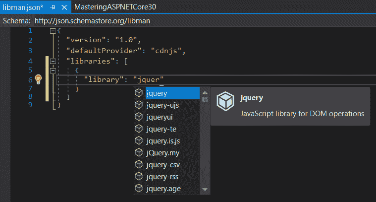
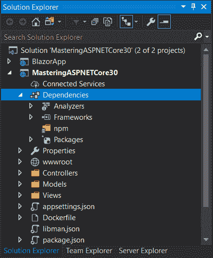

Client-Side Development

尽管这本书是关于 ASP.NETCore 的，这是一个服务器端开发框架，但如今，没有客户端技术几乎什么也做不到。幸运的是，ASP.NET 核心还包括许多**应用程序编程接口**（**API**）和库，可以帮助我们使用第三方客户端库构建现代应用程序。这些应用程序包括**单页应用程序**（**SPA**），与需要从一个页面导航到另一个页面的旧式网站相比，这些应用程序提供了更加友好的用户体验。还有 TypeScript，一个 JavaScript 超集，可用于构建强类型、面向对象的代码，非常类似于用 C#编写的代码。

Visual Studio 还包括一些使我们的生活更轻松的功能，ASP.NET Core 引入了与 Node.js 的互操作性，这在以前是不可能的，包括用于**节点包管理器**（**npm**的内置包管理器）。例如，这包括从.NET 代码运行 npm 脚本的能力。

本章将介绍以下主题：

*   介绍客户端开发
*   使用**图书馆管理员**（**利伯曼**）
*   使用 Node.js
*   使用打字脚本

# 技术要求

为了实现本章介绍的示例，您需要.NET Core 3**软件开发工具包**（**SDK**和某种形式的文本编辑器。当然，VisualStudio2019（任何版本）满足所有要求，但您也可以使用 VisualStudio 代码。

源代码可以在这里从 GitHub 检索：[https://github.com/PacktPublishing/Modern-Web-Development-with-ASP.NET-Core-3-Second-Edition](https://github.com/PacktPublishing/Modern-Web-Development-with-ASP.NET-Core-3-Second-Edition) 。

# 介绍客户端开发

客户端开发与服务器端开发相对应。在现代 web 应用程序中，一个应用程序离不开另一个应用程序。虽然这本书主要是关于 ASP.NET 核心，一种服务器端技术，但我们很可能会使用 JavaScript 或**级联样式表**（**CSS**）。Visual Studio（以及 Visual Studio 代码）包含了一些使我们的生活更轻松的功能，ASP.NET Core 引入了与 Node.js 的互操作性，这在以前是不可能的，包括内置的包管理器（[https://docs.microsoft.com/en-us/visualstudio/javascript/npm-package-management](https://docs.microsoft.com/en-us/visualstudio/javascript/npm-package-management) ）。

让我们在下面几节中了解它的功能。

# 使用 LibMan

**LibMan**是微软推出的一款新的开源工具，用于管理客户端库。它由一个 VisualStudio 扩展和一个命令行工具组成。两者都从`libman.json`配置文件中读取信息。示例文件如下所示：

```cs
{
  "version": "1.0",
  "defaultProvider": "cdnjs",
  "libraries": [{
    "library": "jquery@3.4.1",
    "destination": "wwwroot/lib"
  },
  {
    "library": "jquery-validation-unobtrusive@3.2.11",
    "destination": "wwwroot/lib"
  }]
}
```

正如您可以从前面的代码片段中看到的，在文件中，我们在特定版本中指定了一个或多个库（在本例中为`jQuery`和`jQuery Validation Unobtrusive`），并且，对于每个库，我们告诉库在哪里安装它（对于这两个库，`wwwroot/lib`）。在 Visual Studio 内部（仅适用于 Windows 的 Mac 不支持 LibMan），我们甚至可以完成库及其版本的代码，如以下屏幕截图所示：



然后，我们可以使用命令行工具检索这些库并按配置安装它们。命令行工具是一个`dotnet`全局工具，首先需要通过运行以下命令来安装：

```cs
dotnet tool install -g microsoft.web.librarymanager.cli
```

之后，从包含`libman.json`文件的文件夹中，我们只需恢复所有配置的库，如下所示：

```cs
libman restore
```

For additional information, please consult the Microsoft official documentation at [https://devblogs.microsoft.com/aspnet/library-manager-client-side-content-manager-for-web-apps](https://devblogs.microsoft.com/aspnet/library-manager-client-side-content-manager-for-web-apps) and the GitHub project page at [https://github.com/aspnet/LibraryManager](https://github.com/aspnet/LibraryManager).

在了解了用于检索客户端库的新包管理器之后，现在是时候讨论一下 Node.js，服务器端 JavaScript 引擎，并了解如何从.NET Core 与之交互。

# 使用 Node.js

到现在为止，你们大多数人都会熟悉**Node.js**，它本质上是服务器端的 JavaScript。这是一个开源项目，至少目前为止，它使用 Chrome 的 V8 JavaScript 引擎在浏览器上下文之外运行 JavaScript。它已经变得非常流行，可以说是因为它使用了 JavaScript 语言（有些人可能不同意），但本质上是因为它的速度和通过 npm 提供的大量库，目前超过 55 万个。

You can find more information about Node.js and npm on their respective sites, [https://nodejs.org](https://nodejs.org) and [https://www.npmjs.com](https://www.npmjs.com), and about the Visual Studio support for npm here: [https://docs.microsoft.com/en-us/visualstudio/javascript/npm-package-management](https://docs.microsoft.com/en-us/visualstudio/javascript/npm-package-management?)

您可以通过 VS installer 工具安装对 Visual Studio 的 Node.js 支持，但您还需要安装 Node.js 本身，您可以从[获得该支持 https://nodejs.org](https://nodejs.org) 。您可以获得用于创建 Node.js 项目的 Visual Studio 模板，如以下屏幕截图所示：


您还可以将 Node.js 文件添加到 ASP.NET 核心项目中，但在添加`package.json`文件并引用某些包之前，Visual Studio 中没有明显的 npm explorer。`npm`节点出现在依赖项项目下，如以下屏幕截图所示：



Node.js 文件保存在`wwwroot`之外的`node_modules`文件夹中；这是因为这些文件通常不会提供给浏览器。您需要显式还原包，然后才能使用它们。

下一节将解释如何从.NET 核心代码中调用 Node.js 代码。

## 从.NET 核心调用节点

**Steve Sanderson**，来自 Knockout.js（[http://knockoutjs.com/](http://knockoutjs.com/) 成名，几年前开始了一个名为`NodeServices`的宠物项目。它在几年前由 NuGet 以`Microsoft.AspNetCore.NodeServices`的形式提供，现在是 ASP.NET 核心生态系统的一部分。简而言之，它允许我们从 ASP.NET 核心调用 Node.js 代码。想想看，我们可以同时获得 ASP.NET Core 和 Node.js（以及 npm）的所有好处！

为了使用`NodeServices`，我们需要在`ConfigureServices`中注册其服务，如下所示：

```cs
services.AddNodeServices();
```

在此之后，我们可以将`INodeServices`的实例注入到我们的组件、控制器、视图组件、标记帮助器、中间件类等中。这个接口公开了一个方法`InvokeAsync`，我们可以使用它调用我们在本地安装的一个模块。一个例子可能是：

```cs
var result = await nodeServices.InvokeAsync<int>("Algebra.js", 10, 20);
```

然后，`Algebra.js`文件需要导出一个默认模块，如下所示：

```cs
module.exports = function(callback, a, b) { 
  var result = a + b;
  callback(null, result); 
};
```

`NodeServices`期望默认导出返回一个函数，该函数接受`InvokeAsync`隐式传递的回调和任意数量的参数。注意：这些参数应该是基元类型，但您可以传递一个**JavaScript 对象符号**（**JSON**）格式的对象，并让 Node.js 代码对其进行转换。您可以从 Node.js 代码中执行任何您想要的操作，包括引用其他模块。在默认`export`实例的末尾，您使用可选的错误参数和返回到.NET Core 的值调用隐式回调函数；如果传递错误，.NET 代码将引发异常。

还有另一种调用 Node.js 代码的方法，这通常很有用，这就是运行 npm 脚本。下一节将对此进行解释。

## 提供水疗档案

`Microsoft.AspNetCore.SpaServices.Extensions`NuGet 包中存在`NodeServices`的部分替换。请注意，Web 包中间件不再包含在 ASP.NET 核心中。我们必须使用开发服务器并启动 npm 脚本，以便为 SPA 项目提供文件服务，如下所示：

```cs
app.UseStaticFiles();
app.UseSpaStaticFiles();

app.UseRouting();
app.UseEndpoints(endpoints =>
{
    endpoints.MapDefaultControllerRoute();
});

app.UseSpa(spa =>
{
    spa.Options.SourcePath = "ClientApp";

    if (env.IsDevelopment())
    {
        spa.UseReactDevelopmentServer(npmScript: "start");
    }
});
```

注意，`UseSpaStaticFiles`必须在`UseEndpoints`之前，而`UseSpa`必须在`UseEndpoints`之后。`UseReactDevelopmentServer`对反应确实没有特异性；它用于启动进程中的节点脚本。对于`start`脚本，您需要将其注册为`package.json`下的脚本-如下所示：

```cs
"scripts": { "start": "webpack-dev-server --config webpack.development.js --hot --inline",
```

如果需要代理请求（将请求转发到正在运行的服务器），则必须具有以下功能：

```cs
// Ensure that you start your server manually
spa.UseProxyToSpaDevelopmentServer("http://localhost:8088");
```

不要忘记先在`ConfigureServices`中注册所需的服务，执行以下代码：

```cs
services.AddSpaStaticFiles(configuration =>
{
    configuration.RootPath = "ClientApp/build";
});
```

`.csproj`文件中的配置取决于正在创建的项目类型；每个文件/项目的设置略有不同。让我们看看可以创建哪些类型的项目（模板）。

### 使用 SPA 模板

Microsoft 为许多流行的 JavaScript SPA 框架提供了模板，如下所示：

| **模板** | **框架** | **绰号** |
| `Microsoft.AspNetCore.SpaTemplates` | 奥雷利亚 | `aurelia` |
| Knockout.js | `knockout` |
| Vue.js | `vue` |
| `Microsoft.DotNet.Web.Spa.ProjectTemplates` | 有棱角的 | `angular` |
| React.js | `react` |
| React.js+Redux | `reactredux` |

您可以在[看到模板的完整列表 https://dotnetnew.azurewebsites.net](https://dotnetnew.azurewebsites.net) 。要安装模板，请使用以下代码：

```cs
dotnet new -i Microsoft.AspNetCore.SpaTemplates
dotnet new -i Microsoft.DotNet.Web.Spa.ProjectTemplates
```

您将获得列出的所有模板。然后，例如，运行以下代码：

```cs
mkdir AngularProject
cd AngularProject
dotnet new angular
dotnet restore
npm install
```

因此，您将使用 Angular 获得一个很好的项目框架，等待完成！

要将所有本地模板更新为最新版本，只需运行以下命令：

```cs
dotnet new --update-apply
```

在此之后，让我们继续了解 TypeScript 是如何工作的。

# 使用打字脚本

TypeScript 是一个 JavaScript 面向对象的超集。它是由 Microsoft 开发的一种开源语言，提供其他非脚本化、面向对象语言中存在的功能，如模块、类、接口、强类型、模板、不同的可见性级别和方法重载。

通过使用 TypeScript 编码，您可以获得这些语言的所有好处，但在代码传输（跨语言编译）后，您仍然可以获得您父亲的 JavaScript，尽管它是一个现代版本，您可以在客户端和服务器端（Node.js）中使用它。有关 TypeScript 的更多信息，请参见[https://www.typescriptlang.org](https://www.typescriptlang.org) 并在[从 GitHub 获取 https://github.com/Microsoft/TypeScript](https://github.com/Microsoft/TypeScript) 。或者，如果你想先玩一下，你应该试试打字脚本：[http://www.typescriptlang.org/play](http://www.typescriptlang.org/play)

Visual Studio 有两个扩展，**为 Microsoft Visual Studio 构建的 TypeScript**和**为 Microsoft Visual Studio 构建的 TypeScript**，都可以使用**TypeScript SDK**（[安装 https://marketplace.visualstudio.com/items?itemName=TypeScriptTeam.typescript-331-vs2017](https://marketplace.visualstudio.com/items?itemName=TypeScriptTeam.typescript-331-vs2017)，它可以帮助您创建 TypeScript 代码并将其转换为 JavaScript。您可以通过单击“添加新项”| Visual C#| ASP.NET Core | Web |脚本|类型脚本文件”将类型脚本文件添加到项目中。添加 TypeScript 内容并保存文件时，VisualStudio 会自动将其传输到相应的 JavaScript 文件。请记住，您不直接使用 TypeScript（`.ts`）文件，而是使用 JavaScript 文件（`.js`），如以下屏幕截图所示：


也可以自己创建一个 TypeScript 项目，但只针对 Node.js；在 ASP.NET 项目范围之外有一个 web 的 TypeScript 项目是没有意义的。

您可以使用默认模板从 Visual Studio 创建 Node.js 控制台应用程序 TypeScript 项目，如以下屏幕截图所示：


对于中型和大型项目，建议使用 TypeScript 而不是普通 JavaScript，因为它使事情更易于组织，并适当支持类型、接口、类、枚举等。此外，一般来说，它有助于防止错误，因为它具有强大的键入功能和更严格的检查。

如果您只想在**Microsoft Build**（**MSBuild**项目）上编译 TypeScript 文件，只需添加`Microsoft.TypeScript.MSBuild`NuGet 包并相应配置`.csproj file`，如下例：

```cs
<PropertyGroup>
    <TypeScriptToolsVersion>3.7<TypeScriptToolsVersion>
</PropertyGroup>

<PropertyGroup Condition="'$(Configuration)' == 'Debug'">
    <TypeScriptRemoveComments>false</TypeScriptRemoveComments>
    <TypeScriptSourceMap>true</TypeScriptSourceMap>
</PropertyGroup>

<PropertyGroup Condition="'$(Configuration)' == 'Release'">
    <TypeScriptRemoveComments>true</TypeScriptRemoveComments>
    <TypeScriptSourceMap>false</TypeScriptSourceMap>
</PropertyGroup>
<Import     
    Project="$(MSBuildExtensionsPath32)\Microsoft\VisualStudio\v$(VisualStudioVersion)\TypeScript\
Microsoft.TypeScript.targets"
    Condition="Exists('$(MSBuildExtensionsPath32)\Microsoft\VisualStudio\v$(VisualStudioVersion)\
TypeScript\Microsoft.TypeScript.targets')" />
```

在本例中，我们首先定义目标 TypeScript 版本（`3.7`。另一个选项是跳过它或将其设置为`Latest`。然后，我们有两种配置，一种用于`Debug`，另一种用于`Release`。两者之间的区别在于优化一个删除注释而不创建源映射（`Release`，另一个则相反（`Debug`。有关所有选项的列表，请参阅[https://www.typescriptlang.org/docs/handbook/compiler-options-in-msbuild.html](https://www.typescriptlang.org/docs/handbook/compiler-options-in-msbuild.html) 。

# 总结

您已经看到 Node.js 和 npm 变得越来越重要，甚至对于我们这些使用 ASP.NET 和 ASP.NET 核心的人来说，这是因为它有丰富的软件包。我们在本章中讨论的一些工具都依赖于它。因为您现在可以从 ASP.NET Core 调用 Node.js，所以您可以从它的许多可用包和蓬勃发展的社区中获益。即使你不是一个喜欢 JavaScript 的人，我也真诚地建议你尝试使用它。

确保在任何中大型项目中使用 TypeScript—任何比单个 JavaScript 文件大的文件—因为它有很多优点，可以帮助您提高生产率和速度。

在本章中，我们介绍了 VisualStudio 提供一流支持的一些客户端技术。我们没有详细讨论，因为这是一个巨大的话题，而且变化似乎非常快，但我给你们留下了一些线索，亲爱的读者，让你们自己去探索和发现更多。

# 问题

因此，在本章结束时，您应该知道以下问题的答案：

1.  TypeScript 的好处是什么？
2.  JavaScript 是否只在浏览器上运行？
3.  什么是水疗？
4.  利伯曼的目的是什么？
5.  dotnet SPA 框架的模板是否已硬编码？
6.  我们如何从.NET 内核运行 JavaScript 代码？
7.  列举一些具有 dotnet 模板的 SPA 框架。