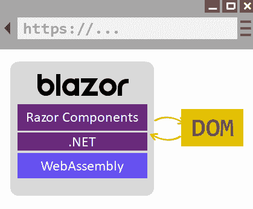
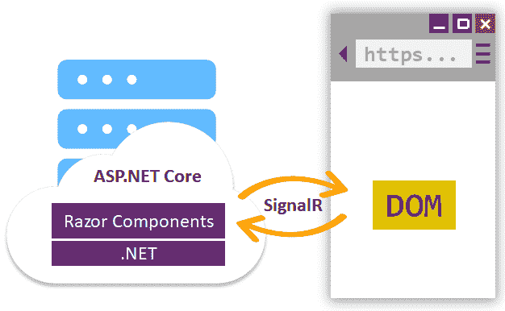
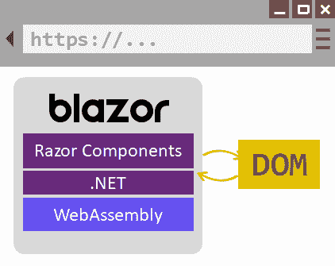

Introducing Blazor

本章将介绍 Blazor，一种在.NETCore3 中首次亮相的新技术。它用于构建在浏览器上运行的**用户界面**（**UI**应用，使用相同的语言和您将在服务器上使用的**应用编程接口**（**API**）。本章不会是 Blazor 的深入指南，因为这可能需要一整本书，但它应该足以让您开始学习。在此，您将了解以下内容：

*   不同的托管模式
*   如何创建组件
*   组件的生命周期
*   绑定的工作原理
*   如何与 JavaScript 交互
*   如何保护 Blazor 页面
*   如何对 Blazor 组件执行单元测试

# 技术要求

为了实现本章介绍的示例，您需要.NET Core 3**软件开发工具包**（**SDK**和某种形式的文本编辑器。当然，VisualStudio2019（任何版本）满足所有要求，但您也可以使用 VisualStudio 代码。

您应该已经阅读了[第 16 章](16.html)、*实时通信*，以了解信号机。

源代码可从 GitHub 检索，网址为：[https://github.com/PacktPublishing/Modern-Web-Development-with-ASP.NET-Core-3-Second-Edition](https://github.com/PacktPublishing/Modern-Web-Development-with-ASP.NET-Core-3-Second-Edition) 。

# Blazor 入门

Blazor 是一项全新的技术，由**Steve Sanderson**创建，与创建**KnockoutJS**和**节点服务**的人是同一个人。它是一个允许使用.NETCore 为客户端 web 和服务器端创建 UI 的框架。这样做的方法是将.NET 编译成**WebAssembly**，一种可以在浏览器上运行的语言，在运行 JavaScript 的同一解释器上运行。这使您可以在 Razor 中编写 UI 组件，在.NET 中编写事件处理代码，还可以在服务器端和客户端重用在.NET 中编写的代码。简而言之，使用 Blazor 的优点如下：

*   您可以使用一种好的旧的强类型语言，如 C#（或.NETCore 支持的任何其他语言）来构建 web UI。
*   利用.NET 核心框架和所有可用库公开的丰富 API。
*   在不同层（客户端和服务器端）之间重用代码。

与所有 ASP.NET 核心元素一样，Blazor 作为源代码可从 GitHub 获得，网址为：[https://github.com/aspnet/AspNetCore/tree/master/src/Components](https://github.com/aspnet/AspNetCore/tree/master/src/Components) 。

我们将从探索可用的托管模型开始。

## 托管模型

Blazor 中有两种基本的托管模型，如下所示：

*   **WebAssembly**：将.NET 核心代码编译成一个 web 程序集，并在**沙盒**内，由浏览器在客户端执行，由执行 JavaScript 代码的同一虚拟机执行。这意味着所有引用的程序集都需要发送到客户端，这在下载大小和安全性方面带来了挑战，因为代码可以在客户端进行反汇编。由于沙箱的存在，应用的功能受到一些限制，例如向任意主机打开套接字。
*   **服务器**：在服务器上运行.NET 核心代码，生成的代码通过信令器传输到客户端。由于所有代码都在服务器上运行，因此它的功能几乎没有限制。

WebAssembly 模式是最新发布到.NETCore 的模式，但实际上却吸引了大多数人的注意力。原因是它完全在客户端运行，在标准兼容的浏览器中运行。下面的屏幕截图显示了它的显示方式：



使用 WebAssembly 托管模型时，需要将所有内容下载到客户端。过程如下：

1.  加载了一些执行.NET 仿真器的 JavaScript。
2.  将项目组件和所有引用的.NET**动态链接库**（**DLL**）加载到客户端。
3.  用户界面已更新。

然后，客户端可以断开与服务器的连接，因为不再需要永久连接。

Keep in mind that because applications deployed using the WebAssembly hosting model run on the client browser, in a sandbox, this means that it may not be able to open arbitrary sockets to any host, which prevents it from running **Entity Framework** (**EF**) Core, for example. Only connections to the originating host are allowed.

对于服务器模型，Blazor 执行以下操作：

1.  呈现一些标记和一些 JavaScript
2.  使用信号器向服务器发送事件
3.  按照我们应用中的.NET 代码处理它们
4.  将响应发送到客户端
5.  更新用户界面

因为只使用 signer，所以没有回发和 AJAX 调用（当然，除非 signer 回退到 AJAX，否则它通常使用 WebSockets，如果有的话）。就所有目的而言，Blazor 应用只是一个**单页应用**（**SPA**。以下屏幕截图显示 Blazor 的服务器托管模型：



Image taken from https://docs.microsoft.com/en-us/aspnet/core/blazor

在服务器模式下，Blazor 需要连接到服务器，但在 WebAssembly 模式下，在将所有程序集下载到客户端后，Blazor 只能在客户端工作。在这种情况下，它在浏览器中以独立方式运行，无需服务器，如以下屏幕截图所示：



Image taken from https://docs.microsoft.com/en-us/aspnet/core/blazor

从本质上讲，Blazor 的主要优点是使用.NET 作为语言来更新 UI 和执行任何业务逻辑，而不是 JavaScript，这是针对客户端和服务器端的。Blazor 从 UI 获取输入，然后进入服务器，然后返回 UI 的过程称为**电路**。

# 实现 Blazor

根据您通过服务器或 WebAssembly 模型托管 Blazor 的方式，实现是完全不同的。Visual Studio 支持创建 Blazor 服务器或 WebAssembly 项目，如以下屏幕截图所示：


接下来，在前面的部分中，让我们看看这是如何工作的。

## Blazor 服务器的实现

Blazor 服务器也有`dotnet`工具，可以按如下方式使用：

```cs
dotnet new blazorserver
```

这将在服务器模式下创建一个 Blazor 示例项目，该项目将与**代表性状态传输**（**REST**web API 进行通信。这与从 Visual Studio 生成 Blazor 项目并选中 ASP.NET Core hosted 复选框相同。如果您查看生成的项目，您会注意到，首先，Blazor 服务需要注册到`ConfigureServices`中的**依赖项注入**（**DI**框架中，如下所示：

```cs
services.AddServerSideBlazor();
```

在这里，您还可以指定与 Blazor 服务器模型固有使用的 SignalR 服务相关的其他选项，如以下代码段所示：

```cs
services
    .AddServerSideBlazor()
    .AddHubOptions(options =>
    {
        //options go here
    });
```

这里我不详细介绍，因为它们与[第 16 章](16.html)、*实时通信*中描述的选项完全相同。

还需要在`Configure`中注册 Blazor Signal r 集线器的端点，以便 ASP.NET Core 知道如何处理请求，如下所示：

```cs
app.UseEndpoints(endpoints =>
{
    endpoints.MapBlazorHub();
    endpoints.MapFallbackToPage("/_Host");
});
```

正如我们将看到的，需要回退到页面端点。

It is perfectly possible to mix **Model-View-Controller** (**MVC**), Razor Pages, and Blazor on the same project.

浏览器必须加载包含调用 Signal 的所有逻辑的 JavaScript 文件，并在收到响应后执行所有的**文档对象模型**（**DOM**）操作，如下所示：

```cs
<script src="_framework/blazor.server.js"></script>
```

如果需要，我们可以配置 SignalR 的某些方面。在这种情况下，我们需要告诉 Blazor 不要自动加载默认值，方法是将`autostart`设置为`false`并显式调用`Blazor.start`函数，如下面的代码片段所示：

```cs
<script src="_framework/blazor.server.js" autostart="false"></script>
<script>
    Blazor.start({
        configureSignalR: function (builder) {
            builder.configureLogging("information");
        }
    });
</script>
```

我们可以在这里设置的选项与[第 16 章](16.html)、*实时通信*中描述的相同。防止自动加载的另一个原因是检测浏览器是否支持 Blazor WebAssembly（请记住，它在浏览器中运行）。如果不行，我们可以优雅地后退。

一个简单的测试可以是：

```cs
<script>
if (typeof(WebAssembly) === 'object' && typeof(WebAssembly.
instantiate) === 'function') {
    //the browser supports WebAssembly
    Blazor.start();
} else {
    location.href = 'BlazorNotSupported.html';
}
</script>
```

## 实现 Blazor WebAssembly

对于 Blazor WebAssembly，`dotnet`工具可用于从模板生成基本项目，如下所示：

```cs
dotnet new blazorwasm
```

创建了一个只包含客户端部分而没有服务器端代码的示例项目。如果你看一下代码，你会发现它与我们所看到的完全不同，因为没有`Startup`类，但是有`Program`类。这个类实际上注册了一个名为`app`的根组件。然后在`wwwroot`文件夹内的`index.html`文件中引用该组件。没有任何控制器，只有 Blazor 组件，我们将在后面讨论。

浏览器必须加载两个 JavaScript 文件并运行一些代码，如下所示：

```cs
<script src="_framework/blazor.webassembly.js"></script>
<script>
//some code here
</script>
<script src="_framework/wasm/dotnet.3.2.0.js" defer="" integrity="sha256-mPoqx7XczFHBWk3gRNn0hc9ekG1OvkKY4XiKRY5Mj5U=" crossorigin="anonymous"></script>
```

第一个文件实例化.NET 核心仿真器，第二个文件加载实际的.NET 核心 JavaScript 代码。请注意，第二个文件中的版本号与我们正在加载的.NET 核心版本相匹配。然后，它加载所有程序集，如下所示：


现在让我们比较两种托管模型。

## 比较服务器和 WebAssembly

服务器和 WebAssembly 模型有很大不同，原因如下：

*   WebAssembly 模型要求将所有代码下载到客户端；这可能会对性能造成一些影响，但当然也可以从缓存中获益。
*   WebAssembly 需要一个能够呈现`webassembly`的浏览器，这是大多数现代浏览器所能做到的；请注意，它不需要在客户端计算机中安装.NET Core。
*   WebAssembly 可以在断开连接的模式下工作，当然，下载应用除外，而服务器模式不能。

See [https://caniuse.com/#feat=wasm](https://caniuse.com/#feat=wasm) for browser support for WebAssembly.

除非另有明确说明，否则我们接下来讨论的所有内容都将应用于服务器和 WebAssembly。

接下来，我们将看到 Blazor 的构建块，从页面开始。

# 页

页面是一种特殊类型的 Blazor 组件，可以通过浏览器直接访问（这并不完全正确，但我们可以这样认为）。它们有`.razor`扩展名，按照惯例，应该放在我们应用根文件夹下名为`Pages`的文件夹中（或者放在它下面的文件夹中）。文件的第一行应该有一个`@page`指令（类似于 Razor Pages）——类似这样：

```cs
@page "/Home"
```

这似乎不必要，但应该包含页面接受的路由，该路由可能与文件名相同，没有`.razor`扩展名，但不必如此。如果页面没有`@page`指令，Blazor 将无法直接访问该页面。在本章后面讨论路由时，我们将对此进行更多讨论。

所有 Blazor 组件（页面就是组件）都必须实现一个`IComponent`接口，其中`ComponentBase`是最明显的、已经实现的选择。您不需要声明此继承；默认情况下，所有 Blazor 组件都隐式继承自`ComponentBase`。页面被编译为.NET 类，因此您可以始终通过将`typeof`运算符应用于要获取页面类型的文件名来引用页面的类型，如以下代码段所示：

```cs
@code
{
    var mainAppType = typeof(App);  //App comes from the App.razor file
}
```

页面通常具有标记，但也可以具有声明为标记的其他 Blazor 组件。现在我们将讨论页面的语法。

## 剃刀语法

该语法与您在 Razor 视图中使用的语法完全相同，只是有一些细微的更改，具体如下：

*   `@page`：用于 Blazor 页面（非组件）
*   `@code`：用于代码块而不是`@functions`，此处不适用
*   `@namespace`：用于设置生成的.NET 类的名称空间
*   `@attribute`：用于添加将添加到生成类中的其他属性
*   `@attributes`：将键值字典呈现为标签中的**超文本标记语言**（**HTML**属性
*   `@typeparam`：用于声明通用/模板组件
*   `@`：用于.NET 事件处理程序的语法（例如`@onclick`），不要与 JavaScript 事件混淆

此外，需要注意的是，标记帮助程序不起作用，Blazor 组件将被声明为标记。

除此之外，Razor 页面的所有其他关键字和功能也在 Blazor 页面中工作，包括`@inject`、`@inherits`和`@implements`。它还具有 IntelliSense，可提供代码完成，如以下屏幕截图所示：


我们将继续 Blazor 页面的构建，以及与类相关的内容。

## 名称空间导入

我们需要为 Blazor 页面中要使用的所有类型导入所有名称空间，方法是添加`@using`声明：如果我们不添加它们，我们的类型将找不到，因此将不可用。如果我们不希望在每个页面上都这样做，我们可以将所有需要的`@using`声明添加到名为`_Imports.razor`的文件中，该文件应放在 web 应用的根目录下，并将自动加载。Blazor 模板已经提供了一些最常见的名称空间。

## 部分类

因为 Blazor 文件被编译为类，所以您还可以将生成的类拆分为多个文件。例如，对于一个名为`SimpleComponent.razor`的文件，我们还可以创建一个名为`SimpleComponent.razor.cs`的分部类，如下所示：

```cs
public partial class SimpleComponent : ComponentBase
{
}
```

如果名称空间和类名相同，并且使用`partial`关键字，则可以跨多个文件生成类。

## 页面作为代码

页面不必写为`.razor`文件，带有标记和代码；它们可以实现为.NET 类。他们只需要实现`IComponent`（或从`ComponentBase`继承）。代替`@page`指令，它们需要有`[Route]`属性，而不是`@layout`，它们可以有`[Layout]`属性，这就是 Blazor 页面的转换方式。代码可以在以下代码段中看到：

```cs
[Route("/")]
[Layout(typeof(MainLayout))]
public partial class Index : ComponentBase
{
}
```

Blazor 在引导程序集上查找页面/组件类，并在决定路由时检查它们的`[Route]`属性。不要忘记 Blazor 页面/组件需要一个公共的无参数构造函数。

## 作为组件的页面

请记住，页面是一个组件。因此，如果您愿意，可以将一个页面完美地包含在另一个页面或组件中。只需像包含任何其他组件一样包含它，如下所示：

```cs
<MyPage />
```

接下来，我们将看到如何通过页面布局向页面添加一些结构。

# 页面布局

Blazor 的页面布局工作方式与 Razor 页面和视图类似。Blazor 页面通常有一个布局，布局需要通过`@Body`声明声明在何处呈现页面内容，如以下代码段所示：

```cs
@inherits LayoutComponentBase

<div>This is a layout</div>
<div>Body goes here:</div>
@Body
```

但是，Blazor 布局不支持多个部分，只支持单个部分（主体）。

布局在`_Imports.razor`文件中的路线（见下一节）上声明，这是一种将布局应用于多个页面的方式，如下所示：

```cs
@layout MyLayout
```

或者，它们在组件的代码文件中使用`[Layout]`属性声明，如下所示：

```cs
[Layout(typeof(MainLayout))]
```

通常布局应该继承`LayoutComponentBase`，但需要声明；否则，作为组件，它将从`ComponentBase`继承。`LayoutComponentBase`的优点是它为内容定义了一个`Body`属性，您可以在任何地方渲染它。布局通常是从路线定义的（我们稍后会看到），但也可以通过应用`@layout`指令来定义特定页面的布局，如下所示：

```cs
@layout MyLayout
@page "/Home"
```

最后，与 Razor 布局一样，Blazor 布局也可以嵌套，这意味着布局本身可以有一个布局。

对于下一个主题，我们从页面跳转到全局路由。

# 路由

对于由 Visual Studio 或`dotnet`工具生成的默认 Blazor 项目，您会注意到没有进入页面、没有`index.html`，没有控制器，也没有默认 Razor 页面。正因为如此，当你通过浏览器访问你的应用时，你将进入后备页面，我在*实现*ing Blazor 服务器部分中提到的页面。如果你看这个页面，你会注意到它本质上是一个简单的 Razor 页面，带有一个`<component>`标记帮助器—一个刚刚在.NETCore3 中引入的帮助器。这个标记帮助器正在呈现`App`组件，如果您查看`App.razor`文件的内部，您会发现一些奇怪的标记，如下所示：

```cs
<Router AppAssembly="@typeof(Program).Assembly">
    <Found Context="routeData">
        <RouteView RouteData="@routeData" DefaultLayout=
        "@typeof(MainLayout)" />
    </Found>
    <NotFound>
        <LayoutView Layout="@typeof(MainLayout)">
            <p>Sorry, there's nothing at this address.</p>
        </LayoutView>
    </NotFound>
</Router> 
```

这个文件实际上是 Blazor 的主要应用，尽管它只是进行路由。本质上，它定义了两种可能的路线，如下所示：

*   一条`found`路线（我们接下来看看这意味着什么）
*   `not found`路线

如果查看`Router`根，它定义了一个指向启动程序集的`AppAssembly`属性；如果需要，可以指定一个附加的`AdditionalAssemblies`属性，其中包含要加载的附加 Blazor 组件的附加程序集（Razor 类库）列表。

对于`found`路线，会发生以下情况：

1.  Blazor 通过查看`@page`指令，找到与**统一资源定位器**（**URL**的请求相匹配的页面。
2.  为其定义了页面布局（在本例中为`MainLayout`）。
3.  一个视图被实例化，它实际上是一个名为`RouteView`的类的实例，该类被传递给所有路由参数（即`@routeData`。

因此，本质上，我们从来没有直接访问 Blazor 页面（`.razor`，而是访问一个回退页面，当它检测到请求的页面（或响应该 URL 的页面）存在时，显示该页面。

对于`not found`路线，以下情况适用：

1.  `LayoutView`以`MainLayout`的布局进行实例化。
2.  默认内容设置为带有错误消息。

当然，可以模仿与`found`路由相同的行为，也就是说，当找不到请求的页面时，也可以显示特定的页面。只需将该页面添加为`<SomePage />`Blazor 组件。

在下一节中，我们将讨论页面路由以及如何映射和强制路由参数。

## 页面路由

页面可以接受许多不同的路由，如以下代码段所示：

```cs
@page "/Home"
@page "/"
@page "/My"
```

当试图从请求 URL 中找到正确的页面时，Blazor 不会查看页面的名称（以`.razor`结尾的名称），而是查看一个或多个指令。

## 路线约束

如果您还记得我们在[第 3 章](03.html)、*路由*中讨论路由时，我们也讨论了路由约束。如果页面需要某些参数，您也需要在此处列出，如下所示：

```cs
@page "/Product/{id}"
```

但是，您还可以指定此参数的类型，以便在提供的请求 URL 与预期 URL 不匹配时，请求将失败。这些是路由约束，如果您还记得的话，语法如下：

```cs
@page "/Product/{id:int}"
```

此处列出了开箱即用约束：

*   `bool`
*   `datetime`
*   `decimal`
*   `double`
*   `float`
*   `guid`
*   `int`
*   `long`

请记住，其中一些（如`float`和`datetime`）是特定于区域性的，因此必须注意根据应用使用的区域性提供有效的值。例如，如果应用使用任何英语，则数字小数分隔符为`**.**`，而如果使用葡萄牙语，则为`,`。有关路线约束的更多信息，请参考[第 13 章](13.html)、*了解测试工作原理*。

## 包罗万象的路线

一网打尽的路线是始终满足的路线。一定是这样的：

```cs
@page "/{**path}"
```

在这里，`path`没有任何作用；仅用于指示`/`之后的任何内容。

## 来自路由的参数绑定

如果您有一个带有参数的路由，并且您以相同的名称（不区分大小写）声明了一个参数，则它将自动绑定到路由参数的值，如下所示：

```cs
@page "/Search/{product}"

@code
{
    [Parameter]
    public string Product { get; set; }
}
```

## 页面导航

Blazor 中的页面导航是通过`NavigationManager`服务实现的，该服务通常从 DI 获得（参见*DI*部分）。此服务将`NavigateTo`方法作为其主要方法公开，该方法可以采用相对 URL、Blazor 路由和可选参数来强制加载页面，如以下代码段所示：

```cs
[Inject]
public NavigationManager NavigationManager { get; set; }

@code
{
    void GoToPage(int page)
    {
        NavigationManager.NavigateTo($"Page/{page}", forceLoad: false);
    }
}
```

别忘了路线不是以`.razor`结尾的！

通常，我们不需要强制加载页面；这意味着 Blazor 使用 Signal 异步加载内容（当使用服务器托管模型时），URL 将添加到浏览器的历史记录中，但浏览器不会加载任何新页面。如果我们强制它，则会发生整页加载。

`NavigationManager`类公开了两个属性，如下所示：

*   `BaseUri`（`string`）：Blazor 应用的绝对基数**统一资源标识符**（**URI**）
*   `Uri`（`string`：当前页面的绝对 URI

而且，当我们通过调用`NavigateTo`方法请求导航到新页面时，会引发`LocationChanged`（`EventHandler<LocationChangedEventArgs>`事件，`forceLoad`参数设置为`false`。

然后是`<NavLink>`组件。此组件使用`CSS :active`类呈现所提供内容的页面链接，具体取决于此链接是否与当前 URL 匹配。它的行为与`<a>`元素完全相同，但它具有以下附加属性：

*   `Match`（`Match`：默认前缀（`Prefix`）或整体（`All`如何考虑链接

`Match`属性确定所传递的链接是否被认为是活动的。例如，考虑当前 URL 是 OUTT1TY，并且 OUTT2AY 属性是 OutT3。如果`Match`属性设置为`Prefix`，则它将显示为活动，但如果它设置为`All`，则不会显示。代码可以在以下代码段中看到：

```cs
<NavLink href="/someother/page" Match="All">
Jump to some other page
</NavLink>
```

`<NavLink>`没有什么大不了的；它的存在只是为了帮助我们将当前页面呈现为活动页面。

# 建筑构件

组件只是一个扩展名为`.razor`且符合 Blazor 语法的文件，没有`@page`指令，因此无法直接访问。但是，它可以包含在其他 Blazor 文件、页面或组件中。

所有组件都隐式继承自`ComponentBase`，但您可以通过`@inherits`指令将其修改为其他类。包含组件就像在文件中声明为标记一样简单。例如，如果您的组件被称为`SimpleComponent.razor`，您将按照如下方式声明它：

```cs
<SimpleComponent />
```

就是这样，但是有一种新的方法来嵌入 Blazor 组件，我们将在下面看到。

## <component>标记助手</component>

有一个新的标签助手，AuthT0}，它允许我们将一个 BLAZOR 组件嵌入到剃须刀视图的中间。[第 9 章](09.html)、*可重用组件*中的*标记帮助程序*部分也对其进行了介绍，但为了完整起见，我将在这里展示一个示例：

```cs
<component type="typeof(SomeComponent)" render-mode="ServerPrerendered" param-Text="Hello, World"/>
```

如果您还记得，`SomeComponent`只是一些具有`Text`属性的`.razor`文件。

呈现组件的第二个选项是通过代码，在 Razor 页面或视图中使用`RenderComponentAsync`方法，如以下代码片段所示：

```cs
@(await Html.RenderComponentAsync<SomeComponent>(RenderMode.Static, new { Text = "Hello, World" }))
```

`RenderComponentAsync`的第二个参数是可选的，它应该是一个匿名对象，其属性在要呈现的组件所期望的属性之后命名（并键入）。

## Blazor 组件属性

Blazor 组件属性在代码中声明为公共属性，并用`[Parameter]`属性修饰，如以下代码片段所示：

```cs
@code
{
    [Parameter]
    public string Text { get; set; } = "Initial value";
}
```

然后，可以使用标记或标记帮助器语法设置值，如以下代码段所示：

```cs
<!-- in a .razor file -->
<SomeComponent Text="Hello, World" />

<!-- in a .cshtml file -->
<component type="typeof(SomeComponent)" param-Text="Hello, World" />
```

注意属性的`param-XXX`格式。

Properties are case-insensitive—for example, `Text` is identical to `text`.

不从字符串值解析属性；如果属性不是数字、布尔值或字符串，则必须传递实际对象。例如，对于`TimeSpan`属性，必须传递一个实际的`TimeSpan`对象，如下所示：

```cs
@code
{
    public class Clock : ComponentBase
    {
        [Parameter]
        public TimeSpan Time { get; set; }
    }
}

<Clock Time="@DateTime.Now.TimeOfDay" />
```

或者，必须传递适当时间的变量，如下所示：

```cs
@code
{
    TimeSpan now = DateTime.Now.TimeOfDay;
}

<Clock Time="@now" />
```

尝试传递字符串将导致错误，因为与 Web 表单不同，不会进行解析。

### 级联特性

级联属性总是从父组件注入子组件。级联属性是不需要显式提供值的参数，因为它们是由框架从包含组件自动设置的。它们可以是任何类型，包括复杂类型。想象你有这样一个：

```cs
<CascadingValue Value="Something">
    <ProfileComponent />
</CascadingValue>
```

您在`<CascadingValue>`中放入的任何内容都将接收`Value`集合，无论嵌套程度如何（其他组件中的组件也会接收）。接收属性声明如下，例如，在假设的`ProfileComponent`实例中：

```cs
[CascadingParameter]
private string Text { get; set; } = "<not set>";
```

请注意，这些参数/属性应设置为`private`，因为手动设置它们的值没有意义。

当然，在设置初始值后，可以在子组件上更改级联属性，但它不会*将*级联回发起方。实现这一点的最佳方法是在子组件上声明事件并将其与父组件挂钩。

父级根据子级级联参数的匹配类型自动定位子级级联参数，但如果您有多个相同类型的级联参数，则可能需要通过设置名称告诉框架哪个级联参数映射到哪个级联参数，如下所示：

```cs
<CascadingValue Name="FirstName" Value="Ricardo">
    <ProfileComponent />
</CascadingValue>
```

他们的声明也应出现在`ProfileComponent`内，如下所示：

```cs
[CascadingParameter(Name = "FirstName")]
private string FirstName { get; set; }

[CascadingParameter(Name = "LastName")]
private string LastName { get; set; }
```

您还可以按如下方式嵌套多个`<CascadingValue>`组件，它们的所有值都将传递给任何子组件：

```cs
<CascadingValue Name="FirstName" Value="Ricardo">
    <CascadingValue Name"LastName" Value="Peres">
        <ProfileComponent />
    </CascadingValue>
</CascadingValue>
```

如果级联属性的值从未更改，则可以将其声明为只读；这对性能有好处，因为 Blazor 不必钩住它，也不必随时更新 UI。在以下代码段中可以看到这方面的代码：

```cs
[CascadingParameter(Name = "FirstName", IsFixed = true)]
private string FirstName { get; set; }
```

这是通过`IsFixed`实现的，默认为`false`。

### 捕获所有属性

如果为不存在的参数提供值，则在编译时会出现异常，除非您声明一个 catch all 属性，该属性将捕获与现有参数不匹配的任何参数的值，如下所示：

```cs
[Parameter(CaptureUnmatchedValues = true)]
public Dictionary<string, object> Attributes { get; set; } = new Dictionary<string, object>();
```

使用这种方法，您可以传递任意数量的参数，如果它们没有找到匹配的参数，它们只会以`InputAttributes`结束。此外，还可以将所有属性传递给组件或 HTML 元素。使用`@attributes`关键字将每个字典元素展平并转换为键值对，如下所示：

```cs
<input @attributes="@Attributes" />
```

这是传递任意数量属性的通用方法，不必担心为每个属性定义属性。

### 子内容属性

一些组件可以在其中设置标记，包括其他组件；这称为子内容。以下是一个例子：

```cs
<ContainerComponent>
<p>This is the child content's markup</p>
</ContainerComponent>
```

可以在属性中捕获此内容以供以后使用，如下所示：

```cs
[Parameter]
public RenderFragment ChildContent { get; set; }
```

此属性必须被称为`ChildContent`。它的内容将是呈现的标记，包括父组件内声明的任何组件的内容。现在，在您的组件中，您可以随时随地输出（或者不输出，如果愿意），如以下代码段所示：

```cs
<pre>
<!-- child content goes here -->
@ChildContent
</pre>
```

## 具有通用参数的组件

可以声明通用（或模板化）组件，即具有通用参数的组件。这样做的好处是使您的组件完全适合您想要的类型。为此，我们使用`@typeparam`声明声明泛型模板参数，然后将一个或多个字段或属性声明为泛型并具有相同的模板参数，如下所示：

```cs
//MyComponent
@typeparam TItem

@code
{
    [Parameter]
    public IEnumerable<TItem> Items { get; set; }
}
```

使用此组件的一种方法是为泛型属性声明一个值，并让 Blazor 推断泛型参数类型，如以下代码段所示：

```cs
@code
{
    var strings = new [] { "A", "B", "C" };
}

<MyComponent Items="strings" />
```

另一种方法是，如果无法推断类型或我们希望强制执行特定类型，则设置`TItem`属性，如下所示：

```cs
@code
{
    var strings = new [] { "A", "B", "C" };
}

<MyComponent Items="strings" TItem="IComparable" />
```

使用这种方法，`Items`属性将被原型化为`IEnumerable<IComparable>`。因为字符串的数组也是`IComparables`的数组，所以类型匹配。

As of now, it is not possible to define constrained generic types.

## 组件列表

在呈现其内容可能会更改的组件列表（添加、删除或修改列表中的项目）时，告诉 Blazor 哪些内容标识列表中的每个项目非常重要，以防止出现不必要的行为，例如 Blazor 不知道更新哪些内容。为此，有一个`@key`属性应用于每个列表项，该属性具有唯一的值，可能是一个复杂的对象。让我们看一个例子。假设您有一个绑定到订单列表的列表，如下所示：

```cs
@code
{
    foreach (var order in Orders)
    {
        <Order
            @key="order.Id"
            Product="order.Product" 
            Customer="order.Customer" 
            Date="order.Date" />
    }
}
```

在这里，我们都向一个假设的`Order`组件传递它需要的数据—`Product`、`Customer`、`Date`——并将订单 ID 设置为其密钥，这意味着每个组件都有一个唯一的标识符。

## 定位组件

组件有一个与之关联的隐式类，该类位于与其所在文件夹相匹配的命名空间中。例如，如果`SomeComponent.razor`位于 web app 根文件夹下名为`Components`的文件夹中，我们需要添加一个`@using`声明才能包含它，如下所示：

```cs
@using MyProject.Components
```

位于使用它们的同一文件夹或`Shared`文件夹中的组件将自动找到，而无需`@using`指令。

## 渲染模式

组件可以在三种模式（`RenderMode`中的一种模式）下渲染，必须按如下方式指定：

*   `Static`：加载页面时，使用 Blazor 组件的任何参数静态呈现 Blazor 组件。这是最快的选项，但组件无法引发事件，这使得它不适用于任何高级用途；但是，这是默认设置。
*   `Server`：在服务器上呈现页面，页面加载后才发送给客户端；这是最慢的选项，不能使用任何参数。
*   `ServerPrerendered`：这是其他两种模式的折衷；Blazor 预先呈现页面，并在页面加载时发送组件，但随后使其成为交互式的。它也不支持参数。

当我们谈论与 DOM 交互和引发事件时，呈现模式是相关的，我们将在稍后介绍。

## 组件生命周期

每个组件（不要忘记页面和页面布局也是组件）都经历了一个生命周期，在这个生命周期中调用了一些虚拟方法。这些措施依次如下：

1.  `SetParametersAsync`：设置查询字符串中的参数并绑定任何需要绑定的属性时；如果重写此方法，请确保调用基本实现。
2.  `OnInitialized`/`OnInitializedAsync`：组件初始化时，有机会更改/设置其他组件或 DOM 元素的属性。
3.  `OnParametersSet`/`OnParametersSetAsync`：组件初始化且组件父级的所有参数均已设置时。
4.  `OnAfterRender`/`OnAfterRenderAsync`：组件渲染完成时。

正如您所看到的，其中一些虚拟方法同时具有同步和异步版本。最好覆盖异步版本。

`OnAfterRender`/`OnAfterRenderAsync`方法采用一个`firstRender`参数，该参数指示组件是否是第一次渲染。这可能有助于您进行某种初始化。

还有一种`ShouldRender`方法值得一提。正如您所想象的，当 Blazor 需要决定组件是否需要更新其 UI 时，就会调用该函数；它不接受任何参数并返回布尔值。由您来实现其逻辑。`StateHasChanged`方法总是导致`ShouldRender`被调用，但是第一次呈现组件时（`OnAfterRender`/`OnAfterRenderAsync`被调用且`firstRender`参数设置为`true`时），无论`ShouldRender`返回什么，它总是如此。

如果一个组件实现了`IDisposable`，那么它的`Dispose`方法将在其生命周期结束时被调用——例如，当它从 UI 中删除时，或者当连接关闭时。但我们必须明确地告诉 Blazor，如下所示：

```cs
@implements IDisposable

@code
{
    public void Dispose()
    {
        //dispose the component
        //this method will be called automatically by the framework
    }
}
```

从前面的代码片段中，我们可以看到该方法将被框架自动调用。

## 在不同项目中重用组件

如果 Blazor 组件是在 Razor 类库项目中创建的，那么它们可以跨项目重用。这是一个特殊的项目，可以由 Visual Studio 或使用 dotnet 的`razorclasslib`模板创建。这在[第 9 章](09.html)、*可重用组件*中有描述，但本质上，这只是一个 SDK 设置为`Microsoft.NET.Sdk.Razor`的项目文件，如以下代码段所示：

```cs
<Project Sdk="Microsoft.NET.Sdk.Razor">
   ...
</Project>
```

其中包含的任何`.razor`文件都可以从引用该项目的另一个项目中访问；只需为正确的名称空间添加一个`@using`语句（考虑项目的根名称空间，以及可能嵌套`.razor`文件的任何文件夹）。

## 访问 HTTP 上下文

如果需要从组件（或页面）内部访问 HTTP 上下文，只需将`IHttpContextAccessor`服务注入到类中，如下所示：

```cs
@code
{
    [Inject]
    public IHttpContextAccessor HttpContextAccessor { get; set; }

    HttpContext HttpContext => HttpContextAccessor.HttpContext;
}
```

有关这方面的更多信息，请参阅*DI*部分。

## 样品成分

让我们考虑下面的组成部分：

```cs
@using System
@using System.Timers

@implements IDisposable

@code
{
    private System.Timers.Timer _timer;

    [Parameter]
    public TimeSpan Delay { get; set; }

    [Parameter]
    public Action OnElapsed { get; set; }

    [Parameter]
    public bool Repeat { get; set; }

    protected override void OnParametersSet()
    {
        this._timer = new System.Timers.
        Timer(this.Delay.TotalMilliseconds);
        this._timer.Elapsed += this.OnTimerElapsed;
        this._timer.Enabled = true;

        base.OnParametersSet();
    }

    private void OnTimerElapsed(object sender, ElapsedEventArgs e)
    {
        this.OnElapsed?.Invoke();

        if (!this.Repeat)
        {
            this._timer.Elapsed -= this.OnTimerElapsed;
            this._timer.Enabled = false;
        }
    }

    void IDisposable.Dispose()
    {
        if (this._timer != null)
        {
            this._timer.Dispose();
            this._timer = null;
        }
    }
}
```

这是一个计时器组件，它在一定时间后启动。它公开了以下属性：

*   `Delay`（`TimeSpan`：计时器触发的时间。
*   `OnElapsed`（`Action`：定时器触发时要调用的回调。
*   `Repeat`（`bool`：是否重复回调；默认值为`false`。

我们可以看到该组件公开了三个参数，并私下实现了`IDisposable`接口。它覆盖了`OnParametersSet`方法，因为当基础设施调用它时，属性已经设置好了；在这种情况下，现在是利用它们的好时机，用`Delay`参数的值实例化内部计时器。当计时器第一次触发时，组件决定是否继续引发事件，这取决于是否设置了`Repeat`参数。当处理组件时，它也处理内部计时器。

我们可以按如下方式使用此组件：

```cs
<Timer Delay="@TimeSpan.FromSeconds(20)" OnElapsed="OnTick" Repeat="true" />

@code
{
    void OnTick()
    {
        //timer fired
    }
}
```

现在我们来看另一个组件，它只为具有特定角色的用户呈现内容，如下所示：

```cs
@code
{
    [Inject]
    public IHttpContextAccessor HttpContextAccessor { get; set; }

    HttpContext HttpContext => HttpContextAccessor.HttpContext;
    ClaimsPrincipal User => HttpContext.User;

    [Parameter]
    public string Roles { get; set; } = "";

    [Parameter]
    public RenderFragment ChildContent { get; set; }
}
@if (string.IsNullOrWhitespace(Roles) || Roles.Split(",").Any(role => User.IsInRole(role)))
{
    @ChildContent
}
```

本例注入了`IHttpContextAccessor`服务，然后从中提取当前`HttpContext`，并从中提取当前`User`。我们拥有`Roles`物业和`ChildContent`。仅当当前用户是`Roles`属性中提供的任何角色的成员或为空时，才会呈现`ChildContent`。

正如您所见，构建有用且可重用的组件非常容易！现在，让我们看看如何使用表单——这是我们谈论 web 时的一个常见需求。

# 使用表单

Blazor 支持使用绑定到模型的表单。有几个组件知道如何绑定到给定类型的属性并相应地将它们显示为 HTMLDOM 元素，还有一个表单组件负责绑定到模型并对其进行验证。

## 表单编辑

为了验证模型并允许对其进行编辑，要使用的组件为`EditForm`。其用法如以下代码段所示：

```cs
<EditForm
    Model="@model"
    OnSubmit="@OnSubmit"
    OnInvalidSubmit="@OnInvalidSubmit"
    OnValidSubmit="@OnValidSubmit">
    ...
    <button>Submit</button>
</EditForm>

@code
{
    var model = new Order(); //some model class
}
```

`EditForm`组件公开了两个属性，如下所示：

*   `Model`（`object`）：包含绑定到表单组件的属性的**POCO**（简称**普通旧公共语言运行库**（**CLR**）**对象**）；它通常是唯一需要的属性。
*   `EditContext`（`EditContext`：一种形式语境；通常，它不是显式提供的，而是由`EditForm`组件为我们生成的。

它还公开了以下三个事件：

*   `OnInvalidSubmit`（`EventCallback<EditContext>`）：表单尝试提交但存在验证错误时引发
*   `OnSubmit`（`EventCallback<EditContext>`）：明确提交表单时提出，无自动验证
*   `OnValidSubmit`（`EventCallback<EditContext>`：表单提交成功时提出，无验证错误

如您所见，`EditForm`需要`Model`（强制），并且可能需要一个或多个事件处理程序来处理`OnSubmit`、`OnInvalidSubmit`或`OnValidSubmit`事件。在它里面，一定有一些导致提交的 HTML 元素，比如带有`type="submit"`的`button`或`input`——这实际上会触发表单提交。请注意，实际提交将是与`OnSubmit`或`OnValidSubmit`处理程序关联的操作。

## 形式语境

表单上下文是`EditContext`的实例，由与`EditForm`类同名的级联属性公开。上下文公开以下属性和事件：

*   `Model`（`object`）：模型
*   `OnFieldChanged`（`EventHandler<FieldChangedEventArgs>`：字段更改时引发的事件
*   `OnValidationRequested`（`EventHandler<ValidationRequestedEventArgs>`：请求验证时引发的事件
*   `OnValidationStateChanged`（`EventHandler<ValidationStateChangedEventArgs>`：验证状态改变时引发的事件

上下文还公开了一些方法，这些方法可用于强制验证、检查模型是否已更改或获取验证错误，其中最相关的方法如下：

*   `GetValidationMessages`：获取所有验证消息或仅针对某个字段
*   `IsModified`：检查给定模型属性的值是否已更改
*   `MarkAsUnmodified`：将特定模型属性标记为未修改
*   `NotifyFieldChanged`：引发一个事件，通知字段属性更改
*   `NotifyValidationStateChanged`：引发事件，通知验证状态更改
*   `Validate`：根据使用中的验证 API 检查当前模型值的有效性

还有一些活动，如下所示：

*   `OnFieldChanged`：模型字段值已更改。
*   `OnValidationRequested`：已请求验证。
*   `OnValidationStateChanged`：验证状态已更改。

表单上下文可从`EditForm`或其内部的任何表单组件获得。

## 表单组件

Blazor 附带的表单组件如下所示：

*   `InputText`：以`type="text"`呈现`input`
*   `InputTextArea`：呈现`textarea`
*   `InputSelect`：呈现`select`
*   `InputNumber`（对于`int`、`long`、`float`、`double`或`decimal`：用`type="number"`呈现`input`
*   `InputCheckbox`：以`type="checkbox"`呈现`input`
*   `InputDate`（对于`DateTime`和`DateTimeOffset`：用`type="date"`呈现`input`

这些都是非常方便的助手，可以帮助我们避免编写 HTML。这些应该放在`EditForm`内，并绑定到模型的属性。以下代码段中显示了一个示例：

```cs
<EditForm Model="@model">
    <InputSelect @bind-Value="@model.Color">
        <option></option>
        <option>Red</option>
        <option>Green</option>
        <option>Blue</option>
    </InputSelect>
</EditForm>
```

在本例中，`InputSelect`有几个选项，并且绑定到模型的`Color`属性，这可能是这些选项之一。

## 表单验证

到目前为止，唯一可用的验证器是`DataAnnotationsValidator`，它使用**数据注释 API**。为了在表单上进行验证，您需要在`EditForm`中声明一个验证器，如下所示：

```cs
<EditForm Model="@model">
    <DataAnnotationsValidator />
    ...
</EditForm>
```

如果您为`EditForm`实例的`OnSubmit`事件提供了一个处理程序，那么您必须通过调用`EditContext.Validate()`来强制验证，这将反过来触发数据注释 API 验证，或者您可以自己进行验证。

而且，如果您希望显示验证错误的摘要，还可以包括一个`ValidationSummary`组件，如下所示：

```cs
<EditForm Model="@model">
    <DataAnnotationsValidator />
    <ValidationSummary Model="@model" />
    ...
</EditForm>
```

虽然很方便，但是除了在生成的标记中调整**级联样式表**（**CSS**类）之外，您没有什么可以自定义错误消息的显示方式。当然，您也可以自己处理`EditForm`上的`OnInvalidSubmit`事件，并为无效数据添加自己的消息，而无需使用`ValidationSummary`组件。

接下来，使用 DOM 元素！

# 使用 DOM 元素

在本节中，我们将学习如何使用 DOM 元素：访问它们、绑定属性、添加事件和处理程序，等等。

## 双向装订

将属性设置为元素值的一种方法是在元素的属性中声明它，如下所示：

```cs
<input type="text" name="name" value="@Name" />
```

命名元素将接收`Name`属性的值，但它不会*将*元素绑定到该属性。但是，以下属性将绑定：

```cs
<input type="text" name="name" @bind="Name" />
```

注意`@bind`关键字的用法。它用于将元素绑定到传递的属性或字段。默认情况下，它钩住元素的`value`属性，因为这是 DOM 表单元素（`input`、`select`、`textarea`的常用属性。这实际上是双向绑定：当元素的值更改时，属性的值也会更改！

如果我们希望绑定到组件的其他属性，我们只需在`bind-`之后指定其名称，如下所示：

```cs
<MyComponent @bind-Text="Name" />
```

如果需要为要绑定到的属性指定格式，则有一种特殊语法，如以下代码段所示：

```cs
<input type="text" @bind="StartDate" @bind:format="yyyy-MM-dd" />
```

本例使用特定格式将输入字段绑定到名为`StartDate`的属性。日期将按照该格式显示。

最后，我们可以指定要绑定到的替代事件，如下所示：

```cs
<input type="text" name="name" @bind-value="Name" @bind-value:event="oninput" />
```

DOM 表单事件的默认事件为`onchange`，但其他候选事件为`oninput`或`onblur`。对于自己组件的自定义事件，必须指定自己的事件。

## 事件处理

您还可以响应元素引发的事件，如下所示：

```cs
<button @onclick="OnButtonClick">Click Me</button>
@code
{
    void OnButtonClick(MouseEventArgs e)
    {
        //button was clicked!
    }
}
```

除了添加一个函数来处理事件外，我们还可以内联执行，这会产生一些难看的代码，如以下代码段所示：

```cs
<button @onclick="(evt) => Console.WriteLine("Clicked")>Click Me</button>
```

为了防止事件的默认行为，有一个特殊的关键字，如以下代码段所示：

```cs
<button @onsubmit:preventDefault>Click me</button>
```

这也可以通过使用布尔属性或字段（如本例中所示）来设置条件，如下所示：

```cs
<button @onsubmit:preventDefault="_preventDefault">Click me</button>
```

还有一个用于停止事件传播的方法，如以下代码段所示：

```cs
<button @onclick:stopPropagation>Click me</button>
```

它还允许使用条件运算符，如以下代码段所示：

```cs
<button @onclick:stopPropagation="_stopPropagation">Click me</button>
```

通过运行以下代码，也可以将我们自己的事件处理程序公开为组件的参数：

```cs
[Parameter]
public EventCallback<ChangeEventArgs> OnChange { get; set; }
```

声明自定义事件处理程序有两个选项，如下所示：

*   `EventCallback<T>`：强类型事件处理程序；需要与之匹配的委托
*   `EventCallback`：接受`object`参数的委托

对于那些使用过它的人来说，这看起来非常类似于 Web 表单！通过处理程序，我们几乎可以做任何我们想做的事情，比如访问属性和其他组件的值，调用服务器，等等。

Blazor 拥有可由浏览器 DOM 引发的所有事件的类。其中每一项都包含与所发生事件相关的信息，如下表所示：

| **型** | **参数类** | **DOM 事件** |
| 剪贴板 | `ClipboardEventArgs` | `oncut`、`oncopy`、`onpaste` |
| 拖放 | `DragEventArgs` | `ondrag`、`ondragstart`、`ondragenter`、`ondragleave`、`ondragover`、`ondrop`、`ondragend` |
| 错误 | `ErrorEventArgs` | `onerror` |
| 通用 | `EventArgs` | `onactivate`、`onbeforeactivate`、`onbeforedeactivate`、`ondeactivate`、`onended`、`onfullscreenchange`、`onfullscreenerror`、`onloadeddata`、`onloadedmetadata`、`onpointerlockchange`、`onpointerlockerror`、`onreadystatechange`、`onscroll``onbeforecut`、`onbeforecopy`、`onbeforepaste``oninvalid`、`onreset`、`onselect`、`onselectionchange`、`onselectstart`、`onsubmit``oncanplay`、`oncanplaythrough`、`oncuechange`、`ondurationchange`、`onemptied`、`onpause`、`onplay`、`onplaying`、`onratechange`、`onseeked`、`onseeking`、`onstalled`、`onstop`、`onsuspend`、`ontimeupdate`、`onvolumechange`、`onwaiting` |
| 集中 | `FocusEventArgs` | `onfocus`、`onblur`、`onfocusin`、`onfocusout` |
| 输入 | `ChangeEventArgs` | `onchange`、`oninput` |
| 键盘 | `KeyboardEventArgs` | `onkeydown`、`onkeypress`、`onkeyup` |
| 老鼠 | `MouseEventArgs` | `onclick`、`oncontextmenu`、`ondblclick`、`onmousedown`、`onmouseup`、`onmouseover`、`onmousemove`、`onmouseout` |
| 鼠标指针 | `PointerEventArgs` | `onpointerdown`、`onpointerup`、`onpointercancel`、`onpointermove`、`onpointerover`、`onpointerout`、`onpointerenter`、`onpointerleave`、`ongotpointercapture`、`onlostpointercapture` |
| 鼠标滚轮 | `WheelEventArgs` | `onwheel`、`onmousewheel` |
| 进步 | `ProgressEventArgs` | `onabort`、`onload`、`onloadend`、`onloadstart`、`onprogress`、`ontimeout` |
| 触摸 | `TouchEventArgs` | `ontouchstart`、`ontouchend`、`ontouchmove`、`ontouchenter`、`ontouchleave`、`ontouchcancel` |

所有这些类都继承自 PytT0:：对于事件类，考虑继承，并且添加席 T1 后缀也被认为是一个很好的实践。

## 引用元素

元素或自定义组件可以与字段或属性关联。这样，您就可以通过编程方式访问它的公共 API。实现这一点的方法是向其添加一个指向适当类型的字段或属性的`@ref`属性，如以下代码片段所示：

```cs
<MyComponent @ref="_cmp" />

@code
{
    MyComponent _cmp;
}
```

如果我们讨论的是通用 DOM 元素，那么字段或属性的类型必须为`ElementReference`。您还可以声明此类型的参数属性，并将属性从一个组件传递到另一个组件；这样，就可以传递 DOM 元素引用。顺便说一下，`ElementReference`不公开`Id`以外的任何属性或方法。与它引用的元素交互的唯一方法是通过 JavaScript 互操作性（没有可以在此对象上调用的属性或方法）。

但要注意：`ElementReferences`仅在调用`OnAfterRender`/`OnAfterRenderAsync`方法时设置；在此之前，他们只是`null`。

## 更新状态

在对组件的属性或绑定到组件或 DOM 元素的属性进行更改后，需要告诉 Blazor 更新 UI：为此，我们有`StateHasChanged`方法。调用时，Blazor 将重新呈现该组件，该组件可以是整个页面，也可以只是一个子组件。

接下来，让我们看看 Blazor 是如何支持 DI 的。

# DI

当然，Blazor 对 DI 有着丰富的支持。如您所知，这提高了代码的可重用性、隔离性和可测试性。服务注册通常通过`Startup`类的`ConfigureServices`方法（对于服务器模型）或`Program`类的`WebAssemblyHostBuilder.Services`集合（对于 WebAssembly）完成。

## 注射服务

Blazor 可以使用在 DI 框架上注册的任何服务。这些可以通过`.razor`文件上的`@inject`指令检索，其工作方式与 Razor 视图中完全相同，如以下代码段所示：

```cs
@inject IJSRuntime JSRuntime
```

或者，在代码（一个`@code`块或一个分部类）上，您还可以使用`[Inject]`属性装饰属性，以便从 DI 填充它，如以下代码片段所示：

```cs
@code
{
    [Inject]
    IJSRuntime JSRuntime { get; set; }
}
```

在这种情况下，属性可以具有任何可见性（例如，公共、私有或受保护）。

您不能忘记的一件事是，如果对页面使用分部类，则不能在构造函数中注入依赖项。Blazor 要求其页面和组件使用公共的无参数构造函数。

## 注册服务

一些服务已经为我们预先注册，如下所示：

*   `IJSRuntime`：用于 JavaScript 互操作性检查（`Scoped`用于服务器，`Singleton`用于 WebAssembly）。
*   `NavigationManager`：用于导航和路由（`Scoped`用于服务器，`Singleton`用于 WebAssembly）。

*   `AuthenticationStateProvider`：用于认证（`Scoped`）。
*   `IAuthorizationService`：对于授权（`Singleton`）-这当然不是 Blazor 特有的。

您可以使用`@inject`或`[Inject]`方法访问它们。

## 作用域寿命

`Scoped`生存期有一个区别：在服务器托管模型中，它映射到当前连接（即，它持续到连接断开或浏览器刷新），而在 WebAssembly 中，它与`Singleton`相同。

接下来，我们将继续了解如何使用 JavaScript。

# JavaScript 互操作性

由于 Blazor 在浏览器上运行，因此在某些情况下，我们可能需要执行浏览器本机功能。因此，没有办法避免 JavaScript！JavaScript 和 Blazor（.NET）可以通过两种方式进行互操作，如下所示：

*   .NET 调用 JavaScript 函数。
*   JavaScript 调用.NET 方法。

## 从.NET 调用 JavaScript 函数

Blazor 可以调用托管网页上的任何 JavaScript 函数。它通过`IJSRuntime`对象来实现这一点，当您注册 Blazor 时，DI 框架会自动提供该对象。

例如，在`.razor`文件中，添加以下代码：

```cs
@inject IJSRuntime JSRuntime;

function add(a, b) { return a + b; }

@code
{
    var result = await JSRuntime.InvokeAsync<int>("add", 1, 1);
}
```

`IJSRuntime`允许您通过调用`InvokeAsync`以名称调用任何函数，传递任意数量的参数并接收强类型结果。如果 JavaScript 函数不返回任何内容，可以通过`InvokeVoidAsync`调用，如下所示：

```cs
await JSRuntime.InvokeVoidAsync("alert", "Hello, World!");
```

现在让我们看看如何做相反的事情，即从 JavaScript 调用.NET 代码！

## 从 JavaScript 调用.NET 方法

从网页上，JavaScript 可以调用 Blazor 组件上的方法，只要它们是`public`、`static`并用`[JSInvokable]`属性修饰，如以下代码片段所示：

```cs
[JSInvokable]
public static int Calculate(int a, int b) { return a + b; }
```

调用实例函数（如前面代码段中所示）的语法如下：

```cs
var result = DotNet.invokeMethod('Blazor', 'Calculate', 1, 2);
```

或者，如果希望异步执行操作，请执行以下代码：

```cs
[JSInvokable]
public static async Task<int> CalculateAsync(int a, int b) { return a + b; }
DotNet
    .invokeMethodAsync('Blazor', 'CalculateAsync', 1, 2)
    .then((result) => {
        console.log(`Result: ${result}`);
    });
```

这里，`Blazor`是我的 Blazor 项目/应用的名称；不一定是这样。

如果我们需要在某个类上调用实例方法，我们需要将其包装在`DotNetObjectReference`对象中，并将其返回给 JavaScript，如下所示：

```cs
public class Calculator
{
    [JSInvokable]
    public int Calculate(int a, int b) { return a + b; }
}

var calc = DotNetObjectReference.Create(new Calculator());
await JSRuntime.InvokeVoidAsync("calculate", calc);
```

然后，在 JavaScript 端，调用`invokeMethod`或`invokeMethodAsync`对接收到的对象调用公共实例方法，如下所示：

```cs
function calculate(calc) {
    var result = calc.invokeMethod('Calculate', 1, 2);
}
```

因此，在前面的代码片段中，我们通过`DotNetObjectReference.Create`创建了一个`Calculator`类型的.NET 对象，并将对它的引用存储在局部变量中。然后通过`JSRuntime.InvokeVoidAsync`将该变量传递给 JavaScript 函数，在该函数（`calculate`中，我们最终使用`invokeMethod`调用带有一些参数的.NET`Calculate`方法。一个相当复杂但必要的方法！

接下来，我们将看到如何保持状态。

# 维持状态

在状态管理方面，有以下几种选择：

*   使用 DI 管理的对象保持状态
*   使用 ASP.NET 核心会话（仅适用于服务器托管模型）
*   使用 HTML 元素中保留的状态
*   在浏览器上保存状态

对于 DI 选项，这应该很简单：如果我们注入一个具有`Singleton`或`Scoped`生存期的容器服务，保存到它的任何数据都将达到该生存期的边界。[第 4 章](04.html)、*控制器和动作*中也描述了会话存储。将数据保存在 HTML 元素中非常简单，并且由于不需要回发，也不需要重新填充表单元素，因此这比传统的 web 编程更容易实现。

使用`localStorage`或`sessionStorage`在浏览器上保存状态是另一个主题。一种方法是使用 JavaScript 互操作性来直接调用这些浏览器对象中的方法，这很麻烦，但也有可能。假设我们公开了一组简单的函数，如下所示：

```cs
window.stateManager = {
    save: (key, value) => window.localStorage.setItem(key, value),
    load: (key) => window.localStorage.getItem(key),
    clear: () => window.localStorage.clear(),
    remove: (key) => window.localStorage.removeItem(key)
};
```

然后，我们可以很容易地使用 JavaScript 互操作性调用这些函数，正如我们前面看到的，如下所示：

```cs
var value = await JSRuntime.InvokeAsync<string>("stateManager.load", "key");
```

但也存在以下问题：

*   我们需要自己包装 JavaScript 调用。
*   任何复杂类型之前都需要序列化为 JSON。
*   没有数据保护。

另一种选择是使用第三方库为我们完成这项工作。微软目前有一个名为`Microsoft.AspNetCore.ProtectedBrowserStorage`的预览版 NuGet 库，它不仅可以通过**数据保护 API**以安全的方式访问浏览器存储设施。这意味着，如果您查看使用浏览器工具存储的值，您将无法从中获益，因为它们是加密的。微软确实警告说，这个库还没有准备好用于生产，但最终，它会到达那里，所以我将向您展示如何使用它。

因此，在添加对`Microsoft.AspNetCore.ProtectedBrowserStorage`preview NuGet 包的引用后，您需要确保每次使用脚本文件时都将其加载到浏览器中；只需在`_Host.cshtml`文件中添加以下代码，例如：

```cs
<script src="_content/Microsoft.AspNetCore.ProtectedBrowserStorage/
    protectedBrowserStorage.js"></script>
```

现在，您需要在 DI 框架（`ConfigureServices`中注册一些服务，如下所示：

```cs
services.AddProtectedBrowserStorage();
```

嘿，普雷斯托，您现在注册了两个附加服务，`ProtectedSessionStorage`（用于`sessionStorage`DOM 对象）和`ProtectedLocalStorage`（用于`localStorage`），这两个服务都使用相同的公共 API，基本上提供了三种方法，如下所示：

*   `ValueTask SetAsync(string key, object value)`：将值保存到存储
*   `ValueTask<T> GetAsync<T>(string key)`：从存储中检索值
*   `ValueTask DeleteAsync(string key)`：从存储中删除密钥

设置复杂值（POCO 类）时，首先将其序列化为 JSON。现在，您可以将所需的服务注入 Blazor 页面或组件，并开始使用它以安全的方式在客户端持久化数据。

For more information about `sessionStorage` and `localStorage`, please see [https://developer.mozilla.org/en-US/docs/Web/API/Window/sessionStorage](https://developer.mozilla.org/en-US/docs/Web/API/Window/sessionStorage) and [https://developer.mozilla.org/en-US/docs/Web/API/Window/localStorage](https://developer.mozilla.org/en-US/docs/Web/API/Window/localStorage).

下一节将介绍从 Blazor 应用进行 HTTP 调用的推荐方法。

# 进行 HTTP 调用

Blazor 应用的一个典型需求是进行 HTTP 调用。想想 AJAX 风格（`XMLHttpRequest`或`fetch`操作，它们是 spa 的主要业务。为此，我们需要一个 HTTP 客户端，最方便的是`HttpClient`。

我们首先需要在`ConfigureServices`方法中为其注册服务（对于服务器托管模型），如下所示：

```cs
services.AddHttpClient();
```

然后，我们可以在 Blazor 应用中注入`IHttpClientFactory`服务，并从中构建`HttpClient`，如下面的代码片段所示：

```cs
[Inject]
public IHttpClientFactory HttpClientFactory { get; set; }

HttpClient HttpClient => HttpClientFactory.CreateClient();
```

`AddHttpClient`有不同的重载，因为当我们需要使用特定设置配置命名客户机时，会出现默认标题、超时，然后在`CreateClient`中创建该客户机，但我在这里不做详细介绍。

`HttpClient`可以发送`POST`、`GET`、`PUT`、`DELETE`和`PATCH`请求，但您需要提供文本等内容，这意味着您可能需要将一些类序列化为 JSON，因为这是目前最常见的格式。你可以考虑的另一个选择是，To.T6.预览 NuGuT 包，它会处理这个问题，但当然它仍然不在最终版本中，这意味着它可能仍然包含 bug，或者它的 API 将来可能会改变，所以请警告。此包公开了`HttpClient`上的扩展方法，这些扩展方法已经允许您对`POST`、`GET`、`PUT`、`DELETE`和`PATCH`内部序列化为 JSON 的任何内容进行扩展。

要序列化为 JSON，最好的方法是通过执行以下代码，使用新的`System.Text.Json`NuGet 包，这是一种轻量级的、更高性能的 JSON.NET 方法（`Newtonsoft.Json`：

```cs
var json = JsonSerializer.Serialize(item);
var content = new StringContent(json, Encoding.UTF8, "application/json");
var response = await HttpClient.PostAsync(relativeUrl, content);
```

再简单不过了：我们将一些负载序列化为 JSON，然后用它创建一个字符串内容消息，然后异步地将其发布到某个 URL。

# 应用安全性

在这里，我们将看到如何在 Blazor 应用中强制执行安全规则。在本文中，我们将介绍身份验证和授权这两个主要的安全主题，并简要介绍**跨源资源共享**（**CORS**）。

## 请求授权

Blazor 使用与 ASP.NET Core 相同的身份验证机制，即基于 Cookie 的身份验证：如果我们通过了 ASP.NET Core 的身份验证，那么我们就通过了 Blazor 的身份验证。至于授权，Blazor 资源（页面）通过应用一个`[Authorize]`属性进行保护，该属性可以有属性，也可以没有属性（角色或策略更通用）。属性可以通过在`.razor`文件或`.cs`代码隐藏文件上应用`@attribute`指令应用于页面，如下所示：

```cs
@attribute [Authorize(Roles = "Admin")]
```

Mind you, it is pointless to apply `[Authorize]` attributes to components—they only make sense in pages.

如果我们想要执行授权规则，我们必须修改`App.razor`文件并使用`AuthorizeRouteView`，如下所示：

```cs
<Router AppAssembly="@typeof(Program).Assembly">
    <Found Context="routeData">
        <AuthorizeRouteView RouteData="@routeData" DefaultLayout
        ="@typeof(MainLayout)" />
    </Found>
    <NotFound>
        <LayoutView Layout="@typeof(MainLayout)">
            <p>Sorry, there's nothing at this address.</p>
        </LayoutView>
     </NotFound>
</Router>
```

如果您将此路由定义与前一个路由定义进行比较，您会注意到唯一的区别是我们将`RouteView`替换为`AuthorizeRouteView`。当使用`AuthorizeRouteView`组件时，我们可以使用`AuthorizeView`组件，在我们的页面和组件中选择性地显示以下状态：

*   `Authorized`：用户通过身份验证和授权后显示内容。
*   `Authorizing`：仅对于 WebAssembly 模型，当 Blazor 应用使用外部端点进行授权时，显示此内容。
*   `NotAuthorized`：用户未授权时显示内容。

例如，请查看以下代码段：

```cs
<AuthorizeView>
    <Authorized>
        <p>Welcome, authenticated user!</p>
    </Authorized>
    <NotAuthorized>
        <p>You are not authorized to view this page!</p>
    </NotAuthorized>
</AuthorizeView>
```

`AuthorizeView`组件还可以将以下内容作为属性：

*   `Roles`：以逗号分隔的角色列表，用于检查成员资格
*   `Policy`：用于检查授权的策略的名称
*   `Resource`：可选资源

如果没有提供这些属性，则表示它需要经过身份验证的用户。

组件使用`IAuthorizationService.AuthorizeAsync`方法作为 DI 框架自动注入的`IAuthorizationService`安全检查的真实来源。

## 获取当前用户

我们可以通过以下三种方式之一以编程方式检查当前用户的身份：

*   通过注入`AuthenticationStateProvider`并检查其身份验证状态，如下代码段所示：

```cs
@inject AuthenticationStateProvider AuthenticationStateProvider

@code
{
    var authState = await AuthenticationStateProvider
    .GetAuthenticationStateAsync();
    var user = authState.User;

    if (user.Identity.IsAuthenticated)
    {
        //authenticated
    }
}
```

*   通过使用`<CascadingAuthenticationState>`级联值组件注入身份验证状态任务作为级联参数，如以下代码段所示：

```cs
<CascadingAuthenticationState>
    <Router AppAssembly="@typeof(Program).Assembly">
        <Found Context="routeData">
            <AuthorizeRouteView RouteData="@routeData" 
             DefaultLayout="@typeof(MainLayout)" />
        </Found>
        <NotFound>
            <LayoutView Layout="@typeof(MainLayout)">
                <p>Sorry, there's nothing at this address.</p>
            </LayoutView>
         </NotFound>
    </Router>
</CascadingAuthenticationState>
```

*   通过注入`IHttpContextAccessor`服务，提取当前`HttpContext`，并从中提取当前`User`，如下代码片段所示：

```cs
@code
{
    [Inject]
    public IHttpContextAccessor HttpContextAccessor { get; set; }

    HttpContext HttpContext => HttpContextAccessor.HttpContext;
    ClaimsPrincipal User => HttpContext.User;
}
```

包装整个`<Router>`没有问题；我们得到的只是所有应用中名为`AuthenticationStateTask`的级联参数，如以下代码片段所示：

```cs
[CascadingParameter]
private Task<AuthenticationState> AuthenticationStateTask { get; set; }

@code
{
    var authState = await AuthenticationStateTask;
    var user = authState.User;

    if (user.Identity.IsAuthenticated)
    {
        //authenticated
    }
}
```

这三种方法非常相似。`AuthenticationState`类型仅公开属于`ClaimsPrincipal`类型的`User`属性；这提供了对身份验证过程提供的所有声明的访问。

## 显式检查权限

一旦我们掌握了`ClaimsPrincipal`，我们就可以通过利用`IAuthorizationService`（可从 DI 库获得）来评估它是否符合给定的策略，如下所示：

```cs
@inject IAuthorizationService AuthorizationService

@code
{
    async Task<bool> IsAuthorized(ClaimsPrincipal user, string
     policyName, object resource = null)
    {
        var result = await AuthorizationService.AuthorizeAsync(
            user: user,
            policyName: policyName,
            resource: resource);

        return result.Succeeded;
    }
}
```

如果您记得[第 11 章](11.html)、*安全*中的内容，则会触发注册的授权处理程序并返回相应的结果。

或者，如果我们只需要检查当前用户是否属于某个角色，我们只需要调用`IsInRole`，如下所示：

```cs
var isInRole = user.IsInRole(roleName);
```

请记住，角色通常映射到声明。

## 科尔斯

建议您通过添加 CORS 中间件并将`[DisableCors]`属性应用于控制器，或通过创建适当的策略，在希望仅对 Blazor 可用的端点上禁用 CORS。更多信息请参见[第 11 章](11.html)、*安全*。

现在让我们看看如何对 Blazor 组件进行单元测试。

# 单元测试

我们可以使用我们在[第 13 章](13.html)*中看到的单元测试概念和框架，理解测试是如何工作的*，但是微软（同样，与 Steve Sanderson 合作）也一直在努力，如果我们与 Blazor 打交道，我们的生活会变得更轻松。

Steve 有一个项目，可在 GitHub 上访问[https://github.com/SteveSandersonMS/BlazorUnitTestingPrototype](https://github.com/SteveSandersonMS/BlazorUnitTestingPrototype) ，其中包含一个单元测试框架的原型，可用于轻松测试 Blazor 组件。它被称为`Microsoft.AspNetCore.Components.Testing`，不幸的是，它在 NuGet 上仍然不可用，但您可以克隆代码并直接使用它。然后，您可以编写如下代码：

```cs
var host = new TestHost();

//Counter is a Blazor component
var component = host.AddComponent<Counter>();

//count is a named element inside Counter
var count = component.Find("#count");
Assert.NotNull(count);

var button = component.Find("button");
Assert.NotNull(button);

button.Click();

```

正如你所看到的，它很容易使用。希望史蒂夫和微软能尽快在 NuGet 上发布，让我们能够更轻松地使用它。

# 总结

在本章中，我们看到了 Blazor，这是微软在.NETCore3.0 中提供的一种新的、很酷的技术。它仍处于非常早期的阶段，在功能、社区采用和库方面，人们对它有很多期望。

建议将工作拆分为组件，并使用页面布局，这是 Razor 页面和视图的常见做法。

在本章中，我们看到需要在服务器上保留复杂的逻辑。请记住，当 WebAssembly 托管模型出现时，所有程序集都需要发送到客户端，因此需要保持小规模，并尽可能使用最小的逻辑。

从一开始就考虑安全问题，并为您希望保持安全的应用的关键部分定义策略和角色。

强制路由约束很重要，因为它们将使代码更具弹性和容错性。下一章将在这个版本的 ASP.NET 核心中包含一些新主题。

You can see more examples for the Server hosting model of Blazor from Microsoft at [https://github.com/aspnet/AspNetCore.Docs/tree/master/aspnetcore/blazor/common/samples/3.x/BlazorServerSample](https://github.com/aspnet/AspNetCore.Docs/tree/master/aspnetcore/blazor/common/samples/3.x/BlazorServerSample) and also from the Blazor workshop (also from Microsoft) at [https://github.com/dotnet-presentations/blazor-workshop](https://github.com/dotnet-presentations/blazor-workshop).

# 问题

您现在应该能够回答以下问题：

1.  页面和组件之间的区别是什么？
2.  服务器和 WebAssembly 托管模型之间的区别是什么？
3.  我们可以在 Blazor 页面中使用标记帮助器吗？
4.  可以从 Blazor 内部访问包含的网页吗？
5.  Blazor 支持 DI 吗？
6.  Blazor 页面布局是否支持区域？
7.  组件的不同渲染模式之间有什么区别？