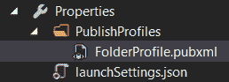
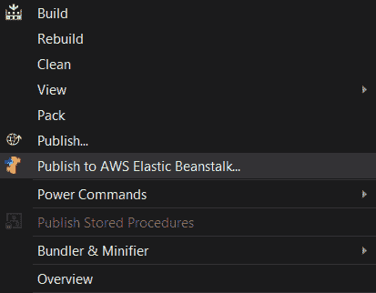
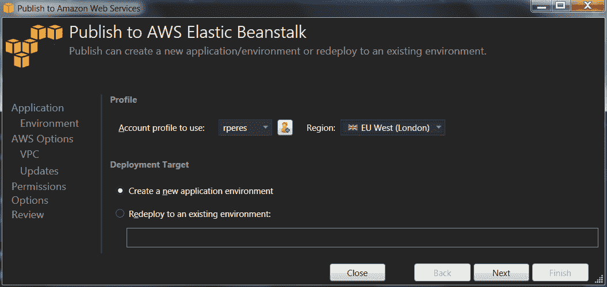
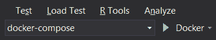
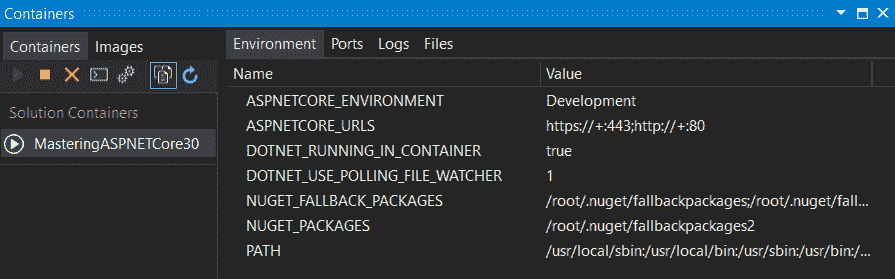
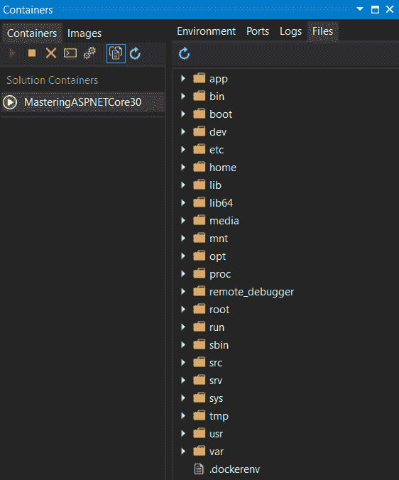

Application Deployment

在阅读了前面的章节之后，一旦您实现了应用并对其进行了测试，并且您对它感到满意，就应该部署它了。这将使它对外开放，或至少部分开放！

在本章中，我们将了解如何做到这一点，并通过涵盖以下主题探讨一些可用选项：

*   手动部署和编译实时更改
*   使用 VisualStudio 部署
*   部署到 IIS
*   部署到 NGINX
*   部署到 Azure
*   部署到**亚马逊网络服务**（**AWS**）
*   部署到 Docker
*   作为 Windows 服务部署

# 技术要求

要实现本章中介绍的示例，您需要.NET Core 3 SDK 和文本编辑器。当然，VisualStudio2019（任何版本）满足所有要求，但您也可以使用 VisualStudio 代码。

如果您将部署到云（Azure 或 AWS），您将需要选择的提供商提供一个可用的帐户。

# 手动部署应用

要手动部署应用，`dotnet`命令行工具提供`publish`命令。简而言之，它所做的是将所有内容打包在一起，从项目文件中获取所有必需的依赖项，构建应用和任何依赖项目，然后将所有输出复制到目标文件夹。它提供了很多选择，但最常见的可能是：

他们正在用户界面上运行。让我们看看如何：

*   `-c | --configuration`：定义构建配置。默认值是 Debug，另一个常用选项是 Release，但当然，您可以创建其他 VisualStudio 配置文件。
*   `-r | --runtime`：在自包含部署的情况下，发布给定运行时的应用；默认情况下，使用目标计算机上可用的任何运行时。请参阅*自包含部署和运行时*部分中的说明。
*   `-f | --framework`：设置目标框架。参见*设置目标框架*一节中的以下列表。
*   `-o | --output`：设置目标输出文件夹的路径。
*   `-h | --help`：显示使用信息。
*   `-v | --verbosity`：将构建详细级别从`q[uiet]`（无输出）的第一级设置为`m[inimal]`、`n[ormal]`、`d[etailed]`和`diag[nostic]`（最高级别）。默认值为`n[ormal]`。
*   `--force`：即使最后一次恢复成功，也会强制解决所有依赖项；它会有效地删除所有输出文件并再次尝试检索它们。
*   `--self-contained`：这会将.NET Core运行时与应用一起发布，这样就不需要在目标计算机上安装。

For more information, please use the `help` command.

以下是`dotnet publish`命令的示例：

```cs
dotnet publish MyApplication -c Release -o /Output
```

值得一提的是，您还可以通过使用`p`标志将参数传递给 MSBuild：

```cs
dotnet publish /p:Foo=Bar
```

Do not forget that the target environment is defined by the `ASPNETCORE_ENVIRONMENT` environment variable, so you may want to set it before calling `dotnet publish`.

有关受支持的目标框架的列表，请参见下一节。

## 设定目标框架

当您以应用或库中的框架为目标时，您指定了希望应用或库可用的 API 集。如果您的目标是.NET 标准之一，那么您就可以在更广泛的平台上使用它，例如，Linux 将不会有完整的.NET 框架，但它将有.NET 标准。此框架在项目文件中指定，但您可以为特定发布覆盖它。

用于 framework 命令的名字对象如下所示：

| **目标框架** | **名称** |
| .NET 标准 | `netstandard1.0``netstandard1.1``netstandard1.2``netstandard1.3``netstandard1.4``netstandard1.5``netstandard1.6``netstandard2.0``netstandard2.1` |
| .NET Core | `netcoreapp1.0``netcoreapp1.1``netcoreapp2.0``netcoreapp3.0``netcoreapp3.1 LTS` |

设置框架的示例如下：

```cs
dotnet publish MyApplication -c Release -o /Output -f netcoreapp3.0
```

For your information, I have only listed the most useful ones; you can find the full (and updated) list at: [https://docs.microsoft.com/en-us/dotnet/standard/frameworks](https://docs.microsoft.com/en-us/dotnet/standard/frameworks).

现在让我们看看支持的运行时。

## 自包含部署和运行时

如果您为您的应用指定目标**运行时**，那么您也将默认的**自包含**设置为**真**。这意味着发布包将包含运行所需的所有内容。这有一些优点也有一些缺点。

其优点如下：

*   您可以完全控制应用将运行的.NET 版本。
*   您可以放心，目标服务器将能够运行您的应用，因为您正在提供运行时。

以下是缺点：

*   部署包的大小将更大，因为它包括运行时；如果您部署了许多具有自己运行时的不同应用，这可能会占用大量磁盘空间。
*   您需要事先指定目标平台。

与**运行时**命令一起使用的名称由以下内容组成：

*   目标操作系统名字对象
*   版本
*   建筑

这些示例包括`ubuntu.14.04-x64`、`win7-x64`和`osx.10.12-x64`。有关完整列表和一般规格，请参考[https://docs.microsoft.com/en-us/dotnet/core/rid-catalog](https://docs.microsoft.com/en-us/dotnet/core/rid-catalog) 。

You may want to have a look at [https://docs.microsoft.com/en-us/aspnet/core/publishing](https://docs.microsoft.com/en-us/aspnet/core/publishing) and [https://docs.microsoft.com/en-us/dotnet/core/deploying](https://docs.microsoft.com/en-us/dotnet/core/deploying) for a more in-depth introduction to deploying ASP.NET Core applications.

最后，下一个主题是监视应用的更改并实时重建它们。

## 实时重建

一个`dotnet`命令，它提供了一种功能，通过该功能，它可以实时监控代码的任何更改，并在代码更改为`dotnet watch`时自动构建代码。您可以在：[上阅读相关信息 https://docs.microsoft.com/en-us/aspnet/core/tutorials/dotnet-watch](https://docs.microsoft.com/en-us/aspnet/core/tutorials/dotnet-watch) 。

简而言之，要使用它，您需要在`.csproj`文件中将`Microsoft.DotNet.Watcher.Tools`包添加到您的项目中：

```cs
<ItemGroup>
    <PackageReference Include="Microsoft.DotNet.Watcher.Tools" Version="2.0.2" />
</ItemGroup>
```

在此之后，您将运行`dotnet watch`，而不是发出`dotnet run`命令：

```cs
dotnet watch run
```

命令行就足够了；让我们转到 Visual Studio。

# 使用 VisualStudio 部署

大多数时候（至少对我来说），我们使用 VisualStudio 进行所有的开发和发布工作。Visual Studio 中也提供了`dotnet publish`的所有选项。我们需要创建发布配置文件，这可以通过在 Visual Studio 中右键单击项目并单击发布来实现，如以下屏幕截图所示：


在此之后，我们需要从文件系统、FTP、Web 部署或 Web 部署包中选择发布方法（稍后将详细介绍这两种方法）。

无论`publish`方法如何，我们都可以通过点击设置来配置常用发布选项，如下所示：


For a more in-depth guide, please refer to [https://docs.microsoft.com/en-us/aspnet/core/publishing/web-publishing-vs](https://docs.microsoft.com/en-us/aspnet/core/publishing/web-publishing-vs).

Visual Studio 发布配置文件存储在`Properties\PublishProfiles`文件夹中：



本节是关于使用 VisualStudio 进行部署的，但是如果应用部署到 IIS，我们也可以使用它进行部署。让我们看看如何。

# 通过 IIS 部署

应用部署最常见的服务器可能是**互联网信息服务器**（**IIS**）。实际上，IIS 只是充当**反向代理**，将 HTTP/HTTPS 流量定向到.NET Core主机。IIS 主机支持 Windows 7 及以上版本。它需要**ASP.NET Core模块**，默认情况下与 Visual Studio 2019 和.NET Core SDK 一起安装。

为什么要使用 IIS 而不仅仅是 Kestrel 或 HTTP.sys？IIS 为您提供了更多选项，例如：

*   **身份验证**：例如，您可以轻松设置 Windows 身份验证。
*   **日志记录**：您可以配置 IIS 为所有访问生成日志。
*   **自定义响应**：IIS 可以为每个 HTTP 响应代码提供不同的页面。
*   **安全**：您可以为您的站点设置 HTTPS，配置 SSL 证书非常容易，IIS 管理器甚至可以生成虚拟证书。
*   **管理**：使用**IIS 管理器**工具，即使从远程服务器，也可以轻松管理。

您应该在目标计算机上安装 IIS/IIS 管理器，并在主机创建代码中添加对 IIS 宿主的支持。默认情况下，ASP.NET Core 3.x 已经做到了这一点，因此无需进行任何更改。

您可以使用 Visual Studio 在运行时或发布时自动为您创建网站，也可以自己创建网站；您只需记住以下两件事：

*   应用池不应使用.NET CLR 版本（**无托管代码**。
*   应启用`AspNetCoreModule`模块。

如果您还记得的话，有两种发布方法是 WebDeploy 和 WebDeployPackage。Web 部署使用可通过 Web 部署工具（[安装的**Web 部署代理服务****MsDepSvc**Windows 服务 https://www.iis.net/downloads/microsoft/web-deploy](https://www.iis.net/downloads/microsoft/web-deploy) ）。如果它正在运行，您可以让 Visual Studio 直接连接到远程（或本地）站点，并在那里安装 web 项目（如果选择 web 部署方法），如下所示：


另一方面，Web 部署包生成一个包含可通过 IIS 管理器控制台部署的包的`.zip`文件；只需右键单击任何站点并选择部署|导入服务器或站点包…：


您可能已经注意到由`dotnet publish`（或 Visual Studio 发布向导）生成的`Web.config`文件。它不是由 ASP.NET Core使用，而是由`AspNetCoreModule`模块使用。仅当您希望在 IIS 之后托管应用时才需要此选项。您可以调整一些设置，例如启用文件的输出日志记录：

```cs
<?xml version="1.0" encoding="utf-8"?>
<configuration>
  <system.webServer>
    <aspNetCore
      processPath="dotnet"
      arguments=".\MyApplication.dll"
      stdoutLogEnabled="true"
      stdoutLogFile=".\logs\stdout.log" />
  </system.webServer>
</configuration>
```

在这里，我更改了`stdoutLogEnabled`和`stdoutLogFile`属性；这应该很容易理解。

Once again, for the full documentation, please refer to [https://docs.microsoft.com/en-us/aspnet/core/publishing/iis](https://docs.microsoft.com/en-us/aspnet/core/publishing/iis).

现在让我们来看看如何使用 NGINX 将请求代理到 ASP.NET Core。

# 使用 NGINX 部署

**NGINX**是 Unix 和 Linux 系列操作系统中非常流行的反向代理服务器。与 IIS 一样，它提供了 ASP.NET Core主机无法提供的有趣功能，如缓存请求、直接从文件系统提供文件服务、SSL 终止等。您可以将其配置为将请求转发到独立运行的 ASP.NET Core应用。需要修改此应用以确认转发的标头，如下所示：

```cs
app.UseForwardedHeaders(new ForwardedHeadersOptions
{
    ForwardedHeaders = 
        ForwardedHeaders.XForwardedFor | 
        ForwardedHeaders.XForwardedProto | 
        ForwardedHeaders.XForwardedHost
});  
```

此代码所做的是从头文件**X-Forwarded-For**（请求客户端 IP 和可能的端口）、**X-Forwarded-Proto**（请求协议）和**X-Forwarded-Host**（请求主机）中提取信息，并将其设置在`HttpContext.Connection`属性的适当属性中。这是因为 NGINX 剥离了这个请求信息并将其存储在这些头中，所以 ASP.NET Core 需要它，并且您可以在您通常期望的地方找到它。

我们还需要配置 NGINX 将请求转发到 ASP.NET Core（`/etc/nginx/sites-available/default`：

```cs
server
{
  listen 80;
  server_name server.com *.server.com;
  location /
  {
    proxy_pass http://localhost:5000;
    proxy_http_version 1.1;
    proxy_set_header Upgrade $http_upgrade;
    proxy_set_header Connection keep-alive;
    proxy_set_header Host $host;
    proxy_set_header X-Forwarded-For $proxy_add_x_forwarded_for;
    proxy_set_header X-Forwarded-Proto $scheme;
    proxy_cache_bypass $http_upgrade;
  }
}
```

此代码设置 NGINX 侦听端口`80`并将请求转发到端口`5000`上的`localhost`。HTTP 版本被设置为`1.1`和一些附加的头（参见前面的.NET 代码）。服务器名称设置为`server.com`，但也接受低于`server.com`的任何内容。

阅读有关 NGINX 的所有信息，网址为：[https://docs.microsoft.com/en-us/aspnet/core/publishing/linuxproduction](https://docs.microsoft.com/en-us/aspnet/core/publishing/linuxproduction) 。

# 部署到 Azure

Microsoft Azure 也是托管您的应用的有力候选。要发布到 Azure，请右键单击项目并选择发布：


创建发布配置文件时，选择 Azure App Service 作为发布目标：


您需要选择所有适当的设置：订阅、资源组、应用服务计划等。

Of course, you need to have a working Azure subscription. There is no need for resource groups or app service plans—these can be created from inside the Visual Studio publish wizard.

如果您需要更多信息，请导航至[https://docs.microsoft.com/en-us/aspnet/core/tutorials/publish-to-azure-webapp-using-vs](https://docs.microsoft.com/en-us/aspnet/core/tutorials/publish-to-azure-webapp-using-vs) 。

# 部署到 AWS

AWS 是 Microsoft Azure 的亚马逊竞争对手。它是一个云提供商，提供与 Azure 非常相似的功能。VisualStudio 可以通过**AWS Visual Studio 工具包**与之交互，可从此处免费获得：[https://marketplace.visualstudio.com/items?itemName=AmazonWebServices.AWSToolkitforVisualStudio2017](https://marketplace.visualstudio.com/items?itemName=AmazonWebServices.AWSToolkitforVisualStudio2017) 。当然，您需要在 AWS 拥有一个工作帐户。

我们将了解如何将 ASP.NET Core应用部署到 AWS Elastic Beanstalk，这是亚马逊为 web 应用提供的易于使用的托管和扩展服务：

1.  要部署到 Elastic Beanstalk，我们必须首先使用 AWS Elastic Beanstalk 控制台（[创建一个环境 https://console.aws.amazon.com/elasticbeanstalk](https://console.aws.amazon.com/elasticbeanstalk) ）。
2.  然后，我们需要压缩所有应用的内容，减去任何第三方 NuGet 软件包或二进制输出，然后将它们上传到 AWS。幸运的是，用于 VisualStudio 的 AWS 工具包为我们完成了所有这一切！只需在解决方案资源管理器中的项目上单击鼠标右键，然后选择“发布到 AWS Elastic Beanstalk”：



3.  然后，您可以指定部署的所有方面，或者只使用默认值，如下所示：



这是对 AWS 部署的一个非常基本的介绍。接下来是 Docker。

# 与 Docker 一起部署

**Docker**在快速创建和销毁容器时，提供了一个非常好的选择，具有相同的精确内容。通过这种方式，你可以非常肯定事情会像你期望的那样工作！

Docker 支持内置于 ASP.NET Core项目中。当您创建一个时，您将在项目中获得一个**Dockerfile**。它将包含如下内容：

```cs
FROM mcr.microsoft.com/dotnet/core/aspnet:3.1
ARG source
WORKDIR /app
EXPOSE 80
COPY ${source:-obj/Docker/publish} .
ENTRYPOINT ["dotnet", "MyApplication.dll"]
```

请注意一个名为`docker-compose`的额外解决方案文件夹。Docker Compose 是一个用于定义和运行多容器 Docker 应用的工具，您可以在以下网址阅读：[https://docs.docker.com/compose](https://docs.docker.com/compose) 。在此文件夹中，您将找到三个文件：

*   `docker-compose.ci.build.yml`：用于**持续集成**（**CI**的 Docker 合成文件
*   `docker-compose.yml`：用于定义要构建和运行的图像集合的基本 Docker Compose 文件
*   `docker-compose.override.yml`：开发环境对`docker-compose.yml`的覆盖

您可以为其他环境创建类似于`docker-compose.override.yml`的文件。

工具栏将为 Docker 添加额外选项：



你可以使用 Docker 运行甚至调试你的应用；它是透明的。VisualStudio2019 引入了对容器的出色支持。在以下屏幕截图中，您可以看到定义的环境：



以下是文件系统：



以下屏幕截图显示了执行日志：


即使您的解决方案中有多个 Docker 项目，您也可以在调试时无缝地从一个项目跳到另一个项目，这非常酷！在构建项目时，您只需确保 Docker 已提前运行，并且 Docker 映像（`mcr.microsoft.com/dotnet/core/aspnet:3.1`在本地可用。

Docker images for ASP.NET Core are listed at [https://hub.docker.com/_/microsoft-dotnet-core-aspnet](https://hub.docker.com/_/microsoft-dotnet-core-aspnet).
As of now, running under Docker requires **Docker For Windows** ([https://www.docker.com/docker-windows](https://www.docker.com/docker-windows)).

有关更多信息，请跳至[https://docs.microsoft.com/en-us/aspnet/core/publishing/docker](https://docs.microsoft.com/en-us/aspnet/core/publishing/docker) 和[https://docs.microsoft.com/en-us/aspnet/core/publishing/visual-studio-tools-for-docker](https://docs.microsoft.com/en-us/aspnet/core/publishing/visual-studio-tools-for-docker) 。

Docker 是现代开发的无价工具，也是云开发的根源，所以我强烈建议您看看。但由于我们必须使用其他设置，现在让我们看看如何将我们的应用部署为 Windows 服务。

# 作为 Windows 服务部署

部署应用的另一种选择是将 ASP.NET Core应用作为 Windows 服务托管。当然，这本质上是不可移植的，因为 Windows 服务只在 Windows 上可用（当然，Windows Docker 容器确实存在）。无论如何，有时，特别是对于简单的应用/API，这是最好的选择，因为您可以根据自己的喜好轻松启动和停止服务，并且可以轻松查看它们是否从用户界面运行。让我们看看如何：

1.  首先添加`Microsoft.AspNetCore.Hosting.WindowsServices`和`Microsoft.Extensions.Hosting.WindowsServices`NuGet 包。
2.  然后，修改你的`Program`类如下：

```cs
Host
    .CreateDefaultBuilder(args)
    .UseWindowsService()
    .ConfigureWebHostDefaults(builder =>
    {
        builder.UseStartup<Startup>();
    });
```

3.  然后，使用`dotnet publish`将您的应用部署到您机器上的文件夹中，然后在 Windows 中注册并启动服务：

```cs
sc create MyService binPath="C:\Svc\AspNetCoreService.exe"
sc start MyService
```

总之，这将实现以下功能：

*   将`WindowsServiceLifetime`设置为应用的`IHostLifetime`。
*   将当前目录设置为`AppContext.BaseDirectory`。
*   启用以应用名称作为事件源名称的事件日志记录。

页面位于[https://docs.microsoft.com/en-us/aspnet/core/hosting/windows-service](https://docs.microsoft.com/en-us/aspnet/core/hosting/windows-service) 包含所有这些信息和更多信息；一定要看。

# 总结

本章将帮助您更好地了解可用的不同托管选项以及如何使用它们。特别是 Azure、AWS 和 Docker 可能非常有用；Azure 和 AWS 都完全支持 DOCKER，所以确保你把它们当作部署策略的一部分！

即使使用 VisualStudio 部署应用很方便，但知道如何使用命令行也是很有用的，这基本上就是 VisualStudio 所做的。

大多数时候，我们 Windows 开发人员将部署到 IIS；因此，您应该学习如何使用 Web 部署工具服务和用户界面。您可以很容易地将 web 部署包作为`.zip`文件分发。对于其他操作系统的用户来说，NGINX 是一个受欢迎的选择，拥有大量的用户社区。

Docker 是街区里新来的（很酷的）孩子；它在创建容器方面提供了前所未有的便利性，您可以选择容器并将其部署到 Azure、AWS 或其他云提供商，或者只在本地基础设施上运行。

Windows 服务有时对简单的事情很有用；你可以随时开始和停止它，你不需要太在意它。我不希望你能充分利用它们，但很高兴知道这个选项是可用的。

本书到此结束。我希望你喜欢它——我当然喜欢写它！请让我和 Packt 知道您对它的想法，以及在未来的版本中可以改进的地方！非常感谢你的陪伴！

# 问题

因此，在本章结束时，您应该了解以下内容：

1.  使用 IIS 向外界公开应用有什么好处？
2.  为什么要将 web 应用作为 Windows 服务托管？
3.  使用 Docker 的优势是什么？
4.  什么是自包含部署？
5.  是否可以在运行时检测更改并自动重新编译代码？
6.  我们可以使用命令行部署还是需要 VisualStudio？
7.  您可以从 VisualStudio 内部部署到哪些云提供商？