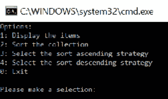
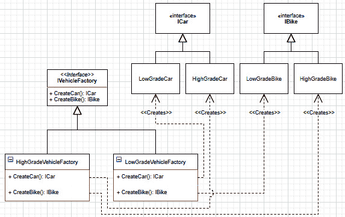
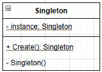

# *第 6 章*：理解策略、抽象工厂和单例设计模式

本章使用 GoF 中一些经典、简单但功能强大的设计模式探索对象创建。这些模式允许开发人员封装行为、集中对象创建、增加设计灵活性或控制对象生命周期。此外，它们很可能在您将来直接或间接构建的每个软件中使用。

戈夫

ErichGamma、Richard Helm、Ralph Johnson 和 John Vlissides 是*设计模式：可重用面向对象软件的元素*（1994）的作者，也称为**GoF**（**GoF**。在那本书中，他们介绍了 23 种设计模式，其中一些我们将在本书中介绍。

为什么它们那么重要？因为它们是健壮对象组合的构建块，有助于创建灵活性和可靠性。此外，在[*第 7 章*](07.html#_idTextAnchor124)*深入依赖注入*中，我们将利用依赖注入使这些模式更加强大！

但首先要做的是。本章将介绍以下主题：

*   战略设计模式
*   简单介绍几个 C#特性
*   抽象工厂设计模式
*   单例设计模式

# 战略设计模式

策略模式是一种行为设计模式，允许我们在运行时更改对象行为。我们也可以使用此模式来组合复杂的对象树，并依靠它来遵循**打开/关闭原则**（**OCP**），而无需太多努力。作为最后一点的后续，战略模式在*组合而非继承*思维方式中起着重要作用。在本章中，我们重点关注战略模式的行为部分。在下一章中，我们将介绍如何使用策略模式动态组合系统。

## 目标

策略模式的目标是从需要它的宿主类（上下文）中提取算法（策略）。这允许消费者决定在运行时使用的策略（算法）。

例如，我们可以设计一个从两种不同类型的数据库获取数据的系统。然后，我们可以对该数据应用相同的逻辑，并使用相同的用户界面来显示它。为了实现这一点，我们可以使用策略模式创建两个策略，一个名为`FetchDataFromSql`，另一个名为`FetchDataFromCosmosDb`。然后我们可以在`context`类中插入运行时需要的策略。这样，当消费者呼叫`context`时，`context`不需要知道数据来自何处、数据是如何获取的或使用了什么策略；它只获取需要工作的内容，将获取职责委托给抽象的策略。

## 设计

在进一步的解释之前，让我们来看看下面的类图：


图 6.1–策略模式类图

战略模式的组成部分如下：

*   `Context`是将一个或多个操作委托给`IStrategy`实现的类。
*   `IStrategy`是定义策略的接口。
*   `ConcreteStrategy1`和`ConcreteStrategy2`代表`IStrategy`接口的一个或多个不同的具体实现。

在下图中，我们将探讨运行时发生的情况。*actor*表示使用`Context`对象的任何代码。


图 6.2–策略模式序列图

当使用者调用`Context.SomeOperation()`方法时，它不知道执行了哪个实现，这是该模式的一个重要部分。`Context`也不应该知道正在使用的策略。它应该通过接口执行它，而不需要知道超过该点的实现。这就是策略模式的优势：它将实现从`Context`和消费者两方面抽象出来。

笔记

我们甚至可以概括最后一句话，并将其扩展到任何接口的使用。使用接口通过依赖抽象消除了使用者和实现之间的联系。

## 项目：战略

**上下文**：我们想用不同的策略对集合进行排序。最初，我们希望支持按升序或降序对列表中的元素进行排序。

为了实现这一目标，我们需要实施以下构建模块：

*   **上下文**是`SortableCollection`类。
*   **策略**是`ISortStrategy`接口。
*   The concrete strategies are:

    a） `SortAscendingStrategy`

    b） `SortDescendingStrategy`

consumer 是一个小程序，允许用户选择策略、对集合排序和显示项目。让我们从`ISortStrategy`界面开始：

```cs
public interface ISortStrategy
{
    IOrderedEnumerable<string> Sort(IEnumerable<string> input);
} 
```

该接口只包含一个方法，该方法需要字符串集合作为输入，并返回有序的字符串集合。现在让我们检查两个实现：

```cs
public class SortAscendingStrategy : ISortStrategy
{
    public IOrderedEnumerable<string> Sort(IEnumerable<string> input) 
        => input.OrderBy(x => x);
}
public class SortDescendingStrategy : ISortStrategy
{
    public IOrderedEnumerable<string> Sort(IEnumerable<string> input) 
        => input.OrderByDescending(x => x);
}
```

两种实现都非常简单，使用 LINQ 对输入进行排序并直接返回结果。这两种实现都使用表达体方法，我们在[*第 4 章*](04.html#_idTextAnchor056)*中提到了使用 Razor*的 MVC 模式。

提示

当使用表达体方法时，请确保不会使同事难以阅读该方法。

下一个要检查的构件是`SortableCollection`类。它本身不是一个集合（它没有实现`IEnumerable`或其他集合接口），但它由项目组成，可以使用`ISortStrategy`对它们进行排序，如下所示：

```cs
public sealed class SortableCollection
{
    public ISortStrategy SortStrategy { get; set; }
    public IEnumerable<string> Items { get; private set; }
    public SortableCollection(IEnumerable<string> items)
    {
        Items = items;
    }
    public void Sort()
    {
        if (SortStrategy == null)
        {
            throw new NullReferenceException("Sort strategy not found.");
        }
        Items = SortStrategy.Sort(Items);
    }
}
```

这个类是迄今为止最复杂的一个，所以让我们更深入地看一看：

*   `SortStrategy`属性包含对`ISortStrategy`实现的引用（可以是`null`。
*   `Items`属性包含对`SortableCollection`类中包含的字符串集合的引用。
*   我们在创建`SortableCollection`实例时，通过其构造函数设置初始`IEnumerable<string>`。
*   `Sort`方法使用当前`SortStrategy`对`Items`进行排序。当没有策略设置时，抛出一个`NullReferenceException`。

有了这些代码，我们可以看到战略模式在起作用。`SortStrategy`属性表示当前算法，与`ISortStrategy`契约有关，该契约可在运行时更新。`SortableCollection.Sort()`方法将工作委托给`ISortStrategy`实施（具体策略）。因此，更改`SortStrategy`属性的值会导致`Sort()`方法的行为发生变化，这使得该模式非常强大但简单。

让我们看看`MyConsumerApp`，这是一个使用前面代码的控制台应用：

```cs
public class Program
{
    private static readonly SortableCollection _data = new SortableCollection(new[] { "Lorem", "ipsum", "dolor", "sit", "amet." });
```

`_data`实例表示**上下文**，这是我们可排序的项集合。接下来，一个空的`Main`方法：

```cs
    public static void Main(string[] args) { /*...*/ }
```

为了将重点放在模式上，我去掉了控制台逻辑，这与现在无关。

```cs
    private static string SetSortAsc()
    {
        _data.SortStrategy = new SortAscendingStrategy();
        return "The sort strategy is now Ascending!";
    }
```

前面的方法将**策略**设置为`SortAscendingStrategy`的新实例。

```cs
    private static string SetSortDesc()
    {
        _data.SortStrategy = new SortDescendingStrategy();
        return "The sort strategy is now Descending!";
    }
```

前面的方法将**策略**设置为`SortDescendingStrategy`的新实例。

```cs
    private static string SortData()
    {
        try
        {
            _data.Sort();
            return "Data sorted!";
        }
        catch (NullReferenceException ex)
        {
            return ex.Message;
        }
    }
```

`SortData`方法调用`Sort()`方法，该方法将调用委托给可选的`ISortStrategy`实现。

```cs
    private static string PrintCollection()
    {
        var sb = new StringBuilder();
        foreach (var item in _data.Items)
        {
            sb.AppendLine(item);
        }
        return sb.ToString();
    }
}
```

最后一个方法在控制台中显示集合，以直观地验证代码的正确性。

运行程序时，会出现以下菜单：



图 6.3–显示选项菜单的输出

当用户选择一个选项时，程序调用适当的方法，如前所述。

执行程序时，如果显示项目（1），它们将按初始顺序显示。如果分配策略（3 或 4），对集合（2）进行排序，然后再次显示列表，则顺序将发生更改，并且根据所选算法的不同而有所不同。

选择以下选项时，让我们分析事件的顺序：

1.  选择排序提升策略（**3**。
2.  Sort the collection (**2**).

    接下来，是一个表示以下内容的序列图：


图 6.4–使用“升序排序”策略对项目进行排序的序列图（选项 3 和选项 2）

前面的图显示了`Program`创建策略并将其分配给`SortableCollection`。然后，当`Program`调用`Sort()`方法时，`SortableCollection`实例将排序计算委托给`SortAscendingStrategy`类实现的底层算法，也称为**策略**。

从模式的角度来看，`SortableCollection`类，也称**上下文**，负责保持当前**策略**并使用它。

## 结论

策略设计模式非常有效地将责任委托给其他对象。它还允许拥有一个丰富的界面（上下文），其中包含在程序执行过程中可能发生变化的行为。

战略不必直接暴露；它也可以是类的私有，向外部世界（消费者）隐藏它的存在；我们将在下一章对此进行更多讨论。同时，战略模式非常有助于我们遵循**坚实的**原则：

*   **S**：它有助于将职责提取到外部类，并在以后交替使用它们。
*   **O**：通过在运行时更改当前策略，允许在不更新代码的情况下扩展类。
*   **L**：不依赖继承。此外，它在*组合重于继承原则*中扮演着重要角色，帮助我们完全避免继承，同时也避免了 LSP。
*   **I**：通过创建基于精益和专注界面的小型战略，该战略模式是尊重 ISP 的极好促成因素。
*   **D**：依赖项的创建从使用策略的类（上下文）移动到类的使用者。这使得上下文依赖于抽象而不是实现，从而颠倒了控制流。

在进入抽象工厂模式之前，我们将了解一些 C#特性，以帮助编写更干净的代码。

# 简单介绍几个 C#功能

让我们回到策略模式代码示例的`Main`方法。在那里，我使用了一些更新的C#特性。我省略了那里的实现，因为它与模式本身无关，但下面是缺失的代码，用于分析它：

```cs
public static void Main(string[] args)
{
    string input = default;
    do
    {
        Console.Clear();
        Console.WriteLine("Options:");
        Console.WriteLine("1: Display the items");
        Console.WriteLine("2: Sort the collection");
        Console.WriteLine("3: Select the sort ascending strategy");
        Console.WriteLine("4: Select the sort descending strategy");
        Console.WriteLine("0: Exit");
        Console.WriteLine("--------------------------------------");
        Console.WriteLine("Please make a selection: ");
        input = Console.ReadLine();
        Console.Clear();
        var output = input switch
 {
 "1" => PrintCollection(),
 "2" => SortData(),
 "3" => SetSortAsc(),
 "4" => SetSortDesc(),
 "0" => "Exiting",
 _   => "Invalid input!"
 };
        Console.WriteLine(output);
        Console.WriteLine("Press **enter** to continue.");
        Console.ReadLine();
    } while (input != "0");
}
```

## 默认文字表达式（C#7.1）

探索的第一个 C#特性是在 C#7.1 中引入的，被称为**默认字面表达式**。它允许我们减少使用**默认值表达式**所需的代码量。

在此之前，我们需要写以下内容：

```cs
string input = default(string);
```

或者这个：

```cs
var input = default(string);
```

现在，我们可以这样写：

```cs
string input = default;
```

它对于可选参数非常有用，例如：

```cs
public void SomeMethod(string input1, string input2 = default)
{
    // …
}
```

在该代码块中，我们可以向该方法传递一个或两个参数。当我们省略`input2`参数时，它被实例化为`default(string)`。`string`的默认值为`null`。

## 开关表达式（C#8）

要探索的第二个 C#特性是在 C#8 中引入的，名为**开关表达式**。在此之前，我们需要写以下内容：

```cs
string output = default;
switch (input)
{
    case "1":
        output = PrintCollection();
        break;
    case "2":
        output = SortData();
        break;
    case "3":
        output = SetSortAsc();
        break;
    case "4":
        output = SetSortDesc();
        break;
    case "0":
        output = "Exiting";
        break;
    default:
        output = "Invalid input!";
        break;
}
```

现在，我们可以这样写：

```cs
var output = input switch
{
    "1" => PrintCollection(),
    "2" => SortData(),
    "3" => SetSortAsc(),
    "4" => SetSortDesc(),
    "0" => "Exiting",
    _   => "Invalid input!"
};
```

这使得代码更短、更简单。一旦你习惯了，我发现这种新方法更容易阅读。您可以将开关表达式想象为`switch`返回一个值。

## 丢弃（C#7）

**丢弃**是我们将在这里探讨的最后一个 C#功能。它是在公元七世纪引入的。在这种情况下，它变成了`switch`的`default`情况（见突出显示的行）：

```cs
var output = input switch
{
    "1" => PrintCollection(),
    "2" => SortData(),
    "3" => SetSortAsc(),
    "4" => SetSortDesc(),
    "0" => "Exiting",
 _   => "Invalid input!"
};
```

丢弃（`_`）也可用于其他场景。它是一个不能使用的特殊变量，一个占位符，就像一个不存在的变量一样。通过使用丢弃，您不会为该变量分配内存，这有助于优化您的应用。

当解构仅使用其部分成员的元组时，它也很有用。当使用您不想使用的`out`参数调用方法时，它也非常方便，例如：

```cs
if (bool.TryParse("true", out _))
{
    /* ... */
}
```

在最后一个代码块中，我们只想在输入是布尔值的情况下执行一些操作，但我们不使用布尔值本身，这对于丢弃变量来说是一个很好的方案。

我现在跳过元组，因为我们将在下一章中讨论它们。

# 抽象工厂设计模式

抽象工厂设计模式是 GoF 的一种创造性设计模式。我们使用创造模式来创建其他对象，工厂是一种非常流行的方式。

## 目标

抽象工厂模式用于抽象对象族的创建。它通常意味着在该族中创建多个对象类型。族是一组相关或从属对象（类）。

让我们考虑一下如何创建车辆。车辆有多种类型，每种类型都有多种型号。我们可以使用抽象工厂模式，使我们的生活更容易这种类型的场景。

笔记

还有*工厂方法*模式，其重点是创建单一类型的对象，而不是族。我们在这里只讨论抽象工厂，但在本书后面部分我们使用了其他类型的工厂。

## 设计

使用抽象工厂，消费者要求一个抽象对象并得到一个。工厂是一个抽象，产生的对象也是抽象，将对象创建与消费者分离。这还允许我们添加或删除对象族，而不会影响使用者。

如果我们考虑一下汽车，我们就有能力制造每种类型汽车的低档和高档版本。让我们来看一个表示这个的类图：



图 6.5-抽象工厂类图

在图中，我们有以下内容：

*   `IVehicleFactory`是一个抽象工厂，定义了两种方法：一种是创建`ICar`类型的汽车，另一种是创建`IBike`类型的自行车。
*   `HighGradeVehicleFactory`是抽象工厂的一个实现，处理高级车辆创建。此混凝土工厂返回类型为`HighGradeCar`或`HighGradeBike`的实例。
*   `LowGradeVehicleFactory`是我们抽象工厂的一个实现，处理低级车辆的创建。此混凝土工厂返回类型为`LowGradeCar`或`LowGradeBike`的实例。
*   `LowGradeCar`和`HighGradeCar`是`ICar`的两种实现方式。
*   `LowGradeBike`和`HighGradeBike`是`IBike`的两种实现方式。

根据该图，消费者使用`IVehicleFactory`接口，不应该知道下面使用的具体工厂，从而抽象出车辆创建过程。

## 项目名称：AbstractVehicleFactory

**上下文**：我们需要支持创建多种类型的车辆。我们还需要能够在不影响系统的情况下添加可用的新类型。首先，我们只支持高档和低档车辆。此外，该计划只支持汽车和自行车的创作。

为了我们的演示，车辆只是空的类和接口：

```cs
public interface ICar { }
public interface IBike { }
public class LowGradeCar : ICar { }
public class LowGradeBike : IBike { }
public class HighGradeCar : ICar { }
public class HighGradeBike : IBike { }
```

现在让我们看看我们要研究的部分——工厂：

```cs
public interface IVehicleFactory
{
    ICar CreateCar();
    IBike CreateBike();
}
public class LowGradeVehicleFactory : IVehicleFactory
{
    public IBike CreateBike() => new LowGradeBike();
    public ICar CreateCar() => new LowGradeCar();
}
public class HighGradeVehicleFactory : IVehicleFactory
{
    public IBike CreateBike() => new HighGradeBike();
    public ICar CreateCar() => new HighGradeCar();
}
```

工厂是能够很好地描述模式的简单实现：

*   `LowGradeVehicleFactory`打造低档车。
*   `HighGradeVehicleFactory`打造高档车。

消费者是一个 xUnit 测试项目。单元测试通常是您的第一个消费者，尤其是在您进行 TDD 时。

`AbstractFactoryBaseTestData`类封装了我们的一些测试数据类的实用程序，与我们的模式研究无关。尽管如此，它手头有所有的代码是有用的，而且它是一个非常小的类；让我们从这里开始：

```cs
public abstract class AbstractFactoryBaseTestData : IEnumerable<object[]>
{
    private readonly TheoryData<IVehicleFactory, Type> _data = new TheoryData<IVehicleFactory, Type>();
    protected void AddTestData<TConcreteFactory, TExpectedVehicle>() 
        where TConcreteFactory : IVehicleFactory, new()
    {
        _data.Add(new TConcreteFactory(), typeof(TExpectedVehicle));
    }
    public IEnumerator<object[]> GetEnumerator() => _data.GetEnumerator();
    IEnumerator IEnumerable.GetEnumerator() => GetEnumerator();
}
```

这个类是一个`IEnumerable<object[]>`类，它有一个`TheoryData<T1, T2>`类的私人集合，还有一个`AddTestData<TConcreteFactory, TExpectedVehicle>()`类用来为我们的理论提供素材的方法。

让我们看一下 To.T0.具体测试类 ALE T1 及其理论：

```cs
public class AbstractFactoryTest
{
    [Theory]
    [ClassData(typeof(AbstractFactoryTestCars))]
    public void Should_create_a_Car_of_the_specified_type(IVehicleFactory vehicleFactory, Type expectedCarType)
    {
        // Act
        ICar result = vehicleFactory.CreateCar();
        // Assert
        Assert.IsType(expectedCarType, result);
    }
    [Theory]
    [ClassData(typeof(AbstractFactoryTestBikes))]
    public void Should_create_a_Bike_of_the_specified_type(IVehicleFactory vehicleFactory, Type expectedBikeType)
    {
        // Act
        IBike result = vehicleFactory.CreateBike();
        // Assert
        Assert.IsType(expectedBikeType, result);
    }
}
```

在前面的代码中，我们有两种理论，每种理论都使用由`[ClassData(...)]`属性定义的类中包含的数据（请参见突出显示的代码）。测试运行程序使用该数据填充测试方法参数的值。因此，测试运行程序对每组数据执行一次测试。在这种情况下，每个方法运行两次（下面将介绍测试数据）。

每种试验方法的执行如下：

1.  我们使用抽象工厂`IVehicleFactory vehicleFactory`创建`ICar`或`IBike`实例。
2.  We test that instance against the expected concrete type to ensure it is the right type; that type is specified by `Type expectedCarType` or `Type expectedBikeType`, depending on the test method.

    笔记

    我使用`ICar`和`IBike`来输入变量，而不是`var`，以使`result`变量的类型更清晰。在另一种情况下，我会使用`var`来代替。

现在来看`Theory`数据：

```cs
public class AbstractFactoryTestCars : AbstractFactoryBaseTestData
{
    public AbstractFactoryTestCars()
    {
        AddTestData<LowGradeVehicleFactory, LowGradeCar>();
        AddTestData<HighGradeVehicleFactory, HighGradeCar>();
    }
}
public class AbstractFactoryTestBikes : AbstractFactoryBaseTestData
{
    public AbstractFactoryTestBikes()
    {
        AddTestData<LowGradeVehicleFactory, LowGradeBike>();
        AddTestData<HighGradeVehicleFactory, HighGradeBike>();
    }
}
```

抽象了实现细节后，代码就简单明了了。如果我们仔细观察`AbstractFactoryTestCars`类，它会创建两组测试数据：

*   `LowGradeVehicleFactory`表示应该创建一个`LowGradeCar`实例。
*   一个应该创建一个`HighGradeCar`实例的`HighGradeVehicleFactory`。

`AbstractFactoryTestBikes`数据的也是如此：

*   一个应该创建一个`LowGradeBike`实例的`LowGradeVehicleFactory`。
*   一个应该创建一个`HighGradeBike`实例的`HighGradeVehicleFactory`。

我们现在有四个测试。使用以下参数执行两次自行车测试（`Vehicles.AbstractFactoryTest.Should_create_a_Bike_of_the_specified_type`）：

```cs
(vehicleFactory: HighGradeVehicleFactory { }, expectedBikeType: typeof(Vehicles.Models.HighGradeBike))
(vehicleFactory: LowGradeVehicleFactory { }, expectedBikeType: typeof(Vehicles.Models.LowGradeBike))
```

以及使用以下参数执行的两个汽车试验（`Vehicles.AbstractFactoryTest.Should_create_a_Car_of_the_specified_type`）：

```cs
(vehicleFactory: HighGradeVehicleFactory { }, expectedCarType: typeof(Vehicles.Models.HighGradeCar))
(vehicleFactory: LowGradeVehicleFactory { }, expectedCarType: typeof(Vehicles.Models.LowGradeCar))
```

如果我们检查测试的执行，两种测试方法都不知道类型。他们使用抽象工厂（`IVehicleFactory`并根据预期类型测试`result`。

在一个真正的程序中，我们将使用`ICar`或`IBike`实例来执行一些逻辑、计算统计数据，或执行与该程序相关的任何操作。也许那可能是一个赛车游戏或富人的车库管理系统，谁知道呢！

这个项目的重要部分是对象创建过程的抽象。消费者代码不知道这些实现。

## 项目：米德尔顿汽车厂

为了证明我们设计的灵活性，在抽象工厂模式的基础上，让添加一个名为`MiddleEndVehicleFactory`的新混凝土工厂。该工厂应该返回一个`MiddleEndCar`或`MiddleEndBike`实例。再一次，汽车和自行车只是空课（当然，在你的程序中，它们会做一些事情）：

```cs
public class MiddleGradeCar : ICar { }
public class MiddleGradeBike : IBike { }
```

新的`MiddleEndVehicleFactory`看起来与其他两款基本相同：

```cs
public class MiddleEndVehicleFactory : IVehicleFactory
{
    public IBike CreateBike() => new MiddleGradeBike();
    public ICar CreateCar() => new MiddleGradeCar();
}
```

对于测试类，我们不需要更新测试方法（消费者）；我们只需更新设置以添加新的测试数据（请参见粗体显示的行）：

```cs
public class AbstractFactoryTestCars : AbstractFactoryBaseTestData
{
    public AbstractFactoryTestCars()
    {
        AddTestData<LowGradeVehicleFactory, LowGradeCar>();
        AddTestData<HighGradeVehicleFactory, HighGradeCar>();
        AddTestData<MiddleEndVehicleFactory, MiddleGradeCar>();
    }
}
public class AbstractFactoryTestBikes : AbstractFactoryBaseTestData
{
    public AbstractFactoryTestBikes()
    {
        AddTestData<LowGradeVehicleFactory, LowGradeBike>();
        AddTestData<HighGradeVehicleFactory, HighGradeBike>();
        AddTestData<MiddleEndVehicleFactory, MiddleGradeBike>();
    }
}
```

如果我们运行测试，我们现在有六个通过测试（两个理论，每个理论有三个测试用例）。因此，在不更新消费者（T0）等级的情况下，我们能够添加一个新的汽车系列，即中端汽车和自行车；抽象工厂模式的奇妙之处令人赞叹！

## 结论

抽象工厂是一种优秀的模式，可以抽象出对象族的创建，隔离每个族及其具体实现，让消费者不知道（解耦）在运行时创建的族。

在下一章中我们将更多地讨论工厂；同时，让我们看看抽象工厂模式如何帮助我们遵循的**固体**原则：

*   **S**：每个混凝土工厂都有创建一个对象族的唯一责任。您可以将抽象工厂与其他创作模式相结合，例如**原型**和**构建器**模式，以满足更复杂的创作需求。
*   **O**：用户开放扩展，关闭修改；正如我们在“扩展”示例中所做的那样，我们可以添加新族，而无需修改使用它的代码。
*   **L**：我们的目标是合成，因此不需要任何继承，隐式放弃了 LSP 的需要。如果在设计中使用抽象类，则需要密切关注创建新抽象工厂时可能出现的兼容性问题。
*   **I**：通过提取一个创建其他对象的抽象，它使该接口非常专注于一个任务，这与 ISP 一致，以最小的成本创建灵活性。
*   **D**：通过仅依赖于接口，消费者不知道其使用的具体类型。

# 单件设计模式

单例设计模式允许创建和重用类的单个实例。我们可以使用静态类来实现几乎相同的目标，但是使用静态类并不是所有的事情都是可行的。例如，不能使用静态类实现接口或将实例作为参数传递；不能传递静态类，只能直接使用它们。

在我看来，C#中的单例模式是一种反模式。除非我不能依赖依赖依赖注入，否则我看不出这种模式如何发挥作用。这就是说，这是一部经典之作，所以让我们从研究它开始，然后在下一章中讨论更好的替代方案。

以下是我们讨论这种模式的几个原因：

*   在下一章中，它将转换为单例范围。
*   在不知道它的情况下，您无法找到它，也无法尝试删除它——或者避免使用它。
*   这是一个需要探索的简单模式，并导致其他模式，如**环境语境**模式。

## 目标

Singleton模式将类的实例数限制为一个。然后，想法是随后重用相同的实例。单例封装了对象逻辑本身及其创建逻辑。例如，单例模式可以降低实例化内存占用大的对象的成本，因为它只实例化一次。

你能想出一个可靠的原则，在那里被打破吗？

## 设计

此设计模式简单明了，仅限于一个类。让我们从类图开始：



图 6.6–单例模式类图

`Singleton`类由以下内容组成：

*   保存其唯一实例的私有静态字段。
*   创建或返回唯一实例的公共静态`Create()`方法。
*   A private constructor, so external code cannot instantiate it without passing by the `Create` method.

    笔记

    您可以将`Create()`方法命名为任何名称，甚至可以将其删除，我们将在下一个示例中看到。我们可以将其命名为`GetInstance()`，也可以是一个名为`Instance`的静态属性，或者具有任何其他相关名称。

现在，在代码中，它可以转换为以下内容：

```cs
public class MySingleton
{
    private static MySingleton _instance;
    private MySingleton() { }
    public static MySingleton Create()
    {
        if(_instance == default(MySingleton))
        {
            _instance = new MySingleton();
        }
        return _instance;
    }
}
```

我们可以在下面的单元测试中看到，`MySingleton.Create()`总是返回相同的实例：

```cs
public class MySingletonTest
{
    [Fact]
    public void Create_should_always_return_the_same_instance()
    {
        var first = MySingleton.Create();
        var second = MySingleton.Create();
        Assert.Same(first, second);
    }
}
```

瞧！我们有一个工作的单例模式，它非常简单——可能是我能想到的最简单的设计模式。

下面是引擎盖下发生的事情：

1.  消费者第一次调用`MySingleton.Create()`时，会创建`MySingleton`的第一个实例。因为唯一的构造函数是`private`，所以只能从内部创建。您不能从类外部实例化`MySingleton`（使用`new MySingleton()`，因为没有公共构造函数。
2.  然后将第一个实例保存到`_instance`字段以供将来使用。
3.  当使用者第二次调用`MySingleton.Create()`时，它返回`_instance`字段，重用类的上一个（也是唯一一个）实例。

如果您希望您的单例是线程安全的，您可能希望`lock`实例创建，如下所示：

```cs
public class MySingletonWithLock
{
    private readonly static object _myLock = new object();
    private static MySingletonWithLock _instance;
    private MySingletonWithLock() { }
    public static MySingletonWithLock Create()
    {
        lock (_myLock)
        {
            if (_instance == default(MySingletonWithLock))
            {
                _instance = new MySingletonWithLock();
            }
        }
        return _instance;
    }
}
```

## 另一种（更好的）方式

以前，我们使用了实现单例模式的“漫长道路”，必须实现线程安全机制。现在，经典已经过去了。我们可以将其缩短以摆脱`Create()`方法，如下所示：

```cs
public class MySimpleSingleton
{
    public static MySimpleSingleton Instance { get; } = new MySimpleSingleton();
    private MySimpleSingleton() { }
}
```

这样，您就可以通过**单例**实例的`Instance`属性直接使用它，如下所示：

```cs
MySimpleSingleton.Instance.SomeOperation();
```

我们可以通过执行以下测试方法来证明该声明的正确性：

```cs
[Fact]
public void Create_should_always_return_the_same_instance()
{
    var first = MySimpleSingleton.Instance;
    var second = MySimpleSingleton.Instance;
    Assert.Same(first, second);
}
```

通过这样做，我们的**单例**变得线程安全，因为属性初始值设定项创建**单例**实例，而不是将其嵌套在`if`语句中。通常最好尽可能将职责委托给语言或框架。

当心箭头操作符

使用箭头操作符`=>`初始化`Instance`属性可能很有诱惑力，比如：`public static MySimpleSingleton Instance => new MySimpleSingleton();`，但这样做每次都会返回一个新实例。这将破坏我们想要实现的目标。另一方面，属性初始值设定项只运行一次。

使用静态构造函数也是一种有效的线程安全的替代方法，再次将任务委托给该语言。

## 代码气味：环境背景

**单例**模式的最后实现将我们引向**环境上下文**模式。我们甚至可以将环境上下文称为反模式，但我们只需声明它是一种相应的代码气味。

出于多种原因，我不喜欢周围的环境。首先，我尽我所能远离任何全球性的事物。Globals 一开始非常方便，因为它们易于使用。它们总是在那里，需要时随时可以使用：简单。然而，它们在灵活性和可测试性方面会带来许多缺点。

使用环境上下文时，会发生以下情况：

*   系统很可能会变得**不太灵活**。全局对象更难替换，并且不能轻松地替换为另一个对象。并且实现不能基于其使用者而有所不同。
*   全局对象更难模拟，这可能导致系统**更难测试**。
*   系统可能变得**更脆**；例如，如果系统的某个部分弄乱了全局对象，可能会对系统的其他部分产生意外的后果，并且您可能很难找到这些错误的根本原因。
*   Another thing that does not help is the lack of isolation since consumers are usually directly coupled with the ambient context. Not being able to isolate components from those global objects can be a hassle, as stated in the previous points.

    有趣的事实

    很多年前，在 JavaScript 框架时代之前，我修复了一个系统中的一个 bug，由于一个细微的错误，某个函数重写了`undefined`的值。这是一个很好的例子，说明了全局变量如何影响整个系统并使其更脆弱。C#中的环境上下文和单例模式也是如此；全球化可能是危险和令人讨厌的。

    请放心，现在浏览器不会让开发者更新`undefined`的值，但在当时，这是可能的。

现在我们已经讨论了 globals，**a****mbient context**是一个全局实例，通常通过静态属性提供。环境上下文模式并不是纯粹的邪恶，但它是一种**代码气味**，闻起来很难闻。在.NET Framework 中有一些示例，例如`System.Threading.Thread.CurrentPrincipal`和`System.Threading.Thread.CurrentThread`。在最后一种情况下，`CurrentThread`是限定范围的，而不是像`CurrentPrincipal`那样纯粹是全局的。环境上下文不必是单例，但大多数情况下都是这样。创建有范围的环境上下文比较困难，超出了本书的范围。

环境上下文模式是好还是坏？我两个都要去！它之所以有用，主要是因为它的方便性和易用性，而它通常是全球性的。大多数时候，它可以而且应该设计得不同，以减少全球化带来的弊端。

实现环境上下文的方法有很多；它可以比一个简单的单例更复杂，并且可以针对另一个比单个全局实例更动态的范围。但是，为了保持简洁明了，我们只关注环境上下文的单例版本，如下所示：

```cs
public class MyAmbientContext
{
    public static MyAmbientContext Current { get; } = new MyAmbientContext();
    private MyAmbientContext() { }
    public void WriteSomething(string something)
    {
        Console.WriteLine($"This is your something: {something}");
    }
}
```

该代码与`MySimpleSingleton`类完全相同，但有一些细微的变化：

*   `Instance`名为`Current`。
*   `WriteSomething`方法是新的，但与环境上下文模式本身无关；这只是为了让全班做点什么。

如果我们看一下下面的测试方法，我们可以看到我们通过调用`MyAmbientContext.Current`来使用环境上下文，就像我们对上一个单例实现所做的那样：

```cs
[Fact]
public void Should_echo_the_inputted_text_to_the_console()
{
    // Arrange (make the console write to a StringBuilder 
    // instead of the actual console)
    var expectedText = "This is your something: Hello World!" + Environment.NewLine;
    var sb = new StringBuilder();
    using (var writer = new StringWriter(sb))
    {
        Console.SetOut(writer);
        // Act
        MyAmbientContext.Current.WriteSomething("Hello World!");
    }
    // Assert
    var actualText = sb.ToString();
    Assert.Equal(expectedText, actualText);
}
```

该属性可以包括一个公共 setter（`public static MyAmbientContext Current { get; set; }`），并且可以支持更复杂的机制。和往常一样，构建正确的类来公开正确的行为取决于您和您的规范。

结束这段插曲：尝试避免环境上下文，而是使用实例类。在下一章中，我们将看到如何使用依赖项注入将单个实例替换为类的单个实例。这为我们提供了一个比单例模式更灵活的选择。

## 结论

Singleton 模式允许在程序的整个生命周期中创建一个类的单个实例。它利用`private static`字段和`private`构造函数实现其目标，通过`public static`方法或属性公开实例化。我们可以使用字段初始值设定项、`Create`方法本身、静态构造函数或任何其他有效的 C#选项来封装初始化逻辑。

现在让我们看看单例模式如何帮助我们（而不是）遵循坚实的原则：

*   **S**: The singleton violates this principle because it has two clear responsibilities:

    a） 它与任何其他类一样，承担着创建它所要承担的责任（这里没有说明）。

    b） 它有责任创建和管理自己（生命周期管理）。

*   **O**：单身模式也违反了这一原则。它强制执行单个静态实例，并由其自身锁定到位，这限制了可扩展性。必须修改该类以进行更新，如果不更改代码，则无法扩展该类。
*   **L**：没有直接涉及的继承，这是唯一的优点。
*   **I**：不涉及接口，违反此原则。
*   **D**：单身阶级有着坚如磐石的自我控制力。它还建议直接使用它的静态属性（或方法），而不使用抽象，用大锤打破倾斜。

正如您所看到的，除了 LSP 之外，Singleton模式确实违反了所有坚实的原则，应该谨慎使用。一个类只有一个实例并且总是使用同一个实例是一个合理的概念。然而，我们将在下一章中看到如何正确地做到这一点，并将我引向以下建议：不要使用单例模式，如果您在某些地方看到它被使用，请尝试重构它。另一个好主意是尽可能避免使用`static`成员，因为它们会创建全局元素，从而降低系统的灵活性和脆弱性。在某些情况下，`static`成员是值得使用的，但请尽量减少其数量。在编码之前，问问自己`static`成员或类是否可以替换为其他成员或类。

有些人可能会争辩说，单例设计模式是一种合法的做事方式。然而，在 ASP.NETCore5 中，我不能同意他们的观点：我们有一个强大的机制来做不同的事情，叫做依赖注入。当使用其他技术时，可能是这样，但不能使用.NET。

# 总结

在本章中，我们探讨了我们的第一个 GoF 设计模式。这些模式揭示了软件工程的一些基本基础，不一定是模式本身，而是它们背后的概念：

*   策略模式是一种行为模式，我们用它来组成未来的大多数课程。它允许在运行时交换行为，方法是使用较小的片段组成一个对象并根据接口编码，遵循可靠的原则。
*   抽象工厂模式带来了抽象对象创建的思想，从而更好地分离关注点。更具体地说，它旨在抽象对象族的创建并遵循实体原则。
*   即使我们将其定义为反模式，单例模式也会将应用级对象带到表中。它允许创建一个对象的单个实例，该实例在程序的整个生命周期内都有效。这种模式本身违反了最坚实的原则。

我们还了解了环境上下文代码的气味，它用于创建无处不在的实体。它通常作为单例实现，是一个全局对象，通常使用`static`修饰符定义。

在下一章中，我们将最终跳转到依赖注入，看看它如何帮助我们构建复杂但可维护的系统。我们还将回顾该策略、工厂和单例模式，以了解如何在面向依赖项注入的上下文中使用它们，以及它们的真正功能。

# 问题

让我们来看看几个练习题：

1.  为什么战略模式是一种行为模式？
2.  我们如何定义创造模式的目标？
3.  如果我编写代码`public MyType MyProp => new MyType();`，并调用属性两次（`var v1 = MyProp; var v2 = MyProp;`，那么`v1`和`v2`是同一个实例还是两个不同的实例？
4.  抽象工厂模式允许我们在不修改现有代码的情况下添加新的元素族，这是真的吗？
5.  为什么单身模式是反模式？