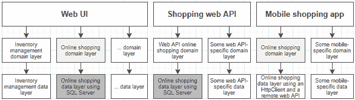
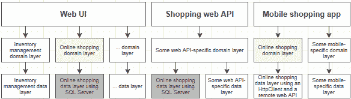
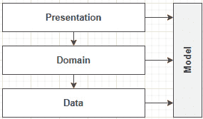
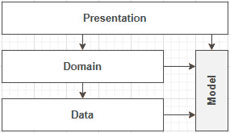
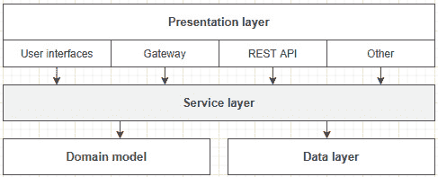
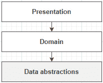
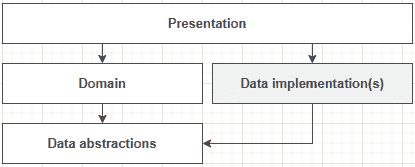
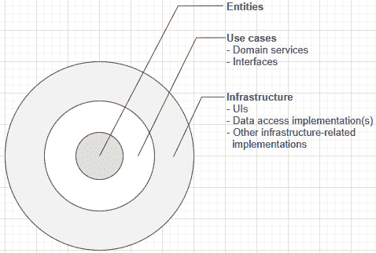
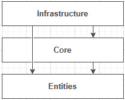

# *第 12 章*：理解分层

在本章中，我们将探讨分层背后的固有概念。分层是一种通过将主要关注点封装到层中来组织计算机系统的流行方式。这些关注点与“计算机职业”如“数据访问”相关，而不是与“库存”等“业务关注点”相关。理解分层背后的概念至关重要，因为其他概念都是从中产生的。

我们将从探索分层背后的最初想法开始本章。然后，我们将探索可以帮助我们解决不同问题的替代方案。我们将同时使用一个**贫血模型**和一个**丰富的模型**，并揭示两者的优缺点。最后，我们将快速探索**干净的架构**，这就是我所说的分层演进。

本章将介绍以下主题：

*   分层介绍
*   公共层的责任
*   抽象数据层
*   共享富模型
*   清洁建筑

让我们开始吧！

# 分层介绍

现在我们已经探索了一些设计模式，并稍微使用了 ASP.NET Core 5，是时候跳入分层了。在大多数计算机系统中，都有层次。为什么？因为这是一种将逻辑单元划分和组织在一起的有效方法。我们可以在概念上将层表示为软件的水平块，每个层封装一个关注点。

让我们从一个经典的三层应用设计开始：


图 12.1–经典的三层应用设计

**表示层**表示用户可以通过交互到达**域**的任何用户界面。在我们的例子中，它可能是一个 ASP.NETCore5Web 应用。然而，从 WPF 到 WinForms 再到 Android，任何东西都可能是有效的非 web 表示层替代方案。

**域层**代表业务规则驱动的核心逻辑；这是应用应该解决的问题的解决方案。域层也称为业务逻辑层（**BLL**）。

**数据层**代表数据和应用之间的桥梁。数据可以存储在 SQL Server 数据库、托管在别处的数据库、托管在云中的 NoSQL 数据库、所有这些数据库的组合，或者任何适合业务需要的其他数据库中。数据层也称为数据访问层（**DAL**）和**持久层**。

让我们跳到一个例子。假设用户已经过身份验证和授权，下面是当他们想要在书店应用中创建一本书时发生的情况，该应用是使用这三个层构建的：

1.  用户通过向服务器发送`GET`请求来请求页面。
2.  服务器处理该`GET`请求（**表示层**，然后将页面返回给用户。
3.  用户填写表单并向服务器发送`POST`请求。
4.  服务器处理`POST`请求（**表示层**），然后发送到**域层**进行处理。
5.  **域层**执行*创建书籍例程*，然后通知**数据层**保存数据。
6.  然后，服务器将相应的响应返回给用户，很可能是一个包含书籍列表的页面和一条消息，告诉用户操作成功。

按照经典的分层架构，一个层只能与堆栈中的下一层对话。**展示**与**域**对话，域与**数据**对话，依此类推。重要的是**每一层必须是独立的和隔离的，以限制紧密耦合**。

此外，每一层都应该有自己的**模型**。例如，**视图模型**不应该发送到**域**；在那里只能使用**域对象**。反之亦然：**域**将自己的对象返回给**表示层**，因此**表示层**不应该将它们泄漏给**视图**，而是将所需信息组织到**视图模型**中。

以下是一个可视示例：


图 12.2–表示各层如何相互作用的示意图

让我们从优势开始，分析分层的优缺点：

*   了解层的用途可以很容易地理解其元素对应用的作用。例如，很容易猜测**数据层**的组件在某处读取或写入了一些数据。
*   它创建了一个围绕单个关注点构建的内聚单元。例如，我们的**数据层**不应该呈现任何用户界面；它应该坚持访问数据。
*   它允许我们将该层与系统的其余部分（其他层）解耦。您可以在不知道其他层的情况下隔离和使用层。例如，假设您的任务是优化数据访问层中的查询。在这种情况下，您不需要知道最终向用户显示数据的用户界面。您只需关注该元素，对其进行优化、单独测试，然后发布该层或重新部署应用。
*   Like any other isolated unit, it should be possible to reuse a layer. For example, we could reuse our **data access layer** in another application that needs to query the same database for a different purpose (a different **domain layer**).

    提示

    从理论上讲，某些层比其他层更容易重用，可重用性可以增加或多或少的价值，这取决于您正在构建的软件。我从未见过一个层在实践中被完整地重用，我也很少听说或读到有人这样做——每次都是以一种不那么可重用的情况结束。

    根据我的经验，我强烈建议不要过分追求可重用性，因为它不是一个能够为应用增加价值的精确规范。通过限制你过度工程化的努力，你和你的雇主可以节省大量的时间和金钱。我们决不能忘记，我们的工作是创造价值。

    根据经验，做需要做的事，不要做得更多，但要做好。

好，现在，让我们看看缺点：

*   通过水平分割您的软件（分为多个层），每个功能跨越所有层。这通常会导致层之间的级联更改。例如，如果我们决定向书店数据库添加一个字段，我们需要更新数据库、访问它的代码（**数据层**、业务逻辑（**域层**）和用户界面（**表示层**）。对于不稳定的规格或低预算项目，这可能会变得很痛苦！新来者也可能很难实现跨越所有层的完整堆栈功能。
*   由于一个层直接依赖于它下面的层，如果不引入**抽象层**或引用**表示层**的较低层，就不可能使用依赖注入。例如，如果**域层**依赖于**数据层**，则更改数据层将需要重写，从而重写从**域**到**数据**的所有耦合。*暂时不要担心这个；这是一个相当容易克服的挑战。*
*   由于每个层都拥有其实体，因此添加的层越多，实体的副本就越多，从而导致性能损失。例如，**表示层**获取**视图模型**并将其复制到**域对象**。然后，**域层**将其复制到**数据对象**。最后，**数据层**将其转换为 SQL，以将其保存到**数据库**（例如 SQL Server）。从数据库读取数据时，情况也正好相反。

稍后，我们将探索克服其中一些缺点的方法。在此之前，我想指出，即使三层可能是最流行的层数，我们也可以根据需要创建任意数量的层；我们不限于三层。

我强烈建议你不要做我们刚刚探索过的事情。这是一种古老的、更基本的分层方式。在本章中，我们将看到我们可以对这个分层系统进行的多项改进，所以在得出结论之前，请继续阅读。我决定从一开始就探索分层，以防您必须使用这种应用。此外，研究它的时间演变，修复一些缺陷，并添加选项应该有助于您理解这些概念，而不仅仅是知道一种单一的做事方式。理解模式是软件架构的关键，而不仅仅是学习应用它们。

## 分层

现在我们已经讨论了层，并将其视为职责的大水平部分，我们可以通过垂直分割这些大的部分，创建多个较小的层，从而更细粒度地组织我们的应用。这可以帮助我们按功能或边界上下文组织应用。它还允许我们使用相同的构建块组合多个不同的用户界面，这比重用巨大的层要容易。

以下是这一想法的概念表示：



图 12.3–使用较小的部分共享层组织多个应用

我们可以将一个应用拆分为多个功能（垂直）并将每个功能划分为多个层（水平）。根据前面的图表，我们将这些功能命名为：

*   库存管理
*   网上购物
*   其他

因此，我们可以将在线购物领域和数据层引入到我们的购物 web API 中，而无需将其他所有内容都带进来。此外，我们可以将在线购物域层引入移动应用，并将其数据层交换为另一个与 web API 对话的数据层。

我们还可以将我们的 web API 用作一个简单的数据访问应用，并附加不同的逻辑，同时将购物数据层保持在底层。

我们可能会得到以下重新组合的应用（这只是一种可能的结果）：



图 12.4–使用较小的部分共享层组织多个应用

这些只是我们可以在概念上使用层做的例子。但是，要记住的最重要的事情不是图表的布局方式，而是您正在构建的应用的规范。只有这些规格和良好的分析才能帮助您为该确切问题创建最佳设计。在这里，我使用了一个假设的购物示例，但它可能是任何东西。

通过垂直分割巨大的水平切片，每个片段都变得更易于重用和共享。这种改进可以产生有趣的结果，特别是如果您有多个前端应用或计划将来从单一应用迁移出去。

## 层与层与组件

到目前为止，在本章中，我们一直在讨论层，而没有讨论如何将层转换为代码。在我们开始讨论这个话题之前，我想先谈谈**层**。你可能在以前的某个地方见过术语**3 层架构**，或者读过人们谈论**层**和**层**，甚至可能在同义词相同的上下文中交换它们。然而，它们并不相同。让我们来看一看：

*   **层**为**物理层**；每个**层**都可以部署在自己的机器上。例如，您可以有一个数据库服务器、一个托管包含业务逻辑的 web API 的服务器（T7 域）和另一个服务于角度应用的服务器（**表示**）；这是三个层次（三个不同的机器），每个**层次**可以独立扩展。
*   **层**为**逻辑**；每个**层**只是代码的逻辑组织，关注点以分层的方式组织和划分。例如，您可以在 VisualStudio 中创建一个或多个项目，并将代码组织为三个层。然后，部署应用，所有这些层一起部署在同一台服务器上。这将是一层和三层。

现在，我们已经讨论了关于 To.To.To.Tyl T1，让我们来看看一个 To.t2 层。您不必将图层拆分为不同的部件；您可以让三个层驻留在同一个部件中。当所有代码都在同一个项目中时，创建不需要的耦合可能会更容易，但由于一些严格性、一些规则和一些约定，这是一个可行的选择。也就是说，将每一层移动到一个组件并不一定会使应用更好；这些层（或程序集）中的每个层内的代码也可能混合在一起，并与系统的其他部分耦合在一起。

那么，什么是装配？

**组件**通常被编译成`.dll`或`.exe`文件；您可以直接编译和使用它们。您还可以将它们部署为 NuGet 包，并从[NuGet.org](http://nuget.org)或您选择的自定义 NuGet 存储库中使用它们。但层与组件或层与组件之间不存在一对一的关系；程序集只是编译代码的可消耗单元：库或程序。

别误会我的意思；可以为每个图层创建部件。这样做没有错，但这样做并不意味着层之间没有紧密耦合。层只是组织的逻辑单元。

## 做还是不做一个纯粹主义者？

在您的日常工作中，您可能并不总是需要**域层**在您的数据前面创建一堵墙。也许你只是没有时间和金钱，或者这不值得去做。

获取数据并将其呈现出来通常可以很好地工作，特别是对于简单的数据驱动应用，这些应用只是数据库上的用户界面，就像许多内部工具一样。

*“做还是不做一个纯粹主义者”*问题的答案是，根据我的经验：这要视情况而定！

好啊你可能不喜欢我现在的回答，但我会尽我所能不让你失望，我会更具体。这取决于以下因素：

*   The project; for example:

    a） **领域密集型或逻辑密集型项目**应受益于领域层，帮助您集中这些位，以提高可重用性和可维护性。

    b） **数据管理项目**往往逻辑性较差。由于**域**通常只是从**表示**到**数据**的隧道，因此通常可以在不添加域层的情况下构建它们。这些系统通常可以简化为两层：**数据**和**表示**。

*   你的团队；例如，一个高技能的团队可能倾向于更有效地使用先进的概念和模式，而由于团队中能够支持他们的经验丰富的工程师的数量，新手的学习曲线应该更容易。这并不意味着技能较低的团队应该瞄准较低的目标；相反，它可能只是更难或需要更长的时间开始。单独分析每个项目，并找到相应的最佳模式来驱动它们。
*   你的老板；如果您所在的公司向您和您的团队施加压力，要求您在创纪录的时间内交付复杂的应用，而没有人告诉您的老板这是不可能的，那么您可能需要走捷径，并享受许多维护难题，如系统崩溃、部署困难等等。也就是说，如果这是不可避免的，对于这些类型的项目，我会选择一个非常简单的设计，它不以可重用性为目标——以低到平均水平的可测试性和只工作的代码为目标。我还建议您继续阅读并尝试**垂直切片架构**。
*   你的预算；同样，这通常取决于销售应用和功能的人员。我经常看到无法兑现的承诺，但无论如何都要付出很多努力、额外的时间和捷径才能兑现。当沿着这条路走下去的时候，要记住的是，在某个时刻，累积的**技术债务**并没有回报，它只会变得更糟。
*   观众；使用该软件的人会对你构建它的方式产生重大影响：问问他们。例如，如果您正在为您的开发伙伴构建一个工具，那么您可能会在许多方面走捷径，而这些捷径对于其他技术水平较低的用户来说是无法做到的。另一方面，如果您的应用针对多个客户端（web、移动等），那么隔离应用的组件并关注可重用性可能是一个成功的设计。
*   预期质量；根据您是在构建一个原型还是一个高质量的软件，您不应该以同样的方式解决问题。原型不进行测试也不遵循最佳实践是可以接受的，但我建议生产质量应用采用相反的方法。
*   Any other things that life throws at you; yes, life is unpredictable, and no one can cover every possible scenario in a book, so just keep the following in mind when building your next piece of software:

    a） 不要过度设计你的应用。

    b） 根据**雅格尼原则**（*您不需要它*，只实现您需要的功能，而不是更多。

我希望你觉得这个列举足够好，并且在你职业生涯的某个阶段会有所帮助。现在，让我们进一步了解层以及如何在层之间共享模型。

## 共享模型

将模型从一层复制到另一层的另一种替代方法是在多个层之间共享一个模型，通常作为一个组件。从视觉上看，它是这样的：



图 12.5–在所有三层之间共享模型

正如我们前面讨论的，每件事都有利弊。这样做有助于在开始时节省一些时间，而且随着项目的推进和变得更大、更复杂，很可能会成为一个难点。

假设您觉得共享一个模型对于您的应用来说是值得的。在这种情况下，您还可以在表示层使用**视图模型**或**DTO**来控制并保持应用的输入和输出与域/数据模型的解耦。这可以表示为：



图 12.6-在域和数据层之间共享模型

通过这样做，您可以通过在域和数据层之间共享模型来节省一些时间。好的方面是，通过将共享模型隐藏在表示层下，从长远来看，您很可能会避开许多问题，从而在质量和开发时间之间达成了很好的折衷。此外，由于表示层将应用与外部世界隔离开来，因此可以在不影响用户的情况下重新编写或重写其他层。

**视图模型**和**DTO**是成功程序和开发人员心智健全的关键要素；他们应该可以为长期运行的项目省去很多麻烦。在本节后面，我们将通过**CQR**重新讨论和探索控制输入和输出的概念，其中输入变成**命令**和**查询**。同时，让我们探讨一下中小企业（SME）的现实情况。

## 中小企业的现实

数据驱动的程序是我在企业中经常看到的软件类型。每个公司都需要内部工具，许多公司昨天也需要。原因很简单,；每个公司都是独一无二的。由于其独特的商业模式、领导力或员工，它还需要独特的工具来帮助其日常运营。通常，这些小工具是数据库上的简单用户界面，控制对该数据的访问。在这些情况下，您不需要过度设计的解决方案，只要每个人都知道该工具的发展不会超出它的范围：一个小型工具。

在现实生活中，这一点很难向非程序员和经理解释。这是因为他们倾向于将复杂用例视为易于实现，而将简单用例视为难以实现。这是正常的；他们不知道，我们都不知道。我们工作的一大部分是教育人们。向决策者提供有关小型工具质量或大型业务应用质量差异的建议应该会有所帮助。通过教育和与利益相关者合作，他们可以了解情况并与您一起做出决定，从而提高项目质量，满足每个人的期望。这也可以从两方面减少“这不是我的错综合症”。

我发现，让客户（决策者）沉浸在决策过程中，让他们遵循开发周期，有助于他们了解项目背后的现实，也有助于双方保持快乐并变得更加满意。管理层得不到他们想要的并不比你在无法达到的最后期限上压力过大要好。

话虽如此，我们的教育部分并不以决策者而结束。向同事传授新的工具和技术也是提高团队、同事和自己的主要途径。解释概念并不总是像听起来那么容易。

然而，数据驱动的程序可能很难避免，特别是如果你是为中小企业工作的话，那么请尝试从中获得最佳效果。另一个小贴士是要记住，有一天，会有人来维护这些小工具。把那个人想象成你，想想你希望有什么指导方针或文件来帮助你。我也不是说要过度文档化项目，因为文档常常与代码不同步，成为一个问题而不是解决方案。然而，在项目根目录下的一个简单的`README.md`文件，解释如何构建程序、运行程序以及一些通用的指导方针，可能会非常有益。总是想着像这样的文档，你就是阅读它的人。大多数人不喜欢为了理解一些简单的东西而阅读一个又一个小时的文档，所以要保持简单。

在数据库上构建*立面时，您希望保持简单。此外，您应该明确指出，它不应该超越该角色。一种方法是使用实体框架核心作为数据层，构建一个 MVC 应用作为表示层，屏蔽数据库。如果需要访问控制，您可以使用内置的身份验证和授权提供程序，使用属性、基于角色、基于策略或任何其他对您的工具有意义的方式，并允许您以需要的方式控制对数据的访问。*

保持简单应该可以帮助您在更短的时间内构建更多的工具，让每个人都感到高兴。最有可能的是，提高你的非技术同事的生产力，这将为公司带来更多的利润，也可能带来繁荣，这将意味着你有更多的工作要做；这应该是一个双赢的局面。

从分层的角度来看，使用我前面的示例，最终将有两个层共享数据模型：


图 12.7–数据库应用设计上类似于立面的表示层

没有什么能阻止你为更复杂的视图到处创建一个**视图模型**，但关键是要将逻辑的复杂性保持在最低限度。否则，您可能会发现，有时从头开始重写程序比修复程序花费的时间要少。此外，没有什么能阻止您使用其他可用的演示工具和组件；我们将在本书后面探讨这个选项。

在开发主应用时将此数据驱动体系结构用作临时应用也是一个很好的解决方案。构建它只需要一小部分时间，用户可以立即访问它。您甚至可以从中获得一些反馈，这允许您在实际（未来）应用中实现错误之前修复任何错误。

现在，让我们进入一些代码。在完成本章的分层之前，我们有很多层次和技术需要探索。

# 公共层的职责

在本节中，我们将更深入地探索每个最常用的层。我们不会深入研究每一个问题，因为有无数的在线资源和其他涵盖这些问题的书籍。然而，我仍然想概述每一个，因为我希望，这将帮助您理解分层背后的基本思想。

我已经建立了一个小项目，探索分层背后的基本思想，并确保它易于遵循。该项目考虑到以下方面：

*   上市产品。
*   添加和删除库存（库存）。

我们将在本章和接下来的两章中反复讨论这个项目。此外，由于我们正在探索两种类型的域模型，解决方案包括以下项目（层）：

*   底部的共享数据层。
*   贫血域层和依赖于该域层的呈现层。
*   丰富的域层和依赖于该域层的表示层。

以下是这些层的视觉表示：


图 12.8–项目（层）关系的表示

两个表示层使用相同的 HTTP 端口，因此不能同时启动它们。我故意这么做是为了让 Postman 测试在两个应用上运行而不需要参数化。有关邮递员测试（[的更多信息，请查看源代码的`README.md`文件 https://net5.link/code](https://net5.link/code) 。

笔记

两个表示层都是相同的，但一个使用富域层，而另一个使用贫血层。我本可以只创建一个，使用接口作为共享两个域层的技巧，甚至是预处理器指令，但这会导致更混乱的代码库。

由于数据层独立于域和表示层，因此可以在两个域层中重用它，这就是分层的要点。

## 介绍

**表示层**可能是最容易理解的层，因为它是我们能看到的唯一层：用户界面。但是，在 REST、OData、GraphQL 或其他类型的 web 服务的情况下，表示层也可以是数据契约。表示层是用户用来访问程序的层。

作为另一个示例，CLI 程序可以是表示层。您在终端中写入命令，CLI 将这些命令发送到其**域层**，该层执行所需的业务逻辑。

让我们从示例的第一次迭代开始。其中，我们有两个控制器和三个 HTTP 端点：

*   `GET https ://localhost:12001/products`列出所有产品。
*   `POST https ://localhost:12001/products/{productId}/add-stocks`将产品添加到库存中。
*   `POST https ://localhost:12001/products/{productId}/remove-stocks` removes products from the inventory.

    笔记

    两个演示项目之间唯一不同的行是一个`using`语句和根命名空间。一个项目为`using AnemicDomainLayer;`，另一个项目为`using RichDomainLayer;`（代码块中省略）。根命名空间分别为`AnemicPresentationLayer`或`RichPresentationLayer`。

让我们来探索`StocksController`课程，它比`ProductsController`更吸引我们：

```cs
namespace RichPresentationLayer.Controllers
{
    [ApiController]
    [Route("products/{productId}/")]
    public class StocksController : ControllerBase
    {
 private readonly IStockService _stockService;
        public StocksController(IStockService stockService)
        {
            _stockService = stockService ?? throw new ArgumentNullException(nameof(stockService));
        }
```

前面的代码在`StocksController`中注入`IStockService`，然后我们在下面两个代码块中使用它来执行业务逻辑，比如从库存中添加或删除库存：

```cs
        [HttpPost("add-stocks")]
        public ActionResult<StockLevel> Add(int productId, [FromBody]AddStocksCommand command)
        {
            var quantityInStock = _stockService.AddStock(productId, command.Amount);
            var stockLevel = new StockLevel(quantityInStock);
            return Ok(stockLevel);
        }
```

前面的代码使用`IStockService`接口，根据`AddStocksCommand`DTO 的值增加存货。然后使用`StockLevel`DTO 返回更新后的股票价值。两个 DTO在`remove-stock`动作后的列表末尾描述：

```cs
        [HttpPost("remove-stocks")]
        public ActionResult<StockLevel> Remove(int productId, [FromBody]RemoveStocksCommand command)
        {
            try
            {
                var quantityInStock = _stockService.RemoveStock(productId, command.Amount);
                var stockLevel = new StockLevel(quantityInStock);
                return Ok(stockLevel);
            }
            catch (NotEnoughStockException ex)
            {
                return Conflict(new
                {
                    ex.Message,
                    ex.AmountToRemove,
                    ex.QuantityInStock
                });
            }
        }
```

除了使用`RemoveStocksCommand`DTO 并将更新后的库存量复制到`StockLevel`实例之外，`Remove`方法还包含一小段逻辑。当抛出一个`NotEnoughStockException`时，它将 HTTP 状态代码从`200`更改为`409`。我们在[*第 5 章*](05.html#_idTextAnchor075)*中探讨了 HTTP 状态码，即 Web API*的 MVC 模式。简而言之，它允许消费者了解错误的性质。

将`Exception`映射到 HTTP状态代码可能是控制器职责的一部分。但是，如果您希望集中化过滤器和中间件并避免管理每个控制器中的异常，则过滤器和中间件可以处理此类逻辑（有关更多信息，请参阅*进一步阅读*部分）：

```cs
        public class AddStocksCommand
        {
            public int Amount { get; set; }
        }
        public class RemoveStocksCommand
        {
            public int Amount { get; set; }
        }
        public class StockLevel
        {
            public StockLevel(int quantityInStock)
            {
                QuantityInStock = quantityInStock;
            }
            public int QuantityInStock { get; set; }
        }
    }
}
```

最后，有两个输入 DTO 和一个输出 DTO。输入为`AddStocksCommand`和`RemoveStocksCommand`，它们表示我们`POST`向控制器发送的数据（有关请求的更多信息，请参阅邮递员收集）。输出为`StockLevel`类，表示物料的当前库存水平。一旦我们更新了产品的数量，就会返回。

在前面的控制器代码中，我们可以看到表示层的作用。它从 HTTP 请求收集信息，并以域期望的方式格式化这些信息。域完成其工作后，会将结果转换回 HTTP。

我怎么强调都不过分：控制器应该保持精简，因为它们是 HTTP 和域层之间的**简单转换器。以下是这方面的视觉表现：**


图 12.9–通过控制器的 HTTP 请求流

控制器的职责是将 HTTP 请求映射到域，然后将域的输出映射回 HTTP。

现在，让我们看看 Apple T0.域层 AuthT1，看看这些调用在哪里。

## 域

**域层**是软件的价值所在；这也是大部分复杂性所在。**域层**是您业务逻辑规则的所在地。

不幸的是，销售**用户界面**比销售**域层**更容易。这是有意义的，因为这是用户连接到域的方式；这就是他们看到的。但是，作为一名开发人员，重要的是要记住，**域**负责解决问题和自动化解决方案。**表示层**仅用于将用户的操作链接到**域**。

关于如何构建该层，有两大观点：

*   使用丰富的模型。
*   使用贫血模型。

无论您选择哪一个，域层通常是围绕域模型构建的。**领域驱动设计**（**DDD**）可以用于构建该模型及其周围的程序。精心设计的模型应有助于简化程序的维护。执行 DDD 不是强制性的，没有 DDD 您可以达到所需的正确性级别。

另一个难题是**是将域模型直接持久化到数据库中，还是使用中间数据模型**。我们将在*数据*一节中更详细地讨论这一点，但我们现在使用的是单独的数据模型（增量步骤）。

回到**域层**，我们可以使用多年来出现的一种模式，这种模式得到越来越多的采用，使用**服务层**屏蔽**域模型**，将**域层**分为两个不同的部分。

服务层

**服务层**屏蔽域模型，封装域逻辑。服务层通常设计为高度可重用，协调与模型或外部资源（如数据库）的复杂交互。然后，多个组件可以在对模型了解有限的情况下使用服务层：



图：12.10–服务层与其他层的关系

基于前面的图，**表示层**与**服务层**对话，后者管理**域模型**并实现业务逻辑。

**服务层**包含服务，服务是与**域模型**和**数据层**等**域对象**交互的类。

我们可以将服务分为两类：**域服务**和**应用服务**。

**域服务**就是我们在这里讨论的服务。它们包含域逻辑并允许使用者读取或写入数据。它们访问并改变域模型。

**应用服务**是与域无关的服务，如发送电子邮件的类/接口`[I]EmailService`。它们可能存在于域层，也可能不存在于域层，这取决于它们的用途。由于它们不绑定到域（没有域逻辑），因此明智的做法是将它们提取到库中，以便您可以在域和其他层之间或与其他应用共享它们（为什么要为每个项目重写电子邮件服务，对吗？）。

与其他层一样，您的服务层可以公开自己的模型，保护其使用者不受域模型（内部）更改的影响。换句话说，服务层应该只公开其契约和接口（关键字：shield）。**服务层是外观的一种形式。**

有很多方法可以解释这一层，我将尝试以一种浓缩的方式尽可能多地解释（从简单到复杂）。让我们开始：

1.  The classes and interfaces of the service layer could be part of the domain layer's assembly, created in a *Services* directory, for example.

    这是不太可重用的，但它为将来共享服务铺平了道路，而无需首先管理多个项目。它需要严谨，不依赖于你不应该依赖的东西。

2.  The service layer could be an assembly containing interfaces and implementation.

    这是可重用性和维护时间之间的一个巨大折衷。很可能您永远不需要两个实现（请参阅下一点），因为服务与逻辑相关联，而逻辑构成了域。您甚至可以隐藏实现，就像我们在[*第 9 章*](09.html#_idTextAnchor171)*结构模式*中对**不透明立面**所做的那样。

3.  The service layer could be divided into two assemblies – one containing abstractions (referenced by consumers) and one containing implementations.

    对于大多数项目来说，这简直是过火和无用，但我将把选择权留给你；也许您正在构建一个需要这种抽象级别的项目。

4.  服务层可以是实际的 web 服务层（例如 web API）。
5.  A web service tier using a service layer assembly.

    这是点*2*和*4*的组合。作为程序集的服务层，可以按原样使用，并在其顶部使用 web API，将其部分或全部功能公开给外部系统。

按照惯例，人们通常在服务类后面加上`Service`，例如`ProductService`和`InventoryService`；接口（`IProductService`和`IInventoryService`也是如此）。

无论您选择哪种技术，请记住，服务层包含域逻辑，并屏蔽了域模型的直接访问。

在我们损坏细节之前，让我们来看看两个主要的方法来思考域模型。以下代码表示每个域层项目公开的服务接口。这些接口表示表示表示与域之间的链接，根据域模型类型封装了或多或少的职责。有两个具有相同签名的不同接口，每个项目一个：

```cs
public interface IProductService
{
    IEnumerable<Product> All();
}
```

`IProductService`只公开一个返回系统所有`Product`实例的方法。

```cs
public interface IStockService
{
    int AddStock(int productId, int amount);
    int RemoveStock(int productId, int amount);
}
```

`IStockService`公开了两种方法：一种是添加库存，另一种是从库存中移除库存。两者都返回更新的库存水平。

让我们首先探索**富域模型**，看看这些服务是如何实现的。

### 富域模型

富域模型更面向对象，在术语“最纯粹”的意义上，并且将域逻辑封装为模型的一部分，包含在方法中。例如，下面的类是`Product`类的富版本：

```cs
namespace RichDomainLayer
{
    public class Product
    {
        public Product(string name, int quantityInStock)
        {
            Name = name ?? throw new ArgumentNullException(nameof(name));
            QuantityInStock = quantityInStock;
        }
        public Product(int id, string name, int quantityInStock)
            : this(name, quantityInStock)
        {
            Id = id;
        }
```

前面两个构造函数在创建`Product`实例时，强制使用者提供所需的数据。这为我们提供了一个额外的控制层来控制可以进入的内容。

```cs
        public int Id { get; private set; }
        public string Name { get; private set; }
        public int QuantityInStock { get; private set; }
```

为了迫使消费者使用以下方法，所有设置器都已设置为`private`，因此无法从外部进行更改。

```cs
        public void AddStock(int amount)
        {
            QuantityInStock += amount;
        }
        public void RemoveStock(int amount)
        {
            if (amount > QuantityInStock)
            {
                throw new NotEnoughStockException(QuantityInStock, amount);
            }
            QuantityInStock -= amount;
        }
    }
}
```

最后，我们有`AddStock`和`RemoveStock`方法。它们封装了与我们产品相关的逻辑。他们管理添加和删除该产品库存的过程。当然，在这种情况下，我们只增加和减少属性的值，但在更复杂的模型中，概念是相同的。

屏蔽该模型的**服务层**由以下代码表示：

```cs
namespace RichDomainLayer
{
    public class StockService : IStockService
    {
        private readonly ProductContext _db;
        public StockService(ProductContext db)
        {
            _db = db ?? throw new ArgumentNullException(nameof(db));
        }
        public int AddStock(int productId, int amount)
        {
            var data = _db.Products.Find(productId);
            var product = new Product(
                id: data.Id,
                name: data.Name,
                quantityInStock: data.QuantityInStock
            );
            product.AddStock(amount);
            data.QuantityInStock = product.QuantityInStock;
            _db.SaveChanges();
            return product.QuantityInStock;
        }
        public int RemoveStock(int productId, int amount)
        {
            var data = _db.Products.Find(productId);
            var product = new Product(
                id: data.Id,
                name: data.Name,
                quantityInStock: data.QuantityInStock
            );
            product.RemoveStock(amount);
            data.QuantityInStock = product.QuantityInStock;
            _db.SaveChanges();
            return product.QuantityInStock;
        }
    }
}
```

在前面的服务代码中，数据对象和业务对象之间存在映射。然后，我们调用重构的域模型来添加或删除一些库存，然后将更新的实体保存回数据库，并将更新的数量返回给消费者（稍后我们将对此进行简化）。

rich 模型的流程通常如下：

1.  重建模型（从数据库加载模型并将其映射到对象）。
2.  使用模型中嵌入的逻辑。
3.  （可选）将更改保存回数据库（将对象保存并映射到数据库）。

现在，让我们来看看优点和缺点。

#### 利与弊

这种方法的最大优点是所有的逻辑都内置在模型中。它非常以领域为中心，因为操作是作为方法在模型实体上编程的。此外，它达到了面向对象设计背后的基本思想，即行为应该是对象的一部分，使它们成为现实生活中对应对象的虚拟表示。

最大的缺点是单一类别的责任累积。即使面向对象的设计告诉我们将逻辑放入对象中，这并不意味着它总是一个好主意。如果灵活性对您的系统很重要，那么将逻辑硬编码到域模型中可能会妨碍您在不更改代码本身的情况下使业务规则不断发展的能力（仍然可以这样做）。如果域的构建是健壮的和固定的，那么丰富的模型可能是您的项目的好选择。

这种方法的一个相对缺点是，向域模型中注入依赖项可能比向服务等其他对象中注入依赖项更难，这可能会再次降低灵活性或增加创建模型的复杂性。

如果您正在构建一个有状态的应用，其中域模型在内存中的驻留时间比 HTTP 请求的时间长，那么富域模型可能会对您有所帮助。还有其他模式，例如**模型视图视图模型**（**MVVM**）和**模型视图更新**（**MVU**）来帮助您实现这一点。我们将在[*第 18 章*](18.html#_idTextAnchor348)*中讨论 MVU，简要介绍 Blazor*。

如果您相信您的应用将从将数据和逻辑保持在一起中受益，那么对于您的项目来说，一个丰富的域模型很可能是一个好主意。

如果您的程序是围绕您的域模型构建的，那么将这些类直接持久化到您的数据库可能比使用另一个模型更好。如果您使用的是对象关系映射器（ORM），比如 EntityFrameworkCore，您甚至可以配置模型的持久化方式。使用文档数据库，如 CosmosDB、Firebase、MongoDB、Azure Blob 存储或任何其他文档数据库，可以非常轻松地将复杂模型存储为单个文档，而不是表集合（这也适用于贫血模型）。

正如您可能已经注意到的，在这一部分中有很多“如果”，因为我认为对于富模型是否更好，没有一个绝对的答案。这更多的是一个问题，它是否更好地为您的具体情况比整体。你还需要考虑你的个人喜好。

在这里，经验很可能是您最好的盟友，所以我建议您编写代码，编写代码，编写更多的应用，以获得这种经验。

### 贫血域模型

贫血领域模型不包含方法，而是由哑数据结构组成，主要只包含 getter 和 setter。我们以前使用的相同产品的外观如下所示：

```cs
namespace AnemicDomainLayer
{
    public class Product
    {
        public int Id { get; set; }
        public string Name { get; set; }
        public int QuantityInStock { get; set; }
    }
}
```

如您所见，类中没有更多的方法，只有三个带有公共 setter 的属性。我们将该逻辑转移到服务层。该模型现在是一个简单的数据结构。以下是更新后的`StockService`类：

```cs
namespace AnemicDomainLayer
{
    public class StockService : IStockService
    {
        private readonly ProductContext _db;
        public StockService(ProductContext db)
        {
            _db = db ?? throw new ArgumentNullException(nameof(db));
        }
        public int AddStock(int productId, int amount)
        {
            var product = _db.Products.Find(productId);
            product.QuantityInStock += amount;
            _db.SaveChanges();
            return product.QuantityInStock;
        }
        public int RemoveStock(int productId, int amount)
        {
            var product = _db.Products.Find(productId);
            if (amount > product.QuantityInStock)
 {
 throw new NotEnoughStockException(product.QuantityInStock, amount);
 }
            product.QuantityInStock -= amount;
            _db.SaveChanges();
            return product.QuantityInStock;
        }
    }
}
```

我们的代码与前面的代码几乎相同，但是在服务中处理的逻辑不同。贫血模型流量通常如下所示：

1.  重建模型（从数据库加载模型并将其映射到对象）。
2.  在将模型用作简单数据结构时处理逻辑。
3.  或者，将更改保存回数据库（将对象保存并映射到数据库）。

现在，让我们看看它的优点和缺点。

#### 利与弊

对于贫血模型，将操作与数据分离可以帮助我们增加系统的灵活性。但是，由于外部参与者（服务）正在修改模型，而不是管理模型本身，因此在任何给定的时间强制执行模型的状态可能会更加困难。

将逻辑封装到更小的单元中，可以更容易地管理每个单元。将这些依赖项注入服务类比将它们注入实体本身更容易。拥有更多更小的代码单元会使系统对新手更加恐惧，因为它的理解可能更复杂，因为它有更多的运动部件。另一方面，如果系统是围绕定义良好的抽象构建的，那么可以更容易地单独测试每个单元。

然而，测试可能会有很大的不同。对于我们的富模型，我们可以单独测试规则（参见`RichDomainLayer.Tests/ProductTest.cs`），并在另一个测试中测试持久性（参见`RichDomainLayer.Tests/StockServiceTest.cs`）；见[https://net5.link/FP7q](https://net5.link/FP7q) 。我们称之为**坚持无知**。它允许我们单独测试业务规则。以下是`Product`模型单元测试文件，该文件展示了将该概念付诸实施的过程：

```cs
namespace RichDomainLayer
{
    public class ProductTest
    {
        public class AddStock : ProductTest
        {
            [Fact]
            public void Should_add_the_specified_amount_to_QuantityInStock()
            {
                // Arrange
                var sut = new Product("Product 1", quantityInStock: 0);
                // Act
                sut.AddStock(2);
                // Assert
                Assert.Equal(2, sut.QuantityInStock);
            }
        }
// …
    }
}
```

前面的代码显示了`Product.AddStock`方法测试，只测试业务逻辑规则。接下来，我们将对`StockService`类进行一些集成测试：

```cs
namespace RichDomainLayer
{
    public class StockServiceTest
    {
        private readonly DbContextOptionsBuilder _builder=...; 
        public class AddStock : StockServiceTest
        {
            [Fact]
            public void Should_add_the_specified_amount_to_QuantityInStock()
            {
                // Arrange
                using var arrangeContext = new ProductContext(_builder.Options);
                using var actContext = new ProductContext(_builder.Options);
                using var assertContext = new ProductContext(_builder.Options);
                arrangeContext.Products.Add(new() { Name = "Product 1", QuantityInStock = 1 });
                arrangeContext.SaveChanges();
                var sut = new StockService(actContext);
                // Act
                var quantityInStock = sut.AddStock(productId: 1, amount: 2);
                // Assert
                Assert.Equal(3, quantityInStock);
                var actual = assertContext.Products.Find(1);
                Assert.Equal(3, actual.QuantityInStock);
            }
        }
// …
    }
}
```

上面的代码显示了持久性测试，确保`StockService`在执行`AddStock`操作后将实体持久化到数据库中。

在我们的贫血模型中，我们需要在同一测试中测试规则和持续性，将单元测试转换为集成测试（参见`AnemicDomainLayer.Tests/StockServiceTest.cs`：

```cs
namespace AnemicDomainLayer
{
    public class StockServiceTest
    {
        private readonly DbContextOptionsBuilder _builder = ...;
        public class AddStock : StockServiceTest
        {
            [Fact]
            public void Should_add_the_specified_amount_to_QuantityInStock()
            {
                // Arrange
                using var arrangeContext = new ProductContext(_builder.Options);
                using var actContext = new ProductContext(_builder.Options);
                using var assertContext = new ProductContext(_builder.Options);
                arrangeContext.Products.Add(new() { Name = "Product 1", QuantityInStock = 1 });
                arrangeContext.SaveChanges();
                var sut = new StockService(actContext);
                // Act
                var quantityInStock = sut.AddStock(1, 9);
                // Assert
                Assert.Equal(10, quantityInStock);
                var actual = assertContext.Products.Find(1);
                Assert.Equal(10, actual.QuantityInStock);
            }
        }
// ...
    }
}
```

前面的代码与富模型集成测试几乎相同。它同时测试逻辑和持久性。我们可以使用不同的技术简化贫血模型整合测试。我们将在本章及后续章节中介绍其中的一些内容。尽管如此，所有这些都是选择的问题；有三个集成测试来满足您的需求可能比三个单元测试和两个集成测试更好。通常情况下，**越少越好**。请记住，您不是按照编写的代码行获得报酬，而是为了交付结果。对于复杂的业务规则，我强烈建议自己封装规则。这允许您编写许多单元测试，这些测试涵盖了所有场景，而无需数据库。

总而言之，如果遵循相同的严格的领域分析过程，贫血模型应该与丰富领域模型一样复杂。最大的区别应该是方法所在的位置；也就是说，在什么课上。

对于无状态系统，比如RESTful API，贫血模型是一个不错的选择。因为您必须为每个请求重新创建模型的状态，所以这可以为您提供一种方法，在较小的类中重新创建模型的较小部分，并针对每个用例分别进行优化。无状态系统往往需要一种比纯面向对象的思维更为程序化的思维方式，这使得贫乏的模型成为这方面的最佳候选者。

笔记

我个人喜欢服务层后面的贫血模型，但有些人不同意我的观点。和往常一样，我建议您选择您认为最适合您正在构建的系统的方法，而不是根据其他人对另一个系统的看法来做一些事情。

另一个好的技巧是让重构自上而下地流向正确的位置。例如，如果您觉得一个方法绑定到一个实体，那么没有什么可以阻止您将该逻辑片段移动到该实体而不是服务类中。如果一个服务更合适，那么将逻辑移到一个服务类。这种方法有助于垂直切片体系结构，我们将在[*第 15 章*](15.html#_idTextAnchor282)*中介绍垂直切片体系结构*入门。

现在，让我们看看数据层。

## 数据

**数据层**是持久性代码的所在。在大多数程序中，我们需要某种持久性来存储应用数据，通常是数据库。谈到数据层时，会想到几种模式，包括**工作单元**和存储库模式，它们都是非常常见的模式。我们将在本小节末尾简要介绍这两种模式。

我们可以保持我们的**域模型**不变，或者创建更适合存储的**数据模型**。例如，在面向对象的世界中，多对多关系不是一件事情，而它是从关系数据库的角度来看的。您可以像查看**视图模型**或**DTO**一样查看**数据模型**，但对于数据。**数据模型**是数据存储在您的数据存储中的方式；也就是说，你如何建模你的数据。在一个经典的分层项目中，您别无选择，只能拥有一个数据模型。但是，随着我们继续探索其他选项，您可能会找到更好的解决方案。

我使用**实体框架核心**（**EF 核心**）作为本项目的**对象关系映射器**（**ORM**）。**ORM**是一款软件，可以自动将对象转换为 SQL 等数据库语言。在**EF Core**的情况下，它允许我们在多个提供者之间进行选择，从 SQL 到 Cosmos DB，在内存中传递。EF Core 的伟大之处在于它已经为我们实现了**工作单元**和**存储库**模式。在我们的例子中，我们使用内存提供程序来缩短设置时间。对于 SQL Server 数据库，我们可以使用迁移来维护基于**数据模型**的数据库模式。

笔记

如果您以前使用过 EF6 和恐惧实体框架，请知道他们从错误中吸取了教训，并且 EF Core 更轻、更快、更易于测试。请随时再试一次。它远非完美，但在许多场景中都能很好地工作。如果您想完全控制您的 SQL 代码，请寻找 Dapper（不要与 Dapr 混淆）。

这个项目的数据层非常薄，所以我们先来看看它的整体情况：

```cs
namespace DataLayer
{
    public class Product
    {
        public int Id { get; set; }
        public string Name { get; set; }
        public int QuantityInStock { get; set; }
    }
    public class ProductContext : DbContext
    {
        public ProductContext(DbContextOptions options)
            : base(options) { }
        public DbSet<Product> Products { get; set; }
    }
}
```

在前面的代码中，`Product`类是**数据模型**，而`ProductContext`类是**工作单元**。`DbSet<Product>`是一个`Product`**存储库**。我们之前研究的服务层已经使用了`ProductContext`和`Product`类。

我不想详细介绍这些模式，但它们非常重要，值得一看。我写了一个关于存储库模式的多部分系列文章（参见*进一步阅读*部分）。在使用 EF Core 时，您不必处理这种级别的细节，这可能是一件好事。

同时，让我们至少研究一下他们的目标，这样你就知道他们的目的是什么，如果有时间你需要写这样的组件，你就知道去哪里找。

### 仓库模式

存储库模式的目标是允许消费者以面向对象的方式查询数据库。通常，这意味着对象的内存缓存以及动态过滤数据的可能性。EF Core 用一个`DbSet<T>`表示这个概念，并使用 LINQ 和`IQueryable<T>`接口提供动态过滤。

人们还使用术语**repository**来表示表数据网关模式，这是另一种模式，它模拟了一个类，让我们可以访问数据库中的单个表，并提供对操作的访问，例如创建、更新、删除和从该数据库表中获取实体。这两种模式都来自企业应用架构的*模式。*

例如，我们可以使用`DbSet<Product>`将新产品添加到数据库中，如下所示：

```cs
db.Products.Add(new Product
{
    Id = 1,
    Name = "Banana",
    QuantityInStock = 50
});
```

对于查询部分，我们使用它来查找单个产品，如下所示：

```cs
var product = _db.Products.Find(productId);
```

但是，我们可以使用 LINQ 来代替：

```cs
_db.Products.Single(x => x.Id == productId);
```

这些是**存储库**应该提供的类查询功能，EF Core 无缝支持这些功能，将 LINQ 转换为配置的提供者期望值，如 SQL。

`ProductService`。`All()`方法（来自`AnemicDomainLayer`获取所有产品，并使用 LINQ 将数据投影到域对象：

```cs
public IEnumerable<Product> All()
{
    return _db.Products.Select(p => new Product
    {
        Id = p.Id,
        Name = p.Name,
        QuantityInStock = p.QuantityInStock
    });
}
```

我们还可以在此使用 LINQ 进一步进行滤波；例如，通过查询所有缺货的产品：

```cs
var outOfStockProducts = _db.Products
    .Where(p => p.QuantityInStock == 0);
```

我们也可以允许有误差，比如：

```cs
var mostLikelyOutOfStockProducts = _db.Products
    .Where(p => p.QuantityInStock < 3);
```

在此基础上，我们探讨了 EF Core如何实现存储库模式以及如何使用它。这需要大量的工作来实现与 EF 核心功能一致的自定义存储库。

这对于**存储库模式**来说已经足够了。现在，在回到分层之前，让我们先来概述一下**工作单元模式**。

### 工作单位模式

**u****工作单元**跟踪事务的对象表示。换句话说，它管理应该创建、更新和删除的对象的注册表。它允许我们在一个事务中组合多个更改（一个数据库调用），这比每次更改时调用数据库有多个优势。这里有两个：

*   首先，它可以加快数据访问速度；调用数据库很慢，因此限制调用和连接的数量可以提高性能。
*   其次，运行事务而不是单个操作允许我们在一个操作失败时回滚所有操作，或者在所有操作成功时提交整个事务。

在 EF 核心中，该模式由`DbContext`类及其底层类型（如`DatabaseFacade`和`ChangeTracker`类）实现。

在我们的小应用中，我们没有利用事务，但概念保持不变。让我们看看贫血`StockService`的例子，了解工作单元内部发生的情况：

```cs
var product = _db.Products.Find(productId);
product.QuantityInStock += amount;
_db.SaveChanges();
```

前面的代码执行以下操作：

1.  查询数据库中的单个实体。
2.  更改`QuantityInStock`属性的值。
3.  将更改保留回数据库。

事实上，所发生的情况更接近于以下情况：

1.  We ask EF Core for a single entity through the `ProductContext` (a **unit of work**), which exposes the `DbSet<Product>` property (the product **repository**). Under the hood, EF Core does the following:\

    a） 查询数据库。

    b） 缓存实体。

    c） 已开始跟踪该实体的更改。

    d） 把它还给我们。

2.  我们更改了`QuantityInStock`财产的价值；EF Core 检测到更改并将对象标记为脏。
3.  我们告诉**工作单元**保存其跟踪的更改，将脏产品保存回数据库。

在更复杂的场景中，我们可以编写以下代码：

```cs
_db.Products.Add(newProduct);
_db.Products.Remove(productToDelete);
product.Name = "New product name";
_db.SaveChanges();
```

这里，`SaveChanges()`方法触发保存三个操作，而不是逐个发送。您可以使用`DbContext`的`Database`属性控制数据库事务（有关更多信息，请参阅*进一步阅读*部分）。

现在我们已经探索了**工作单元**，我们可以自己实现一个。这会为我们的应用增加价值吗？可能不会。如果您想在 EF Core 上构建一个定制的**工作单元**或一个包装器，那么有大量现有资源可以指导您。除非您想进行实验或需要定制的**工作单元**和**存储库**（这是可能的），否则我建议不要这样做。记住：**只做你的程序正确所需的事情**。

提示

当我说*只做需要做的*时，不要误解我；野生工程的努力和实验是一个伟大的探索方式，我鼓励你这样做。但是，我建议您并行进行，这样您就可以进行创新、学习，甚至可以在以后将这些知识迁移到您的应用中，而不是浪费时间和破坏东西。如果您使用的是 Git，那么创建一个实验分支将是一个很好的方法。然后，当实验不起作用时，可以将其删除，但如果分支产生积极结果，则可以合并分支。

现在，让我们回到分层，继续以健壮、灵活和高效的方式使用层。

# 抽象数据层

在本节中，我们将实现一个抽象数据层，以探索**存储库接口**。这种类型的抽象非常有用，并且更接近于**干净的体系结构**。

让我们从问题开始：**域层**是逻辑所在，**UI**是用户与**域**之间的链接，暴露了**域**中内置的特性。另一方面，**数据层**应该是**域**盲目使用的一个实现细节。**数据层**包含知道数据存储位置的代码，应该与**域**无关，但**域**间接依赖于此。

解决方案是**通过创建一个额外的抽象层，打破**域**和**数据**持久化实现之间的紧密耦合**，如下图所示：



图 12.11–用数据抽象层替换数据（持久性）层

新规则：**只有接口和模型类进入数据抽象层**。这个新的层现在定义了我们的数据访问 API，除了公开一组接口之外什么也不做——一个契约。

然后，**我们可以基于该层创建一个或多个数据实现**。在我们的例子中，我们正在实现**数据抽象层**的 EF 核心版本。抽象和实现之间的链接是通过依赖项注入绑定完成的，这些绑定在**组合根**中定义。

新的依赖关系树如下所示：



图 12.12–各层之间的关系

**表示层**引用**数据实现层**的唯一原因是创建 DI 绑定。我们需要这些绑定来在创建**域**类时注入正确的实现。除此之外，**表示层不得使用数据层的抽象和实现**。

例如，当使用者请求实现`IProductRepository`接口的对象时，我们的程序可以注入`EFCore.ProductRepository`类的实例。

下面是使用`IProductRepository`的`ProductService`类的一部分：

```cs
public class ProductService : IProductService
{
    private readonly IProductRepository _repository;
    public ProductService(IProductRepository repository)
    {
        _repository = repository ?? throw new
ArgumentNullException(nameof(repository));
    }
    // …
}
```

`ProductService`只依赖于`IProductRepository`抽象，不关心注入了什么实现。

**抽象层是关于组织代码**而不是编写新代码。图 12.13 显示了项目之间的依赖关系，如*层*图所示（图 12.12）。文本上，依赖项如下所示：

*   `DataLayer`不依赖任何内容，包含抽象和数据模型。
*   `DataLayer.EFCore`依赖于`DataLayer`并使用 EF 核心实现其抽象，EF 核心是从`DomainLayer`的具体消费者中抽象出来的。
*   `DomainLayer`仅依赖于`DataLayer`抽象。
*   `PresentationLayer`仅依赖于`DomainLayer`而加载`DataLayer.EFCore`以进行依赖注入。


图 12.13–突出显示项目（层）之间依赖关系的解决方案资源管理器窗口

有了这个更新的架构，我们在遵循**依赖倒置原则**的同时倒置`DataLayer`的依赖流。我们还切断了对 EF 核心的依赖，允许我们实现一个新的`DataLayer`并相互交换，而不会影响我们的代码。正如我前面提到的，我可以预见，对我们大多数人来说，层交换不会很快发生。尽管如此，这是分层演化的一个重要部分。此外，该技术可以应用于任何层（或项目），而不仅仅是数据层，因此了解如何反转依赖流非常重要。这也适用于单个项目；我们不需要只依赖于抽象的四个项目——我们可以将所有代码复制到一个项目中，并且依赖流是相同的。

即使将项目拆分为多个程序集不是强制性的，也可以出于另一个原因，例如在多个项目之间共享代码。显然，拥有一个大项目并不总是理想的，也可能有缺点。我在这里说的是，只要依赖于正确的抽象，您的系统就可以是松散耦合的、可测试的，并反转依赖流。例如，不要在表示层中使用数据接口，也不要在数据层中使用域服务。

我在本书中保留了抽象数据层项目的代码，因为它与前面的示例几乎相同，并且使用计算机和完整的源代码比使用书籍更容易比较项目结构。参见[https://net5.link/Xzgf](https://net5.link/Xzgf) 为`AbstractDataLayers`项目源代码。也就是说，以下是帮助您找到它们的更改列表：

*   我们增加了`DataLayer.EFCore`项目。
*   项目之间的依赖关系发生了变化，如前所述。
*   域层只包含一个贫血模型和一组服务。

接下来，让我们探讨如何共享和持久化富域模型。这将引导我们走向干净的建筑。

# 共享富模式

在本节中，我们将介绍一个共享模型的分层解决方案。然后，我们将把本章中提供的概念组合成一个干净的体系结构。我们在本章开头看到了一个类似的图表，这就是我们在这里构建的：**域**和**数据层**之间的共享模型。在上一个项目中，**数据抽象层**拥有**数据模型**，而**域层**拥有**域模型**。

在这个架构备选方案中，我们在两个层之间共享模型；也就是说，我们使用的是**丰富的产品模型**。这是一个直观的表示：


图 12.14–表示共享丰富模型的图表

目标是直接持久化**域模型**并跳过从**域层**到**数据层**的复制。

我们也可以对**贫血模型**进行此操作，但它非常适合**丰富的模型**。使用**富域模型**，您将重建模型的工作委托给 ORM；然后，您可以立即开始调用该富域模型上的方法。

与上一个项目相比没有太大变化，特别是在.NET 核心引入的*可传递依赖项恢复*的情况下。**数据抽象层**现在只包含数据访问抽象，例如存储库，并且它引用了新的`SharedModels`项目。

从概念上讲，它清理了一些事情：

*   数据抽象层的唯一职责是包含数据访问抽象。
*   对于富模型，域层的唯一职责是实现不属于富模型的域服务和域逻辑。
*   在贫血模型的情况下，域层的职责是封装所有域逻辑。
*   `SharedModels`项目包含实体本身；他们是贫血还是富有并不重要。

与第一个项目相比，使用共享的富模型会导致非常精益的服务。下面是对`StockService`类的重写：

```cs
namespace DomainLayer.Services
{
    public class StockService : IStockService
    {
        private readonly IProductRepository _repository;
        public StockService(IProductRepository repository)
        {
            _repository = repository ?? throw new ArgumentNullException(nameof(repository));
        }
```

这里，我们正在注入`IProductRepository`接口的一个实现，我们将在接下来的两种方法中使用该接口。

```cs
        public int AddStock(int productId, int amount)
        {
            var product = _repository.FindById(productId);
            product.AddStock(amount);
            _repository.Update(product);
            return product.QuantityInStock;
        }
```

乐趣从前面的代码开始，该代码执行以下操作：

1.  存储库重新创建包含逻辑的产品（模型）。
2.  我们使用该模型来调用`AddStock`方法。
3.  我们告诉存储库更新产品。
4.  我们将更新后的产品的`QuantityInStock`返回给服务的消费者。

```cs
        public int RemoveStock(int productId, int amount)
        {
            var product = _repository.FindById(productId);
            product.RemoveStock(amount);
            _repository.Update(product);
            return product.QuantityInStock;
        }
    }
}
```

`RemoveStock`采用了与`AddStock`方法相同的逻辑，但我们称之为`Product.RemoveStock`方法。

将逻辑推进到模型中并不总是可能的或可取的，这就是为什么我们正在探索多种类型的领域模型以及共享它们的方法。为了做出一个好的设计，它通常是关于选项的，并就每个场景使用什么选项做出正确的决定。

接下来，`ProductService`成为存储库前面的一个立面：

```cs
namespace DomainLayer.Services
{
    public class ProductService : IProductService
    {
        private readonly IProductRepository _repository;
        public ProductService(IProductRepository repository)
        {
            _repository = repository ?? throw new ArgumentNullException(nameof(repository));
        }
        public IEnumerable<Product> All()
        {
            return _repository.All();
        }
    }
}
```

代码的其余部分是相同的，但是类被移动了一点。请随意浏览源代码（[https://net5.link/izwK](https://net5.link/izwK) ），并与其他项目进行比较。最好的学习方法是练习，因此可以使用示例、添加功能、更新当前功能、删除内容，甚至构建自己的项目。理解这些概念有助于将它们应用于不同的场景，有时会创建意外但高效的结构。

现在，让我们看看分层的另一个演变：干净的体系结构。

# 洁净建筑

现在我们已经介绍了许多分层方法，是时候将它们结合到干净的体系结构中了，也称为六边形体系结构、洋葱型体系结构、端口和适配器等。干净的体系结构是层次的演变，但和我们刚刚构建的非常相似。Clean 架构建议使用**UI**、**核心**和**基础设施**，而不是表示、域和数据（或持久性）。

如前所述，我们可以设计一个层，使其包含抽象或实现。然后，当实现仅依赖于抽象时，这就颠倒了依赖流。Clean 架构强调这些层，但有自己的一套关于如何组织它们的指导。

我们还探讨了将层分解为更小的层（或多个项目）的理论概念，从而创建更易于移植和重用的“断裂层”。清洁体系结构在基础架构层级别利用了这一概念。

这可能有很多观点和变体，有很多名字，所以我会尽量做到概括性，同时保留本质。通过这样做，如果您对这种类型的体系结构感兴趣，您将能够选择一种资源，并按照您喜欢的风格进行深入挖掘。

让我们来看一个类似于我们可以在网上找到的图表：


图 12.15–表示最基本清洁架构布局的图表

从这样的分层图来看，前面的图可能如下所示：


图 12.16–先前清洁体系结构图的两层视图

从这里，根据您选择的方法，可以将这些层拆分为多个子层。大家都同意的一点是**核心**层可以分为**实体**和**用例**，如下所示：



图 12.17-广泛清洁建筑布局图

因为科技行业的人都是有创造力的，所以很多东西都有很多名字，但概念都是一样的。从类似分层图的角度来看，该图可以如下所示：



图 12.18–先前清洁体系结构图的类似于层的视图

基础架构层是概念性的，可以表示多个项目，例如包含 EF 核心实现的基础架构程序集和表示 web UI 的网站项目。我们还可以向基础架构层添加更多项目。

清洁体系结构的依赖规则规定，依赖只能指向内部，从外层到内层。这意味着抽象存在于它的内部，而具体存在于它的外部。根据我的分层图，内部转换为向下。这意味着一个层可以使用其任何直接或可传递的依赖项，这意味着基础设施可以使用核心和实体。

干净的体系结构遵循我们从本书开始就讨论过的所有原则，例如使用抽象、依赖项反转和关注点分离来解耦我们的实现。这些实现使用依赖项注入（这不是强制性的，但应该会有所帮助）粘在抽象之上。

我总是发现那些圆图有点令人困惑，因此我对一个更新的、更线性的图的看法如下：


图 12.19——清洁体系结构公共元素的两层视图

现在，让我们从**核心层**开始，使用干净的体系结构重新审视我们的分层应用。核心项目包含域模型、用例和实现这些用例所需的接口。

此处不应访问任何外部资源：无数据库调用、无磁盘访问和 HTTP 请求。该层包含公开此类交互的接口，但实现必须位于**基础设施层**。

从实体开始，我们有一个`Product`类，它与我们在以前的实现中使用的相同：

```cs
namespace Core.Entities
{
    public class Product
    {
        public int Id { get; set; }
        public string Name { get; set; }
        public int QuantityInStock { get; set; }
    }
}
```

然后，我们有一个存储库界面，它公开了我们存储和检索这些产品的方式：

```cs
namespace Core.Interfaces
{
    public interface IProductRepository
    {
        Ienumerable<Product> All();
        Product FindById(int productId);
        void Update(Product product);
        void Insert(Product product);
        void DeleteById(int productId);
    }
}
```

然后，除了`NotEnoughStockException`，我们还有两个用例：`AddStocks`和`RemoveStocks`。每个用例封装了自己的逻辑。我们本来可以移植该服务，但这种用例方法非常简洁，使我们更接近垂直切片架构（更多信息，请参见[*第 15 章*](15.html#_idTextAnchor282)*【垂直切片架构入门】*）。让我们从更复杂的问题开始；即`RemoveStocks`：

```cs
namespace Core.UseCases
{
    public class RemoveStocks
    {
        private readonly IproductRepository _productRepository;
        public RemoveStocks(IproductRepository productRepository)
        {
            _productRepository = productRepository ?? throw new ArgumentNullException(nameof(productRepository));
        }
        public int Handle(int productId, int amount)
 {
 var product = _productRepository .FindById(productId);
 if (amount > product.QuantityInStock)
 {
 throw new NotEnoughStockException (product.QuantityInStock, amount);
 }
 product.QuantityInStock -= amount;
 _productRepository.Update(product);
 return product.QuantityInStock;
 }
    }
}
```

同样，前面的代码与前面的示例非常相似。我们正在注入`IProductRepository`，然后在使用`IProductRepository`访问数据的同时，以`Handle`方法迁移另一个样本的逻辑。`Handle`方法将`productId`和`amount`作为输入，并返回更新的数量。这很简单——类有一个职责，所有的逻辑都在那里；这就是我们所需要的。

`AddStock`用例是按照相同的模式构建的。作为参考，以下是其`Handle`方法：

```cs
public int Handle(int productId, int amount)
{
    var product = _productRepository.FindById(productId);
    product.QuantityInStock += amount;
    _productRepository.Update(product);
    return product.QuantityInStock;
}
```

现在我们已经有了这些业务规则，让我们看看如何从`StocksController`开始使用它们。这两个用例都封装在各自的类中，因此我们可以使用方法注入并将用例直接注入到动作方法中（这不是强制性的，也不是干净体系结构的一部分；这只是一种感觉自然的可能性）：

```cs
[HttpPost("remove-stocks")]
public ActionResult<StockLevel> Remove(
    int productId,
    [FromBody] RemoveStocksCommand command,
    [FromServices] RemoveStocks useCase
)
{
    try
    {
        var quantityInStock = useCase.Handle(productId, command.Amount);
        var stockLevel = new StockLevel(quantityInStock);
        return Ok(stockLevel);
    }
    catch (NotEnoughStockException ex)
    {
        return Conflict(new
        {
            ex.Message,
            ex.AmountToRemove,
            ex.QuantityInStock
        });
    }
}
```

这与我们之前使用的代码相同，但我们称之为`useCase.Handle`，而不是`_stockService.RemoveStock`。这同样适用于`AddStocks`用例，如下所示：

```cs
[HttpPost("add-stocks")]
public ActionResult<StockLevel> Add(
    int productId,
    [FromBody] AddStocksCommand command,
    [FromServices] AddStocks useCase
)
{
    var quantityInStock = useCase.Handle(productId, command.Amount);
    var stockLevel = new StockLevel(quantityInStock);
    return Ok(stockLevel);
}
```

在组合根中，我们必须用以下内容替换`IProductService`和`IStockService`的绑定：

```cs
services.AddScoped<AddStocks>();
services.AddScoped<RemoveStocks>();
```

正如您可能已经注意到的，我们没有这些用例的接口。因为它们是我们从基础架构层按原样使用的具体业务规则，所以不需要接口。没有什么可抽象的。

现在，让我们来看看基础设施。正如我们前面所看到的，我们可以有数据模型，也可以没有数据模型，但是由于实体位于一个更内向的层中，因此基础架构层的任何项目都可以直接使用它们。此外，我们通常不需要不同的数据模型，因此持久化实体可以直接保存一些映射，并消除无用的复杂性。

我们可以继续我们在*共享富模型*项目中启动的相同路径，该项目的设计接近于干净的体系结构。

知道我们直接持久化域实体，我们的`ProductRepository`实现很简单。没有映射，看起来是这样的：

```cs
namespace Infrastructure.Data.Repositories
{
    public class ProductRepository : IProductRepository
    {
        private readonly ProductContext _db;
        public ProductRepository(ProductContext db)
        {
            _db = db ?? throw new ArgumentNullException(nameof(db));
        }
        public IEnumerable<Product> All()
        {
            return _db.Products;
        }
        public void DeleteById(int productId)
        {
            var product = _db.Products.Find(productId);
            _db.Products.Remove(product);
            _db.SaveChanges();
        }
        public Product FindById(int productId)
        {
            var product = _db.Products.Find(productId);
            return product;
        }
        public void Insert(Product product)
        {
            _db.Products.Add(product);
            _db.SaveChanges();
        }
        public void Update(Product product)
        {
            _db.Entry(product).State = EntityState.Modified;
            _db.SaveChanges();
        }
    }
}
```

前面的代码非常干净；它接受实体并将其持久化。由于实体是系统的核心，因此不需要更多副本或数据模型。

提示

假设您需要使用与域模型不同的结构来保存数据。特定于数据的类应该存在于实现持久性的项目中，持久性位于基础架构层。这意味着其他层不应该意识到这一点，这不会在其他层和数据库之间产生紧密耦合，同时也不会成为持久性问题的解决方案。

这就是系统的股票部分；我们拥有与之前相同的用例，遵循相同的 WebAPI 合同，但使用干净的体系结构。

对于“获取所有产品”用例，我决定将`IProductRepository`直接注入控制器。由于 UI（**基础设施层**可以依赖于**核心层**，我们可以在技术上这样做，因为该层的流指向内部。

笔记

web 上有许多代码示例表明了这种方法。我的看法是，只要该特性是数据驱动的，非常接近数据库，并且没有业务逻辑，就可以接受；编写空 shell 和增加复杂性很少有帮助。但是，一旦涉及到业务逻辑，就创建一个服务、一个用例或您认为该场景所必需的任何其他域实体。不要将业务逻辑打包到控制器中。

接下来是`ProductsController`，它消耗了那个“用例”：

```cs
namespace Web.Controllers
{
    [ApiController]
    [Route("[controller]")]
    public class ProductsController : ControllerBase
    {
        // ...
        [HttpGet]
        public ActionResult<IEnumerable<ProductDetails>> Get()
        {
            var products = _productRepository
 .All()
 .Select(p => new ProductDetails(
 id: p.Id,
 name: p.Name,
 quantityInStock: p.QuantityInStock
 ));
 return Ok(products);
        }
        public class ProductDetails
        {
            // omitted for brevity
        }
    }
}
```

这里，我们有有限的逻辑将域模型复制到 DTO，并向消费者返回一个`200 OK`。在本例中，控制器遵循其角色，并在 HTTP 和业务逻辑之间起桥梁作用。

然而，你应该分析你的需求和规格；每个项目都是不同的，所以从您的控制器加载存储库对于一个场景来说已经足够好了，而对于另一个场景则根本不好。

总而言之，清洁体系结构是一种经过验证的构建应用的模式。这从根本上说是分层的演变。有许多变体可以帮助您管理用例、实体和基础设施；然而，我们将不在这里讨论这些问题。如果您认为这非常适合您、您的团队、您的项目或您的组织，请随意深入挖掘并采用此模式。在随后的章节中，我们将探讨一些模式，如 CQR、发布-订阅和域事件，它们可以与干净的体系结构一起使用，以增加更多的灵活性和健壮性，这在系统规模或复杂性增加时特别有用。

# 总结

在设计应用时，分层是最常用的体系结构技术之一。一个应用通常分为三个不同的层，每个层管理一个单独的职责。三个最流行的层是**表示**、**域**和**数据**。您不限于三个层，可以将每个层拆分为更小的层（或同一概念层中的更小部分）。这允许您创建可组合、可管理和可维护的应用。此外，您可以创建抽象层来反转依赖流，并将接口与实现分离，正如我们在*抽象数据层*项目中看到的那样。您可以直接持久化域实体，也可以为数据层创建独立的模型。您还可以使用贫血模型（无逻辑或方法）或丰富模型（包含实体相关逻辑）。

从那时起，从分层中诞生了干净的体系结构，它提供了关于如何将应用组织成同心层的指导，通常将应用划分为用例。

让我们看看这种方法如何帮助我们在应用规模上实现**坚实**原则：

*   **S**：分层让我们朝着横向分工的方向前进，每一层都围绕一个单一的宏观关注点。因此，分层的目标是责任分离。
*   **O**：不适用。
*   **L**：不适用。
*   **I**：基于特征（或特征的内聚组）分割层是将系统分割成更小块（接口）的一种方法。
*   **D**：抽象层直接导致依赖流的反转，而经典的分层则相反。

在下一章中，我们将学习如何使用对象映射器模式集中复制对象（模型）的逻辑，并使用开源工具帮助我们跳过实现（这也称为生产惰性）。

# 问题

让我们来看看几个练习题：

1.  在创建分层应用时，我们必须有表示层、域层和数据层，这是真的吗？
2.  富领域模型比贫乏领域模型好吗？
3.  EF Core 是否实现了存储库和工作单元模式？
4.  我们需要在数据层中使用 ORM 吗？
5.  在干净的体系结构中，一个层可以访问任何内部层吗？

# 进一步阅读

以下是一些链接，可以帮助您在本章中学习的基础上继续学习：

*   **ExceptionMapper**是对`Exception`做出反应的 ASP.NET 核心中间件。您可以将某些异常类型映射到 HTTP 状态码等。这是我在 2020 年创建的开源项目之一：[https://net5.link/i8jb](https://net5.link/i8jb) 。
*   **Dapper**是一款简单但功能强大的.NET ORM，由 Stack Overflow 的人制作。如果您喜欢编写 SQL，但不喜欢将数据映射到对象，则此 ORM 可能适合您：[https://net5.link/pTYs](https://net5.link/pTYs) 。
*   我在 2017 年写的一篇文章，讨论了存储库模式；也就是说，*设计模式：ASP.NET 核心 Web API、服务和存储库|第 5 部分：存储库、存储库和集成测试*：[https://net5.link/D53Z](https://net5.link/D53Z) 。
*   *实体框架核心-使用交易*：[https://net5.link/gxwD](https://net5.link/gxwD) 。