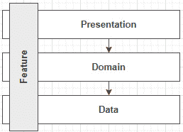
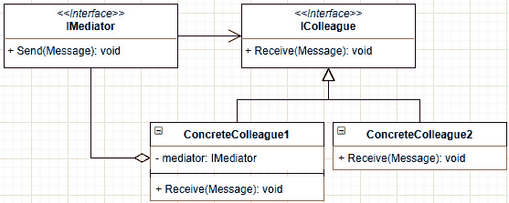
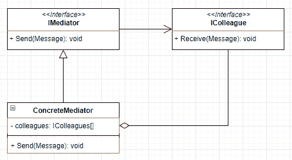
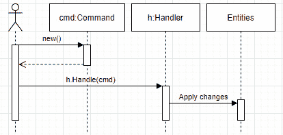
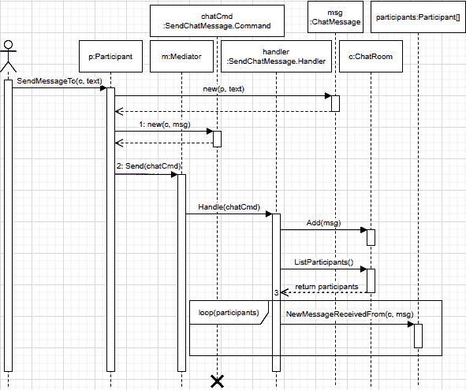

# 十四、中介和 CQRS 设计模式

在本章中，我们将探讨我们将在下一章中使用的关于**垂直切片架构**的构建块。我们首先简要介绍垂直切片体系结构，让您了解最终目标，了解我们的发展方向。然后我们探索了**中介**设计模式，它在我们的应用的组件之间扮演着中间人的角色。这就引出了**命令查询责任分离**（**CQRS**模式），它描述了如何组织我们的逻辑。最后，为了将所有这些结合起来，我们将探索 MediatR，一种中介设计模式的开源实现。

本章将介绍以下主题：

*   垂直切片体系结构的高级概述
*   实现中介模式
*   实现 CQRS 模式
*   使用 MediatR 作为中介

让我们从最终目标开始。

# 垂直切片架构的高层概述

在开始之前，让我们看看本章和下一章的最终目标。通过这种方式，在本章中更容易跟踪实现该目标的进度。

正如我们刚刚在关于分层的章节中所述，层基于共享责任将类分组在一起。因此，包含数据访问代码的类是数据访问层（或基础结构）的一部分。在图中，层通常由水平切片表示，如下所示：


图 14.1–将层表示为水平切片的图

“垂直切片”的名字就是由此而来的；垂直切片表示每个图层中创建特定特征的部分。因此，我们不是将应用划分为各个层，而是将其按功能进行划分。特性管理其数据访问代码、域逻辑，甚至可能管理其表示代码。通过这样做，我们可以将各个功能彼此分离，但要将每个功能的组件紧密地连接在一起。当我们使用分层添加、更新或删除特征时，我们会对一个或多个层进行更改。不幸的是，“一个或多个层”经常被翻译成“所有层”。对于垂直切片，所有功能都被隔离，允许我们独立设计它们。

从分层的角度来看，这就像将您对软件的思考方式翻转到 90 度的角度：



图 14.2–表示穿过所有层的垂直切片的示意图

垂直切片架构没有规定**CQR**、**中介**模式或**中介**模式的使用，但这些工具和模式可以很好地结合在一起，正如我们在下一章中看到的。

我们的目标是将功能封装在一起，使用 CQR 将应用划分为请求（命令和查询），并使用 MediatR 作为 CQR 管道的中介，将各个部分彼此分离。

您现在知道了计划——我们稍后将探索垂直切片架构；同时，让我们从中介设计模式开始。

# 实现中介模式

**介体**模式是另一种 GoF 设计模式，它控制对象之间的交互方式（使之成为一种行为模式）。

## 目标

调解人的角色是管理对象（同事）之间的通信。这些同事不应该直接交流，而应该使用调解人。调解人有助于打破这些同事之间的紧密联系。

简而言之，**调解人是同事之间传递信息的中间人**。

## 设计

让我们从一些 UML图开始。从一个非常高的层次来看，调解员模式由调解员和同事组成：


图 14.3–表示中介模式的类图

当系统中的对象希望向一个或多个同事发送消息时，它将使用中介。以下是它的工作原理示例：


图 14.4–调解人向同事转发消息的序列图

这对同事也有好处；要相互交谈，同事还必须使用调解人。我们可以按如下方式更新图表：



图 14.5–表示中介模式（包括同事协作）的类图

在这个图中，`ConcreteColleague1`既是一个同事，也是调解人的消费者。例如，该同事可以使用中介向另一位同事发送消息，如下所示：


图 14.6–表示通过中介器与 CollegUE2 通信的 CollegUE1 的序列图

从调解人的角度来看，它的实现很可能包含一组同事进行交流，如下所示：



图 14.7–表示一个简单假设的具体中介实现的类图

所有这些 UML图都很有用，但已经足够了；现在是看一些代码的时候了。

## 项目-调解人（IMediator）

中介项目表示使用中介模式的简化聊天系统。让我们从界面开始：

```cs
namespace Mediator
{
    public interface IMediator
    {
        void Send(Message message);
    }
    public interface IColleague
    {
        string Name { get; }
        void ReceiveMessage(Message message);
    }
    public class Message
    {
        public Message(IColleague from, string content)
        {
            Sender = from ?? throw new ArgumentNullException(nameof(from));
            Content = content ?? throw new ArgumentNullException(nameof(content));
        }
        public IColleague Sender { get; }
        public string Content { get; }
    }
}
```

系统由以下部分组成：

*   `IMediator`，它发送消息。
*   `IColleague`，它接收消息并具有`Name`属性（用于输出内容）。
*   `Message`类，表示`IColleague`实现发送的消息。

现在来看看`IMediator`接口的实现。`ConcreteMediator`不加区别地向所有`IColleague`实例广播消息：

```cs
public class ConcreteMediator : IMediator
{
    private readonly List<IColleague> _colleagues;
    public ConcreteMediator(params IColleague[] colleagues)
    {
        if (colleagues == null) { throw new ArgumentNullException(nameof(colleagues)); }
        _colleagues = new List<IColleague>(colleagues);
    }
    public void Send(Message message)
    {
        foreach (var colleague in _colleagues)
        {
            colleague.ReceiveMessage(message);
        }
    }
}
```

调解人很简单；它将收到的所有消息转发给它认识的每一位同事。模式的最后一部分是`ConcreteColleague`，它将消息委托给`IMessageWriter<TMessage>`接口：

```cs
public class ConcreteColleague : IColleague
{
    private readonly IMessageWriter<Message> _messageWriter;
    public ConcreteColleague(string name, IMessageWriter<Message> messageWriter)
    {
        Name = name ?? throw new ArgumentNullException(nameof(name));
        _messageWriter = messageWriter ?? throw new ArgumentNullException(nameof(messageWriter));
    }
    public string Name { get; }
    public void ReceiveMessage(Message message)
    {
        _messageWriter.Write(message);
    }
}
```

那个类再简单不过了：它在创建时使用一个名称和`IMessageWriter<TMessage>`实现，然后存储一个引用供将来使用。

`IMessageWriter<TMessage>`界面充当演示者，控制消息的显示方式，与中介模式无关。然而，这是管理`ConcreteColleague`对象如何处理消息的一种很好的方法。代码如下：

```cs
namespace Mediator
{
    public interface IMessageWriter<TMessage>
    {
        void Write(TMessage message);
    }
}
```

我们现在就用那个聊天系统吧。系统的使用者正在进行以下集成测试：

```cs
public class MediatorTest
{
    [Fact]
    public void Send_a_message_to_all_colleagues()
    {
        // Arrange
        var (millerWriter, miller) = CreateConcreteColleague("Miller");
        var (orazioWriter, orazio) = CreateConcreteColleague("Orazio");
        var (fletcherWriter, fletcher) = CreateConcreteColleague("Fletcher");
```

测试首先定义了三名同事，他们有自己的`TestMessageWriter`实现（名字是随机生成的）。

```cs
        var mediator = new ConcreteMediator(miller, orazio, fletcher);
        var expectedOutput = @"[Miller]: Hey everyone!
[Orazio]: What's up Miller?
[Fletcher]: Hey Miller!
";
```

在前面的`Arrange`块的第二部分中，我们创建了被测对象（`mediator`），并注册了三名同事。在`Arrange`块的末尾，我们还定义了测试的预期输出。需要注意的是，我们控制`TestMessageWriter`实现的输出（定义在`MediatorTest`类末尾）。

```cs
        // Act
        mediator.Send(new Message(
            from: miller,
            content: "Hey everyone!"
        ));
        mediator.Send(new Message(
            from: orazio,
            content: "What's up Miller?"
        ));
        mediator.Send(new Message(
            from: fletcher,
            content: "Hey Miller!"
        ));
```

在前面的`Act`块中，我们按照预期顺序通过`mediator`发送三条消息。

```cs
        // Assert
        Assert.Equal(expectedOutput, millerWriter.Output.ToString());
        Assert.Equal(expectedOutput, orazioWriter.Output.ToString());
        Assert.Equal(expectedOutput, fletcherWriter.Output.ToString());
    }
```

在`Assert`块中，我们确保所有同事都收到了所有消息。

```cs
    private (TestMessageWriter, ConcreteColleague) CreateConcreteColleague(string name)
    {
        var messageWriter = new TestMessageWriter();
        var concreateColleague = new ConcreteColleague(name, messageWriter);
        return (messageWriter, concreateColleague);
    }
```

`CreateConcreteColleague`方法是一种辅助方法，它封装了同事的创建，使我们能够编写测试的`Arrange`部分中使用的一行声明。

```cs
    private class TestMessageWriter : IMessageWriter<Message>
    {
        public StringBuilder Output { get; } = new StringBuilder();
        public void Write(Message message)
        {
            Output.AppendLine($"[{message.Sender.Name}]: {message.Content}");
        }
    }
}
```

最后，`TestMessageWriter`类将消息写入`StringBuilder`中，使得断言输出变得容易。如果我们要为此构建一个 GUI，我们可以编写一个`IMessageWriter<Message>`的实现来写入该 GUI；例如，在 web UI 的情况下，可以使用**信号器**。

为了总结示例，使用者（单元测试）通过中介向同事发送消息。这些消息写在每个`TestMessageWriter`的`StringBuilder`实例中。最后，我们断言所有同事都收到了预期的消息。这说明了 Mediator 设计模式的基本思想。

从理论上讲，同事应该通过调解员进行沟通，因此没有调解员，调解员模式就不完整。让我们实现一个聊天室来解决这个概念。

## 项目-调解人（iChatrom）

在上一个代码示例中，类是以中介模式参与者命名的，如图 14.7 所示。虽然这个示例非常类似，但它使用特定于域的名称，并实现了更多的方法来管理系统。让我们从抽象开始：

```cs
namespace Mediator
{
    public interface IChatRoom
    {
        void Join(IParticipant participant);
        void Send(ChatMessage message);
    }
```

`IChatRoom`接口是中介，它定义了两种方法而不是一种：

*   `Join`，允许`IParticipant`加入`IChatRoom`。
*   `Send`，向其他人发送消息。

```cs
    public interface IParticipant
    {
        string Name { get; }
        void Send(string message);
        void ReceiveMessage(ChatMessage message);
        void ChatRoomJoined(IChatRoom chatRoom);
    }
```

`IParticipant`接口还有几个方法：

*   `Send`，发送消息。
*   `ReceiveMessage`，接收来自其他`IParticipant`对象的消息。
*   `ChatRoomJoined`，确认`IParticipant`对象已成功加入聊天室。

```cs
    public class ChatMessage
    {
        public ChatMessage(IParticipant from, string content)
        {
            Sender = from ?? throw new ArgumentNullException(nameof(from));
            Content = content ?? throw new ArgumentNullException(nameof(content));
        }
        public IParticipant Sender { get; }
        public string Content { get; }
    }
}
```

`ChatMessage`与前面的`Message`类相同，只是引用了`IParticipant`而不是`IColleague`。

现在让我们看一下的`IParticipant`实现：

```cs
public class User : IParticipant
{
    private IChatRoom _chatRoom;
    private readonly IMessageWriter<ChatMessage> _messageWriter;
    public User(IMessageWriter<ChatMessage> messageWriter, string name)
    {
        _messageWriter = messageWriter ?? throw new ArgumentNullException(nameof(messageWriter));
        Name = name ?? throw new ArgumentNullException(nameof(name));
    }
    public string Name { get; }
    public void ChatRoomJoined(IChatRoom chatRoom)
    {
        _chatRoom = chatRoom;
    }
    public void ReceiveMessage(ChatMessage message)
    {
        _messageWriter.Write(message);
    }
    public void Send(string message)
    {
        _chatRoom.Send(new ChatMessage(this, message));
    }
}
```

`User`类代表我们的默认`IParticipant`。一个`User`实例只能在一个`IChatRoom`中聊天；这是在调用`ChatRoomJoined`方法时设置的。当它收到一条消息时，它将其委托给它的`IMessageWriter<ChatMessage>`。最后，`User`实例可以通过将消息委托给中介（`IChatRoom)`来发送消息。

我们可以创建一个`Moderator`、`Administrator`、`SystemAlerts`或我们认为合适的任何其他`IParticipant`实现，但不在本示例中。我将把这留给你们来试验中介模式。

现在来看`IChatRoom`实施：

```cs
public class ChatRoom : IChatRoom
{
    private readonly List<IParticipant> _participants = new List<IParticipant>();
    public void Join(IParticipant participant)
    {
        _participants.Add(participant);
        participant.ChatRoomJoined(this);
        Send(new ChatMessage(participant, "Has joined the channel"));
    }
    public void Send(ChatMessage message)
    {
        _participants.ForEach(participant => participant.ReceiveMessage(message));
    }
}
```

`ChatRoom`甚至比`User`更苗条；它允许`IParticipant`加入并向所有注册参与者发送`ChatMessage`。加入`ChatRoom`时，它会在`IParticipant`上保留一个引用，告诉`IParticipant`它已成功加入，然后向所有参与者发送`ChatMessage`通知新加入者。

就这样,；我们有一个经典的中介实现。在移动到下一节之前，让我们看一看在 To.T1A.的 Ty0T0.实例，这是另一个集成测试：

```cs
public class ChatRoomTest
{
    [Fact]
    public void ChatRoom_participants_should_send_and_receive_messages()
    {
        // Arrange
        var (kingChat, king) = CreateTestUser("King");
        var (kelleyChat, kelley) = CreateTestUser("Kelley");
        var (daveenChat, daveen) = CreateTestUser("Daveen");
        var (rutterChat, _) = CreateTestUser("Rutter");
        var chatroom = new ChatRoom();
```

我们在`Arrange`部分创建了四个用户及其各自的`TestMessageWriter`实例，与之前一样（名称也是随机生成的）。

```cs
        // Act
        chatroom.Join(king);
        chatroom.Join(kelley);
        king.Send("Hey!");
        kelley.Send("What's up King?");
        chatroom.Join(daveen);
        king.Send("Everything is great, I joined the CrazyChatRoom!");
        daveen.Send("Hey King!");
        king.Send("Hey Daveen");
```

在`Act`块中，我们的测试用户加入`chatroom`实例并向其中发送消息。

```cs
        // Assert
        Assert.Empty(rutterChat.Output.ToString());
```

由于 Rutter 没有加入聊天室，我们不希望收到任何消息。

```cs
        Assert.Equal(@"[King]: Has joined the channel
[Kelley]: Has joined the channel
[King]: Hey!
[Kelley]: What's up King?
[Daveen]: Has joined the channel
[King]: Everything is great, I joined the CrazyChatRoom!
[Daveen]: Hey King!
[King]: Hey Daveen
", kingChat.Output.ToString());
```

由于 King 是第一个加入该频道的人，因此预计他会收到所有消息。

```cs
        Assert.Equal(@"[Kelley]: Has joined the channel
[King]: Hey!
[Kelley]: What's up King?
[Daveen]: Has joined the channel
[King]: Everything is great, I joined the CrazyChatRoom!
[Daveen]: Hey King!
[King]: Hey Daveen
", kelleyChat.Output.ToString());
```

Kelley 是第二个加入聊天室的用户，因此输出包含几乎所有的消息。

```cs
        Assert.Equal(@"[Daveen]: Has joined the channel
[King]: Everything is great, I joined the CrazyChatRoom!
[Daveen]: Hey King!
[King]: Hey Daveen
", daveenChat.Output.ToString());
    }
```

在金和凯利交换了几句话后，达文加入了进来，因此谈话预计将在稍后开始。

```cs
    private (TestMessageWriter, User) CreateTestUser(string name)
    {
        var writer = new TestMessageWriter();
        var user = new User(writer, name);
        return (writer, user);
    }
```

`CreateTestUser`方法有助于简化测试用例的`Arrange`部分，与之前类似。

```cs
    private class TestMessageWriter : IMessageWriter<ChatMessage>
    {
        public StringBuilder Output { get; } = new StringBuilder();
        public void Write(ChatMessage message)
        {
            Output.AppendLine($"[{message.Sender.Name}]: {message.Content}");
        }
    }
}
```

`TestMessageWriter`实现与前面的示例相同，在`StringBuilder`实例中累积消息。

为了总结测试用例，我们有四个用户；其中三人在不同的时间加入了同一聊天室，聊了一会儿。每个人的输出都不同，因为您现在加入的时间很重要。

## 结论

正如我们在前面两个项目中所探讨的，一个**中介**允许我们解耦系统的组件。**调解人是同事**之间的中间人，在小型聊天室样本中为我们提供了很好的服务。

现在让我们看看中介模式如何帮助我们遵循**坚实的**原则：

*   **S**：调解人从同事身上提取沟通责任。
*   **O**：通过中介传递消息，我们可以创建新同事，改变现有同事的行为，而不会影响其他同事。如果我们需要一位新同事；我们可以向调解人登记，瞧！另一方面，如果我们需要新的中介行为，我们总是可以实现新的中介并保留现有同事的实现。
*   **L**：不适用。
*   **I**：系统分为多个小接口（`IMediator`和`IColleague`）。
*   **D**：中介模式的所有参与者都完全依赖于其他接口。

接下来，我们将探讨 CQR，它将允许我们清楚地分离命令和查询，从而形成一个更易于维护的应用。

# 实施 CQRS 模式

**CQRS**代表**命令查询责任分离**的。我们可以通过两种方式应用 CQR：

*   将请求划分为命令和查询。
*   将 CQRS 概念应用到更高的层次，从而形成分布式系统。

在本章中，我们将继续使用第一个定义，但我们将在[*第 16 章*](16.html#_idTextAnchor291)*《微服务架构简介》*中讨论第二个定义。

## 目标

目标是将所有请求分为两类：命令和查询。

命令会改变应用的状态。例如，创建、更新和删除实体都是命令。命令不返回值。

另一方面，查询读取应用的状态，但从不更改它。例如，读取订单、读取订单历史记录和检索用户配置文件都是查询。

通过执行这个划分，我们在 mutator 和 accessor 请求之间创建了一个清晰的关注点分离。

## 设计

没有明确的设计，但对我们来说，命令流程应该如下所示：



图 14.8–表示命令抽象流的序列图

使用者创建一个命令对象并将其发送给命令处理程序，然后命令处理程序将其应用于应用。在本例中，我将其命名为`Entities`，但它可以通过 HTTP 向数据库或 web API 调用发送 SQL`UPDATE`命令；实施细节并不重要。

查询的概念与相同，但它返回一个值。非常重要的是，查询不能更改应用的状态，而是查询数据，如下所示：


图 14.9–表示查询抽象流的序列图

与命令类似，使用者创建一个查询对象并将其发送给处理程序，然后处理程序执行一些逻辑来检索和返回请求的数据。您可以将`Entities`替换为处理程序查询数据所需的任何内容。

说够了——让我们看一个 CQRS 项目。

## 项目名称：CQRS

**上下文**：我们需要构建一个改进版的聊天系统。旧系统运行得很好，我们现在需要扩大它的规模。调解人对我们很有帮助，所以我们保留了那个部分，我们选择了 CQR 来帮助我们完成这个新的、改进的设计。过去参与者仅限于一个聊天室，但现在参与者应该能够同时在多个聊天室聊天。

新系统由三个命令和两个查询组成：

*   参与者必须能够加入聊天室。
*   参与者必须能够离开聊天室。
*   参与者必须能够向聊天室发送消息。
*   参与者必须能够获得加入聊天室的参与者列表。
*   参与者必须能够从聊天室检索现有消息。

前三个是命令，后两个是查询。该系统由大量使用 C#泛型的中介支持，如下所示：

```cs
public interface IMediator
{
    TReturn Send<TQuery, TReturn>(TQuery query)
        where TQuery: IQuery<TReturn>;
    void Send<TCommand>(TCommand command)
        where TCommand : ICommand;
    void Register<TCommand>(ICommandHandler<TCommand> commandHandler)
        where TCommand : ICommand;
    void Register<TQuery, TReturn>(IQueryHandler<TQuery, TReturn> commandHandler)
        where TQuery : IQuery<TReturn>;
}
public interface ICommand { }
public interface ICommandHandler<TCommand>
    where TCommand : ICommand
{
    void Handle(TCommand command);
}
public interface IQuery<TReturn> { }
public interface IQueryHandler<TQuery, TReturn>
    where TQuery : IQuery<TReturn>
{
    TReturn Handle(TQuery query);
}
```

如果您不熟悉泛型，这可能会让人望而生畏，但代码要比看起来简单得多。首先，我们有两个空接口：`ICommand`和`IQuery<TReturn>`。我们可以省略它们，但它们有助于识别命令和查询；它们有助于描述我们的意图。

然后我们有两个接口来处理命令或查询。让我们从要处理的每种命令类型要实现的接口开始：

```cs
public interface ICommandHandler<TCommand>
    where TCommand : ICommand
{
    void Handle(TCommand command);
}
```

该接口定义了一个将命令作为参数的`Handle`方法。泛型参数`TCommand`表示实现接口的类处理的命令类型。查询处理程序接口相同，但它也指定了返回值：

```cs
public interface IQueryHandler<TQuery, TReturn>
    where TQuery : IQuery<TReturn>
{
    TReturn Handle(TQuery query);
}
```

中介抽象允许使用我们刚刚探索过的通用接口注册命令和查询处理程序。它还支持发送命令和查询。然后我们有`ChatMessage`，它类似于最后两个样本（增加了创建日期）：

```cs
public class ChatMessage
{
    public ChatMessage(IParticipant sender, string message)
    {
        Sender = sender ?? throw new ArgumentNullException(nameof(sender));
        Message = message ?? throw new ArgumentNullException(nameof(message));
        Date = DateTime.UtcNow;
    }
    public DateTime Date { get; }
    public IParticipant Sender { get; }
    public string Message { get; }
}
```

随后是更新的`IParticipant`界面：

```cs
public interface IParticipant
{
    string Name { get; }
    void Join(IChatRoom chatRoom);
    void Leave(IChatRoom chatRoom);
    void SendMessageTo(IChatRoom chatRoom, string message);
    void NewMessageReceivedFrom(IChatRoom chatRoom, ChatMessage message);
    IEnumerable<IParticipant> ListParticipantsOf(IChatRoom chatRoom);
    IEnumerable<ChatMessage> ListMessagesOf(IChatRoom chatRoom);
}
```

`IParticipant`接口的所有方法都接受一个`IChatRoom`参数，支持多个聊天室。接下来，更新的`IChatRoom`界面：

```cs
public interface IChatRoom
{
    string Name { get; }
    void Add(IParticipant participant);
    void Remove(IParticipant participant);
    IEnumerable<IParticipant> ListParticipants();
    void Add(ChatMessage message);
    IEnumerable<ChatMessage> ListMessages();
}
```

在进入命令和聊天本身之前，让我们来看看 AutoT0.类：

```cs
public class Mediator : IMediator
{
    private readonly HandlerDictionary _handlers = new 
    HandlerDictionary();
    public void Register<TCommand>(ICommandHandler<TCommand> commandHandler)
        where TCommand : ICommand
    {
        _handlers.AddHandler(commandHandler);
    }
    public void Register<TQuery, TReturn> (IQueryHandler<TQuery, TReturn> commandHandler)
        where TQuery : IQuery<TReturn>
    {
        _handlers.AddHandler(commandHandler);
    }
    public TReturn Send<TQuery, TReturn>(TQuery query)
        where TQuery : IQuery<TReturn>
    {
        var handler = _handlers.Find<TQuery, TReturn>();
        return handler.Handle(query);
    }
    public void Send<TCommand>(TCommand command)
        where TCommand : ICommand
    {
        var handlers = _handlers.FindAll<TCommand>();
        foreach (var handler in handlers)
        {
            handler.Handle(command);
        }
    }
}
```

`Mediator`类支持注册命令和查询，以及向处理程序发送查询或向零个或多个处理程序发送命令。

笔记

我省略了`HandlerDictionary`的实现，因为它没有添加任何内容，只是一个实现细节。在 GitHub（[上提供 https://net5.link/CWCe](https://net5.link/CWCe) 。

现在转到命令。为了保持整洁，我将命令和处理程序组合在一起，但您可以使用另一种方法对您的命令和处理程序进行分类：

```cs
public class JoinChatRoom
{
    public class Command : ICommand
    {
        public Command(IChatRoom chatRoom, IParticipant requester)
        {
            ChatRoom = chatRoom ?? throw new ArgumentNullException(nameof(chatRoom));
            Requester = requester ?? throw new ArgumentNullException(nameof(requester));
        }
        public IChatRoom ChatRoom { get; }
        public IParticipant Requester { get; }
    }
    public class Handler : ICommandHandler<Command>
    {
        public void Handle(Command command)
        {
            command.ChatRoom.Add(command.Requester);
        }
    }
}
```

`JoinChatRoom.Command`类表示命令本身，一种携带命令数据的数据结构。`JoinChatRoom.Handler`类处理该类型的命令。执行时，它将指定的`IParticipant`从`ChatRoom`和`Requester`属性添加到指定的`IChatRoom`。下一个命令：

```cs
public class LeaveChatRoom
{
    public class Command : ICommand
    {
        public Command(IChatRoom chatRoom, IParticipant requester)
        {
            ChatRoom = chatRoom ?? throw new ArgumentNullException(nameof(chatRoom));
            Requester = requester ?? throw new ArgumentNullException(nameof(requester));
        }
        public IChatRoom ChatRoom { get; }
        public IParticipant Requester { get; }
    }
    public class Handler : ICommandHandler<Command>
    {
        public void Handle(Command command)
        {
            command.ChatRoom.Remove(command.Requester);
        }
    }
}
```

该代码表示与`JoinChatRoom`命令完全相反的，即`LeaveChatRoom`处理程序从指定的`IChatRoom`中删除`IParticipant`。到下一个命令：

```cs
public class SendChatMessage
{
    public class Command : ICommand
    {
        public Command(IChatRoom chatRoom, ChatMessage message)
        {
            ChatRoom = chatRoom ?? throw new ArgumentNullException(nameof(chatRoom));
            Message = message ?? throw new ArgumentNullException(nameof(message));
        }
        public IChatRoom ChatRoom { get; }
        public ChatMessage Message { get; }
    }
    public class Handler : ICommandHandler<Command>
    {
        public void Handle(Command command)
        {
            command.ChatRoom.Add(command.Message);
            foreach (var participant in command.ChatRoom.ListParticipants())
            {
                participant.NewMessageReceivedFrom(command.ChatRoom, command.Message);
            }
        }
    }
}
```

另一方面，`SendChatMessage`命令处理两件事：

*   它将指定的`Message`添加到`IChatRoom`（现在它只是一个跟踪用户和过去消息的数据结构）。
*   它还将指定的`Message`发送给加入该`IChatRoom`的所有`IParticipant`。

我们开始看到许多较小的部分相互作用，以创建一个更发达的系统。但我们还没有完成；让我们看一下这两个查询，然后是聊天实现：

```cs
public class ListParticipants
{
    public class Query : IQuery<IEnumerable<IParticipant>>
    {
        public Query(IChatRoom chatRoom, IParticipant requester)
        {
            Requester = requester ?? throw new ArgumentNullException(nameof(requester));
            ChatRoom = chatRoom ?? throw new ArgumentNullException(nameof(chatRoom));
        }
        public IParticipant Requester { get; }
        public IChatRoom ChatRoom { get; }
    }
    public class Handler : IQueryHandler<Query, IEnumerable<IParticipant>>
    {
        public IEnumerable<IParticipant> Handle(Query query)
        {
            return query.ChatRoom.ListParticipants();
        }
    }
}
```

`ListParticipants`查询的处理程序使用指定的`IChatRoom`并返回其参与者。现在，转到最后一个查询：

```cs
public class ListMessages
{
    public class Query : IQuery<IEnumerable<ChatMessage>>
    {
        public Query(IChatRoom chatRoom, IParticipant requester)
        {
            Requester = requester ?? throw new ArgumentNullException(nameof(requester));
            ChatRoom = chatRoom ?? throw new ArgumentNullException(nameof(chatRoom));
        }
        public IParticipant Requester { get; }
        public IChatRoom ChatRoom { get; }
    }
    public class Handler : IQueryHandler<Query, IEnumerable<ChatMessage>>
    {
        public IEnumerable<ChatMessage> Handle(Query query)
        {
            return query.ChatRoom.ListMessages();
        }
    }
}
```

`ListMessages`查询的处理程序使用指定的`IChatRoom`实例并返回其消息。

笔记

所有的命令和查询都引用了`IParticipant`，因此我们可以强制执行诸如“`IParticipant`必须在发送消息之前加入通道”之类的规则。为了保持代码简单，我决定省略这些细节，但如果您愿意，可以随意添加这些特性。

接下来，让我们来看看 AuthT0p 类，它是一个简单的数据结构，它包含聊天室的状态：

```cs
public class ChatRoom : IChatRoom
{
    private readonly List<IParticipant> _participants = new List<IParticipant>();
    private readonly List<ChatMessage> _chatMessages = new	List<ChatMessage>();
    public ChatRoom(string name)
    {
        Name = name ?? throw new ArgumentNullException(nameof(name));
    }
    public string Name { get; }
    public void Add(IParticipant participant)
    {
        _participants.Add(participant);
    }
    public void Add(ChatMessage message)
    {
        _chatMessages.Add(message);
    }
    public IEnumerable<ChatMessage> ListMessages()
    {
        return _chatMessages.AsReadOnly();
    }
    public IEnumerable<IParticipant> ListParticipants()
    {
        return _participants.AsReadOnly();
    }
    public void Remove(IParticipant participant)
    {
        _participants.Remove(participant);
    }
}
```

如果我们再看一看`ChatRoom`类，它有一个`Name`属性，它包含一个`IParticipant`实例列表和一个`ChatMessage`实例列表。`ListMessages()`和`ListParticipants()`都返回列表`AsReadOnly()`，因此聪明的程序员无法从外部改变`ChatRoom`的状态。就是这样，新的`ChatRoom`类是其底层依赖项的一个外表。

最后，`Participant`类可能是这个系统中最激动人心的部分，因为它大量使用了我们的**中介**和**CQRS**实现：

```cs
public class Participant : IParticipant
{
    private readonly IMediator _mediator;
    private readonly IMessageWriter _messageWriter;
    public Participant(IMediator mediator, string name, IMessageWriter messageWriter)
    {
        _mediator = mediator ?? throw new ArgumentNullException(nameof(mediator));
        Name = name ?? throw new ArgumentNullException(nameof(name));
        _messageWriter = messageWriter ?? throw new ArgumentNullException(nameof(messageWriter));
    }
    public string Name { get; }
    public void Join(IChatRoom chatRoom)
    {
        _mediator.Send(new JoinChatRoom.Command(chatRoom, this));
    }
    public void Leave(IChatRoom chatRoom)
    {
        _mediator.Send(new LeaveChatRoom.Command(chatRoom, this));
    }
    public IEnumerable<ChatMessage> ListMessagesOf(IChatRoom chatRoom)
    {
        return _mediator.Send<ListMessages.Query, IEnumerable<ChatMessage>>(new ListMessages.Query(chatRoom, this));
    }
    public IEnumerable<IParticipant> ListParticipantsOf(IChatRoom chatRoom)
    {
        return _mediator.Send<ListParticipants.Query, IEnumerable<IParticipant>>(new ListParticipants.Query(chatRoom, this));
    }
    public void NewMessageReceivedFrom(IChatRoom chatRoom, ChatMessage message)
    {
        _messageWriter.Write(chatRoom, message);
    }
    public void SendMessageTo(IChatRoom chatRoom, string message)
    {
        _mediator.Send(new SendChatMessage.Command (chatRoom, new ChatMessage(this, message)));
    }
}
```

`Participant`类的每个方法，除了`NewMessageReceivedFrom`之外，都通过`IMediator`发送命令或查询，打破了`Participant`与系统操作（即命令和查询）的紧密耦合。如果我们仔细想想，`Participant`类也是其底层依赖关系的一个简单外表，将大部分工作委托给中介。

现在，让我们看一看，当所有东西放在一起时，它是如何工作的。我将几个测试用例组合在一起；以下是共享设置代码：

```cs
public class ChatRoomTest
{
    private readonly IMediator _mediator = new Mediator();
    private readonly TestMessageWriter _reagenMessageWriter = new TestMessageWriter();
    private readonly TestMessageWriter _garnerMessageWriter = new TestMessageWriter();
    private readonly TestMessageWriter _corneliaMessageWriter = new TestMessageWriter();
    private readonly IChatRoom _room1 = new ChatRoom("Room 1");
    private readonly IChatRoom _room2 = new ChatRoom("Room 2");
    private readonly IParticipant _reagen;
    private readonly IParticipant _garner;
    private readonly IParticipant _cornelia;
    public ChatRoomTest()
    {
        _mediator.Register(new JoinChatRoom.Handler());
        _mediator.Register(new LeaveChatRoom.Handler());
        _mediator.Register(new SendChatMessage.Handler());
        _mediator.Register(new ListParticipants.Handler());
        _mediator.Register(new ListMessages.Handler());
        _reagen = new Participant(_mediator, "Reagen",	_reagenMessageWriter);
        _garner = new Participant(_mediator, "Garner", 	_garnerMessageWriter);
        _cornelia = new Participant(_mediator, "Cornelia",	_corneliaMessageWriter);
    }
    // ...
}
```

我们的测试程序由以下部分组成：

*   一个`IMediator`，使所有同事能够相互交流。
*   两个`IChatRoom`实例。
*   三个`IParticipant`实例及其`TestMessageWriter`。

在构造函数中，所有处理程序都注册到`Mediator`实例中，因此它知道如何处理命令和查询。参与者的姓名是随机生成的。以下是第一个测试用例：

```cs
[Fact]
public void A_participant_should_be_able_to_list_the_participants_that_joined_a_chatroom()
{
    _reagen.Join(_room1);
    _reagen.Join(_room2);
    _garner.Join(_room1);
    _cornelia.Join(_room2);
    var room1Participants = _reagen.ListParticipantsOf(_room1);
    Assert.Collection(room1Participants,
        p => Assert.Same(_reagen, p),
        p => Assert.Same(_garner, p)
    );
}
```

在那个测试用例中，Reagen 和Garner 加入房间 1，Reagen 和 Cornelia 加入房间 2。然后，Reagen 从房间 1 请求参与者列表，该房间输出 Reagen 和 Garner。代码易于理解和使用。在幕后，它通过中介使用命令和查询，这打破了同事之间的紧密耦合。下面是一个序列图，表示参与者加入聊天室时发生的情况：


图 14.10–表示参与者（p）加入聊天室（c）的流程的序列图

1.  参与者（`p`创建一个`JoinChatRoom`命令（`joinCmd`。
2.  `p`通过调解人（`m`发送`joinCmd`。
3.  `m`找到`joinCmd`并发送给其处理人（`handler`。
4.  `handler`执行逻辑（将`p`添加到聊天室）。
5.  `joinCmd`之后不再存在；命令是短暂的。

这意味着`Participant`从未与`ChatRoom`或其他参与者直接互动。

当参与者请求聊天室的参与者列表时，会发生类似的工作流：


图 14.11–表示参与者（p）请求聊天室参与者列表的流程的序列图（c）

1.  `Participant`（`p`创建一个`ListParticipants`查询（`listQuery`。
2.  `p`通过调解人（`m`发送`listQuery`。
3.  `m`查找查询并将其发送给其处理程序（`handler`。
4.  `handler`执行逻辑（列出聊天室的参与者）。
5.  `listQuery`之后不再存在；查询也是短暂的。

再次说明，`Participant`不会直接与`ChatRoom`交互。

下面是另一个测试用例，其中`Participant`向聊天室发送消息，另一个`Participant`接收该消息：

```cs
[Fact]
public void A_participant_should_receive_new_messages()
{
    _reagen.Join(_room1);
    _garner.Join(_room1);
    _garner.Join(_room2);
    _reagen.SendMessageTo(_room1, "Hello!");
    Assert.Collection(_garnerMessageWriter.Output,
        line =>
        {
            Assert.Equal(_room1, line.chatRoom);
            Assert.Equal(_reagen, line.message.Sender);
            Assert.Equal("Hello!", line.message.Message);
        }
    );
}
```

在那个测试案例中，里根加入了房间 1，而加纳加入了房间 1 和房间 2。然后里根向 1 号房间发送了一条信息，我们确认加纳收到过一次。`SendMessageTo`工作流与我们看到的另一个工作流非常相似，但具有更复杂的命令处理程序：



图 14.12–表示参与者（p）向聊天室（c）发送消息（msg）的流程的序列图

从该图中，我们可以观察到逻辑被推送到了`ChatMessage.Handler`类。所有其他参与者在相互了解有限的情况下一起工作（见甚至互不了解）。

这说明了CQRS 如何与调解人合作：

1.  创建命令（或查询）。
2.  通过中介发送该命令。
3.  让一个或多个处理程序执行该命令的逻辑。

您可以探索其他测试用例，以熟悉程序和概念。

笔记

您可以在 VisualStudio 中调试测试；使用断点结合*步进（F11）*和*步过（F10）*探索样本。

我还创建了一个`ChatModerator`实例，当一条消息包含`badWords`集合中的一个单词时，它会在“主持人聊天室”中发送一条消息。该测试用例为每个`SendChatMessage.Command`执行多个处理程序。我将让您自己探索这些其他测试用例。

## 代码气味–标记接口

我们在代码示例中使用了空的`ICommand`和`IQuery<TReturn>`接口，使代码更加明确和自描述性。空接口是某种可能出错的迹象：代码气味。我们称这些**标记接口**。

在我们的例子中，它们有助于识别命令和查询，但它们是空的，不添加任何内容。我们可以在不影响系统的情况下丢弃它们。另一方面，我们没有表演任何魔术或违反任何原则，因此拥有它们似乎是可以的；它们有助于定义意图。

下面是两个标记接口的示例。

### 元数据

标记可以用于定义元数据。一个类“实现”了空接口，一些使用者稍后会使用它做一些事情。它可以是特定类型的程序集扫描、策略选择或其他内容。

尝试使用自定义属性，而不是创建标记接口来添加元数据。属性背后的思想是向类或成员添加元数据。另一方面，存在用于创建契约的接口，它们应该定义至少一个成员；空合同就像一张白纸。

在真实的场景中，您可能需要考虑一个与另一个的成本。标记实现起来非常便宜，但可能违反坚实的原则。如果框架已经实现或支持了该机制，那么实现属性的成本可能与实现属性的成本一样低，但是如果需要手工编程，那么实现属性的成本可能比实现标记接口的成本要高得多。在做决定时，你必须始终将金钱、时间和技能作为关键因素进行评估。

### 依赖项标识符

如果您需要标记在特定类中注入特定的依赖项，那么您很可能是在欺骗**控制反转**。您应该找到一种方法来实现相同的目标，而不是使用依赖项注入，例如通过上下文注入依赖项。

让我们从以下界面开始：

```cs
public interface IStrategy
{
    string Execute();
}
```

在我们的程序中，我们有两个实现和两个标记，每个实现一个：

```cs
public interface IStrategyA : IStrategy { }
public interface IStrategyB : IStrategy { }
public class StrategyA : IStrategyA
{
    public string Execute() => "StrategyA";
}
public class StrategyB : IStrategyB
{
    public string Execute() => "StrategyB";
}
```

代码是赤裸裸的，但所有构建块都存在：

*   `StrategyA`实现了`IStrategyA`，继承自`IStrategy`。
*   `StrategyB`实现了`IStrategyB`，继承自`IStrategy`。
*   `IStrategyA`和`IStrategyB`都是空的标记接口。

现在，消费者需要使用这两种策略，消费者请求标记，而不是从合成根控制依赖关系：

```cs
public class Consumer
{
    public IStrategyA StrategyA { get; }
    public IStrategyB StrategyB { get; }
    public Consumer(IStrategyA strategyA, IStrategyB strategyB)
    {
        StrategyA = strategyA ?? throw new ArgumentNullException(nameof(strategyA));
        StrategyB = strategyB ?? throw new ArgumentNullException(nameof(strategyB));
    }
}
```

在这种情况下，`Consumer`类通过属性公开策略，以便稍后断言其组合，但在非演示场景中，它很可能直接使用它们。让我们通过构建依赖关系树，模拟组合根，然后断言使用者属性的值来测试这一点：

```cs
[Fact]
public void ConsumerTest()
{
    // Arrange
    var serviceProvider = new ServiceCollection()
        .AddSingleton<IStrategyA, StrategyA>()
        .AddSingleton<IStrategyB, StrategyB>()
        .AddSingleton<Consumer>()
        .BuildServiceProvider();
    // Act
    var consumer = serviceProvider.GetService<Consumer>();
    // Assert
    Assert.IsType<StrategyA>(consumer.StrategyA);
    Assert.IsType<StrategyB>(consumer.StrategyB);
}
```

这两个属性都是期望的类型，但这不是问题所在。`Consumer`通过注入标记 A 和 B 而不是两个`IStrategy`实例来控制要使用的依赖项以及何时使用它们。因此，我们无法从组合根控制依赖关系树。例如，我们不能将`IStrategyA`更改为`IStrategyB`和`IStrategyB`更改为`IStrategyA`，也不能注入两个`IStrategyB`实例或两个`IStrategyA`实例，甚至不能创建一个`IStrategyC`实例来替换`IStrategyA`或`IStrategyB`。

我们如何解决这个问题？让我们先删除标记，然后注入两个`IStrategy`实例。完成此操作后，我们将得到以下对象结构：

```cs
public class StrategyA : IStrategy
{
    public string Execute() => "StrategyA";
}
public class StrategyB : IStrategy
{
    public string Execute() => "StrategyB";
}
public class Consumer
{
    public IStrategy StrategyA { get; }
    public IStrategy StrategyB { get; }
    public Consumer(IStrategy strategyA, IStrategy strategyB)
    {
        StrategyA = strategyA ?? throw new ArgumentNullException(nameof(strategyA));
        StrategyB = strategyB ?? throw new ArgumentNullException(nameof(strategyB));
    }
}
```

在新的实现中，`Consumer`类不再控制叙述，而作文责任又回到了作文根。不幸的是，无法使用默认的依赖项注入容器进行上下文注入，我不想进入第三方框架。但还没有失去一切；我们可以使用工厂帮助 ASP.NET 构建`Consumer`实例，如下所示：

```cs
// Arrange
var serviceProvider = new ServiceCollection()
    .AddSingleton<StrategyA>()
    .AddSingleton<StrategyB>()
    .AddSingleton(serviceProvider =>
    {
        var strategyA = serviceProvider.GetService <StrategyA>();
        var strategyB = serviceProvider.GetService <StrategyB>();
        return new Consumer(strategyA, strategyB);
    })
    .BuildServiceProvider();
// Act
var consumer = serviceProvider.GetService<Consumer>();
// Assert
Assert.IsType<StrategyA>(consumer.StrategyA);
Assert.IsType<StrategyB>(consumer.StrategyB);
```

从那时起，我们控制程序的组成，我们可以通过 B 交换 A 或做任何我们想做的事情，只要实现尊重`IStrategy`合同。

总之，使用标记而不是上下文注入打破了控制原则的倒置，使消费者控制其依赖性。这与使用`new`关键字实例化对象非常接近。反转依赖项控件很容易，即使使用默认容器也是如此。如果您需要在上下文中注入依赖项，我在 2020 年启动了一个开源项目来实现这一点。参见*进一步阅读*章节。

## 结论

CQRS 建议将程序的操作分为**命令**和**查询**。命令改变数据，查询返回数据。我们可以应用**中介**模式作为发送这些命令和查询的方式，这打破了该软件各部分之间的紧密耦合。

由于存在多个类，因此以这种方式使用 CQR 时，您可能会发现代码库更具威胁性。但是，请记住，这些类中的每一个都做得较少（只有一个职责），这使得它们比具有许多职责的更大的类更容易测试。

现在让我们看看 CQR 如何帮助我们遵循**坚实的**原则：

*   **S**：将应用划分为命令、查询和处理程序，使我们能够将单个职责封装到不同的类中。
*   **O**：CQRS 帮助扩展软件，而无需修改现有代码，例如添加处理程序和创建新命令。
*   **L**：不适用。
*   **I**：CQRS 使得创建多个小型接口变得更容易，并且在命令、查询和它们各自的处理程序之间有明确的区别。
*   **D**：不适用。

既然我们已经探索了 CQR 和中介模式，现在是时候偷懒一下，看看一个可以帮我们省去一些麻烦的工具了。

# 使用 MediatR 作为中介

在本节中，我们将探讨MediatR，一种开源中介实现。什么是 MediatR？让我们从其 GitHub 存储库中的制造商描述开始，该存储库将其命名为：

在.NET 中实现简单、无恶意的中介程序

MediatR 是一个简单但功能强大的工具，用于通过消息传递进行进程内通信。它支持通过命令、查询、通知和事件的请求/响应流（同步和异步）。这就是自述文件所说的。

您可以使用.NET CLI:`dotnet add package MediatR`安装 NuGet 软件包。

现在我已经快速介绍了该工具，我们将探索干净体系结构示例的迁移，但是使用 MediatR 将`StocksController`请求发送到核心用例中。让我们跳转到代码中，看看它是如何工作的。

## 项目-使用 MediatR 清洁架构

**背景**：我们想打破我们在[*第 12 章*](12.html#_idTextAnchor230)*中构建的清洁架构项目中的一些耦合，通过利用**中介**模式和**CQRS**启发的方法来理解分层*。

`CleanArchitectureWithoutDataModel`解决方案已经很可靠，但 MediatR 将为以后更好的事情铺平道路。在这个更新的示例中引入了另一个主要更改：从控制器到存储库，所有内容现在都是异步的。多亏了 C#5.0`async`/`await`编程模型，这里和那里的代码都有细微的变化。

笔记

我建议您在任何时候都可以使用异步，除非有什么东西阻止您这样做，否则几乎总是这样。对于访问外部资源的代码尤其如此。这样做应该会让您几乎不费吹灰之力地获得性能提升。

当运行异步任务时，该任务不会阻塞它运行的线程。此外，对于长时间运行的操作，该线程可以在等待时执行其他工作（例如，在 HTTP 请求和响应之间）。拥有一个异步 web 应用应该可以增加它可以处理的并发请求的数量，而无需您进行任何复杂的工作。那么，为什么不呢？

我选择不将前面的示例作为异步的，以使它们更专注于我们正在研究的内容，并避免一些噪音。现在我们已经知道了所有这些，是时候把它提高一个档次了，重新审视同样的概念，看看一个新的工具，以及异步应用中的所有这些。

以下是更新的`IProductRepository`：

```cs
namespace Core.Interfaces
{
    public interface IProductRepository
    {
        Task<IEnumerable<Product>> AllAsync(CancellationToken cancellationToken);
        Task<Product> FindByIdAsync(int productId, CancellationToken cancellationToken);
        Task UpdateAsync(Product product, CancellationToken cancellationToken);
        Task InsertAsync(Product product, CancellationToken cancellationToken);
        Task DeleteByIdAsync(int productId, CancellationToken cancellationToken);
    }
}
```

接下来是实现，这非常类似，因为 Entity Framework Core 公开了同步和异步操作：

```cs
namespace Infrastructure.Data.Repositories
{
    public class ProductRepository : IProductRepository
    {
        private readonly ProductContext _db;
        public ProductRepository(ProductContext db)
        {
            _db = db ?? throw new ArgumentNullException(nameof(db));
        }
        public async Task<IEnumerable<Product>> AllAsync(CancellationToken cancellationToken)
        {
            var products = await _db.Products.ToArrayAsync(cancellationToken);
            return products;
        }
        public async Task DeleteByIdAsync(int productId, CancellationToken cancellationToken)
        {
            var product = await _db.Products.FindAsync(productId, cancellationToken);
            _db.Products.Remove(product);
            await _db.SaveChangesAsync(cancellationToken);
        }
        public async Task<Product> FindByIdAsync(int productId, CancellationToken cancellationToken)
        {
            var product = await _db.Products.FindAsync(productId, cancellationToken);
            return product;
        }
        public async Task InsertAsync(Product product, CancellationToken cancellationToken)
        {
            _db.Products.Add(product);
            await _db.SaveChangesAsync(cancellationToken);
        }
        public async Task UpdateAsync(Product product, CancellationToken cancellationToken)
        {
            _db.Entry(product).State = EntityState.Modified;
            await _db.SaveChangesAsync(cancellationToken);
        }
    }
}
```

在前面的代码中，我们使用实体框架核心将域实体直接持久化到数据库。我们已经探索了许多组织层的方法，但在许多情况下，这一方法在简单性和效率方面最有意义。

回到 MediatR：首先，我们在 web 项目中安装了`MediatR.Extensions.Microsoft.DependencyInjection`NuGet 包。该包添加了一个 helper 方法，用于扫描一个或多个程序集以查找 MediatR 处理程序、预处理器和后处理器。它将这些添加到具有瞬时生存期的 IoC 容器中。

有了这个包，在`Startup`中，我们可以做到：

```cs
services.AddMediatR(typeof(NotEnoughStockException).Assembly);
```

注意，`NotEnoughStockException`类是核心项目的一部分。我们也可以在这里指定多个程序集；从 MediatR 的 8.0.0 版开始，该方法有五个重载。

MediatR 公开两种类型的消息：请求/响应和通知。第一个模型执行单个处理程序，而第二个模型允许多个处理程序处理每条消息。请求/响应模型非常适合命令和查询，而通知更适合作为应用发布-订阅模式的基于事件的模型。我们将在[*第 16 章*](16.html#_idTextAnchor291)*微服务架构简介*中介绍发布-订阅模式。

现在一切都“神奇地”注册了，我们可以从更新用例开始。这两个用例都期望将`int productId`和`int amount`作为参数，并返回`int`。我们先来看看更新后的`AddStocks`代码：

```cs
namespace Core.UseCases
{
    public class AddStocks
    {
        public class Command : IRequest<int>
        {
            public int ProductId { get; set; }
            public int Amount { get; set; }
        }
        public class Handler : IRequestHandler<Command, int>
        {
            private readonly IProductRepository 		_productRepository;
            public Handler(IProductRepository productRepository)
            {
                _productRepository = productRepository ?? throw new ArgumentNullException (nameof(productRepository));
            }
            public async Task<int> Handle(Command request, CancellationToken cancellationToken)
            {
                var product = await _productRepository. FindByIdAsync(request.ProductId, cancellationToken);
                product.QuantityInStock += request.Amount;
                await _productRepository. UpdateAsync(product, cancellationToken);
                return product.QuantityInStock;
            }
        }
    }
}
```

让我们跳到右侧的`RemoveStocks`用例，它非常相似：

```cs
namespace Core.UseCases
{
    public class RemoveStocks
    {
        public class Command : IRequest<int>
        {
            public int ProductId { get; set; }
            public int Amount { get; set; }
        }
        public class Handler : IRequestHandler<Command, int>
        {
            private readonly IProductRepository 		_productRepository;
            public Handler(IProductRepository productRepository)
            {
                _productRepository = productRepository ?? throw new ArgumentNullException (nameof(productRepository));
            }
            public async Task<int> Handle(Command request, CancellationToken cancellationToken)
            {
                var product = await _productRepository. FindByIdAsync(request.ProductId, cancellationToken);
                if (request.Amount > product.QuantityInStock)
                {
                    throw new NotEnoughStockException (product.QuantityInStock, request.Amount);
                }
                product.QuantityInStock -= request.Amount;
                await _productRepository. UpdateAsync(product, cancellationToken);
                return product.QuantityInStock;
            }
        }
    }
}
```

正如您在代码中可能注意到的，我选择了与 CQRS 示例相同的模式来构建命令，因此每个用例都有一个包含两个嵌套类的类：`Command`和`Handler`。我发现这种结构可以生成非常干净的代码。不幸的是，我注意到工具有时不喜欢这样。

通过使用请求/响应模型，命令（或查询）成为请求，并且必须实现`IRequest<TResponse>`接口。处理程序必须实现`IRequestHandler<TRequest, TResponse>`接口。对于不返回任何内容的命令（`void`，我们也可以实现`IRequest`和`IRequestHandler<TRequest>`接口。

笔记

MediatR 中有更多选项，文档也足够完整，您可以自己深入挖掘。并不是说我不想，但我必须限制我谈论的主题，否则就要冒着在百科全书中重写互联网的风险。

让我们分析一下`AddStocks`用例的结构。以下是旧代码作为参考：

```cs
public class AddStocks
{
    private readonly IProductRepository _productRepository;
    public AddStocks(IProductRepository productRepository)
    {
        _productRepository = productRepository ?? throw new ArgumentNullException(nameof(productRepository));
    }
    public int Handle(int productId, int amount)
    {
        var product = _productRepository. FindById(productId);
        product.QuantityInStock += amount;
        _productRepository.Update(product);
        return product.QuantityInStock;
    }
}
```

第一个区别是我们将松散的参数（`int productId`和`int amount`移动到`Command`类中，该类封装了整个请求：

```cs
public class Command : IRequest<int>
{
    public int ProductId { get; set; }
    public int Amount { get; set; }
}
```

然后`Command`类通过实现`IRequest<TResponse>`接口来指定处理程序的期望返回值，其中`TResponse`为`int`。这在通过 MediatR 发送请求时为我们提供了一个类型化响应。这不是“纯 CQRS”，因为命令处理程序返回一个表示更新的`QuantityInStock`的整数。我们可以称之为优化，因为在这种情况下，执行一个命令和一个查询将是过分的（可能导致两个数据库调用）。此外，我们正在使用类似于 CQRS 的方法探索 MediatR，这对于进程内通信来说是非常好的。

然后`Handler`类与`CleanArchitectureWithoutDataModel`解决方案中的`AddStocks`类几乎相同，但它调用存储库的异步方法，并将`CancellationToken`的实例传递给它们。

```cs
public class Handler : IRequestHandler<Command, int>
{
    // ...
    public async Task<int> Handle(Command request, CancellationToken cancellationToken)
    {
        var product = await _productRepository. FindByIdAsync(request.ProductId, cancellationToken);
        product.QuantityInStock += request.Amount;
        await _productRepository.UpdateAsync(product, cancellationToken);
        return product.QuantityInStock;
    }
}
```

笔记

取消异步操作时可使用`CancellationToken`。在示例中，我们将该令牌传递给实体框架核心。在另一种情况下，我们还可以实现自己的取消逻辑。这超出了当前示例的范围，但值得了解。我强烈建议你在任何时候都把这个代币传给别人。

`RemoveStocks`用例遵循相同的模式，因此为了避免重复，我省略了对它的讨论。相反，让我们看看`StocksController`中这些用例的使用情况：

```cs
namespace Web.Controllers
{
    [ApiController]
    [Route("products/{productId}/")]
    public class StocksController : ControllerBase
    {
        private readonly IMediator _mediator;
        public StocksController(IMediator mediator)
        {
            _mediator = mediator ?? throw new ArgumentNullException(nameof(mediator));
        }
```

这里我们在构造函数中注入`IMediator`，因为我们在所有方法中都使用它。以前，我们为每个动作注入了不同的用例，我们用命令对象替换了它。我们还让 ASP.NET 注入一个`CancellationToken`，并将其传递给 MediatR：

```cs
        [HttpPost("add-stocks")]
        public async Task<ActionResult<StockLevel>> AddAsync(
            int productId,
            [FromBody] AddStocks.Command command, CancellationToken cancellationToken
        )
        {
            command.ProductId = productId;
            var quantityInStock = await _mediator.Send(command, cancellationToken);
            var stockLevel = new 
            StockLevel(quantityInStock);
            return Ok(stockLevel);
        }
```

在这里，我们让模型绑定器将 HTTP 请求中的数据加载到对象中，并通过`_mediator`执行`Send`命令。然后我们将结果映射到`StockLevel`DTO，然后返回其值和 HTTP 状态码`200``OK`。在注释之后，我们看一下 remove stock 操作。

笔记

默认模型绑定器无法从多个源加载数据。因此，我们必须注入`productId`并手动将其值分配给`command.ProductId`属性。即使两个值都可以从主体中获取，该端点的资源标识符也会变得不那么详尽（URI 中没有`productId`）。

```cs
        [HttpPost("remove-stocks")]
        public async Task<ActionResult<StockLevel>> RemoveAsync(
            int productId,
            [FromBody] RemoveStocks.Command command,  CancellationToken cancellationToken
        )
        {
            try
            {
                command.ProductId = productId;
                var quantityInStock = await _mediator.Send(command, cancellationToken);
                var stockLevel = new StockLevel(quantityInStock);
                return Ok(stockLevel);
            }
            catch (NotEnoughStockException ex)
            {
                return Conflict(new
                {
                    ex.Message,
                    ex.AmountToRemove,
                    ex.QuantityInStock
                });
            }
        }
```

前面的方法执行相同的操作，但改为发送`RemoveStocks.Command`。如果抛出了`NotEnoughStockException`，则返回`Conflict`。异常可以通过 ASP.NET Core中间件、MVC 过滤器或扩展 MediatR 管道来处理。

```cs
        public class StockLevel
        {
            public StockLevel(int quantityInStock)
            {
                QuantityInStock = quantityInStock;
            }
            public int QuantityInStock { get; }
        }
    }
}
```

最后，我们还有`StockLevel`DTO，它没有改变。

关于 DTO 的说明

现在，使用 C#9 记录，我们可以将 DTO 转换为记录类。例如，`StockLevel`类将如下所示：`public record StockLevel(int QuantityInStock);`。

我们在[*第 17 章*](17.html#_idTextAnchor325)*ASP.NET Core用户界面*中讨论记录。

总之，它的代码与以前几乎相同，但我们使用 MediatR，所有代码现在都是异步的。以下是`Add`方法的先前实现，以进行比较：

```cs
[HttpPost("add-stocks")]
public ActionResult<StockLevel> Add(
    int productId,
    [FromBody] AddStocksCommand command,
    [FromServices] AddStocks useCase
)
{
    var quantityInStock = useCase.Handle(productId, command.Amount);
    var stockLevel = new StockLevel(quantityInStock);
    return Ok(stockLevel);
}
```

## 结论

使用 MediatR，我们将 CQRS 启发的管道和中介模式的强大功能打包到一个干净的体系结构应用中。我们能够打破控制器和用例处理程序之间的耦合。一个简单的 DTO（如命令对象）会使控制器不知道处理程序，从而使 MediatR 成为命令及其处理程序之间的中间人。因此，处理程序可以在不影响控制器的情况下进行更改。此外，我们可以使用`IRequestPreProcessor`、`IRequestPostProcessor`和`IRequestExceptionHandler`配置命令和处理程序之间的更多交互。正如预期的那样，我们现在从合成根控制更多的元素。

MediatR 帮助我们遵循与 Mediator 和 CQRS 模式组合相同的坚实原则。唯一的缺点（如果有）是用例现在也控制 API 的输入契约。命令对象现在是输入 DTO。如果这是项目中必须避免的事情，则可以在 action 方法中输入 DTO，创建 command 对象，然后将其发送到 MediatR。

# 总结

在本章中，我们研究了中介模式。这种模式允许我们切断合作者之间的联系，调解他们之间的沟通。然后我们攻击了 CQRS 模式，该模式建议将软件行为划分为命令和查询。这两种模式是切断组件之间紧密耦合的工具。

然后，我们更新了一个干净的体系结构项目，以使用 MediatR，这是一个面向 CQRS 的开源通用中介实现。可能的用途比我们探索的要多得多，但这仍然是一个很好的开始。这是我们探索打破紧密耦合并将系统划分为更小部分的技术的另一章的结尾。

所有这些构建块将引导我们进入下一章，在这里我们将把所有这些模式和工具拼凑在一起，以探索垂直切片架构。

# 问题

让我们来看看几个练习题：

1.  我们可以在同事内部使用调解人给另一位同事打电话吗？
2.  在 CQRS 中，命令能否返回值？
3.  MediatR 的价格是多少？
4.  设想一个设计有一个标记接口，用于向某些类添加元数据。你认为你应该重新审视一下这个设计吗？

# 进一步阅读

以下是我们在本章中所学内容的几个链接：

*   MediatR:[https://net5.link/ZQap](https://net5.link/ZQap)
*   To get rid of setting `ProductId` manually in the *Clean Architecture with MediatR* project, you can use the open source project `HybridModelBinding` or read the official documentation about custom model binding and implement your own:

    a） ASP.NET Core中的自定义模型绑定：[https://net5.link/65pb](https://net5.link/65pb)

    b） `HybridModelBinding`（GitHub 上的开源项目）：[https://net5.link/EyKK](https://net5.link/EyKK)

*   `ForEvolve.DependencyInjection`是我的一个开源项目，增加了对上下文依赖注入等的支持：[https://net5.link/myW8](https://net5.link/myW8)