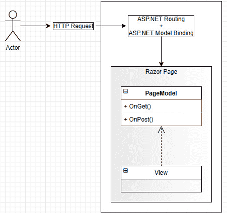
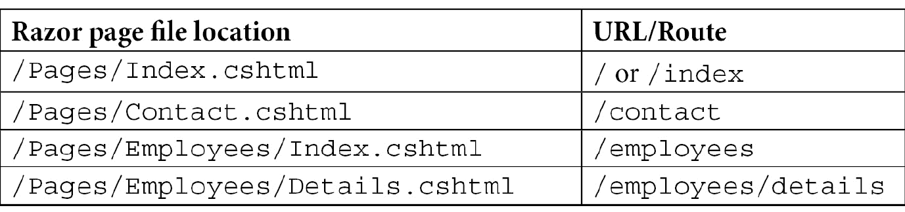
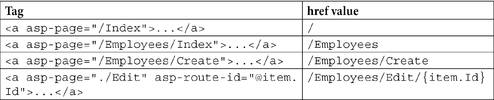
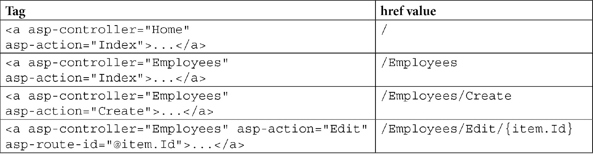
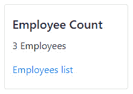

# *第 17 章*：ASP.NET 核心用户界面

在本章中，我们将探讨使用 ASP.NET Core 5 及其广泛的产品创建用户界面的不同方法。我们有 MVC、Razor Pages 和 Blazor（[*第 18 章*](18.html#_idTextAnchor348)、*简要介绍 Blazor*作为宏模型。然后我们有部分视图、视图组件、标记帮助器、显示模板、编辑器模板和 Razor 组件来微观管理 UI。此外，.NET5 生态系统还包括用于构建 UI 的其他非 web 技术，如 WinForm、WPF、UWP 和 Xamarin。

本章的目标不是涵盖所有这些元素和技术的各个方面，而是制定一个计划，解释它们的作用和使用方法。

本章将介绍以下主题：

*   熟悉剃须刀页面
*   组织用户界面
*   C#9 特征
*   显示和编辑模板

# 熟悉剃须刀页面

顾名思义，Razor Pages是一种服务器端呈现 web 内容的方式，按页面组织。这非常适用于 web，因为人们访问页面，而不是控制器。Razor Pages 在引擎盖下与 MVC 共享许多组件。

如果您想知道使用 MVC 或 Razor 页面是否最适合您的项目，请扪心自问，将项目组织成页面是否更适合您的场景。如果是的话，请翻页；否则，选择其他项目，例如 MVC 或 SPA。我们也可以在同一个应用程序中同时使用 Razor 页面和 MVC，因此不需要只选择一个。

使用 Razor 页面与 MVC 非常相似。在`Startup.ConfigureServices`方法中，我们可以调用`services.AddRazorPages();`扩展方法，而不是`services.AddControllersWithViews();`或`services.AddControllers();`。

同样的情况也适用于`Startup.Configure`方法，其中我们必须使用`endpoints.MapRazorPages();`方法映射路径。

其他中间产品的用途是相同的。以下是`Startup`的一个示例：

```cs
public class Startup
{
    public void ConfigureServices(IServiceCollection services)
    {
        services.AddRazorPages();
    }
    public void Configure(IApplicationBuilder app, IWebHostEnvironment env)
    {
        if (env.IsDevelopment())
        {
            app.UseDeveloperExceptionPage();
        }
        else
        {
            app.UseExceptionHandler("/Error");
            app.UseHsts();
        }
        app.UseHttpsRedirection();
        app.UseStaticFiles();
        app.UseRouting()
        app.UseAuthorization();
        app.UseEndpoints(endpoints =>
        {
            endpoints.MapRazorPages();
        });
    }
}
```

通过突出显示的两行，ASP.NET 为我们处理路由和模型绑定，就像处理 MVC 一样。

我们可以使用`webapp`项目模板创建 Razor Pages 项目：

```cs
dotnet new webapp
```

## 设计

每个页面可以处理一个或多个`GET`或`POST`方法。其思想是每个页面都是自给自足的（SRP）。首先，页面由两部分组成：视图和模型。模型必须继承自`PageModel`。视图必须使用`@model`指令链接到其页面模型，`@page`指令告诉 ASP.NET 它是一个 Razor 页面，而不仅仅是一个 MVC 视图。

以下是该关系的可视化表示：


图 17.1–表示剃须刀页面的示意图

下面是我使用 VisualStudio 搭建的一个示例。`@page`和`@model`指令在以下代码段中突出显示：

页面\Employees\Create.cshtml

```cs
@page
@model PageController.Pages.Employees.CreateModel
@{
    ViewData["Title"] = "Create";
}
<h1>Create</h1>
<h4>Employee</h4>
<hr />
<div class="row">
    <div class="col-md-4">
        <form method="post">
            <div asp-validation-summary="ModelOnly" class="text-danger"></div>
            <div class="form-group">
                <label asp-for="Employee.FirstName" class="control-label"></label>
                <input asp-for="Employee.FirstName" class="form-control" />
                <span asp-validation-for="Employee.FirstName" class="text-danger"></span>
            </div>
            <div class="form-group">
                <label asp-for="Employee.LastName" class="control-label"></label>
                <input asp-for="Employee.LastName" class="form-control" />
                <span asp-validation-for="Employee.LastName" class="text-danger"></span>
            </div>
            <div class="form-group">
                <input type="submit" value="Create" class="btn btn-primary" />
            </div>
        </form>
    </div>
</div>
<div>
    <a asp-page="Index">Back to List</a>
</div>
@section Scripts {
    @{await Html.RenderPartialAsync ("_ValidationScriptsPartial");}
}
```

接下来的是`PageModel`，我们在这里讨论：

Pages\Employees\Create.cshtml.cs

```cs
namespace PageController.Pages.Employees
{
    public class CreateModel : PageModel
    {
        private readonly EmployeeDbContext _context;
        public CreateModel(EmployeeDbContext context)
        {
            _context = context;
        }
        public IActionResult OnGet()
        {
            return Page();
        }
        [BindProperty]
        public Employee Employee { get; set; }
        public async Task<IActionResult> OnPostAsync()
        {
            if (!ModelState.IsValid)
            {
                return Page();
            }
            _context.Employees.Add(Employee);
            await _context.SaveChangesAsync();
            return RedirectToPage("./Index");
        }
    }
}
```

从该代码中，我们可以看到两个部分：视图和模型。在`PageModel`代码中，`[BindProperty]`属性告诉 ASP.NET 将表单 post 绑定到`Employee`属性。这相当于 MVC 操作，如下所示：

```cs
[HttpPost]
public Task<IActionResult> MyAction([FromForm] Employee employee) {…}
```

从视觉上看，请求页面的用户如下所示：



图 17.2–请求页面的用户

默认情况下，页面位于`Pages`目录下，而不是`Views`目录下。MVC 的布局机制也可用于 Razor 页面。默认布局在`Pages/Shared/_Layout.cshtml`文件中；`Pages/_ViewStart.cshtml`和`Pages/_ViewImports.cshtml`文件与 MVC 等效文件的作用相同，只是用于 Razor 页面。

## 路由

在 MVC 中，我们可以通过创建全局路由模式或使用属性来控制路由。在 Razor 页面中，我们还可以控制这些路径。默认情况下，路由系统会根据文件系统自动创建路由，从而加快我们的启动速度。要使用自动路由，我们只需要在页面顶部包含`@page`指令，ASP.NET 核心为我们发挥了神奇的作用。

Razor Pages 使用的路由系统简单但功能强大。默认模式是页面的位置，没有`Pages`文件夹和`.cshtml`扩展名， `Index.cshtml`页面是可选的（如 MVC 的`Index`视图）。与其没完没了地解释，不如看一些例子：



在 Razor页面中，路由系统根据 URL 选择要显示的页面。

我们还可以用自定义路由替换这些默认路由。替换页面默认路由的方法是在`@page`指令后提供路由模板，如`@page "/some-route"`。该页面现在处理`/some-route`URL，而不是默认 URL。该模板支持与 MVC 管线相同的功能，包括参数和约束。

涵盖 Razor 页面的各个方面超出了本书的范围，但我鼓励您深入研究构建网站和 web 应用程序的方法。它令人愉快，功能强大，有时比 MVC 更简单。

但是，如果您需要除`GET`和`POST`之外的其他 HTTP 方法，Razor 页面可能不适合您。

## 结论

Razor页面是一个很好的选择，当你想用页面而不是控制器来组织你的网站或 web 应用程序时。支持 MVC 的许多功能，例如验证（`ModelState`和`ValidationSummary`）、路由系统、模型绑定、标记帮助器等。

现在让我们看看刮胡刀页面如何帮助我们遵循**坚实的**原则：

*   **S**：每个`PageModel`负责一个页面，这是剃须刀页面的关键点。
*   **O**：不适用。
*   **L**：不适用。
*   **I**：不适用。
*   **D**: N/A.

    单一责任原则

    人们可以将剃须刀页面的“单一责任”视为多重责任。它同时处理读取和写入；页面模型；HTTP 请求；并且可以使用 HTTP 响应。

    请记住，Razor 页面的目标是管理页面。这是一个单一的责任。责任并不能转化为一次操作。这就是说，如果您认为其中一个 Razor 页面中的代码太多，可以通过提取这些职责的一部分并将其委托给其他组件来帮助减轻这种负担，从而使`PageModel`的职责和代码更少。例如，您可以使用 MediatR 在别处提取业务逻辑。

我们可以将 Razor 页面视为一个简化的**页面控制器**（企业应用程序架构（PoEAA）的 Martin Fowler 模式）。为什么要简化？因为 ASP.NET 为我们完成了**页面控制器**的大部分工作，只剩下**模型**（域逻辑）和**视图**来实现。更多信息，请参见*进一步阅读*部分。

现在我们已经了解了 Razor 页面和 MVC，现在是时候探索 ASP.NET Core 5 为我们提供的用于组织 UI 的选项了。

# 组织用户界面

在本节中，我们将探讨三个选项：

*   **局部视图**到封装了可重用的 UI 部件。
*   **标记助手**使我们能够编写类似于 Razor 的 HTML 代码，而不是类似于 C 的语法。
*   **视图组件**允许用一个或多个视图封装逻辑以创建可重用组件。

请记住，我们可以在 MVC 和 Razor 页面中使用这些选项。

## 局部视图

局部视图是在`cshtml`文件（剃刀文件）中创建的视图的一部分。局部视图的内容（标记）在`<partial>`标记辅助程序或`@ Html.PartialAsync()`方法包含的位置呈现。ASP.NET 在 MVC 中引入了这个概念，因此出现了视图。对于 Razor 页面，您可以将部分视图视为部分页面。

我们可以在项目中的任何地方放置局部视图文件，但我建议将它们放在使用它们的视图附近。您也可以将它们保存在`Shared`文件夹中。根据经验，局部视图的文件名以`_`开头，如`_CreateOrEditForm.cshtml`。

局部视图擅长简化复杂视图，并在多个其他视图中重用部分 UI。下面是一个有助于简化`_Layout.cshtml`文件的示例：

```cs
<div class="container">
    @ Html.PartialAsync("_CookieConsentPartial")
    <partial name="_CookieConsentPartial" />
    <main role="main" class="pb-3">
        @RenderBody()
    </main>
</div>
```

两条高亮显示的线做的是相同的事情，因此只需要一条。这是加载局部视图的两种代码样式；挑一个你喜欢的。本例在页面的该位置插入`Pages/Shared/_CookieConsentPartial.cshtml`文件的内容。部分视图与 ASP 和 PHP 中旧的**包含**非常相似，但它们不能直接访问调用方的作用域（这是一件非常好的事情）。

默认情况下，`Model`属性的当前值被发送到局部视图，但也可以发送不同的模型，如下所示：

```cs
@{
    var myModel = "My Model";
}
@ Html.PartialAsync("_SomePartialView", myModel)
<partial name="_SomePartialView" model="myModel" />
```

在本例中，`myModel`是一个字符串，但也可以是任何类型的对象。

局部视图比**包含的**更加健壮，并增加了灵活性。现在让我们深入研究一些代码。

### 项目：共享表单

部分视图的一个可能性是共享表示代码。在 CRUD 项目中，创建和编辑表单通常非常相似，因此我们可以利用局部视图简化此类复制维护。这类似于[*第 4 章*](04.html#_idTextAnchor056)*中实施的项目，MVC 模式使用 Razor*但使用 Razor 页面代替 MVC。

此项目的初始 Razor 代码已由 Visual Studio 基于以下`Employee`类构建：

```cs
namespace PageController.Data.Models
{
    public class Employee
    {
        public int Id { get; set; }
        [Required]
        [StringLength(50)]
        public string FirstName { get; set; }
        [Required]
        [StringLength(50)]
        public string LastName { get; set; }
    }
}
```

接下来，我们将探索一种集中两个页面共享的表单的方法，以增强模块的可维护性。首先，我们必须提取`CreateModel`和`EditModel`的共享部分，以便表单可以使用它。`ICreateOrEditModel`接口包含该共享合同：

页面/Employees/icreatoreditmodel.cs

```cs
public interface ICreateOrEditModel
{
    Employee Employee { get; set; }
}
```

那么`CreateModel`和`EditModel`都必须实现：

页面/Employees/Create.cshtml.cs

```cs
public class CreateModel : PageModel, ICreateOrEditModel
{
    ...
    [BindProperty]
    public Employee Employee { get; set; }
    ...
}
```

页面/Employees/Edit.cshtml.cs

```cs
public class EditModel : PageModel, ICreateOrEditModel
{
    ...
    [BindProperty]
    public Employee Employee { get; set; }
    ...
}
```

然后我们可以隔离表单的共享部分，并将其移动到`_Form.cshtml`部分视图（您可以根据需要命名它）：

页面/Employees/_Form.cshtml

```cs
@model ICreateOrEditModel
<div class="form-group">
    <label asp-for="Employee.FirstName" class="control-label"></label>
    <input asp-for="Employee.FirstName" class="form-control" />
    <span asp-validation-for="Employee.FirstName" class="text-danger"></span>
</div>
<div class="form-group">
    <label asp-for="Employee.LastName" class="control-label"></label>
    <input asp-for="Employee.LastName" class="form-control" />
    <span asp-validation-for="Employee.LastName" class="text-danger"></span>
</div>
```

在前面的代码中，我们使用`ICreateOrEditModel`接口作为`@model`，因此我们可以访问创建和编辑页面模型的`Employee`属性。然后，我们可以在创建和编辑页面中包含该部分视图：

页面/Employees/Create.cshtml

```cs
@page
@model PageController.Pages.Employees.CreateModel
...
<div class="row">
    <div class="col-md-4">
        <form method="post">
            <div asp-validation-summary="ModelOnly" class="text-danger"></div>
            <partial name="_Form" />
            <div class="form-group">
                <input type="submit" value="Create" class="btn btn-primary" />
            </div>
        </form>
    </div>
</div>
```

页面/Employees/Edit.cshtml

```cs
@page
@model PageController.Pages.Employees.EditModel
...
<div class="row">
    <div class="col-md-4">
        <form method="post">
            <input type="hidden" asp-for="Employee.Id" />
            <div asp-validation-summary="ModelOnly" class="text-danger"></div>
            <partial name="_Form" />
            <div class="form-group">
                <input type="submit" value="Save" class="btn btn-primary" />
            </div>
        </form>
    </div>
</div>
```

有了它，我们就有一个表单要维护，两个页面做不同的事情。在这种情况下，表单很简单，但在更实体的情况下，这可以节省大量时间。

请注意，局部视图中的复杂逻辑可能比使用它节省的时间更成问题。如果您在局部视图中看到条件代码的数量增加，我建议您调查是否有其他技术/模式会更好。摆脱局部视图或创建在较少位置使用的多个局部视图也可能是解决方案。有时我们认为分享是一个好主意，但事实证明并非如此。当这种情况发生时，承认你的失败，然后解决问题。

### 结论

局部视图是重用 UI 部分或将复杂屏幕划分为更小、更易于管理的元素的好方法。部分视图是封装 UI 块的最基本方式。当显示逻辑受到限制时使用它们；对于更高级的用例，我们将在下面的小节中探讨其他选项。

现在让我们看看局部视图如何帮助我们遵循**坚实的**原则：

*   **S**：将 UI 的可管理部分提取到部分视图中，可以封装类似组件的视图，每个视图管理一个单独的显示责任。
*   **O**：不适用。
*   **L**：不适用。
*   **I**：不适用。
*   **D**：不适用。

## 标签助手

标记帮助程序是服务器端帮助程序，允许开发人员在 Razor 视图中编写更多类似 HTML 的代码，从而减少视图中混合的类似 C 的代码量。在上一个示例中，我们使用了标记助手，可能是在不知道的情况下。

让我们从第二次查看`_Form.cshtml`文件开始：

页面/Employees/_Form.cshtml

```cs
@model ICreateOrEditModel
<div class="form-group">
    <label asp-for="Employee.FirstName" class="control-label"></label>
    <input asp-for="Employee.FirstName" class="form-control" />
    <span asp-validation-for="Employee.FirstName" class="text-danger"></span>
</div>
<div class="form-group">
    <label asp-for="Employee.LastName" class="control-label"></label>
    <input asp-for="Employee.LastName" class="form-control" />
    <span asp-validation-for="Employee.LastName" class="text-danger"></span>
</div>
```

在这个局部视图中，我们使用内置的 ASP.NET 标记帮助程序来增强 HTML`label`、`input`和`span`标记。`asp-*`属性用于设置某些内置标记助手属性的值。

例如，**标签标签帮助器**根据其`asp-for`属性自动生成 HTML`for`属性的值。此外，如果模型属性由一个属性修饰，它将基于属性名或其属性名生成标签文本。

要使用 HTML 帮助程序获得相同的输出，局部视图如下所示：

Pages/Employees/_Form-HtmlHelpers.cshtml

```cs
@model ICreateOrEditModel
<div class="form-group">
    @ Html.LabelFor(x => x.Employee.FirstName, new { @class = "control-label" })
    @ Html.TextBoxFor(x => x.Employee.FirstName, new { @class = "form-control" })
    @ Html.ValidationMessageFor(x => x.Employee.FirstName, null, new { @class = "text-danger" })
</div>
<div class="form-group">
    @ Html.LabelFor(x => x.Employee.LastName, new { @class = "control-label" })
    @ Html.TextBoxFor(x => x.Employee.LastName, new { @class = "form-control" })
    @ Html.ValidationMessageFor(x => x.Employee.LastName, null, new { @class = "text-danger" })
</div>
```

在这两种情况下，`FirstName`表单组呈现为以下 HTML：

```cs
<div class="form-group">
    <label class="control-label" for="Employee_FirstName">FirstName</label>
    <input class="form-control valid" type="text" data-val="true" data-val-length="The field FirstName must be a string with a maximum length of 50." data-val-length-max="50" data-val-required="The FirstName field is required." id="Employee_FirstName" maxlength="50" name="Employee.FirstName" value="Bob" aria-describedby="Employee_FirstName-error" aria-invalid="false">
    <span class="text-danger field-validation-valid" data-valmsg-for="Employee.FirstName" data-valmsg-replace="true"></span>
</div>
```

我发现使用 TagHelpers 比使用旧的 HTML Helpers（C#）更优雅，但这是我个人的偏好。然而，我们可以选择并混合这两种选择。

### 内置标记助手

ASP.NET 内核中有许多内置的标签助手。有些可以根据环境（生产或开发）帮助加载不同的元素；其他帮助构建`<a>`标签的`href`属性；还有更多。

让我们快速概述一下现有的内容。如果您想在以后了解更多信息，那么官方文档会越来越好，因为 Microsoft 已经将其开源。我在本章末尾的*进一步阅读*部分添加了一些链接。之后，我们将探索如何创建自定义标记帮助器。

#### 锚定标记辅助对象

锚定标记帮助器增强`<a>`标记，根据控制器动作或剃须刀页面生成`href`属性。

以下是 Razor 页面的几个示例：



这与 MVC 控制器类似：



锚定标记帮助器在创建类似 HTML 的链接时非常有用，在没有匿名对象和转义字符的情况下设置`class`属性非常方便（如果您以前使用过 HTML 帮助器，您就会知道我的意思）。

`asp-route-id`属性与其他属性略有不同。`asp-route-*`属性允许指定参数的值，例如`id`。所以如果`GET`动作是这样的：

```cs
[HttpGet]
public IActionResult Details(int something){ ... }
```

您需要一个指定`something`参数的链接，可以这样声明：

```cs
<a asp-controller="Employees" asp-action="Details" asp-route-something="123">...</a>
```

这个标记帮助器后面还有很多选项，我们在这里不介绍，但是通过我们所做的，您知道您可以利用 ASP.NET 生成基于页面和控制器的链接。

#### 链接标记辅助对象

链接标记帮助器允许您定义回退 CSS`href`，以防主 CSS未加载（即，如果 CDN 关闭）。以下是 Razor Pages 模板中的一个示例：

```cs
<link rel="stylesheet" href="https://cdnjs.cloudflare.com/ajax/libs/twitter-bootstrap/4.1.3/css/bootstrap.min.css"
        asp-fallback-href="~/lib/bootstrap/dist/css/bootstrap.min.css"
        asp-fallback-test-class="sr-only" 
        asp-fallback-test-property="position" 
        asp-fallback-test-value="absolute"
        crossorigin="anonymous"
        integrity="sha256-eSi1q2PG6J7g7ib17yAaWMcrr5GrtohYChqibrV7PBE=" />
```

ASP.NET根据指定的`asp-fallback-test-*`属性呈现所需的 HTML 和 JavaScript，以测试是否加载了 CSS。如果不是，则将其交换为在`asp-fallback-href`属性中指定的一个。

#### 脚本标记辅助程序

脚本标记助手允许您定义一个回退 JavaScript 文件，以防主文件未加载（即，如果 CDN 关闭）。以下是 Razor Pages 模板中的一个示例：

```cs
<script src="https://cdnjs.cloudflare.com/ajax/libs/twitter-bootstrap/4.1.3/js/bootstrap.bundle.min.js"
        asp-fallback-src="~/lib/bootstrap/dist/js/bootstrap.bundle.min.js"
        asp-fallback-test="window.jQuery && window.jQuery.fn && window.jQuery.fn.modal"
        crossorigin="anonymous"
        integrity="sha256-E/V4cWE4qvAeO5MOhjtGtqDzPndRO1LBk8lJ/PR7CA4=">
</script>
```

ASP.NET 根据指定的`asp-fallback-test`属性呈现所需的 HTML 和 JavaScript，以测试脚本是否已加载。如果未加载脚本，浏览器会将源代码替换为在`asp-fallback-href`属性中指定的源代码。这与`<link>`标签相同，但与`<script>`标签相同。

#### 环境标记帮助器

环境标签助手允许仅针对特定环境呈现 UI 的某些部分。例如，您只能在`Development`中呈现一些调试信息。

环境标记帮助器也是对`<link>`和`<script>`标记帮助器的一个很好的补充，允许我们在生产环境中开发和托管 CDN 的小型文件时加载本地的非小型脚本。

我们可以通过分别使用`include`和`exclude`属性包含或排除环境来定义目标环境。这些属性的值可以是单个环境名称或逗号分隔的列表。以下是一些例子：

```cs
<environment include="Development">
    <div>Development Content.</div>
</environment>
```

前面的代码片段仅在环境为`Development`时显示`<div>`。

```cs
<environment exclude="Development">
    <div>Content not to display in Development.</div>
</environment>
```

前面的代码段显示了除`Development`之外的所有环境的`<div>`。

```cs
<environment include="Staging,Production">
    <div>Staging and Production content.</div>
</environment>
```

前面的代码片段仅针对`Staging`和`Production`环境显示`<div>`。

```cs
<environment exclude="Staging,Production">
    <div>Content not to display in Staging nor Production.</div>
</environment>
```

前面的片段显示除`Staging`和`Production`之外的所有环境的`<div>`。

#### 缓存标记帮助程序

ASP.NETCore 还提供以下与缓存相关的标记帮助程序：

*   缓存标记帮助器
*   分布式缓存标记帮助器
*   图像标记辅助对象

默认情况下，**缓存标记帮助程序**允许缓存视图的一部分 20 分钟，并利用 ASP.NET 核心缓存提供程序机制。一个基本示例是缓存一个随机数，如下所示：

```cs
<cache>@(new Random().Next())</cache>
```

还可以设置多个属性来控制缓存失效的方式及其目标。例如，我们可能希望缓存对用户的问候语，但如果我们编写以下内容，所有用户都会看到触发缓存的第一个用户的问候语：

```cs
<cache>Hello @this.User.Identity.Name!</cache>
```

要解决该问题，我们可以将`vary-by-user`属性设置为`true`：

```cs
<cache vary-by-user="true">
    Hello @ this.User.Identity.Name!
</cache>
```

在其他情况下可以使用多个其他`vary-by-*`属性，例如`vary-by-header`、`vary-by-query`、`vary-by-route`、`vary-by-cookie`。

为了控制缓存失效的方式，我们可以将`expires-on`属性设置为`DateTime`对象，或者将`expires-after`或`expires-sliding`属性设置为`TimeSpan`对象。

如果这还不够，ASP.NET Core 还提供一个**分布式缓存标记****帮助器**，它利用您注册的`IDistributedCache`实现。必须在`Startup`类中配置分布式缓存提供程序，否则标记帮助程序将使用内存提供程序。您还必须通过设置`name`属性为每个元素指定一个唯一的键。其他属性与缓存标记辅助对象相同。

最后一个与缓存相关的标记辅助对象是**图像标记辅助对象**。该标记帮助器允许在图像更改时使其无效。为此，ASP.NET 将一个版本附加到其增强的``标记上，当文件更改时，该标记将失效。

由于**图像标签助手**增强了``标签，因此这里没有新标签。若要使用此功能，您必须在具有以下`src`属性的``标记上将`asp-append-version`属性设置为`true`：

```cs

```

在使用这三个标记帮助器中的一个或多个时，缓存部分视图比以往任何时候都要容易，但缓存本身就是一个主题，我不想在这里深入探讨。

#### 表单标记帮助程序

ASP.NET Core 在创建表单时提供多个标记帮助程序。由于表单是收集用户输入的方式，因此它们非常重要。在这里，我们首先介绍**表单标记帮助器**，它扩展了`<form>`HTML 标记。

它的第一个优点是自动呈现`input[name="__RequestVerificationToken"]`元素，以防止跨站点请求伪造（CSRF 或 XSRF）。**Razor Pages 自动进行验证**，但**MVC 不进行**。要在使用 MVC 时启用 XSRF/CSRF 保护，我们需要使用`[ValidateAntiForgeryToken]`属性装饰动作或控制器。

第二个优点是有助于路由。当路由时间到来时，表单标记帮助器公开与锚定标记帮助器相同的属性，如`asp-controller`、`asp-action`、`asp-page`和`asp-route-*`属性。

要提交表单，您可以像任何普通 HTML`<form>`标记一样进行：使用`button[type="submit"]`或`input[type="submit"]`。我们还可以使用相同的路由属性在不同的按钮上设置不同的操作。

接下来，让我们来探索前面我们看到的输入标记助手**。输入标记帮助器的关键属性是`asp-for`。将其设置为视图模型的属性时，ASP.NET 会自动生成`<input>`标记的`name`及其`value`、验证信息以及该输入的`type`。例如，`bool`呈现为`input[type=checkbox]`，而`string`呈现为`input[type=text]`。我们可以使用数据注释来装饰视图模型，以控制要生成的输入类型，如`[EmailAddress]`、`[Url]`或`[DataType(DataType.*)]`。**

提示

当您的模型上有一个表示集合的属性时，您应该使用`for`循环（而不是`foreach`循环）来生成表单。否则，在许多情况下，ASP.NET Core 将无法正确呈现元素，并且在发布表单后，您将在服务器上收到这些字段的`null`值。下面是一个有效的示例：

`@for (var i = 0; i < Model.Destinations.Count; i++)`

`{`

`<input type="text" asp-for="@destinations[i].Name" class="control-label"></label>`

`<input type="text" asp-for="@destinations[i].Name" class="form-control" />`

`}`

增强 HTML 标记的标记帮助程序的另一个优点是所有标准 HTML 属性都是可用的。因此，当您想要为正在编辑的模型的`Id`属性创建`input[type=hidden]`时，您可以直接设置`type`属性并覆盖默认值，如下所示：

```cs
<input type="hidden" asp-for="Employee.Id" />
```

然后我们有这个**文本区域标记助手**，它生成一个`<textarea>`标记，如下所示：

```cs
<textarea asp-for="Employee.Description"></textarea>
```

然后是帮助呈现`<label>`标记的**标签标记助手**，如下所示：

```cs
<label asp-for="Employee.Description"></label>
```

最后，**选择标记帮助器**帮助使用其`asp-items`属性中指定的值呈现`<select>`标记。这些物品必须是`IEnumerable<SelectListItem>`集合。`asp-for`属性的作用与其他标记帮助程序相同。以下是手动生成的绑定到`Model`的`SomeProperty`属性的项列表的示例：

```cs
@{
    var items = new[]
    {
        new SelectListItem("Make a selection", ""),
        new SelectListItem("Choice 1", "1"),
        new SelectListItem("Choice 2", "2"),
        new SelectListItem("Choice 3", "3"),
    };
}
<select asp-items="items" asp-for="SomeProperty"></select>
```

提示：`enum`

您可以使用`Html.GetEnumSelectList<TEnum>()`方法从`enum`生成列表，其中`TEnum`是您的`enum`类型。生成的`<option>`标记的数值等于`enum`元素的值，其文本设置为`enum`元素的文本表示，如`<option value="2">SecondOption</option>`。

要自定义每个选项的文本，您可以使用属性装饰您的`enum`成员，如`[Display(Name = "Second option")]`属性，它将呈现`<option value="2">Second option</option>`，从而提高可读性。下面是一个例子：

`public enum MyEnum {`

`[Display(Name = "Second option")]`

`SecondOption = 2`

`}`

为了结束这一小节，我们还有两个表单相关的标记帮助器要介绍，**验证消息标记帮助器**和**验证摘要标记帮助器**。它们的存在是为了帮助验证客户端的表单输入。

验证摘要标记帮助器用于显示`ModelState`属性（`ModelStateDictionary`的错误消息列表。该属性在大多数 MVC 和 Razor 页面相关的基类中都是可访问的，例如`PageModel`、`PageBase`、`ControllerBase`和`ActionContext`（在 MVC 视图中可从`RazorPageBase.ViewContext`访问）。以下代码创建验证摘要：

```cs
<div asp-validation-summary="ModelOnly" class="text-danger"></div>
```

`asp-validation-summary`属性的值可以是`None`、`ModelOnly`或`All`：

*   `None`表示不显示汇总。
*   `ModelOnly`表示只有与模型属性无关的错误才会显示在验证摘要中（如果你问我，这个名称与直觉相反）。
*   `All`表示所有错误，包括属性错误，将显示在验证摘要中。

如果您正在为属性使用验证消息标记帮助器，我建议将该值设置为`ModelOnly`，这将允许从页面或操作发送自定义验证消息，而无需在页面上复制模型的消息。

验证消息标记帮助程序允许我们显示单个属性的错误消息。通常，它们会显示在它们所表示的元素附近，但不必如此。以下是一个例子：

```cs
<span asp-validation-for="Employee.FirstName" class="text-danger"></span>
```

`asp-validation-for`属性充当`asp-for`属性，但告诉元素它是用于验证目的，而不是创建表单输入。如果属性（本例中为`Employee.FirstName`）无效，则显示错误消息；否则，情况并非如此。

`class="text-danger"`是一个引导类，它将文本设置为红色。

如果我们再看一次上一节的例子，我们将看到以下 Razor 代码（第一个块）被呈现为以下 HTML 代码（第二个块），Razor 代码高亮显示被转换为 HTML 代码高亮显示：

```cs
<div class="form-group">
    <label asp-for="Employee.FirstName" class="control-label"></label>
    <input asp-for="Employee.FirstName" class="form-control" />
    <span asp-validation-for="Employee.FirstName" class="text-danger"></span>
</div>
<div class="form-group">
    <label class="control-label"for="Employee_FirstName">FirstName</label>
    <input class="form-control" type="text" data-val="true" data-val-length="The field FirstName must be a string with a maximum length of 50." data-val-length-max="50" data-val-required="The FirstName field is required." id="Employee_FirstName" maxlength="50" name="Employee.FirstName" value="">
    <span class="text-danger field-validation-valid" data-valmsg-for="Employee.FirstName" data-valmsg-replace="true"></span>
</div>
```

验证属性（`data-val-length`、`data-val-length-max`、`data-val-required`、`maxlength`和`type`属性来自`Employee.FirstName`属性，即定义如下：

```cs
[Required]
[StringLength(50)]
public string FirstName { get; set; }
```

总之，ASP.NET Core 提供的表单标记帮助程序非常方便、快速地制作可读的表单，并且具有丰富的功能。

#### 部分标记辅助对象

在前面关于部分视图的小节中，我们已经使用了部分标记帮助器，但这里还有几个用例。最琐碎的一个意味着只设置`name`属性，就像我们之前所做的那样：

```cs
<partial name="_Form" />
```

我们也可以指定路径而不是名称，如下所示：

```cs
<partial name="Employees/_PieceOfUI" />
```

这将从以下三个文件之一加载`_PieceOfUI.cshtml`局部视图：`/Pages/Employees/_PieceOfUI.cshtml`或 `/Pages/Shared/Employees/_PieceOfUI.cshtml`或`/Views/Shared/Employees/_PieceOfUI.cshtml`。

我们还可以使用`model`属性将自定义模型传递给局部视图，如下所示：

Pages/Employees/PieceofIViewModel.cs

```cs
public record PieceOfUIViewModel(bool GenerateRandomNumber);
```

`PieceOfUIViewModel`记录类是我们传递给`PieceOfUI`部分视图的视图模型，如下所示。记录是一个新的 C#9 特性，我们将在本章下一节中探讨。现在，将`PieceOfUIViewModel`视为一个具有名为`GenerateRandomNumber`的只读属性的类。

Pages/Employees/_.cshtml

```cs
@model PieceOfUIViewModel
Piece of UI
@if (Model.GenerateRandomNumber) {
    <text>| </text>
    @(new Random().Next())
}
```

前面的 Razor 代码是我们在下一个块中渲染的局部视图：

页面/Shared/_Layout.cshtml

```cs
@using PageController.Pages.Employees
…
<partial name="Employees/_PieceOfUI" model="new PieceOfUIViewModel(true)" />
…
```

在该示例中，我们将一个`PieceOfUIViewModel`实例传递给局部视图，局部视图根据`GenerateRandomNumber`属性的值依次呈现一个随机数（`true`或`false`。

`for`属性允许类似的行为，但通过模型本身。如果我们返回到共享表单，但是创建了一个新的部分视图**，而不需要实现任何接口**，那么我们可能会得到以下代码：

_FormFor.cshtml

```cs
@using PageController.Data.Models
@model Employee
<div class="form-group">
    <label asp-for="FirstName" class="control-label"></label>
    <input asp-for="FirstName" class="form-control" />
    <span asp-validation-for="FirstName" class="text-danger"></span>
</div>
<div class="form-group">
    <label asp-for="LastName" class="control-label"></label>
    <input asp-for="LastName" class="form-control" />
    <span asp-validation-for="LastName" class="text-danger"></span>
</div>
```

接下来，两个视图使用的代码：

Create.cshtml 和 Edit.cshtml

```cs
…
<partial name="_FormFor" for="Employee" />
…
```

即使部分视图不知道原始`Model`上的`Employee`属性，它仍然呈现相同的形式，因为`for`属性为我们保留了该上下文。

最后一个属性是`view-data`，允许我们将`ViewDataDictionary`实例传递给局部视图。我建议坚持使用全类型对象，而不是使用字典和神奇的字符串，但是如果有一天你需要它来处理一些模糊的情况，那么，你知道该属性是存在的。

#### 组件标记辅助对象

**组件标签助手**用于将**剃须刀组件**呈现到 MVC 或剃须刀页面应用程序中。我们将在[*第 18 章*](18.html#_idTextAnchor348)*中探讨剃须刀组件，简要介绍 Blazor，*并简要探讨这个标签助手。

### 创建自定义标记辅助对象

现在我们已经快速浏览了内置的标签助手，我们也可以很容易地创建自己的标签助手。我们有两个选择；我们可以扩展现有标记或创建新标记。

在本例中，我们正在创建`<pluralize>`标记。其目的是替换如下代码：

```cs
<p class="card-text">
    @ Model.Count
    @(Model.Count > 1 ? "Employees" : "Employee")
</p>
```

代码如下：

```cs
<p class="card-text">
    <pluralize count="Model.Count" singular="{0} Employee" plural="{0} Employees" />
</p>
```

与第一个块相比，该代码的上下文切换更少，因为整个块现在看起来像 HTML。

副作用

与填充三级操作符的 UI 相比，使用`<pluralize>`标记助手构建的 UI 也更容易本地化。作为快速更改，我们可以在使用`string.Format()`格式化`Singular`或`Plural`属性之前，在`PluralizeTagHelper`类中插入`IStringLocalizer<T>`来本地化`Singular`或`Plural`属性的内容。

别误会我的意思：我不是要你停止在你的观点中写 C；我只是指出了与使用普通 C#相比，这种方法的另一个可能优势。

对于该组件，我们需要创建一个`PluralizeTagHelper`类，并将其保存到`TagHelpers`目录中。标记助手必须实现`ITagHelper`接口，但也可以从`TagHelper`类继承。我们选择的是`TagHelper`类，它公开了一个我们可以使用的同步`Process`方法。

笔记

`TagHelper`类只不过是添加了`Process`方法来覆盖和`ITagHelper`接口的默认空实现。

我们正在编程的`PluralizeTagHelper`类如下所示：

```cs
namespace PageController.TagHelpers
{
    [HtmlTargetElement("pluralize", TagStructure = TagStructure.WithoutEndTag)]
```

这个属性告诉 Razor 我们正在扩展`<pluralize>`标记，我们可以省略 end 标记，将其写成`<pluralize />`而不是`<pluralize></pluralize>`。

```cs
    public class PluralizeTagHelper : TagHelper
    {
        public int Count { get; set; }
        public string Singular { get; set; }
        public string Plural { get; set; }
```

属性的名称直接转换为**烤肉串案例**格式的属性。因此，`Singular`转换为`singular`，而名为`ComplexAttributeName`的属性将转换为`complex-attribute-name`。

```cs
        public override void Process(TagHelperContext context, TagHelperOutput output)
        {
            var text = Count > 1 ? Plural : Singular;
            text = string.Format(text, Count);
```

前面的代码是选择是显示文本的单数还是复数版本的逻辑。

```cs
            output.TagName = null;
```

通过将`TagName`属性设置为`null`，我们确保 Razor 不会呈现`<pluralize>`标记中的内容；我们只想生成文本。

```cs
            output.Content.SetContent(text);
        }
    }
}
```

最后，我们使用`TagHelperContent`类的`SetContent`方法设置想要输出的值。`TagHelperContent`类公开了多个其他方法来附加和设置标记帮助器的内容。

像任何其他标记助手一样，我们需要注册它。我们将在*项目：可重用员工计数*中注册项目的所有标签助手，只需几页。

加载显示 Pluralize 标记帮助器的页面时，我们将得到以下输出：

```cs
# When count = 0
0 Employee
# When count = 1
1 Employee
# When count = 2
2 Employees
```

这次就这样了。当然，我们可以创建更复杂的标记助手，但我将把它留给您和您的项目。

提示

您还可以从[NuGet.org](http://NuGet.org)下载现有的标签帮助程序，并将您的标签帮助程序作为 NuGet 软件包发布在[NuGet.org](http://NuGet.org)（或您选择的第三方服务）上。

下面让我们看一下 To.T0.标签辅助组件 T1。

### 创建 RSS 提要标记 HelperComponent

**上下文**：我们希望在不改变`_Layout.cshtml`文件的情况下，在每个页面的`<head>`中动态添加一个`<link>`标签。预期的输出如下所示：

```cs
<link href="/feed.xml" type="application/atom+xml" rel="alternate" title="Chapter 17 Code Samples App">
```

我们可以通过实现一个`ITagHelperComponent`接口来实现，也可以从`TagHelperComponent`继承。我们将做后者。

我们先来看看`RssFeedTagHelperComponent`类及其选项：

```cs
namespace PageController.TagHelpers
{
    public class RssFeedTagHelperComponentOptions
    {
        public string Href { get; set; } = "/feed.xml";
        public string Type { get; set; } = "application/atom+xml";
        public string Rel { get; set; } = "alternate";
        public string Title { get; set; };
    }
```

为了方便起见，`RssFeedTagHelperComponentOptions`类包含一些属性，这些属性的默认值是关于要写入`<link>`标记的内容。

接下来，`RssFeedTagHelperComponent`看起来像这样：

```cs
    public class RssFeedTagHelperComponent : TagHelperComponent
    {
        private readonly RssFeedTagHelperComponentOptions 	_options;
        public RssFeedTagHelperComponent(RssFeedTagHelperComponentOptions options)
        {
            _options = options ?? throw new ArgumentNullException(nameof(options));
        }
        public override void Process(TagHelperContext context, TagHelperOutput output)
```

`Process`方法是魔法发生的地方。如果要运行异步代码，也可以在`ITagHelperComponent.ProcessAsync`方法中使用。

```cs
        {
            if (context.TagName == "head")
```

标记辅助组件可以扩展两个部分：`<head>`和`<body>`。在这里，我们想在`<head>`中添加内容，所以我们正在寻找它。

```cs
            {
                output.PostContent.AppendHtml(
                    $@"<link href=""{_options.Href}"" type=""{_options.Type}"" rel=""{_options.Rel}"" title=""{_options.Title}"">"
                );
            }
        }
    }
}
```

最后，我们使用 options 对象将`<link>`标记本身附加到`<head>`。

该代码本身不起任何作用；为了让它运行，我们需要告诉 ASP.NET。要做到这一点，我们有多种选择，但作为**依赖注入**的忠实粉丝，这就是我在这里选择的方式。

在`Startup`类中，我们必须注册`RssFeedTagHelperComponentOptions`和`RssFeedTagHelperComponent`类。让我们从选项开始，这是一个设计选择，和`ITagHelperComponent`本身无关：

```cs
services.Configure<RssFeedTagHelperComponentOptions>(Configuration.GetSection("RssFeed"));
services.AddSingleton(sp => sp.GetRequiredService<IOptionsMonitor <RssFeedTagHelperComponentOptions>>().CurrentValue);
```

在这里，我决定利用**选项**模式，它允许覆盖任何配置源（如`appsettings.json`文件）中的默认值。然后我需要一个原始的`RssFeedTagHelperComponentOptions`，所以我按原样注册了它（有关此解决方案的更多信息，请参见[*第 8 章*](08.html#_idTextAnchor151)、*选项和日志模式*）。

现在我们的期权已经注册，我们可以将`RssFeedTagHelperComponent`注册为`ITagHelperComponent`。由于组件是无状态的，我们可以将其注册为单例，如下所示：

```cs
services.AddSingleton<ITagHelperComponent, RssFeedTagHelperComponent>();
```

就这样。当加载任何页面时，`<link>`标记将添加到`<head>`中，并带有我们定义的选项！这就是 ASP.NET 核心可扩展性的魔力！

当我们思考它时，选择是无止境的；我们可以让组件自行注册 CSS 文件，甚至缩小`<head>`或`<body>`或两者。以下是小型过滤器的示例：

```cs
    public class MinifierTagHelperComponent : TagHelperComponent
    {
        public override int Order => int.MaxValue;
        public async override Task ProcessAsync(TagHelperContext context, TagHelperOutput output)
        {
            var childContent = await output.GetChildContentAsync();
            var content = childContent.GetContent();
            var result = Minify(content);
            output.Content.SetHtmlContent(result);
        }
        private static string Minify(string input) { ... }
    }
}
```

这很可能不是进行缩小的最佳方式（我没有对其进行基准测试），但我之所以构建它，是因为它在我脑海中闪过，并作为激发你想象力的第二个例子。所有代码都以 Git（[格式提供 https://net5.link/EcSc](https://net5.link/EcSc) 。

更多信息

`ITagHelper`接口继承自`ITagHelperComponent`，因此您可以在技术上创建一个标记帮助器，通过将两个方法组合到一个类中，向页面的`<head>`或`<body>`添加资源。

### 结论

标记助手是创建新的类似 HTML 的标记或扩展现有标记的好方法，可以减少在 Razor 代码中在 C#和 HTML 之间切换上下文的摩擦。ASP.NET Core 中包含了现有的标记帮助程序，您可能在不知情的情况下使用了一些标记帮助程序。

现在让我们看看创建标记助手如何帮助我们遵循**坚实的**原则：

*   **S**：标签助手可以帮助我们将标签相关逻辑封装到可重用的代码片段中。
*   **O**：不适用。
*   **L**：不适用。
*   **I**：不适用。
*   **D**：不适用。

## 查看组件

现在来看一个新概念：**视图组件**。视图组件是局部视图和控制器动作的混合。它由两部分组成：

*   继承自`ViewComponent`或用`[ViewComponent]`属性修饰的类。此类包含逻辑。
*   一个或多个`cshtml`视图。这些视图知道如何渲染组件。

有多种方法可以组织构成视图组件的文件。由于我更喜欢与功能相关的文件靠得很近，所以我喜欢看到所有类都与视图本身位于同一目录中（我们称之为垂直切片），如下所示：


图 17.3：组织视图组件并将所有文件保存在一起的方法

### 项目：可重用员工计数

**上下文**：我们想在同一个 Razor Pages 项目中创建一个视图组件。该组件应显示系统数据库中可用的员工数量。组件应始终可见。

小部件是一个引导卡，如下所示：



图 17.4:employee count 视图组件在浏览器中呈现的结果

我决定从`ViewComponent`继承视图组件，这样我就可以利用助手方法，比如`View()`。对于`EmployeeCountViewModel`，我决定利用**记录类**（参见**记录类（C#9】*部分）。视图模型公开了一个`Count`属性：*

 *页面/组件/EmployeeCount/EmployeeCountViewModel.cs

```cs
public record EmployeeCountViewModel(int Count);
```

`EmployeeCountViewModel`类实际上与具有`public int Count { get; }`属性的类相同：

页面/组件/EmployeeCount/Default.cshtml

```cs
@model PageController.Pages.Shared.Components.EmployeeCount.EmployeeCountViewModel
<div class="card">
    <div class="card-body">
        <h5 class="card-title">Employee Count</h5>
        <p class="card-text">
            @ Model.Count
            @(Model.Count > 1 ? "Employees" : "Employee")
        </p>
        <a asp-page="Employees/Index" class="card-link">Employees list</a>
    </div>
</div>
```

正如我们在[*第 4 章*](04.html#_idTextAnchor056)*的*视图模型设计模式*部分中所看到的，使用 Razor*的 MVC 模式，我们注入了一个为该视图特制的模型，这是我们视图组件的默认视图，然后我们使用它渲染组件。现在，转到视图组件：

Pages/Components/EmployeeCount/EmployeeCountViewComponent.cs

```cs
public class EmployeeCountViewComponent : ViewComponent
{
    private readonly EmployeeDbContext _context;
    public EmployeeCountViewComponent(EmployeeDbContext context)
    {
        _context = context ?? throw new ArgumentNullException(nameof(context));
    }
```

在这里，我们注入`EmployeeDbContext`，这样我们就可以按照`InvokeAsync`的方法将员工数记下来：

```cs
    public async Task<IViewComponentResult> InvokeAsync()
    {
        var count = await _context.Employees.CountAsync();
        return View(new EmployeeCountViewModel(count));
    }
}
```

视图组件的逻辑必须放在返回`Task<IViewComponentResult>`的`InvokeAsync`方法或返回`IViewComponentResult`的`Invoke`方法中。在我们的例子中，我们访问一个数据库，所以我们最好在等待数据库时不要阻塞资源。然后，与控制器操作类似，我们使用`ViewComponent`基类的`View<TModel>(TModel model)`方法返回包含`EmployeeCountViewModel`实例的`ViewViewComponentResult`。

要渲染视图组件，我们可以使用`Component.InvokeAsync()`扩展方法，如下所示：

```cs
@await Component.InvokeAsync("EmployeeCount")
```

视图组件的名称必须排除`ViewComponent`后缀。

对于更易于重构的方法，我们还可以传递类型而不是名称：

```cs
@await Component.InvokeAsync(typeof(PageController.Pages.Shared.Components.EmployeeCount.EmployeeCountViewComponent))
```

我们还可以使用标记帮助器来调用视图组件。为此，我们可以通过在`_ViewImports.cshtml`文件中添加以下行，将所有视图组件注册为标记帮助程序：

```cs
@addTagHelper *, PageController
```

`PageController`是扫描视图组件的组件名称（项目名称）。

然后我们可以使用`<vc:[view-component-name]></vc:[view-component-name]>`标记帮助器，如下所示：

```cs
<vc:employee-count></vc:employee-count>
```

`vc`是可以覆盖的默认前缀。

我们可以通过视图组件实现很多事情，包括将参数传递给`InvokeAsync`方法，因此如果您需要一些参数，这是可能的。此外，借助视图组件和依赖注入功能，我们可以创建功能强大的 UI 部件，这些部件可以重用并封装复杂的逻辑，从而实现更易于维护的应用程序。我们也可以独立注册组件，无需一次注册所有组件。

### 结论

视图组件是部分视图和控制器操作的混合体，可能具有类似于标记辅助程序的语法。它们支持依赖项注入以实现可扩展性，但在其他方面受到限制。当使用标记帮助器语法时，它们不支持可选参数，仅当使用`Component.InvokeAsync()`方法时才支持。我们可以保存视图的默认位置是有限的，但如果需要可以扩展。

简而言之，如果您想要一个类似控制器的 UI，它具有逻辑或需要访问外部资源，那么视图组件可能是您的正确选择。另一方面，如果您想创建可组合的 UI，Razor 组件可能更适合（我们将在[*第 18 章*](18.html#_idTextAnchor348)*中的*了解 Razor 组件*一节中介绍这些组件，*简要介绍 Blazor*。*

现在让我们看看创建视图组件如何帮助我们遵循**坚实的**原则：

*   **S**：视图组件帮助我们将 UI 逻辑片段提取到独立的组件中。
*   **O**：不适用。
*   **L**：不适用。
*   **I**：不适用。
*   **D**：不适用。

接下来，我们将探索 C#9 的一些新特性。

# C#9 特征

在本节中，我们将访问的以下新功能：

*   顶级声明
*   目标类型的`new`表达式
*   仅初始化属性
*   记录类

我们将使用顶层语句简化一些代码示例，从而生成一个具有较少样板代码的代码文件。然后我们将深入研究`new`表达式，这些表达式允许以较少的键入创建新实例。仅限 init 的属性是本章中使用的记录类的主干，是[*第 18 章*](18.html#_idTextAnchor348)*对 Blazor*的简要介绍中介绍的 MVU 示例的基础。

## 高层声明（C#9）

从 C#9 开始，可以在声明名称空间和其他成员之前编写语句。这些语句被编译为发出的`Program.Main`方法。

对于顶级语句，最小的.NET“Hello World”程序现在如下所示：

```cs
using System;
Console.WriteLine("Hello world!");
```

不幸的是，我们还需要运行一个项目，因此我们必须创建一个包含以下内容的`.csproj`文件：

```cs
<Project Sdk="Microsoft.NET.Sdk">
    <PropertyGroup>
        <TargetFramework>net5.0</TargetFramework>
        <OutputType>Exe</OutputType>
    </PropertyGroup>
</Project>
```

从那里，我们可以使用.NET CLI 来`dotnet run`应用程序。

我们还可以像在任何控制台应用程序中一样声明类等其他成员并使用它们。类必须在顶级代码之后声明。

顶级语句是 C 语言入门的一个很好的特性，可以通过删除样板代码来编写代码示例。起初我有点反对这个想法，但现在我看到了很多可能性。

## 目标类型新表达式（C#9）

目标类型的`new`表达式是初始化类型的一种新方式。回到时代，C#3 引入了`var`关键字，这对于处理泛型类型、LINQ 返回值等变得非常方便（我记得很高兴地接受了这个新构造）。

这个新的 C#特性与`var`关键字相反，它允许我们调用已知类型的构造函数，如下所示：

```cs
using System;
using System.Collections.Generic;
List<string> list1 = new();
List<string> list2 = new(10);
List<string> list3 = new(capacity: 10);
var obj = new MyClass(new());
AnotherClass anotherObj = new() { Name = "My Name" };
public class MyClass {
    public MyClass(AnotherClass property) 
    => Property = property;
    public AnotherClass Property { get; }
}
public class AnotherClass {
    public string Name{ get; init; }
}
```

第一个突出显示显示了在已知类型时使用`new()`关键字并省略类型名称创建新对象的能力。第二个列表也是以同样的方式创建的，但是我们将参数`10`传递给了它的构造函数。第三个列表使用相同的方法，但明确指定了参数名，就像我们可以使用任何标准构造函数一样。

变量`obj`是显式创建的，但`new()`用于创建`AnotherClass`的实例，因为参数类型已知，所以会进行推断。

最后一个示例演示了类初始值设定项的使用。正如您可能已经注意到的，类有一个只包含 init 的属性，这是我们的下一个主题。

我可以看到目标类型的`new`表达式简化了许多代码库。我开始使用它们，它们是 C#9.0 的伟大补充之一。

## 仅初始属性（C#9）

**仅初始化属性**是只读属性，可以使用类初始值设定项初始化。在此之前，只读属性只能在构造函数中初始化或使用属性初始值设定项（如`public int SomeProp { get; } = 2;`）。

例如，让我们来使用一个保持计数器状态的类。使用只读属性时，我们将拥有以下类：

```cs
public class Counter
{
    public int Count { get; }
}
```

如果没有构造函数，`Count`属性不可能初始化，所以我们不能像这样初始化实例：

```cs
var counter = new Counter { Count = 2 };
```

这就是只支持 init 属性的用例。我们可以通过使用`init`关键字重写`Counter`类来利用它，如下所示：

```cs
public class Counter
{
    public int Count { get; init; }
}
```

仅初始化属性使开发人员能够创建使用类初始值设定项可设置的不可变属性。它们也是**记录类**的组成部分。

## 记录类（C#9）

记录类仅使用 init属性，并允许引用类型（类）**不可变**。改变`record`的唯一方法是创建一个新的。让我们将`Counter`类转换为`record`：

```cs
public record Counter
{
    public int Count { get; init; }
}
```

是的，这就像用`record`关键字替换`class`关键字一样简单。

但这还不是全部：

*   我们可以简化记录创建。
*   我们还可以使用`with`关键字简化记录的“变异”（创建变异副本而不触及初始副本）。
*   记录支持**解构**，就像**元组**类型一样。
*   .NET 自动执行`Equals`和`GetHashCode`方法。这两种方法比较属性的值，而不是对象的引用。这意味着具有相同值的两个不同实例将相等。

总之，这意味着我们最终得到了一个不可变的引用类型（`class`），其行为类似于一个值类型（`struct`），没有拷贝分配成本。

### 简化记录创建

如果我们不想在创建实例时使用**类初始值设定项**，我们可以将记录的代码简化为：

```cs
public record Counter(int Count);
```

这个语法让我想起了**类型脚本**，您可以在构造函数中定义属性和字段，它们可以自动实现，而无需手动执行。然后，我们可以像其他任何类一样创建一个新实例：

```cs
var counter = new Counter(2);
Console.WriteLine($"Count: {counter.Count}");
```

运行该代码将在控制台中输出`Count: 2`。我们还可以向 record 类添加方法：

```cs
public record Counter(int Count)
{
    public bool CanCount() => true;
}
```

**你可以用一个记录做任何事情，就像你用一个类**做的一样，等等。

### 带关键字的

`with`关键字允许我们创建一个记录副本，只设置我们想要更改的属性，保持其他值不变。让我们看看下面的代码（利用 C 9 级顶级语句）：

```cs
using System;
var initialDate = DateTime.UtcNow.AddMinutes(-1);
var initialForecast = new Forecast(initialDate, 20, "Sunny");
var currentForecast = initialForecast with { Date = DateTime.UtcNow };
Console.WriteLine(initialForecast);
Console.WriteLine(currentForecast);
public record Forecast(DateTime Date, int TemperatureC, string Summary)
{
    public int TemperatureF => 32 + (int)(TemperatureC / 
    0.5556);
}
```

当我们执行该代码时，结果与此类似：

```cs
Forecast { Date = 9/22/2020 12:04:20 AM, TemperatureC = 20, Summary = Sunny, TemperatureF = 67 }
Forecast { Date = 9/22/2020 12:05:20 AM, TemperatureC = 20, Summary = Sunny, TemperatureF = 67 }
```

`with`关键字的幂允许我们创建`initialForecast`记录的副本，并且只更改`Date`属性的值。

`with`关键字是该语言中引人注目的补充。

### 解构

我们可以**像`Tuple`一样自动解构**`record`类：

```cs
using System;
var current = new Forecast(DateTime.UtcNow, 20, "Sunny");
var (date, temperatureC, summary) = current;
Console.WriteLine($"date: {date}");
Console.WriteLine($"temperatureC: {temperatureC}");
Console.WriteLine($"summary: {summary}");
public record Forecast(DateTime Date, int TemperatureC, string Summary)
{
    public int TemperatureF => 32 + (int)(TemperatureC / 0.5556);
}
```

默认情况下，所有**位置成员**（在构造函数中定义）都是可解构的。在该示例中，我们无法使用解构来访问`TemperatureF`属性，因为它不是位置成员。

我们可以通过实现一个或多个`Deconstruct`方法来创建自定义**解构器**，该方法公开我们想要解构的属性的`out`参数，如下所示：

```cs
using System;
var current = new Forecast(DateTime.UtcNow, 20, "Sunny");
var (date, temperatureC, summary, temperatureF) = current;
Console.WriteLine($"date: {date}");
Console.WriteLine($"temperatureC: {temperatureC}");
Console.WriteLine($"summary: {summary}");
Console.WriteLine($"temperatureF: {temperatureF}");
public record Forecast(DateTime Date, int TemperatureC, string Summary)
{
    public int TemperatureF => 32 + (int)(TemperatureC / 0.5556);
    public void Deconstruct(out DateTime date, out int temperatureC, out string summary, out int temperatureF) 
 => (date, temperatureC, summary, temperatureF) = (Date, TemperatureC, Summary, TemperatureF);
}
```

通过更新的样本，我们还可以在解构记录时访问`TemperatureF`属性的值。

### 平等比较

如前所述，两条记录之间的默认比较是通过其值而不是其内存地址进行的，因此具有相同值的两个不同实例是相等的。以下代码证明了这一点：

```cs
using System;
var employee1 = new Employee("Johnny", "Mnemonic");
var employee2 = new Employee("Clark", "Kent");
var employee3 = new Employee("Johnny", "Mnemonic");
Console.WriteLine($"Does '{employee1}' equals '{employee2}'? {employee1 == employee2}");
Console.WriteLine($"Does '{employee1}' equals '{employee3}'? {employee1 == employee3}");
Console.WriteLine($"Does '{employee2}' equals '{employee3}'? {employee2 == employee3}");
public record Employee(string FirstName, string LastName);
```

运行该代码时，输出如下所示：

```cs
'Employee { FirstName = Johnny, LastName = Mnemonic }' equals 'Employee { FirstName = Clark, LastName = Kent }'? False
'Employee { FirstName = Johnny, LastName = Mnemonic }' equals 'Employee { FirstName = Johnny, LastName = Mnemonic }'? True
'Employee { FirstName = Clark, LastName = Kent }' equals 'Employee { FirstName = Johnny, LastName = Mnemonic }'? False 
```

在该示例中，即使`employee1`和`employee3`是两个不同的对象，当我们使用`employee1 == employee3`对它们进行比较时，结果是`true`，证明比较的是值，而不是实例。

您可能没有注意到，但是记录类的`ToString()`方法返回了对其数据的开发人员友好的表示。当使用字符串插值时，对象的`ToString()`方法被隐式调用，就像前面的代码一样，因此是完整的输出。

另一方面，如果想知道它们是否是同一个实例，可以使用如下`Object.ReferenceEquals()`方法：

```cs
Console.WriteLine($"Is 'employee1' the same as 'employee3'? {Object.ReferenceEquals(employee1, employee3)}");
```

这将输出以下内容：

```cs
Is 'employee1' the same as 'employee3'? False
```

## 结论

记录类是一个伟大的新添加，它允许在几个按键中创建不可变的类型。此外，它们支持解构并实现平等比较，即比较财产的价值，而不是实例是否相同，从而在许多情况下简化了我们的生活。

当人们更喜欢类初始值设定项而不是构造函数时，仅 Init 属性对于常规类也是有益的。

意见

我认为记录类对于遵循 Redux（JavaScript）和 Model-View-Update（MVU）等模式的单向绑定 ui 来说可能很方便。我在 C#9.0/.NET5 预览版中遵循了这些原则，得到了非常优雅的 MVU 结果，我将其封装在 GitHub 上的一个开源库中。在下一章中，我们将使用该库来实现 MVU 模式。

记录也很适合视图模型和 DTO。这些都是短暂的对象，通常不会发生变异。

接下来，我们将探索显示和编辑器模板，以将 UI 的某些部分附加到类型。

# 显示和编辑模板

在本节中，我们将了解如何使用**显示和编辑器模板**将 UI 划分为面向模型的局部视图。从.NET Framework 上的 MVC 开始，这些工具就可以使用，对于 ASP.NET 核心来说并不陌生。不幸的是，它们常常被遗忘或忽视，而代价是出现了全新的事物。

显示模板是覆盖给定类型的默认渲染模板的 Razor 视图。编辑器模板相同，但会覆盖给定类型的编辑器视图。

每种类型都可以有一个显示模板和一个编辑器模板。它们还按层次结构存储，以便每种类型都可以具有全局共享的模板以及每个区域、控制器、分区或页面的特定模板。在一个复杂的应用程序中，这可以非常方便地覆盖应用程序特定部分的单个模板。

必须在`DisplayTemplates`目录中创建**显示模板**，必须在`EditorTemplates`目录中创建**编辑模板**。这些目录可以放置在不同的级别。此外，目录结构取决于您使用的是 MVC 还是 Razor 页面。

ASP.NET 按优先级从更具体到更一般的顺序加载它们。这允许我们创建一个共享模板，在所有页面或所有控制器之间共享，然后为特定控制器或特定页面覆盖它。

对于 MVC，加载顺序如下：

1.  `Views/[some controller]/DisplayTemplates`
2.  `Views/Shared/DisplayTemplates`

对于 Razor 页面，加载顺序如下：

1.  `Pages/[some directory]/DisplayTemplates`
2.  `Pages/Shared/DisplayTemplates`

    笔记

    同样的逻辑也适用于各个领域；MVC 像搜索任何其他视图一样搜索显示和编辑器模板。

显示模板和编辑器模板都是带有指向其所用类型的`@ model`指令的`.cshtml`文件。例如，`Views/Shared/DisplayTemplates/SomeModel.cshtml`应该在顶部有一个`@ model SomeModel`指令。`Views/Shared/EditorTemplates/SomeModel.cshtml`也是如此。

让我们从显示模板开始。

## 显示模板

让我们使用 CRUDUI 来管理我们为本节再次搭建的员工。参见`TransformTemplateView`项目。

**上下文**：我们想将员工在`Details`和`Delete`页面中的显示方式进行封装。我们决定使用显示模板，而不是创建局部视图。

我们不希望该模板在其他地方使用，因此我们专门在`Pages/Employees`目录中创建它。让我们从该显示模板开始：

页面/Employee/DisplayTemplates/Employee.cshtml

```cs
@model Data.Models.Employee
<dl class="row">
    <dt class="col-sm-2">
        @ Html.DisplayNameFor(model => model.FirstName)
    </dt>
    <dd class="col-sm-10">
        @ Html.DisplayFor(model => model.FirstName)
    </dd>
    <dt class="col-sm-2">
        @ Html.DisplayNameFor(model => model.LastName)
    </dt>
    <dd class="col-sm-10">
        @ Html.DisplayFor(model => model.LastName)
    </dd>
</dl>
```

那个文件是我们的脚手架文件的副本。要呈现显示模板，我们必须调用`@ Html.DisplayFor()`扩展方法之一。在 details 和 delete 视图中，我们可以用`@ Html.DisplayFor(x => x.Employee)`替换旧代码。从那里，ASP.NET Core 的渲染引擎将找到模板并进行渲染（非常简单）。

接下来，我们看一下使用该显示模板的两个页面：

页面/Employees/Details.cshtml

```cs
@page
@model TransformTemplateView.Pages.Employees.DetailsModel
@{
    ViewData["Title"] = "Details";
}
<h1>Details</h1>
<div>
    <h4>Employee</h4>
    <hr />
 @ Html.DisplayFor(x => x.Employee)
</div>
<div>
    <a asp-page="./Edit" asp-route-id="@ Model.Employee.Id">Edit</a> |
    <a asp-page="./Index">Back to List</a>
</div>
```

页面/Employees/Delete.cshtml

```cs
@page
@model TransformTemplateView.Pages.Employees.DeleteModel
@{
    ViewData["Title"] = "Delete";
}
<h1>Delete</h1>
<h3>Are you sure you want to delete this?</h3>
<div>
    <h4>Employee</h4>
    <hr />
 @ Html.DisplayFor(x => x.Employee)
    <form method="post">
        <input type="hidden" asp-for="Employee.Id" />
        <input type="submit" value="Delete" class="btn btn-danger" /> |
        <a asp-page="./Index">Back to List</a>
    </form>
</div>
```

就这样，我们将员工的显示集中到一个`cshtml`文件中，根据其类型自动定位和加载，而不是像`string`那样的局部视图。但事实并非如此——在概述编辑器模板之后，我们将看到显示模板比这更强大。

## 编辑器模板

**e****编辑模板**的工作方式与**显示模板**的工作方式相同，因此让我们重建与使用局部视图相同的内容，但使用编辑器模板。

**提醒**：我们希望封装`Employee`表单，并在`Create`和`Edit`视图中重用它。

再一次，我们不希望该模板在其他地方使用，因此我们在同一级别的`Pages/Employees`下创建它。让我们看一下代码：

Pages/Employees/EditorTemplates/Employee.cshtml

```cs
@model Data.Models.Employee
<div class="form-group">
    <label asp-for="FirstName" class="control-label"></label>
    <input asp-for="FirstName" class="form-control" />
    <span asp-validation-for="FirstName" class="text-danger"></span>
</div>
<div class="form-group">
    <label asp-for="LastName" class="control-label"></label>
    <input asp-for="LastName" class="form-control" />
    <span asp-validation-for="LastName" class="text-danger"></span>
</div>
```

这与我们在上一个示例中创建的局部视图相同。重要的是要记住，显示和编辑器模板是围绕一个类型设计的，在本例中为`Employee`类。

要让 ASP.NET Core 为模型创建编辑器，我们可以使用`@ Html.EditorFor()`扩展方法重载之一。在`Create`和`Edit`视图中，我们都将表单替换为对`@ Html.EditorFor(m => m.Employee)`的调用：

页面/Employees/Create.cshtml

```cs
@model TransformTemplateView.Pages.Employees.CreateModel
@{
    ViewData["Title"] = "Create";
}
<h1>Create</h1>
<h4>Employee</h4>
<hr />
<div class="row">
    <div class="col-md-4">
        <form method="post">
            <div asp-validation-summary="ModelOnly" class="text-danger"></div>
 @ Html.EditorFor(m => m.Employee)
            <div class="form-group">
                <input type="submit" value="Create" class="btn btn-primary" />
            </div>
        </form>
    </div>
</div>
```

页面/Employees/Edit.cshtml

```cs
@page
@model TransformTemplateView.Pages.Employees.EditModel
@{
    ViewData["Title"] = "Edit";
}
<h1>Edit</h1>
<h4>Employee</h4>
<hr />
<div class="row">
    <div class="col-md-4">
        <form method="post">
            <div asp-validation-summary="ModelOnly" class="text-danger"></div>
            <input type="hidden" asp-for="Employee.Id" />
 @ Html.EditorFor(m => m.Employee)
            <div class="form-group">
                <input type="submit" value="Save" class="btn btn-primary" />
            </div>
        </form>
    </div>
</div>
```

就像显示模板一样，这是我们唯一需要做的事情。运行项目时，创建和编辑页面都使用相同的表单，专门为`Employee`类设计。

在下一个示例中，我们将探讨显示模板的功能。请记住，使用编辑器模板可以实现同样的效果。

## 项目：复合书店重访

**上下文**：我们想回顾一下我们如何在[*第 3 章*](03.html#_idTextAnchor042)、*架构原则*、[*第 9 章*](09.html#_idTextAnchor171)、*结构模式*中展示我们之前构建的复合书店 UI。目标是从类中获取显示逻辑，将它们与 HTML 输出分离。

有什么能比显示模板更好地封装这些小的 UI 块呢？

让我们首先检查要采取的步骤：

1.  更新模型类。
2.  创建视图并将呈现逻辑传输到那里（HTML）。

让我们从更新模型类开始：

型号/*.cs

```cs
namespace TransformTemplateView.Models
{
    public interface IComponent
    {
        void Add(IComponent bookComponent);
        void Remove(IComponent bookComponent);
        int Count();
    }
```

首先，我们从`IComponent`中删除了`Display`方法和`Type`属性。两者都用于显示`IComponent`实例。

```cs
    public class Book : IComponent
    {
        public Book(string title)
        {
            Title = title ?? throw new ArgumentNullException(nameof(title));
        }
        public string Title { get; set; }
        public int Count() => 1;
        public void Add(IComponent bookComponent) => throw new NotSupportedException();
        public void Remove(IComponent bookComponent) => throw new NotSupportedException();
    }
```

然后我们对`Book`类做了同样的（两个成员都是`IComponent`接口的一部分）。

```cs
    public abstract class BookComposite : IComponent
    {
        protected readonly List<IComponent> children;
        public BookComposite(string name)
        {
            Name = name ?? throw new ArgumentNullException(nameof(name));
            children = new List<IComponent>();
        }
        public string Name { get; }
        public virtual ReadOnlyCollection<IComponent> Components => new ReadOnlyCollection<IComponent>(children);
        public virtual string Type => GetType().Name;
        public virtual void Add(IComponent bookComponent) => children.Add(bookComponent);
        public virtual int Count() => children.Sum(child => child.Count());
        public virtual void Remove(IComponent bookComponent) => children.Remove(bookComponent);
        public virtual void AddRange(IComponent[] components) => children.AddRange(components);
    }
```

然后，我们从`BookComposite`中剥离了所有显示代码，并添加了一个名为`Components`的属性，该属性将其子项暴露给显示模板。

下面的`Corporation`、`Section`和`Store`类只是组织类型，因为我们将书店逻辑保持在最低限度，以探索模式和功能，而不是假冒商店的商业模式：

```cs
    public class Corporation : BookComposite
    {
        public Corporation(string name) : base(name) { }
    }
    public class Section : BookComposite
    {
        public Section(string name) : base(name) { }
    }
    public class Store : BookComposite
    {
        public Store(string name) : base(name) { }
    }
```

`Set`课程有点不同。它是一种组织类型，但需要一些书籍（请参见此处构造函数的`books`参数）：

```cs
    public class Set : BookComposite
    {
        public Set(string name, params IComponent[] books)
            : base(name)
        {
            AddRange(books);
        }
    }
}
```

该代码代表了我们的第一步，在概念上与原始代码非常相似，没有显示逻辑。

现在，为了创建新的、更新的显示代码，我们创建以下三个 Razor 文件：

1.  **剃须刀页面**本身，当客户端请求时显示在`Pages/BookStore/Index.chhtml`文件中。
2.  用于呈现书籍的**视图模板**，位于`Pages/BookStore/DisplayTemplates/Book.chhtml`文件中。
3.  用于在`Pages/BookStore/DisplayTemplates/BookComposite.chhtml`文件中渲染所有其他`BookComposite`对象的**视图模板**。

让我们看看文件是如何组织的，然后看看代码：


图 17.5:SolutionExplorer 的修订版书店显示模板和索引页面视图

让我们从页面模型开始：

Pages/BookStore/Index.cshtml.cs

```cs
using Microsoft.AspNetCore.Mvc.RazorPages;
using System;
using System.Collections.ObjectModel;
using TransformTemplateView.Models;
using TransformTemplateView.Services;
namespace TransformTemplateView.Pages.BookStore
{
    public class IndexModel : PageModel
    {
        private readonly ICorporationFactory _corporationFactory;
        public IndexModel(ICorporationFactory corporationFactory)
        {
            _corporationFactory = corporationFactory ?? throw new ArgumentNullException(nameof(corporationFactory));
        }
```

首先，我们使用**构造函数注入**获得`ICorporationFactory`的访问权限。

```cs
        public ReadOnlyCollection<IComponent> Components { get; private set; }
```

然后我们公开视图呈现页面所需的`IComponent`集合。

```cs
        public void OnGet()
        {
            var corporation = _corporationFactory.Create();
            Components = new ReadOnlyCollection<IComponent>(new IComponent[] { corporation });
        }
    }
}
```

最后，当有人向该页面发送`GET`请求时，它通过调用`_corporationFactory.Create()`方法来构建`ReadOnlyCollection<IComponent>`实例。

接下来是页面的视图：

Pages/BookStore/Index.cshtml

```cs
@page
@model TransformTemplateView.Pages.BookStore.IndexModel
@{
    ViewData["Title"] = "My BookStore";
}
<section class="card">
    <h1 class="card-header">@ViewData["Title"]</h1>
    <ul class="list-group list-group-flush">
 @ Html.DisplayFor(x => x.Components)
    </ul>
</section>
```

这个标记创建了一个 bootstrap4`.card`来保存我们的书店数据。该视图的关键是`DisplayFor()`调用（突出显示）。

由于我们的`PageModel`的`Components`属性是实现继承自`IEnumerable`的`IEnumerable<T>`的`ReadOnlyCollection<T>`，ASP.NET 核心循环并呈现`Components`集合的所有元素。在我们的例子中，这只是一个`Corporation`对象，但它可能更多。

对于这些元素中的每一个，ASP.NET Core 都会尝试为该类型找到正确的**显示模板**。因为我们没有`Corporation`模板，所以它沿着继承链向上查找`BookComposite`模板并呈现元素。现在让我们看看那些模板，从`BookComposite`开始：

Pages/BookStore/DisplayTemplates/BookComposite.cshtml

```cs
@model BookComposite
<li class="list-group-item">
    <section class="card">
        <h5 class="card-header">
            @ Model.Name
            <span class="badge badge-secondary float-right">@Model.Count()</span>
        </h5>
        <ul class="list-group list-group-flush">
 @ Html.DisplayFor(x => x.Components)
        </ul>
        <div class="card-footer text-muted">
            <small class="text-muted text-
            right">@ Model.Type</small>
        </div>
    </section>
</li>
```

`@model BookComposite`指令指示框架知道如何呈现类型。

模板在`.list-group-item`中呈现引导 4`.card`。由于页面在`<ul class="list-group list-group-flush">`中呈现`Components`，这些`<li>`元素将构成一个漂亮的 UI。

该模板执行与页面相同的操作并调用`@ Html.DisplayFor(x => x.Components)`，这允许呈现实现`IComponent`接口的任何类型。

集锦

这就是显示模板的威力所在；有了它们，我们可以轻松构建一个复杂的基于模型的递归 UI。

更详细地说，发生的情况如下：

1.  `ReadOnlyCollection<T>`实现了`IEnumerable<T>`，因此 ASP.NET 循环并呈现其所有内容。在我们的例子中，这是一个包含两个`Store`实例的集合。
2.  对于每个元素，ASP.NET 都会尝试为该类型找到正确的**显示模板**。因为我们没有`Store`模板，所以它沿着继承链向上查找`BookComposite`模板并呈现元素。
3.  然后，对于每个`Store`，它呈现其子对象；在我们的例子中，`Section`和`Set`的实例使用`BookComposite`模板（我们没有`Set`或`Section`模板）。
4.  从这些`Section`和`Set`对象中，`Book`对象使用`Book`模板进行渲染（我们将要查看），而其他非书本对象使用`BookComposite`模板进行渲染。

让我们从呈现`Book`实例的Razor 代码开始：

Pages/BookStore/DisplayTemplates/Book.cshtml

```cs
@model Book
<li class="list-group-item">
    @ Model.Title
    <small class="text-muted">(Book)</small>
</li>
```

`Book`模板是树的一片叶子，显示`Book`的详细信息，仅此而已（由`@model Book`指令指示）。

如果我们将该代码与我们拥有的初始模型进行比较，它是非常相似的。`BookComposite`模板也非常类似于我们在`BookComposite.Display()`方法中构建的模板。

最显著的区别是编写演示代码所需的难度。使用`StringBuilder`呈现一个小元素是可行的，但呈现一个复杂的网页可能会变得单调乏味。**显示模板**允许我们通过 IntelliSense 和工具支持非常轻松地编写相同的代码。

重要提示

显示模板和编辑器模板是创建面向类型的 UI 设计（面向模型）的极好方法。

如果我们取`BookStore`的一个子集，背景中发生的情况如下：


图 17.6:ASP.NET 根据我们的显示模板完成的渲染流的子集

这就完成了我们的示例。通过这几行代码，我们能够呈现一个支持非线性复合数据结构的复杂 UI。我们可以通过呈现不同的类来扩展该 UI，例如为`Corporation`对象添加徽标或为`BookSet`对象添加封面图像。

## 结论

正如我们在本章中所探讨的，我们发现了许多呈现页面组件和部分的方法，但显示和编辑器模板是经常被忽略的方便方法。我们可以轻松呈现复杂的多态 UI。

现在让我们看看这个方法如何帮助我们遵循**坚实的**原则：

*   **S**：通过从模型中提取对象的渲染，我们将两个职责划分为两个不同的部分。
*   **O**：通过管理 UI 中独立的、与类型相关的部分，我们可以改变类型的呈现方式，而不会直接影响它或它的使用者。
*   **L**：不适用。
*   **I**：不适用。
*   **D**: N/A.

    笔记

    我们可以从**变换视图**模式中将显示和编辑器模板视为**变压器**。我们还可以将**Razor**视为**模板视图**模式的实现。Martin Fowler 在 2002 年出版的《企业应用程序体系结构模式》（PoEAA）一书中介绍了这些模式。更多信息，请参见*进一步阅读*部分。

# 总结

在本章中，我们探讨了**Razor 页面**，它允许我们通过页面而不是控制器来组织 web 应用程序。Razor Pages 使用与**MVC**相同的工具。这两种技术也可以结合使用，允许您使用 Razor 页面构建应用程序的部分，使用 MVC 构建其他部分。

然后我们解决了**部分视图**，它允许重用 UI 的部分，并将复杂的 UI 分解为更小的部分。当我们有复杂的逻辑时，我们可以从局部视图转移到**视图组件**，一个类似于控制器动作的视图。我们还处理了**标记帮助程序**以创建可重用的 UI 部件或扩展现有的 HTML 元素，或仅使用内置元素。

我们探索了多个新的**C#9 特性**，从顶级语句到目标类型的新表达式、仅初始化的属性以及新的记录类。然后，我们深入研究了记录类，它提供了许多作为不可变引用类型的可能性。

最后，我们探索了另一种将 UI 划分为更小部分的方法，但这次是围绕模型类本身进行的。**显示和编辑模板**使我们能够动态构建基于模型的 UI，用于显示和修改。

有了这些，我们几乎了解了 ASP.NETCore 在 web UI 方面提供的一切，但我们还没有完成；在下一章中，我们仍然需要探索 Blazor，以完成进入.NET5 的完整堆栈之旅。

# 问题

让我们来看看几个练习题：

1.  **剃须刀页面**有什么用？
2.  当使用**Razor Pages**时，我们是否可以访问 MVC 的模型绑定、模型验证和路由？
3.  我们可以使用**局部视图**来查询数据库吗？
4.  我们可以使用**标签助手**扩展现有标签吗？
5.  我们可以使用**视图组件**查询数据库吗？
6.  是否编译以下代码：`List<string> list = new();`？
7.  是否编译以下代码：`public class MyDTO(int Id, string Name);`？
8.  一个类可以有多少个显示模板？
9.  我们如何链接（或关联）显示器或编辑器模板？

# 进一步阅读

*   以下是我们在本章中所学内容的几个链接：
*   ASP.NET 核心[中的部分视图 https://net5.link/p1oW](https://net5.link/p1oW)
*   在 ASP.NET 核心[中查看组件 https://net5.link/DNsE](https://net5.link/DNsE )
*   ASP.NET 核心中的标记帮助程序[https://net5.link/JaZQ](https://net5.link/JaZQ)
*   页面控制器（Martin Fowler PoEAA）[https://net5.link/LLQg](https://net5.link/LLQg)
*   模板视图（Martin Fowler PoEAA）[https://net5.link/TFM9](https://net5.link/TFM9)
*   变换视图（Martin Fowler PoEAA）[https://net5.link/4Gom](https://net5.link/4Gom )
*   定子（StateR）是一个使用 C#9.0[的简单、面向依赖注入、受 Redux 启发或模型视图更新（MVU）的实验 https://net5.link/Z7Ej](https://net5.link/Z7Ej)*