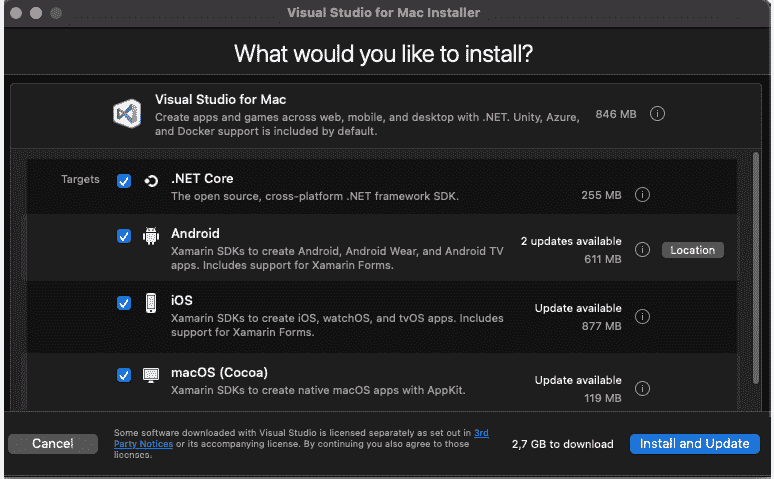
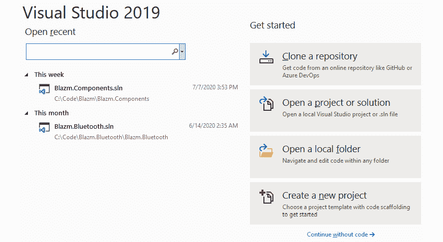
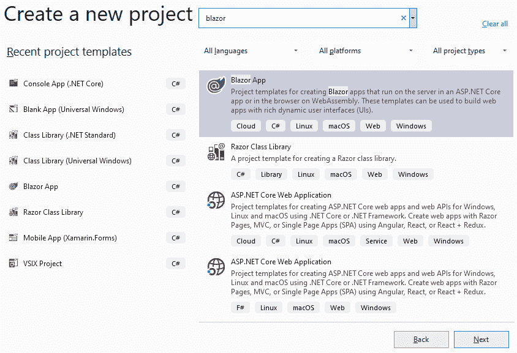
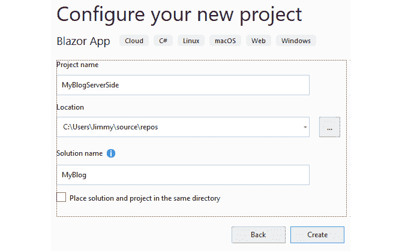
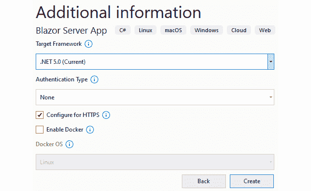
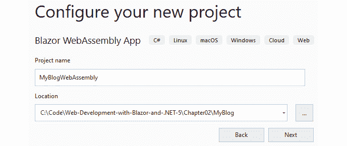
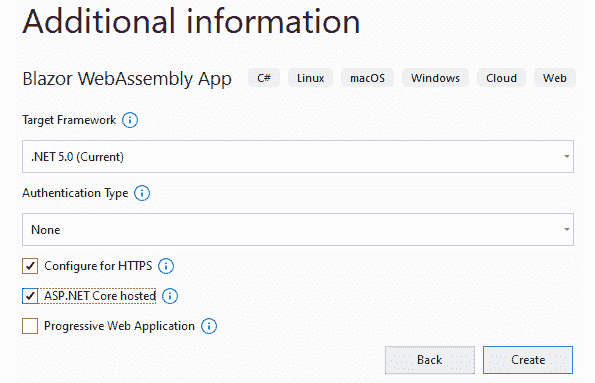
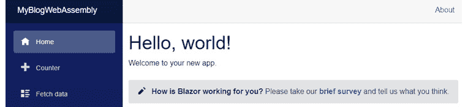
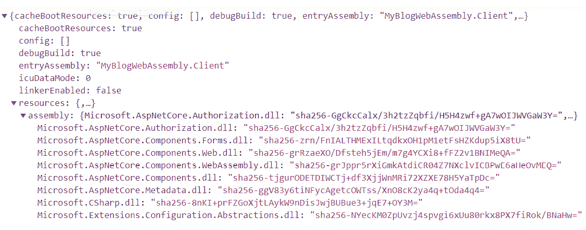
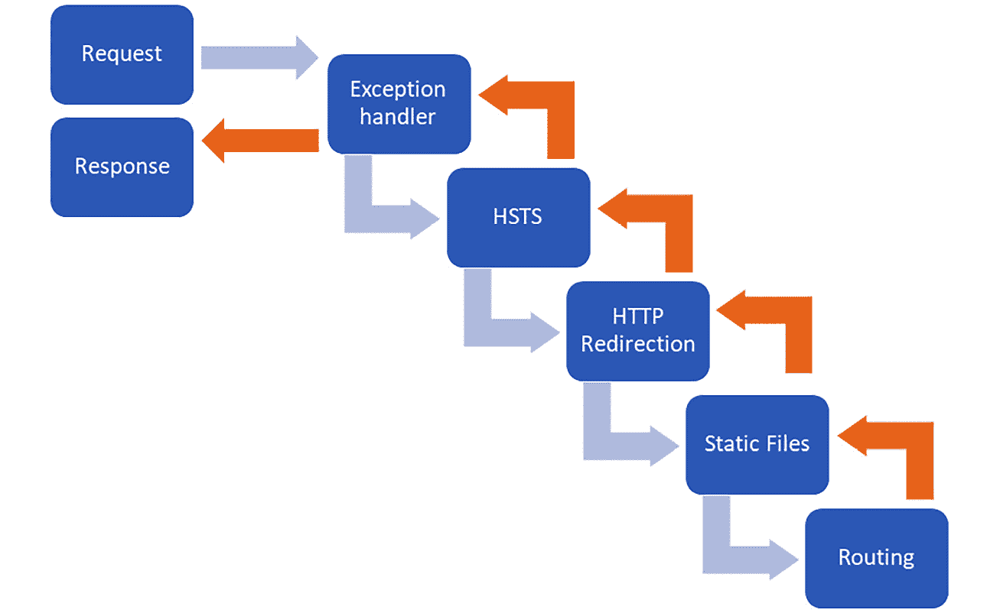

# *第二章*:打造你的第一款 Blazor 应用

在本章中，我们将设置我们的开发环境，以便我们可以开始开发 Blazor 应用。我们将创建我们的第一个 Blazor 应用，并浏览项目结构，突出 Blazor Server 和 Blazor WebAssembly 项目之间的区别。

到本章结束时，您将拥有一个工作开发环境，并且已经创建了一个 Blazor Server 应用和一个 Blazor WebAssembly 应用。

在本章中，我们将介绍以下内容:

*   设置您的开发环境
*   创建我们的第一个 Blazor 应用
*   使用命令行
*   弄清楚项目结构

# 技术要求

我们将创建一个新项目(博客引擎)，并将在整本书中继续致力于该项目。

你可以在[https://github . com/PacktPublishing/Web-Development-wit-Blazor/tree/master/chapter 02](https://github.com/PacktPublishing/Web-Development-with-Blazor/tree/master/Chapter02)找到本章最终结果的源代码。

# 设置您的开发环境

在本书中，的重点将是 Windows 开发，任何截图都将来自 Visual Studio(除非另有说明)。但是自从。NET 5 是跨平台的，我们将介绍如何在 Windows、macOS 和 Linux 上设置您的开发环境。

所有平台的进入链接可以在[https://visualstudio.microsoft.com/](https://visualstudio.microsoft.com/)找到。

从网页，我们可以下载 Visual Studio，Visual Studio Code，或者 Visual Studio for Mac。

## 窗户

在 Windows 上，我们有许多不同的选项来开发 Blazor 应用。Visual Studio 2019 是我们可以使用的最强大的工具。

有三个不同的版本，如下所示:

*   社区 2019
*   专业 2019
*   企业 2019

简而言之，社区版是免费的，而其他版本需要花钱。社区版确实有一些局限性，我们可以在这里比较不同的版本:[https://visualstudio.microsoft.com/vs/compare/](https://visualstudio.microsoft.com/vs/compare/)。

对于这本书，我们可以使用这些版本中的任何一个。采取以下步骤:

1.  从[https://visualstudio.microsoft.com/vs/](https://visualstudio.microsoft.com/vs/)下载 Visual Studio 2019。选择适合你的版本。
2.  安装 Visual Studio，安装时一定要选择**ASP.NET 和 web 开发**，如图*图 2.1* :


图 2.1–在 Windows 上安装 Visual Studio 2019

我们也可以使用 Visual Studio Code 在 Windows 上开发 Blazor，但是对于 Windows 的安装过程就不说了。

## 柔软

在 macOS 上，我们也有一些选项。Visual Studio for Mac 是我们能使用的最强大的 IDE。

从 https://visualstudio.microsoft.com/vs/mac/下载 Visual Studio for Mac，如下所示:

1.  点击**下载 Visual Studio for Mac** 按钮。
2.  打开下载的文件。
3.  确保选择。**净芯**，如图*图 2.2* :



图 2.2–用于苹果电脑安装屏幕的 Visual Studio

既然 Visual Studio Code 是一个跨平台软件，我们在这里也可以使用。

## Linux(或 macOS 或 Windows)

Visual Studio Code 是跨平台的，也就是说我们可以在 Linux、macOS 或者 Windows 上使用。

不同的版本在[https://code.visualstudio.com/Download](https://code.visualstudio.com/Download)有售。

安装后，我们还需要添加两个扩展:

1.  打开 Visual Studio Code，按*Ctrl*+*Shift*+*X*。
2.  搜索`C# for Visual Studio Code (powered by OmniSharp)`点击**安装**。
3.  搜索`JavaScript Debugger (Nightly)`点击**安装**。

要创建项目，我们可以使用。NET CLI，我们将在本书中从头到尾回顾它，但我们不会深入探讨。NET 命令行界面。

现在我们已经设置好了一切，让我们创建我们的第一个应用。

# 创建我们的第一个 Blazor 应用

纵观全书，我们将创建一个博客引擎。不会有很多业务逻辑需要你去学习；这个应用很容易理解，但会基于构建 Blazor 应用时将面临的许多技术和领域。

该项目将允许访问者阅读博客文章并进行搜索。它还将有一个管理网站，在那里你可以写博客文章，这将是密码保护的。

我们将为 Blazor Server 和 Blazor WebAssembly 制作同一个应用，我将向您展示您需要为每个平台做的不同的步骤。

重要说明

本指南将从现在开始使用 Visual Studio 2019，但其他平台也有类似的项目创建方式。

## 创建 Blazor 服务器应用

首先，我们将创建一个 Blazor Server 应用并使用它:

1.  Start Visual Studio 2019 and you will see the following screen:

    

    图 2.3–Visual Studio 启动屏幕

2.  按**新建项目**，在搜索栏中输入`blazor`。
3.  Select **Blazor App** from the search results and press **Next**:

    

    图 2.4–Visual Studio 创建新项目屏幕

4.  Now name the project (this is the hardest part of any project but fear not, I have done that already!). Name the application `MyBlogServerSide`, change the solution name to `MyBlog`, and press **Create**:

    

    图 2.5–Visual Studio 配置您的新项目屏幕

5.  Next, choose what kind of Blazor app we should create. Select .**NET 5.0 (Current)** from the drop-down menu and press **Create**:

    

    图 2.6–用于创建新 Blazor 应用的 Visual Studio 屏幕

6.  现在按 *Ctrl* + *F5* 运行 app(我们也可以在**调试** | **启动**T9】下找到，无需调试)。

恭喜你！您刚刚创建了第一个 Blazor 服务器应用。该站点应该类似于图 2.7 中的*:*


图 2.7–一个新的 Blazor 服务器端应用

稍微浏览一下站点，导航到**计数器**和**获取数据**来感受一下加载时间，看看示例应用做了什么。

示例应用有一些示例数据准备好供我们测试。

这是一个 Blazor 服务器项目，这意味着对于每一个触发器(例如，按下一个按钮)，一个命令将通过 SignalR 发送到服务器。服务器将重新提交组件，并将更改发送回客户端，并更新用户界面。

在浏览器中按 *F12* (进入开发者工具)，切换到**网络**选项卡，然后重新加载页面( *F5* )。您将看到下载到浏览器中的所有文件。

在*图 2.8* 中，可以看到一些下载的文件:


图 2.8–微软边缘中的网络选项卡

浏览器下载页面，一些 CSS，然后`blazor.server.js`，负责设置 SignalR 连接回服务器。然后它调用`negotiate`端点(建立连接)。

对`_blazor?id=`(后面跟着一串字母)的调用是 **WebSocket** 调用，这是客户端和服务器通过开放的连接进行通信。

如果导航到**计数器**页面，按下**点击我**按钮，您会注意到页面不会重新加载。触发器(点击事件)通过信号发送到服务器，页面在服务器上重新呈现，并与呈现树进行比较，只有实际的更改通过网络套接字推回。

对于按钮点击，正在进行三次呼叫:

1.  页面触发事件(例如，按钮点击)。
2.  服务器响应这些更改。
3.  该页面随后发回响应，确认**文档对象模型** ( **DOM** )已经更新。

总共有 490 个字节来回发送一个按钮点击。

现在，我们已经创建了一个解决方案和一个 Blazor Server 项目，并对其进行了测试。接下来，我们将向该解决方案添加一个 Blazor WebAssembly 应用。

## 创建网络组装应用

现在是时候看一下一个 WebAssembly 应用了。我们将创建一个新的 Blazor WebAssembly 应用，并将其添加到与我们刚刚创建的 Blazor Server 应用相同的解决方案中:

1.  右键点击**我的博客**解决方案，选择**添加** | **新项目**。
2.  Search for `Blazor`, select **Blazor WebAssembly App** in the search results, and press **Next**:

    

    图 2.9–Visual Studio 添加新项目屏幕

3.  Name the app `MyBlogWebAssembly`. Leave the location as is (Visual Studio will put it in the right folder by default) and press **Create**:

    

    图 2.10–Visual Studio 配置您的新项目屏幕

4.  在下一屏，选择**。下拉列表中的. NET 5.0(当前)**。
5.  In this dialog box, two new choices appear that were not available in the Blazor Server template. The first option is **ASP.NET Core hosted**, which will create an ASP.NET backend project and will host the WebAssembly app, which is good if you want to host web APIs for your app to access; you should check this box.

    第二个选项是**渐进式网络应用**，它将创建一个`manifest.json`文件和一个`service-worker.js`文件，使您的应用作为**渐进式网络应用** ( **PWA** )可用。对于此项目，不选中它，然后按**创建**:

    

    图 2.11–用于创建新 Blazor 应用的 Visual Studio 屏幕

6.  Right-click on the **MyBlogWebAssembly.Server** project and select **Set as Startup Project**.

    注意:

    这个项目名称中也有**服务器**可能会比较混乱。

    由于我们在创建项目时选择了**ASP.NET Core托管**，所以我们在**我的博客浏览器中托管客户端(网络组装)的后端。服务器**与 Blazor 服务器无关。

    请记住，如果你想运行网络组装应用，你应该运行**我的博客组装。服务器**项目；这样，我们知道后端 ASP.NET Core项目也将运行。

7.  按 *Ctrl* + *F5* 运行应用(无需调试即可启动)。

恭喜你！您刚刚创建了第一个 Blazor WebAssembly 应用，如图*图 2.12* :



图 2.12–一个新的 Blazor 网络组装应用

点击**计数器**和**获取数据**链接，浏览网站。该应用的行为应该与 Blazor 服务器版本相同。

在浏览器中按 *F12* (进入开发者工具)，切换到**网络**选项卡，重新加载页面(*F5*)；您将看到下载到浏览器中的所有文件。

在*图 2.13* 中，可以看到一些下载的文件:


图 2.13–微软边缘中的网络选项卡

在这种情况下，当页面被下载时，它将触发`blazor.webassembly.js`文件的下载。然后，`blazor.boot.json`被下载。*图 2.14* 展示了部分`blazor.boot.json`的例子:



图 2.14–blazor . boot . JSON 文件的一部分

`blazor.boot.json`包含的最重要的东西是入口程序集，这是浏览器应该开始执行的 DLL 的名称。它还包含应用运行所需的所有框架 dll。现在，我们的应用知道启动需要什么了。

然后 JavaScript 会下载`dotnet.5.0.*.js`，它会下载`blazor.boot.json`中提到的所有资源:这是你编译成. NET Standard DLL 的混合代码，微软。NET 框架代码，以及您可能使用的任何社区或第三方 dll。然后，JavaScript 下载`dotnet.wasm`，将 Mono 运行时编译到 WebAssembly，现在将开始启动你的应用。

如果你仔细观察，当你重新加载你的页面时，你可能会看到一些文字说**正在加载**。在**加载**出现和页面完成加载之间，JSON 文件、JavaScript、网络组件和动态链接库被下载，一切都启动了。根据微软 Edge 的说法，在调试模式和未优化的代码下运行需要 1.8 秒。

现在我们已经有了项目的基础，包括一个 Blazor WebAssembly 版本和一个 Blazor Server 版本。在本书中，我们将使用 Visual Studio，但是还有其他方法来运行您的 Blazor 站点，例如使用命令行。命令行是一个超级强大的工具，在下一节中，我们将使用命令行运行我们的 Blazor 应用。

# 使用命令行

和。NET 5，你得到一个超级强大的工具叫做`dotnet.exe`。使用过。NET Core 之前就已经会熟悉这个工具了，但是用。NET 5，它不再是专为。NET Core开发人员。

它可以做很多 Visual Studio 可以做的事情，例如，创建项目、添加和创建 NuGet 包等等。在下一个例子中，我们将创建一个 Blazor 服务器项目。

## 使用命令行创建 Blazor 服务器项目

下面的步骤只是为了演示使用命令行的威力。我们不会在本书的后面使用这个项目，所以如果你不想尝试，请跳过这一部分。要创建新的 Blazor 服务器项目，可以使用以下命令:

```cs
dotnet new blazorserver -o BlazorServerSideApp
```

这里，`dotnet`是命令，要创建一个新项目，可以使用`new`参数。

`blazorserver`是模板的名称，`-o`是输出文件夹(在这种情况下，项目将在名为`BlazorServerSideApp`的子文件夹中创建)。

您可以使用`Dotnet`命令运行 Blazor 应用。启动 PowerShell 并导航至`MyBlogServerSide`文件夹，然后键入以下命令:

```cs
Dotnet run
```

它将编译代码并启动运行您的应用的 web 服务器:

```cs
info: Microsoft.Hosting.Lifetime[0]
      Now listening on: https://localhost:5001
info: Microsoft.Hosting.Lifetime[0]
      Now listening on: http://localhost:5000
info: Microsoft.Hosting.Lifetime[0]
      Application started. Press Ctrl+C to shut down.
info: Microsoft.Hosting.Lifetime[0]
      Hosting environment: Development
info: Microsoft.Hosting.Lifetime[0]
      Content root path:
        D:\Source\B16009\Ch2\MyBlog\MyBlogServerSide 
```

如果你启动一个网络浏览器并导航到`http://localhost:5000`，你将会看到你的网站。

请注意。NET 命令行界面

这个想法是你应该能够从命令行做任何事情。如果您更喜欢使用命令行，您应该检查。NET 命令行界面；你可以阅读更多关于。这里是:[https://docs.microsoft.com/en-us/dotnet/core/tools/](https://docs.microsoft.com/en-us/dotnet/core/tools/)。

让我们回到 Blazor 模板，它已经为我们添加了很多文件。在下一节中，我们将看看 Visual Studio 为我们生成了什么。

# 搞清楚项目结构

现在是时候看看不同的文件以及它们在不同项目中的不同之处了。看看我们刚刚创建的两个项目中的代码(在*创建我们的第一个 Blazor 应用*部分)当我们浏览它们的时候。

## 程序. cs

`Program.cs`是被调用的第一个类。它也不同于布拉佐服务器和布拉佐网络组件。

### 网络组装程序

在`MyBlogWebAssembly.Client`项目中，有一个名为`Program.cs`的文件，它是这样的:

```cs
public class Program
{
    public static async Task Main(string[] args)
    {
        var builder = WebAssemblyHostBuilder.CreateDefault           (args);
        builder.RootComponents.Add<App>("#app");
        builder.Services.AddScoped(sp => new HttpClient {
          BaseAddress = new Uri             (builder.HostEnvironment.BaseAddress) }); 
        await builder.Build().RunAsync();
    }
}
```

`Main`方法是第一个被调用的方法；它将添加`app`作为根组件，整个单页应用站点将在`App`组件内部呈现(我们将在本章后面回到该组件)。

它添加`HttpClient`作为范围依赖。在 [*第三章*](03.html#_idTextAnchor048)*介绍实体框架核心*中，我们将深入挖掘依赖注入，但目前来说，这是一种通过注入对象(依赖)来抽象对象和类型的创建的方法，因此您不会在页面内部创建对象。相反，对象被传递到页面/类中，这将使测试更容易，并且类没有我们不知道的任何依赖关系。

WebAssembly 版本是在浏览器中运行的，因此它获取数据的唯一方式是通过外部调用(例如，对服务器的调用)；因此，我们需要能够访问`HttpClient`。WebAssembly 不允许进行任何直接调用来下载数据，因此`HttpClient`是 WebAssembly 的一个特殊实现，它将进行 JavaScript interop 调用来下载数据。

正如我之前提到的，WebAssembly 是在沙箱中运行的，为了能够在这个沙箱之外进行通信，它需要通过适当的 JavaScript/浏览器 API。

### Blazor 服务器程序

Blazor 服务器项目看起来有点不同(但是做的几乎一样)。在`MyBlogServerSide`项目中，`Program.cs`文件如下所示:

```cs
public class Program
{
    public static void Main(string[] args)
    {
        CreateHostBuilder(args).Build().Run();
    }
    public static IHostBuilder CreateHostBuilder(string[]      args) =>
        Host.CreateDefaultBuilder(args)
            .ConfigureWebHostDefaults(webBuilder =>
            { 
                webBuilder.UseStartup<Startup>();
            });
}
```

就像 WebAssembly 一样，`Main`方法是第一个被调用的东西。它将调用`CreateDefaultBuilder`方法，将把一切交给`Startup`类。您会注意到我们在这里没有注册任何服务；而是在`Startup`班完成。

## 启动

启动文件负责挂接所有服务，配置 app 它只在 Blazor Server 项目中可用(在 Blazor WebAssembly 中不可用)。在启动文件中，有几个方法，我们将逐一介绍。

在`MyBlogServerSide`项目中，我们有`Startup.cs`文件:

```cs
public Startup(IConfiguration configuration)
{
    Configuration = configuration;
}
public IConfiguration Configuration { get; }
```

`Startup`方法是一个接受`IConfiguration`对象的构造函数。使用`Configuration`属性，我们可以访问我们可能需要的任何设置。

下一个方法是`ConfigureServices`:

```cs
public void ConfigureServices(IServiceCollection services)
{
    services.AddRazorPages();
    services.AddServerSideBlazor();
    services.AddSingleton<WeatherForecastService>();
}
```

`ConfigureServices`方法是我们在应用中添加所有需要的依赖项的地方。在这种情况下，我们添加`RazorPages`，这是运行 Blazor 的页面(这些是`.cshtml`文件)。然后我们添加`ServerSideBlazor`，这将使我们能够访问运行 Blazor Server 所需的所有对象。然后我们添加`WeatherForcastService`，当您导航到**预测**页面时使用。

接下来我们有`Configure`方法，它配置我们需要的一切:

```cs
public void Configure(IApplicationBuilder app, IWebHostEnvironment env)
{
    if (env.IsDevelopment())
    {
        app.UseDeveloperExceptionPage();
    }
    else
    {
        app.UseExceptionHandler("/Error");
        app.UseHsts();
    }
    app.UseHttpsRedirection();
    app.UseStaticFiles();
    app.UseRouting();
    app.UseEndpoints(endpoints =>
    {
        endpoints.MapBlazorHub();
        endpoints.MapFallbackToPage("/_Host");
    });
}
```

`UseDeveloperExceptionPage`将确保当我们在开发环境中运行时，我们的应用将显示更详细的开发人员异常页面，这使得调试应用更加容易。如果我们没有在开发中运行，它将重定向到一个异常处理程序，并显示一个更友好的错误消息。

它还配置 **HTTP 严格传输安全** ( **HSTS** ，强制你的应用使用 HTTPS，并会确保你的用户不使用任何不可信的资源或证书。我们还确保网站重定向到 HTTPS，以确保网站安全。

`UseStaticFiles`允许下载静态文件，如 CSS 或图像。

不同的`Use*`方法将请求委托添加到请求管道或中间件管道。每个请求委托(`DeveloperException`、`httpRedirection`、`StaticFiles`等)从上到下依次调用。

这就是为什么异常处理程序是第一个被添加的。

如果随后的任何请求委托中出现异常，异常处理程序仍然能够处理它(因为请求通过管道返回)，如图 2.15 所示:



图 2.15–请求中间件管道

例如，如果这些请求代理中的任何一个在静态文件的情况下处理请求，则不需要涉及路由，并且剩余的请求代理将不会被调用。如果请求是针对静态文件的，则不需要涉及路由。在某些情况下，以正确的顺序添加委托的请求非常重要。

注意:

如果你想进一步挖掘，这里有更多的信息:[https://docs . Microsoft . com/en-us/aspnet/core/基本面/中间件/？view=aspnetcore-5.0](https://docs.microsoft.com/en-us/aspnet/core/fundamentals/middleware/?view=aspnetcore-5.0) 。

在`Configure`方法的最后，我们连接路由并添加端点。我们为 Blazor SignalR hub 创建一个端点，如果我们找不到任何要返回的东西，我们确保我们将调用`_host`文件，该文件将为应用处理路由。当`_host`触发后，应用的首页将被加载。

## 索引/_ 主机

接下来发生的是`Index`或`_host`文件运行。它包含加载必要的 JavaScript 的信息。

### _ 主机(Blazor 服务器)

布拉佐尔服务器项目有一个位于`pages`文件夹中的`_Host.cshtml`文件。这是一个 Razor 页面，它与 Razor 组件不是一回事:

*   剃刀页面是创建视图或页面的一种方式。它可以使用 Razor 语法，但不能用作组件(组件可以用作页面的一部分，也可以在另一个组件内部使用)。
*   一个**剃刀组件**是一种构建可重用视图(称为**组件**)的方法，您可以在整个应用中使用。您可以构建一个网格组件(例如，呈现表格的组件)并在您的应用中使用它，或者将其打包为库供其他人使用。但是，通过向组件添加`@`页面指令，组件可以用作页面，并且它可以被称为页面(稍后将详细介绍)。

对于大多数 Blazor 应用，你应该只有一个`.cshtml`页面；剩下的应该是 Razor 组件。

在页面顶部，您会发现一些`@`指令(如`page`、`namespace`、`using`、`addTagHelper`):

```cs
@page "/"
@namespace BlazorTestServerSide.Pages
@using MyBlogServerSide
@addTagHelper *, Microsoft.AspNetCore.Mvc.TagHelpers
@{
    Layout = null;
}
```

这个文件有几个方面值得注意。`@`指令确保设置页面的网址，添加名称空间，添加标签助手，并且我们没有使用`Layout`页面。我们将在 [*第 4 章*](04.html#_idTextAnchor060)*了解基本 Blazor 组件*中介绍指令。

我们不需要这个页面布局的原因是布局将被加载到应用组件中。

然后我们有一些标准的 HTML 文档类型、元标签、标题和样式。布拉佐特有的唯一东西是`base`标签:

```cs
<base href="~/" />
```

它确保你的页面会找到布拉佐信号中枢。如果您没有`base`标签，一旦您导航到文件夹中的页面，您的网站将会崩溃，因为相对网址不再找到 Blazor 信号中心。

接下来，我们有`body`标签，它包含应用组件:

```cs
<component type="typeof(App)" render-mode="ServerPrerendered" />
```

这是整个应用将被呈现的地方。`App`组件处理这一点。这也是您使用组件标签助手将 Blazor 组件添加到现有非 Blazor 应用中的方式。

它将渲染一个名为`App`的组件。有五种不同的渲染模式:

*   第一个是默认的`ServerPrerendered`模式，当页面第一次下载时，它会在服务器上呈现所有内容，并将其作为内容的一部分进行传递。然后，它将连接 Blazor 信号中心，并确保您的更改将被推送到服务器和从服务器；但是，服务器将进行另一次渲染，并将这些更改推送到 SignalR 上。通常，您不会注意到任何事情，但是如果您在服务器上使用某些事件，例如，它们可能会被触发两次并进行不必要的数据库调用。
*   第二个选项是`Server`，它将发送整个页面并为组件添加占位符。然后，它连接到 SignalR，并让服务器在它完成时(例如，当它从数据库中检索到数据时)发送更改。
*   第三个选项是`Static`，会渲染组件然后断开，这意味着它不会监听事件，也不会再更新组件。对于静态数据来说，这可能是一个不错的选择。
*   第四个选项是`WebAssembly`，它将为 WebAssembly 应用呈现一个标记，但不会从组件中输出任何东西。
*   第五个选项是`WebAssemblyPrerendered`，它会将组件渲染成静态 HTML，然后将 WebAssembly 应用引导到那个空间。

这会让应用感觉加载速度更快。

注意:

要深入了解选项 3 至 5，请点击以下链接:[https://docs . Microsoft . com/en-us/aspnet/core/blazor/components/prerendering-and-integration](https://docs.microsoft.com/en-us/aspnet/core/blazor/components/prerendering-and-integration)。

我们不会深入这些不同的选择。

`ServerPrerendered`从技术上来说是让你的页面在屏幕上出现的最快方式；如果你有一个快速加载的页面，那么这是一个很好的选择。如果你希望你的页面有一个感知的快速加载时间，快速显示你的内容，然后在服务器完成从数据库获取数据时加载数据，那么`Server`是一个更好的选择。

我更喜欢`Server`选项，因为网站应该感觉很快。切换到`Server`是我创建新 Blazor 网站时改变的第一件事；我更希望数据在几毫秒后弹出，因为页面会感觉加载得更快。

在`_host`文件中，有一小部分 UI 会显示是否有错误信息:

```cs
<div id="blazor-error-ui">
    <environment include="Staging,Production">
        An error has occurred. This application may no         longer respond until reloaded.
    </environment>
    <environment include="Development">
        An unhandled exception has occurred. See browser         dev tools for details.
    </environment>
    <a href="" class="reload">Reload</a>
    <a class="dismiss"></a>
</div>
```

我建议保留这个错误 UI(或者它的变体)，因为 JavaScript 涉及到更新 UI。在某些情况下，您的页面可能会崩溃，JavaScript 将停止运行，SignalR 连接将失败。如果发生这种情况，您将在 JavaScript 控制台中看到一条漂亮的错误消息。但是通过弹出错误用户界面，您将知道您需要检查控制台。

我们将在`_host`页面上讨论的最后一件事也是所有魔法发生的地方，负责连接一切的 JavaScript:

```cs
<script src="_framework/blazor.server.js"></script>
```

该脚本将创建一个到服务器的信号连接，并负责从服务器更新 DOM 并将触发器发送回服务器。

### 索引(网络组件)

WebAssembly 项目看起来相当大同小异。

在`MyBlogWebAssembly.Client`项目中，打开`wwwroot/index.html`文件。这个文件只是 HTML，所以没有像 Blazor Server 版本那样在顶部有指令。

就像 Blazor Server 版本一样，你会发现一个`base`标签:

```cs
<base href="/" />
```

取而代之的是一个`component`标签(与 Blazor 服务器一样)，你会在这里找到一个`div`标签，在`Program.cs`中有一条线将`App`组件连接到`div`标签(参见之前的 *Program.cs* 部分):

```cs
<div id="app">Loading...</div>
```

如果你愿意，你可以用其他东西代替`Loading…`——这是应用启动时将显示的内容。

错误界面看起来也有点不同。开发和生产之间没有区别，就像我们在 Blazor Server 中一样。这里只有一种显示错误的方法:

```cs
<div id="blazor-error-UI">
    An unhandled error has occurred.
    <a href="" class="reload">Reload</a>
    <a class="dismiss"></a>
</div>
```

最后，我们有一个加载 JavaScript 的`script`标签。这确保加载了运行 WebAssembly 代码所需的所有代码:

```cs
<script src="_framework/blazor.webassembly.js"></script>
```

就像 Blazor 服务器的脚本如何与后端服务器和 DOM 通信一样，WebAssembly 脚本也在 WebAssembly 之间通信。NET 运行时和 DOM。

此时，应用正在启动，Blazor Server 和 Blazor WebAssembly 之间的差异已经不复存在；从现在开始都是 Razor 组件。将被加载的第一个组件是`App`组件。

## App

对于 Blazor 网络组件和 Blazor 服务器来说，`App`组件与相同。它包含一个`Router`组件:

```cs
<Router AppAssembly="@typeof(Program).Assembly">
    <Found Context="routeData">
        <RouteView RouteData="@routeData"
          DefaultLayout="@typeof(MainLayout)" />
    </Found>
    <NotFound>
        <LayoutView Layout="@typeof(MainLayout)">
            <p>Sorry, there's nothing at this address.</p>
        </LayoutView>
    </NotFound>
</Router>
```

该文件处理路由，找到要显示的正确组件(基于`@page`指令)。如果找不到路由，它会显示一条错误消息。在 [*第八章*](08.html#_idTextAnchor122)*认证授权*中，我们在实施认证的时候会对这个文件进行修改。

`App`组件还包括默认布局。布局可以被每个组件覆盖，但是通常情况下，你的站点会有一个布局页面。在这种情况下，默认的布局称为`MainLayout`。

## 主布局

当作为页面查看时，`MainLayout`包含所有组件的默认布局。主布局包含几个`div`标签，一个用于侧边栏，一个用于主要内容:

```cs
@inherits LayoutComponentBase
<div class="page">
    <div class="sidebar">
        <NavMenu />
    </div>
    <div class="main">
        <div class="top-row px-4">
            <a href="http://blazor.net" target="_blank"               class="ml-md-auto">About</a>
        </div>
        <div class="content px-4">
            @Body
        </div>
    </div>
</div>
```

本文档中您唯一需要的是`@inherits LayoutComponentBase`和`@Body`；剩下的只是自举。`@inherits`指令继承自`LayoutComponentBase`，它包含使用布局的所有代码。`@Body`是组件将被渲染的地方(当作为页面查看时)。

## 自举

**Bootstrap** 是最流行的 CSS 框架之一，用于开发响应性和移动优先的网站。

我们可以在`wwwroot\index.html`文件中找到对 Bootstrap 的引用。

它是由推特创建并为其服务的。你可以在这里阅读更多关于 Bootstrap 的信息:[https://getbootstrap.com/](https://getbootstrap.com/)。

在布局的顶部，你可以看到`<NavMenu>`，这是一个 Razor 组件。它位于`Shared`文件夹中，看起来像这样:

```cs
<div class="top-row pl-4 navbar navbar-dark">
    <a class="navbar-brand" href="">MyBlogServerSide</a>
    <button class="navbar-toggler"
       @onclick="ToggleNavMenu">
        <span class="navbar-toggler-icon"></span>
    </button>
</div>
<div class="@NavMenuCssClass" @onclick="ToggleNavMenu">
    <ul class="nav flex-column">
        <li class="nav-item px-3">
            <NavLink class="nav-link" href=""
               Match="NavLinkMatch.All">
                <span class="oi oi-home" 
                  aria-hidden="true"></span> Home
            </NavLink>
        </li>
        <li class="nav-item px-3">
            <NavLink class="nav-link" href="counter">
                <span class="oi oi-plus"                   aria-hidden="true"></span> Counter
            </NavLink>
        </li>
        <li class="nav-item px-3">
            <NavLink class="nav-link" href="fetchdata">
                <span class="oi oi-list-rich"                   aria-hidden="true"></span> Fetch data
            </NavLink>
        </li>
    </ul>
</div>
@code {
    private bool collapseNavMenu = true; 
    private string NavMenuCssClass => 
      collapseNavMenu ? "collapse" : null;
    private void ToggleNavMenu()
    {
        collapseNavMenu = !collapseNavMenu;
    }
}
```

它包含左侧菜单，是标准的引导菜单。它还有三个菜单项和一个汉堡菜单的逻辑(如果在手机上看的话)。这种导航菜单通常是用 JavaScript 完成的，但是这种是用 CSS 和 C#单独完成的。

你会发现另一个组件，`NavLink`，它内置在框架中。它将呈现一个锚标签，但也将检查当前路线。如果您当前与导航链接在同一路线/网址上，它会自动向标签添加一个名为`active`的 CSS 类。

我们会遇到几个更内置的组件，这些组件会在路上帮助我们。模板中也有一些页面，但我们将暂时保留它们，并在下一章进入组件时浏览它们。

# 总结

在本章中，我们启动并运行了开发环境，并为 Blazor WebAssembly 和 Blazor Server 创建了我们的第一个 Blazor 应用。您学习了类、组件和布局的调用顺序，这将使代码更容易理解。我们还讨论了 Blazor 服务器项目和 Blazor 网络组装项目之间的一些区别。

在下一章中，我们将从 Blazor 中休息一下，看看实体框架 Core 5，并建立我们的数据库。如果你已经了解了实体框架，你可以跳到 [*第四章*](04.html#_idTextAnchor060)*了解基本 Blazor 组件*，在这里我们将遍历组件，深入挖掘模板中的组件，然后创建我们的第一个组件。