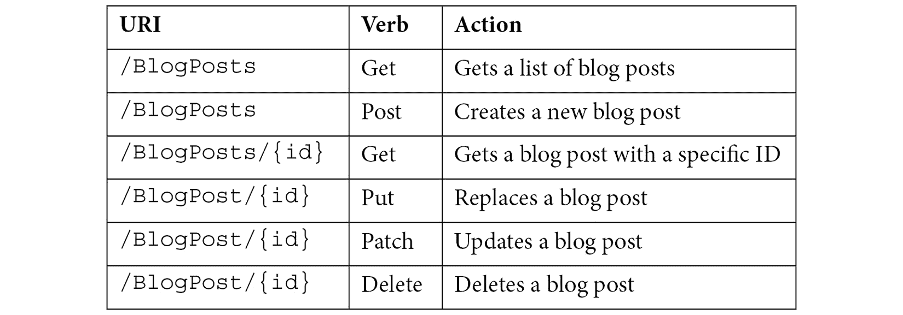

# *第七章*:创建应用编程接口

Blazor WebAssembly 需要能够检索数据，也能够更改我们的数据。为了做到这一点，我们需要一个可以访问数据库的应用编程接口。在本章中，我们将创建一个网络应用编程接口。

当我们使用 Blazor Server 时，API 将与页面一起被保护(如果我们添加一个`Authorize`属性)，所以我们免费获得它。但是有了 WebAssembly，一切都将在浏览器中执行，所以我们需要一些 WebAssembly 可以与之通信的东西来更新服务器上的数据库。

为此，我们将涵盖需要涵盖的三个主题。在本章中，我们将介绍前两个:

*   创建服务
*   创建客户端

第三个话题是*调用 API* ，不过这一部分我们在本章就不赘述了；相反，我们将在 [*第 9 章*](09.html#_idTextAnchor134) *【共享代码和资源】*中回到它。

# 技术要求

确保您已经阅读了前面的章节，或者使用`Ch6`文件夹作为起点。

你可以在[https://github . com/PacktPublishing/Web-Development-wit-Blazor/tree/master/chapter 07](https://github.com/PacktPublishing/Web-Development-with-Blazor/tree/master/Chapter07)找到本章最终结果的源代码。

# 创建服务

有很多方法可以创建服务，比如通过 REST 或者 gRPC。在这本书里，我们将涵盖 REST。

对于那些之前没有使用过 REST 的人来说， **REST** 代表**表征状态转移**。简单来说，就是机器使用 HTTP 与其他机器对话的一种方式。

使用 REST，我们对不同的操作使用不同的 HTTP 动词。可能是这样的:



这就是我们要为**标签**、**类别**和**博文**实现的。

由于 API 会考虑是否应该创建 *p* *ost* ，所以我们会稍微欺骗一下，只实现 *Put* (替换)，因为我们不知道是创建还是更新数据。

API 只会是 Blazor WebAssembly 使用的，所以我们会在`MyBlogWebAssembly.Server`项目中实现 API。

## 添加数据库访问

执行以下步骤以提供数据库访问:

1.  在`MyBlogWebAssembly.Server`项目中，打开`Startup.cs`。
2.  In the `Configure services` method, add the following lines (at the top of the method):

    ```cs
    services.AddDbContextFactory<MyBlogDbContext>(opt => opt.UseSqlite($"Data Source=../../MyBlog.db"));
    services.AddScoped<IMyBlogApi, MyBlogApiServerSide>();
    ```

    这与`MyBlogServerSide`项目的数据库配置相同。

    我们甚至指向同一个数据库，但是由于对于 Blazor WebAssembly 项目来说，文件夹结构更深一层，所以我们使用`..\..\MyBlog.db`到达现有的数据库。

3.  通过右键单击`MyBlogWebAssembly.Server`项目下的**依赖项**并选择**添加项目引用**，添加对`MyBlog.Data`项目的引用。
4.  勾选`MyBlog.Data`，点击**确定**。
5.  添加以下名称空间:

    ```cs
    using MyBlog.Data;
    using MyBlog.Data.Interfaces;
    using Microsoft.EntityFrameworkCore;
    ```

现在我们增加了对我们在`MyBlog.Data`项目中的类的访问。

我们对它进行了配置，这样如果我们请求一个`IMyBlogApi`的实例，我们将得到一个`MyBlogApiServerSide`类的实例。这是因为我们在服务器端，所以 API 可以直接访问数据库。

现在，让我们创建应用编程接口。在`Controllers`文件夹中，我们已经有了一个获取天气预报数据的 API。

## 添加 API 控制器

执行以下步骤创建应用编程接口:

1.  在`MyBlogWebAssembly.Server`项目中，右键点击`Controllers` 文件夹，选择**添加** | **类**。命名文件`MyBlogApiController.cs`。
2.  在文件顶部增加`using`语句:

    ```cs
    using Microsoft.AspNetCore.Mvc;
    using MyBlog.Data.Interfaces;
    using MyBlog.Data.Models;
    using System.Collections.Generic;
    using Microsoft.AspNetCore.Authorization;
    ```

3.  继承自`ControllerBase`并添加属性。班级应该是这样的:

    ```cs
    [ApiController]
    [Route("[controller]")]
    public class MyBlogApiController:ControllerBase
    {
    }
    ```

4.  Now we need to access the data, and we will do that through the server-side API. Add the following code inside the class we just created:

    ```cs
    internal readonly IMyBlogApi api;
    public MyBlogApiController(IMyBlogApi api)
    {
        this.api = api;
    }
    ```

    现在我们可以通过`api`变量访问数据。

5.  Next, we will add the code to get blog posts. Add the following code under the code we just added:

    ```cs
    [HttpGet]
    [Route("BlogPosts")]
    public async Task<List<BlogPost>> GetBlogPostsAsync(int numberofposts, int startindex)
    {
        return await api.GetBlogPostsAsync(numberofposts,       startindex);
    }
    ```

    我们创建了一个直接从数据库返回数据的方法(与 Blazor Server 项目使用的 API 相同)。

    转到以下网址:`https://localhost:5001/MyBlogApi/BlogPosts?numberofposts=10&startindex=0`(端口号可能是其他内容)。确保启动`MyBlogWebAssembly.Server`项目。我们将通过我们的博客文章列表获得一些 JSON。

    有几件事情值得注意。方法叫做`GetBlogPostsAsync`。我们选择和 API 同名，但是 URL 和方法名不一样；它由`Route`属性指定。我们使用与`IMyBlogApi`相同的方法名称；当所有东西的名称都相同时，更容易遵循代码。

    我们还指定了`HttpGet`属性，这将确保该方法仅在我们使用 *Get* 动词时运行。

    我们有了一个良好的开端！现在我们也需要实现 API 的其余部分。

6.  Let's add the function to get the blog post count:

    ```cs
    [HttpGet]
    [Route("BlogPostCount")]
    public async Task<int> GetBlogPostCountAsync()
    {
        return await api.GetBlogPostCountAsync();
    }
    ```

    我们使用 *Get* 动词，但是用了另一条路线。

7.  We also need to be able to get one blog post. Add the following method:

    ```cs
    [HttpGet]
    [Route("BlogPosts/{id}")]
    public async Task<BlogPost> GetBlogPostAsync(int id)
    {
        return await api.GetBlogPostAsync(id);
    }
    ```

    在这种情况下，我们使用 *Get* 动词，但是带有另一个包含我们想要获取的*帖子*的 id 的 URL。

    接下来，我们需要一个受保护的 API，通常是更新或删除东西的 API。

8.  Let's add an API that saves a blog post. Add the following code under the code we just added:

    ```cs
    [Authorize]
    [HttpPut]
    [Route("BlogPosts")]
    public async Task<BlogPost> SaveBlogPostAsync([FromBody] BlogPost item)
    {
        return await api.SaveBlogPostAsync(item);
    }
    ```

    正如我在本章前面提到的中，我们将只添加一个用于创建和更新博客帖子的应用编程接口，我们将使用 *Put* 动词(替换)来实现这一点。我们在方法中添加了`Authorize`属性，这将确保用户需要通过身份验证才能调用方法。

9.  Next up, we add a method for deleting blog posts. To do this, add the following code:

    ```cs
    [Authorize]
    [HttpDelete]
    [Route("BlogPosts")]
    public async Task DeleteBlogPostAsync([FromBody] BlogPost item)
    {
        await api.DeleteBlogPostAsync(item);
    }
    ```

    在这种情况下，我们使用*删除*动词，就像保存一样，我们也添加了`Authorize`属性。

10.  Next, we need to do this for `Categories` and `Tags` as well. Let's start with `Categories`. Add the following code to the `MyBlogApiController` class:

    ```cs
    [HttpGet]
    [Route("Categories")]
    public async Task<List<Category>> GetCategoriesAsync()
    {
        return await api.GetCategoriesAsync();
    }
    [HttpGet]
    [Route("Categories/{id}")]
    public async Task<Category> GetCategoryAsync(int id)
    {
        return await api.GetCategoryAsync(id);
    }
    [Authorize]
    [HttpPut]
    [Route("Categories")]
    public async Task<Category> SaveCategoryAsync([FromBody] Category item)
    {
        return await api.SaveCategoryAsync(item);
    }
    [Authorize]
    [HttpDelete]
    [Route("Categories")]
    public async Task DeleteCategoryAsync([FromBody] Category item)
    {
        await api.DeleteCategoryAsync(item);
    }
    ```

    这些都是处理**类**需要的方法。

11.  接下来，让我们对**标签**做同样的事情。在我们刚刚添加的代码下添加以下代码:

    ```cs
    [HttpGet]
    [Route("Tags")]
    public async Task<List<Tag>> GetTagsAsync()
    {
        return await api.GetTagsAsync();
    }
    [HttpGet]
    [Route("Tags/{id}")]
    public async Task<Tag> GetTagAsync(int id)
    {
        return await api.GetTagAsync(id);
    }
    [Authorize]
    [HttpPut]
    [Route("Tags")]
    public async Task<Tag> SaveTagAsync([FromBody] Tag item)
    {
        return await api.SaveTagAsync(item);
    }
    [Authorize]
    [HttpDelete]
    [Route("Tags")]
    public async Task DeleteTagAsync([FromBody] Tag item)
    {
        await api.DeleteTagAsync(item);
    }
    ```

太好了。我们有一个 API！现在是时候编写将访问该 API 的客户端了。

# 创建客户端

要访问应用编程接口，我们需要创建一个客户端。有很多方法可以做到这一点，但是我们将以最简单的方式，通过自己编写代码来做到这一点。

客户端将实现相同的`IMyBlogApi`界面。因此，无论我们使用哪种实现，我们都有完全相同的代码，使用`MyBlogApiServerSide`或`MyBlogApiClientSide`直接访问数据库，我们接下来将创建:

1.  右键单击`MyBlog.Data`下的**依赖关系**节点，选择**管理 NuGet 包**。
2.  搜索`Microsoft.AspNetCore.Components.WebAssembly.Authentication`点击**安装**。
3.  另外，搜索`Newtonsoft.Json`和`Microsoft.Extensions.Http`，点击**安装**。
4.  我们需要一些助手的方法，所以右击`MyBlog.Data`添加一个文件夹，然后**添加** | **文件夹**，命名文件夹`Extensions`。
5.  右键单击新的文件夹，选择**添加** | **类**。命名类`HttpClientExtensions.cs`。
6.  添加以下名称空间:

    ```cs
    using Newtonsoft.Json;
    using System.Net.Http;
    using System.Threading;
    ```

7.  Replace the class with the following code:

    ```cs
    public static class HttpClientExtensions
    {
        public static Task<HttpResponseMessage>       DeleteAsJsonAsync<T>(this HttpClient httpClient,         string requestUri, T data)
            => httpClient.SendAsync(new           HttpRequestMessage(HttpMethod.Delete,             requestUri) { Content = Serialize(data) });
        public static Task<HttpResponseMessage>       DeleteAsJsonAsync<T>(this HttpClient httpClient,         string requestUri, T data, CancellationToken           cancellationToken)
            => httpClient.SendAsync(new           HttpRequestMessage(HttpMethod.Delete,             requestUri) { Content = Serialize(data) },               cancellationToken);
        public static Task<HttpResponseMessage>       DeleteAsJsonAsync<T>(this HttpClient httpClient,         Uri requestUri, T data)
            => httpClient.SendAsync(new           HttpRequestMessage(HttpMethod.Delete,             requestUri) { Content = Serialize(data) });
        public static Task<HttpResponseMessage>       DeleteAsJsonAsync<T>(this HttpClient         httpClient, Uri requestUri, T data,           CancellationToken cancellationToken)
            => httpClient.SendAsync(new           HttpRequestMessage(HttpMethod.Delete,             equestUri) { Content = Serialize(data) },               cancellationToken);
        private static HttpContent Serialize(object data)       => new StringContent        (JsonConvert.SerializeObject(data), Encoding.UTF8,          "application/json");
    }
    ```

    这些是一些扩展方法，将帮助我们调用 API。

8.  右键点击`MyBlog.Data`项目，选择**添加** | **类**。命名班级`MyBlogApiClientSide.cs`。
9.  打开新创建的文件。
10.  将`IMyBlogApi`添加到类中，像这样公开:

    ```cs
    public class MyBlogApiClientSide:IMyBlogApi
    {}
    ```

11.  Some of the API calls are going to be public (do not require authentication), but `HttpClient` will be configured to always require a token (we will do that later in the chapter).

    因此，我们将需要一个经过身份验证的`HttpClient`和一个未经身份验证的`HttpClient`，这取决于我们调用的是什么 API。

12.  为了能够调用 API，我们需要注入`HttpClient`。将以下代码添加到类中:

    ```cs
    private readonly IHttpClientFactory factory;
    public MyBlogApiClientSide(IHttpClientFactory factory)
    {
        this.factory = factory;
    }
    ```

13.  我们还需要添加以下名称空间:

    ```cs
    using MyBlog.Data.Interfaces;
    using System.Net.Http;
    using MyBlog.Data.Models;
    using System.Net.Http.Json;
    using Microsoft.AspNetCore.Components.WebAssembly.Authentication;
    using MyBlog.Data.Extensions;
    using Newtonsoft.Json;
    ```

14.  Now it's time to implement calls to the API. Let's begin with the *Get* calls for blog posts. Add the following code:

    ```cs
    public async Task<BlogPost> GetBlogPostAsync(int id)
    {
        var httpclient = factory.CreateClient("Public");
        return await httpclient.GetFromJsonAsync<BlogPost>      ($"MyBlogAPI/BlogPosts/{id}");
    }
    public async Task<int> GetBlogPostCountAsync()
    {
        var httpclient = factory.CreateClient("Public");
        return await httpclient.GetFromJsonAsync<int>     ("MyBlogAPI/BlogPostCount");
    }
    public async Task<List<BlogPost>> GetBlogPostsAsync(int numberofposts, int startindex)
    {
        var httpclient = factory.CreateClient("Public");
        return await       httpclient.GetFromJsonAsync<List<BlogPost>>       ($"MyBlogAPI/BlogPosts?numberofposts=         {numberofposts}&startindex={startindex}");
    }
    ```

    我们使用我们注入的`HttpClient`然后调用`GetFromJsonAsync`，它会自动下载 JSON 并将其转换为我们提供给泛型方法的类。

    现在有点棘手了:我们需要处理认证幸运的是，这是内置在`HttpClient`中的，所以我们只需要处理`AccessTokenNotAvailable Exception`。如果令牌丢失，它会自动尝试续订，但是如果出现问题(例如，用户没有登录)，我们可以重定向到登录页面。

    我们将在 [*第 8 章*](08.html#_idTextAnchor122)*认证和授权*中回到令牌和认证是如何工作的。

15.  Next, we add the API calls that need authentication, such as saving or deleting a blog post.

    在我们刚刚添加的代码下添加以下代码:

    ```cs
    public async Task<BlogPost> SaveBlogPostAsync(BlogPost item)
    {
        try
        {
            var httpclient =          factory.CreateClient("Authenticated");
            var response= await           httpclient.PutAsJsonAsync<BlogPost>
               ("MyBlogAPI/BlogPosts",item);
            var json = await           response.Content.ReadAsStringAsync();
            return
            JsonConvert.DeserializeObject<BlogPost>(json);
        }
        catch (AccessTokenNotAvailableException exception)
        {
            exception.Redirect();
        }
        return null;
    }
    public async Task DeleteBlogPostAsync(BlogPost item)
    {
        try
        {
            var httpclient =          factory.CreateClient("Authenticated");
            await httpclient.DeleteAsJsonAsync<BlogPost>         ("MyBlogAPI/BlogPosts", item);
        }
        catch (AccessTokenNotAvailableException exception)
        {
            exception.Redirect();
        }
    }
    ```

    如果呼叫抛出`AccessTokenNotAvailableException`，则表示`HttpClient`无法获取或自动续订令牌，用户需要登录。

    这种状态可能永远不会发生，因为我们将确保当用户导航到该页面时，他们需要登录，但安全总比抱歉好。

    我们还使用了一个名为`Authenticated`的`HttpClient`，我们需要对其进行配置，但是我们将在 [*第 8 章*](08.html#_idTextAnchor122)*认证和授权*中回到这个问题。

16.  现在我们需要为**类别**做同样的事情。将以下代码添加到`MyBlogApiClientSide`类中:

    ```cs
    public async Task<List<Category>> GetCategoriesAsync()
    {
        var httpclient = factory.CreateClient("Public");
        return await       httpclient.GetFromJsonAsync<List<Category>>       ($"MyBlogAPI/Categories");
    }
    public async Task<Category> GetCategoryAsync(int id)
    {
        var httpclient = factory.CreateClient("Public");
        return await httpclient.GetFromJsonAsync<Category>      ($"MyBlogAPI/Categories/{id}");
    }
    public async Task DeleteCategoryAsync(Category item)
    {
        try
        {
            var httpclient =          factory.CreateClient("Authenticated");
            await httpclient.DeleteAsJsonAsync<Category>          ("MyBlogAPI/Categories", item);
        }
        catch (AccessTokenNotAvailableException exception)
        {
            exception.Redirect();
        }
    }
    public async Task<Category> SaveCategoryAsync(Category item)
    {
        try
        {
            var httpclient =           factory.CreateClient("Authenticated");
            var response = await           httpclient.PutAsJsonAsync<Category>            ("MyBlogAPI/Categories", item);
            var json = await            response.Content.ReadAsStringAsync();
            return 
            JsonConvert.DeserializeObject<Category>(json);
        }
        catch (AccessTokenNotAvailableException exception)
        {
            exception.Redirect();
        }
        return null;
    }
    ```

17.  And next up, we will do the same for **Tags**. Add the following code just under the code we just added:

    ```cs
    public async Task<Tag> GetTagAsync(int id)
    {
        var httpclient = factory.CreateClient("Public");
        return await httpclient.GetFromJsonAsync<Tag>      ($"MyBlogAPI/Tags/{id}");
    }
    public async Task<List<Tag>> GetTagsAsync()
    {
        var httpclient = factory.CreateClient("Public");
        return await       httpclient.GetFromJsonAsync<List<Tag>>       ($"MyBlogAPI/Tags");
    }
    public async Task DeleteTagAsync(Tag item)
    {
        try
        {
            var httpclient =           factory.CreateClient("Authenticated");
            await httpclient.DeleteAsJsonAsync<Tag>          ("MyBlogAPI/Tags", item);
        }
        catch (AccessTokenNotAvailableException exception)
        {
            exception.Redirect();
        }
    }
    public async Task<Tag> SaveTagAsync(Tag item)
    {
        try
        {
            var httpclient =           factory.CreateClient("Authenticated");
            var response = await           httpclient.PutAsJsonAsync<Tag>            ("MyBlogAPI/Tags", item);
            var json = await           response.Content.ReadAsStringAsync();
            return           JsonConvert.DeserializeObject<Tag>(json);
        }
        catch (AccessTokenNotAvailableException exception)
        {
            exception.Redirect();
        }
        return null;
    }
    ```

    干得好！我们的 API 客户端现在完成了！

总的来说，这两步都完成了，只剩下一步了；正如本章前面提到的一样，我们不会涉及本章的最后一部分。相反，我们将在 [*第 9 章*](09.html#_idTextAnchor134)*共享代码和资源*中回到它。

# 总结

在本章中，我们学习了如何创建应用编程接口和应用编程接口客户端，这是大多数应用程序的重要组成部分。这样，我们可以从我们的数据库中获取博客文章，并在我们的 Blazor WebAssembly 应用程序中显示它们。

在下一章 [*第八章*](08.html#_idTextAnchor122)*认证和授权*中，我们将为我们的网站添加登录功能。

在之后的章节中， [*第 9 章*](09.html#_idTextAnchor134)*共享代码和资源*，我们最终会让两个项目运行在同一个代码上，这也是我们第一次尝试我们的 API 的地方。