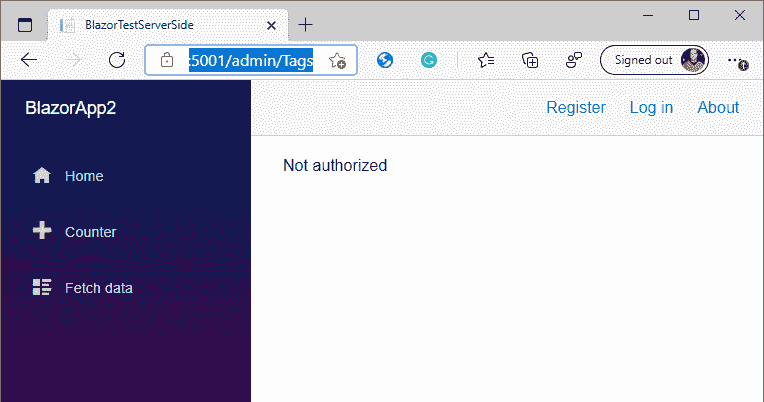

# *第八章*:认证授权

在这一章中，我们将学习如何向我们的博客添加身份验证和授权，因为我们不希望只有任何人能够创建或编辑博客文章。

完全涵盖身份验证和授权本身需要一整本书，因此我们在这里将保持简单。本章的目标是在 ASP.NET 内置的现有功能的基础上，让内置的身份验证和授权功能发挥作用。这意味着这里没有太多的布拉佐魔法；我们可以利用已经存在的许多资源。

今天几乎每个系统都有某种登录方式，无论是管理界面(像我们的)还是会员登录门户。有许多不同的登录提供商，如谷歌、推特和微软。我们可以使用所有这些提供者，因为我们将仅仅建立在已经存在的架构上。

我们将保持简单，并将用户添加到数据库中。

我们将在本章中讨论以下主题:

*   实现身份验证
*   添加授权

# 技术要求

确保您已经阅读了前面的章节，或者使用`Chapter07`文件夹作为起点。

你可以在[https://github . com/PacktPublishing/Web-Development-wit-Blazor/tree/master/chapter 08](https://github.com/PacktPublishing/Web-Development-with-Blazor/tree/master/Chapter08)找到本章最终结果的源代码。

# 实施认证

认证方面有很多内置功能。实现身份验证最简单的方法是在创建项目时选择一个身份验证选项，但是我们在这里学习如何正确工作，因此我们将自己实现身份验证。

我们需要为 Blazor Server 项目和 Blazor WebAssembly 项目分别实现身份验证，因为它们的工作方式有些不同。

但是我们仍然可以在这两个项目之间共享一些东西——首先，让我们将必要的表添加到数据库中。

## 向数据库添加表

为了能够添加认证，我们需要将必要的表添加到我们的数据库中。这是我们可以使用实体框架完成的事情:

1.  在`MyBlog.Data`项目中，我们需要添加几个 NuGet 包；右键单击**依赖项**，选择**管理号码包**。
2.  搜索`Microsoft.AspNetCore.Identity.EntityFrameworkCore`点击**安装**。
3.  搜索`Microsoft.AspNetCore.Diagnostics.EntityFrameworkCore`点击**安装**。
4.  We also need to add `IdentityServer`. Search for `Microsoft.AspNetCore.ApiAuthorization.IdentityServer` and click **Install**.

    如果您只打算使用 Blazor Server，则不需要这一步，但由于我们希望我们的解决方案同时在 Blazor Server 和 Blazor WebAssembly 上工作，因此我们将确保现在添加此`IdentityServer`。

5.  Open the `MyBlogDbContext.cs` file. Change the code so that `MyBlogDbContext` inherits from `ApiAuthorizationDbContext <AppUser>` and add a new constructor and overridden `OnModelCreating` as follows:

    ```cs
    public class MyBlogDbContext : ApiAuthorizationDbContext<AppUser>
        {
            public MyBlogDbContext(DbContextOptions           options) : base(options, new             OperationalStoreOptionsMigrations())
            { }
    protected override void OnModelCreating(ModelBuilder builder)
            {
                base.OnModelCreating(builder);
            }
    ```

    通过添加这些代码，我们也包括了继承类中的表。

6.  In the `MyBlogDbContext.cs` file, we have a class called `MyBlogDbContextFactory`. Change the path to the database to `../MyBlog.db` as follows:

    ```cs
    optionsBuilder.UseSqlite("Data Source = ../MyBlog.db");
    ```

    这样，当我们更新数据库时，我们将为我们所有的项目更新它(我们所有的项目都使用相同的数据库文件)。

7.  Also, add this class (use the same file since the projects are tightly coupled):

    ```cs
    public class OperationalStoreOptionsMigrations : IOptions<OperationalStoreOptions>
    {
        public OperationalStoreOptions Value => new       OperationalStoreOptions()
        {
            DeviceFlowCodes = new           TableConfiguration("DeviceCodes"),
            EnableTokenCleanup = false,
            PersistedGrants = new           TableConfiguration("PersistedGrants"),
            TokenCleanupBatchSize = 100,
            TokenCleanupInterval = 3600,
        };
    }
    ```

    我们使用这个类来配置`IdentityServer`，我们需要这个类，因为我们对身份部分(用户名、密码和令牌)和我们的数据(博客文章、标签和类别)使用相同的数据上下文。

    为了能够创建`DbContextFactory`，我们需要一个只有一个参数的构造函数。

    我们本可以创建多个数据库上下文，一个用于我们的数据，一个用于身份信息，但是随着我们的前进，我们所做的将证明是一个更容易的解决方案。

    增加以下`using`语句:

    ```cs
    using Microsoft.AspNetCore.Identity.EntityFrameworkCore;
    using IdentityServer4.EntityFramework.Options;
    using Microsoft.AspNetCore.ApiAuthorization.IdentityServer;
    using Microsoft.Extensions.Options;
    ```

8.  右键单击`models`文件夹中的，选择**添加** | **类**。名称班级`AppUser.cs`。
9.  Open the `AppUser` class and replace the content with the following:

    ```cs
    using Microsoft.AspNetCore.Identity;
    namespace MyBlog.Data.Models
    {
        public class AppUser : IdentityUser
        {}
    }
    ```

    现在我们需要创建一个迁移，就像我们之前在 [*第三章*](03.html#_idTextAnchor048)*引入实体框架核心*一样；我们将使用 PowerShell 来实现这一点。

10.  Open PowerShell and navigate to the folder that you have the `MyBlog.Data` project in.

    这也可以在 Visual Studio 的开发人员 PowerShell 中完成。

11.  Execute the following commands:

    ```cs
    dotnet ef migrations add Identity
    dotnet ef database update
    ```

    提醒一下，我们正在运行`dotnet`工具来创建名为`Identity`的迁移。

    我们还更新数据库，以便它获得所有最新的迁移，我们准备开始使用新的数据上下文。

接下来，我们需要配置 Blazor 服务器项目。

## 配置 Blazor 服务器项目

我们需要告诉 Blazor Server 项目，我们希望它使用身份验证。我们通过在`Startup.cs`中添加配置来做到这一点:

1.  在`MyBlogServerSide`项目中，右键单击**依赖关系**节点，选择**管理 NuGet 包**。
2.  Search for `Microsoft.AspNetCore.Identity.UI` and click **Install**.

    这个包包含一个用户界面和扩展，当涉及到用户登录时将帮助我们。

    ASP.NET 支持多种不同的身份验证方式，因此利用其身份验证基础架构中已经存在的东西非常有意义。

3.  右键点击`MyBlogServerSide`项目，选择**添加文件夹**，命名文件夹`Authentication`。
4.  右键点击文件夹，选择**添加** | **类**，命名类`RevalidatingIdentityAuthenticationStateProvider.cs`。
5.  We don't need to talk about the content of this class since this is normally provided in a Blazor template. Simply copy the content from the GitHub repository found here: [https://github.com/PacktPublishing/Web-Development-with-Blazor/blob/master/Chapter08/MyBlog/MyBlogServerSide/Authentication/RevalidatingIdentityAuthenticationStateProvider.cs](https://github.com/PacktPublishing/Web-Development-with-Blazor/blob/master/Chapter08/MyBlog/MyBlogServerSide/Authentication/RevalidatingIdentityAuthenticationStateProvider.cs).

    当我们在创建项目时选择添加身份验证时，这是微软将为我们提供的文件之一。

    它将检查用户凭据是否仍然有效(默认为 30 分钟后)。

6.  打开`Startup.cs`并添加以下名称空间:

    ```cs
    using MyBlog.Data.Models;
    using Microsoft.AspNetCore.Components.Authorization;
    using MyBlogServerSide.Authentication;
    ```

7.  To not have to repeat ourselves, let's add the connection string as a setting instead.

    打开`appsetting.json`并在第一个大括号后添加以下内容:

    ```cs
      "ConnectionStrings": {
        "MyBlogDB": "Data Source=../MyBlog.db"
    },
    ```

8.  Add this code at the bottom of the `ConfigureServices` method:

    ```cs
    services.AddDbContext<MyBlogDbContext>(opt => opt.UseSqlite(Configuration.GetConnectionString("MyBlogDB")));
    services.AddDefaultIdentity<AppUser>(options => options.SignIn.RequireConfirmedAccount = true)
            .AddEntityFrameworkStores<MyBlogDbContext>();
    services.AddScoped<AuthenticationStateProvider, RevalidatingIdentityAuthenticationStateProvider <AppUser>>();
    ```

    我们配置了内置的身份提供程序，这样 Blazor 就知道在哪里可以找到用户和密码。

    我们还需要为`DbContext`增加一个配置。我们将在应用程序的其余部分使用`DbContextFactory`，但是`Identity`功能需要`DbContext`，所以我们为`Identity`功能添加了一个*副本*来工作。

    确保在我们刚刚添加的代码上方几行`DBContextFactory`处更改连接字符串。

9.  在`app.UseRouting()`正下方的`Configure`方法中，添加以下代码:

    ```cs
    app.UseAuthentication();
    app.UseAuthorization();
    ```

10.  Open the `App.Razor` file and replace the content with the following:

    ```cs
    <CascadingAuthenticationState>
        <Router AppAssembly="@typeof(Program).Assembly"
           PreferExactMatches="@true">
            <Found Context="routeData">
                <AuthorizeRouteView RouteData="@routeData"
                   DefaultLayout="@typeof(MainLayout)">
                    <NotAuthorized>
                        <p>Not authorized</p>
                    </NotAuthorized>
                    <Authorizing>
                        <p>Checking</p>
                    </Authorizing>
                </AuthorizeRouteView>
            </Found>
            <NotFound>
                <LayoutView Layout="@typeof(MainLayout)">
                    <p>Sorry, there's nothing at this                   address.</p>
                </LayoutView>
            </NotFound>
        </Router>
    </CascadingAuthenticationState>
    ```

    我们添加了`CascadingAuthenticationState`，这将确保所有组件都可以访问`AuthenticationState`(无论我们是否登录)。

    我们还增加了`AuthorizeRouteView`，会检查页面是否通过认证。

    如果用户没有通过身份验证，我们可以使用`NotAuthorized`模板显示另一条消息，并在检查授权时显示另一条消息。

11.  右键点击`components`文件夹，选择**添加** | **剃须刀组件**。命名组件`LoginDisplay.razor`。
12.  Open the new component and replace the content with the following:

    ```cs
    <AuthorizeView>
        <Authorized>
            <a href="Identity/Account/Manage">Hello,          @context.User.Identity.Name!</a>
            <form method="post" action="/LogOut">
                <button type="submit" class="nav-link                btn btn-link">Log out</button>
            </form>
        </Authorized>
        <NotAuthorized>
            <a href= "Identity/Account/Register"> Register         </a>
            <a href="Identity/Account/Login">Log in</a>
        </NotAuthorized>
    </AuthorizeView>
    ```

    在这个文件中，我们使用了内置的`AuthorizeView`组件，这将使得根据用户是否登录来指定不同的视图成为可能。

    如果他们已登录，我们希望显示注销链接，如果他们未登录，我们希望显示登录或注册链接。

13.  打开`_Imports.razor`并在文件中任意位置添加以下`using`语句:

    ```cs
    @using MyBlogServerSide.Components
    ```

14.  打开`Shared/MainLayout.razor`并在**关于**链接后的页面中添加组件:

    ```cs
    <LoginDisplay />
    ```

15.  身份 UI 需要一个名为`_LoginPartial.cshtml`的文件才能工作。右键点击`Pages`文件夹，选择**添加** | **文件夹**；命名文件夹`Shared`。
16.  右键点击`Pages/Shared`文件夹，点击**添加** | **新项目**。
17.  点击**剃刀页面–清空**并命名文件`_LoginPartial.cshtml`。
18.  Replace the content of the file with the following:

    ```cs
    @using Microsoft.AspNetCore.Identity;
    @using MyBlog.Data.Models;
    @inject SignInManager<AppUser> SignInManager
    @inject UserManager<AppUser> UserManager
    @addTagHelper *, Microsoft.AspNetCore.Mvc.TagHelpers
    <ul class="navbar-nav">
    @if (SignInManager.IsSignedIn(User))
    {
        <li class="nav-item">
            <a  class="nav-link text-dark"           asp-area="Identity"           asp-page="/Account/Manage/Index"           title="Manage">          Hello @User.Identity.Name!</a>
        </li>
        <li class="nav-item">
            <form class="form-inline" asp-area="Identity"          asp-page="/Account/Logout"           asp-route-returnUrl="/" method="post">            <button  type="submit" class="nav-link               btn btn-link text-dark">Logout</button>        </form>
        </li>
    }
    else
    {
        <li class="nav-item">
            <a class="nav-link text-dark"           asp-area="Identity"           asp-page="/Account/Register">Register</a>
        </li>
        <li class="nav-item">
            <a class="nav-link text-dark"           asp-area="Identity"           asp-page="/Account/Login">Login</a>
        </li>
    }
    </ul>
    ```

    我们有这样一个文件的原因是登录页面来自`Microsoft.AspNetCore.Identity.UI`包，它为我们提供了使用脸书、谷歌、微软、推特和其他账户登录的功能。

    我们免费获得所有这些功能。我们也可以通过搭建视图来定制登录页面，但是我们不会在本书中讨论这个问题。

    更多关于脚手架的信息可以在这里找到:[https://docs . Microsoft . com/en-us/aspnet/core/security/authentication/scaffold-identity？视图=aspnetcore-5.0 &选项卡= visual studio](https://docs.microsoft.com/en-us/aspnet/core/security/authentication/scaffold-identity?view=aspnetcore-5.0&tabs=visual-studio)。

19.  右键点击`Pages`文件夹，选择**添加** | **新项目**。
20.  点击**剃刀页面–清空**并命名文件`Logout.cshtml`。
21.  将文件的内容替换为:

    ```cs
    @page
    @using Microsoft.AspNetCore.Identity
    @using MyBlog.Data.Models
    @attribute [IgnoreAntiforgeryToken]
    @inject SignInManager<AppUser> SignInManager
    @functions {
        public async Task<IActionResult> OnPost()
        {
            if (SignInManager.IsSignedIn(User))
            {
                await SignInManager.SignOutAsync();
            }
            return Redirect("~/");
        }
    }
    ```

22.  Now we need something to secure. We need to edit the following four files and add the `@attribute [Authorize]` attribute to each file:

    `Pages/Admin/BlogPostEdit.razor`

    `Pages/Admin/BlogPostList.razor`

    `Pages/Admin/CategoryList.razor`

    `Pages/Admin/TagList.razor`

23.  将启动项目更改为`MyBlogServerSide`，按 *F5* 运行项目。
24.  If you now navigate to `https://localhost:5001/admin/Tags` (the port number may differ), you will notice that you get a **Not authorized** message, as shown in *Figure 8.1*:

    

    图 8.1–未授权视图

25.  单击**注册**并使用您的凭据登录，您现在可以访问`TagList`组件。

恭喜，您现在有了一个在服务器端运行登录功能的站点。现在我们需要为 Blazor WebAssembly 实现同样的事情。

## 配置 Blazor WebAssembly 项目

`WebAssembly`项目具有一些相同的功能；它稍微复杂一点，因为它也需要 API 身份验证。

默认情况下(如果我们在创建项目时选择添加身份验证)，它将使用`IdentityServer`对客户端和应用编程接口进行身份验证，这也是我们将要使用的。

`IdentityServer`是一个开源项目，将帮助我们处理我们网站的认证以及我们的 API。

自从我们在我们的`MyBlog.Data`项目中实施`IdentityServer`以来，我们已经准备好了大部分我们需要的东西。

让我们实现剩下的。

首先，我们对`MyBlogWebAssembly.Server`项目进行一些修改。

### 正在更新我的博客程序集。计算机网络服务器

执行以下步骤更新`MyBlogWebAssembly.Server`项目:

1.  在`MyBlogWebAssembly.Server`项目中，打开`Startup.cs`。
2.  添加以下名称空间:

    ```cs
    using MyBlog.Data.Models;
    using Microsoft.AspNetCore.Authentication;
    ```

3.  打开`appsetting.json`并在第一个大括号后添加以下内容:

    ```cs
      "ConnectionStrings": {    "MyBlogDB": "Data Source=../../MyBlog.db" },
    ```

4.  In the `ConfigureServices` method, add the following at the bottom of the method (this needs to be after `AddDbContextFactory`):

    ```cs
    services.AddDbContext<MyBlogDbContext>(opt => opt.UseSqlite(Configuration.GetConnectionString("MyBlogDB")));
    services.AddDefaultIdentity<AppUser>(options => options.SignIn.RequireConfirmedAccount = false)
        .AddEntityFrameworkStores<MyBlogDbContext>();
    services.AddIdentityServer()
        .AddApiAuthorization<AppUser, MyBlogDbContext>();
    services.AddAuthentication()
        .AddIdentityServerJwt();
    ```

    我们配置了数据库，这与我们在本章前面为 Blazor Server 项目所做的几乎相同。

    我们还配置了`Identity`提供商和`IdentityServer`。

    我们还在配置中添加了一个 JWT。 **JWT** 代表 **JSON 网络令牌**，这是一个互联网标准，用于通过可选签名/加密创建数据，该签名/加密保存 JSON 并可以保存多个声明。

    令牌存储在浏览器的会话存储器中。有两个令牌:一个显示我们已经登录，另一个用于 API 访问(这由框架为我们处理)。

    这是我们的应用编程接口客户端(我们在本章开头创建的)将发送给应用编程接口进行身份验证的内容。

    这将自动发生在我们身上。

5.  In the `Configure` method, just above `app.UseEndpoints`, add the following code:

    ```cs
    app.UseIdentityServer();
    app.UseAuthentication();
    app.UseAuthorization();
    ```

    这些线需要在`app.UseRouting();`和`app.UseEndpoints`之间，否则你会得到一个警告，事情可能不会如你所料。

6.  现在我们需要`_LoginPartial`，就像我们为 Blazor 服务器项目所做的那样。右键点击`Pages`文件夹，选择**添加** | **文件夹**；命名文件夹`Shared`。
7.  右键点击`Pages/Shared`，点击**添加** | **剃刀页面**；命名页面`_LoginPartial.cshtml`。
8.  将下面的代码添加到我们刚刚创建的文件中:

    ```cs
    @using Microsoft.AspNetCore.Identity
    @using MyBlog.Data.Models
    @inject SignInManager<AppUser> SignInManager
    @inject UserManager<AppUser> UserManager
    @addTagHelper *, Microsoft.AspNetCore.Mvc.TagHelpers
    @{
        var returnUrl = "/";
        if (Context.Request.Query.TryGetValue("returnUrl",        out var existingUrl)) {        returnUrl = existingUrl;    }
    }
    <ul class="navbar-nav">
    </ul>
    ```

9.  Inside of the `<ul>` tag, add the following code:

    ```cs
    @if (SignInManager.IsSignedIn(User))
    {
        <li class="nav-item">
            <a  class="nav-link text-dark"            asp-area="Identity"            asp-page="/Account/Manage/Index"            title="Manage">           Hello @User.Identity.Name!</a>
        </li>
        <li class="nav-item">
            <form class="form-inline" asp-area="Identity"          asp-page="/Account/Logout"           asp-route-returnUrl="/" method="post">            <button  type="submit" class="nav-link btn               btn-link text-dark">Logout</button>
            </form>
        </li>
    }
    else
    {
        <li class="nav-item">
            <a class="nav-link text-dark"           asp-area="Identity"           asp-page="/Account/Register"           asp-route-returnUrl="@returnUrl">Register         </a>
        </li>
        <li class="nav-item">
            <a class="nav-link text-dark"            asp-area="Identity"            asp-page="/Account/Login"            asp-route-returnUrl="@returnUrl">Login</a>
        </li>
    }
    ```

    根据用户的当前状态，我们显示用户是否登录。如果用户登录，我们会显示一个问候和一个**注销**链接。

10.  We also need to create a controller for Open ID Connect.

    右键点击`Controllers`文件夹，选择**添加** | **类**；命名班级`OidcConfigurationController.cs`。

11.  Open the file we just created and replace the content with the following:

    ```cs
    using Microsoft.AspNetCore.ApiAuthorization.IdentityServer;
    using Microsoft.AspNetCore.Mvc;
    using Microsoft.Extensions.Logging;
    namespace MyBlogWebAssembly.Server.Controllers
    {
        public class OidcConfigurationController : Controller
        {
            private readonly          ILogger<OidcConfigurationController> _logger;
            public OidcConfigurationController           (IclientRequestParametersProvider            clientRequestParametersProvider,           ILogger<OidcConfigurationController>           logger)
            {
                ClientRequestParametersProvider =              clientRequestParametersProvider;
                _logger = logger;
            }
            public IclientRequestParametersProvider           ClientRequestParametersProvider { get; }
            [HttpGet("_configuration/{clientId}")]
            public IactionResult           GetClientRequestParameters([FromRoute] string            clientId)
            {
                var parameters =               ClientRequestParametersProvider.              GetClientParameters(HttpContext, clientId);
                return Ok(parameters);
            }
        }
    }
    ```

    当客户端请求令牌时，该控制器负责将令牌发送给客户端。

12.  Open `appsettings.json` and add the following just above the last curly brace:

    ```cs
    ,
    "IdentityServer": {
      "Clients": {
        "MyBlogWebAssembly.Client": {
          "Profile": "IdentityServerSPA"
        }
      }
    }
    ```

    这是我们客户的名字，需要注明；您必须在 API 中使用相同的客户端名称。

13.  Open `appsettings.Development.json` and add the following:

    ```cs
    ,
    "IdentityServer": {
      "Key": {
        "Type": "Development"
      }
    }
    ```

    最后两步是配置`IdentityServer`。我们创建了一个名为`IdentityServerSPA`的客户档案。我们还使用了`Development`的密钥类型，它创建了一个我们可以在开发过程中使用的假证书(但是在部署到生产服务器时，我们需要用真实证书替换它)。

服务器部分现在已经完成；现在我们需要对`MyBlogWebAssembly.Client`项目进行修改。

### 正在更新我的博客程序集。客户

现在我们需要告诉客户端项目我们要告诉项目使用身份验证:

1.  首先，我们需要添加几个 NuGet 包。右键点击`MyBlogWebAssembly.Client`项目，点击**管理 NuGet 包**。
2.  搜索`Microsoft.AspNetCore.Components.WebAssembly.Authentication`点击**安装**。
3.  搜索`Microsoft.Extensions.Http`点击**安装**。
4.  Open `Program.cs` and replace the line `builder.Services.AddScoped(sp => new HttpClient { BaseAddress = new Uri(builder.HostEnvironment.BaseAddress) });` with the following code block:

    ```cs
    builder.Services.AddHttpClient("Authenticated", client => client.BaseAddress = new Uri(builder.HostEnvironment.BaseAddress))
        .AddHttpMessageHandler<BaseAddressAuthorizationMessage        Handler>();
    builder.Services.AddHttpClient("Public", client => client.BaseAddress = new Uri(builder.HostEnvironment.BaseAddress));
    builder.Services.AddApiAuthorization();
    ```

    我们添加了两个`HttpClient`依赖注入，一个用于调用经过身份验证的 API，一个用于调用任何未经身份验证的 API。

    如果我们在没有令牌(没有登录)的情况下调用一个 API，调用经过认证的 API 会抛出异常；这就是为什么我们需要一个特定的 API 来调用不需要我们登录的 API。

5.  增加以下`using`语句:

    ```cs
    using Microsoft.AspNetCore.Components.WebAssembly.Authentication;
    ```

6.  现在我们需要添加几个文件。右键点击`Pages`文件夹，选择**添加** | **剃须刀组件**，命名文件`Authentication.razor`。
7.  Replace the content of the file with the following:

    ```cs
    @page "/authentication/{action}"
    @using Microsoft.AspNetCore.Components.WebAssembly.Authentication
    <RemoteAuthenticatorView Action="@Action" />
    @code{
        [Parameter] public string Action { get; set; }
    }
    ```

    该组件将重定向并登录服务器。

    这是许多魔法发生的地方:根据动作，它会将您重定向到服务器和内置的身份验证用户界面。

    `RemoteAuthenticatorView`有很多不同的模板可以用来自定义组件，比如`LogInFailed`、`CompletingLogOut`和`LoggingIn`。

    我们使用服务器进行身份验证，客户端将获得一个令牌，这样我们就知道我们已经登录，并且可以从我们的 API 中获取数据。

8.  右键点击`Shared`文件夹，选择**添加** | **剃须刀组件**，命名文件`LoginDisplay.razor`。
9.  Replace the content of the file with the following:

    ```cs
    @using Microsoft.AspNetCore.Components.Authorization
    @using Microsoft.AspNetCore.Components.WebAssembly.Authentication
    @inject NavigationManager Navigation
    @inject SignOutSessionStateManager SignOutManager
    <AuthorizeView>
        <Authorized>
            <a href="authentication/profile">Hello,          @context.User.Identity.Name!</a>
            <button class="nav-link btn btn-link"          @onclick="BeginSignOut">Log out</button>
        </Authorized>
        <NotAuthorized>
            <a href="authentication/register">Register</a>
            <a href="authentication/login">Log in</a>
        </NotAuthorized>
    </AuthorizeView>
    @code{
        private async Task BeginSignOut(MouseEventArgs args)
        {
            await SignOutManager.SetSignOutState();
            Navigation.NavigateTo("authentication/logout");
        }
    }
    ```

    这个文件和我们为 Blazor 服务器创建的文件有点不同。它使用我们刚刚创建的`authentication`组件，并对服务器进行回调。

    它将注销客户端和服务器。

10.  右键点击`Shared`文件夹，选择**添加** | **剃须刀组件**，命名文件`RedirectToLogin.razor`。
11.  Replace the content of the file with the following:

    ```cs
    @inject NavigationManager Navigation
    @using Microsoft.AspNetCore.Components.WebAssembly.Authentication
    @code {
        protected override void OnInitialized()
        {
            Navigation.NavigateTo($"authentication/          login?returnUrl={Uri.EscapeDataString             (Navigation.Uri)}");
        }
    }
    ```

    该组件将重定向到登录页面，再次使用`authentication`组件。

12.  打开`_Imports.razor`并添加此:

    ```cs
    @using Microsoft.AspNetCore.Components.Authorization
    @using Microsoft.AspNetCore.Components.WebAssembly.Authentication
    ```

13.  现在我们需要通过打开`App.Razor`激活认证，并用以下代码替换内容:

    ```cs
    <CascadingAuthenticationState>
        <Router AppAssembly="@typeof(Program).Assembly"
          PreferExactMatches="@true">
            <Found Context="routeData">
                <AuthorizeRouteView RouteData="@routeData"
                  DefaultLayout="@typeof(MainLayout)">
                    <NotAuthorized>
                        @if (!context.User.Identity.                         IsAuthenticated)
                        {
                            <RedirectToLogin />
                        }
                        else
                        {
                            <p>You are not authorized to                            access this resource.</p>
                        }
                    </NotAuthorized>
                </AuthorizeRouteView>
            </Found>
            <NotFound>
                <LayoutView Layout="@typeof(MainLayout)">
                    <p>Sorry, there's nothing at this                   address.</p>
                </LayoutView>
            </NotFound>
        </Router>
    </CascadingAuthenticationState>
    ```

14.  Now we need to add a reference to the JavaScript file. Open `wwwroot/index.html` and just above the reference to `blazor.webassembly.js`, add the following:

    ```cs
    <script src="_content/Microsoft.AspNetCore.Components.WebAssembly.Authentication/AuthenticationService.js"></script>
    ```

    现在一切都准备好了，但是我们还需要一些东西来调用 API。

15.  在`@page` 指令

    ```cs
    @inject IHttpClientFactory factory
    ```

    后打开`Pages/FetchData.razor`并注射`IhttpClientFactory`
16.  Change the content of the `OnInitializedAsync` method to this:

    ```cs
    try
    {
        var httpclient =      factory.CreateClient("Authenticated");
                forecasts = await               httpclient.GetFromJsonAsync                <WeatherForecast[]>("WeatherForecast");
    }
    catch (AccessTokenNotAvailableException exception)
    {
        exception.Redirect();
    }
    ```

    这将调用天气预报服务，如果令牌丢失，它将重定向到登录页面。

17.  添加以下命名空间:

    ```cs
    @using Microsoft.AspNetCore.Components.WebAssembly.Authentication
    ```

18.  现在是运行项目的时候了。确定将`MyBlogWebAssembly.Server`设为启动项目，按 *F5* 。
19.  现在导航到天气预报服务，您将被重定向到登录/注册页面，在那里您可以创建帐户或登录。

太好了，现在登录我们网站的一切都准备好了。有时候，我们想授予不同的用户不同的权限，这就是下一节的内容。

# 添加授权

至此，我们知道用户是否通过认证，但用户是否可以访问特定的功能？这就是授权的意义所在。幸运的是，内置函数也支持这一点，尽管我们必须为它编写一些代码。

服务器端拥有向用户添加角色所需的所有表。但是，没有可用的用户界面。对于我们的应用程序，我们将在数据库中手动添加一个角色，但是首先，我们需要配置角色。

## 从服务器添加角色

执行以下步骤从服务器添加角色:

1.  在`MyBlogWebAssembly.Server`项目中，打开`Startup.cs`文件。
2.  In the `ConfigureServices` method, add options to `.AddApiAuthorization` and remove the default claim mapping as follows:

    ```cs
    .AddApiAuthorization<AppUser, MyBlogDbContext>(options =>
    {                 
        options.IdentityResources["openid"].UserClaims.    Add("name"); 
        options.ApiResources.Single().UserClaims.Add("name"); 
        options.IdentityResources["openid"].UserClaims.    Add("role"); options.ApiResources.Single().    UserClaims.Add("role");
    }); 
        JwtSecurityTokenHandler.DefaultInboundClaimFilter.    Remove("role");
    ```

    这将包括令牌中的角色，以便我们可以在客户端使用令牌。

3.  将角色添加到`Services.AddDefaultIdentity`中，因此它现在看起来像这样:

    ```cs
    services.AddDefaultIdentity<AppUser>(options =>      options.SignIn.RequireConfirmedAccount = false)
            .AddRoles<IdentityRole>()          .AddEntityFrameworkStores<MyBlogDbContext>();
    ```

4.  添加名称空间:

    ```cs
    using Microsoft.AspNetCore.Identity;
    using System.IdentityModel.Tokens.Jwt;
    ```

服务器现在会将角色发送给客户端，但客户端不会监听；因此，接下来，我们需要对客户端进行更改。

## 向客户端添加角色

为了让客户端提取角色，我们需要从访问令牌中解析它们。别担心，事情没有听起来那么复杂:

1.  右键点击`MyBlogWebAssembly.Client`项目，然后点击**添加** | **新建文件夹**；命名文件夹`Authentication`。
2.  右键点击`Authentication`文件夹，选择**添加** | **类**，然后命名类`RoleAccountClaimsPrincipalFactory.cs`。
3.  Replace the content of the file with the code from GitHub here: [https://github.com/PacktPublishing/Web-Development-with-Blazor/blob/master/Chapter08/MyBlog/MyBlogWebAssembly/Client/Authentication/RoleAccountClaimsPrincipalFactory.cs](https://github.com/PacktPublishing/Web-Development-with-Blazor/blob/master/Chapter08/MyBlog/MyBlogWebAssembly/Client/Authentication/RoleAccountClaimsPrincipalFactory.cs).

    我们在这里所做的是确保我们得到了可以找到角色的 JSON 节点。根据返回的节点数量，可以有一个字符串或字符串数组。我们检查它是否是一个数组，如果是，我们将每个项目添加给用户；如果它是一个字符串，我们只向用户添加该单个项目。

4.  现在我们需要将它添加到依赖注入管道中。打开`program.cs`，将`builder.Services.AddApiAuthorization();`替换为:

    ```cs
    builder.Services.AddApiAuthorization()                .AddAccountClaimsPrincipalFactory<RoleAccountClaims PrincipalFactory>();
    ```

5.  添加以下命名空间:

    ```cs
    using MyBlogWebAssembly.Client.Authentication;
    ```

现在使用角色的一切都准备好了，接下来我们需要向数据库中添加一个角色。

## 向数据库添加角色

要将数据添加到我们的数据库中，我们可以使用一个名为 SQLite 的数据库浏览器的工具:

1.  从【https://sqlitebrowser.org/】下载 SQLite 的数据库浏览器(如果你有其他更喜欢使用的应用程序，请随意使用)。
2.  在数据库浏览器中打开`MyBlog.db`；那里应该有 15 张桌子。
3.  点击**浏览数据**选项卡，选择`AspNetRoles`表格。
4.  Now create a role – let's call it `Administrator`. Click on the **Insert new row into the current table** button (a document with a small **+**) and use the following values:

    **Id** : *留空*

    **名称**:T0

    **归一化名称** ： `administrator`

    **同意盖章** : *留空*

5.  将表格更改为`AspNetUsers`并复制您的用户标识(一个 GUID)。
6.  将表格改为`AspNetUserRoles`，点击**在当前表格中插入新行**按钮(一个带有小 **+** 的文档)，然后粘贴用户的 ID 和角色的 ID。

太好了。现在我们的用户是管理员。让我们快速测试一下:

1.  在`MyBlogWebAssembly.Client`项目中，打开`Pages/Index.razor`并在组件底部添加以下内容:

    ```cs
    <AuthorizeView Roles="Administrator">
        <Authorized>
            You are an admin!
        </Authorized>
        <NotAuthorized>
            Not logged in or not administrator
        </NotAuthorized>
    </AuthorizeView>
    ```

2.  打开`_Imports.razor`并将其添加为名称空间:

    ```cs
    @using MyBlogWebAssembly.Client.Pages
    ```

3.  打开`Shared/MainLayout.razor`并在**关于**链接后的页面中添加组件:

    ```cs
    <LoginDisplay />
    ```

4.  将`MyblogWebAssembly.Server`设为启动项目。
5.  现在运行项目( *Ctrl* + *F5* )会看到消息**未登录或者不是管理员**，登录后会变成**你是管理员！**。

太棒了。我们有认证和授权工作！

# 总结

在本章中，我们学习了如何向现有站点添加身份验证。在创建项目时添加身份验证更容易，但是现在我们对幕后发生的事情有了更好的理解。

在下一章中，我们将在我们的 Blazor Server 项目和我们的 Blazor WebAssembly 项目之间共享组件，使两个项目看起来相同(并且看起来很棒)，并首次调用我们的 web API。