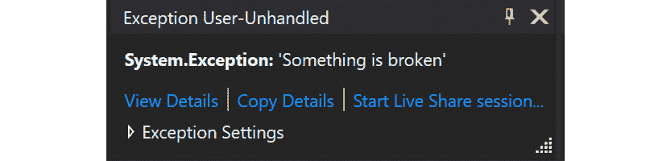
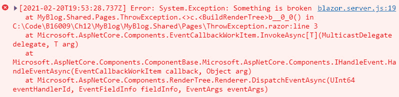

# *第十二章*:调试

在本章中，我们将看一下调试。Blazor 的调试体验很好，希望你没有被困在任何地方，不得不跳到这一章。

调试代码是解决 bug、理解工作流或简单查看特定值的真正好方法。Blazor 有三种不同的调试代码的方法，我们将看看其中的每一种。

在本章中，我们将介绍以下内容:

*   让事情破裂
*   调试 Blazor 服务器
*   调试 Blazor 网络程序集
*   在浏览器中调试 Blazor WebAssembly
*   热重装(几乎是真的)

要调试什么东西，首先要让什么东西坏掉！

# 技术要求

确保您已经阅读了前面的章节，或者使用`Chapter11`文件夹作为起点。

你可以在[https://github . com/PacktPublishing/Web-Development-wit-Blazor/tree/master/chapter 12](https://github.com/PacktPublishing/Web-Development-with-Blazor/tree/master/Chapter12)找到本章最终结果的源代码。

注意

如果您使用 GitHub 中的代码进入本章，请确保使用电子邮件注册用户，并按照说明添加用户和向数据库添加管理员角色。可以在 [*第八章*](08.html#_idTextAnchor122)*认证授权中找到说明。*

# 让事物破碎

埃德格·迪杰斯特拉曾经说过，

“如果调试是清除软件 bug 的过程，那么编程一定是把它们放进去的过程。”

这在本节中肯定是正确的，因为我们将添加一个会引发异常的页面:

1.  在`MyBlog.Shared`项目中，选择`Pages`文件夹，按 *Shift* + *F2* 。命名新文件`ThrowException.razor`。
2.  Replace the contents of the file with the following code block:

    ```cs
    @page "/ThrowException"
    <button @onclick="@(()=> {throw new Exception("Something is broken"); })">Throw an exception</button>
    ```

    这个页面只显示一个按钮，当你按下按钮时，它会抛出一个异常。

    太好了。我们有我们的应用的伊万德拉戈(他想打破你，但我们可能只是用一些花哨的调试击败他)。

下一步是看一下 Blazor 服务器调试。

# 调试 Blazor 服务器

如果您已经调试了任何类型的.NET 应用过去，你会有宾至如归的感觉。如果你没有，别担心，我们会完成的。调试 Blazor Server 正如我们可能期望的那样，并且是我们将介绍的三种不同类型的最佳调试体验。

我通常将我的 Razor 页面保存在一个共享库中，在构建我的项目时，我使用 Blazor Server 有两个原因——首先，运行项目会快一点，其次，调试体验更好。

让我们试一试！

1.  右键点击 **MyBlogServerSide** ，点击**设置为启动项目**。
2.  按 *F5* 开始项目(这次是调试)。
3.  使用网络浏览器，导航至`https://localhost:5001/throwexception`(端口号可能有所不同)。
4.  按 *F12* 显示网页浏览器开发者工具。
5.  在开发者工具中，点击**控制台**。
6.  Click the **Throw exception** button on our page.

    此时，Visual Studio 应请求焦点，并应显示异常，如图*图 12.1* :

    

    图 12.1–Visual Studio 中的异常

7.  按 *F5* 继续，切换回网页浏览器。我们现在应该能够在开发人员工具中看到异常消息，如图 12.2*所示:*



图 12.2–网络浏览器中的异常

正如我们在*图 12.1* 和*图 12.2* 中所看到的，我们在 Visual Studio 中调试时以及在开发人员工具中都得到了异常。

这使得在生产中的应用出现异常时很容易发现问题(打消这个念头)——这个特性已经拯救了我们很多次。

现在让我们尝试一个断点:

1.  在 Visual Studio 中，打开`MyBlog.Shared/Pages/Index.razor`。
2.  在`LoadPosts`方法的任何地方，通过点击最左边的边框(使一个红点出现)来设置断点。我们也可以通过按下 *F9* 来添加断点。
3.  返回网络浏览器，导航至`https://localhost:5001/`(端口号可能有所不同)。

Visual Studio 现在应该到达断点，通过悬停在变量上，我们应该能够看到当前值。

断点和异常调试都像我们预期的那样工作。接下来，我们将看一下调试 Blazor WebAssembly。

# 调试 Blazor WebAssembly

Blazor WebAssembly 当然也可以调试，但是有些事情我们需要思考。由于我们的共享库中有我们的异常页面，我们可以直接进行调试。

但是让我们从断点开始:

1.  右键单击**我的博客程序集。服务器**，选择**设置为启动项目**。
2.  按 *F5* 调试项目。

这里我们可以注意到第一个区别——假设我们仍然有在*调试 Blazor 服务器*部分(在`LoadPosts`方法中)设置的断点，断点没有被命中。

在 Blazor WebAssembly 中，断点不会在初始页面加载时被命中。我们需要导航到另一个页面，然后再次返回到索引页面。

我们不能像在 Blazor Server 中那样仅仅更改 URL，因为这将再次重新加载应用，并且不会触发断点，因为这是一个*初始页面加载*。

通过`launchsetting.json`文件中的以下代码行，可以调试 Blazor 网络程序集:

```cs
"inspectUri": "{wsProtocol}://{url.hostname}:{url.port}/_framework/debug/ws-proxy?browser={browserInspectUri}"
```

但是它是在我们创建项目时为我们提供的，所以我们不需要手动添加它。

如果我们愿意的话，我们也可以在我们的`MyBlogWebAssembly.Server`服务器项目中设置断点，它们会像我们预期的那样被命中。

现在让我们看看我们的异常会发生什么:

1.  在网页浏览器中，导航至`https://localhost:5001/throwexception`。
2.  点击**抛出异常**按钮。
3.  在 Visual Studio 中，未处理的异常不会被命中。我们在 web 浏览器的开发者工具中得到异常，如图*图 12.3* :


图 12.3–网络组装错误

Blazor WebAssembly 中的调试体验并不像 Blazor Server 那样完美，但是已经足够完美，能够完成工作。

我们还有一个方法要探索——在网络浏览器中调试。

# 在网页浏览器中调试 Blazor WebAssembly

Blazor WebAssembly 的第一次调试体验是在 web 浏览器中调试的能力:

1.  在 Visual Studio 中，按 *Ctrl* + *F5* 启动项目(不调试运行)。
2.  In the web browser, press *Shift* + *Alt* + *D*.

    我们将收到一条错误消息，其中包含如何在调试模式下启动 web 浏览器的说明。

    我正在运行 Edge，因此启动 Edge 的方法如下所示:

    ```cs
    msedge --remote-debugging-port=9222 --user-data-dir="C:\Users\Jimmy\AppData\Local\Temp\blazor-edge-debug" --no-first-run https://localhost:5001/
    ```

    复制命令。

3.  按 *Win* + *R* 粘贴命令。
4.  将会打开 Chrome 或 Edge 的新实例。在这个新实例中，按下*Shift*+*Alt*+*D*。
5.  我们现在应该看到一个源代码选项卡，其中包含我们项目中的 C#代码。从这里，我们可以放置将要命中的断点，并且可以悬停在变量上。

调试界面见*图 12.4:*


图 12.4–浏览器内调试的屏幕截图

在浏览器中调试 C#代码是相当惊人的，但是由于我们一直在 Visual Studio 中直接调试，我个人认为这种调试没有太大的用处。

接下来，我们将看看一些可能不在调试范围内，但在开发 Blazor 应用时非常有用的东西。

# 热重装(几乎是真货)

和.NET 5，当我们对代码文件进行更改时，我们能够重新加载我们的 Blazor 站点。用户要求热重装，微软的目标是在 2010 年发布热重装.NET 6 时间框架。

要进行设置，请执行以下操作:

1.  在 Visual Studio 中，选择**工具**菜单，然后选择**选项**。
2.  选择**项目和解决方案**，然后选择**ASP.NET Core**。
3.  在**常规**标题下的右框中，保存更改后，将**自动构建和刷新**选项的值更改为**自动构建和刷新浏览器。**
4.  右键点击 **MyBlogServerSide** ，选择**设置为启动项目**。
5.  现在按 *Ctrl* + *F5* 运行项目(只工作不调试)。
6.  在网页浏览器中，通过在网址中添加`/counter`调出计数器页面。
7.  Make a change to the `Pages/Counter.razor` file and click **Save**.

    我们的网络浏览器现在应该重新加载，并且将显示更改。

这也可以从命令行运行以下命令:

```cs
dotnet watch run
```

不过，这种方法有几个限制:

*   它不适用于运行 ASP.NET 服务器后端的 Blazor WebAssembly(正如我们在项目中所做的那样)。为此，我们需要手动重新加载浏览器。
*   应用的状态将重新启动。
*   共享项目中的更改不会得到反映。

因此，对于我们的设置来说，这个特性并不是非常有益，但是如果我们的项目没有落入前面提到的任何限制中，这确实是很好的。

# 总结

在这一章中，我们研究了调试 Blazor 应用的不同方法。总会有这样的时刻，我们需要一步一步地检查代码，要么找到一个 bug，要么看看发生了什么。当这些时刻到来时，Visual Studio 会提供世界一流的功能来帮助我们实现目标。

好的一面是调试 Blazor 应用，无论是 Blazor 服务器还是 Blazor WebAssembly，都可以像您对微软产品的期望一样工作。我们得到的 C#错误(在大多数情况下)很容易理解和解决。

在下一章中，我们将看看如何测试我们的 Blazor 组件。